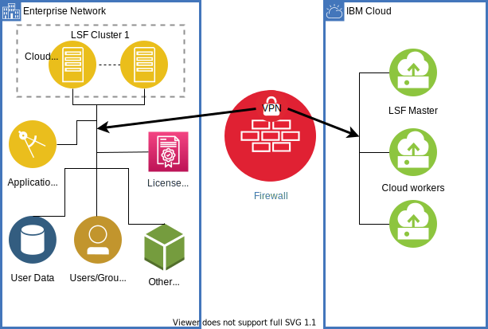

{:step: data-tutorial-type='step'}
{:shortdesc: .shortdesc}
{:new_window: target="_blank"}
{:codeblock: .codeblock}
{:screen: .screen}
{:tip: .tip}
{:pre: .pre}
{:important: .important}
{:note: .note}

# Extend an existing IBM Spectrum LSF cluster to the {{site.data.keyword.vpc_short}}
{: #hpc-eda}
{: toc-content-type="tutorial"}
{: toc-services="vpc, direct-link"}
{: toc-completion-time="2h"}

<!--##istutorial#-->
This tutorial may incur costs. Use the [Cost Estimator](https://{DomainName}/estimator/review) to generate a cost estimate based on your projected usage.
{: tip}

<!--#/istutorial#-->

Electronic Design Automation (EDA) requires a complex set of tools that are resource intensive. These workloads are commonly run on [IBM Spectrum LSF](https://www.ibm.com/products/hpc-workload-management).

An EDA workload currently running in IBM Spectrum LSF in an on-premises data center is a good candidate to evolve to a hybrid cloud environment.  There are many reasons to consider shifting some or all of an existing on-premises EDA workload to the {{site.data.keyword.cloud}}.  Many reasons might be specific to a particular enterprise, but this tutorial focuses on cost, speed and flexibility.  {{site.data.keyword.vpc_full}} offers significantly more compute power that you can provision and return quickly to address increasing or decreasing demand and still allow you to manage costs.  
{: shortdesc}

You can span a IBM Spectrum LSF cluster between on-premises and cloud domains in two ways:
* A stretch cluster operates as a single cluster with a single (on-premises) master that spans two domains by communicating over a secure network.  
* A multi-cluster consists of two or more independent, but closely cooperating clusters, each with its own master, operating on its own domain and linked by a secure network.

This tutorial focuses on building and configuring the following hardware and software for a IBM Spectrum LSF Multi-Cluster:
* An on-premises IBM Spectrum LSF Cluster
* A cloud based IBM Spectrum LSF Cluster
* A VPN connecting the on-premises network to {{site.data.keyword.vpc_short}}
* Storage

## Objectives
{: #hpc-eda-objectives}

* Extend an existing on-premises IBM Spectrum LSF cluster to the {{site.data.keyword.vpc_full}}.

The following diagram shows how the IBM Spectrum LSF on-premise cluster is extended in the cloud.

{: class="center"}
{: style="text-align: center;"}

## Before you begin
{: #hpc-eda-prereqs}

You need the following to complete this tutorial:
* Because this tutorial demonstrates how to add compute capacity to your on-premise Spectrum LSF cluster, it assumes you have an  on-premise Spectrum LSF version 10.2 cluster already installed.
* Red Hat&reg; Ansible&reg; version 2.7 or higher
* [Terraform CLI and the IBM Cloud Provider plug-in](/docs/terraform?topic=terraform-getting-started)

You will also need the following in {{site.data.keyword.cloud_notm}}:

* An {{site.data.keyword.cloud_notm}} billable account
* {{site.data.keyword.cloud_notm}} CLI

You will find instructions to download and install these tools for your operating environment in the [Getting started with tutorials](/docs/solution-tutorials?topic=solution-tutorials-tutorials) guide.

## Set up the {{site.data.keyword.cloud_notm}} CLI
{: #hpc-eda-set-up-cli}
{: step}

1. If possible, log in to the on-premise master node as the root user.
2. Install the {{site.data.keyword.cloud_notm}} CLI. See [Installing from the shell](/docs/cli?topic=cli-install-ibmcloud-cli#shell_install).
3. Test the {{site.data.keyword.cloud_notm}} CLI:

   ```sh
   ibmcloud dev help
   ```
   {: pre}

4. Log in to the {{site.data.keyword.cloud_notm}} with your credentials:

   ```sh
   ibmcloud login
   ```
   {: pre}

5. Add the VPC infrastructure capabilities plugin to the CLI:

   ```sh
   ibmcloud plugin install vpc-infrastructure
   ```
   {: pre}

6. Add DNS-related commands:

   ```sh
   ibmcloud plugin install DNS
   ```
   {: pre}

7. Set the infrastructure (is) commands target to {{site.data.keyword.vpc_short}}:

   ```sh
   ibmcloud is target --gen 2
   ```
   {: pre}

8. Select the region where you would like your cloud resources to reside and set them as the target. You can use `ibmcloud is regions` to list them. If you choose the region "us-south", the command is the following:

   ```sh
   ibmcloud target -r us-south
   ```
   {: pre}

## Prepare your environment
{: #hpc-eda-prep-environment}
{: step}

### Specify the cloud cluster configuration
{: #hpc-eda-specify-cloud-cluster-configuration}

With the {{site.data.keyword.cloud_notm}} CLI now configured, you can get the LSF hybrid cloud scripts and use the CLI to gather the information that you need to set up and use the automated provisioning and cloud cluster setup scripts.

1. Download or clone the [IBM Spectrum LSF hybrid cloud scripts](https://github.com/IBMSpectrumComputing/lsf-hybrid-cloud) from GitHub.

   ```sh
   git clone https://github.com/IBMSpectrumComputing/lsf-hybrid-cloud.git
   ```
   {: pre}

2. Copy the tf_inventory.in file to tf_inventory.yml.
3. Fill out the parameters in the tf_inventory.yml file. See [The tf_inventory.yml file parameters](#tf_inventory-parameters).
4. Save the tf_inventory.yml file and create a backup copy.

#### The tf_inventory.yml file parameters
{: #hpc-eda-tf_inventory-parameters}

Much of the work needed to configure your cloud cluster is configuring the following parameters in the tf_inventory.yml file:

|Parameter|Description|
|---------|-----------|
|vpc_region|The available geographic regions for {{site.data.keyword.vpc_short}} resources can be displayed with the command:  \n  \n `ibmcloud regions`  \n  \n In most cases, choose the region that is nearest your datacenter.|
|vpc_zone|Display the available zones for the target region (set in step 1).  \n Zones exist primarily to provide redundancy within a given region.  For the purposes of this tutorial, choose any of the available zones within a region.  \n  \n `ibmcloud is zones`|
|resource_prefix|This can be any value. It must be only lowercase letters, numbers, hyphens, and is limited to 50 characters. This limitation to allows Terraform space to append descriptive suffixes to each resource.|
|domain_name|Your domain name.|
|worker_nodes|The number of LSF worker nodes to deploy to the cluster.|
|master_nodes|The number of LSF master nodes to deploy to the cluster.|
|key_name|This is the name of an ssh public key that you have stored in the IBM Cloud. This key will be added to the access list of all newly provisioned virtual resources.  \n Note: If you use the key name of the public key for the machine and userid you plan to use for the deployer (such as /root/.ssh/id_rsa.pub), you will not need to add anything to the access lists of all the nodes before deploying LSF.  \n You can create the key instance in the cloud using the following commands:  \n `ibmcloud is keys (to view existing keys)`  \n `ibmcloud is key-create <descriptive name for key> @/root/.ssh/id_rsa.pub` |
|ssh_key_file|The ssh key file for the deployer that you will be using to log in to your provisioned hosts. Typically, this is id_rsa unless you are using a non-standard file name. The name of the matching public key will be inferred as &lt;name of private key&gt;.public (such as id_rsa.public).|
|lsf_cluster_name|The name you want LSF to apply to your cloud based cluster.|
|worker_profile\n master_profile  \n login_profile  \n |These are the names of the instance profiles that you would like created for the three  different types of instances.  The instance profile is a unique name (based on a terse description) for a particular profile.  You can see a listing of all available profiles and their associated attributes for your region with the following command:  \n  \n `ibmcloud is in-prs`  \n  \n The profiles you choose should be  specific to your workload needs for the worker and master. The login profile will likely be a minimal configuration.|
|image_name|This should be a recent RedHat or Centos amd64 release. You can see the available options with the following command.  \n  \n `ibmcloud is images`|
|volume_capacity|The size in Gigabytes for the cloud NFS volume your cloud cluster nodes will share.|
|volume_dir|The mount point for the cloud shared NFS volume.|
|vpn_peer|_address_: The public IP address of your on-premises VPN gateway.  \n _cidrs_: A list of CIDRs for the private IPs that will be accessible in your VPC.  \n _psk_: A passkey for authenticating with the VPN.  You can encrypt using ansible-vault.  \n  \n `echo -n <your_key>  ansible-vault encrypt_string --ask-vault-pass`  \n  \n _Security_:There are a number of parameters in this section.  You can configure them now or they can be left to the defaults and edited as needed when you prepare the vpn.yml file in Step 5: Connect Your on-premises and {{site.data.keyword.cloud_notm}} Networks with a VPN.  \n Note: If you intend to install Terraform using the Ansible playbook as described below in Step 4: Provision the Cloud Resources, you can customize the installation to place the Terraform command and the {{site.data.keyword.cloud_notm}} Terraform plugin in your preferred locations.  The defaults will probably work in most cases.|
|tfbinary_path|Location to install the Terraform command.|
|tfplugin_path|The location of the IBM Cloud specific Terraform plugin.|

### Create an {{site.data.keyword.cloud_notm}} API key
{: #hpc-eda-create-api-key}

You need an {{site.data.keyword.cloud_notm}} API key for your cloud account to provide Terraform with the credential it needs to provision resources on your behalf. If you do not already have an `api-key`, you can create one with the following commands:

1. If you are not already logged in, log in to the {{site.data.keyword.cloud_notm}} CLI:

   ```sh
   ibmcloud login
   ```
   {: pre}

2. Create the API key:

   ```sh
   ibmcloud iam api-key-create <name of key> --file <file to write the key> -d "your description of the key"
   ```
   {: pre}

3. You can find your API key in the text file (the file name you supplied for the `--file` parameter) on the line labeled `apikey`. Copy that key and store it in an environment variable where Terraform can find it:

   ```sh
   export IBMCLOUD_API_KEY="<the apikey from the text file you just created>"
   ```
   {: pre}

## Provision the cloud resources
{: #hpc-eda-provision-cloud-resources}
{: step}

If it is not already installed, you need Ansible version 2.7 or higher installed to continue.  If Ansible is already installed, be sure to check the version and update if necessary.

1. After Ansible is installed, use an Ansible playbook to install Terraform and the {{site.data.keyword.cloud_notm}} Terraform plugin:

   ```sh
   ansible-playbook -i tf_inventory.yml create_vpc.yml --tags "install-terraform"
   ```
   {: pre}

2. The `create_vpc.yml` playbook is a hybrid that combines Ansible configuration with Terraform provisioning. You won’t interact directly with Terraform because all of the functions are orchestrated by Ansible. Because Terraform runs behind the scenes, some of the output files from this process will be familiar to Terraform users. These output files are needed to access the newly provisioned resources and complete the cluster setup. Before running the playbook, specify the location of the files by setting the `GEN_FILES_DIR` environment variable to tell the playbook where you would like the output files placed:

   ```sh
   export GEN_FILES_DIR=<a directory of your choice>
   ```
   {: pre}

   This playbook invokes Terraform to do the following:
   *	Creates and configures the {{site.data.keyword.vpc_short}} based on the parameters you provided in the `tf_inventory.yml` file
   *	Provisions the specified master and worker virtual instances
   *	Provisions a login box that will be used as a deployer and login jump box for the cluster
   *	Provisions and configures a DNS server
   *	Provisions storage for the virtual instances including storage for the NFS volume
   *	Provisions a floating IP (fip) for the login node.  This is a public IP used to SSH into the cluster.
   *	Creates an Ansible inventory file for the cluster to be used by subsequent Ansible playbooks

3. If this is the first time you are running the playbook, ensure that there is not an existing copy of the `terraform.tfstate` file in `GEN_FILES_DIR`. If you previously ran the playbook and it failed, don't delete the `terraform.tfstate` file. You will need it to restart the playbook, beginning with place that it failed.
4. Run the playbook:

   ```sh
   ansible-playbook -i tf_inventory.yml create_vpc.yml
   ```
   {: pre}

In addition to provisioning all of the cloud resources to create your cloud-based LSF cluster, this command creates the following files in the directory that you specified with the `GEN_FILES_DIR` environment variable:
* **cluster.inventory**: To use with subsequent steps (including resource connector)
* **ssh_config**: An ssh config file to allow direct login to private IPs from the inventory (`ssh -F <ssh_config> <host>`)
*	**terraform.tfstate**: Terraform status (required for tear down of resources)
*	**terraform.tfvars**: Terraform variables (required for tear down of resources)
*	**GEN2-cfg.yml**: Needed as input for the resource connector
*	**vpn.yml**: Ansible playbook to be used to set up the VPN gateway
* **clusterhosts**: An `/etc/hosts-style` file with the cluster master and worker nodes

You can verify the resources that were created by viewing the `terraform.tfstate` file. You can get a quick overview by looking at the `resource_name` tag in the `terraform.tfstate` file:

   ```sh
   grep resource_name $GEN_FILES_DIR/terraform.tfstate
   ```
   {: pre}

## Connect your on-premises and cloud networks with a VPN
{: #hpc-eda-connect-on-premises-cloud-networks-vpn}
{: step}

In the previous section, one of the resulting files created was `${GEN_FILES_DIR/vpn.yml}`. This playbook will be used to create a VPN. If you completed all of the information in the `tf_inventory.yml` file, the `vpn.yml` file should contain the information for this section.

1. Open the `vpn.yml` file and verify the information. You might need to edit the following fields:
   * **peer_address**: The IP of your on-premises VPN gateway.
   * **peer_cidrs**: A list of CIDR blocks of your on-premises network that you want to access from this VPN.
   * **preshared_key**: A passphrase or key that provides access to your on-premises VPN gateway.
   * **security**: The setting in this section needs to match the settings for your on-premises appliance.

2. Run one of the following playbooks (VPN Option 1 or VPN Option 2).

   **VPN Option 1 - Using an on-premises public IP and VPN appliance**

    Connect your VPC with your on-premises subnet by using a site-to-site VPN between your cloud VPN gateway and your on-premises gateway. This adds an additional section to the `vpn.yml` file with information that is needed to remove this resource later. Affter running the command, you will have a VPN connection between your on-premises network and your VPC:

    ```sh
    ansible-playbook -i ${GEN_FILES_DIR}/cluster.inventory static_cluster.yml --tags "vpn"
    ```
    {: pre}

   **VPN Option 2 - Using OpenVPN with on-premises as client**

    Use OpenVPN to connect your on-premises cluster with your cloud cluster. This option is useful because _VPN Option 1_ requires opening a public IP and employing a VPN appliance. This can be cumbersome and expensive to set up, and might be unnecessary if you are experimenting with a non-production phase of a multi-cluster implementation. With this _VPN Option 2_, you can set up a multi-cluster and start experimenting with your workload on a small scale.  

    This option is less secure than _VPN Option 1_.
    {: note}

    The following script will:
    * Configure the epel yum repository if it is not already enabled.
    * Install the OpenVPN client.
    * Create a VPN connecting the on-premises network to the cloud.
    * Add information about the VPN to the `vpn.yml` file that is needed to remove the VPN.

       ```sh
       ansible-playbook -i ${GEN_FILES_DIR}/cluster.inventory static_cluster.yml --tags "open_vpn"
       ```
       {: pre}

3. Clean up the VPN. The following command is common for either type of VPN. It takes down the VPN and removes associated policies.

   ```sh
   ansible-playbook -i ${GEN_FILES_DIR}/cluster.inventory static_cluster.yml --tags "clean_vpn"
   ```
   {: pre}

4. You can use SSH to access cloud nodes through the private network. If your VPN is down, but you need to access cloud nodes, this command can be useful to SSH to a cloud node from the on-premises master (no VPN required).

   ```sh
   ssh -F ${GEN_FILES_DIR}/ssh_config <local IP: 10.x.x.x>
   ```
   {: pre}

## Deploy LSF on {{site.data.keyword.cloud_notm}} to create the cluster
{: #hpc-eda-deploy-lsf-cloud-cluster}
{: step}

1.	To install and configure LSF on IBM Cloud, you will need to provide some information to the LSF install scripts by configuring the `lsf_install` file in the `group_vars` directory with the following parameters:   
   
    |Parameter|Description|
    |---------|-----------|
    | **local_path**| The full path to the directory where the lsf binary resides on the local machine.|
    | **target_path**| The full path to where the lsf binary will be copied on the cloud master.|
    | **bin**| The name of the LSF install file which currently resides in the local_path.|
    | **multicluster**:  \n cloud: conf_dir | Location where you would like the cloud cluster conf file to reside: Typically, it will be `/opt/ibm/lsfsuite/lsf/conf`.|
    | **onprem**:  | The LSF conf file location and the name of the on-premises cluster.  \n - conf_dir: `/opt/ibm/lsfsuite/lsf/conf`  \n - cluster_name: onPremCluster  \n - host: hostname of the on premises LSF master  \n - ip: IP address of the on-premises LSF master   |
    | **sndqueue** | The name of the on-premises queue the forwards jobs to the cloud cluster.|
    | **lsf_user_list**| List of users to be enabled to run jobs on the cloud.|
    | **vpn** | ip: &lt;vpn_server_ip&gt; | 
   
2. Install LSF:

   ```sh
   ansible-playbook -i ${GEN_FILES_DIR}/cluster.inventory static_cluster.yml --tags "setup"
   ```
   {: pre}

   The install command does the following:
   * Copies the LSF installation binary to the deployer.
   * Installs the necessary packages on the deployer.
   * Sets up the NFS server on the deployer including creating and mounting the filesystem.
3. Configure the data manager. For a workload that requires a significant amount of input data, generates a large amount of output data, or both, efficient data management is important. The Spectrum LSF Data Manager provides a number of highly configurable strategies to optimize compute time, network bandwidth, and costs related to data movement.   
   ```sh
   ansible-playbook -i ${GEN_FILES_DIR}/cluster.inventory static_cluster.yml --tags "config_dm"
   ```
   {: pre}

4. Configure the on-premises queues and settings for LSF.   
   ```sh
   ansible-playbook -i ${GEN_FILES_DIR}/cluster.inventory static_cluster.yml --tags "mc_onprem"
   ```
   {: pre}

   If you see an error when running this script for `mc_onprem`, you might need to limit the network interfaces that are scanned to just those that will be part of the cluster network.  This can be accomplished by uncommenting the “interfaces” tag in the `lsf_install` file and listing the necessary interfaces.
   {: note}

5. Configure the cloud queues and settings for LSF.   
   ```sh
   ansible-playbook -i ${GEN_FILES_DIR}/cluster.inventory static_cluster.yml --tags "mc_cloud"
   ```
   {: pre}

## Verify and test the multi-cluster
{: #hpc-eda-verify-test-multi-cluster}
{: step}

From the on-premises master node, complete the following steps.

1. The `lsclusters` command displays the two clusters that make up the multi-cluster:

   ```sh
   lsclusters
   ```
   {: pre}

   The output of the command should show both the on-premises and cloud clusters.

2. The `bqueues` command displays the normal default array of lsf queues but should also contain the queue that can be used to send jobs to the cloud cluster. The name of this queue is specified by the `sndqueue:` variable in the `lsf_install` file.

   ```sh
   bqueues
   ```
   {: pre}

3. Submit a job to the cloud queue with the `bsub` command and then confirm it with the `bjobs` command.

   ```sh
   bsub -q <your cloud queue>
   ```
   {: pre}

   ```sh
   bjobs
   ```
   {: pre}

## Remove resources
{: #hpc-eda-remove-resources}
{: step}

To clean up any resources that you created in this tutorial, use the following procedure. 

Make sure `GEN_FILE_DIR` is set.
{: note}

   ```sh
   ansible-playbook -i ${GEN_FILES_DIR}/tf_inventory.yml clean_vpc.yml
   ```
   {: pre}

As an alternative, you can use the [{{site.data.keyword.cloud_notm}} Resource List](https://{DomainName}/resources) or the CLI to remove these resources individually.
