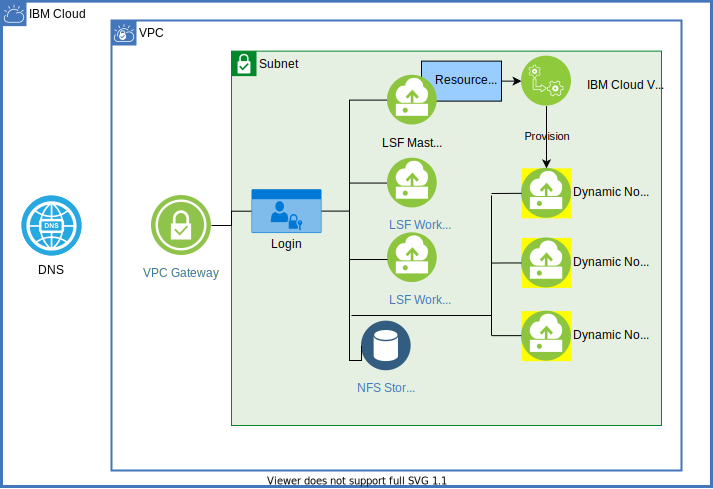

{:step: data-tutorial-type='step'}
{:shortdesc: .shortdesc}
{:new_window: target="_blank"}
{:codeblock: .codeblock}
{:screen: .screen}
{:tip: .tip}
{:pre: .pre}
{:important: .important}
{:note: .note}

# Add auto scaling to existing IBM Spectrum LSF cluster on IBM Cloud VPC
{: #hpc-lsf-vpc-auto-scale}
{: toc-content-type="tutorial"}
{: toc-services="vpc"}
{: toc-completion-time="2h"}

When demand exceeds available compute resources, IBM Spectrum LSF clusters that are hosted in the {{site.data.keyword.cloud}} can autonomously grow to meet demand. Later, when demand recedes, the cluster can quickly and automatically shed compute capacity to reduce cost. This feature, commonly known as auto scaling, is provided by the LSF resource connector working closely with the {{site.data.keyword.vpc_short}}.

This tutorial takes you through the process of enabling and configuring the LSF resource connector on an existing {{site.data.keyword.cloud_notm}} VPC-based LSF cluster. 
{: shortdesc}

If you are not starting with an existing cluster, there are two automated paths available to get you started with an LSF cluster in VPC:
1. If you want to start with an LSF cluster hosted in an on-premises data center and extend it to the cloud to create a multi-cluster, see [Extend an existing IBM Spectrum LSF cluster to the {{site.data.keyword.vpc_short}}](/docs/solution-tutorials?topic=solution-tutorials-hpc-eda).
2. If you want to start with a purely cloud-based LSF cluster, see [Provision an IBM Spectrum LSF cluster on the {{site.data.keyword.vpc_short}}](/docs/solution-tutorials?topic=solution-tutorials-hpc-lsf-on-vpc).

Regardless of how you begin your VPC-based LSF cluster, the process of adding auto scaling to the cluster is the same.

## Objectives
{: #hpc-lsf-vpc-auto-scale-objectives}

* Enable the LSF resource connector
* Configure the resource connector 
* Demonstrate the resource connector by adding demand to create new dynamic nodes

## Architecture
{: #hpc-lsf-vpc-auto-scale-architecture}
 
{: class="center"}
{: style="text-align: center;"}

## Before you begin
{: #hpc-lsf-vpc-auto-scale-prereqs}

You need the following to complete this tutorial:

1. A cloud-based LSF cluster with the following attributes:
    * Installed with the 10.1.0.11 or newer version of LSF (or the HPC Suite version 10.2.0.11)
    * Install the latest updates from LSF. For details on downloading and installing updates, see these [GitHub instructions](https://github.com/IBMSpectrumComputing/lsf-hybrid-cloud/tree/master/LSF_On_IBM_Cloud/resource_connector/README.md){: external}.
    * Root access to the LSF master host
    * An RSA SSH key pair on the master host
    * SSH access (no password required) from the master to all of the hosts in the cluster
    * Ability to restart the LSF cluster daemons
    * IBM VPC DNS service with DNS records for all existing static nodes
2. An IBM VPC deployable LSF image with LSF 10.1.0.11 installed and configured. For instructions on creating a custom deployable LSF image for VPC, see these [GitHub instructions](https://github.com/IBMSpectrumComputing/lsf-hybrid-cloud/tree/master/LSF_On_IBM_Cloud/resource_connector/README.md){: external}.
3. A deployer instance installed with the following software (see Step 1 for suggestions on choosing a deployer):
    * Red Hat&reg; Ansible&reg: version 2.9 or later
    * {{site.data.keyword.cloud_notm}} CLI with plugins for Cloud DNS and VPC infrastructure
4. An {{site.data.keyword.cloud_notm}} billable account
5. The [resource connector setup scripts](https://github.com/IBMSpectrumComputing/lsf-hybrid-cloud/tree/master/LSF_On_IBM_Cloud){: external}

## Choose a deployer
{: #hpc-lsf-auto-scale-choose-deployer}
{: step}

The term "deployer" is applied to the machine that you use to set up the cluster. The machine needs SSH access to the cluster's master node. A Linux instance in the cloud is preferred, but you can use any machine that can host the {{site.data.keyword.cloud_notm}} CLI and run Ansible scripts. 

## Set up the IBM Cloud CLI
{: #hpc-lsf-auto-scale-set-up-cli}
{: step}

1. Log in to the machine that you will use for this deployment.
2. Install the {{site.data.keyword.cloud_notm}} CLI. See [Installing from the shell](/docs/cli?topic=cli-install-ibmcloud-cli#shell_install).
3. Test the {{site.data.keyword.cloud_notm}} CLI:
  
   ```sh
   ibmcloud dev help
   ```
   {: pre}

4. Log in to the {{site.data.keyword.cloud_notm}} with your credentials:

   ```sh
   ibmcloud login
   ```
   {: pre}

5. Add the VPC infrastructure capabilities plugin to the CLI:

   ```sh
   ibmcloud plugin install vpc-infrastructure
   ```
   {: pre}

6. Add DNS-related commands:

   ```sh
   ibmcloud plugin install DNS
   ```
   {: pre}

7. Set the infrastructure (is) commands to target {{site.data.keyword.vpc_short}}:

   ```sh
   ibmcloud is target --gen 2
   ```
   {: pre}

8. Select the region where you would like your cloud resources to reside and set them as the target. You can use `ibmcloud is regions` to list them. If you choose the region "us-south", the command is the following:

   ```sh
   ibmcloud target -r us-south
   ```
   {: pre}

## Install Ansible version 2.8 or greater
{: #hpc-lsf-auto-scale-install-ansible}
{: step}

Install Ansible on your deployer machine. For instructions on installing Ansible on all platforms, see [Installing Ansible](https://docs.ansible.com/ansible/latest/installation_guide/intro_installation.html){: external}.

## Download or clone the setup scripts from GitHub
{: #hpc-lsf-auto-scale-download-scripts}
{: step}

Change to a directory on your deployer where you would like the setup scripts to live and run the following command:

   ```sh
   git clone https://github.com/IBMSpectrumComputing/lsf-hybrid-cloud.git 
   ```
   {: pre}

You need to install Git if it's not already present on your deployer. Once the scripts are on your deployer, switch to the new `lsf-rescon-automation` directory then to the playbook directory. File locations in this tutorial assume that you know the location of the playbook directory.
{: note}

The repository contains files that can be used to create several types of LSF clusters in the {{site.data.keyword.cloud_notm}}, but for the purposes of this tutorial, you only need the files in the `LSF_On_IBM_Cloud/resource_connector` directory. Navigate to this directory now. The directories and files referenced in the tutorial are all relative to the `resource_connector` directory.

## Prepare your IBM Cloud API key
{: #hpc-lsf-auto-scale-prepare-api-key}
{: step}

The API key is the credential that you provide to the cloud API, which allows it to create resources for you. 

1. You can create an API key by using the following {{site.data.keyword.cloud_notm}} CLI command:

   ```sh
   ibmcloud iam api-key-create
   ```
   {: pre}

2. Make your key available by exporting it to your shell environment under the name "IBMCLOUD_API_KEY":

   ```sh
   export IBMCLOUD_API_KEY=<your api key>
   ```
   {: pre}

## Prepare an inventory for your cluster
{: #hpc-lsf-auto-scale-prepare-inventory-for-cluster}
{: step}

1. Locate an existing inventory file or create a new one for the LSF cluster where you want to enable the resource connector. If you originally created your cluster by using one of the existing sets of automation scripts and documentation from the LSF GitHub repository, you should already have an inventory file, `tf_inventory.yml`, located in the directory specified with the `$GEN_FILES_DIR` (for details, see the documentation that you used to create the cluster). If you don't have one, use the following format to create an inventory file:  

   ```sh
   [local]
   localhost ansible_connection=local

   [LSF_Masters]
   lsf-master

   [LSF_Servers]
   lsf-worker-0
   lsf-worker-1
   ```
   {: screen}

   The listed machines have to be accessible by password-less SSH from your deployer machine by the exact hostname or specified IP. The host in the [local] group is where the playbooks are going to run (for example, the "deployer"). 
   {: important}

2. You can choose the name and location of the inventory, but you need to note the name and path and specify them on every invocation of Ansible playbooks. The commands listed in this tutorial assume the filename to be `inventory-file` and that it is located in the playbook directory. If you use that convention, you can copy and paste the Ansible playbook commands from this tutorial. If you are using one in `GEN_FILES_DIR`, substitute `$GEN_FILES_DIR/tf_inventory.yml` for `inventory-file`. 

## Examine and update the group variables file
{: #hpc-lsf-auto-scale-examine-update-group-variables-file}
{: step}

The group variables file you need to edit is in the package of files that you obtained from GitHub in Step 4. This file is a set of global variables that are available to all of the Ansible configuration scripts. It is located in `playbook/group_vars/all`. You will edit it to describe the directory structure of your LSF master. 

This file uses the Ansible conventions for assignment of variables where ":" assigns and double brackets "{{variable name}}" are replaced by the assigned value of the variable.
{: note}

The file is annotated and should be straightforward to fill out based on the information from your LSF master node. Many of the lines refer to previously defined variables and standard locations. Make sure to confirm every line, but you will not likely need to edit outside the sections that are denoted with "<>" brackets. 

The following is a summary of the relevant lines in the file. The file itself is annotated with more detail:

```sh
LSF_SUITE_TOP: <path to the “lsfsuite” directory> 
LSF_TOP: "{{ LSF_SUITE_TOP }}/lsf" 
LSF_CONF_DIR: "{{ LSF_TOP }}/conf" 
LSF_WORK_DIR: "{{ LSF_TOP }}/work" 
LSF_VER_DIR: "{{ LSF_TOP }}/10.1" 
# The jq binary needs to be available in LSF_GUI_BIN/ 
LSF_GUI_BIN: "{{ LSF_SUITE_TOP }}<typically: /ext/gui/3.0/bin"> 
LSF_LOG_DIR: <typically “lsflogs”> 
LSF_NFS_MNT_DIR: <where your cluster mounts its NFS filesystem> 
LSF_CLUSTER_NAME: <use the “lsid” command on your LSF master if you are unsure>
rc_image_LSF_TOP: <path> 
```
{: screen}

## Fill out the GEN2-config.yml file
{: #hpc-lsf-auto-scale-fill-out-yml-file}
{: step}

This file provides the information that the {{site.data.keyword.cloud_notm}} needs to create your dynamic hosts. You need to fill out the file with the following information to match your existing cluster:

The bracketed "<>" descriptor gives you an idea of what type of data the file requires. For example, `<ID>` refers to the alpha-numeric strings in the command output that look like “c86af110-a6e2-40b4-bc5f-c2271532395b". Others are simply numbers or strings.
{: note}

You can use a helper script that is available in `playbook/scripts/get-vm-info.sh` to speed up the process of gathering the following parameters. You can run it by using your master node's {{site.data.keyword.cloud_notm}} name (`ibmcloud is instances` displays the names of all instances in your account including the master). Essentially, the script needs the name of an instance in your cluster's VPC.
{: tip}

|Parameter|Description|
|---------|-----------|
|GEN2_Region: `<ID>`|The geographic region where resources are physically located. You can see options with the command:  \n   `ibmcloud is regions`|
|GEN2_Zone: `<ID>`|Zones exist primarily to provide redundancy within a given region. To view available zones, run the following command:  \n   `ibmcloud is zones`|
|GEN2_VPC_ID: `<ID>`|The ID for VPC where the cluster resides. See a listing of VPCs in your cloud account with:  \n   `ibmcloud is vpcs`|
|GEN2_Image_ID: `<ID>`|The ID for the LSF instance image that you will provision for all of the resource connector provisioned nodes. In this case, it will either be a stock LSF image from the catalog or a custom image that you've created that already contains LSF binaries. You can see available images with:  \n   `ibmcloud is images`|
|GEN2_SUBNET_ID: `<ID>`|Specify the ID for the subnet. Typically, there is one subnet per VPC. This subnet is the one that contains your master and existing worker nodes. List subnets with the command:  \n   `ibmcloud is subnets`|
|GEN2_SG_ID: `<ID>`|The security group that will be applied to the resource connector provisioned nodes. The security group should match the one used by the master node. See available options with the command:  \n   `ibmcloud is security-groups`|
|GEN2_PROFILE: `<profile name string>`|The profile describes the hardware characteristics of the instance. You can see available options with the command:  \n   `ibmcloud is instance-profiles` |
|CORES_PER_SOCKET: `<num>`   \n SOCKET_PER_NODE: `<num>`   \n   MEMORY_PER_NODE: `<number specifying memory in MiB>` | These options are the hardware characteristics for the node that you would like to report to LSF. Typically, these tell LSF the machine characteristics that you select. You can view them with the command:  \n  `ibmcloud is instance-profile <profile name>`|
|GEN2_DNS_SVCS_ENDPOINT: https://api.dns-svcs.cloud.ibm.com|This is the API endpoint for VPC DNS services. You can leave it as is since it's unlikely to change.|
|GEN2_DNS_Instance_ID: `<ID>`|The DNS instance associated with your VPC `ibmcloud dns instances`. If you created the cluster by using the existing automation, your DNS instance has a name with a prefix that matches your VPC name.|
|GEN2_DNS_Zone_ID: `<ID>`|The DNS zone associated with the DNS instance. You can find your zone ID by setting the target to match the ID of the instance:  \n  1. `ibmcloud dns instance-target <ID>`, then  \n 2. List the available zones with `ibmcloud dns zones`|
|GEN2_DNS_Domain_Name: `<a string with your VPC's domain name>`|This should match the domain name that you specified when you created the cluster. If you ran the `ibmcloud dns zones` command, the domain is listed as well.|
|lsf_key_name: `<key name string>`|The key name of the RSA public key that is on the LSF master. You can display all of the keys in your account with the command:  \n  `ibmcloud is keys`|
|rc_maxNumber: `<number>`|If there is sufficient load, the resource connector keeps adding hosts until you reach this number.|
|rc_vm_prefix: `<string>`|This is the prefix that will be used in the name of new hosts created by the resource connector.|
|lsf_master_ip: `<IP address>`|The IP address of the master node.|
|lsf_master_hostname: `<hostname>`|The hostname of the master node.|
{: caption="Table 1. Configuration file parameters and descriptions" caption-side="top"}

The scripts you downloaded have a helper script to make filling out the DNS parameters easier. You can find the script in `playbook/scripts/get-dns-info.sh`. To use the script, supply the instance name for your VPC's DNS service. You can display that with `ibmcloud dns_instances`.
{: tip}

## Run the configuration Ansible playbooks
{: #hpc-lsf-auto-scale-run-configuration-ansible-playbooks}
{: step}

After you fill out the information for the configuration files, automation can take over and the resource connector is configured and enabled on the cluster. To get started, switch to the playbook directory.

The set up and configuration is broken out into four steps, but you can also choose to run the following playbook, which calls the four steps in order for you: 

   ```sh
   ansible-playbook -i inventory-file step-all-setup-rc.yml
   ```
   {: pre}

The advantage of running the scripts separately is that you can quickly spot and fix any configuration errors in your files. If you do use `step-all-setup-rc.yml`, you can skip the following steps.
{: note}

1. Install tools

   The resource connector requires Python 3 and the {{site.data.keyword.vpc_short}} and Networking Services API libraries to be installed on the master node. Run the following script to carry out those tasks:

   ```sh
   ansible-playbook -i inventory-file step1-install-tools.yml
   ```
   {: pre}

   Replace `inventory-file` with the name and path of the inventory file that you created in Step 6.
   {: note}

2. Prepare files

   The resource connector requires a number of configuration files to be in place on the master node. The following script uses the configuration details you supplied in the `GEN2_config.yml` and `group_vars/all` files to create these files:

   ```sh
   ansible-playbook -i inventory-file step2-prepare-files.yml
   ```
   {: pre}

3. Deploy the resource connector

   Copy the configuration, template, and credentials files into place on the master node:

   ```sh
   ansible-playbook -i inventory-file step3-deploy-rc.yml
   ```
   {: pre}

4. Configure LSF

   This playbook edits the LSF configuration files on the master node to enable the resource connector and restarts the cluster daemons for them to pick up the changes.

   ```sh
   ansible-playbook -i inventory-file step4-config-lsf-rc.yml
   ```
   {: pre}

   The resource connector should now be configured and ready to go to work.

## Test the resource connector
{: #hpc-lsf-auto-scale-test-resource-connector}
{: step}

This step is an example of how you can create demand on an LSF cluster to trigger the resource connector to add a node. You can follow this example with only a few changes to fit the topology of your cluster.

1. Log in to the master node of your LSF cluster. If you logged in as `root`, switch to a user with `lsfadmin` permission.

   ```sh
   [root@lsf-rc-scripts-master-0 ~]# su - lsfadmin 
   bash-4.2$
   ```
   {: screen}

2. Use the `bhosts` command to view hosts that are currently in the cluster.

   Example output:

   ```sh
   bash-4.2$ bhosts 
   HOST_NAME          STATUS       JL/U    MAX  NJOBS    RUN  SSUSP  USUSP    RSV  
   lsf-rc-scripts-mas ok              -      2      0      0      0      0      0 
   lsf-rc-scripts-wor ok              -      1      0      0      0      0      0 
   lsf-rc-scripts-wor ok              -      1      0      0      0      0      0 
   ```
   {: screen}

   In this case, `bhosts` shows that there are three hosts in this small cluster: a master and two worker nodes. The "MAX" colum shows how many jobs each node can run simultaneously. To trigger the resource connector to add a node to the cluster, you can simply create more work than the current cluster has slots to run concurrently. 

3. Start by creating one job to see the effect. The `sleep` command will work for the purpose of this demonstration.

   ```sh
   bash-4.2$ bsub sleep 1000 
   Job <320> is submitted to default queue <normal>. 
   ```
   {: screen}

4. Look again at the status of the cluster with `bhosts`.

   Example output:

   ```sh
   bash-4.2$ bhosts 
   HOST_NAME          STATUS       JL/U    MAX  NJOBS    RUN  SSUSP  USUSP    RSV  
   lsf-rc-scripts-mas ok              -      2      0      0      0      0      0 lsf-rc-scripts-wor closed          -      1      1      1      0      0      0 lsf-rc-scripts-wor ok              -      1      0      0      0      0      0 
   ```
   {: screen}

   You can now see that one of the worker nodes "NJOBS" is 1, and the node is closed for more work. 

5. Now you can create enough jobs to fill the slots on the cluster plus one extra to create more jobs than the cluster can run concurrently.

   ```sh
   bash-4.2$ for i in 2 3 4 5; do 
   > bsub sleep 1000 
   > done 
   Job <321> is submitted to default queue <normal>. 
   Job <322> is submitted to default queue <normal>. 
   Job <323> is submitted to default queue <normal>. 
   Job <324> is submitted to default queue <normal>. 
   ```
   {: screen}

   ```sh
   bash-4.2$ bhosts 
   HOST_NAME          STATUS       JL/U    MAX  NJOBS    RUN  SSUSP  USUSP    RSV  
   lsf-rc-scripts-mas closed          -      2      2      2      0      0      0 
   lsf-rc-scripts-wor closed          -      1      1      1      0      0      0 
   lsf-rc-scripts-wor closed          -      1      1      1      0      0      0 
   ```
   {: screen}

   As you can see, all of the hosts are running max jobs and are closed for new work.

6. If you look at the jobs that are currently queued, you can see that there is one job marked "PEND", because there is not a slot in the current cluster for it to run at this time.

   Example output:

   ```sh
   bash-4.2$ bjobs 
   JOBID   USER    STAT  QUEUE      FROM_HOST   EXEC_HOST   JOB_NAME   SUBMIT_TIME 
   320     lsfadmi RUN   normal     lsf-rc-scri lsf-rc-scri sleep 1000 Mar 12 15:21 
   321     lsfadmi RUN   normal     lsf-rc-scri lsf-rc-scri sleep 1000 Mar 12 15:26 
   322     lsfadmi RUN   normal     lsf-rc-scri lsf-rc-scri sleep 1000 Mar 12 15:26 
   323     lsfadmi RUN   normal     lsf-rc-scri lsf-rc-scri sleep 1000 Mar 12 15:26 
   324     lsfadmi PEND  normal     lsf-rc-scri             sleep 1000 Mar 12 15:26 
   ```
   {: screen}

   The pending job should have triggered the resource connector to add a node. 

7. To verify if a new node was added, take a look at the {{site.data.keyword.cloud_notm}} CLI view of the instance in VPC. The following example output shows that there is a new node with the string `dyn` in the name, and it's using a custom image. That node did not exist did not exist prior to submitting the four jobs, which means it was provisioned by the resource connector.

   Example output: 

   ```sh
   #ibmcloud is instances (command output is abridged with some columns removed to fit)
   Name                        Status    Address      Profile            Image     
   lsf-rc-scripts-dyn-15974-0  starting  10.240.0.13  lsf-spk11-centos7  lsf-rc-scripts-vpc  
   lsf-rc-scripts-master-0     running   10.240.0.6   ibm-centos-amd64-2 lsf-rc-scripts-vpc    
   lsf-rc-scripts-worker-0     running   10.240.0.7   ibm-centos-amd64-2 lsf-rc-scripts-vpc    
   lsf-rc-scripts-worker-1     running   10.240.0.5   ibm-centos-amd64-2 lsf-rc-scripts-vpc 
   ```
   {: screen}

   Wait a minute or so for the node to finish booting and show its status as "running".

8. Now that the new node is running, revisit the jobs and cluster status.

   Example output:

   ```sh
   bash-4.2$ bjobs 
   JOBID   USER    STAT  QUEUE      FROM_HOST   EXEC_HOST   JOB_NAME   SUBMIT_TIME 
   320     lsfadmi RUN   normal     lsf-rc-scri lsf-rc-scri sleep 1000 Mar 12 15:21 
   321     lsfadmi RUN   normal     lsf-rc-scri lsf-rc-scri sleep 1000 Mar 12 15:26 
   322     lsfadmi RUN   normal     lsf-rc-scri lsf-rc-scri sleep 1000 Mar 12 15:26 
   323     lsfadmi RUN   normal     lsf-rc-scri lsf-rc-scri sleep 1000 Mar 12 15:26 
   324     lsfadmi RUN   normal     lsf-rc-scri lsf-rc-scri sleep 1000 Mar 12 15:26 
   ```
   {: screen}

   Note that all five jobs are now running.

9. Take a look at the cluster and note the addition of the new `dyn` node and that it is running a job. 

   Example output:

   ```sh
   bash-4.2$ bhosts 
   HOST_NAME          STATUS       JL/U    MAX  NJOBS    RUN  SSUSP  USUSP    RSV  
   lsf-rc-scripts-dyn closed          -      1      1      1      0      0      0 
   lsf-rc-scripts-mas closed          -      2      2      2      0      0      0 
   lsf-rc-scripts-wor closed          -      1      1      1      0      0      0 
   lsf-rc-scripts-wor closed          -      1      1      1      0      0      0 
   ```
   {: screen}

10. When the jobs is done, the new node is removed from the cluster and returned to the cloud for deletion.

## Manage the resource connector
{: #hpc-lsf-auto-scale-manage-resource-connector}
{: step}

After you enable and demonstrate the resource connector, make sure that you can manage it to control your cluster size and limit your costs. 

### Disable the resource connector
{: #hpc-disable-resource-connector}

You can disable the resource connector so that it doesn't allow demand to trigger provisioning and adding new cloud hosts to your cluster. To disable the resource connector, complete the following steps:

1. Run the following command:

   ```sh
   cd $LSF_TOP/conf
   ```
   {: pre}

2. Open `lsf.conf` in an editor and find the option `LSB_RC_EXTERNAL_HOST_FLAG=icgen2host`. 
3. Comment that line by adding a "#" character: `# LSB_RC_EXTERNAL_HOST_FLAG=icgen2host`.
4. Restart the daemons to pick up the change:
  
   ```sh
   lsadmin reconfig
   ```
   {: pre}
  
   ```sh
   badmin mbdrestart
   ```
   {: pre}

5. When you are ready to re-enable the resource connector, remove the comment ("#") from the line and restart the daemons.

### Manage number of hosts
{: #hpc-manage-hosts}

You can manage the number of hosts that the resource connector is allowed to provision by completing the following steps:

1. Run the following command:

   ```sh
   cd $LSF_TOP/conf/resource_connector/ibmcloudgen2/conf/
   ```
   {: pre}
  
2. Open the file `ibmcloudgen2_templates.json` in an editor.
3. Locate the parameter "maxNumber". 
4. Set the parameter to the maximum number of hosts that you want to allow the resource connector to provision.


## Remove resources
{: #hpc-remove-resources}
{: step}

To clean up any resources that you created in this tutorial, use the following procedure. 

Make sure `GEN_FILE_DIR` is set.
{: note}

   ```sh
   ansible-playbook -i ${GEN_FILES_DIR}/tf_inventory.yml clean_vpc.yml
   ```
   {: pre}

As an alternative, you can use the [{{site.data.keyword.cloud_notm}} Resource List](https://{DomainName}/resources) or the CLI to remove these resources individually.


## Related content
{: #hpc-lsf-auto-scale-related-content}

IBM Spectrum LSF provides many configuration options that allow you to tune and control your resource connector. For the complete resource connector documentation, see [Using the IBM Spectrum LSF Resource Connector](https://www.ibm.com/support/knowledgecenter/SSWRJV_10.1.0/lsf_welcome/lsf_kc_resource_connector.html){: external}.
