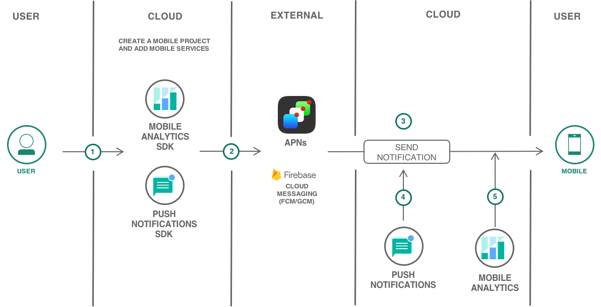
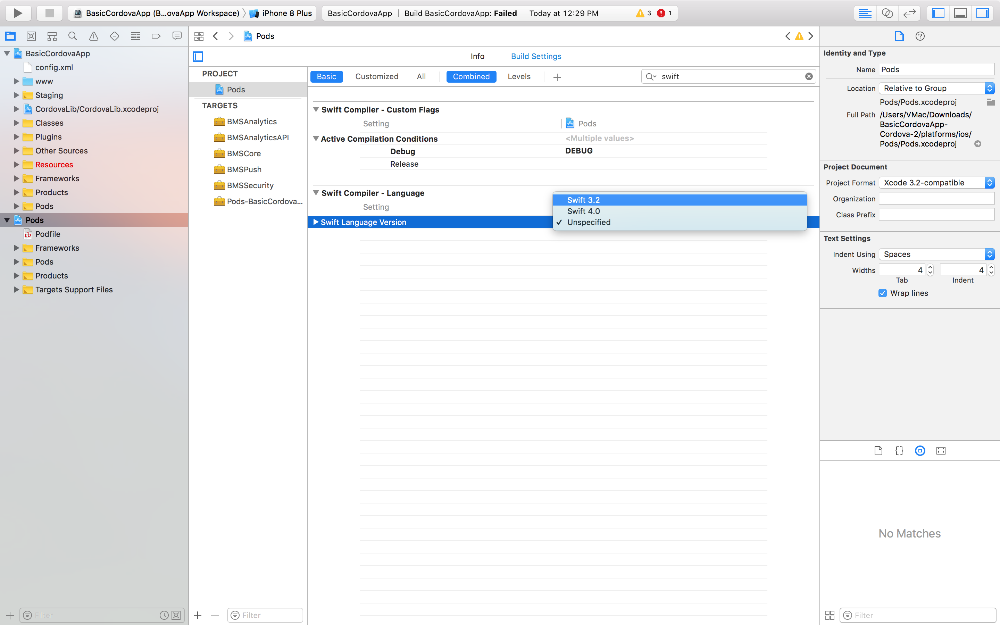

---
copyright:
  years: 2017
lastupdated: "2017-12-13"

---

{:shortdesc: .shortdesc}
{:new_window: target="_blank"}
{:codeblock: .codeblock}
{:screen: .screen}
{:tip: .tip}
{:pre: .pre}

# Hybrid Mobile Application with Push and Analytics

Learn how easy it is to quickly create a Hybrid Cordova application with high-value mobile services like push notifications and mobile analytics on IBM Cloud.

This tutorial walks you through the creation of a mobile starter application, adding mobile services, setting up client SDKs, downloading the scaffolded code and then further enhancing the application.

## Objectives

* Create a mobile project with Push Notifications and Mobile Analytics services.
* Obtain APNs and FCM credentials.
* Download the code and complete required setup.
* Instrumenting the app to use mobile analytics.
* Configure, send, and monitor push notifications.
* Monitoring the app with mobile analytics.

 

## Products

This tutorial uses the following products:
   * [Mobile Analytics](https://console.bluemix.net/catalog/services/mobile-analytics)
   * [Push Notifications](https://console.bluemix.net/catalog/services/push-notifications)

## Before you begin
{: #prereqs}

- Cordova [CLI](https://cordova.apache.org/docs/en/latest/guide/cli/) for adding plugins and Cordova-iOS [Prerequisites](https://cordova.apache.org/docs/en/latest/guide/platforms/ios/index.html).
- Google account to log into Firebase console for Sender ID and Server API Key.
- [Apple Developers](https://developer.apple.com/) account to send remote notifications from Push Notifications service instance on IBM Cloud (the provider) to iOS devices and applications.
- Xcode and Android Studio for importing and enhancing your code.


## Create Cordova mobile project from starter kit
{: #get_code}
The IBM Cloud Mobile Dashboard allows you to fast-track your mobile app development by creating your project from a Starter Kit.
1. Navigate to [Mobile Dashboard](https://console.bluemix.net/developer/mobile/dashboard).
2. Click on **Starter Kits** and scroll down to select the **Basic** Starter Kit.
    
3. Enter a project name, this can be your app name as well.
4. Select **Cordova** as your language and check the mobile services on the right pane.

    
5. Click on **Create Project** to scaffold an Cordova (Javascript) App.
6. A new Project will be created under **Projects** tab on the left pane.
    **Note:** Push Notifications and Mobile Analytics Services should be added with the Basic Starter.

In the next step, you will obtain Firebase Cloud Messaging (FCM) and Apple Push Notifications service(APNs) credentials for sending push notifications.

## Obtain FCM and APNs credentials

### Configure Firebase Cloud Messaging (FCM)

1. In the [Firebase console](https://console.firebase.google.com), create a new project. Set the name to **serverlessfollowup**
2. Navigate to the Project **Settings**
3. Under the **General** tab, add two applications:
      1. one with the package name set to: **com.ibm.mobilefirstplatform.clientsdk.android.push**
      2. and one with the package name set to: **serverlessfollowup.app**
4. Download the `google-services.json` containing the two defined applications from Firebase console and place this file in the `android/app` folder of the checkout directory.
5. Find the Sender ID and Server Key (also called API Key later on) under the **Cloud Messaging** tab.
6. In the Push Notifications service dashboard, set the value of the Sender ID and API Key.

### Configure Apple Push Notifications Service (APNs)

1. Go to the [Apple Developer](https://developer.apple.com/) portal and Register an App ID.
2. Create a development and distribution APNs SSL certificate.
3. Create a development provisioning profile.
4. Configure the Push Notifications service instance on IBM Cloud. Refer to [Obtain APNs credentials and configure Push Notifications service](https://console.bluemix.net/docs/tutorials/ios-mobile-push-analytics.html#obtain-apns-credentials-and-configure-push-notifications-service-instance-) for detailed steps.

## Download the code and complete required setup

If you haven't downloaded the code yet, then use IBM Cloud Mobile dashboard to get the code by clicking on the **Download Code** button under Projects > **Your Mobile Project**.

**Note:** BMSAnalytics is part of BMSCore Plugin.

1. On a terminal or command prompt, navigate to the downloaded project and run the below commands one after another. **This is specific to Android**
    ```
    cordova plugin add cordova-android-support-gradle-release --variable ANDROID_SUPPORT_VERSION=26.+
    ```
    Cordova plugin to align various versions of the Android Support libraries specified by other plugins to a specific version.
    {:tip}
    ```
    cordova plugin add cordova.plugins.diagnostic
    ```
    Cordova plugin to manage device settings.
    {:tip}
    ```
    cordova platform rm android
    ```
    ```
    cordova platform add android
    ```
2. To update bms-push (BMSPush) and bms-core (BMSCore) plugins, run the below commands
    ```
    $ cordova plugin rm bms-push
    ```
    ```
    $ cordova plugin add bms-push
    ```
3. To update Cordova-iOS to the latest version, run the below commands
      ```
      cordova platform rm ios
      ```
      ```
      cordova platform add ios
      ```
4. To launch the app on an Android emulator, run the below command
   ```
   $ cordova run android
   ```
5. To preview the app in the iOS simulator,

   - `cd platforms/ios` and run `pod update`
   - Open the workspace file  (`platforms/ios/{YOUR_PROJECT_NAME}.xcworkspace`) from Xcode, *or* from the command line:
   ```
   $ open {YOUR_PROJECT_NAME}.xcworkspace/
   ```
6. (Optional) Update `swift language version` for main (BasicCordovaApp) and Pods projects as shown below

   

   Make the above change only if you see this error - The “Swift Language Version” (SWIFT_VERSION) build setting must be set to a supported value for targets which use Swift. This setting can be set in the build settings editor.
   {:tip}
7. Open the code in an IDE of your choice and navigate to `/www/js/index.js`and comment the below code as you won't require this in the current scenario.

   ```
    mfpLoaded: function() {
        }
   ```

## Instrumenting the app to use Mobile Analytics.

1. Go to your Mobile dashboard > Projects > Cordova Project, Click on **Show** to unveil Push and Analytics service credentials.

   

2. In `index.js`, under `onDeviceReady` function, update the value of `applicationName`with your app name and replace the value of `analyticsApiKey` with Analytics **apiKey**.
3. Just after **BMSAnalytics.initialize** call, add the below code to send analytics data to server

      ```
      BMSAnalytics.setUserIdentity("{YOUR_USER_IDENTITY}");
      BMSAnalytics.send();
      ```
4. For logging, add the below code after **BMSLogger.setLogLevel** call
   ```
   BMSLogger.send();
   ```
   For advanced Analytics and logging capabilities, Refer [Gathering usage Analytics](https://github.com/ibm-bluemix-mobile-services/bms-clientsdk-cordova-plugin-core#using-bmsanalytics) and [logging](https://github.com/ibm-bluemix-mobile-services/bms-clientsdk-cordova-plugin-core#using-bmslogger)
   {:tip}

## Configure, send and monitor push notifications

1. In `index.js`, under `onDeviceReady` function, replace the values  `{pushAppGuid}` and

   `{pushClientSecret} `with push service **credentials** - appGuid and clientSecret.

2. Go to your Mobile dashboard > Projects > Cordova Project, Click on the Push Notifications service and follow the below steps.

### APNs - Configure the service instance

To use the Push Notifications service to send notifications, upload the .p12 certificates that you had created in the above Step. This certificate contains the private key and SSL certificates that are required to build and publish your application.

**Note:** After the `.cer` file is in your key chain access, export it to your computer to create a `.p12` certificate.

1. Click on `Push Notifications` under Services section or Click on the three vertical dots next to the Push Notifications service and select `Open dashboard`.
2. On the Push Notifications Dashboard, you should see `Configure` option under `Manage > Send Notifications`.

To set up APNs on the `Push Notification services` console, complete the steps:

1. Select `Configure` on the Push Notification services Dashboard.
2. Choose the `Mobile option` to update the information in the APNs Push Credentials form.
3. Select `Sandbox (development)` or `Production (distribution)` as appropriate and then upload the `p.12` certificate that you have created.
4. In the Password field, enter the password that is associated with the .p12 certificate file, then click Save.

### FCM - Configure the service instance

1. Select **Mobile** and then update the GCM/FCM Push Credentials tab with the Sender ID/Project number and API Key(Server Key) which you initially created on Firebase console.
2. Click **Save**. The push notifications service is now configured.

### Send push notifications

1. Select **Send Notifications**, and compose a message by choosing a send option. The supported options are device by tag, device id, user id, android devices, IOS devices, web notifications, and all devices.
   **Note:** When you select the **All Devices** option, all devices subscribed to Push Notifications will receive notifications.

2. In the **Message** field, compose your message. Choose to configure the optional settings as required.
3. Click **Send** and verify that your physical device has received the notification.

### Monitor sent notifications

You can monitor your sent notifications by navigating to **Monitoring** on the Push Notifications Service.
The IBM Push Notifications service now extends capabilities to monitor the push performance by generating graphs from your user data. You can use the utility to list all the sent push notifications, or to list all the registered devices and to analyze information on a daily, weekly, or monthly basis.
 

## Monitoring the app with Mobile Analytics.

You can record application logs and monitor data with the Mobile Analytics Client SDK. Developers can control when to send this data to the Mobile Analytics Service. When data is delivered to Mobile Analytics, you can use the Mobile Analytics console to get analytics insights about your mobile applications, devices, and application logs.
1. Open the **Mobile Analytics** service from the mobile project you created or click on the three vertical dots next to the service and select **Open Dashboard**.
2. You should see LIVE Users, Sessions and other App Data by disabling **Demo Mode**. You can filter the analytics information by
   - Date.
   - Application.
   - Operating System.
   - Version of the app.

     
3. [Click here](https://console.bluemix.net/docs/services/mobileanalytics/app-monitoring.html#monitoringapps) to set alerts, monitor app crashes, and monitor network requests.

## Related Content

[Customize the Push Notifications settings](https://console.bluemix.net/docs/services/mobilepush/push_step_4.html#push_step_4_Android)
[Tag-based notifications](https://console.bluemix.net/docs/services/mobilepush/push_step_4_nf_tag.html#tag_based_notifications)
[Push Notifications REST APIs](https://console.bluemix.net/docs/services/mobilepush/push_restapi.html#push-api-rest)
[Security in Push Notifications](https://console.bluemix.net/docs/services/mobilepush/push_security.html#overview-push)
[Exporting Analytics data to Db2 Warehouse](https://console.bluemix.net/docs/services/mobileanalytics/app-monitoring.html#dashdb)