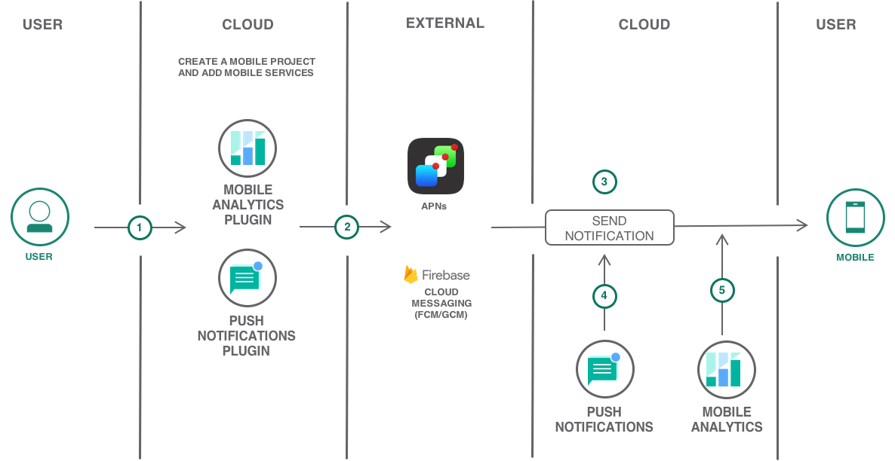

---
copyright:
  years: 2017
lastupdated: "2017-12-11"

---

{:shortdesc: .shortdesc}
{:new_window: target="_blank"}
{:codeblock: .codeblock}
{:screen: .screen}
{:tip: .tip}
{:pre: .pre}

# Hybrid Mobile Application with Push and Analytics

Learn how easy it is to quickly create a Hybrid Cordova application with high-value mobile services like push notifications and mobile analytics on IBM Cloud.

This tutorial walks you through the creation of a mobile starter application, adding mobile services, setting up client SDKs, downloading the scaffolded code and then further enhancing the application.

## Objectives

* Create a mobile project with Push Notifications and Mobile Analytics services.
* Obtain APNs and FCM credentials.
* Download the code and complete required setup.
* Instrumenting the app to use mobile analytics.
* Configure, send, and monitor push notifications.
* Monitoring the app with mobile analytics.

 

## Products

This tutorial uses the following products:
   * [Mobile Analytics](https://console.bluemix.net/catalog/services/mobile-analytics)
   * [Push Notifications](https://console.bluemix.net/catalog/services/push-notifications)

## Before you begin
{: #prereqs}

- Cordova [CLI](https://cordova.apache.org/docs/en/latest/guide/cli/) for adding plugins.
- Google account to log into Firebase console for Sender ID and Server API Key.
- [Apple Developers](https://developer.apple.com/) account to send remote notifications from Push Notifications service instance on IBM Cloud (the provider) to iOS devices and applications.
- Xcode and Android Studio for importing and enhancing your code.


## Create Cordova mobile project from starter kit
{: #get_code}
The IBM Cloud Mobile Dashboard allows you to fast-track your mobile app development by creating your project from a Starter Kit.
1. Navigate to [Mobile Dashboard](https://console.bluemix.net/developer/mobile/dashboard)
2. Click on **Starter Kits** and scroll down to select the **Basic** Starter Kit.
    
3. Enter a project name, this can be your app name as well.
4. Select **Cordova** as your language and check the mobile services on the right pane.

    
5. Click on **Create Project** to scaffold an Cordova (Javascript) App.
6. A new Project will be created under **Projects** tab on the left pane.
    **Note:** Push Notifications and Mobile Analytics Services should be added with the Basic Starter.

In the next step, you will obtain Firebase Cloud Messaging (FCM) and Apple Push Notifications service(APNs) credentials for sending push notifications.

## Obtain FCM and APNs credentials

### Configure Firebase Cloud Messaging (FCM)

1. In the [Firebase console](https://console.firebase.google.com), create a new project. Set the name to **serverlessfollowup**
2. Navigate to the Project **Settings**
3. Under the **General** tab, add two applications:
      1. one with the package name set to: **com.ibm.mobilefirstplatform.clientsdk.android.push**
      2. and one with the package name set to: **serverlessfollowup.app**
4. Download the `google-services.json` containing the two defined applications from Firebase console and place this file in the `android/app` folder of the checkout directory.
5. Find the Sender ID and Server Key (also called API Key later on) under the **Cloud Messaging** tab.
6. In the Push Notifications service dashboard, set the value of the Sender ID and API Key.

### Configure Apple Push Notifications Service (APNs)

1. Go to the [Apple Developer](https://developer.apple.com/) portal and Register an App ID.
2. Create a development and distribution APNs SSL certificate.
3. Create a development provisioning profile.
4. Configure the Push Notifications service instance on IBM Cloud. Refer to [Obtain APNs credentials and configure Push Notifications service](https://console.bluemix.net/docs/tutorials/ios-mobile-push-analytics.html#obtain-apns-credentials-and-configure-push-notifications-service-instance-) for detailed steps.

## Download the code and complete required setup

If you haven't downloaded the code yet, then use IBM Cloud Mobile dashboard to get the code by clicking on the **Download Code** button under Projects > **Your Mobile Project**.

1. On a terminal or command prompt, navigate to the downloaded project and run the below commands one after another

    ```
    cordova plugin add cordova-android-support-gradle-release --variable ANDROID_SUPPORT_VERSION=26.+
    ```
    Cordova plugin to align various versions of the Android Support libraries specified by other plugins to a specific version
    {:tip}
    ```
    cordova plugin add cordova.plugins.diagnostic
    ```
    Cordova plugin to manage device settings
    {:tip}
    ```
    cordova platform rm android
    ```
    ```
    cordova platform add android
    ```
    ```
    cordova plugin rm bms-push
    ```
    ```
    cordova plugin add bms-push
    ```

   ​

   ​

   ​