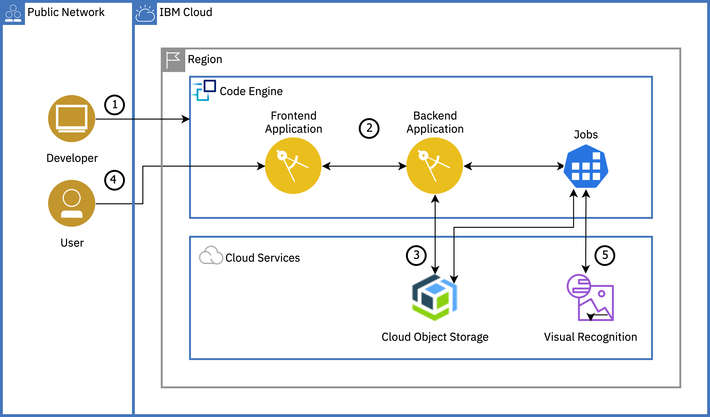

{:step: data-tutorial-type='step'}
{:java: #java .ph data-hd-programlang='java'}
{:swift: #swift .ph data-hd-programlang='swift'}
{:ios: #ios data-hd-operatingsystem="ios"}
{:android: #android data-hd-operatingsystem="android"}
{:shortdesc: .shortdesc}
{:new_window: target="_blank"}
{:codeblock: .codeblock}
{:screen: .screen}
{:tip: .tip}
{:pre: .pre}
{:important: .important}
{:note: .note}

# Image classification with Code Engine
{: #image_classification_code_engine}
{: toc-content-type="tutorial"}
{: toc-services="codeengine, containers, cloud-object-storage, visual-recognition"}
{: toc-completion-time="2h"}

<!--##istutorial#-->
This tutorial may incur costs. Use the [Cost Estimator](https://{DomainName}/estimator/review) to generate a cost estimate based on your projected usage.
{: tip}
<!--#/istutorial#-->

> WORK-IN-PROGRESS

In this tutorial, you will learn about {{site.data.keyword.cloud_notm}} Code Engine by deploying an image classification application. You will create a Code Engine project, target the project and deploy Code Engine components - applications, jobs to the project. You will learn how to bind {{site.data.keyword.cloud_notm}} services to your Code Engine components. You will also understand the auto-scaling capability of Code Engine where instances are scaled up or down (to zero) based on incoming workload.
{:shortdesc}

{{site.data.keyword.cloud_notm}} Code Engine provides a platform to unify the deployment of all of your container-based applications. Whether those applications are functions, traditional 12-factor apps, batch workloads(run-to-completion) or any other container-based workloads, if they can be bundled into a container image, then Code Engine can host and manage them for you - all on a Kubernetes-based infrastructure. And Code Engine does this without the need for you to learn, or even know about, Kubernetes. The Code Engine experience is designed so that you can focus on writing code and not on the infrastructure needed to host it. It is delivered as a managed service on the cloud and built on open-source projects (Kubernetes, Istio, Knative, Tekton, etc.).

Code Engine helps developers by hiding many of the complex tasks like configuration, dependency management etc., Code Engine simplifies container-based management and enables you to concentrate on writing code. It also makes available many of the features of a serverless platform, such as "scale-to-zero".

## Objectives
{: #objectives}

* Understand {{site.data.keyword.cloud_notm}} Code Engine and how it simplifies the developer experience.
* Understand how easy it is to deploy and scale an application using Code Engine.
* Learn the use of jobs to execute run to completion workloads.


<p style="text-align: center;">

  
</p>

1. Developer creates a Code Engine project and deploys a frontend and a backend Code Engine application.
2. Developer connects the frontend(UI) app to the backend by modifying the frontend application to set an environment variable value to point to the backend application's endpoint.
3. Developer provisions the required cloud services and binds them to the backend application and jobs by creating secrets and configmap.
4. User uploads an image(s) via the frontend app that is stored in {{site.data.keyword.cos_short}} through the backend application.
5. User runs a Code Engine job via the backend to classify the image by pushing the image to {{site.data.keyword.visualrecognitionshort}}. The result is then saved to {{site.data.keyword.cos_short}} and displayed in the frontend app when the user clicks the refresh button.

## Before you begin
{: #prereqs}

This tutorial requires:
* {{site.data.keyword.cloud_notm}} CLI,
   * code-engine plugin (`code-engine`)
* `kubectl` to interact with Kubernetes clusters,

<!--##istutorial#-->
You will find instructions to download and install these tools for your operating environment in the [Getting started with tutorials](/getting-started.md#getting-started-with-tutorials) guide.
<!--#/istutorial#-->

## Create a IBM Code Engine project
{: #create_coligo_project}
{: step}

In this section, you will create a Code Engine project. A project is a grouping of applications and jobs that are typically meant to go together as part of some overall workload similar to a folder on your computer.

1. Navigate to [IBM Code Engine Overview](https://{DomainName}/codeengine/overview) page
2. Click on **Start with a project**.
   - Select a Location preferably Dallas
   - Provide a project name and select a Resource group
   - Click on **Create**
3. On a terminal, make the command line tooling point to your project
   ```sh
   ibmcloud code-engine target --name <PROJECT_NAME> --kubecfg
   ```
   You may need to target a resource group if one has not already been targeted
   ```sh
   ibmcloud target -g <RESOURCE_GROUP>
   ```
   {:pre}

   `--kubecfg` flag appends the project to the default Kubernetes configuration file.
   {:tip}

## Deploy the frontend and backend apps as Code Engine applications
{: #deploy_app}
{: step}

In this section, you will deploy your front-end web application to Code Engine under the targeted project. Once deployed and tested, you will deploy your back-end application and verify the connection. You will use the pre-built container images to deploy the respective applications,

### Deploy a frontend application

1. To deploy a new Code Engine application, you need to run the following command; providing a service name "frontend" and the pre-built container image as a parameter to `--image` flag.
   ```sh
   ibmcloud code-engine application create --name frontend \
   --image ibmcom/frontend
   ```
   {:pre}

    With just these two pieces of data, Code Engine can deploy your application and it will handle all of the complexities of configuring it and managing it for you.
    {:tip}

2. Copy the URL from the output and open it in a browser to see an output similar to this
   ```
   Congratulations! Your Frontend is working
   Oops!! Looks like the Connection to the backend is failing. Time to add a backend
   ```

   Run `ibmcloud code-engine application get -n frontend` command to see the details of the application.
   {:tip}
3. For secured browsing, you can also browse the application with `HTTPS`.

  <!-- For troubleshooting and to display logs of your application, run the command `ibmcloud code-engine application logs --name frontend`
   {:tip}-->
<!--4. List the pods of the service and notice that it has a running pod
   ```sh
   kubectl get pods --watch
   ```
   {:pre}-->
Congratulations!! You've just deployed a web application to Code Engine with a simple command and also without the intricacies of Kubernetes such as pods, deployments, services, and ingress.

### Scale the application

To check the autoscaling capabilities of Code Engine,
1. Navigate to the [load generator URL](https://load.fun.cloud.ibm.com/) and paste the frontend application URL from the step above.
2. Click on **Generate load** to generate traffic.
3. Run the below command to see the pod count incrementing as part the autoscaling
   ```sh
   kubectl get pods --watch
   ```
   {:pre}
4. Once load generation is stopped, wait for a minute to see the pods scaling to zero.

### Deploy a backend application and test the connection

1. To deploy a new backend application, run this command
   ```sh
   ibmcloud code-engine application create --name backend \
   --image ibmcom/backend --cluster-local
   ```
   {:pre}
   The `--cluster-local` flag will instruct Code Engine to keep the endpoint for this application private. Meaning, it will only be available from within the cluster. This is often used for security purposes.
   {:tip}

2. Copy the private endpoint (URL) from the output.

   Run `ibmcloud code-engine application get -n backend` command to check the status and details of the backend application.
   {:tip}
3. The frontend application uses an environment variable(BACKEND_URL) to know where the backend application is hosted. You now need to modify the frontend application to set this value to point to the backend application's endpoint. **Replace** the placeholder `<BACKEND_PRIVATE_URL>` with the value from the previous command
   ```sh
   ibmcloud code-engine application update --name frontend \
   --env BACKEND_URL=<BACKEND_PRIVATE_URL>
   ```
   {:pre}

   The `--env` flag can appear as many times as you would like if you need to set more than one environment variable. This option could have also been used on the `ibmcloud code-engine application create` command for the frontend application as well if you knew its value at that time.
   {:tip}

4. Refresh the frontend URL on the browser to test the connection to the backend service. Now, backend should be available. Try uploading an image by clicking on **Upload image**, you should still see an error message as the backend is still not connected with the required {{site.data.keyword.cloud_notm}} services to store and process the image.

## Connect the backend application to {{site.data.keyword.cos_short}} service
{:connect_cloud_services}
{: step}

In this section, you will provision the required {{site.data.keyword.cos_short}} and {{site.data.keyword.visualrecognitionshort}} services and bind the {{site.data.keyword.cos_short}} service to the backend application. The backend application will store the images into the {{site.data.keyword.cos_short}}, while the {{site.data.keyword.visualrecognitionshort}} will be used later in the tutorial to classify the images.

### Provision {{site.data.keyword.cos_short}} and {{site.data.keyword.visualrecognitionshort}} services
{:#create_services}

1. Create an instance of [{{site.data.keyword.cos_short}}](https://{DomainName}/catalog/services/cloud-object-storage)
   1. Select the **Lite** plan or the **Standard** plan if you already have an {{site.data.keyword.cos_short}} service instance in your account.
   2. Set **Service name** to **code-engine-cos** and select a resource group.
   3. Click on **Create**.
2. Under **Service Credentials**, click on **New credential**
   1. Give it a name - `cos-for-code-engine` and select **Writer** as the role
    <!--2. Expand **Advanced options** and change the **Include HMAC Credential** switch to **On**-->
   2. Click **Add**.
   <!--3. Expand the `for-code-engine` credentials, copy and **save** the credentials for future reference.-->
3. Create a **Custom** bucket named `<your-initials>-code-engine`,
   1. Select **Cross Region** resiliency
   2. Select a Location near to you
   3. Select a **Standard** storage class for high performance and low latency.
   4. Click **Create bucket**
4. On the left pane under **Endpoint**, Select **Cross region** resiliency and select a Location near to you.
5. Copy the desired **Public** endpoint to access your bucket and **save** the endpoint for quick reference.
6. Create an instance of [{{site.data.keyword.visualrecognitionshort}}](https://{DomainName}/catalog/services/visual-recognition)
   1. Select a region and select **Lite** plan.
   2. Set **Service name** to **code-engine-vr** and select a resource group.
   3. Click on **Create**.
7. Under **Service Credentials**, click on **New credential**
   1. Give it a name - `vr-for-code-engine` and select **Writer** as the role
    <!--2. Expand **Advanced options** and change the **Include HMAC Credential** switch to **On**-->
   2. Click **Add**.
   <!--3. Expand the `for-code-engine` credentials, copy and **save** the credentials for future reference.-->

### Bind the {{site.data.keyword.cos_short}} service to the backend application

Now, you will need to pass in the credentials for the services you just created into our backend application. You will do this by binding the {{site.data.keyword.cos_short}} service to your application and then asking the Code Engine runtime to make them available to the application via environment variables.

1. Create a binding for {{site.data.keyword.cos_short}} service with a prefix `COS` for ease of use in your application,
   ```sh
   ibmcloud code-engine application bind --name backend \
   --service-instance code-engine-cos \
   --service-credential cos-for-code-engine \
   --prefix COS
   ```
   {:pre}

   If you have created the {{site.data.keyword.cos_short}} service instance with a different name, pass your service name with `--service-instance` flag. `--service-credential` is an optional flag.
   {:tip}


2. Define a configmap to hold the bucket name and the endpoint as the information isn't sensitive,
   ```sh
   ibmcloud code-engine configmap create --name backend-configuration \
   --from-literal=COS_BUCKETNAME=<COS_BUCKET_NAME> \
   --from-literal=COS_ENDPOINT=<COS_ENDPOINT>
   ```
   {:pre}

3. With the configmap defined, you can now update the backend application by asking Code Engine to set environment variables in the runtime of the application based on the values in the configmap.Update the backend application with the following command
   ```sh
   ibmcloud code-engine application update --name backend \
   --env-from-configmap backend-configuration
   ```
   {:pre}

   To create a secret, you will use `--env-from-secret` flag. Both secrets and configmap are "maps"; so the environment variables set will have a name corresponding to the "key" of each entry in those maps, and the environment variable values will be the value of that "key".
   {:tip}

4. To verify whether the backend application is updated with the binding and configmap. You can run the below command to look for the `Service Bindings` and `Environment Variables` sections
   ```sh
   ibmcloud code-engine application get --name backend --more-details
   ```
   {:pre}

<!--## Test the entire application
{:test_app}

Now that you have the backend application connected to the frontend application, let's test it by uploading images for image classification,

1. Before testing the application, let's create a secret for {{site.data.keyword.visualrecognitionshort}} service to be used with the jobs in the subsequent steps,
   ```sh
   ibmcloud code-engine secret create --name vr-secret \
   --from-literal=VR_APIKEY=<VISUAL_RECOGNITION_APIKEY> \
   --from-literal=VR_URL=<VISUAL_RECOGNITION_URL>
   ```
   {:pre}
2. Test the app by uploading an image through the frontend UI
   1. Click on **Upload image** and point to the image on your computer.
   2. Once successfully uploaded, the image will be stored in the `images` folder of {{site.data.keyword.cos_short}} bucket - `<your-initials>-code-engine`.
3. Click on **Classify** to create a new job that passes the uploaded image in the {{site.data.keyword.cos_short}} `bucket/images` folder to {{site.data.keyword.visualrecognitionshort}} service for image classification. The result (JSON) from the {{site.data.keyword.visualrecognitionshort}} are stored in a separate folder(results) in the same {{site.data.keyword.cos_short}} bucket and can be seen on the UI.
4. Upload multiple images and test the application.
5. Check the results of the classified images on the UI.

   If you are interested in checking the job details, run the command `ibmcloud code-engine job list` to see the list of job runs and then pass the job name retrieved from the list to the command - `ibmcloud code-engine job get --name <JOBRUN_NAME>`. To check the logs, run the following command `ibmcloud code-engine job logs --name <JOBRUN_NAME> `
   {:tip}-->

## Test the application
{: #test_the_app}
{: step}

Now that you have the backend application connected to the frontend application, let's test it by uploading images for image classification. To test, you will create a job definition and use the job definition to run a job to classify images using {{site.data.keyword.visualrecognitionshort}} service. <!--understand what happens under the hood once you click the **Classify** button in the UI, how a job definition created and used in a job run.-->

Jobs in Code Engine are meant to run to completion as batch or standalone executables. They are not intended to provide lasting endpoints to access like a Code Engine application does.

### Create a job definition

Jobs, unlike applications which react to incoming HTTP requests, are meant to be used for running container images that contain an executable designed to run one time and then exit. Rather than specifying the full configuration of a job each time it is executed, you can create a `job definition` which acts as a "template" for the job.

1. Go to the frontend UI and **upload images** for classification.
2. On a terminal, run the following command to create a job definition,
   ```sh
   ibmcloud code-engine jobdef create --name backend-jobdef \
   --image ibmcom/backend-job \
   --env-from-configmap backend-configuration \
   --env VR_VERSION='2018-03-19'
   ```
   {:pre}

   You can set the version of {{site.data.keyword.visualrecognitionshort}} service using the `--env` flag. For versioning, check this [link](https://{DomainName}/apidocs/visual-recognition/visual-recognition-v3#versioning)
   {:tip}

### Bind the {{site.data.keyword.cloud_notm}} services to jobdef

1. Before further testing the application, let's create a binding for {{site.data.keyword.cos_short}} service with a prefix `COS_JOB` to be used with the jobs in the subsequent steps,
   ```sh
   ibmcloud code-engine jobdef bind --name backend-jobdef \
   --service-instance code-engine-cos \
   --service-credential cos-for-code-engine \
   --prefix COS_JOB
   ```
   {:pre}
2. Similarly, let's bind {{site.data.keyword.visualrecognitionshort}} service with a prefix `VR_JOB` to classify the uploaded images,
   ```sh
   ibmcloud code-engine jobdef bind --name backend-jobdef \
   --service-instance code-engine-vr \
   --service-credential vr-for-code-engine \
   --prefix VR_JOB
   ```
   {:pre}

### Run the job

1. With the following command, run a job using the jobdefinition created above
   ```sh
   ibmcloud code-engine job run --name backend-job \
   --jobdef backend-jobdef \
   --image ibmcom/backend-job \
   --arraysize 1 \
   --retrylimit 2 \
   --memory 128M \
   --cpu 1
   ```
   {:pre}

   When you run a job, you can override many of the variables that you set in the job definition. To check the variables, run `ibmcloud code-engine job run --help`.
   {:tip}

2. To check the logs, run the following command
   ```sh
   ibmcloud code-engine job logs --name backend-job
   ```
   {:pre}
3. In the frontend UI, click on the **refresh** button to see the results for each of the uploaded images.
4. To delete the job, run the below command
   ```sh
   ibmcloud code-engine job delete --name backend-job
   ```
   {:pre}
5. Upload new images, create the job again and hit the **refresh** button to see the results.

## Remove resources
{:#cleanup}
{: step}

1. With the command below, delete the project to delete all it's components (applications, jobs etc.).
   ```sh
   ibmcloud code-engine project delete --name <PROJECT_NAME>
   ```
   {:pre}
2. Navigate to [Resource List](https://{DomainName}/resources/)
3. Delete the services you have created:
 * [{{site.data.keyword.cos_full}}](https://{DomainName}/catalog/services/cloud-object-storage)
 * [{{site.data.keyword.visualrecognitionfull}}](https://{DomainName}/catalog/services/visual-recognition)

## Related resources
{: #related_resources}

- [IBM Cloud Code Engine Documentation](/docs/codeengine)