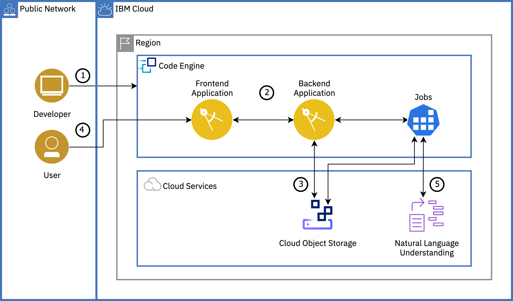

{:step: data-tutorial-type='step'}
{:java: #java .ph data-hd-programlang='java'}
{:swift: #swift .ph data-hd-programlang='swift'}
{:ios: #ios data-hd-operatingsystem="ios"}
{:android: #android data-hd-operatingsystem="android"}
{:shortdesc: .shortdesc}
{:new_window: target="_blank"}
{:codeblock: .codeblock}
{:screen: .screen}
{:tip: .tip}
{:pre: .pre}
{:important: .important}
{:note: .note}
{:beta: .beta}

# Text analysis with {{site.data.keyword.codeengineshort}}
{: #image_classification_code_engine}
{: toc-content-type="tutorial"}
{: toc-services="codeengine, containers, cloud-object-storage"}
{: toc-completion-time="2h"}

<!--##istutorial#-->
This tutorial may incur costs. Use the [Cost Estimator](https://{DomainName}/estimator/review) to generate a cost estimate based on your projected usage.
{:tip}

{{site.data.keyword.codeenginefull_notm}} is available as a beta service. Beta runtimes and services might be unstable or change frequently. Be aware of [beta limitations](https://{DomainName}/docs/codeengine?topic=codeengine-limits).
{:beta}
<!--#/istutorial#-->

In this tutorial, you will learn about {{site.data.keyword.codeenginefull}} by deploying a text analysis with {{site.data.keyword.nlushort}} application. You will create a {{site.data.keyword.codeengineshort}} project, select the project and deploy {{site.data.keyword.codeengineshort}} entities - applications and jobs to the project. You will learn how to bind {{site.data.keyword.cloud_notm}} services to your {{site.data.keyword.codeengineshort}} entities. You will also understand the auto-scaling capability of {{site.data.keyword.codeengineshort}} where instances are scaled up or down (to zero) based on incoming workload.
{:shortdesc}

{{site.data.keyword.codeenginefull}} is a fully managed, serverless platform that runs your containerized workloads, including web apps, micro-services, event-driven functions, or batch jobs. {{site.data.keyword.codeengineshort}} even builds container images for you from your source code. Because these workloads are all hosted within the same Kubernetes infrastructure, all of them can seamlessly work together. The {{site.data.keyword.codeengineshort}} experience is designed so that you can focus on writing code and not on the infrastructure that is needed to host it.

The platform is designed to address the needs of developers who just want their code to run. {{site.data.keyword.codeengineshort}} abstracts the operational burden of building, deploying, and managing workloads in Kubernetes so that developers can focus on what matters most to them: the source code.

## Objectives
{: #text-analysis-code-engine-objectives}

* Understand {{site.data.keyword.codeenginefull}} and how it simplifies the developer experience.
* Understand how easy it is to deploy and scale an application using {{site.data.keyword.codeengineshort}}.
* Learn the use of jobs to execute run to completion workloads.


<p style="text-align: center;">

  
</p>

1. Developer creates a {{site.data.keyword.codeengineshort}} project and deploys a frontend and a backend {{site.data.keyword.codeengineshort}} application.
2. Developer connects the frontend (UI) app to the backend by modifying the frontend application to set an environment variable value to point to the backend application's endpoint.
3. Developer provisions the required cloud services and binds them to the backend application and jobs by creating secrets and configmap.
4. User uploads a text file(s) via the frontend app that is stored in {{site.data.keyword.cos_short}} through the backend application.
5. User runs a {{site.data.keyword.codeengineshort}} job via the backend to analyze text by pushing the text to {{site.data.keyword.nlushort}}. The result is then saved to {{site.data.keyword.cos_short}} and displayed in the frontend app when the user clicks the refresh button.

## Before you begin
{: #text-analysis-code-engine-prereqs}

This tutorial requires:
* {{site.data.keyword.cloud_notm}} CLI - This CLI tool will enable you to interact with {{site.data.keyword.cloud_notm}}.
   * code-engine/ce plugin (`code-engine/ce`) - Plugins extend the capabilities of the {{site.data.keyword.cloud_notm}} CLI with commands specific to a service. The {{site.data.keyword.codeengineshort}} plugin will give you access to {{site.data.keyword.codeengineshort}} commands on {{site.data.keyword.cloud_notm}}.

<!--##istutorial#-->
You will find instructions to download and install these tools for your operating environment in the [Getting started with tutorials](/getting-started.md#getting-started-with-tutorials) guide.

**Note:** To avoid the installation of these tools you can use the [{{site.data.keyword.cloud-shell_short}}](https://{DomainName}/shell) from the {{site.data.keyword.cloud_notm}} console.
{:tip}
<!--#/istutorial#-->


## Create an {{site.data.keyword.codeenginefull_notm}} project
{: #text-analysis-code-engine-create_code_engine_project}
{: step}

In this section, you will create a {{site.data.keyword.codeengineshort}} project. A project is a grouping of {{site.data.keyword.codeengineshort}} entities such as applications, jobs, and builds. Projects are used to manage resources and provide access to its entities.

Putting components into a single project enables you to manage access control more easily. The components within a project share the same private network, which enables them to talk to each other securely.

1. Navigate to [{{site.data.keyword.codeenginefull_notm}} Overview](https://{DomainName}/codeengine/overview) page.
2. On the left pane, click on **Projects** and then click **Create project**,
   - Select a Location
   - Provide a project name and select a Resource group where you will create your project and also the cloud services required in the later steps. Resource groups are a way for you to organize your account resources into customizable groupings.
   - Click on **Create** and then **Confirm & create**
   - Wait until the project `status` changes to **Active**
3. In a terminal on your machine, ensure you're logged in to the `ibmcloud` CLI.
   ```sh
   ibmcloud login
   ```
   {:pre}
4. You will also need to target the resource group where you created your project.
   ```
   ibmcloud target -g <YOUR_RESOURCE_GROUP_NAME>
   ```
   {:pre}
5. Make the command line tooling point to your project
   ```sh
   ibmcloud code-engine project select --name <PROJECT_NAME>
   ```
   {:pre}

## Deploy the frontend and backend apps as {{site.data.keyword.codeengineshort}} applications
{: #text-analysis-code-engine-deploy_app}
{: step}

{{site.data.keyword.codeengineshort}} Applications run your code to serve HTTP requests, autoscale up and back down to zero, and offer traffic routing to multiple revisions. In this section, you will deploy your front-end and back-end applications to {{site.data.keyword.codeengineshort}} under the targeted project. This front-end web application will allow users to upload text files, while the backend application will write the file to {{site.data.keyword.cos_full_notm}}.

We've already built images for the two applications and pushed them to the public container registry. You will use these pre-built container images to deploy the respective applications.

### Deploy a frontend application
{: #text-analysis-code-engine-4}

1. To deploy a new {{site.data.keyword.codeengineshort}} application, you need to run the following command; providing a service name "frontend" and the pre-built container image as a parameter to `--image` flag.

   ```sh
   ibmcloud code-engine application create --name frontend --image ibmcom/frontend
   ```
   {:pre}

   After running this command, you should see some output with a URL to your application. It should look something like: `https://frontend.305atabsd0w.us-south.codeengine.appdomain.cloud`. Make note of this application URL for the next step. With just these two pieces of data (application name and image name), {{site.data.keyword.codeengineshort}} has deployed your application and will handle all of the complexities of configuring it and managing it for you.

   The application source code used to build the container images - `ibmcom/*` is available in a [GitHub repo](https://github.com/IBM-Cloud/code-engine-text-analysis) for your reference.
   {:tip}

2. Copy the URL from the `application create` output and open it in a browser to see an output similar to this
   

   Run `ibmcloud code-engine application get -n frontend` command to see the details of the application. You should see details like the ID, project information, age of the application, the URL to access the application, a Console URL to access your application configuration, Image, Resource allocation, and various revisions, conditions and runtime for your application. Since you only have one revision, you should see that 100% of the traffic is going to the latest revision. You can also check the number of `Instances` and their status.
   {:tip}

3. For troubleshooting and to check the logs of your application, run the following command by replacing the `<INSTANCE_NAME>` with the **name** of the instance from the `ibmcloud code-engine application get -n frontend` command
   ```
   ibmcloud code-engine application logs --instance <INSTANCE_NAME>
   ```
   {:pre}

Congratulations!! You've just deployed a web application to {{site.data.keyword.codeengineshort}} with a simple command and also without needing to know about the intricacies of Kubernetes such as pods, deployments, services, and ingress.

### Scale the application
{: #text-analysis-code-engine-5}

When you created the application with the `application create` command, you only passed in an image to use and a name for your application. While this is the minimum amount of information to deploy an application, there are a number of other knobs you have control over. Among others, you can set the number of requests that can be processed concurrently per instance, the amount of CPU for the instance of the application, the amount of memory set for the instance of the application, the environment variables for the application, the maximum and minimum number of instances that can be used for this application, and the port where the application listens for requests.

Most of these values have a default set if nothing is provided as an option when creating the application. Because we did not provide a value, {{site.data.keyword.codeengineshort}} deployed our application with a default max scale of 10, meaning that it will only scale our application up to 10 instances. The default minimum scale is zero, so that when our application is no longer in use, it will scale itself back down to zero.

1. To check the autoscaling capabilities of {{site.data.keyword.codeengineshort}}, we can use a load generator to generate a load against our service. This load generator will simulate about 300 clients hitting the URL for 30 seconds. Navigate to the [load generator URL](https://load.fun.cloud.ibm.com/) and paste the frontend application URL from the step above.
2. Click on **Generate load** to generate traffic.
3. Run the below command to see the instance(pod) count incrementing as part of the autoscaling.
   ```sh
   ibmcloud code-engine application get -n frontend
   ```
   {:pre}

   By default, the maximum number of requests that can be processed concurrently per instance is `10` leading to autoscaling and this value can be changed using `--concurrency or -cn` flag with `application update` command.
   {:tip}

4. The default for maximum number of instances when an application is created is 10 instances, so you should see that there were 10 instances created. If you didn't want to allow as many instances to be created, you can adjust the max scale to be a lower number. While your serverless application can easily scale up, you may depend on a downstream service such as a SQL DB that can only handle a limited number of connections or another rate limited API. Let's try limiting the number of instances for this frontend application.
    ```sh
    ibmcloud code-engine application update --name frontend --max-scale 5
    ```
    {:pre}
5. Once load generation is stopped, wait for a minute to see the instances terminating, eventually scaling down to zero instances.
6. Again, navigate to the [load generator URL](https://load.fun.cloud.ibm.com/) and paste the frontend application URL from the step above. Run the `ibmcloud code-engine application get -n frontend` command to see the instance count increasing to 5.

    Expected Output:
    ```
    frontend-gxbsr-2-deployment-5f55c4cf6f-869fb  2/2      Running  0         24s
    frontend-gxbsr-2-deployment-5f55c4cf6f-bg2cn  1/2      Running  0         9s
    frontend-gxbsr-2-deployment-5f55c4cf6f-ckxqw  2/2      Running  0         9s
    frontend-gxbsr-2-deployment-5f55c4cf6f-djcj6  2/2      Running  0         9s
    frontend-gxbsr-2-deployment-5f55c4cf6f-wb6j8  2/2      Running  0         9s
    ```

### Deploy a backend application and test the connection
{: #text-analysis-code-engine-6}

1. To deploy a new backend application to store your text files into {{site.data.keyword.cos_full_notm}}, run this command
   ```sh
   ibmcloud code-engine application create --name backend --image ibmcom/backend --cluster-local
   ```
   {:pre}
   The `--cluster-local` flag will instruct {{site.data.keyword.codeengineshort}} to keep the endpoint for this application private, meaning that it will only be available from within the cluster. This is often used for security purposes. In this case, there is no reason to expose the backend application with a public endpoint, since it will not be accessed from outside of the cluster.
   {:tip}

2. Copy and save the private endpoint (URL) from the output to use it in the next command.

   You can run `ibmcloud code-engine application get -n backend` command to check the status and details of the backend application.
   {:tip}

3. The frontend application uses an environment variable (BACKEND_URL) to know where the backend application is hosted. You now need to update the frontend application to set this value to point to the backend application's endpoint. **Replace** the placeholder `<BACKEND_PRIVATE_URL>` with the value from the previous command.
   ```sh
   ibmcloud code-engine application update --name frontend --env BACKEND_URL=<BACKEND_PRIVATE_URL>
   ```
   {:pre}

   The `--env` flag can appear as many times as you would like if you need to set more than one environment variable. This option could have also been used on the `ibmcloud code-engine application create` command for the frontend application if you knew its value at that time.
   {:tip}

4. Refresh the frontend URL on the browser to test the connection to the backend application. You should see a page with an option to upload a text file(.txt) and also an error message from the backend application as the backend is still not connected with the required {{site.data.keyword.cloud_notm}} services to store and process the text files. Clicking on **Upload text file** should also show a similar error message.
   

## Connect the backend application to {{site.data.keyword.cos_short}} service
{: #text-analysis-code-engine-0}
{:connect_cloud_services}
{: step}

In this section, you will provision the required {{site.data.keyword.cos_short}} and {{site.data.keyword.nlushort}} services and bind the {{site.data.keyword.cos_short}} service to the backend application. The backend application will store the text files into the {{site.data.keyword.cos_short}}, while the {{site.data.keyword.nlushort}} will be used later in the tutorial to perform text analysis on the uploaded text files.

### Provision {{site.data.keyword.cos_short}} and {{site.data.keyword.nlushort}} services
{: #text-analysis-code-engine-create_services}

With {{site.data.keyword.nlufull}}, developers can analyze semantic features of text input, including categories, concepts, emotion, entities, keywords, metadata, relations, semantic roles, and sentiment.

1. Create an instance of [{{site.data.keyword.cos_short}}](https://{DomainName}/catalog/services/cloud-object-storage)
   1. Select the **Lite** plan or the **Standard** plan if you already have an {{site.data.keyword.cos_short}} service instance in your account.
   2. Set **Service name** to **code-engine-cos** and select a resource group where you created the {{site.data.keyword.codeengineshort}} project.
   3. Click on **Create**.
2. Under **Service credentials**, click on **New credential**
   1. Give it a name - `cos-for-code-engine` and select **Writer** as the role
   2. Click **Add**.
3. under **Buckets**, create a **Custom** bucket named `<your-initials>-bucket-code-engine` ,
   1. Select **Cross Region** resiliency
   2. Select a Location near to you
   3. Select a **Standard** storage class for high performance and low latency.
   4. Click **Create bucket**
4. On the left pane under **Endpoints**, Select **Cross Region** resiliency and select a Location near to you.
5. Copy the desired **Public** endpoint to access your bucket and **save** the endpoint for quick reference.
6. Create an instance of [{{site.data.keyword.nlushort}}](https://{DomainName}/catalog/services/natural-language-understanding)
   1. Select a region and select **Lite** plan.
   2. Set **Service name** to **code-engine-nlu** and select a resource group where you created the {{site.data.keyword.codeengineshort}} project.
   3. Click on **Create**.
7. Under **Service credentials**, click on **New credential**
   1. Give it a name - `nlu-for-code-engine` and select **Writer** as the role.
   2. Click **Add**.

### Bind the {{site.data.keyword.cos_short}} service to the backend application
{: #text-analysis-code-engine-9}

Now, you will need to pass in the credentials for the {{site.data.keyword.cos_full_notm}} instance you just created into your backend application. You will do this by binding the {{site.data.keyword.cos_short}} service to your application, which automatically adds credentials for a service to the environment variables of the container for your application or job.

1. Create a binding for {{site.data.keyword.cos_short}} service with a prefix `COS` for ease of use in your application. Creating this binding will give your {{site.data.keyword.codeengineshort}} application access to the service credentials for {{site.data.keyword.cos_full_notm}} so that it can store files in COS.
   ```sh
   ibmcloud code-engine application bind --name backend --service-instance code-engine-cos --service-credential cos-for-code-engine --prefix COS
   ```
   {:pre}

   If you have created the {{site.data.keyword.cos_short}} service instance with a different name, pass your service name with `--service-instance` flag.
   {:tip}

2. You will also need to provide the application with your Bucket name where you want to store the text files, as well as your COS endpoint. Define a configmap to hold the bucket name and the endpoint as the information isn't sensitive. ConfigMaps are a Kubernetes object, which allows you to decouple configuration artifacts from image content to keep containerized applications portable. You could create this configmap from a file or from a key value pair -- for now we'll use a key value pair with the `--from-literal` flag.
   ```sh
   ibmcloud code-engine configmap create --name backend-configuration --from-literal=COS_BUCKETNAME=<COS_BUCKET_NAME> --from-literal=COS_ENDPOINT=<COS_ENDPOINT>
   ```
   {:pre}

3. With the configmap defined, you can now update the backend application by asking {{site.data.keyword.codeengineshort}} to set environment variables in the runtime of the application based on the values in the configmap. Update the backend application with the following command
   ```sh
   ibmcloud code-engine application update --name backend --env-from-configmap backend-configuration
   ```
   {:pre}

   To create a secret, you would need to use `--env-from-secret` flag. Both secrets and configmaps are "maps"; so the environment variables set will have a name corresponding to the "key" of each entry in those maps, and the environment variable values will be the value of that "key".
   {:tip}

4. To verify whether the backend application is updated with the binding and configmap. You can run the below command and look for the `Service Bindings` and `Environment Variables` sections in the output
   ```sh
   ibmcloud code-engine application get --name backend
   ```
   {:pre}

## Test the application
{: #text-analysis-code-engine-test_the_app}
{: step}

Now that you have the backend application connected to the frontend application and provided all the required credentials, let's test it by uploading files for text analysis. To test, you will create a job configuration and use the job configuration to run a job to analyze text using {{site.data.keyword.nlushort}} service.

Jobs in {{site.data.keyword.codeengineshort}} are meant to run to completion as batch or standalone executables. They are not intended to provide lasting endpoints to access like a {{site.data.keyword.codeengineshort}} application does.

### Create a job configuration
{: #text-analysis-code-engine-11}

Jobs, unlike applications which react to incoming HTTP requests, are meant to be used for running container images that contain an executable designed to run one time and then exit. When you create a `job`, you can specify workload configuration information that is used each time the job is run. You can create a job from the console or with the CLI.

This job will read text files from {{site.data.keyword.cos_full_notm}}, and then analyze them using the {{site.data.keyword.nlushort}} Service. It will need to have access to service credentials for both services.

1. On a terminal, run the following command to create a job configuration,
   ```sh
   ibmcloud code-engine job create --name backend-job --image ibmcom/backend-job --env-from-configmap backend-configuration
   ```
   {:pre}

   You can set the version of {{site.data.keyword.nlushort}} service using the `--env` flag. For versioning, check this [link](https://{DomainName}/docs/natural-language-understanding?topic=natural-language-understanding-versioning)
   {:tip}

### Bind the {{site.data.keyword.cloud_notm}} services to job
{: #text-analysis-code-engine-12}

1. Let's create a binding for {{site.data.keyword.cos_short}} service with a prefix `COS_JOB` to be used with the jobs in the subsequent steps,
   ```sh
   ibmcloud code-engine job bind --name backend-job --service-instance code-engine-cos --service-credential cos-for-code-engine --prefix COS_JOB
   ```
   {:pre}
2. Similarly, let's bind {{site.data.keyword.nlushort}} service with a prefix `NLU_JOB` to analyze the uploaded text files,
   ```sh
   ibmcloud code-engine job bind --name backend-job --service-instance code-engine-nlu --service-credential nlu-for-code-engine --prefix NLU_JOB
   ```
   {:pre}
3. To verify whether the job is updated with the binding and configmap. You can run the below command and look for the `Service Bindings` and `Environment Variables` sections in the output
   ```sh
   ibmcloud code-engine job get --name backend-job
   ```
   {:pre}

### Run the job
{: #text-analysis-code-engine-13}

1. Go to the frontend UI and **upload text files** for text analysis.
2. To run a job with the configuration created above, use the `jobrun submit` command,
   ```sh
   ibmcloud code-engine jobrun submit --name backend-jobrun --job backend-job
   ```
   {:pre}

   When you run a job, you can override many of the variables that you set in the job configuration. To check the variables, run `ibmcloud code-engine jobrun submit --help`.
   {:tip}

3. To check the status of the `jobrun`, run the following command
   ```sh
   ibmcloud code-engine jobrun get --name backend-jobrun
   ```
   {:pre}
4. For logs, copy the **instance** name from the output of the above command and pass it to `--instance` flag in the following command. It should look something like `backend-jobrun-1-0`.
   ```sh
   ibmcloud code-engine jobrun logs --instance <JOBRUN_INSTANCE_NAME>
   ```
   {:pre}
5. In the frontend UI, click on the **refresh** button (next to Upload text file) to see the **Keywords** and **JSON** for each of the uploaded text files.
6. Upload new files or delete individual file by clicking the **delete** icon, resubmit the **jobrun** with the below command and hit the **refresh** button to see the results.
   ```sh
   ibmcloud code-engine jobrun resubmit --jobrun backend-jobrun
   ```
   {:pre}

## Remove resources
{: #text-analysis-code-engine-cleanup}
{: step}

1. With the command below, delete the project to delete all it's components (applications, jobs etc.).
   ```sh
   ibmcloud code-engine project delete --name <PROJECT_NAME>
   ```
   {:pre}
2. Navigate to [Resource List](https://{DomainName}/resources/)
3. Delete the services you created:
 * [{{site.data.keyword.cos_full}}](https://{DomainName}/catalog/services/cloud-object-storage)
 * [{{site.data.keyword.nlufull}}](https://{DomainName}/catalog/services/natural-language-understanding)

## Related resources
{: #text-analysis-code-engine-related_resources}

- [{{site.data.keyword.codeenginefull_notm}} Documentation](https://{DomainName}/docs/codeengine)
