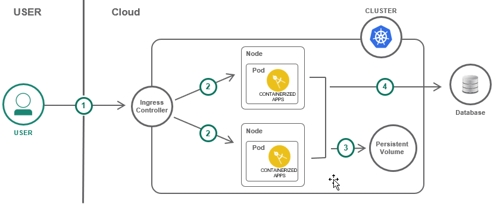
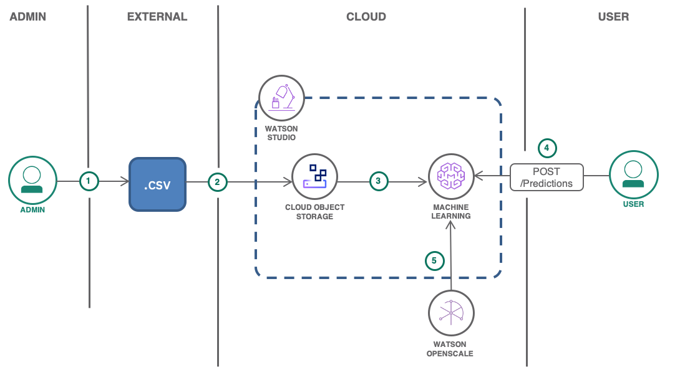

---
copyright:
  years: 2017, 2018
lastupdated: "2018-07-09"

---

{:shortdesc: .shortdesc}
{:new_window: target="_blank"}

# Solution tutorials
{: #tutorials}

Learn how to build, deploy and scale real-world solutions on IBM Cloud. These guides provide step-by-step instructions on how to use IBM Cloud to implement common patterns based on best practices and proven technologies.

## Featured Tutorials

    <a href = "multi-region-k8s-cis.html">
    

        

            <h3 id="multi-region-k8s-cis.html" class="solutionBoxTitle">
                Resilient and secure multi-region Kubernetes clusters
            </h3>
            

                

                    
Integrate Cloud Internet Services with Kubernetes clusters to deliver a resilient and secure solution across multiple regions.

                

                

                    
                

            

        

    

    </a>
    <a href = "slack-chatbot-database-watson.html">
    

        

            <h3 id="slack-chatbot-database-watson.html" class="solutionBoxTitle">
                Build a database-driven Slackbot
            </h3>
            

                

                    
Build a database-driven Slackbot with IBM Watson Assistant, Cloudant and IBM Cloud Functions.

                

                

                    
                

            

        

    

    </a>

## Websites and Web Apps
{: #websites }

    <a href = "multi-region-webapp.html">
    

        

            <h3 id="multi-region-webapp.html" class="solutionBoxTitle">
                Secure web application across multiple regions
            </h3>
            

                

                    
Create, secure, deploy, and load balance a web application across multiple regions using a continuous delivery pipeline.

                

                

                    
                

            

        

    

    </a>
    <a href = "scalable-webapp-kubernetes.html">
    

        

            <h3 id="scalable-webapp-kubernetes.html" class="solutionBoxTitle">
                Scalable web app on Kubernetes
            </h3>
            

                

                    
Scaffold a Java web application, run it locally in a container and then deploy it to a IBM Cloud Kubernetes cluster. Additionally, bind a custom domain, monitor the health of the environment and scale.

                

                

                    
                

            

        

    

    </a>
    <a href = "multi-region-k8s-cis.html">
    

        

            <h3 id="multi-region-k8s-cis.html" class="solutionBoxTitle">
                Resilient and secure multi-region Kubernetes clusters
            </h3>
            

                

                    
Integrate Cloud Internet Services with Kubernetes clusters to deliver a resilient and secure solution across multiple regions.

                

                

                    
                

            

        

    

    </a>
    <a href = "kubernetes-log-analysis-kibana.html">
    

        

            <h3 id="kubernetes-log-analysis-kibana.html" class="solutionBoxTitle">
                Analyze logs and monitor the health of Kubernetes applications
            </h3>
            

                

                    
Create a cluster and configuring the Log Analysis and the Monitoring service. Use Kibana to view and analyze logs and Grafana to view health and metrics.

                

                

                    
                

            

        

    

    </a>
    <a href = "vm-to-containers-and-kubernetes.html">
    

        

            <h3 id="vm-to-containers-and-kubernetes.html" class="solutionBoxTitle">
                Move a VM based application to Kubernetes
            </h3>
            

                

                    
Take a VM based application, containerize it, deploy it to a Kubernetes cluster. Use the steps as a general guides for other applications.

                

                

                    
                

            

        

    

    </a>
    <a href = "continuous-deployment-to-kubernetes.html">
    

        

            <h3 id="continuous-deployment-to-kubernetes.html" class="solutionBoxTitle">
                Continuous Deployment to Kubernetes
            </h3>
            

                

                    
Set up a continuous integration and delivery pipeline for containerized applications running on the {{site.data.keyword.containershort_notm}}. Add integrations to other services like security scanners, Slack notifications, and analytics.

                

                

                    
                

            

        

    

    </a>
    <a href = "static-files-cdn.html">
    

        

            <h3 id="static-files-cdn.html" class="solutionBoxTitle">
                Accelerate delivery of static files using Object Storage and CDN
            </h3>
            

                

                    
Host and serve website assets (images, videos, documents) and user generated content in a Cloud Object Storage and use a Content Delivery Network (CDN) for fast and secure delivery to users around the world.

                

                

                    
                

            

        

    

    </a>
    <a href = "pub-sub-object-storage.html">
    

        

            <h3 id="pub-sub-object-storage.html" class="solutionBoxTitle">
                Asynchronous data processing using object storage and pub/sub messaging
            </h3>
            

                

                    
Use the Apache Kafka based Message Hub to orchestrate workloads between microservices running in a Kubernetes cluster and store data in Object Storage.

                

                

                    
                

            

        

    

    </a>
    <a href = "lamp-stack.html">
    

        

            <h3 id="lamp-stack.html" class="solutionBoxTitle">
                Web application on LAMP stack
            </h3>
            

                

                    
Create an Ubuntu Linux virtual server, with Apache web server, MySQL, and PHP. Then install and configure the WordPress open source application on the LAMP stack.

                

                

                    
                

            

        

    

    </a>
    <a href = "infrastructure-as-code-terraform.html">
    

        

            <h3 id="infrastructure-as-code-terraform.html" class="solutionBoxTitle">
                Deploy a LAMP stack using Terraform
            </h3>
            

                

                    
Use Terraform to provision a Linux virtual server, with Apache web server, MySQL, PHP and the IBM Cloud Object Storage service. Update the configuration to scale the resources and tune the environment.

                

                

                    
                

            

        

    

    </a>
    <a href = "plan-create-update-deployments.html">
    

        

            <h3 id="plan-create-update-deployments.html" class="solutionBoxTitle">
                Plan, create and update deployment environments
            </h3>
            

                

                    
Automate the creation and maintenance of multiple deployment environments with IBM Cloud CLI and Terraform.

                

                

                    
                

            

        

    

    </a>
    <a href = "highly-available-and-scalable-web-application.html">
    

        

            <h3 id="highly-available-and-scalable-web-application.html" class="solutionBoxTitle">
                Use Virtual Servers to build highly available and scalable web app
            </h3>
            

                

                    
Create a load balancer, two application servers running on Ubuntu with NGINX and PHP installed, one MySQL database server, and durable file storage to store application files and backups.

                

                

                    
                

            

        

    

    </a>
    <a href = "mean-stack.html">
    

        

            <h3 id="mean-stack.html" class="solutionBoxTitle">
                Modern web application using MEAN stack
            </h3>
            

                

                    
Build a web application using the popular MEAN stack - Mongo DB, Express, Angular, Node.js. Run the app locally, create and use a database-as-a-service, deploy the app and monitor the application.

                

                

                    
                

            

        

    

    </a>
    <a href = "sql-database.html">
    

        

            <h3 id="sql-database.html" class="solutionBoxTitle">
                SQL Database for Cloud Data
            </h3>
            

                

                    
Provision a SQL relational database service, create a table, and load a large data set into the database. Deploy a web app to make use of that data and show how to access the cloud database.

                

                

                    
                

            

        

    

    </a>
    <a href = "serverless-api-webapp.html">
    

        

            <h3 id="serverless-api-webapp.html" class="solutionBoxTitle">
                Serverless web application and API
            </h3>
            

                

                    
Create a serverless web application by hosting static website content in GitHub Pages and using Cloud Functions to implement the application backend.

                

                

                    
                

            

        

    

    </a>
    <a href = "application-log-analysis.html">
    

        

            <h3 id="application-log-analysis.html" class="solutionBoxTitle">
                Analyze logs and monitor health of Cloud Foundry applications
            </h3>
            

                

                    
Use IBM Cloud Log Analysis to understand and diagnose application activities. Generate, search, analyze and visualize different log types using Elasticsearch and Kibana.

                

                

                    
                

            

        

    

    </a>
    <a href = "create-manage-secure-apis.html">
    

        

            <h3 id="create-manage-secure-apis.html" class="solutionBoxTitle">
                Create, secure and manage REST APIs
            </h3>
            

                

                    
Create a new REST API using the LoopBack Node.js API framework. Add management, visibility, security and rate limiting to the API using the API Connect service on IBM Cloud.

                

                

                    
                

            

        

    

    </a>

## Chatbots
{: #chatbots }

    <a href = "slack-chatbot-database-watson.html">
    

        

            <h3 id="slack-chatbot-database-watson.html" class="solutionBoxTitle">
                Build a database-driven Slackbot
            </h3>
            

                

                    
Build a database-driven Slackbot with IBM Watson Assistant, Cloudant and IBM Cloud Functions.

                

                

                    
                

            

        

    

    </a>
    <a href = "android-watson-chatbot.html">
    

        

            <h3 id="android-watson-chatbot.html" class="solutionBoxTitle">
                Build a voice-enabled Android chatbot
            </h3>
            

                

                    
Define intents, entities and build a dialog flow for the chatbot to respond to customer&#x27;s queries. Enable speech to text and text to speech services for easy interaction with the Android app.

                

                

                    
                

            

        

    

    </a>

## Mobile
{: #mobile }

    <a href = "ios-mobile-push-analytics.html">
    

        

            <h3 id="ios-mobile-push-analytics.html" class="solutionBoxTitle">
                iOS mobile app with Push Notifications and Analytics
            </h3>
            

                

                    
Create an iOS Swift application with high-value mobile services - Push Notifications and Mobile Analytics on IBM Cloud.

                

                

                    
                

            

        

    

    </a>
    <a href = "android-mobile-push-analytics.html">
    

        

            <h3 id="android-mobile-push-analytics.html" class="solutionBoxTitle">
                Android native mobile app with Push Notifications and Analytics
            </h3>
            

                

                    
Write an Android native application with high-value mobile services - Push Notifications and Mobile Analytics on IBM Cloud.

                

                

                    
                

            

        

    

    </a>
    <a href = "hybrid-mobile-push-analytics.html">
    

        

            <h3 id="hybrid-mobile-push-analytics.html" class="solutionBoxTitle">
                Hybrid mobile application with Push and Analytics
            </h3>
            

                

                    
Develop a hybrid Cordova application with high-value mobile services - Push Notifications and Mobile Analytics on IBM Cloud.

                

                

                    
                

            

        

    

    </a>
    <a href = "serverless-mobile-backend.html">
    

        

            <h3 id="serverless-mobile-backend.html" class="solutionBoxTitle">
                Mobile application with a serverless backend
            </h3>
            

                

                    
Use Cloud Functions with cognitive and data services to build a serverless backend for a mobile application.

                

                

                    
                

            

        

    

    </a>

## Machine Learning and Analytics
{: #ml }

    <a href = "smart-data-lake.html">
    

        

            <h3 id="smart-data-lake.html" class="solutionBoxTitle">
                Build a data lake with Object Storage
            </h3>
            

                

                    
Provide tools to data scientists to query data using SQL Query and conduct analysis in Watson Studio. Share data and insights through interactive charts using {{site.data.keyword.dynamdashbemb_short}}.

                

                

                    
                

            

        

    

    </a>
    <a href = "serverless-github-traffic-analytics.html">
    

        

            <h3 id="serverless-github-traffic-analytics.html" class="solutionBoxTitle">
                Combining serverless and Cloud Foundry for data retrieval and analytics
            </h3>
            

                

                    
Automatically collect GitHub traffic statistics for repositories, store them in a SQL database and get started with traffic analytics.

                

                

                    
                

            

        

    

    </a>
    <a href = "create-deploy-retrain-machine-learning-model.html">
    

        

            <h3 id="create-deploy-retrain-machine-learning-model.html" class="solutionBoxTitle">
                Build, deploy, test, and retrain a predictive machine learning model
            </h3>
            

                

                    
Build a predictive machine learning model, deploy it as an API, test and retrain the model with feedback data.

                

                

                    
                

            

        

    

    </a>
    <a href = "big-data-analytics-spark.html">
    

        

            <h3 id="big-data-analytics-spark.html" class="solutionBoxTitle">
                Analyze and visualize open data with Apache Spark
            </h3>
            

                

                    
Analyze and visualize open data sets using a Jupyter Notebook. Uses the Apache Spark service with IBM Watson Studio and Pixiedust to generate graphics.

                

                

                    
                

            

        

    

    </a>

## Internet of Things
{: #iot }

    <a href = "gather-visualize-analyze-iot-data.html">
    

        

            <h3 id="gather-visualize-analyze-iot-data.html" class="solutionBoxTitle">
                Gather, visualize and analyze IoT data
            </h3>
            

                

                    
Set up an IoT device, gather large amounts of data in the Watson IoT Platform, analyze data with machine learning and create visualizations.

                

                

                    
                

            

        

    

    </a>

## Identity and Access Management
{: #iam }

    <a href = "users-teams-applications.html">
    

        

            <h3 id="users-teams-applications.html" class="solutionBoxTitle">
                Best practices for organizing users, teams, applications
            </h3>
            

                

                    
An overview of the concepts available in IBM Cloud to manage identity and access management and how they can be implemented to support the multiple development stages of an application.

                

                

                    
                

            

        

    

    </a>

