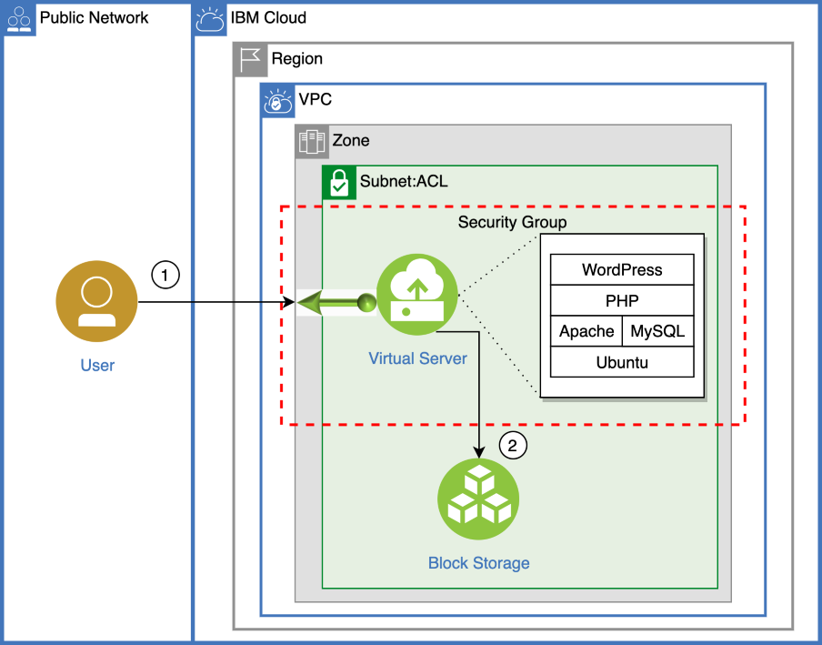
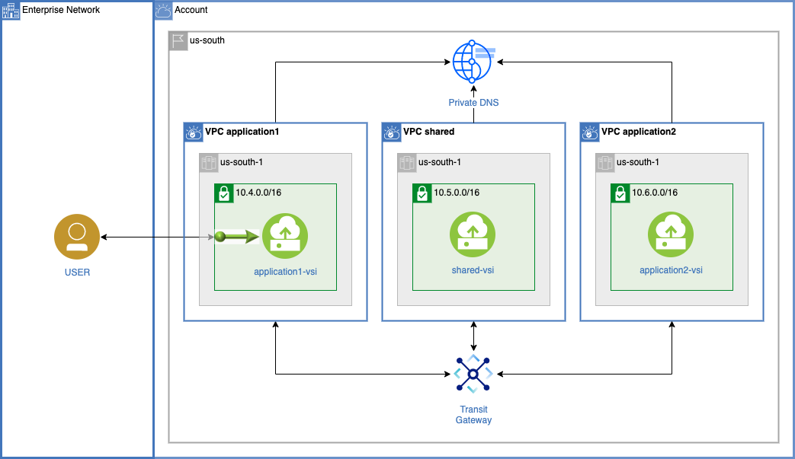
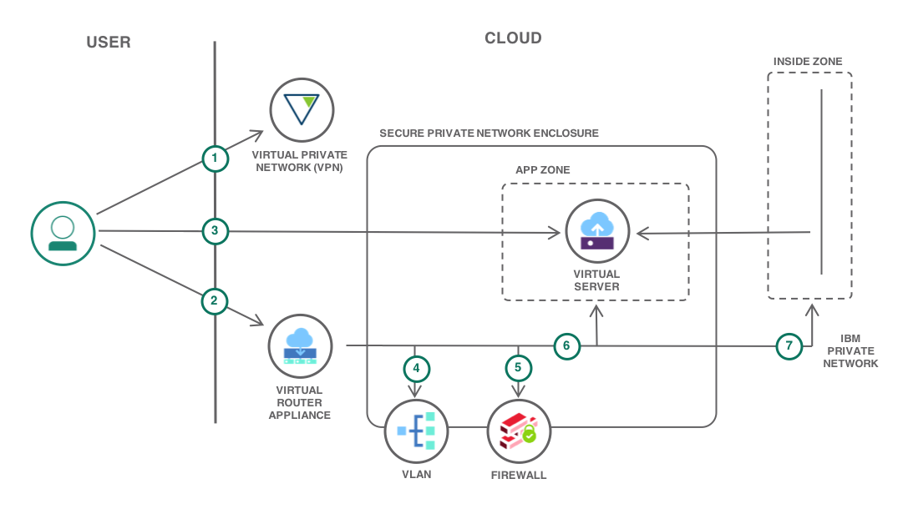
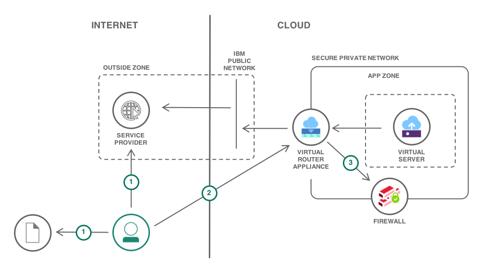

---
copyright:
  years: 2017, 2018, 2019, 2020
lastupdated: "2020-10-13"
---

{:shortdesc: .shortdesc}
{:new_window: target="_blank"}

# Solution tutorials
{: #tutorials}

Learn how to build, deploy and scale real-world solutions on IBM Cloud. These guides provide step-by-step instructions on how to use IBM Cloud to implement common patterns based on best practices and proven technologies.

## Featured Tutorials

    <a href = "/docs/solution-tutorials?topic=solution-tutorials-vpc-site2site-vpn#vpc-site2site-vpn">
    

        

            <h3 class="solutionBoxTitle">
                Use a VPC/VPN gateway for secure and private on-premises access to cloud resources
            </h3>
            

                

                    
Connect a Virtual Private Cloud to another computing environment over a secure Virtual Private Network and consume IBM Cloud services.

                

                

                    
                

            

        

    

    </a>
    <a href = "/docs/solution-tutorials?topic=solution-tutorials-scalable-webapp-openshift#scalable-webapp-openshift">
    

        

            <h3 class="solutionBoxTitle">
                Scalable web app on OpenShift
            </h3>
            

                

                    
Scaffold a nodejs web application, run it locally in a container and then deploy it to an OpenShift cluster. Additionally, bind a custom domain, monitor the health of the environment and scale.

                

                

                    
                

            

        

    

    </a>

## Websites and Web Apps
{: #websites }

    <a href = "/docs/solution-tutorials?topic=solution-tutorials-scalable-webapp-kubernetes#scalable-webapp-kubernetes">
    

        

            <h3 class="solutionBoxTitle">
                Scalable web app on Kubernetes
            </h3>
            

                

                    
Scaffold a Java web application, run it locally in a container and then deploy it to a Kubernetes cluster. Additionally, bind a custom domain, monitor the health of the environment and scale.

                

                

                    
                

            

        

    

    </a>
    <a href = "/docs/solution-tutorials?topic=solution-tutorials-vm-to-containers-and-kubernetes#vm-to-containers-and-kubernetes">
    

        

            <h3 class="solutionBoxTitle">
                Move a VM based application to Kubernetes
            </h3>
            

                

                    
Take a VM based application, containerize it, deploy it to a Kubernetes cluster. Use the steps as a general guides for other applications.

                

                

                    
                

            

        

    

    </a>
    <a href = "/docs/solution-tutorials?topic=solution-tutorials-strategies-for-resilient-applications#strategies-for-resilient-applications">
    

        

            <h3 class="solutionBoxTitle">
                Strategies for resilient applications
            </h3>
            

                

                    
Regardless of the Compute option: Kubernetes, Cloud Foundry, Cloud Functions or Virtual Servers, enterprises seek to minimize downtime and create resilient architectures that achieve maximum availability.

                

                

                    
                

            

        

    

    </a>
    <a href = "/docs/solution-tutorials?topic=solution-tutorials-continuous-deployment-to-kubernetes#continuous-deployment-to-kubernetes">
    

        

            <h3 class="solutionBoxTitle">
                Continuous Deployment to Kubernetes
            </h3>
            

                

                    
Set up a continuous integration and delivery pipeline for containerized applications running on a Kubernetes cluster. Add integrations to other services like security scanners, Slack notifications, and analytics.

                

                

                    
                

            

        

    

    </a>
    <a href = "/docs/solution-tutorials?topic=solution-tutorials-scalable-webapp-openshift#scalable-webapp-openshift">
    

        

            <h3 class="solutionBoxTitle">
                Scalable web app on OpenShift
            </h3>
            

                

                    
Scaffold a nodejs web application, run it locally in a container and then deploy it to an OpenShift cluster. Additionally, bind a custom domain, monitor the health of the environment and scale.

                

                

                    
                

            

        

    

    </a>
    <a href = "/docs/solution-tutorials?topic=solution-tutorials-openshift-service-mesh#openshift-service-mesh">
    

        

            <h3 class="solutionBoxTitle">
                Service Mesh on OpenShift
            </h3>
            

                

                    
Install Red Hat OpenShift Service Mesh alongside microservices for a sample app called BookInfo in a Red Hat OpenShift on IBM Cloud cluster.

                

                

                    
                

            

        

    

    </a>
    <a href = "/docs/solution-tutorials?topic=solution-tutorials-openshift-microservices#openshift-microservices">
    

        

            <h3 class="solutionBoxTitle">
                Deploy microservices with OpenShift
            </h3>
            

                

                    
Deploy microservices to an OpenShift cluster, view their logs and metrics, use an operator to provision IBM Cloud services.

                

                

                    
                

            

        

    

    </a>
    <a href = "/docs/solution-tutorials?topic=solution-tutorials-static-files-cdn#static-files-cdn">
    

        

            <h3 class="solutionBoxTitle">
                Accelerate delivery of static files using Object Storage and CDN
            </h3>
            

                

                    
Host and serve website assets (images, videos, documents) and user generated content in a Cloud Object Storage and use a Content Delivery Network (CDN) for fast and secure delivery to users around the world.

                

                

                    
                

            

        

    

    </a>
    <a href = "/docs/solution-tutorials?topic=solution-tutorials-dynamic-content-cdn#dynamic-content-cdn">
    

        

            <h3 class="solutionBoxTitle">
                Accelerate a dynamic website using Dynamic Content Acceleration
            </h3>
            

                

                    
Use Dynamic Content Acceleration to reduce latency for dynamic and uncacheable contents of your web application.

                

                

                    
                

            

        

    

    </a>
    <a href = "/docs/solution-tutorials?topic=solution-tutorials-pub-sub-object-storage#pub-sub-object-storage">
    

        

            <h3 class="solutionBoxTitle">
                Asynchronous data processing using object storage and pub/sub messaging
            </h3>
            

                

                    
Use the Apache Kafka based Message Hub to orchestrate workloads between microservices running in a Kubernetes cluster and store data in Object Storage.

                

                

                    
                

            

        

    

    </a>
    <a href = "/docs/solution-tutorials?topic=solution-tutorials-plan-create-update-deployments#plan-create-update-deployments">
    

        

            <h3 class="solutionBoxTitle">
                Plan, create and update deployment environments
            </h3>
            

                

                    
Automate the creation and maintenance of multiple deployment environments with IBM Cloud CLI and Terraform.

                

                

                    
                

            

        

    

    </a>
    <a href = "/docs/solution-tutorials?topic=solution-tutorials-highly-available-and-scalable-web-application#highly-available-and-scalable-web-application">
    

        

            <h3 class="solutionBoxTitle">
                Use Virtual Servers to build highly available and scalable web app
            </h3>
            

                

                    
Create a load balancer, two application servers running on Ubuntu with NGINX and PHP installed, one MySQL database server, and durable file storage to store application files and backups.

                

                

                    
                

            

        

    

    </a>
    <a href = "/docs/solution-tutorials?topic=solution-tutorials-mean-stack#mean-stack">
    

        

            <h3 class="solutionBoxTitle">
                Modern web application using MEAN stack
            </h3>
            

                

                    
Build a web application using the popular MEAN stack - Mongo DB, Express, Angular, Node.js. Run the app locally, create and use a database-as-a-service, deploy the app and monitor the application.

                

                

                    
                

            

        

    

    </a>
    <a href = "/docs/solution-tutorials?topic=solution-tutorials-sql-database#sql-database">
    

        

            <h3 class="solutionBoxTitle">
                SQL Database for Cloud Data
            </h3>
            

                

                    
Provision a SQL relational database service, create a table, and load a large data set into the database. Deploy a web app to make use of that data and show how to access the cloud database.

                

                

                    
                

            

        

    

    </a>
    <a href = "/docs/solution-tutorials?topic=solution-tutorials-serverless-api-webapp#serverless-api-webapp">
    

        

            <h3 class="solutionBoxTitle">
                Serverless web application and API
            </h3>
            

                

                    
Create a serverless web application by hosting static website content in GitHub Pages and using Cloud Functions to implement the application backend.

                

                

                    
                

            

        

    

    </a>
    <a href = "/docs/solution-tutorials?topic=solution-tutorials-multi-region-serverless#multi-region-serverless">
    

        

            <h3 class="solutionBoxTitle">
                Deploy serverless apps across multiple regions
            </h3>
            

                

                    
Use Cloud Functions and Internet Services to build globally available and secure serverless applications.

                

                

                    
                

            

        

    

    </a>
    <a href = "/docs/solution-tutorials?topic=solution-tutorials-application-log-analysis#application-log-analysis">
    

        

            <h3 class="solutionBoxTitle">
                Analyze logs and monitor application health with LogDNA and Sysdig
            </h3>
            

                

                    
Use IBM Log Analysis with LogDNA to understand and diagnose application activities. Monitor applications with IBM Cloud Monitoring with Sysdig.

                

                

                    
                

            

        

    

    </a>
    <a href = "/docs/solution-tutorials?topic=solution-tutorials-image-classification-code-engine#image-classification-code-engine">
    

        

            <h3 class="solutionBoxTitle">
                Visual Recognition with Code Engine
            </h3>
            

                

                    
Create a Code Engine project and deploy an image classification application.

                

                

                    
                

            

        

    

    </a>

## Chatbots
{: #chatbots }

    <a href = "/docs/solution-tutorials?topic=solution-tutorials-slack-chatbot-database-watson#slack-chatbot-database-watson">
    

        

            <h3 class="solutionBoxTitle">
                Build a database-driven Slackbot
            </h3>
            

                

                    
Build a database-driven Slackbot with IBM Watson Assistant, Cloudant and IBM Cloud Functions.

                

                

                    
                

            

        

    

    </a>
    <a href = "/docs/solution-tutorials?topic=solution-tutorials-android-watson-chatbot#android-watson-chatbot">
    

        

            <h3 class="solutionBoxTitle">
                Build a voice-enabled Android chatbot
            </h3>
            

                

                    
Define intents, entities and build a dialog flow for the chatbot to respond to customer's queries. Enable speech to text and text to speech services for easy interaction with the Android app.

                

                

                    
                

            

        

    

    </a>

## Security
{: #security }

    <a href = "/docs/solution-tutorials?topic=solution-tutorials-multi-region-webapp#multi-region-webapp">
    

        

            <h3 class="solutionBoxTitle">
                Secure web application across multiple regions
            </h3>
            

                

                    
Create, secure, deploy, and load balance a web application across multiple regions using a continuous delivery pipeline.

                

                

                    
                

            

        

    

    </a>
    <a href = "/docs/solution-tutorials?topic=solution-tutorials-multi-region-k8s-cis#multi-region-k8s-cis">
    

        

            <h3 class="solutionBoxTitle">
                Resilient and secure multi-region Kubernetes clusters
            </h3>
            

                

                    
Integrate Cloud Internet Services with Kubernetes clusters to deliver a resilient and secure solution across multiple regions.

                

                

                    
                

            

        

    

    </a>
    <a href = "/docs/solution-tutorials?topic=solution-tutorials-create-manage-secure-apis#create-manage-secure-apis">
    

        

            <h3 class="solutionBoxTitle">
                Create, secure and manage REST APIs
            </h3>
            

                

                    
Create a new REST API using the LoopBack Node.js API framework. Add management, visibility, security and rate limiting to the API using the API Connect service on IBM Cloud.

                

                

                    
                

            

        

    

    </a>
    <a href = "/docs/solution-tutorials?topic=solution-tutorials-cloud-e2e-security#cloud-e2e-security">
    

        

            <h3 class="solutionBoxTitle">
                Apply end to end security to a cloud application
            </h3>
            

                

                    
Create a secure cloud application that features data encrypted with your own keys, user authentication, and security auditing.

                

                

                    
                

            

        

    

    </a>
    <a href = "/docs/solution-tutorials?topic=solution-tutorials-extended-app-security#extended-app-security">
    

        

            <h3 class="solutionBoxTitle">
                Enhance security of your deployed application
            </h3>
            

                

                    
Enhance security of your cloud application by isolating compute, network and runtime resources.

                

                

                    
                

            

        

    

    </a>

## Mobile
{: #mobile }

    <a href = "/docs/solution-tutorials?topic=solution-tutorials-ios-mobile-push-analytics#ios-mobile-push-analytics">
    

        

            <h3 class="solutionBoxTitle">
                iOS mobile app with Push Notifications
            </h3>
            

                

                    
Create an iOS Swift application with Push Notifications on IBM Cloud.

                

                

                    
                

            

        

    

    </a>
    <a href = "/docs/solution-tutorials?topic=solution-tutorials-android-mobile-push-analytics#android-mobile-push-analytics">
    

        

            <h3 class="solutionBoxTitle">
                Android native mobile app with Push Notifications
            </h3>
            

                

                    
Write an Android native application with Push Notifications on IBM Cloud.

                

                

                    
                

            

        

    

    </a>
    <a href = "/docs/solution-tutorials?topic=solution-tutorials-serverless-mobile-backend#serverless-mobile-backend">
    

        

            <h3 class="solutionBoxTitle">
                Mobile application with a serverless backend
            </h3>
            

                

                    
Use Cloud Functions with cognitive and data services to build a serverless backend for a mobile application.

                

                

                    
                

            

        

    

    </a>

## Machine Learning and Analytics
{: #ml }

    <a href = "/docs/solution-tutorials?topic=solution-tutorials-big-data-log-analytics#big-data-log-analytics">
    

        

            <h3 class="solutionBoxTitle">
                Big data logs with streaming analytics and SQL
            </h3>
            

                

                    
Collect, store and analyze log records to support regulatory requirements and aid information discovery. Using publish-subscribe messaging, scale the solution to millions of records and then perform analysis on persisted logs with familiar SQL.

                

                

                    
                

            

        

    

    </a>
    <a href = "/docs/solution-tutorials?topic=solution-tutorials-smart-data-lake#smart-data-lake">
    

        

            <h3 class="solutionBoxTitle">
                Build a data lake with Object Storage
            </h3>
            

                

                    
Provide tools to data scientists to query data using SQL Query and conduct analysis in Watson Studio. Share data and insights through interactive charts.

                

                

                    
                

            

        

    

    </a>
    <a href = "/docs/solution-tutorials?topic=solution-tutorials-serverless-github-traffic-analytics#serverless-github-traffic-analytics">
    

        

            <h3 class="solutionBoxTitle">
                Combining serverless and Cloud Foundry for data retrieval and analytics
            </h3>
            

                

                    
Automatically collect GitHub traffic statistics for repositories, store them in a SQL database and get started with traffic analytics.

                

                

                    
                

            

        

    

    </a>
    <a href = "/docs/solution-tutorials?topic=solution-tutorials-create-deploy-retrain-machine-learning-model#create-deploy-retrain-machine-learning-model">
    

        

            <h3 class="solutionBoxTitle">
                Build, deploy, test and monitor a predictive machine learning model
            </h3>
            

                

                    
Build a predictive machine learning model, deploy it as an API, test and retrain the model with feedback data.

                

                

                    
                

            

        

    

    </a>

## Internet of Things
{: #iot }

    <a href = "/docs/solution-tutorials?topic=solution-tutorials-gather-visualize-analyze-iot-data#gather-visualize-analyze-iot-data">
    

        

            <h3 class="solutionBoxTitle">
                Gather, visualize and analyze IoT data
            </h3>
            

                

                    
Set up an IoT device, gather large amounts of data in the Watson IoT Platform, analyze data with machine learning and create visualizations.

                

                

                    
                

            

        

    

    </a>

## Identity and Access Management
{: #iam }

    <a href = "/docs/solution-tutorials?topic=solution-tutorials-users-teams-applications#users-teams-applications">
    

        

            <h3 class="solutionBoxTitle">
                Best practices for organizing users, teams, applications
            </h3>
            

                

                    
An overview of the concepts available in IBM Cloud to manage identity and access management and how they can be implemented to support the multiple development stages of an application.

                

                

                    
                

            

        

    

    </a>

## Virtual Private Cloud
{: #VPC }

<a name="Network">&nbsp;</a>
    <a href = "/docs/solution-tutorials?topic=solution-tutorials-vpc-public-app-private-backend#vpc-public-app-private-backend">
    

        

            <h3 class="solutionBoxTitle">
                Public frontend and private backend in a Virtual Private Cloud
            </h3>
            

                

                    
Create a virtual private cloud with subnets and instances. Secure your resources by attaching security groups and only allow minimal access.

                

                

                    
                

            

        

    

    </a>
    <a href = "/docs/solution-tutorials?topic=solution-tutorials-vpc-multi-region#vpc-multi-region">
    

        

            <h3 class="solutionBoxTitle">
                Deploy isolated workloads across multiple locations and zones
            </h3>
            

                

                    
Deploy a workload in virtual private clouds across multiple zones and regions. Distribute traffic across zones with local and global load balancers.

                

                

                    
                

            

        

    

    </a>
    <a href = "/docs/solution-tutorials?topic=solution-tutorials-vpc-site2site-vpn#vpc-site2site-vpn">
    

        

            <h3 class="solutionBoxTitle">
                Use a VPC/VPN gateway for secure and private on-premises access to cloud resources
            </h3>
            

                

                    
Connect a Virtual Private Cloud to another computing environment over a secure Virtual Private Network and consume IBM Cloud services.

                

                

                    
                

            

        

    

    </a>
    <a href = "/docs/solution-tutorials?topic=solution-tutorials-vpc-app-deploy#vpc-app-deploy">
    

        

            <h3 class="solutionBoxTitle">
                Install software on virtual server instances in VPC
            </h3>
            

                

                    
Learn how to use the IBM Cloud CLI, Terraform and Ansible to install software on virtual server instances running in a Virtual Private Cloud.

                

                

                    
                

            

        

    

    </a>
    <a href = "/docs/solution-tutorials?topic=solution-tutorials-vpc-secure-management-bastion-server#vpc-secure-management-bastion-server">
    

        

            <h3 class="solutionBoxTitle">
                Securely access remote instances with a bastion host
            </h3>
            

                

                    
Deploy a bastion host to securely access remote instances within a virtual private cloud.

                

                

                    
                

            

        

    

    </a>
    <a href = "/docs/solution-tutorials?topic=solution-tutorials-lamp-stack-on-vpc#lamp-stack-on-vpc">
    

        

            <h3 class="solutionBoxTitle">
                PHP web application on a LAMP Stack in VPC Gen2
            </h3>
            

                

                    
Create an Ubuntu Linux virtual server on VPC, with Apache web server, MySQL, and PHP. Then install and configure the WordPress open source application on the LAMP stack.

                

                

                    
                

            

        

    

    </a>
    <a href = "/docs/solution-tutorials?topic=solution-tutorials-vpc-tg-dns-iam#vpc-tg-dns-iam">
    

        

            <h3 class="solutionBoxTitle">
                Team based privacy using IAM, VPC, Transit Gateway and DNS
            </h3>
            

                

                    
Connect multiple VPCs with Transit Gateway. Use DNS name resolution for microservices. Work in isolated teams with IAM

                

                

                    
                

            

        

    

    </a>

## Classic Infrastructure
{: #classic }

    <a href = "/docs/solution-tutorials?topic=solution-tutorials-secure-network-enclosure#secure-network-enclosure">
    

        

            <h3 class="solutionBoxTitle">
                Isolate workloads with a secure private network
            </h3>
            

                

                    
Configure a Virtual Router Appliance to create a secure enclosure. Associate VLANs, provision servers, setup IP routing and firewalls.

                

                

                    
                

            

        

    

    </a>
    <a href = "/docs/solution-tutorials?topic=solution-tutorials-nat-config-private#nat-config-private">
    

        

            <h3 class="solutionBoxTitle">
                Configure NAT for Internet access from a private network
            </h3>
            

                

                    
Use NAT masquerade to translate private IP addresses to out-bound public interface.

                

                

                    
                

            

        

    

    </a>
    <a href = "/docs/solution-tutorials?topic=solution-tutorials-byoip#byoip">
    

        

            <h3 class="solutionBoxTitle">
                Bring Your Own IP Address
            </h3>
            

                

                    
An overview of BYOIP implementation patterns and a guide to identify the appropriate pattern.

                

                

                    
                

            

        

    

    </a>
    <a href = "/docs/solution-tutorials?topic=solution-tutorials-configuring-IPSEC-VPN#configuring-IPSEC-VPN">
    

        

            <h3 class="solutionBoxTitle">
                VPN into a secure private network
            </h3>
            

                

                    
Create a private connection between a remote network environment and servers on IBM Cloud's private network.

                

                

                    
                

            

        

    

    </a>
    <a href = "/docs/solution-tutorials?topic=solution-tutorials-linking-secure-network-enclosures#linking-secure-network-enclosures">
    

        

            <h3 class="solutionBoxTitle">
                Linking secure private networks over the IBM network
            </h3>
            

                

                    
Deploy two private networks that are securely linked over the IBM Cloud private network using the VLAN Spanning service.

                

                

                    
                

            

        

    

    </a>
    <a href = "/docs/solution-tutorials?topic=solution-tutorials-web-app-private-network#web-app-private-network">
    

        

            <h3 class="solutionBoxTitle">
                Hosting web applications from a secure private network
            </h3>
            

                

                    
Create a scalable and secure Internet facing web application hosted in private network secured using a virtual router appliance (VRA), VLANs, NAT and firewalls.

                

                

                    
                

            

        

    

    </a>

## VMware Solutions
{: #vmware }

    <a href = "/docs/solution-tutorials?topic=solution-tutorials-vmware-solutions-shared-getting-started#vmware-solutions-shared-getting-started">
    

        

            <h3 class="solutionBoxTitle">
                Getting Started with IBM Cloud for VMware Solutions Shared
            </h3>
            

                

                    
Create a network for Internet and IBM Cloud private access inside of a VMware virtual data center and deploy a virtual machine.

                

                

                    
                

            

        

    

    </a>

## High Performance Computing
{: #hpc }

    <a href = "/docs/solution-tutorials?topic=solution-tutorials-hpc-eda#hpc-eda">
    

        

            <h3 class="solutionBoxTitle">
                Extend an existing IBM Spectrum LSF cluster to the IBM Cloud
            </h3>
            

                

                    
Build and configure an hybrid environment for a IBM Spectrum LSF Multi-Cluster

                

                

                    
                

            

        

    

    </a>
    <a href = "/docs/solution-tutorials?topic=solution-tutorials-hpc-lsf-on-vpc#hpc-lsf-on-vpc">
    

        

            <h3 class="solutionBoxTitle">
                Provision an IBM Spectrum LSF cluster on the Virtual Private Cloud
            </h3>
            

                

                    
Provision and configure IBM Cloud resources to create an IBM Spectrum LSF cluster.

                

                

                    
                

            

        

    

    </a>

