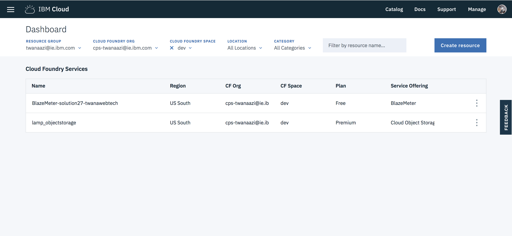

{:shortdesc: .shortdesc}
{:new_window: target="_blank"}
{:codeblock: .codeblock}
{:screen: .screen}
{:tip: .tip}
{:pre: .pre}

# Deploy a LAMP stack using Terraform
{: #infrastructure-as-code-terraform}

[Terraform](https://www.terraform.io/) enables you to safely and predictably create, change, and improve infrastructure. It is an open source tool that codifies APIs into declarative configuration files that can be shared amongst team members, treated as code, edited, reviewed, and versioned.

In this tutorial, you will use a sample configuration to provision a **L**inux virtual server, with **A**pache web server, **M**ySQL, and **P**HP server termed as **LAMP** stack. You will then update the configuration to add the {{site.data.keyword.cos_full_notm}} service and scale the resources to tune the environment (memory, CPU, and disk size). Finish by deleting all of the resources created by the configuration.

## Objectives
{: #objectives}

* Configure Terraform and the {{site.data.keyword.Bluemix_notm}} Provider for Terraform.
* Use Terraform to create, update, scale and finally destroy a LAMP stack configuration.

## Services used
{: #services}

This tutorial uses the following runtimes and services:
* [{{site.data.keyword.virtualmachinesshort}}
](https://{DomainName}/catalog/infrastructure/virtual-server-group)
* [{{site.data.keyword.cos_full_notm}}](https://{DomainName}/catalog/services/cloud-object-storage)

This tutorial may incur costs. Use the [Pricing Calculator](https://{DomainName}/estimator/review) to generate a cost estimate based on your projected usage.

## Architecture
{: #architecture}

<p style="text-align: center;">

  
</p>

1. A set of Terraform files are created to describe the LAMP stack configuration.
1. `terraform` is invoked from the configuration directory.
1. `terraform` calls the {{site.data.keyword.cloud_notm}} API to provision the resources.

## Before you begin
{: #prereqs}

Contact your Infrastructure master user to get the following permissions:
- Network (to add **Public and Private Network Uplink**)
- API Key

## Prerequisites

{: #prereq}

Install **Terraform** and the {{site.data.keyword.Bluemix_notm}} provider.  See, Automating cloud resource provisioning with Terraform [Getting started tutorial](https://{DomainName}/docs/terraform).

Take special notice of the [Configuring the IBM Cloud Provider plug-in](https://{DomainName}/docs/terraform?topic=terraform-configure_provider#retrieve_credentials).  The values for the following are required for this tutorial.
```
softlayer_username = "<infrastructure_username>"
softlayer_api_key = "<infrastructure_apikey>"
ibmcloud_api_key = "<platform_api_key>"
```

Note the values for the **SoftLayer** username and api key, and the {{site.data.keyword.Bluemix_notm}} API Key.  These will be used in the next section.

## Prepare terraform configuration

{: #terraformconfig}

In this section, you will learn the basics of a terraform configuration by using a sample Terraform configuration provided by {{site.data.keyword.Bluemix_notm}}.

1. Clone the sample configuration:
   ```bash
   git clone https://github.com/IBM-Cloud/LAMP-terraform-ibm
   ```
   {:pre}
3. Inspect the configuration files
   - [install.yml](https://github.com/IBM-Cloud/LAMP-terraform-ibm/blob/master/install.yml) - contains server installation configurations. Use this file to perform software installation or to create files on the server.
   - [provider.tf](https://github.com/IBM-Cloud/LAMP-terraform-ibm/blob/master/provider.tf) - contains the configuration of the provider such as the credentials to access {{site.data.keyword.Bluemix_notm}}.
   - [vm.tf](https://github.com/IBM-Cloud/LAMP-terraform-ibm/blob/master/vm.tf) - contains the server configurations to deploy the VM with specified variables.
   - [terraform.tfvars.template](https://github.com/IBM-Cloud/LAMP-terraform-ibm/blob/master/terraform.tfvars.template) - variables that terraform will prompt you to enter.
4. Copy the `terraform.tfvars.template` file to `terraform.tfvars`.  Open the `terraform.tfvars` with your IDE, modify the file by adding the values mentioned in the previous section.  Any variable defaults in the `.tf` files can be specified in this file.

Note on SSH key - The public key from a private/public key pair is required to create a virtual machine instance.  If you already have a key pair it is likely in this file: `~/.ssh/id_rsa.pub` (the private key does not have the .pub file extension and should not be used). [SSH Keys](https://{DomainName}/docs/vpc-on-classic-vsi?topic=vpc-on-classic-vsi-ssh-keys) will help you create the pair if needed.

## Create a LAMP stack server from the terraform configuration
{: #Createserver}
In this section, you will learn how to create a LAMP stack server from the terraform configuration sample. The configuration is used to provision a virtual machine instance and install **A**pache, **M**ySQL (**M**ariaDB), and **P**HP onto that instance.

1. Navigate to the folder of the repo you cloned.
   ```bash
    cd LAMP-terraform-ibm
   ```
   {: pre}
2. Initialize the terraform configuration. This will also install `terraform-provider-ibm_VERSION` plugin.
   ````bash
    terraform init
   ````
   {: pre}
3. Apply the terraform configuration. This will create the resources defined in the configuration.
   ```
    terraform apply
   ```
   {: pre}
   You should see an output similar to below.
4. Next, head over to your [infrastructure device list](https://{DomainName}/classic/devices) to verify that the server was created.
   

**Note:** after running the terraform apply command successfully, you should see a new `terraform.tfstate` file added to your directory. This file contains the full deployment configuration and is used by terraform as a baseline to compare against future modifications to your configuration. If this file is removed or lost then you will lose your terraform deployment configurations.
{: tip}

## Add the {{site.data.keyword.cos_full_notm}} service and scale the resources

{: #modify}

In this section, you are going to look at how to scale the virtual server resource and add an [{{site.data.keyword.cos_full_notm}}](https://{DomainName}/catalog/services/cloud-object-storage) service to your infrastructure environment.

1. Add the following lines to the `terraform.tfvars` file to increase the number of cores and memory and save the file:
   ```
   cores = 2
   memory = 2048
   ```
   {: codeblock}
2. Next, add a new [{{site.data.keyword.cos_full_notm}}](https://{DomainName}/catalog/services/cloud-object-storage) service. To do that create a new file and name it **ibm-cloud-object-storage.tf**. Add the code snippets below to the newly created file. The code snippets below creates a variable for the Identity and Access Management, IAM, resource group. It sets the {{site.data.keyword.cos_full_notm}} service name to `lamp_objectstorage`, service to the fully qualified name and plan type. The code below will create a standard plan. This is a pay-as-you-go plan. You can also use the lite plan, but note that the lite plan is limited to only one service per account.

   ```
   # a cloud object storage
   variable "resource_group" {
     default     = "default"
     description = "resource group"
   }
   
   data "ibm_resource_group" "group" {
     name = "${var.resource_group}"
   }
   
   resource "ibm_resource_instance" "objectstorage" {
     name              = "lamp_objectstorage"
     service           = "cloud-object-storage"
     plan              = "standard"
     location          = "global"
     resource_group_id = "${data.ibm_resource_group.group.id}"
     parameters = {
       "HMAC" = true
     }
   }
   ```
   {: codeblock}
   **Note:** we will later look for `lamp_objectstorage` in the logs to make sure {{site.data.keyword.cos_full_notm}} created successfully.

4. Apply the terraform changes by running:
   ```bash
    terraform apply
   ```
   {: pre}

## Verify VM and {{site.data.keyword.cos_short}}
{: #verifyvm}

In this section, you are going to verify the VM and {{site.data.keyword.cos_short}} to make sure it has been created successfully.

**Verify VM**

1. On the left side menu, click on **Infrastructure** to view the list of virtual server devices.
2. Click **Devices** -> **Device List** to find the server created. You should see your server device listed.
3. Click on the server to view more information on the server configuration. Looking at the screenshot below, we can see that the server is successfully created. 
4. Next, let's test the server in the web browser. Open the server public IP address in the web browser. You should see the server default installation page like below.


**Verify {{site.data.keyword.cos_full_notm}}**

1. From the [Resource list](https://{DomainName}/resources) of the **{{site.data.keyword.Bluemix_notm}} Dashboard**, you should see an instance of the {{site.data.keyword.cos_full_notm}} service been created for you and ready for use. 

   More info on {{site.data.keyword.cos_full_notm}} can be found [here](https://{DomainName}/docs/services/cloud-object-storage?topic=cloud-object-storage-about-ibm-cloud-object-storage#about-ibm-cloud-object-storage).

## Remove resources
{: #deleteresources}

Delete resources using the following command:
   ```bash
   terraform destroy
   ```
   {: pre}

**Note:** To delete resources, you would need Infrastructure admin permissions. If you don't have an admin superuser account, then please request to cancel the resources using the infrastructure dashboard. You can request to cancel a device from the infrastructure dashboard under the devices. 

## Related content

- [Terraform](https://www.terraform.io/)
- [{{site.data.keyword.cos_full_notm}}](https://{DomainName}/docs/services/cloud-object-storage?topic=cloud-object-storage-about-ibm-cloud-object-storage#about-ibm-cloud-object-storage)
- [{{site.data.keyword.Bluemix_notm}} Provider for Terraform](https://ibm-cloud.github.io/tf-ibm-docs/)
- [Accelerate delivery of static files using a CDN - {{site.data.keyword.cos_full_notm}}](https://{DomainName}/docs/tutorials?topic=solution-tutorials-static-files-cdn#static-files-cdn)

