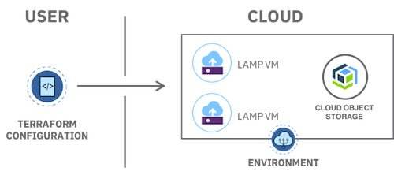
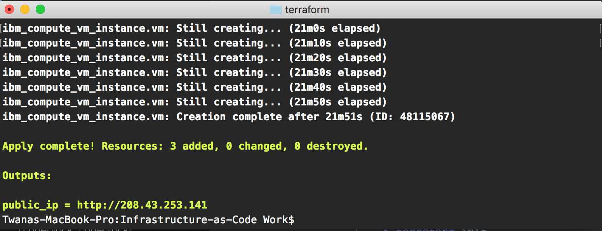
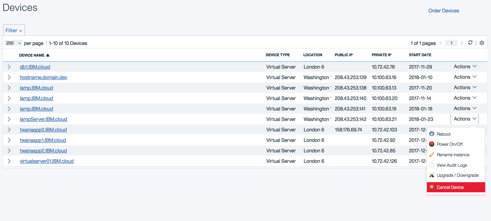

---
copyright:
  years: 2017, 2018
lastupdated: "2018-01-25"
---

{:shortdesc: .shortdesc}
{:new_window: target="_blank"}
{:codeblock: .codeblock}
{:screen: .screen}
{:tip: .tip}
{:pre: .pre}

# Automate deployment of environments using Terraform

[Terraform](https://www.terraform.io/) enables you to safely and predictably create, change, and improve infrastructure. It is an open source tool that codifies APIs into declarative configuration files that can be shared amongst team members, treated as code, edited, reviewed, and versioned.

In this tutorial, you will use a sample configuration to provision a **L**inux virtual server, with **A**pache web server, **M**ySQL, and **P**HP server termed as **LAMP** stack. You will then update the configuration to add an Object Storage service and scale the resources to tune the environment (memory, CPU, and disk size). Finish by deleting all of the resources created by the configuration.

## Objectives

- Terraform setup with IBM Cloud Provider
- Prepare terraform configuration
- Create a LAMP stack from the terraform configuration
- Update configuration to add Object Storage and scale resources
- Verify updates infrastructure
- Delete the environment



## Products
{: #products}

- [Terraform](https://console.bluemix.net/schematics)
- [IBM Cloud Infrastructure](https://console.bluemix.net/dashboard/ibm-iaas-g1)
- [Object Storage](https://console.bluemix.net/catalog/infrastructure/cloud-object-storage)

## Before you begin
{: #prereqs}

Contact your Infrastructure master user to get the following permissions:
- Network (to add **Public and Private Network Uplink**)
- API Key

## Prerequisites

{: #prereq}

Install **Terraform** via [installer](https://www.terraform.io/intro/getting-started/install.html) or use [Homebrew](https://brew.sh/) on macOS by running the command: `brew install terraform`

On **Windows**, follow the below steps to complete terraform setup.
1. Copy files from the downloaded zip to `C:\terraform`
2. Open the command prompt as an administrator and set the PATH to use terraform binaries.
     ```
      set PATH=%PATH%;C:\terraform
     ```

## Terraform setup with IBM Cloud Provider

{: #setup}

In this section, you will configure the CLI to specify the location of the IBM Cloud plugin.

1. Check Terraform installation by running `terraform` in your terminal window.  You should see a list of `Common commands`.
  ```bash
  terraform
  ```

2. Download the appropriate [IBM Cloud Provider](https://github.com/IBM-Cloud/terraform-provider-ibm/releases) plugin for your system and extract the archive. You should see the  `terraform-provider-ibm` binary plugin file.

3. For non-Windows systems, create a `.terraform.d/plugins` directory in your user's home directory and place the binary file inside of it. Use the following commands for reference.
  ```
  mkdir -p $HOME/.terraform.d/plugins
  mv $HOME/Downloads/terraform-provider-ibm $HOME/.terraform.d/plugins/
  ```
   On **Windows**, the file needs to be placed in `terraform.d/plugins` beneath your user's "Application Data" directory.Run the below commands on a command prompt
[Provider Configuration](https://www.terraform.io/docs/configuration/providers.html)
   ```
  MD %USERPROFILE%\AppData\terraform.d\plugins
  ```
  ```
   MOVE PATH_TO_UNZIPPED_PROVIDER_FILE\terraform-provider-ibm.exe  %USERPROFILE%\AppData\terraform.d\plugins
  ```

## Prepare terraform configuration 

{: #terraformconfig}

In this section, you will learn the basics of a terraform configuration by using a sample Terraform configuration provided by IBM Cloud.

1. Visit https://github.com/IBM-Cloud/LAMP-terraform-ibm and **Fork** your own copy to your account.
2. Clone your fork locally:
   ```bash
   git clone https://github.com/YOUR_USER_NAME/LAMP-terraform-ibm
   ```
3. Inspect the configuration files
   - [install.yml](https://github.com/IBM-Cloud/LAMP-terraform-ibm/blob/master/install.yml) - contains server installation configurations, here is where you can add all scripts related to your server install to what to install on the server. See `phpinfo();` injected into this file.
   - [provider.tf](https://github.com/IBM-Cloud/LAMP-terraform-ibm/blob/master/provider.tf) - contains the variables related to the provider where provider username and api key needed.
   - [vm.tf](https://github.com/IBM-Cloud/LAMP-terraform-ibm/blob/master/vm.tf) - contains the server configurations to deploy the VM with specified variables.
   - [terraform.tfvars](https://github.com/IBM-Cloud/LAMP-terraform-ibm/blob/master/terraform.tfvars) - contains **Softlayer** username and api key, these credentials can be added to this file for best practices to avoid re-entering the credentials from the command line every time when deploying the server. Note: DO NOT publish this file with your credentials.
4. Now that we understand what's in each file, open the [vm.tf](https://github.com/IBM-Cloud/LAMP-terraform-ibm/blob/master/vm.tf) file in an IDE of your choice and modify the file by adding your **public SSH** key. This will be used to access the VM created by this configuration. To copy the public key to your clipboard, you can run the below command in your terminal.
     ```bash
     pbcopy < ~/.ssh/id_rsa.pub
     ```
     {: pre}
     This command will copy the SSH to your clipboard, you can then past that into [vm.tf](https://github.com/IBM-Cloud/LAMP-terraform-ibm/blob/master/vm.tf) under the `ssh_key` default variable around line 69.
 
    On **Windows**, Download, install, launch [Git Bash](http://gitforwindows.org) and run the below command to copy the public SSH key to your clipboard
    ```
     clip < ~/.ssh/id_rsa.pub
    ```
5. Open the [terraform.tfvars](https://github.com/IBM-Cloud/LAMP-terraform-ibm/blob/master/terraform.tfvars) file with your IDE, modify the file by adding your `softlayer_username` and `softlayer_api_key`. You can retrieve API key and Softlayer username [here](https://knowledgelayer.softlayer.com/procedure/retrieve-your-api-key).


## Create a LAMP stack server from the terraform configuration
{: #Createserver}
In this section, you will learn the how to create a LAMP stack server from the terraform configuration sample. The configuration is used to provision a virtual machine instance and install **A**pache, **M**ySQL (**M**ariaDB), and **P**HP onto that instance.

1. Navigate to the folder of the repo you cloned.
   ```bash
    cd LAMP-terraform-ibm
   ```
   {: pre}
2. Initialize the terraform configuration. This will also install `terraform-provider-ibm` plugin.
   ````bash
    terraform init
   ````
   {: pre}
3. Apply the terraform configuration. This will create the resources defined in the configuration.
   ```
    terraform apply
   ```
   {: pre}
   You should see an output similar to below.
4. Next, head over to your [infrastructure device list](https://control.bluemix.net/devices) to verify that the server created.

## Update configuration to add Object Storage and scale resources

{: #modify}

In this section, we are going to look at how to scale the virtual server resource and add an [Object Storage](https://console.bluemix.net/catalog/infrastructure/cloud-object-storage) service to your infrastructure environment.

1. Edit the `vm.tf` file to increase the following and the save the file.
 - Increase number of CPU cores to 4 cores
 - Increase RAM(memory) to 4096
 - Increase disk size to 100GB

2. Next, we need add a new service, to do that create a new file and name it **object-storage.tf**. Add the code below to the newly created file:
   ```
   resource "ibm_object_storage_account" "lamp_storage" {
     count = "${var.object_storage_enabled}"
   }

   variable "object_storage_enabled" {
       default = 1
   }
   ```
   {: pre}
   **Note:** the label "lamp_storage", we will later look for that in the logs to make sure Object Storage service getting created.
3.  Initialize the terraform configuration again by running:

   ```bash
    terraform init
   ```
   {: pre}
4. Apply the terraform changes by running:
   ```bash
    terraform apply
   ```
   {: pre}
   **Note:** after running the terraform apply command successfully, you should see a new a `terraform.tfstate`. file added to your directory. This file contains the full deployment confirmation to keep track of what you last applied and any future modifications to your configuration. If this file is removed or lost then you will lose your terraform deployment configurations.

## Verify VM and Object Storage
{: #verifyvm}

In this section, you are going to verify the VM and Object Storage to make sure it has been created successfully.

**Verify VM**

1. On the left side menu, click on **Infrastructure** to view the list of virtual server devices.
2. Click **Devices** -> **Device List** to find the server created. You should see your server device listed.
3. Click on the server to view more information on the server configuration. Looking at the screenshot below, we can see that the server is successfully created. 
4. Next, let's test the server in the web browser. Open the server public IP address in the web browser. You should see the server default installation page like below.


**Verify Object Storage**

1. From the **Infrastructure** section, click on the **Object Storage** button. You should see object storage service created.
2. Click on the **Object Storage** name to view the full list of regions Object Storage is available on.
3. Object Storage is available from different regions, click on **Dallas 5** to get to the dashboard. 
4. Click on **View Credentials** to view your Object Storage credentials and API end points.  

More info on [IBM Object Storage can be found here](https://ibm-public-cos.github.io/crs-docs/index.html).

## Delete resources
{: #deleteresources}

The `terraform state rm` command is used to remove items from the [Terraform state](https://www.terraform.io/docs/state/index.html). This command can remove single resources, single instances of a resource, entire modules, and more. We are going to explore deleting the object storage and VM separately to understand how it can work.

1. Delete the object storage service using the following:
   ```bash
   terraform state rm module.resources.ibm_object_storage_account.lamp_storage
   ```
   {: pre}
2. Delete the VM using the following:
   ```bash
   terraform state rm module.resources.ibm_compute_ssh_key.ssh_key
   ```
   {: pre}
   **Note:** To delete resources, you would need Softlayer admin permissions. If you don't have an admin superuser account, then please request to cancel the resources using the infrastructure dashboard. You can request to cancel a device from the infrastructure dashboard under the devices. 


## Related information

- [Terraform](https://www.terraform.io/)
- [IBM Object Storage](https://ibm-public-cos.github.io/crs-docs/index.html)
- [IBM Cloud Provider for Terraform](https://ibm-cloud.github.io/tf-ibm-docs/)
- [Accelerate delivery of static files using a CDN - Object Storage](static-files-cdn.html)

