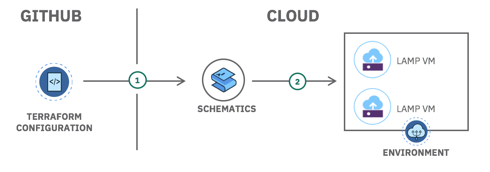
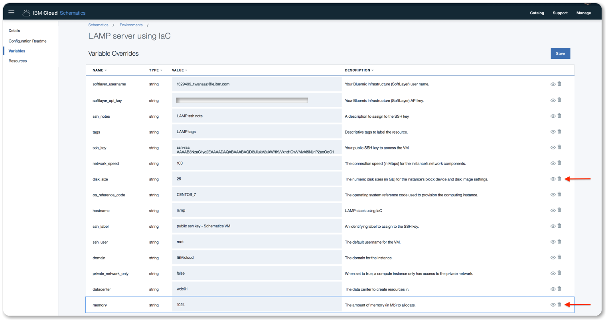

---
copyright:
  years: 2017
lastupdated: "2017-11-23"
---

{:shortdesc: .shortdesc}
{:new_window: target="_blank"}
{:codeblock: .codeblock}
{:screen: .screen}
{:tip: .tip}
{:pre: .pre}

# Automate deployment of environments using Infrastructure as Code

IBM Cloud Schematics is a tool that uses Terraform to provision and manage infrastructure resources, Cloud Foundry applications, services, Kubernetes clusters and much more using code in a configuration file(s).

In this tutorial, you will use a provided template in Schematics to provision a **L**inux virtual server, with **A**pache web server, **M**ySQL, and **P**HP server (LAMP stack). You will then configure the template to scale the resources and tune the environment (memory, CPU and disk size). Finish by deleting all of the resources created by the configuration.

## Objectives

- Explore LAMP template
- Create custom configuration from template
- Create environment from the configuration
- Scale resources
- Delete the environment



## Before you begin

{: #prereqs}

Contact your Infrastructure master user to get the following permissions:

- Network permission 
- API Key

Network permission is required to be able to add **Public and Private Network Uplink**  

## Apps and Services

{: #apps}

- [IBM Cloud Schematics](https://console.bluemix.net/schematics)
- [IBM Cloud Infrastructure](https://console.bluemix.net/dashboard/ibm-iaas-g1) 
- [Object Storage](https://console.bluemix.net/catalog/infrastructure/cloud-object-storage)


## Explore the LAMP template

{: #gettemplate}

In this section, you will learn the basics of a Terraform configuration by looking at sample configuration in a template. The LAMP template is used to provision a virtual machine instance and install Apache, MySQL (mariadb), and PHP onto that instance.

1. From https://console.bluemix.net, use the left side menu option and select **Schematics**.

2. Under the **Templates** section, find the **LAMP** template and click **View Details** to learn more. 

3. Click **Create Environment** to create an environment using this template. 

  **Note:** This template will deploy a full stack LAMP environment (Linux, eNGINX, MySQL, and PHP) on a single VM. 

  

4. Add the following values to the configuration:

  - Your GitHub repo where you pushed the modified template in the earlier steps. 
  - Add an **Environment Name**
  - Add your **Infrastructure (SoftLayer) username** - Get your Infrastructure username 
  - Add your **Infrastructure (SoftLayer) API key** - Get your infrastructure API key or create a new one
  - Add a **description to assign to the SSH key** - Add a description
  - Add **descriptive tags to label** - Add a tag
  - Add your **public SSH key to access the VM** - You can get and copy your the public key to your clipboard by using `pbcopy < ~/.ssh/id_rsa.pub` in your terminal window.

5. Click **Create** to create a LAMP VM from this template. 

6. Click **Plan** and then **Apply** deploy the VM.

   **Note:** Plan is used to preview the resources and Apply is used to create the VM using this template. 

   

7. Once the apply process is completed, you should then see the status changing to **Active**. This may take few minutes. To verify the server configuration, head over to the infrastructure section to see the server created as per the template code. 

## Create custom configuration from template

{: #modifytemplate}

In this section, you will modify the code in the template to create your own custom configuration. You will modify the code template to add [Object Storage](https://console.bluemix.net/catalog/infrastructure/cloud-object-storage) to store data files. 

1. Fork the LAMP template code used in above. The template code can be found here: https://github.com/Cloud-Schematics/LAMP

2. Inspect the current template code files

   - [install.yml](https://github.com/Cloud-Schematics/LAMP/blob/master/install.yml) - contains installing script, this is where you can add all scripts related to your server install. See phpinfo() injected. 
   - [provider.tf](https://github.com/Cloud-Schematics/LAMP/blob/master/provider.tf) - variables related to the provider where provider username and api key needed. 
   - [vm.tf](https://github.com/Cloud-Schematics/LAMP/blob/master/vm.tf) - server configuration file to deploy the VM with specified variables. 

3. Create a new file and name it **object-storage.tf** 

4. Add the code below inside the newly created file **object-storage.tf**.

   **Note** the label "lamp_storage", we will later look for that in the logs to make sure Object Storage service getting created.

   ```sh
   resource "ibm_object_storage_account" "lamp_storage" {
     count = "${var.object_storage_enabled}"
   }

   variable "object_storage_enabled" {
       default = 1
   }
   ```

5. **Save** the **object-storage.tf** file and push your changes to your forked repo. 

   **Note:** In the next section, you will need your GitHub repo URL with your modified template code. 

## Create an environment from the configuation

{: #createvm}

In this section, you will create a new environment with your custom configuration template. 

1. Go to https://console.bluemix.net, select the **Schematics** tab on the left side menu if you didn't already.

2. Click on the **Environments tab** and then click on the **Create Environment** button to create an Environment. 

3. Add the following values to the configuration:

   - Add your **GitHub repo** where you pushed the modified template in the earlier steps. 
   - Add an **Environment Name**
   - Add your **Infrastructure (SoftLayer) username** - Get your Infrastructure username 
   - Add your **Infrastructure (SoftLayer) API key** - Get your infrastructure API key or create a new one
   - Add a **description to assign to the SSH key** - Add a description
   - Add **descriptive tags to label** - Add a tag
   - Add your **public SSH key to access the VM** - You can get and copy your the public key to your clipboard by using `pbcopy < ~/.ssh/id_rsa.pub` in your terminal window.

4. Click **Create** to create this template. 

5. Click **Plan** and then **Apply**. 

   **Note:** Plan is used to preview the resources and Apply is used to create the VM using this template. 

   

6. Once the process is completed successfully, you should then see the status changing to **Active**. This may take few minutes. Next, let's verify the server created.

7. Click on the **View Log** button to view the logs. You should see Object Storage created.

## Verify VM and Object Storage

{: #verifyvm}

In this section, we are going to verify the VM and Object Storage created from the template code. 

**Verify VM**

1. Using the console menu option, click on the **Infrastructure** tab to view the list of virtual server devices.

2. Click **Devices** -> **Device List** to find the server created. You should see your server device listed.

3. Click on the server to view more information on the server configuration. Looking at the screenshot below, we can see that the server is successfully created with the configuration added to the template code. 

4. Next, let's test the server in the web browser. 

   Open the server public IP address in the web browser. You should see the server default installation page like below.


**Verify Object Storage**

1. From the **Infrastructure** section, click on the **Object Storage** button. You should see object storage service created.
2. Click on the **Object Storage** name to view the full list of regions Object Storage is available on. 
3. Object Storage is available from different regions, click on **Dallas 5** to get to the dashboard. 
4. Click on **View Credentials** to view your Object Storage credentials and API end points.  

More on [IBM Object Storage can be found here](https://ibm-public-cos.github.io/crs-docs/index.html).

## Scale resources using template code

{: #scaleresources}

In this section, we are going to look at how to scale the virtual server resources from GitHub. We are going to modify the template to do the following: 

- Increase number of CPU cores to 4 cores 
- Increase RAM to 4GB
- Increase disk size to 100GB 

Follow the steps below to make above changes. 

1. From the IBM Cloud dashboard, navigate to **Schematics** -> **Environments** -> **Variables**. 

2. Under the variables section, remove these variables (Memory, disk_size, cores) and click **Save**.

   **Note**: We must remove the variable overrides for Schematics to use the GitHub repo variables. 

    

3. Using your coding editor, modify the vm.tf file to have the following:

   ```sh
   variable "memory" {
     default = "4096"
   }

   variable "disk_size" {
     default = "100"
   }

   variable "cores" {
     default = "4"
   }
   ```

4. Save the changes made to the vm.tf and then **commit** your code to GitHub

5. Now, go back to Schematics dashboard, under the **Detail** section click **Plan** and **Apply**. 

6. You should see in the logs that your changes applied successfully. 

7. To take this one step forwarder, you can also set up automatic job to automatically process any changes made to the GitHub repo. This can be done using an external deployment tool like [Travis-CI](https://travis-ci.com/).


## Delete environments and resources 

{: #deleteresources}

1. You can delete resources and environments by using the options tab. 

## Where to go next?

For more templates, visit [IBM Cloud Schematics](https://github.com/Cloud-Schematics) GitHub page and [IBM Cloud Provider](https://ibm-bluemix.github.io/tf-ibm-docs) to learn more on templates.


## Related information

[IBM Object Storage](https://ibm-public-cos.github.io/crs-docs/index.html)

[IBM Cloud Provider](https://ibm-bluemix.github.io/tf-ibm-docs)

[IBM Cloud Schematics](https://github.com/Cloud-Schematics)

[Accelerate delivery of static files using a CDN - Object Storage](static-files-cdn.html)