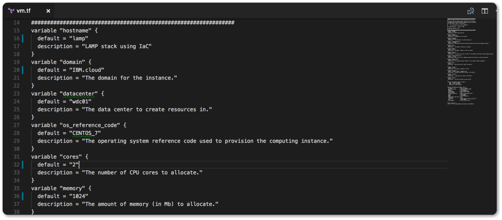

---
copyright:
  years: 2017
lastupdated: "2017-11-17"
---

{:shortdesc: .shortdesc}
{:new_window: target="_blank"}
{:codeblock: .codeblock}
{:screen: .screen}
{:tip: .tip}
{:pre: .pre}

# Automate deployment of environments using Infrastructure as Code

IBM Cloud Schematics is a solution for deploying cloud infrastructure, Kubernetes cluster and much more. 

In this tutorial, we will use Schematics - Infrastructure as Code technologies to provision the **L**inux virtual server, with **A**pache web server, **M**ySQL, and **P**HP (the LAMP stack) server. We will explore the Infrastructure as Code technologies by modifying the template code, scale the resources and tune the (memory, CPU and disk size). We will do all this with the template code and finish by deleting the resources. 

## Objectives

- Get a LAMP template code
- Modify the template code
- Create VM from the template code
- Verify the VM
- Scale resources using template code
- Delete environments and resources 
- Where to go next

## Before you begin

{: #prereqs}

1. Contact your Infrastructure master user to get the following permissions:

   - Network permission 
   - API Key

   Network permission is required to be able to add **Public and Private Network Uplink**  


## Apps and Services

{: #apps}

- Schematics
- Infrastructure 


## Get a LAMP template code

{: #gettemplate}

In this section, you will learn how to apply Infrastructure as Code concept for creating and managing virtual servers. We will use IBM Cloud Schematics template to provision a virtual machine instance and provision Apache, MySQL (mariadb), and PHP onto that instance. With this template, you can provision and manage infrastructure as a single unit.

1. Login to IBM Cloud https://console.bluemix.net and select the **Schematics** tab using the left side menu option.

2. Click on the **Template** option to view the list of templates available. 

3. We will be viewing the LAMP template, click on the **View Details** to learn more about this template. Note the **Source Control URL**, we will need this next to clone that repo and modify it. 

  

4. Clone the LAMP template **Source Control URL**

  ```sh
     git clone https://github.com/Cloud-Schematics/LAMP
  ```

5. Inspect the cloned source code

   - install.yml - contains installing script, this is where you can add all scripts related to your server install. Note in that file phpinfo() been injected. 
   - provider.tf - variables related to the provider where provider username and api key needed. 
   - vm.tf - server configuration file to deploy the VM with specified variables. Next, we will modify this file. 

## Modify the template code

{: #modifytemplate}

1. Open the vm.tf in your code editor 

2. Change of the defaults variable below:

   - Change the hostname default to **lamp**

   - Change the domain default to **IBM.cloud**

   - Change the number cores to **2**

     

3. **Save** the file and create a new GitHub repository under your account. 

4. Push the modified template code to your GitHub account. 

   **Note:** In the next section, you will need your repo URL with your modified template code. 

## Create VM from the template code

{: #createvm}

1. From the [IBM Cloud console](https://console.bluemix.net), select the **Schematics** tab on the left side menu if you didn't already.

2. Click on the **Environments tab** and then click on the **Create Environment** button to create an Environment. 

3. Add the following values to the configuration:

   - Your GitHub repo where you pushed the modified template in the earlier steps. 
   - Add an **Environment Name**
   - Add your **Infrastructure (SoftLayer) username** - Get your Infrastructure username 
   - Add your **Infrastructure (SoftLayer) API key** - Get your infrastructure API key or create a new one
   - Add a **description to assign to the SSH key** - Add a description
   - Add **descriptive tags to label** - Add a tag
   - Add your **public SSH key to access the VM** - You can get and copy your the public key to your clipboard by using `pbcopy < ~/.ssh/id_rsa.pub` in your terminal window.

4. Click **Create** to create this template. 

5. Click **Plan** and then **Apply**. 

   **Note:** Plan is used to preview the resources and Apply is used to create the VM using this template. 

   

6. Once the process is completed successfully, you should then see the status changing to **Active**. This may take few minutes. Next, let's verify the server created.

## Verify The VM

{: #verifyvm}

1. Using the console menu option, click on the **Infrastructure** tab to view the list of virtual server devices.

2. Click **Devices** -> **Device List** to find the server created. You should see your server device listed.

3. Click on the server to view more information on the server configuration. Looking at the screenshot below, we can see that the server is successfully created with the configuration added to the template code. 

4. Next, let's test the server in the web browser. 

   Open the server public IP address in the web browser. You should see the server default installation page like below.

5. Test the version of PHP installed by using: http://<server-public-ip-address>/info.php

   ​

   Now that we verified the server installing and configurations, next we need to scale the server resources using the template code.


## Scale resources using template code

{: #scaleresources}

Virtual server resources can be scaled and managed fully from the template code. We want to do the the following: 

- Increase number of CPU cores to 4 cores 
- Increase RAM to 4GB
- Increase disk size to 100GB 

Follow the steps below to make above changes. 

1. From the IBM Cloud dashboard, navigate to **Schematics** -> **Environments** -> **Variables**. 

2. Under the variables section, remove these variables (Memory, disk_size, cores) and click **Save**.

   **Note**: We must remove the variable overrides for Schematics to use the GitHub repo variables. 

    

3. Using your coding editor, modify the vm.tf file to have the following:

   ```sh
   variable "memory" {
     default = "4096"
   }

   variable "disk_size" {
     default = "100"
   }

   variable "cores" {
     default = "4"
   }
   ```

4. Save the changes made to the vm.tf and then **commit** your code to GitHub

5. Now, go back to Schematics dashboard, under the **Detail** section click **Plan** and **Apply**. 

6. You should see in the logs that your changes applied successfully. 

7. To take this one step forwarder, you can also set up automatic job to automatically process any changes made to the GitHub repo. This can be done using an external deployment tool like [Travis-CI](https://travis-ci.com/).


## Delete environments and resources 

{: #deleteresources}

1. You can delete resources and environments by using the options tab. 

## Where to go next?

For more templates, visit [IBM Cloud Schematics](https://github.com/Cloud-Schematics) GitHub page and [IBM Cloud Provider](https://ibm-bluemix.github.io/tf-ibm-docs) to learn more on templates.


## Summary

In this tutorial, you used Infrastructure as Code technologies to provision a LAMP stack server, modified the template code to modify the resources, tuned (memory, CPU and disk) and finish by deleting the resources.

You learned how to:

- Get a LAMP template code
- Modify the template code
- Create VM from the template code
- Verify the VM
- Scale resources using template code
- Delete environments and resources 
- Where to go next

