---
copyright:
  years: 2017, 2018
lastupdated: "2018-01-18"
---

{:shortdesc: .shortdesc}
{:new_window: target="_blank"}
{:codeblock: .codeblock}
{:screen: .screen}
{:tip: .tip}
{:pre: .pre}

# Automate deployment of environments using Schematics

IBM Cloud Schematics is a tool that uses [Terraform](https://ibm-cloud.github.io/tf-ibm-docs/) to provision and manage infrastructure resources, Cloud Foundry applications, services, Kubernetes clusters and much more using code in a configuration file(s).

In this tutorial, you will use a provided template in Schematics to provision a **L**inux virtual server, with **A**pache web server, **M**ySQL, and **P**HP server (LAMP stack). You will then configure the template to add an Object Storage service and scale the resources to tune the environment (memory, CPU and disk size). Finish by deleting all of the resources created by the configuration.

## Objectives

- Create environment using the LAMP template
- Create custom configuration from template
- Create environment from the configuration
- Scale resources
- Delete the environment

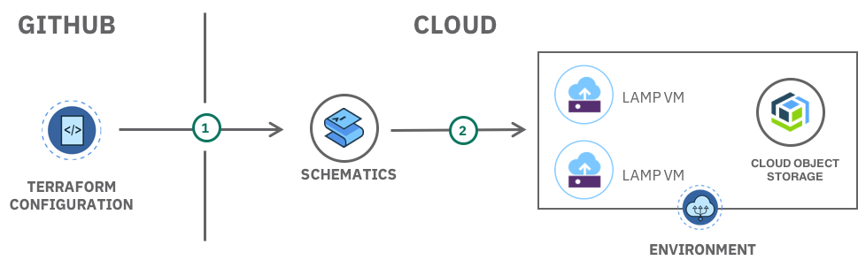

1. Create or use an existing Terraform configuration to describe the environment and store it in GitHub.
2. IBM Cloud Schematics reads configuration and creates the environment with LAMP stack and Cloud Object Storage service.

## Products
{: #products}

- [IBM Cloud Schematics](https://console.bluemix.net/schematics)
- [IBM Cloud Infrastructure](https://console.bluemix.net/dashboard/ibm-iaas-g1)
- [Object Storage](https://console.bluemix.net/catalog/infrastructure/cloud-object-storage)

## Before you begin
{: #prereqs}

Contact your Infrastructure master user to get the following permissions:
- Network (to add **Public and Private Network Uplink**)
- API Key

## Create environment using the LAMP template
{: #lamptemplate}

In this section, you will learn the basics of a Terraform configuration by using a sample template configuration provided by Schematics. The LAMP template is used to provision a virtual machine instance and install Apache, MySQL (mariadb), and PHP onto that instance.

1. From https://console.bluemix.net, use the left side menu option and select **Schematics**.
2. Under the **Templates** section, find the **LAMP** template and click **View Details** to learn more.
3. Click **Create Environment** to create an environment using this template.
  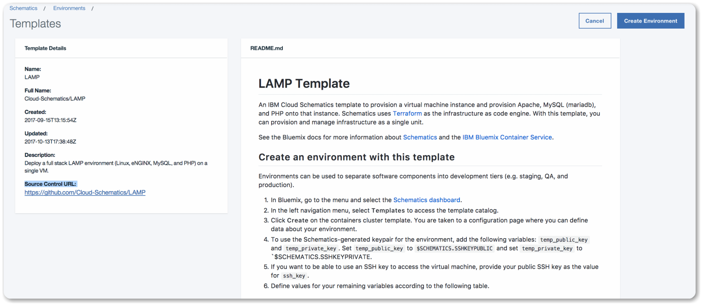
4. Fill in the required values in the Variables section:
  - Add your **Infrastructure (SoftLayer) username** to **softlayer_username**
  - Add your **Infrastructure (SoftLayer) API key** to **softlayer_api_key**. [Retrieve your API key](https://knowledgelayer.softlayer.com/procedure/retrieve-your-api-key)
  - For **ssh_notes** variable, Add a **description to assign to the SSH key**.
  - For **tags** variable,Add **descriptive tags to label**.
  - Add your **public SSH key to access the VM** - To copy the public key to your clipboard, you can run the pbcopy < ~/.ssh/id_rsa.pub command in your terminal.
5. Click **Create** to create the LAMP environment described in this template.
6. Click **Plan** and then **Apply** deploy the environment.
   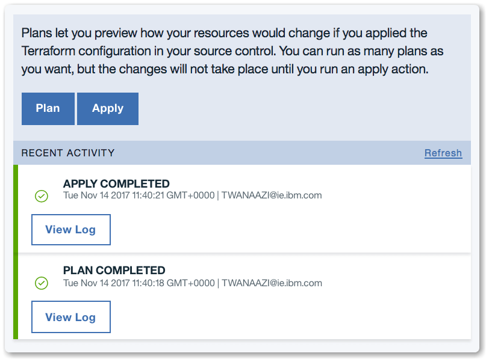
7. Once the apply process is completed, you should then see the status changing to **Active**. This may take few minutes. To verify the server configuration, head over to the infrastructure section to see the server created as per the template code. 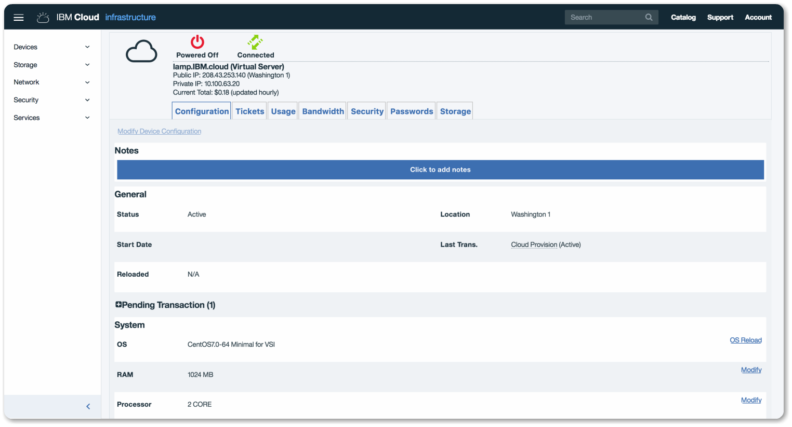

## Create custom configuration from template

{: #modifytemplate}

In this section, you will modify the code in the LAMP template to create your own custom configuration. You will modify the code to add an [Object Storage](https://console.bluemix.net/catalog/infrastructure/cloud-object-storage) service to the configuration and create a new environment.

1. Fork the LAMP template code used above: https://github.com/Cloud-Schematics/LAMP
2. Clone your fork locally:
  `git clone https://github.com/YOUR_USER_NAME/LAMP`
3. Inspect the configuration files
   - [install.yml](https://github.com/Cloud-Schematics/LAMP/blob/master/install.yml) - contains installing script, this is where you can add all scripts related to your server install. See phpinfo() injected.
   - [provider.tf](https://github.com/Cloud-Schematics/LAMP/blob/master/provider.tf) - variables related to the provider where provider username and api key needed.
   - [vm.tf](https://github.com/Cloud-Schematics/LAMP/blob/master/vm.tf) - server configuration file to deploy the VM with specified variables.
4. Create a new file called **object-storage.tf** and add the code below:
   ```
   resource "ibm_object_storage_account" "lamp_storage" {
     count = "${var.object_storage_enabled}"
   }

   variable "object_storage_enabled" {
       default = 1
   }
   ```
   **Note** the label "lamp_storage", we will later look for that in the logs to make sure Object Storage service getting created.
5. **Save** the **object-storage.tf** file and push your changes to your forked repo.
   ```
   git add object-storage.tf
   git commit -m "Added object storage"
   git push origin master
   ```

## Create an environment from the configuration
{: #create_custom_environment}

In this section, you will create a new environment with your custom configuration.

1. Go to https://console.bluemix.net, select the **Schematics** tab on the left side menu.
2. Click on the **Environments tab** and then click on the **Create Environment** button to create an Environment.
3. Enter your forked **GitHub repo URL** to **Source Control URL**
4. Enter "My custom LAMP environment" in **Environment Name**
5. Fill in the required values in the Variables section:
   - Add your **Infrastructure (SoftLayer) username** to **softlayer_username**
   - Add your **Infrastructure (SoftLayer) API key** to **softlayer_api_key**. [Retrieve your API key](https://knowledgelayer.softlayer.com/procedure/retrieve-your-api-key)
   - Add a **description to assign to the SSH key** to **ssh_notes**.
   - Add **descriptive tags to label** to **tags**.
   - Add your **public SSH key to access the VM** - To copy the public key to your clipboard, you can run the pbcopy < ~/.ssh/id_rsa.pub command in your terminal.
     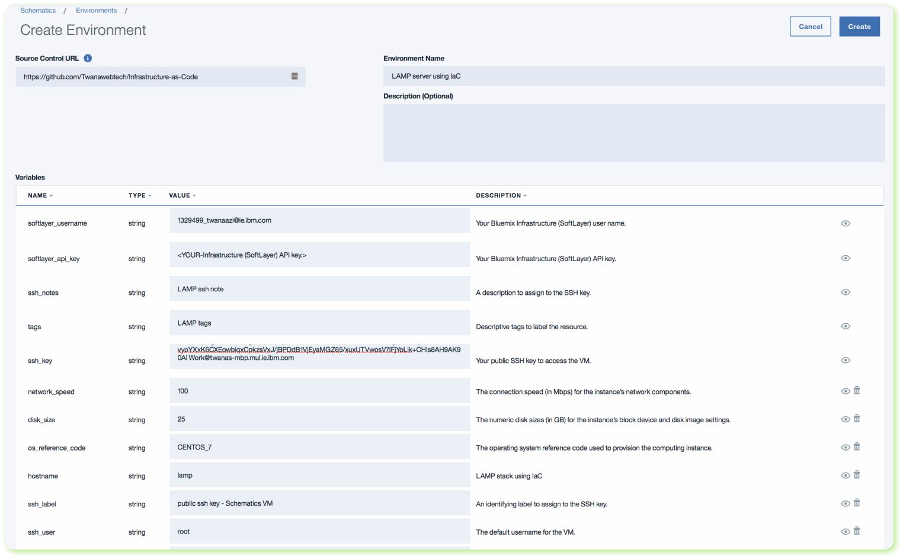
6. Click **Create**, **Plan** and then **Apply** to create your new environment.
7. Once the process is completed successfully, you should then see the status changing to **Active**. This may take few minutes.
8. Click on the **View Log** button to view the logs. You should see Object Storage created.
  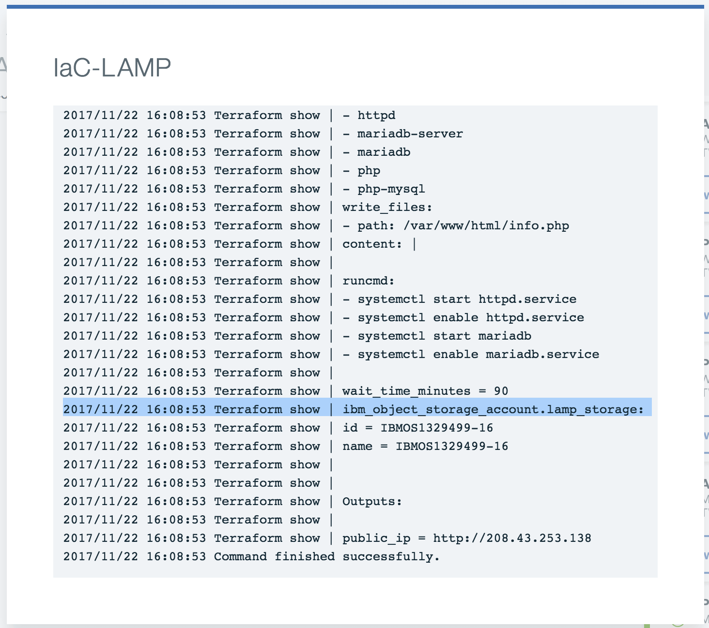

## Verify VM and Object Storage
{: #verifyvm}

In this section, we are going to verify the VM and Object Storage created successfully.

**Verify VM**

1. Using the left side menu, click on **Infrastructure** to view the list of virtual server devices.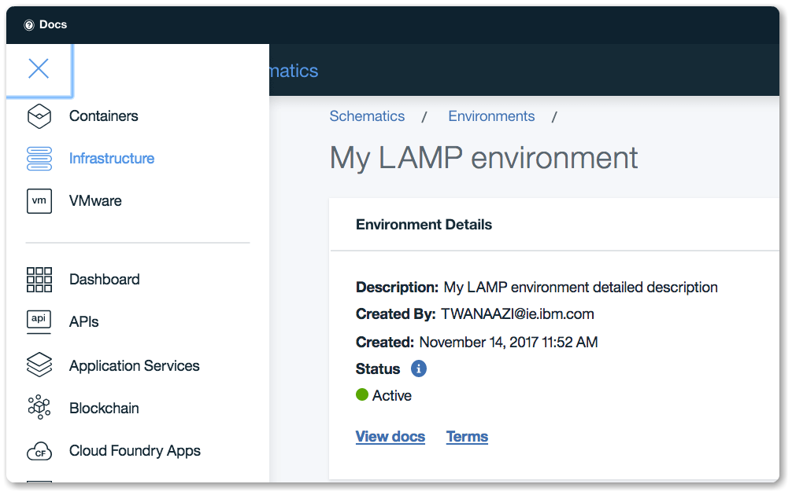
2. Click **Devices** -> **Device List** to find the server created. You should see your server device listed.
3. Click on the server to view more information on the server configuration. Looking at the screenshot below, we can see that the server is successfully created. 
4. Next, let's test the server in the web browser. Open the server public IP address in the web browser. You should see the server default installation page like below.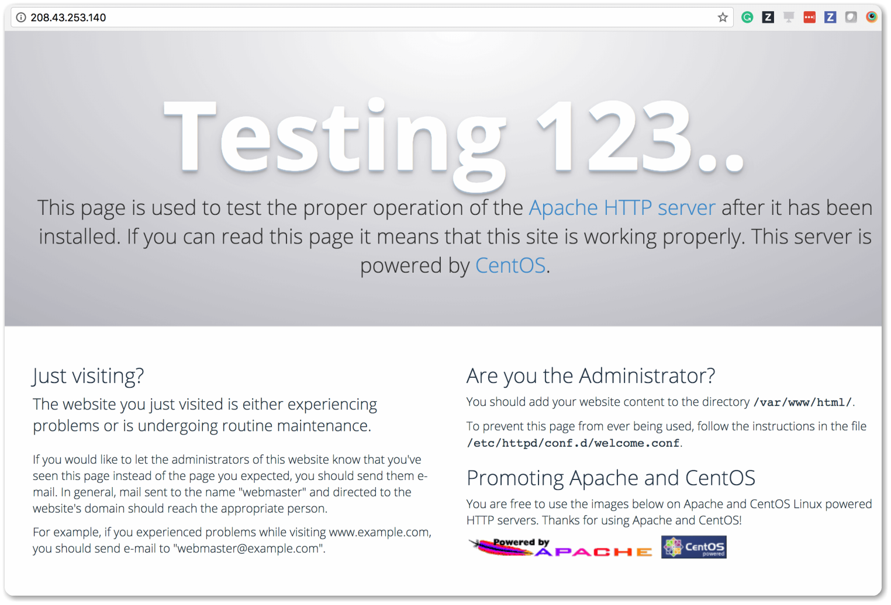


**Verify Object Storage**

1. From the **Infrastructure** section, click on the **Object Storage** button. You should see object storage service created.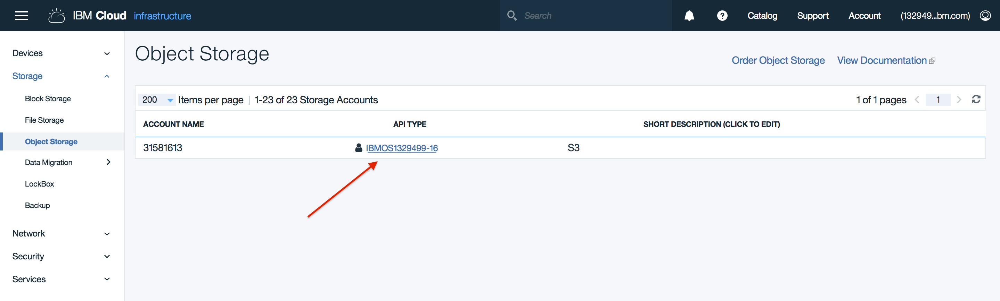
2. Click on the **Object Storage** name to view the full list of regions Object Storage is available on.
3. Object Storage is available from different regions, click on **Dallas 5** to get to the dashboard. 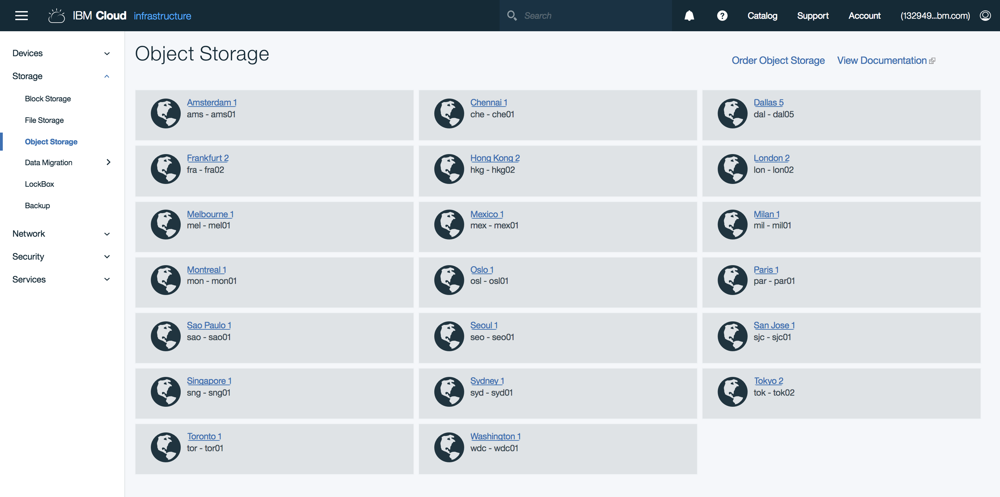
4. Click on **View Credentials** to view your Object Storage credentials and API end points.  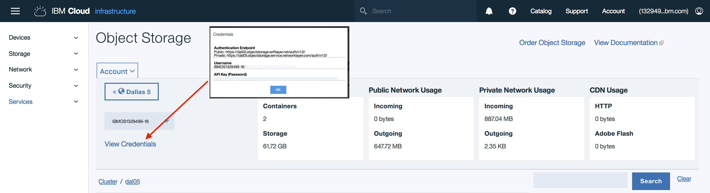

More info on [IBM Object Storage can be found here](https://ibm-public-cos.github.io/crs-docs/index.html).

## Scale resources using configuration
{: #scaleresources}

In this section, we are going to look at how to scale the virtual server resource. Our configuration contains variables with default values that are editable in Schematics. We are going to override the default value of the variables to accomplish the following:
  - Increase number of CPU cores to 4 cores
  - Increase RAM to 4GB
  - Increase disk size to 100GB

1. From the IBM Cloud dashboard, navigate to **Schematics** -> **Environments** -> **My custom LAMP environment** -> **Variables**.
2. Under the variables section, update the variables **memory** to 4096, **disk_size** to 100, and **cores** to 4 and click **Save**.
3. Under the **Detail** section click **Plan** and **Apply**.
4. You should see in the logs that your changes applied successfully. 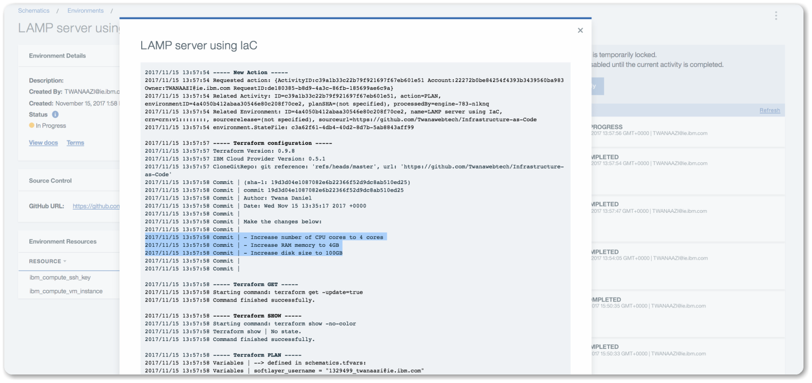


## Delete environments and resources
{: #deleteresources}

You can delete environments by using the options menu. Delete both **My LAMP environment** and **My custom LAMP environment** when you are done.

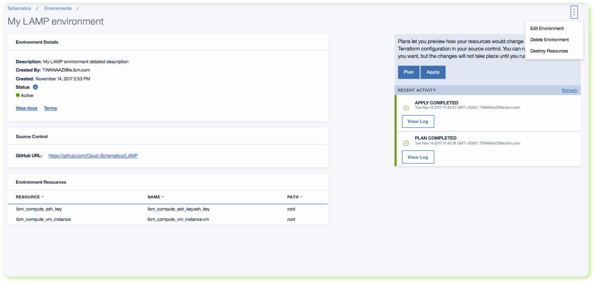


## Related information

[IBM Object Storage](https://ibm-public-cos.github.io/crs-docs/index.html)

[IBM Cloud Provider](https://ibm-cloud.github.io/tf-ibm-docs/)

[IBM Cloud Schematics](https://github.com/Cloud-Schematics)

[Accelerate delivery of static files using a CDN - Object Storage](static-files-cdn.html)
