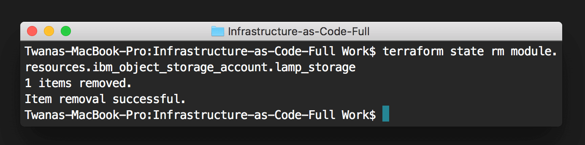

---
copyright:
  years: 2017, 2018
lastupdated: "2018-01-23"
---

{:shortdesc: .shortdesc}
{:new_window: target="_blank"}
{:codeblock: .codeblock}
{:screen: .screen}
{:tip: .tip}
{:pre: .pre}

# Automate deployment of environments using Infrastructure as Code

[Terraform](https://www.terraform.io/) enables you to safely and predictably create, change, and improve infrastructure. It is an open source tool that codifies APIs into declarative configuration files that can be shared amongst team members, treated as code, edited, reviewed, and versioned.

In this tutorial, you will use an IBM provided [terraform template](https://ibm-cloud.github.io/tf-ibm-docs/) to provision a **L**inux virtual server, with **A**pache web server, **M**ySQL, and **P**HP server (LAMP stack). You will then configure the template to add an Object Storage service and scale the resources to tune the environment (memory, CPU, and disk size). Finish by deleting all of the resources created by the configuration.

## Objectives

- Terraform setup with IBM Cloud Provider
- Prepare terraform configuration
- Create a LAMP stack server from the terraform configuration
- Customise template to add new service and scale resources
- Verify VM and Object Storage
- Delete the environment


1. Create or use an existing terraform template.
2. Create LAMP stack server and Cloud Object Storage service from the Terraform template.

## Products
{: #products}

- [Terraform](https://console.bluemix.net/schematics)
- [IBM Cloud Infrastructure](https://console.bluemix.net/dashboard/ibm-iaas-g1)
- [Object Storage](https://console.bluemix.net/catalog/infrastructure/cloud-object-storage)

## Before you begin
{: #prereqs}

Contact your Infrastructure master user to get the following permissions:
- Network (to add **Public and Private Network Uplink**)
- API Key

## Prerequisites

{: #prereq}

- [Install Homebrew](https://brew.sh/)
- [Install terraform via installer](https://www.terraform.io/intro/getting-started/install.html) or use **Homebrew** by running the command: `brew install terraform`

## Terraform setup with IBM Cloud Provider

{: #setup}

In this section, you will setup the required items and makes sure everything installed correctly. 

1. Check terraform installation by running `terraform` in your terminal window.  You should see a list of terraform `Common commands`.

  ```bash
  $ terraform
  ```

2. Download [IBM Cloud Provider](https://github.com/IBM-Cloud/terraform-provider-ibm/releases) to your root directory. Keep a note of the URL where are downloading this provider, you would need the full path of the IBM Cloud Provider file later.

   {: #steps2}

   -  [**Mac download**](https://github.com/IBM-Cloud/terraform-provider-ibm/releases/download/v0.7.0/darwin_amd64.zip)
   -  [**Windows download**](https://github.com/IBM-Cloud/terraform-provider-ibm/releases/download/v0.7.0/windows_amd64.zip)
   -  [**Linux download**](https://github.com/IBM-Cloud/terraform-provider-ibm/releases/download/v0.7.0/linux_amd64.zip)

3. Navigate to your root directory, then create and edit a `.terraformrc` file using: 

  - Navigate to root directory
  - Create a file
  - Verify the `.terrafromrc`
  - Edit the `.terrafromrc` file 

  ```bash
  $ cd 
  $ touch .terraformrc 
  $ ls -la
  $ nano .terraformrc
  ```

4. Add below to the .terraformrc` file and replace the `<IBM-Cloud-Provider-full-path>` with the full path where you downloaded provider from [steps 2](#steps2). TODO - check this button
  ```bash
  providers 
  {
  	ibm = "/<IBM-Cloud-Provider-full-path>/terraform-provider-ibm"
  }
  ```
  Then save and exit from nano by using `Ctrl+X`.


## Prepare terraform configuration 

{: #terraformconfig}

In this section, you will learn the basics of a terraform configuration by using a sample template configuration provided by IBM Cloud. 

1. Fork the terraform template code used above: 

2. Clone your fork locally:
   `git clone https://github.com/YOUR_USER_NAME/infrastructure-as-code-terraform`

3. Inspect the configuration files
   - [install.yml](https://github.com/IBM-Cloud/infrastructure-as-code-terraform/blob/master/install.yml) - contains server instillation configurations, here is where you can add all scripts related to your server install to what to install on the server. See `phpinfo();` injected into this file.
   - [provider.tf](https://github.com/IBM-Cloud/infrastructure-as-code-terraform/blob/master/provider.tf) - contains the variables related to the provider where provider username and api key needed.
   - [vm.tf](https://github.com/IBM-Cloud/infrastructure-as-code-terraform/blob/master/vm.tf) - contains the server configurations to deploy the VM with specified variables.
   - [terraform.tfvars](https://github.com/IBM-Cloud/infrastructure-as-code-terraform/blob/master/terraform.tfvars) - contains **Softlayer** username and api key, these credentials can be added to this file for best practices to avoid reentering the credentials from the command line every time when deploying the server. Note: DO NOT publish this file with your credentials.

4. Now that we understand what's in each file, open the [vm.tf](https://github.com/IBM-Cloud/infrastructure-as-code-terraform/blob/master/vm.tf) file with your IDE and modify the file by adding your **public SSH key to access the VM**. To copy the public key to your clipboard, you can run the pbcopy < ~/.ssh/id_rsa.pub command in your terminal.

     ```bash
     $ pbcopy < ~/.ssh/id_rsa.pub
     ```

     This command will copy the SSH to your clipboard, you can then past that into [vm.tf](https://github.com/IBM-Cloud/infrastructure-as-code-terraform/blob/master/vm.tf) under the `ssh_key` default variable on line 69.

5. Open the [terraform.tfvars](https://github.com/IBM-Cloud/infrastructure-as-code-terraform/blob/master/terraform.tfvars) file with your IDE, modify the file by adding your `softlayer_username` and `softlayer_api_key`. You can retrieve API key and Softlayer username [here](https://knowledgelayer.softlayer.com/procedure/retrieve-your-api-key).


## Create a LAMP stack server from the terraform configuration 
{: #Createserver} 
In this section, you will learn the how to create a LAMP stack server from the terraform template. The template is used to provision a virtual machine instance and install **A**pache, **M**ySQL (**M**ariaDB), and **P**HP onto that instance.

1. Run the command below to navigate to the template folder. 
   ```bash
   $ cd infrastructure-as-code-terraform
   ```

2. Initialize the terraform configuration by running:
   ````bash
   $ terraform init
   ````

3. Apply the terraform changes by running:
   ```
   terraform apply
   ```

   You should see an output similar to below, though we've truncated some of the output to save space: 

4. Next, head over to your [infrastructure device list](https://control.bluemix.net/devices) to verify that the server created.


## Customise template to add new service and scale resources

{: #modifytemplate}

In this section, we are going to look at how to scale the virtual server resource and add an [Object Storage](https://console.bluemix.net/catalog/infrastructure/cloud-object-storage) service to your infrastructure environment. 

1. Edit the vm.tf file to increase the following and the save the file.
- Increase number of CPU cores to 4 cores
- Increase RAM to 4096 
- Increase disk size to 100GB

2. Next, we need add a new service, to do that create a new file and name it **object-storage.tf**. Add the code below to the newly created file:
   ```bash
   resource "ibm_object_storage_account" "lamp_storage" {
     count = "${var.object_storage_enabled}"
   }

   variable "object_storage_enabled" {
       default = 1
   }
   ```
   **Note** the label "lamp_storage", we will later look for that in the logs to make sure Object Storage service getting created.

3.  Initialize the terraform configuration again by running:

   ```bash
   $ terraform init
   ```
4. Apply the terraform changes by running:
   ```
   terraform apply
   ```
   Note: after running the terraform apply command successfully, you should see a new a `terraform.tfstate`. file added to your directory. This file contains the full deployment confirmation to keep track of what you last applied and any future modifications to your template. If this file is removed or lost then you will lose your terraform deployment configurations. 

## Verify VM and Object Storage
{: #verifyvm}

In this section, you are going to verify the VM and Object Storage to make sure it has been created successfully.

**Verify VM**

1. Using the left side menu, click on **Infrastructure** to view the list of virtual server devices.
2. Click **Devices** -> **Device List** to find the server created. You should see your server device listed.
3. Click on the server to view more information on the server configuration. Looking at the screenshot below, we can see that the server is successfully created. 
4. Next, let's test the server in the web browser. Open the server public IP address in the web browser. You should see the server default installation page like below.


**Verify Object Storage**

1. From the **Infrastructure** section, click on the **Object Storage** button. You should see object storage service created.
2. Click on the **Object Storage** name to view the full list of regions Object Storage is available on.
3. Object Storage is available from different regions, click on **Dallas 5** to get to the dashboard. 
4. Click on **View Credentials** to view your Object Storage credentials and API end points.  

More info on [IBM Object Storage can be found here](https://ibm-public-cos.github.io/crs-docs/index.html).

## Delete resources
{: #deleteresources}

The `terraform state rm` command is used to remove items from the [Terraform state](https://www.terraform.io/docs/state/index.html). This command can remove single resources, single instances of a resource, entire modules, and more. We are going to explore deleting the object storage and VM separately to understand how it can work. 

1. Delete the object storage service using the following:
   ```bash
   $ terraform state rm module.resources.ibm_object_storage_account.lamp_storage
   ```

2. Delete the VM using the following:
   ```bash
   $ terraform state rm module.resources.ibm_compute_ssh_key.ssh_key
   ```
   

   ​

   **Note:** To delete resources, you would need Softlayer admin permissions. If you don't have an admin superuser account, then please request to cancel the resources using the infrastructure dashboard. You can request to cancel a device from the infrastructure dashboard under the devices. 


## Related information

- [Terraform](https://www.terraform.io/)
- [IBM Object Storage](https://ibm-public-cos.github.io/crs-docs/index.html)
- [IBM Cloud Provider](https://ibm-cloud.github.io/tf-ibm-docs/)
- [IBM Cloud Schematics](https://github.com/Cloud-Schematics)
- [Accelerate delivery of static files using a CDN - Object Storage](static-files-cdn.html)

