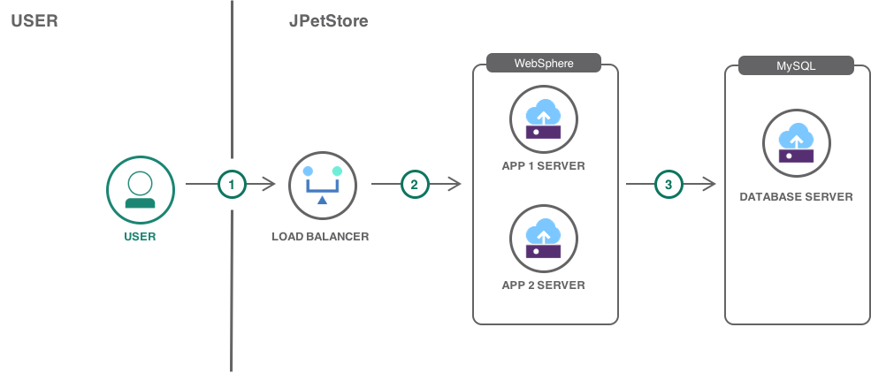

---
copyright:
  years: 2017, 2018
lastupdated: "2018-05-03"
---

{:shortdesc: .shortdesc}
{:new_window: target="_blank"}
{:codeblock: .codeblock}
{:screen: .screen}
{:tip: .tip}
{:pre: .pre}

# Understand how to move a VM based application to Kubernetes

This tutorial walks you through the process of moving a VM based application to a Kubernetes cluster on the IBM Cloud Container Service. You will learn how to take an existing Java application (JPetStore), containerize it, move it to Kubernetes, and then extend it using other IBM Cloud services. Though migrating existing applications to the containers and Kubernetes can be different from an application to application, this tutorial aims to outline the path with an example.

**TODO**: Why move to Kubernetes? Faster, cheaper, self-healing, scaling, compact...

There are two options for moving applications to Kubernetes:
- Identify single component of a large monolith application which can be separated into its own micro-service. Containerize and deploy micro-service to Kubernetes. Repeat.
- Containerize the entire application and deploy it on a Kubernetes cluster.

In this tutorial, you will exercise the latter option using a popular Java e-commerce application **JPetStore**. After moving it to Kubernetes, you will extend it using IBM Cloud services. 

## Objectives:

{: #objectives}

- Understand how to map components between VM and Kubernetes.
- Containerize application
- Deploy the containerized application to IBM Cloud Container Service.
- Extend the application with IBM Cloud services.

## Services used

{: #products}

This tutorial uses the following products:

- [{{site.data.keyword.containershort_notm}}](https://console.bluemix.net/containers-kubernetes/catalog/cluster)

This tutorial may incur costs. Use the [Pricing Calculator](https://console.bluemix.net/pricing/) to generate a cost estimate based on your projected usage.

## Architecture

{:#architecture}

The following diagram outlines the system's high-level architecture. For this example, an existing [https://github.com/mybatis/jpetstore-6) has been selected. The Java PetStore application runs on Java applciation server with a MySQL database. Let's look at how the existing application was deployed, and it's components.

1. The user connects to the application.
2. The Load Balancer selects one of the healthy servers to handle the request.
3. The server also pulls information from the database and finally renders the page to the user.

**Components:**

- Two Java app VM's to host the application, application files stored within the VM.
- Load balancer service to load balance traffic between application servers.
- MySQL database installed on a Virtual Server.

With a Kubernetes architecture, this may end up looking more like this:

1. The user connects to the application.
2. Ingress controller load balance traffic between available workers nodes.
3. Pods within a worker node share a storage volume outside the scope of the pod managed by a storage service on IBM Cloud.
4. Compose for MySQL managed database as a service.

**Components:**

- Two worker nodes to host the application. A cluster can have one or more worker nodes. A worker node is a virtual server, physical server or bare metal. Following this tutorial, you will set up a cluster with two worker nodes.
- Persistent volume subsystem to share files between worker nodes. This comes built in with Kubernetes on IBM Cloud when using a paid cluster on IBM Cloud. A storage service gets created on the fly when storage is requested. You will later cover the concepts of PersistentVolumes and PersistentVolumeClaim in the storage section.
- Kubernetes ingress controller manages the load balancing between worker nodes. This comes built in with Kubernetes and no additional service needed for this.
- Compose For MySQL service to store the database. With Kubernetes you have the option to run the database on inside a cluster, but there is a more favorable option. This is by using the Database as a service option. For this tutorial example a database as service option been selected for two of reasons. One backup and two scaling. Many Databases as services options on IBM Cloud come with built-in backup snapshots and auto-scaling, so we don't need to worry about backups data and to scale the database. You can find many databases as service options on IBM Cloud [catalog](https://console.bluemix.net/catalog/?category=data).

## Entering the world of containers and Kubernetes

As you enter the world of containers and Kubernetes, you will discover new resources and terminologies.

ToDo: Add somewhere content here **containers VS VM's** 

A Kubernetes cluster manages a collection of worker nodes, and a worker nodes is just a collection of VM's or physical machines. Inside that worker nodes you would then have a pod that has the Docker container image of your application. You as a developer will focus on your application and not so much worker nodes. Kubernetes Deployments handles the creation of the pods and inserting the docker images inside the pod for you, but not only that, Kubernetes Deployments do more than just that for you.

- The Deployment instructs Kubernetes how to create and update instances of your application pods. This provides a self-healing mechanism to address machine failure or maintenance. In the VM based application world, installation scripts would often be used to start the applications, but sometimes recovery from machine failures not even counted and handled. Now, Kubernetes in the other hand offers a much better solution to this because of the way Kubernetes works. This is by having a Deployment to create your application instances and keeping them running across Nodes, it makes sure that your pods are running at all times and if one pod failed then it will create another one. Kubernetes does that with the ReplicationController.
- A *ReplicationController* ensures that a specified number of pod replicas are running at any one time. In other words, a ReplicationController makes sure that a pod or a homogeneous set of pods is always up and available. so this means If there are too many pods, the ReplicationController terminates the extra pods. If there are too few, the ReplicationController starts more pods.

## How to plan the move

{: #plan_the_move}

In this section, we will cover the fundamentals of moving VM based applications to Kubernetes. You will learn how to create a development/production cluster with the appropriate amount of resources need. You will learn what code to modifications needed to deploy it on a Kubernetes cluster.

###Configure Resources

To run a production application in the Cloud using Kubernetes, there are few items in which you need to think about and these are:

1. How many clusters you need, you may want to have three clusters, one for development, one testing and one for production.
2. Should these clusters be in a shared virtual server, dedicated server or bare metal.
3. How much CPU and RAM needed for each cluster worker node, think of a worker node like a VM. On IBM Cloud you can configure these very easily, you can start from a 4GB RAM all the way to 242GB RAM.
4. How many worker nodes you need. If running a production app and to gain good resiliency, you should consider a minimum of two worker nodes.

Above are some of the questions, you need to think about before configuring your clusters. Assuming you want to run the PetStore application in the Cloud for a production use, and expect a high load of traffic. Let's explore what resources you would need:

1. Setup three clusters, one for development, one testing and one for production.
2. Development and testing cluster can start with minimum RAM and CPU option like 2 CPUs and 4GB of RAM should be ok. And one worker node for each.
3. For the production server, you may want more resources for resiliency. For the production server, you can select any of the three hardware options shared, dedicated or bare metal. CPU and RAM you should have at least 4 CPUs and 16GB of RAM, and 4 workers nodes. 

### Containerize the application

**Create docker container images**

ToDo: What is a docker container file consist off, how to create one based on an existing application, how ingress works and how to configure it.

Point to the docker file. 

### Modify your code

1) Cover 12 factor methodologies

2) Save Credentials outside the app - https://12factor.net/config
The Twelve-Factor App
A methodology for building modern, scalable, maintainable software-as-a-service apps.

3) https://12factor.net/backing-services
12factor.net
The Twelve-Factor App
A methodology for building modern, scalable, maintainable software-as-a-service apps.

4) Don't write to disk - use volume or database, or object storage

managing storage, PersistentVolumes, PersistentVolumeClaim. How all that works. (How to copy existing files over).

### Create Kubernetes deployment files

Point to the deployment file. 

### Push your deployment  

ToDo… 

Now that you understand the fundamentals of moving application to Kubernetes, next you will explore creating a cluster and run the PetStore application in a Kubernetes cluster.

## Run the application  

{: #run_application}

ToDo...

Here it will send user to the [PetStore repo](https://github.ibm.com/ibmcloud/ModernizeDemo) to run the application or add the steps here…

## Extend the application

{: #extend_application}

ToDo...

## Expand the tutorial

{: #expand_tutorial}

Wait for now… 

ToDo...
- DevOps - continuous delivery pipeline
- Monitoring
- Security
- Slack notifications

## Remove Services
{: #clean_up_resources}

ToDo...

## Related Content
{: #related_content}

ToDo...
