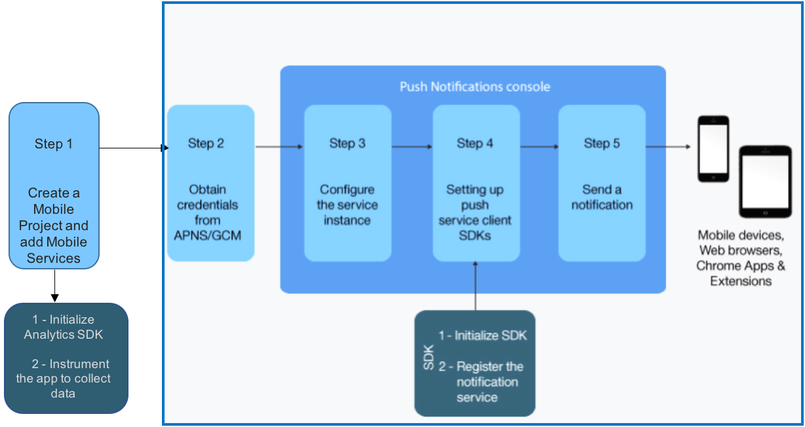
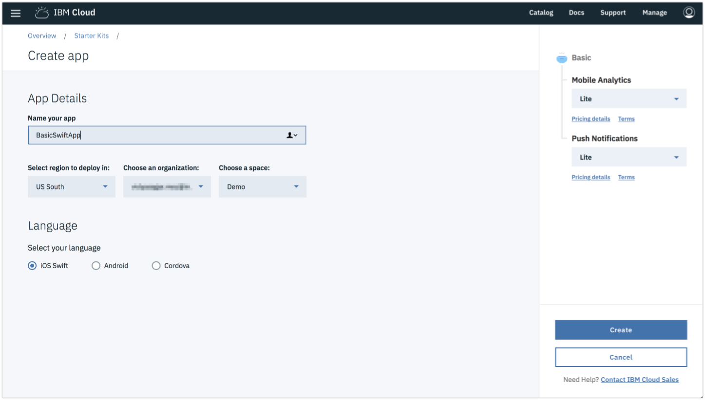
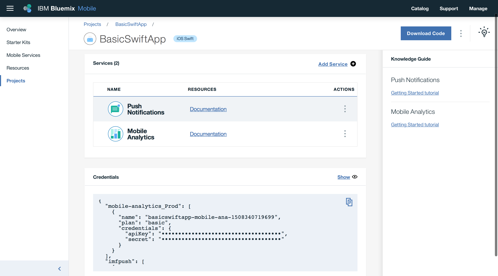
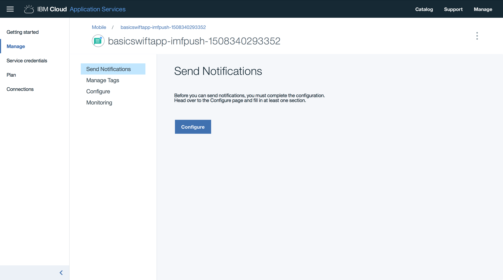
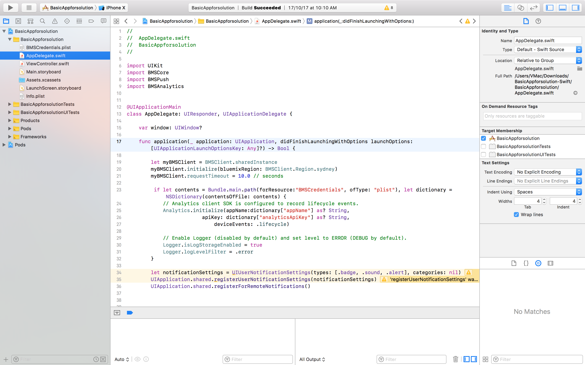

---
copyright:
  years: 2017
lastupdated: "2017-10-27"

---

{:shortdesc: .shortdesc}
{:new_window: target="_blank"}
{:codeblock: .codeblock}
{:screen: .screen}
{:tip: .tip}
{:pre: .pre}

# iOS Mobile Application with Push and Analytics

Learn how easy it is to quickly create an iOS Swift application with high-value mobile services - Push Notifications and Mobile Analytics on IBM Cloud.

This solution walks you through the creation of a mobile starter application, adding mobile services, setting up client SDKs, Importing the code to Xcode and then further enhance the application.

## Objectives

* Create a mobile project from Basic Swift starter kit.
* Add Push Notifications and Mobile Analytics services.
* Obtain APNs credentials and configure Push Notifications service instance.
* Download the code and setup client SDKs.
* Instrumenting the app to use Mobile Analytics.
* Send and monitor push notifications.
* Monitoring the app with Mobile Analytics.

  

## Before you begin
{: #prereqs}

1. [Apple Developers](https://developer.apple.com/) account to send remote notifications from Push Notifications service instance on IBM Cloud (the provider) to iOS devices and applications.
2. Xcode for importing and enhancing your code.

## Create a mobile project from basic Swift starter kit.

{: #get_code}

1. Navigate to [Mobile Dashboard](https://console.bluemix.net/developer/mobile/dashboard) to create your `Project` from pre-defined `Starter Kits`.
2. Click on `Starter Kits` and scroll down to select `Basic` Starter Kit.
    
3. Enter a project name which will also be the Xcode project and app name.
4. Select `Swift` as your language.
    
5. Click on `Create Project` to scaffold an iOS Swift App.
6. A new `Project` will be created under Projects tab on the left pane.

In the next step, you will add mobile services like Push notifications and Mobile Analytics to accelerate your app.

## Add Push Notifications and Mobile Analytics services.
{: #create_cos}

1. Click on `Add Service` and select Mobile to accelerate your app with Mobile services. Click Next to see the available services.
2. Select `Push Notifications` and Click Next.
3. Select Lite plan and Click `Create` to provision a Push Notifications service. To understand the pricing, Click on `pricing details`.
4. Now, you should see Push Notifications service added to your project and also the Credentials.
5. To add Mobile Analytics service, click on `Add Service` and Select Basic plan.Once you click `Create`, you should see both the Mobile services with credentials.

  

6. Click on `Download Code` to download the scaffolded code to Mac. In the next step, you will obtain Apple Push Notification Service (APNs) credentials.

## Obtain APNs credentials and configure Push Notifications service instance.

For iOS devices and applications, Apple Push Notification Service (APNs) allows application developers to send remote notifications from Push Notifications service instance on IBM Cloud (the provider) to iOS devices and applications. Messages are sent to a target application on the device.

You need to obtain and configure your APNs credentials. The APNs certificates are securely managed by Push Notifications service and used to connect to APNs server as a provider.

### Registering an App ID

The App ID (the bundle identifier) is a unique identifier that identifies a specific application. Each application requires an App ID. Services like the Push Notifications service are configured to the App ID.
Ensure that you have an [Apple Developers](https://developer.apple.com/) account. This is a mandatory prerequisite.

1. Go to the [Apple Developer](https://developer.apple.com/) portal, click `Member Center`, and select `Certificates, IDs & Profiles`.
2. Go to `Identifiers` > App IDs section.
3. In the `Registering App IDs` page, provide the App name in the App ID Description Name field. For example: ACME Push Notifications. Provide a string for the App ID Prefix.
4. For the App ID Suffix, choose `Explicit App ID` and provide a Bundle ID value. It is recommended that you provide a reverse domain-name style string. For example: com.ACME.push.
5. Select the `Push Notifications` check-box and click `Continue`.
6. Go through your settings and click `Register` > `Done`.
  Your App ID is now registered.

  

### Create a development and distribution APNs SSL certificate
Before you obtain an APNs certificate, you must first generate a certificate signing request (CSR) and submit it to Apple, the certificate authority (CA). The CSR contains information that identifies your company and your public and private key that you use to sign for your Apple push notifications. Then, generate the SSL certificate on the iOS Developer Portal. The certificate, along with its public and private key, is stored in Keychain Access.
You can use APNs in two modes:

  * Sandbox mode for development and testing.
  * Production mode when distributing applications through the App Store (or other enterprise distribution mechanisms).

You must obtain separate certificates for your development and distribution environments. The certificates are associated with an App ID for the app that is the recipient of remote notifications. For production, you can create up to two certificates. IBM Cloud uses the certificates to establish an SSL connection with APNs.

1. Go to the Apple Developer website, click `Member Center`, and select `Certificates, IDs & Profiles`.
2. In the `Identifiers` area, click `App IDs`.
3. From your list of App IDs, select your App ID, then select `Edit`.
4. Select the the `Push Notifications` check-box, and then:

     * On Development SSL certificate pane, click Create Certificate...
     * On Production SSL certificate pane, click Create Certificate...

        

5. When the `About Creating a Certificate Signing Request (CSR) screen` displays, start the `Keychain Access` application on your Mac to create a Certificate Signing Request (CSR). Click `Continue`.
6. For the Upload CSR file option, click `Choose File`, and select file `CertificateSigningRequest.certSigningRequest`. Click `Continue`.
7. On the Download, Install and Backup pane, click Download. The `aps_development.cer` file is downloaded.
     
8. From the menu, select `Keychain Access > Certificate Assistant > Request a Certificate From a Certificate Authority…`
9. In `Certificate Information`, enter the email address that is associated with your App Developer account and a common name. Give a meaningful name that helps you identify whether it is a certificate for development (sandbox) or distribution (production); for example, sandbox-apns-certificate or production-apns-certificate.
10. Select `Save to disk` to download the `.certSigningRequest` file to your desktop, then click Continue.
11. In the `Save As` menu option, name the `.certSigningRequest` file and click Save. Click Done. You now have a CSR.
12. Return to the `About Creating a Certificate Siging Request (CSR)` window and click Continue.
13. From the `Generate` screen, click `Choose File ...` and select the CSR file that you saved on your desktop. Then, click `Generate`. When your certificate is ready, click `Done`.

     

14. On the `Push Notifications` screen, click Download to download your certificate, then click `Done`.

   

15. On your Mac, go to `Keychain Access > My Certificates`, and locate your newly installed certificate. Double-click the certificate to install it into the Keychain Access.
16. Select the certificate and private key, and then select `Export` to convert the certificate into the personal information exchange format (`.p12` format).

   

17. In the `Save As` field, provide the certificate a meaningful name. For example, `sandbox_apns.p12_certificate` or `production_apns.p12`, then click Save.

     

18. In the `Enter a password` field, enter a password to protect the exported items, then click OK. You can use this password to configure your APNs settings on the Push Notifications service console.

    

19. The `Key Access.app` prompts you to export your key from the `Keychain` screen. Enter your administrative password for your Mac to allow your system to export these items, and then select the `Always Allow` option. A `.p12` certificate is generated on your desktop.

### Creating a development provisioning profile
The provisioning profile works with the App ID to determine which devices can install and run your app and which services your app can access. For each App ID, you create two provisioning profiles: one for development and the other for distribution. Xcode uses the development provisioning profile to determine which developers are allowed to build the application and which devices are allowed to be tested on the application.

Ensure that you have registered an App ID, enabled it for Push Notifications service, and configured it to use a development and production APNs SSL certificate.

Create a development provisioning profile, as follows:

1. Go to the [Apple Developer](https://developer.apple.com/) portal, click `Member Center`, and select `Certificates, IDs & Profiles`.
2. Go to the [Mac Developer Library](https://developer.apple.com/library/mac/documentation/IDEs/Conceptual/AppDistributionGuide/MaintainingProfiles/MaintainingProfiles.html#//apple_ref/doc/uid/TP40012582-CH30-SW62site), scroll to the `Creating Development Provisioning Profiles` section, and follow the instructions to create a development profile.
  **Note:** When you configure a development provision profile, select the following options:

  - **iOS App Development**
  - **For iOS and watchOS apps**

### Creating a store distribution provisioning profile
Use the store provisioning profile to submit your app for distribution to the App Store.

1. Go to the [Apple Developer](https://developer.apple.com/), click `Member Center`, and select `Certificates, IDs & Profiles`.
2. Double-click the downloaded provisioning profile to install it into Xcode.
  After obtaining the credentials, the next step is to [Configure a service instance](https://console.bluemix.net/docs/services/mobilepush/push_step_2.html).

### Configure the service instance

To use the Push Notifications service to send notifications, upload the .p12 certificates that you had created in the above Step. This certificate contains the private key and SSL certificates that are required to build and publish your application.

**Note:** After the `.cer` file is in your key chain access, export it to your computer to create a `.p12` certificate.

1. Click on `Push Notifications` under Services section or Click on the three vertical dots next to the Push Notifications service and select `Open dashboard`.
2. On the Push Notifications Dashboard, you should see `Configure` option under `Manage > Send Notifications`.
  

To set up APNs on the `Push Notification services` console, complete the steps:

1. Select `Configure` on the Push Notification services Dashboard.
2. Choose the `Mobile option` to update the information in the APNs Push Credentials form.
3. Select `Sandbox (development)` or `Production (distribution)` as appropriate and then upload the `p.12` certificate that you have created.
4. In the Password field, enter the password that is associated with the .p12 certificate file, then click Save.
   

## Download the code and setup client SDKs
If you haven't downloaded the code yet, Click on `Download Code` under Projects > `Your Mobile Project`
The downloaded code comes with **Push Notifications** and **Mobile Analytics** Client SDKs included. The Client SDKs are available on CocoaPods and Carthage. For this solution, you will use CocoaPods.

1. To install or update CocoaPods on your machine, Open the `Terminal` and run the below command.
   ```
   sudo gem install cocoapods
   ```
2. On the terminal, Navigate to the folder where you downloaded the code
   ```
   cd <Name of the Project name>
   ```
3. The folder already includes a `podfile` with required dependencies.So run the below command to install the dependencies (Client SDKs)
  ```
  pod install
  ```
4. The required dependencies will be installed
  ```
  Analyzing dependencies
  Downloading dependencies
  Using BMSAnalytics (2.2.0)
  Using BMSAnalyticsAPI (2.2.1)
  Using BMSCore (2.3.2)
  Using BMSPush (2.0.3)
  Generating Pods project
  Integrating client project
  Sending stats
  Pod installation complete! There are 3 dependencies from the Podfile and 4 total pods installed.
  ```
5. If you navigate to the folder, you should see a `.xcworkspace` file.
  **Note:** Ensure that you always open the new Xcode workspace, instead of the original Xcode project file: `MyApp.xcworkspace`.

## Instrumenting the app to use Mobile Analytics.

1. Open `.xcworkspace` in Xcode and navigate to `AppDelegate.swift`.
   
2. `BMSCore` is the Core SDK and is base for the Mobile Client SDKs. `BMSClient` is a class of BMSCore and initialized as follows
  ```
  let myBMSClient = BMSClient.sharedInstance
        myBMSClient.initialize(bluemixRegion: <Region you created the service>)
        myBMSClient.requestTimeout = 10.0 // seconds
  ```
3. Along with BMSCore, Mobile Analytics SDK is already imported into the project with
  ```
   import BMSAnalytics
  ```
4. Analytics initialization code is already included as shown below
  ```
  // Analytics client SDK is configured to record lifecycle events.
         	Analytics.initialize(appName:dictionary["appName"] as? String,
        			     apiKey: dictionary["analyticsApiKey"] as? String,
        	        	     deviceEvents: .lifecycle)

        	// Enable Logger (disabled by default) and set level to ERROR (DEBUG by default).
        	Logger.isLogStorageEnabled = true
        	Logger.logLevelFilter = .error
  ```
   **Note:** The service credentials are part of `BMSCredentials.plist` file.
5. Gathering usage analytics and using logger - Navigate to `ViewController.swift` to see the below code.

  ```
   func didBecomeActive(_ notification: Notification) {
        Analytics.send()
        Logger.send()
    }
  ```

## Send and monitor push notifications.

1. Push notifications SDK is already imported into the project with
  ```
   import BMSPush
  ```
2. Push initialization code can be found under `func application`
  ```
   let push = BMSPushClient.sharedInstance
            push.initializeWithAppGUID(appGUID: dictionary["pushAppGuid"] as! String,
                                       clientSecret: dictionary["pushClientSecret"] as! String)
  ```
3. Registration for notifications happens in `AppDelegate.swift`. Provide an unique USER_ID.
  ```
   // Replace USER_ID with a unique end user identifier. This enables specific push notification targeting.
            push.registerWithDeviceToken(deviceToken: deviceToken, WithUserId: "USER_ID") { (response, statusCode, error) -> Void in
                if error.isEmpty {
                    print("Response during device registration : \(response)")
                    print("status code during device registration : \(statusCode)")
                } else {
                    print("Error during device registration \(error)")
                    print("Error during device registration \n  - status code: \(statusCode) \n  - Error: \(error) \n")
                }
            }
  ```
4. Run the app on a physical device as notifications can't be sent to a iPhone Simulator.
5. Open Push Notifications service on IBM Cloud and to send basic push notifications, complete the following steps:
  * Select `Send Notifications`, and compose a message by choosing a Send to option. The supported options are Device by Tag, Device Id, User Id, Android devices, iOS devices, Web Notifications, and All Devices.

       **Note:** When you select the All Devices option, all devices subscribed to Push Notifications will receive notifications.
  * In the `Message` field, compose your message. Choose to configure the optional settings as required.
  * Click `Send`.
    
  * Verify that your physical devices has received the notification.
6. You should see a notification on your iPhone.

   

7. You can monitor your sent notifications by navigating to `Monitoring` on the Push Notifications Service.

  The IBM Push Notifications service now extends capabilities to monitor the push performance by generating graphs from your user data. You can use the utility to list all the sent push notifications, or to list all the registered devices and to analyze information on a daily, weekly, or monthly basis.
  

## Monitoring the app with Mobile Analytics.
You can record application logs and monitor data with the Mobile Analytics Client SDK. Developers can control when to send this data to the Mobile Analytics Service. When data is delivered to Mobile Analytics, you can use the Mobile Analytics console to get analytics insights about your mobile applications, devices, and application logs.

1. Open the `Mobile Analytics` service from the mobile project you created or click on the three vertical dots next to the service and select `Open Dashboard`.
2. You should see LIVE Users, Sessions and other App Data by disabling `Demo Mode`. You can filter the analytics information by
    * Date.
      * Application.
      * Operating System.
      * Version of the app.
         
3. [Click here](https://console.bluemix.net/docs/services/mobileanalytics/app-monitoring.html#monitoringapps) to set alerts, Monitor App crashes, and Monitor network requests.

## Related Content

[Tag-based notifications](https://console.bluemix.net/docs/services/mobilepush/push_step_4_nf_tag.html#tag_based_notifications)

[Push Notifications REST APIs](https://console.bluemix.net/docs/services/mobilepush/push_restapi.html#push-api-rest)

[Security in Push Notifications](https://console.bluemix.net/docs/services/mobilepush/push_security.html#overview-push)

[Exporting Analytics data to Db2 Warehouse](https://console.bluemix.net/docs/services/mobileanalytics/app-monitoring.html#dashdb)
