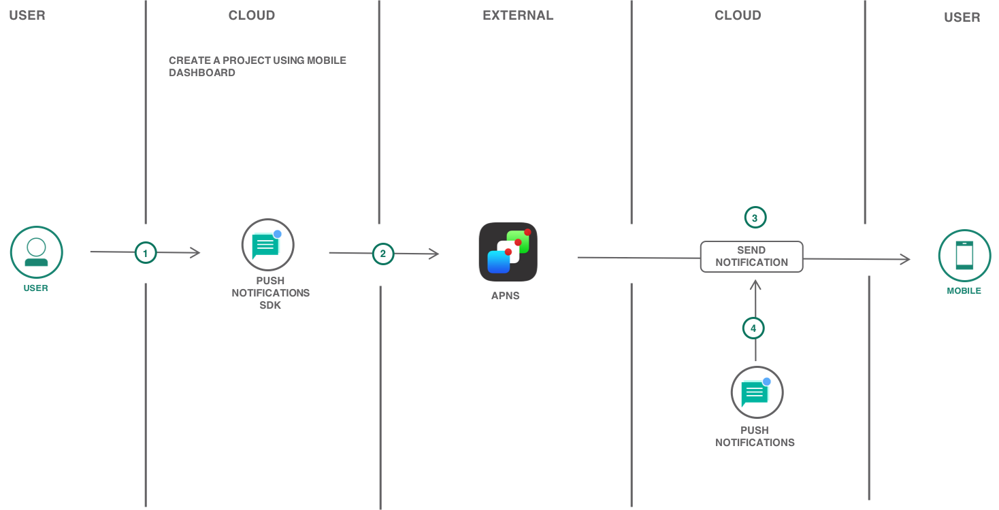
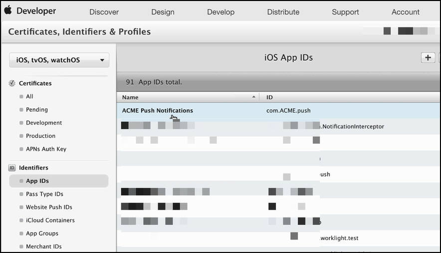
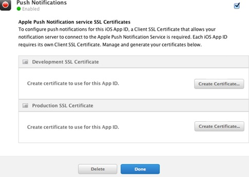
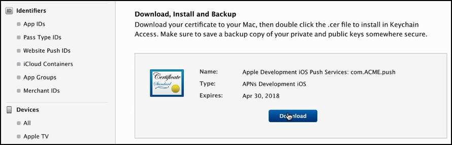
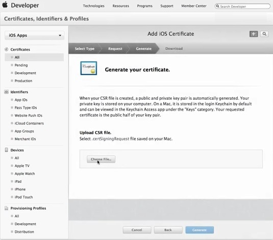
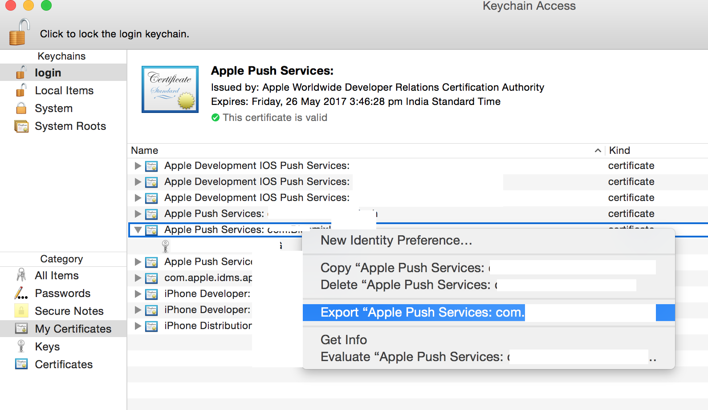
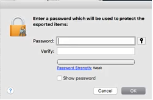
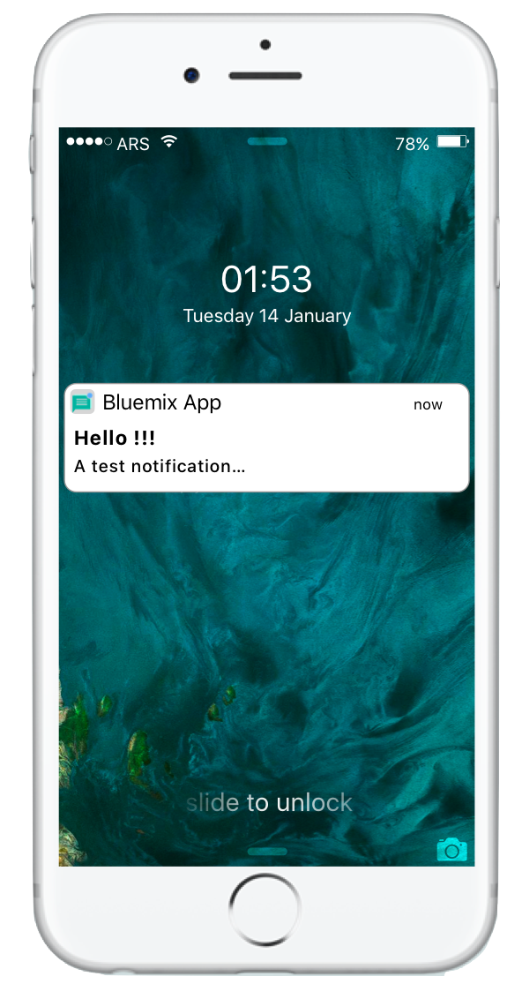

{:java: #java .ph data-hd-programlang='java'}
{:swift: #swift .ph data-hd-programlang='swift'}
{:ios: #ios data-hd-operatingsystem="ios"}
{:android: #android data-hd-operatingsystem="android"}
{:shortdesc: .shortdesc}
{:new_window: target="_blank"}
{:codeblock: .codeblock}
{:screen: .screen}
{:tip: .tip}
{:pre: .pre}

# iOS mobile application with Push Notifications
{: #ios-mobile-push-analytics}

Learn how easy it is to quickly create an iOS Swift application with high-value mobile service {{site.data.keyword.mobilepushshort}} on {{site.data.keyword.Bluemix_short}}.

This tutorial walks you through the creation of a mobile starter application, adding a mobile service, setting up client SDK, importing the code to Xcode and then further enhance the application.
{:shortdesc: .shortdesc}

## Objectives
{:#objectives}

- Create a mobile app with {{site.data.keyword.mobilepushshort}} and {{site.data.keyword.mobileanalytics_short}} services from Basic Swift starter kit.
- Obtain APNs credentials and configure {{site.data.keyword.mobilepushshort}} service instance.
- Download the code and setup client SDK.
- Send and monitor {{site.data.keyword.mobilepushshort}}.

## Services
{:#services}

This tutorial uses the following runtimes and services:
* [{{site.data.keyword.pushfull}}](https://{DomainName}/catalog/services/push-notifications)

## Architecture
{:#architecture}

  

1. The user creates a project on the App Development page.
2. Adds and configures the push notifications SDK to interact with APNS.
3. Sends a push notification.
4. The {{site.data.keyword.mobilepushshort}} service sends the notification to APNS.
5. The notification is received on the device and monitored.

## Before you begin
{: #prereqs}

1. [Apple Developers](https://developer.apple.com/) account to send remote notifications from {{site.data.keyword.mobilepushshort}} service instance on {{site.data.keyword.Bluemix_short}} (the provider) to iOS devices and applications.
2. Xcode for importing and enhancing your code.

## Create a mobile app from Swift starter kit
{: #get_code}

1. Navigate to [App Development Dashboard](https://{DomainName}/developer/appservice/dashboard) and click **Get Started**.
1. Scroll and select **Mobile App with Push Notifications** starter kit.
1. Click **Create app** and enter an app name > select a resource group.
1. Select **iOS Swift** as your platform.
1. On the **App details** page,
    - Select {{site.data.keyword.pushfull}} region
    - Select a resource group
    - Select a **Lite** plan
1. Click **Create**. A new App will be created under **Apps** of [Resource list](https://{DomainName}/resources).


​      **Note:** {{site.data.keyword.mobilepushshort}} service should already be added with the Empty Starter.

## Download the code and setup client SDKs
{: #download_code}

If you haven't downloaded the code yet, Click on `Download Code` under Apps > `Your Mobile App`
The downloaded code comes with **{{site.data.keyword.mobilepushshort}}** Client SDK included. The Client SDK is available on CocoaPods and Carthage. For this solution, you will use CocoaPods.

1. To install CocoaPods on your machine, Open the `Terminal` and run the below command.
   ```
   sudo gem install cocoapods --pre
   ```
   {: pre:}
2. Unzip the downloaded code and using the terminal, navigate to the unzipped folder

   ```
   cd <Name of Project>
   ```
   {: pre:}
3. The folder already includes a `podfile` with required dependencies. Run the below command to install the dependencies (Client SDKs) and the required dependencies will be installed.

  ```
  pod install
  ```
  {: pre:}

## Obtain APNs credentials and configure {{site.data.keyword.mobilepushshort}} service instance.
{: #obtain_apns_credentials}

   For iOS devices and applications, Apple Push Notification Service (APNs) allows application developers to send remote notifications from {{site.data.keyword.mobilepushshort}} service instance on {{site.data.keyword.Bluemix_short}} (the provider) to iOS devices and applications. Messages are sent to a target application on the device.

   You need to obtain and configure your APNs credentials. The APNs certificates are securely managed by {{site.data.keyword.mobilepushshort}} service and used to connect to APNs server as a provider.

### Registering an App ID

   The App ID (the bundle identifier) is a unique identifier that identifies a specific application. Each application requires an App ID. Services like the {{site.data.keyword.mobilepushshort}} service are configured to the App ID.
   Ensure that you have an [Apple Developers](https://developer.apple.com/) account. This is a mandatory prerequisite.

   1. Go to the [Apple Developer](https://developer.apple.com/) portal, click `Member Center`, and select `Certificates, IDs & Profiles`.
   2. Go to `Identifiers` > App IDs section.
   3. In the `Registering App IDs` page, provide the App name in the App ID Description Name field. For example: ACME {{site.data.keyword.mobilepushshort}}. Provide a string for the App ID Prefix.
   4. For the App ID Suffix, choose `Explicit App ID` and provide a Bundle ID value. It is recommended that you provide a reverse domain-name style string. For example: com.ACME.push.
   5. Select the `{{site.data.keyword.mobilepushshort}}` check-box and click `Continue`.
   6. Go through your settings and click `Register` > `Done`.
     Your App ID is now registered.

     

### Create a development and distribution APNs SSL certificate
   Before you obtain an APNs certificate, you must first generate a certificate signing request (CSR) and submit it to Apple, the certificate authority (CA). The CSR contains information that identifies your company and your public and private key. Then, generate the SSL certificate on the iOS Developer Portal. The certificate, along with its public and private key, is stored in Keychain Access.
   You can use APNs in two modes:

- Sandbox mode for development and testing.
- Production mode when distributing applications through the App Store (or other enterprise distribution mechanisms).

   You must obtain separate certificates for your development and distribution environments. The certificates are associated with an App ID for the app that is the recipient of remote notifications. For production, you can create up to two certificates. {{site.data.keyword.Bluemix_short}} uses the certificates to establish an SSL connection with APNs.

   1. Go to the Apple Developer website, click **Member Center**, and select **Certificates, IDs & Profiles**.
   2. In the **Identifiers** area, click **App IDs**.
   3. From your list of App IDs, select your App ID, then select `Edit`.
   4. Select the  **{{site.data.keyword.mobilepushshort}}** check-box, and then on **Development SSL certificate** pane, click **Create Certificate**.

     

   5. When the **About Creating a Certificate Signing Request (CSR) screen** displays, follow the instructions shown to create a Certificate Signing Request (CSR) file. Give a meaningful name that helps you identify whether it is a certificate for development (sandbox) or distribution (production); for example, sandbox-apns-certificate or production-apns-certificate.
   6. Click **Continue** and on the Upload CSR file screen, click **Choose File**, and select the file **CertificateSigningRequest.certSigningRequest** you just created. Click **Continue**.
   7. On the Download, Install and Backup pane, click Download. The **aps_development.cer** file is downloaded.
        

        
   8. On your mac, open **Keychain Access**, **File**, **Import** and select the downloaded .cer file to install it.
   9. Right-click on the new certificate, and then select **Export** and change the **File Format** to Personal information exchange format (`.p12` format).
     
   10. In the **Save As** field, provide the certificate a meaningful name. For example, `sandbox_apns.p12` or **production_apns.p12**, then click Save.
     
   11. In the **Enter a password** field, enter a password to protect the exported items, then click OK. You can use this password to configure your APNs settings on the {{site.data.keyword.mobilepushshort}} service console.
       
   12. The **Key Access.app** prompts you to export your key from the **Keychain** screen. Enter your administrative password for your Mac to allow your system to export these items, and then select the `Always Allow` option. A `.p12` certificate is generated on your desktop.

      For Production SSL, On **Production SSL certificate** pane, click **Create Certificate** and repeat Steps 5 to 12 above.
      {:tip}

### Creating a development provisioning profile
   The provisioning profile works with the App ID to determine which devices can install and run your app and which services your app can access. For each App ID, you create two provisioning profiles: one for development and the other for distribution. Xcode uses the development provisioning profile to determine which developers are allowed to build the application and which devices are allowed to be tested on the application.

   Ensure that you have registered an App ID, enabled it for {{site.data.keyword.mobilepushshort}} service, and configured it to use a development and production APNs SSL certificate.

   Create a development provisioning profile, as follows:

   1. Go to the [Apple Developer](https://developer.apple.com/) portal, click `Member Center`, and select `Certificates, IDs & Profiles`.
   2. Go to the [Mac Developer Library](https://developer.apple.com/library/mac/documentation/IDEs/Conceptual/AppDistributionGuide/MaintainingProfiles/MaintainingProfiles.html#//apple_ref/doc/uid/TP40012582-CH30-SW62site), scroll to the `Creating Development Provisioning Profiles` section, and follow the instructions to create a development profile.
     **Note:** When you configure a development provision profile, select the following options:

     - **iOS App Development**
     - **For iOS and watchOS apps**

### Creating a store distribution provisioning profile
   Use the store provisioning profile to submit your app for distribution to the App Store.

   1. Go to the [Apple Developer](https://developer.apple.com/), click `Member Center`, and select `Certificates, IDs & Profiles`.
   2. Double-click the downloaded provisioning profile to install it into Xcode.
     After obtaining the credentials, the next step is to [Configure a service instance](https://{DomainName}/docs/services/mobilepush?topic=mobile-pushnotification-push_step_2#push_step_2).

### Configure the service instance

   To use the {{site.data.keyword.mobilepushshort}} service to send notifications, upload the .p12 certificates that you had created in the above Step. This certificate contains the private key and SSL certificates that are required to build and publish your application.

   **Note:** After the `.cer` file is in your key chain access, export it to your computer to create a `.p12` certificate.

1. Click on {{site.data.keyword.mobilepushshort}} under App details section or Click on the three vertical dots next to the {{site.data.keyword.mobilepushshort}} service and select `Open dashboard`.
2. On the {{site.data.keyword.mobilepushshort}} Dashboard, you should see `Configure` option under `Manage`.

To set up APNs on the `Push Notification services` console, complete the steps:

1. Choose the `Mobile` option to update the information in the APNs Push Credentials form.
2. Select `Sandbox/Development APNs Server` or `Production APNs Server` as appropriate and then upload the `.p12` certificate that you have created.
3. In the Password field, enter the password that is associated with the .p12 certificate file, then click Save.


## Configure,send, and monitor {{site.data.keyword.mobilepushshort}}
{: #configure_push}

1. Push initialization code (under `func application`) and notification registration code can be found in `AppDelegate.swift`. Provide a unique USER_ID(Optional).
2. Run the app on a physical device as notifications can't be sent to an iPhone Simulator.
3. Open {{site.data.keyword.mobilepushshort}} service under **App details** on {{site.data.keyword.Bluemix_short}} App Development and to send basic {{site.data.keyword.mobilepushshort}}, complete the following steps:
  * Select `Messages`, and compose a message by choosing a Send to option. The supported options are _Device by Tag_, _Device Id_, _User Id_, _Android devices_, _iOS devices_, _Web Notifications_, _All Devices_ and _other browsers_.

       **Note:** When you select the All Devices option, all devices subscribed to {{site.data.keyword.mobilepushshort}} will receive notifications.
  * In the `Message` field, compose your message. Choose to configure the optional settings as required.
  * Click `Send` and verify that your physical device has received the notification.
    

4. You should see a notification on your iPhone.

   

5. You can monitor your sent notifications by navigating to `Monitoring` on the {{site.data.keyword.mobilepushshort}} Service.

The IBM {{site.data.keyword.mobilepushshort}} service now extends capabilities to monitor the push performance by generating graphs from your user data. You can use the utility to list all the sent {{site.data.keyword.mobilepushshort}}, or to list all the registered devices and to analyze information on a daily, weekly, or monthly basis.


## Related Content
{: #related_content}

- [Tag-based notifications](https://{DomainName}/docs/services/mobilepush?topic=mobile-pushnotification-tag_based_notifications#tag_based_notifications)
- [{{site.data.keyword.mobilepushshort}} APIs](https://{DomainName}/docs/services/mobilepush?topic=mobile-pushnotification-apis-for-push-notification#apis-for-push-notification)
- [Security in {{site.data.keyword.mobilepushshort}}](https://{DomainName}/docs/services/mobilepush?topic=mobile-pushnotification-security-in-push-notifications#overview-push)
