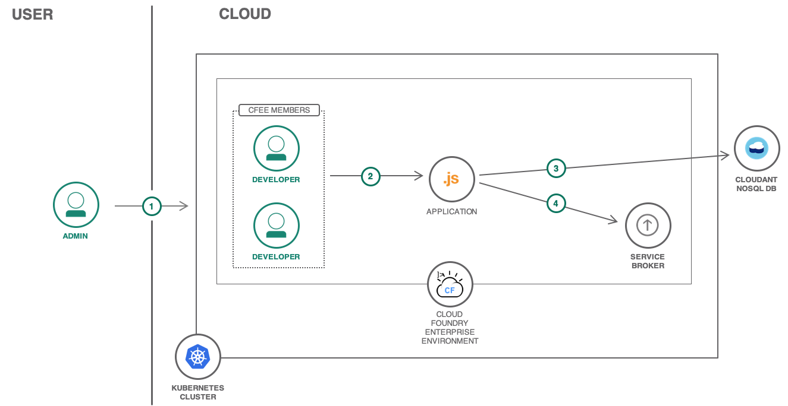
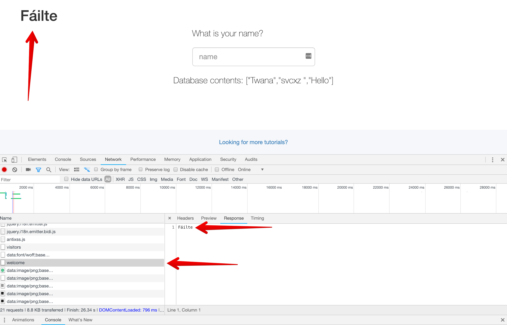

{:java: #java .ph data-hd-programlang='java'}
{:swift: #swift .ph data-hd-programlang='swift'}
{:ios: #ios data-hd-operatingsystem="ios"}
{:android: #android data-hd-operatingsystem="android"}
{:shortdesc: .shortdesc}
{:new_window: target="_blank"}
{:codeblock: .codeblock}
{:screen: .screen}
{:tip: .tip}
{:pre: .pre}

# Isolated Cloud Foundry Enterprise Apps
{: #isolated-cloud-foundry-enterprise-apps}

With {{site.data.keyword.cfee_full_notm}} (CFEE) you can create multiple, isolated, enterprise-grade Cloud Foundry platforms on demand. With this, you get a private Cloud Foundry instance deployed on an isolated Kubernetes cluster. Unlike the public Cloud, you'll have full control over the environment: access control, capacity, version, resource usage, and monitoring. {{site.data.keyword.cfee_full_notm}} provides the speed and innovation of a platform-as-a-service with the infrastructure ownership found in enterprise IT.

A use case for {{site.data.keyword.cfee_full_notm}} is an enterprise-owned innovation platform. You as a developer within an enterprise can either create new microservices or migrate legacy applications to CFEE. Microservices can then be published to additional developers using the Cloud Foundry marketplace. Once there, other developers in your CFEE instance can consume services within the application just as is done today on public Cloud.

The tutorial will walk you through the process of creating and configuring an {{site.data.keyword.cfee_full_notm}}, setting up access control, and deploying apps and services. You'll also review the relationship between CFEE and [{{site.data.keyword.containershort_notm}}](https://{DomainName}/docs/containers?topic=containers-container_index#container_index) by deploying a custom service broker that integrates custom services with CFEE.

## Objectives

{: #objectives}

- Compare and contrast CFEE with public Cloud Foundry
- Deploy apps and services within CFEE
- Understand the relationship between Cloud Foundry and {{site.data.keyword.containershort_notm}}
- Investigate basic Cloud Foundry and {{site.data.keyword.containershort_notm}} networking

## Services used

{: #services}

This tutorial uses the following runtimes and services:

- [{{site.data.keyword.cfee_full_notm}}](https://{DomainName}/cfadmin/create)
- [{{site.data.keyword.cloudant_short_notm}}](https://{DomainName}/catalog/services/cloudant)

This tutorial may incur costs. Use the [Pricing Calculator](https://{DomainName}/estimator/review) to generate a cost estimate based on your projected usage.

## Architecture

{: #architecture}



1. Admin creates a CFEE instance, and adds users with developer access.
2. Developer pushes a Node.js starter app to CFEE.
3. Node.js starter app uses [{{site.data.keyword.cloudant_short_notm}}](https://{DomainName}/catalog/services/cloudant) to store data.
4. Developer adds a new "welcome message" service.
5. Node.js starter app binds the new service from a custom service broker.
6. Node.js starter app displays "welcome" in different languages from the service.

## Prerequisites

{: #prereq}

- [{{site.data.keyword.cloud_notm}} CLI](/docs/cli?topic=cloud-cli-install-ibmcloud-cli)
- [Cloud Foundry CLI](https://docs.cloudfoundry.org/cf-cli/install-go-cli.html)
- [Git](https://git-scm.com/downloads)
- [Node.js](https://nodejs.org/en/)

## Provision {{site.data.keyword.cfee_full_notm}}

{:provision_cfee}

In this section, you'll create an instance of {{site.data.keyword.cfee_full_notm}} deployed to Kubernetes worker nodes from {{site.data.keyword.containershort_notm}}.

1. [Prepare your {{site.data.keyword.cloud_notm}} account](https://{DomainName}/docs/cloud-foundry?topic=cloud-foundry-prepare#prepare) to ensure the creation of required infrastructure resources.
2. From the {{site.data.keyword.cloud_notm}} catalog, create a service instance of [{{site.data.keyword.cfee_full_notm}} ](https://{DomainName}/cfadmin/create).
3. Configure CFEE by providing the following:
   - Select the **Standard** plan.
   - Enter a **Name** for the service instance.
   - Select a **Resource group** in which the environment is created. You'll need permission to access at least one resource group in the account to be able to create a CFEE instance.
   - Select a **Geography** and **Region** where the instance is deployed. See the list of [available provisioning locations and data centers](https://{DomainName}/docs/cloud-foundry?topic=cloud-foundry-about#provisioning-targets).
   - Select the **Worker Zones** where the Kubernetes worker nodes will be deployed.
   - Select the **Number of cells** for the Cloud Foundry environment. A cell runs Diego and Cloud Foundry applications. At least **2** cells are required for highly available applications.
   - Select the **Node size**, which determines the size of the Cloud Foundry cells (CPU and memory) and the CFEE and Cloud Foundry deployment **Version**.
4. Review the **Infrastructure** section to view the properties of the Kubernetes cluster supporting CFEE. The **Number of worker nodes** equals the number of cells plus 2. Two of the provisioned Kubernetes worker nodes act as the CFEE control plane. The Kubernetes cluster on which the environment is deployed will appear in the {{site.data.keyword.cloud_notm}} [Clusters](https://{DomainName}/kubernetes/clusters) dashboard.
5. Click the **Create** button to begin automated deployment.

The automated deployment takes approximately 90 to 120 minutes. Once successfully created, you'll receive an email confirming the provisioning of CFEE and supporting services.

### Create organizations and spaces

After you've created {{site.data.keyword.cfee_full_notm}}, see [creating organizations and spaces](https://{DomainName}/docs/cloud-foundry?topic=cloud-foundry-create_orgs#create_orgs) for information on how to structure the environment through organizations and spaces. Apps in an {{site.data.keyword.cfee_full_notm}} are scoped within specific spaces. Similarly, a space exists within the context of an organization. Members of an organization share a quota plan, apps, services instances, and custom domains.

Note: The **Manage > Account > Cloud Foundry orgs** menu located in the top {{site.data.keyword.cloud_notm}} header is intended exclusively for public {{site.data.keyword.cloud_notm}} organizations. CFEE organizations are managed within the **organizations** page of a CFEE instance.

Follow the steps below to create a CFEE org and space.

1. From the [Cloud Foundry dashboard](https://{DomainName}/dashboard/cloudfoundry/overview) select **Environments** under **Enterprise** on the left pane.
2. Click on the name of your CFEE instance and then select **Organizations**.
3. Click on the **Create Organization** button, provide `tutorial` as the **Organization Name**, and select a **Quota Plan**. Finish by clicking **Add**.
4. Click on the newly created organization `tutorial`, and then select the **Spaces** tab, and click the **Create Space** button.
5. Provide `dev` as a **Space Name** and click **Add**.

### Add users to orgs and spaces

In CFEE, you can assign roles controlling user access, but to do so, the user must be invited to your {{site.data.keyword.cloud_notm}} account in the **Identity & Access** page under the **Manage > Users** in the {{site.data.keyword.cloud_notm}} header.

Once the user has been invited, follow the steps below to add the user to the `tutorial` organization created,

1. Click on the name of your [CFEE instance](https://{DomainName}/dashboard/cloudfoundry?filter=cf_environments) and then select **Organizations** again.
2. Select the `tutorial` org created from the list.
3. Click on the **Members** tab to view and add a new user.
4. Click on the **Add members** button, search for the username, select the appropriate **Organization Roles**, and click **Add**.

More on adding users to CFEE orgs and spaces can be found [here](https://{DomainName}/docs/cloud-foundry?topic=cloud-foundry-adding_users#adding_users).

## Deploy, configure, and run CFEE apps

{:deploycfeeapps}

In this section, you'll deploy a Node.js application to CFEE. Once deployed, you'll then bind an {{site.data.keyword.cloudant_short_notm}} to it and enable auditing and logging persistence. The Stratos console will also be added to manage the application.

### Deploy the application to CFEE

1. From your terminal, clone the [get-started-node](https://github.com/IBM-Cloud/get-started-node) sample application.
   ```sh
   git clone https://github.com/IBM-Cloud/get-started-node
   ```
   {: pre}
2. Run the app locally to ensure it builds and starts correctly. Confirm by accessing `http://localhost:3000/` in your browser.
   ```sh
   cd get-started-node
   npm install
   npm start
   ```
   {: pre}
3. Log in to {{site.data.keyword.cloud_notm}} and target your CFEE instance. An interactive prompt will help you select your new CFEE instance. Since only one organization and space exist in the CFEE instance, these will be the defaulted target. You can run `ibmcloud target -o tutorial -s dev` if you've added more than one org or space.
   ```sh
   ibmcloud login
   ibmcloud target --cf
   ```
   {: pre}
4. Push the **get-started-node** app to CFEE.
   ```sh
   ibmcloud cf push
   ```
   {: pre}
5. The endpoint of your app will display in the final output next to the `routes` property. Open the URL in your browser to confirm the application is running.

### Create and bind Cloudant database to the app

To bind {{site.data.keyword.cloud_notm}} services to the **get-started-node** application, you'll first need to create a service in your {{site.data.keyword.cloud_notm}} account.

1. Create a {{site.data.keyword.cloudant_short_notm}} service and add the newly created {{site.data.keyword.cloudant_short_notm}} service instance to CFEE.
   1. Navigate back to the `tutorial` **Organization**. Click the **Spaces** tab and select the `dev` space.
   1. Select the **Services** tab and click the **Create Service** button.
   1. Select {{site.data.keyword.cloudant_short_notm}} from the list > click **Continue**.
   1. Provide the **service name** `cfee-cloudant`, choose `Use both legacy credentials and IAM` as your authentication method and choose the same location where the CFEE instance has been created. Once the service is created it will appear in the list.
   1. To find an existing service, Type the name in the search textbox and select the result. Finish by clicking **Add**. The service is now available to CFEE applications; however, it still resides in public {{site.data.keyword.cloud_notm}}.
1. On the overflow menu of the service instance shown, select **Bind to application**.
1. Select the **GetStartedNode** application you pushed earlier and check **Restage application after binding**. Finally, click the **Bind** button. Wait for the application to restage. You can check the status under the **Applications** tab.
1. In your browser, access the application, add your name and hit the `enter` key. Your name will be added to a {{site.data.keyword.cloudant_short_notm}} database.
1. Confirm by selecting the `cfee-cloudant`instance from the list on the **Services** tab. This will open the service instance's details page in public {{site.data.keyword.cloud_notm}}.
1. Click **Launch Cloudant Dashboard** and select the `mydb` database. A JSON document with your name should exist.

### Enable auditing and logging persistence

Auditing allows CFEE administrators to track Cloud Foundry activities such as login, creation of organizations and spaces, user membership and role assignments, application deployments, service bindings, and domain configuration. Auditing is supported through integration with the {{site.data.keyword.cloudaccesstrailshort}} service.

Cloud Foundry application logs can be stored by integrating {{site.data.keyword.loganalysisshort_notm}}. The {{site.data.keyword.loganalysisshort_notm}} service instance selected by a CFEE administrator is configured automatically to receive and persist Cloud Foundry logging events generated from the CFEE instance.

To enable CFEE auditing and logging persistence follow the [steps here](https://{DomainName}/docs/cloud-foundry?topic=cloud-foundry-auditing-logging#auditing-logging).

### Install the Stratos console to manage the app

Stratos Console is an open source web-based tool for working with Cloud Foundry. The Stratos Console application can be optionally installed and used in a specific CFEE environment to manage organizations, spaces, and applications.

To install the Stratos Console application:

1. Open the CFEE instance where you want to install the Stratos console.
2. On the **Overview** page, click **Install Stratos Console**. The button is visible only to users with administrator or editor permissions.
3. In the Install Stratos Console dialog, select an installation option. You can install the Stratos console application either as a Cloud Foundry application in a cell, or as a Kubernetes deployment in the CFEE control plane. Select the number of instances of the application to install. If you install the Stratos console app as a Cloud Foundry application in a cell, you're prompted for the organization and space where to deploy the application.
4. Click **Install**.

The application may take about 5 minutes to install. Once the installation is complete, the **Stratos Console** button appears in place of the **Install Stratos Console** button on the overview page. More on Stratos console can be found [here](https://{DomainName}/docs/tutorials?topic=solution-tutorials-isolated-cloud-foundry-enterprise-apps#install-the-stratos-console-to-manage-the-app).

## The relationship between CFEE and Kubernetes

As an application platform, CFEE runs on some form of dedicated or shared virtual infrastructure. For many years, developers thought little about the underlying Cloud Foundry platform because IBM managed it for them. With CFEE, you are not only a developer writing Cloud Foundry applications but also an operator of the Cloud Foundry platform. This is because CFEE is deployed on a Kubernetes cluster that you control.

While Cloud Foundry developers may be new to Kubernetes, there are many concepts they both share. Like Cloud Foundry, Kubernetes isolates applications into containers, which run inside a Kubernetes construct called a pod. Similar to application instances, pods can have multiple copies (called replica sets) with application load balancing provided by Kubernetes.  The Cloud Foundry `GetStartedNode` application you deployed earlier runs inside the `diego-cell-0` pod. To support high availability, another pod `diego-cell-1` would run on a separate Kubernetes worker node. Because these Cloud Foundry apps run "inside" Kubernetes, you can also communicate with other Kubernetes microservices using Kubernetes-based networking. The following sections will help illustrate the relationships between CFEE and Kubernetes in more detail.

## Deploy a Kubernetes service broker

In this section, you'll deploy a microservice to Kubernetes that acts as a service broker for CFEE. [Service brokers](https://github.com/openservicebrokerapi/servicebroker/blob/v2.13/spec.md) provide details on available services as well as binding and provisioning support to your Cloud Foundry application. You used a built-in {{site.data.keyword.cloud_notm}} service broker to add the {{site.data.keyword.cloudant_short_notm}} service. Now you'll deploy and use a custom one. You will then modify the `GetStartedNode` app to use the service broker, which will return a "Welcome" message in several languages.

1. Back in your terminal, clone the projects that provide Kubernetes deployment files and the service broker implementation.

   ```sh
   git clone https://github.com/IBM-Cloud/cfee-service-broker-kubernetes.git
   ```
   {: pre}

   ```sh
   cd cfee-service-broker-kubernetes
   ```
   {: pre}

   ```sh
   git clone https://github.com/IBM/sample-resource-service-brokers.git
   ```
   {: pre}

2. Build and store the Docker image that contains the service broker on {{site.data.keyword.registryshort_notm}}. Use the `ibmcloud cr info` command to manually retrieve the registry URL or automatically with the `export REGISTRY` command below. The `cr namespace-add` command will create a namespace to store the docker image.

   ```sh
   export REGISTRY=$(ibmcloud cr info | head -2 | awk '{ printf $3 }')
   ```
   {: pre}

   Create a namespace called `cfee-tutorial`.

   ```sh
   ibmcloud cr namespace-add cfee-tutorial
   ```
   {: pre}

   ```sh
   ibmcloud cr build . -t $REGISTRY/cfee-tutorial/service-broker-impl
   ```
   {: pre}

   Edit `./cfee-service-broker-kubernetes/deployment.yml` file. Check and update the `image` attribute to reflect your container registry URL.
3. Deploy the container image to CFEE's Kubernetes cluster (<CFEE_INSTANCE_NAME>-cluster). Target the resource group in which the cluster is created.  Using your cluster's name, export the KUBECONFIG variable using the `cluster-config` command. Then create the deployment.
   ```sh
   ibmcloud ks clusters
   ```
   {: pre}

   ```sh
   ibmcloud target -g <RESOURCE_GROUP_NAME>
   ```
   {: pre}

   ```sh
   $(ibmcloud ks cluster-config <CFEE_CLUSTER_NAME> --export)
   ```
   {: pre}

   ```sh
   kubectl apply -f deployment.yml
   ```
   {: pre}
4. Verify the pods have STATUS as `Running`. It may take a few moments for Kubernetes to pull the image and start the containers. Notice that you have two pods because the `deployment.yml` has requested 2 `replicas`.
   ```sh
   kubectl get pods
   ```
   {: pre}

## Verify the service broker is deployed

Now that you've deployed the service broker, confirm it functions properly. You'll do this in several ways: first by using the Kubernetes dashboard, then by accessing the broker from a Cloud Foundry app and finally by actually binding a service from the broker.

### View your pods from the Kubernetes dashboard

This section will confirm that Kubernetes artifacts are configured using {{site.data.keyword.containershort_notm}} dashboard.

1. From the [Kubernetes Clusters](https://{DomainName}/kubernetes/clusters) page, access your CFEE cluster by clicking the row item beginning with your CFEE service's name and ending with **-cluster**.
2. Open the **Kubernetes Dashboard** by clicking the corresponding button.
3. Click the **Services** link from the left menu and select **tutorial-broker-service**. This service was deployed when you ran `kubectl apply` in earlier steps.
4. In the resulting dashboard, notice the following:
   - The service has been provided an private IP address (172.x.x.x) that is resolvable only within the Kubernetes cluster.
   - The service has two endpoints, which correspond to the two pods that have the service broker containers running.

Having confirmed that the service is available and is proxying the service broker pods, you can verify the broker responds with information about available services.

You can view Cloud Foundry related artifacts from the Kubernetes dashboard. To see them, click on **Namespaces** to view all namespaces with artifacts including the `cf` Cloud Foundry namespace.
{: tip}

### Access the broker from a Cloud Foundry container

To demonstrate Cloud Foundry to Kubernetes communication, you'll connect to the service broker directly from a Cloud Foundry application.

1. Back in your terminal, confirm you are still connected to your CFEE `tutorial` organization and `dev` space using `ibmcloud target`. If needed, re-target CFEE.
   ```sh
   ibmcloud target --cf
   ```
   {: pre}
2. By default, SSH is disabled in spaces. This is different than the public cloud, so enable SSH in your CFEE `dev` space.
   ```sh
   ibmcloud cf allow-space-ssh dev
   ```
   {: pre}
3. Use the `kubectl` command to show the same ClusterIP you saw in the Kubenetes dashboard. Then SSH into the `GetStartedNode` application and retrieve data from the service broker using the IP address. Be aware the last command may result in an error, which the next step will resolve.
   ```sh
   kubectl get service tutorial-broker-service
   ```
   {: pre}

   ```sh
   ibmcloud cf ssh GetStartedNode
   ```
   {: pre}

   ```sh
   export CLUSTER_IP=<CLUSTER-IP address>
   ```
   {: pre}

   ```sh
   wget --user TestServiceBrokerUser --password TestServiceBrokerPassword -O- http://$CLUSTER_IP/v2/catalog
   ```
   {: pre}
4. It's likely that you may receive a **Connection refused** error. This is due to CFEE's default [application security groups](https://docs.cloudfoundry.org/concepts/asg.html). An application security group (ASG) defines the allowable IP range for egress traffic from a Cloud Foundry container. Since the `GetStartedNode` exists outside the default range, the error occurs. Exit the SSH session and download the `public_networks` ASG.
   ```sh
   exit
   ```
   {: pre}

   ```sh
   ibmcloud cf security-group public_networks > public_networks.json
   ```
   {: pre}
5. Edit the `public_networks.json` file, and verify that the ClusterIP address being used falls outside of the existing rules. For example, the range `172.32.0.0-192.167.255.255` likely does not include the ClusterIP and needs to be updated. If for example, your ClusterIP address is something like this `172.21.107.63` then you would need to edit to the file to have something like this `172.0.0.0-255.255.255.255`.
6. Adjust the ASG `destination` rule to include the IP address of the Kubernetes service. Trim the file to include only the JSON data, which begins and ends with the brackets. Then upload the new ASG.
   ```sh
   ibmcloud cf update-security-group public_networks public_networks.json
   ```
   {: pre}

   ```sh
   ibmcloud cf restart GetStartedNode
   ```
   {: pre}
7. Repeat step 3, which should now succeed with mock catalog data. Finish by exiting the SSH session.
   ```sh
   exit
   ```
   {: pre}

### Register the service broker with CFEE

To allow developers to provision and bind services from the service broker, you'll register it with CFEE. Previously you've worked with the broker using an IP address. This is problematic though. If the service broker restarts, it receives a new IP address, which requires updating CFEE. To address this problem, you'll use another Kubernetes feature called KubeDNS that provides a Fully Qualified Domain Name (FQDN) to the service broker.

1. Register the service broker with CFEE using the FQDN of the `tutorial-service-broker` service. Again, this route is internal to your CFEE Kubernetes cluster.
   ```sh
   ibmcloud cf create-service-broker my-company-broker TestServiceBrokerUser TestServiceBrokerPassword http://tutorial-broker-service.default.svc.cluster.local
   ```
   {: pre}
2. Then add the services offered by the broker. Since the sample broker only has one mock service, a single command is needed.
   ```sh
   ibmcloud cf enable-service-access testnoderesourceservicebrokername
   ```
   {: pre}
3. In your browser, access your CFEE instance from the [**Environments**](https://{DomainName}/dashboard/cloudfoundry?filter=cf_environments) page and navigate to the `organizations -> spaces` and select your `dev` space.
4. Select the **Services** tab and the **Create Service** button.
5. In the search texbox, search for **Test**. The **Test Node Resource Service Broker Display Name** mock service from the broker will display.
6. Select the service, click the **Create** button, and provide the name `welcome-service` to create a service instance. It will become clear in the next section why it's named welcome-service. Then bind the service to the `GetStartedNode` app using the **Bind to appliction** item in the overflow menu.
7. To view the bound service, run the `ibmcloud cf env <APP_NAME>` command. The `GetStartedNode` application can now leverage the data in the `credentials` object similar to how it uses data from `cloudantNoSQLDB` currently.
   ```sh
   ibmcloud cf env GetStartedNode
   ```
   {: pre}

## Add the service to your application

Up to this point, you've deployed a service broker but not an actual service. While the service broker provides binding data to `GetStartedNode`, no actual functionality from the service itself has been added. To correct this, a mock service has been created that provides a "Welcome" message to `GetStartedNode` in various languages. You'll deploy this service to CFEE and update the broker and application to use it.

1. Push the `welcome-service` implementation to CFEE to allow additional development teams to leverage it as an API.
   ```sh
   cd sample-resource-service
   ```
   {: pre}

   ```sh
   ibmcloud cf push
   ```
   {: pre}
2. Access the service using your browser. The `route` to the service will be shown as part of the `push` command's output. The resulting URL will be similar to `https://welcome.<your-cfee-cluster-domain>`. Refresh the page to see alternating languages.
3. Return to the `sample-resource-service-brokers` folder, edit the Node.js sample implementation `sample-resource-service-brokers/node-resource-service-broker/testresourceservicebroker.js`. Go to line 854 and add the `url` field to the `credentials` object, replacing the placeholder with your cluster domain name:
   ```sh
   cd ../sample-resource-service-brokers/
   ```
   {:pre}

   ```javascript
   // TODO - Do your actual work here

   var generatedUserid   = uuid();
   var generatedPassword = uuid();

   result = {
     credentials: {
       userid   : generatedUserid,
       password : generatedPassword,
       url: 'https://welcome.<your-cfee-cluster-domain>'
     }
   };
   ```
   {: codeblock}
4. Build and deploy the updated service broker. This will ensure the URL property will be provided to apps that bind the service.
   ```sh
   cd ..
   ```
   {: pre}

   ```sh
   ibmcloud cr build . -t $REGISTRY/cfee-tutorial/service-broker-impl
   ```
   {: pre}

   ```sh
   kubectl patch deployment tutorial-servicebroker-deployment -p "{\"spec\":{\"template\":{\"metadata\":{\"labels\":{\"version\":\"2\"}}}}}"
   ```
   {: pre}
5. In terminal, navigate back to the `get-started-node` application folder.
   ```sh
   cd ..
   ```
   {: pre}
   ```sh
   cd get-started-node
   ```
   {: pre}
6. Edit the `get-started-node/server.js` file in `get-stared-node` to include the following middleware. Insert it just prior to the `app.listen()` call.
   ```javascript
   // Use the welcome service
   const request = require('request');
   const testService = appEnv.services['testnoderesourceservicebrokername'];

   if (testService) {
     const { credentials: { url} } = testService[0];
     app.get("/api/welcome", (req, res) => request(url, (e, r, b) => res.send(b)));
   } else {
     app.get("/api/welcome", (req, res) => res.send('Welcome'));
   }
   ```
   {: codeblock}
7. Refactor the `get-started-node/views/index.html` page under `views` folder. Change `data-i18n="welcome"` to `id="welcome"` in the `h1` tag. And then add a call to the service at the end of the `$(document).ready()` function.
   ```html
   <h1 id="welcome"></h1> <!-- Welcome -->
   ```
   {: codeblock}

   ```javascript
   $.get('./api/welcome').done(data => document.getElementById('welcome').innerHTML= data);
   ```
   {: codeblock}
8. Update the `GetStartedNode` app. Include the `request` package dependency that was added to `server.js`, rebind the `welcome-service` to pick up the new `url` property and finally push the app's new code.
   ```sh
   npm i request -S
   ```
   {: pre}

   ```sh
   ibmcloud cf unbind-service GetStartedNode welcome-service
   ```
   {: pre}

   ```sh
   ibmcloud cf bind-service GetStartedNode welcome-service
   ```
   {: pre}

   ```sh
   ibmcloud cf push
   ```
   {: pre}

You're done! Now visit the application and refresh the page several times to see the welcome message in different languages.



If you continue to see only **Welcome** and not other languages, run the `ibmcloud cf env GetStartedNode` command, and confirm the `url` to the service is present. If not, retrace your steps, update, and re-deploy the broker. If the `url` value is present, confirm it returns a message in your browser. Then run the `unbind-service` and `bind-service` commands again followed by `ibmcloud cf restart GetStartedNode`.
{: tip}

While the welcome service uses Cloud Foundry as its implementation, you could just as easily use Kubernetes. The main difference is that the URL to the service would be likely be `welcome-service.default.svc.cluster.local`. Using the KubeDNS URL has the added benefit of keeping network traffic to services internal to the Kubernetes cluster.

With {{site.data.keyword.cfee_full_notm}} these alternate approaches are now possible.

## Deploy this solution tutorial using a Toolchain

Optionally, you can deploy the complete solution tutorial using a toolchain. Follow the [toolchain instruction](https://github.com/IBM-Cloud/cfee-service-broker-kubernetes) to deploy all of above using a toolchain.

Note: Some prerequisites when using a toolchain, you must have created a CFEE instance and created a CFEE org and CFEE space. Detailed instructions outlined in the [toolchain instruction](https://github.com/IBM-Cloud/cfee-service-broker-kubernetes) readme.

## Related content
{:related}

* [Deploying apps in Kubernetes clusters](https://{DomainName}/docs/containers?topic=containers-app#app)
* [Cloud Foundry Diego Components and Architecture](https://docs.cloudfoundry.org/concepts/diego/diego-architecture.html)
* [CFEE Service Broker on Kubernetes with a Toolchain](https://github.com/IBM-Cloud/cfee-service-broker-kubernetes)

