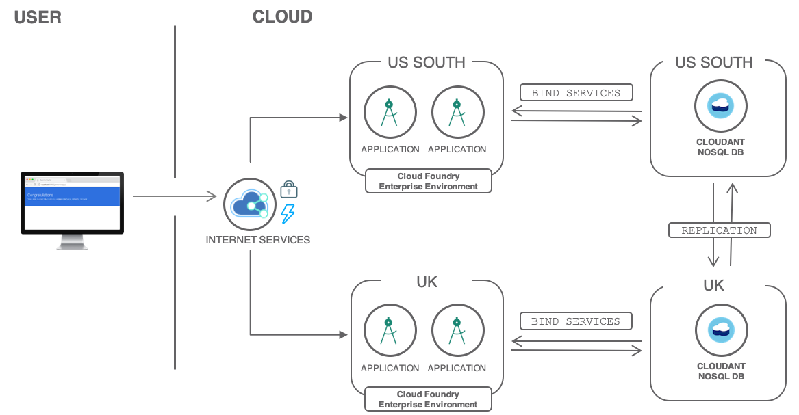

---
copyright:
  years: 2018
lastupdated: "2018-12-018"

---

{:java: #java .ph data-hd-programlang='java'}
{:swift: #swift .ph data-hd-programlang='swift'}
{:ios: #ios data-hd-operatingsystem="ios"}
{:android: #android data-hd-operatingsystem="android"}
{:shortdesc: .shortdesc}
{:new_window: target="_blank"}
{:codeblock: .codeblock}
{:screen: .screen}
{:tip: .tip}
{:pre: .pre}

# Isolated Cloud Foundry Enterprise Apps

With IBM Cloud Foundry Enterprise Environment (CFEE) you can create multiple, isolated, enterprise-grade Cloud Foundry platforms on demand. This provides your developers with a private Cloud Foundry instance deployed on an isolated Kubernetes cluster. Unlike the public Cloud, you'll have full control over the environment: access control, capacity, version, resource usage and monitoring. Cloud Foundry Enterprise Environment provides the speed and innovation of a platform-as-a-service with the infrastructure ownership found in enterprise IT.

This tutorial will walk you through the process of creating and configuring a Cloud Foundry Enterpise Environment, setting up access control, and deploying apps and services. You'll also review the relationship between CFEE and [Kubernetes](https://console.bluemix.net/docs/containers/container_index.html) by deploying a custom service broker that integrates Kubernetes-based services with Cloud Foundry.

## Objectives
{: #objectives}

* Compare and contrast CFEE with public Cloud Foundry
* Deploy apps and services within CFEE
* Understand the relationship between Cloud Foundry and [IBM Kubernetes Service](https://console.bluemix.net/docs/containers/container_index.html)
* Investigate basic Cloud Foundry and Kubernetes networking

## Services used
{: #services}

This tutorial uses the following runtimes and services: 
* [{{site.data.keyword.containerlong_notm}}](https://console.bluemix.net/docs/containers/container_index.html#container_index)
* [{{site.data.keyword.cfee_full_notm}}](https://{DomainName}/cfadmin/create)
* [{{site.data.keyword.cloudant_short_notm}}](https://{DomainName}/catalog/services/cloudant-nosql-db)
* [Cloud Internet Services](https://{DomainName}/catalog/services/internet-services)

This tutorial may incur costs. Use the [Pricing Calculator](https://{DomainName}/pricing/) to generate a cost estimate based on your projected usage.

## Architecture

{: #architecture}

<p style="text-align: center;">


ToDo: update this.

</p>

## Prerequisites

{: #prereq}

- [IBM Cloud CLI](https://console.bluemix.net/docs/cli/reference/bluemix_cli/download_cli.html)
- [Cloud Foundry CLI](https://docs.cloudfoundry.org/cf-cli/install-go-cli.html)
- [Git ](https://git-scm.com/downloads)
- [Node ](https://nodejs.org/en/)

## Cloud Foundry Enterprise Environment (CFEE)

{:cfee}

### Perform initial deploy of CFEE instance

**Step 1: Ensure that the IBM Cloud account can create infrastructure resources**

1. CFEE instances are deployed on infrastructure resources, which are Kubernetes worker nodes from the Kubernetes Service. [Prepare your IBM Cloud account](https://console.bluemix.net/docs/cloud-foundry/prepare-account.html) to ensure that it can create the infrastructure resources necessary for an CFEE instance.

**Step 2: Create your CFEE instance**

Before you create your CFEE, make sure that you are in the IBM Cloud IBM Cloud account where you want to create the environment and that you have the required access policies (per step 1 above).

1. In the Open the IBM Cloud catalog, create a [Cloud Foundry Enterprise Environment service](https://console.bluemix.net/cfadmin/create)
2. Configure the CFEE instance to be created by providing the following:
   - Select a plan.
   - Enter a **Name** for the service instance.
   - Select a **Resource group** under which the environment is grouped. Only those resource groups to which you have access in the current IBM Cloud account will be listed in the *Resourouce groups* dropdown, which means that you need to have permission to access at least one resource group in the account to be able to create an CFEE.
   - Select a **Location** where the service instance is to be provisioned. See the list of [available provisioning locations and data centers](https://console.bluemix.net/docs/cloud-foundry/index.html#provisioning-targets)  by geography for CFEE and supporting services.
   - Select the **Number of cells** for the Cloud Foundry environment.
   - Select the **Machine type**, which determines the size of the Cloud Foundry cells (CPU and memory) .
   - In the **Compose for PostgreSQL** fields, select one of the public organizations, then select one of the spaces available in that organization. The instance of the Compose for PostgreSQL instance will be provisioned in the selected space. The Compose for PostgreSQL service is a required dependency of the CFEE service

Optionally, open the **Infrastructure** section to see the properties of the Kubernetes cluster supporting the CFEE instance. Note that the **Number of worker nodes** equals the number of cells plus 2 (two of the provisioned Kubernetes worker nodes support the CFEE control plane). The Kubernetes cluster on which the environment is deployed appears in the IBM Cloud [dashboard](https://console.bluemix.net/dashboard/apps/). For more information, see [Kubernetes Service documentation](https://console.bluemix.net/docs/containers/cs_why.html#cs_ov).

The automated process that creates the environment deploys the infrastructure into a Kubernetes cluster and configures it to make it ready for use. The process takes 90 - 120 minutes. Once you successfully create the environment you will receive multiple emails confirming the provisioning of the CFEE and supporting services, as well as emails notifying you of the status of the corresponding orders.

### Create organizations and spaces

After you create the IBM Cloud Foundry Enterprise Environment, see [Creating organizations and spaces](https://console.bluemix.net/docs/cloud-foundry/orgs-spaces.html) for information on how to structure the environment by creating organizations and spaces. Apps in an IBM Cloud Foundry Enterprise Environment are scoped within specific spaces. In turn, a space exists within a specific organization. Members of an organization share a quota plan, apps, services instances, and custom domains.

The *Cloud Foundry organizations* page available from the **Manage > Account > Cloud Foundry orgs** menu located in the top IBM Cloud header is intended exclusively for public IBM Cloud organizations, **but not for CFEE organizations**. CFEE organizations are managed within the **organizations** page of an CFEE instance. 

Follow the steps below to create a CFEE org and space.

1. From the [Cloud Foundry dashboard](https://console.bluemix.net/dashboard/cloudfoundry/overview) select `Environments` under the enterprise section. 
2. Select your CFEE instance and then select `organizations`. 
3. Click on the `Create Organizations` button, give your org a name, select a quote plan and then click `Add`.
4. Click on the org created, navigate to spaces and then click on the `Create Space` button. 
5. Give your space a name, this can be the project name or something like that and then click `Add`. 

### Add users to orgs and spaces

In CFEE, you can assign role assignments controlling user level of access but before adding users to CFEE orgs and spaces, the user must be invited to your IBM Cloud org in the *Identity & Access* page under the **Manage > Users** in the IBM® Cloud header.

Once used been invited, then follow the steps below to add the users to your CFEE org and space.

1. Select your CFEE instance and then select `organizations` again.
2. Click on the `Members` tab to view and add new users to your org.
3. Click on the `add member` button and add a new member then click add. 

More on adding users to CFEE orgs and spaces can be found [here](https://console.bluemix.net/docs/cloud-foundry/add-users.html#adding_users).

## Deploy and view CFEE apps

{:deploycfeeapps}

In this section, you will learn the following: 

- Deploy a Node.js starter app.
- Create and bind a Cloudant database to your CFEE instance.
- Enable auditing and logging persistence. 
- Install and use Stratos console to manage the app. 
- Enable SSH in your CFEE instance to SSH into the app. 

### Prepare and run the app locally 

1. Clone the Node.js *hello world* sample app GitHub repo.

   ```bash
   git clone https://github.com/IBM-Cloud/get-started-node
   ```

2. Run the app locally.

   ```
   cd get-started-node
   npm install
   npm start
   ```

### Push the app to CFEE

1. Go to the IBM® Cloud Foundry Enterprise Environment Overview page and locate the environment's API endpoint.

2. In the command line interface, set the API endpoint to your environment's endpoint:

   ```
   cf api <api_endpoint>
   ```

3. Log in to the environment.

   ```
   cf login -u <username> -o <org_name> -s <space_name>
   ```

4. From within the *get-started-node* directory, push your app to IBM Cloud.

   ```
   cf push
   ```

You should see the endpoint of your app in the terminal, open the URL of your app in the browser. The app is running without a database, next let's add a database to the app.

### Create and bind Cloudant database to the app

To use IBM Cloud [services](https://console.bluemix.net/catalog/), you first need to create the service in your IBM Cloud account, then bind the service to your CFEE instance. 

1. Create a [Cloudant](https://console.bluemix.net/catalog/services/cloudant) database service, give your service a name and choose the same region to which CFEE been created on. 
2. Navigate to the CFEE service binding page to bind the Cloudant service created. To get there, navigate to `Organizations -> Select your org -> Applications -> Select your app -> Services tab` and click on the Add service button. 
3. Find and select your Cloudant service and click Add. Now the service been added to your CFEE instance.
4. ToDo: continue here once Cloudant is back working.

### Enable auditing and logging persistence (optional)

The auditing and logging capabilities in IBM® Cloud Foundry Enterprise Environment (CFEE) allow administrators to audit events taking place in a CFEE instance, and developers to track log events generated from their Cloud Foundry applications. Auditing and logging in CFEE are suppoted through integration with the Log Analysis and Activity Tracker IBM Cloud services.

**Auditing**

Auditing allows CFEE administrators to track Cloud Foundry auditable activities taking place in a CFEE instance. Those activities include login, creation of organizations and spaces, user membership and role assignments, application deployments, service bindings, and domain configuration. Auditing is supported through integration with the Activity Tracker service in the IBM Cloud. An instance of the Activity Tracker service selected by the CFEE administrator is configured automatically to receive events representing actions performed within Cloud Foundry and on the CFEE control plane. The user can see and manage those events in the user interface of the Activity Tracker service instance.

To enable auditing for a CFEE instance:

1. Open a CFEE's user interface and to **Operations > Auditing** entry in the left navigation pane to open the Logging page.
2. Click **Enable auditing** and select one of the **Activity Tracker instances** available in the IBM Cloud account. If no instances are available, the user will see an option to create a new Activity Tracker instance in the IBM Cloud atalog.
3. Once auditing is enabled, configuration details are displayed on the page. Details include the status of the configuration, and a link to the Activity Tracker service instance itself, where the user can go to see and manage auditing events.

You can disable Auditing by clicking **Disable auditing**, which will remove the Activity tracker service instance previously added and configured. This action does not delete the Activity Tracker service instance.

**Logging persistence**

Logging of Cloud Foundry events is supported through integration with the Log Analysis service in the IBM Cloud. An instance of the Log Analysis service selected by the CFEE administrator is configured automatically to receive and persist Cloud Foundry logging events generated from the CFEE instance. The user can see and manage those logging events in the user interface of the Log Analysis service instance.

To enable logging for a CFEE instance:

1. Make sure that you have an [IAM access policy](https://console.bluemix.net/iam/#/users) that assigns you editor, operator, or administrator role to the Log Analysis service instance into which you intend to persist the logging events.
2. Open a CFEE's user interface and to **Operations > Logging** entry in the left navigation pane to open the Logging page.
3. Click **Enable persistence** and select one of the **Log Analysis instances** available in the IBM Cloud account. If no instances are available, the user will see an option to create an instance in the IBM Cloud catalog.
4. Once logging persistence is enabled, configuration details are displayed in the page. Details include the status of the configuration, and a link to the Log Analysis service instance itself, where they user can go to see and manage logging events.

**Warning:** Enabling Logging Persistence requires a disruptive restart of the CFEE control plane and cells. During the restart, all administrative functionality will be available, but some applications and services running in this CFEE instance may be unavailable. The status of the CFEE components will be reflected in the Health Check page during the restart. The restart takes approximately 20 minutes.

You can disable Log persistence by clicking **Disable log persistence**, which will remove the service instance previously added and configured. This action will not delete the Log Analysis service instance.

**Note:** When you disable log persistence, the Cloud Foundry logging events are still being generated, they are just not persisted outside the CFEE instance.

### Install the Stratos console to manage the app

The Stratos Console is an open source web-based tool for working with Cloud Foundry. The Stratos Console application can be optionally installed and used in a specific CFEE environment to manage its organizations, spaces, and applications.

Users with IBM Cloud administrator or editor roles in the CFEE instance can install the Stratos Console application in that CFEE instance.

To install the Stratos Console application:

1. Open the CFEE instance where you want to install the Stratos console.
2. Click **Install Stratos Console** on the overview page. The button is visible only to users with administrator or editor permissions to that CFEE instance.
3. In the Install Stratos Console dialog, select an installation option. You can install the Stratos console application either on the CFEE control plane or in one of the cells. Select a version of the Stratos console and the number of instances of the application to install. If you install the Stratos console app in a cell, you're prompted for the organization and space where to deploy the application.
4. Click **Install**.

The application takes about 5 minutes to install. Once installation is complete, a **Stratos Console** button appears in place of the *Install Stratos Console* button on the overview page. The *Stratos Console* button launches the console and is available to all users with access to the CFEE instance. Organization and space membership assignments may limit what a user can see and manage in the Stratos console.

To start the Stratos console:

1. Open the CFEE instance where the Stratos console was installed.
2. Click **Stratos Console** on the overview page.
3. The Stratos console is opened in a separate browser tab. When you open the console for the first time, you're prompted to accept two consecutive warnings because of self-signed certificates.
4. Click **Login** to open the console. No credentials are required since the application uses your IBM Cloud credentials.

### Enable developer environment

ToDo: van 

- add steps to enable SSH...

## The relationship between CFEE and Kubernetes

ToDo: Van working on this...

### Deploy a Kubernetes service broker

### Verify the service broker is deployed

#### View your pods from Kubernetes dashboard 

#### Access the broker from a Cloud Foundry container 

#### Register the service broker with CFEE

## Related content

{:related}

- ToDo