---
copyright:
  years: 2017, 2018

lastupdated: "2018-02-02"

---


{:shortdesc: .shortdesc}
{:new_window: target="_blank"}
{:codeblock: .codeblock}
{:screen: .screen}
{:pre: .pre}


# Analyze logs and monitor the health of Kubernetes applications

This tutorial walks you through creating a cluster and configuring the Log Analysis and the Monitoring service. Then, you will deploy an application to the cluster, use Kibana to view and analyze logs, and use Grafana to view health and metrics.
{:shortdesc}

## Objectives:

* Create a Kubernetes cluster.
* Provision the Log Analysis service.
* Create logging configurations in the cluster.
* Provision the Monitoring service
* Deploy application
* View, search and analyze logs in Kibana
* View metrics in Grafana


## Prerequisites 
{: #prereq}

* [IBM Cloud Developer Tools](https://github.com/IBM-Cloud/ibm-cloud-developer-tools) - Script to install docker, kubectl, helm, bx cli and required plug-ins
* [Container registry with namespace configured](https://console.bluemix.net/docs/services/Registry/registry_setup_cli_namespace.html)
* [Basic understanding of Kubernetes](https://kubernetes.io/docs/tutorials/kubernetes-basics/)

## Create a Kubernetes cluster
{: #step1}

1. Create **Containers in Kubernetes Clusters** from the [{{site.data.keyword.Bluemix}} catalog](https://console.bluemix.net/containers-kubernetes/launch) and choose the **Pay-As-You_Go** cluster. Log forwarding is *not* enabled for the **Free** cluster.
  {:tip}
   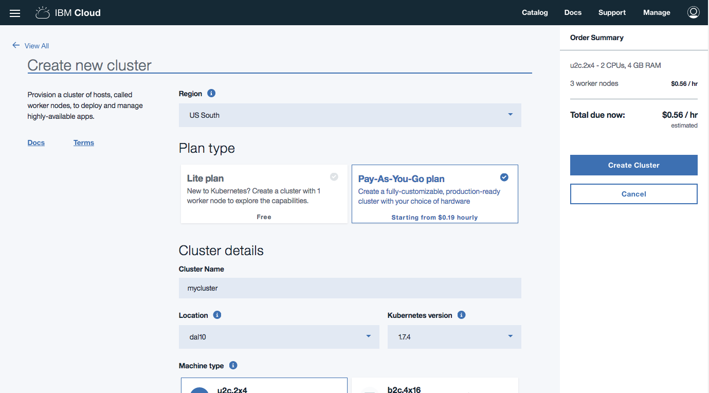
2. For convenience, use the name `mycluster` to be consistent with this tutorial.
3. The smallest **Machine Type** with 1 **Worker Nodes** is sufficient for this tutorial. Leave all other options set to defaults.
4. Check the status of your **Cluster** and **Worker Nodes** and wait for them to be **ready**.

**NOTE:** Do not proceed until your workers are ready. This might take up to one hour.

### Configure kubectl and helm

In this step, you'll configure kubectl to point to your newly created cluster going forward. [kubectl](https://kubernetes.io/docs/user-guide/kubectl-overview/) is a command line tool that you use to interact with a Kubernetes cluster.

1. Update your **bx** plugins by running `bx plugin update`.
2. Use `bx login` to log in interactively. Provide the account under which the cluster is created. You can reconfirm the details by running `bx target` command.
3. When the cluster is ready, retrieve the cluster configuration:
   ```bash
   bx cs cluster-config <cluster-name>
   ```
   {: pre}
4. Copy and paste the **export** command to set the KUBECONFIG environment variable as directed. To verify whether the KUBECONFIG environment variable is set properly or not, run the following command:
  `echo $KUBECONFIG`
5. Check that the `kubectl` command is correctly configured
   ```bash
   kubectl cluster-info
   ```
   {: pre}
6. [Helm](https://helm.sh/) helps you manage Kubernetes applications through Helm Charts, which helps define, install, and upgrade even the most complex Kubernetes application. After your cluster workers are ready, run the command below to initialize Helm in your cluster.
   ```bash
   helm init
   ```
   {: pre}

## Configure your cluster to forward logs to the {{site.data.keyword.loganalysisshort}} service
{: #forwardlogs}

When an application is deployed, logs are collected automatically by the {{site.data.keyword.containershort}}. To forward these logs to the {{site.data.keyword.loganalysisshort}} service, you must create one or more [logging configurations](/docs/services/CloudLogAnalysis/containers/containers_kubernetes.html#log_sources) in your cluster that define:
* Where logs are to be forwarded. You can forward logs to the account domain or to a space domain.
* What logs are forwarded to the {{site.data.keyword.loganalysisshort}} service for analysis.

### Configure your cluster to forward logs
{: #containerlogs}

1. From the IBM Cloud Dashboard, select the **region**, **org** and **space** where you want to create your **Log Analysis** service.
2. From the [Catalog](https://console.bluemix.net/catalog/), select and create a [**Log Analysis**](https://console.bluemix.net/catalog/services/log-analysis) service. If you're unable to create the service, check for an existing instance of the Log Analysis service in your space.
3. Ensure that the API key owner for your cluster `bx cs api-key-info mycluster` has `Developer` and `Manager` Cloud Foundry access to the org and space where the Log Analysis service is created. [Grant user permissions](/docs/services/CloudLogAnalysis/security/grant_permissions.html#grant_permissions_ui_space).
4. Run the following command to send *container* log files to the {{site.data.keyword.loganalysisshort}} service:
    ```sh
    bx cs logging-config-create mycluster --logsource container --namespace default --type ibm --hostname IngestionHost --port 9091 --org OrgName --space SpaceName
    ```
    {: codeblock}
    where
    * *mycluster* is the name of your cluster.
    * *IngestionHost* is the hostname to the logging service in the region where the {{site.data.keyword.loganalysisshort}} service is provisioned. For a list of endpoints, see [Endpoints](/docs/services/CloudLogAnalysis/log_ingestion.html#log_ingestion_urls).
    * *OrgName* and *SpaceName* is the location where the {{site.data.keyword.loganalysisshort}} service is provisioned.

## Create the Monitoring service

1. From the IBM Cloud Dashboard, select the **region**, **org** and **space** where you want to create your **Monitoring** service.
2. From the [Catalog](https://console.bluemix.net/catalog/), select and create a [**Monitoring**](https://console.bluemix.net/catalog/services/monitoring?taxonomyNavigation=apps) service. If you're unable to create the service, check for an existing instance of the Monitoring service in your space.

## Create a starter application
{: #create_application}
The `bx dev` tooling greatly cuts down on development time by generating application starters with all the necessary boilerplate, build and configuration code so that you can start coding business logic faster.

1. Start the `bx dev` wizard.
   ```
   bx dev create
   ```
   {: pre}

2. Select `Backend Service / Web App` > `Node `> `Web App - Express.js Basic` to create a Node.js starter application.
3. Enter a **name** (`mynodestarter`) and a unique **hostname** (`username-mynodestarter`) for your project.
  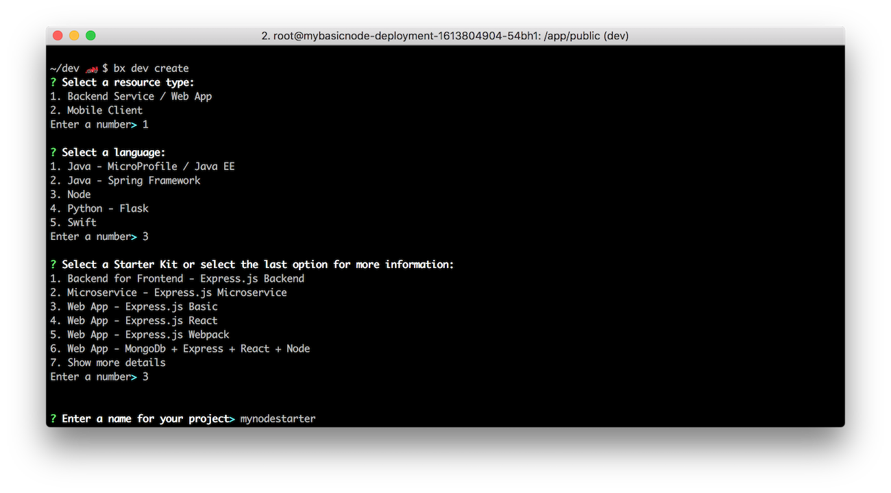

4. Choose **No DevOps** and Select **n** to skip adding services.

  Once complete, this generates a starter application complete with the code and all the necessary configuration files for local development and deployment to cloud on Cloud Foundry or Kubernetes. For an overview of the files generated, see [Project Contents Documentation](https://console.bluemix.net/docs/cloudnative/node_project_contents.html).

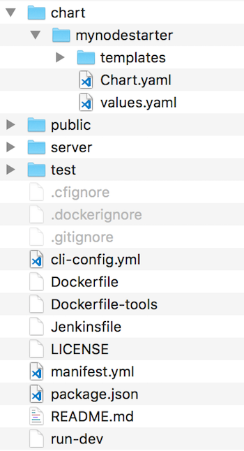

### Build the application

You can build and run the application as you normally would using `mvn` for java local development or `npm` for node development.  You can also build a docker image and run the application in a container to ensure consistent execution locally and on the cloud. Use the following steps to build your docker image.

1. Ensure your local Docker engine is started.
   ```
   docker ps
   ```
   {: pre}
2. Change to the generated project directory.
   ```
   cd <project name>
   ```
   {: pre}
3. Edit the file `server/server.js` and add the following code to the bottom of the file. This will output various random types of log message every second.

   ```
   setInterval(() => {
     var randomInt = Math.floor(Math.random() * 10);
     if (randomInt < 5)
       logger.info('Cheese is Gouda.');
     else if (randomInt >= 5 && randomInt < 8)
       logger.warn('Cheese is quite smelly.');
     else if (randomInt == 8)
       logger.fatal('Cheese was breeding ground for listeria.');
     else
       logger.error('Cheese is too ripe!');
   }, 1000)
   ```
4. Build the application.
   ```
   bx dev build
   ```
   {: pre}

   This might take a few minutes to run as all the application dependencies are downloaded and a Docker image, which contains your application and all the required environment, is built.

### Run the application locally

1. Run the container.
   ```
   bx dev run
   ```
   {: pre}

   This uses your local Docker engine to run the docker image that you built in the previous step.
2. After your container starts, go to http://localhost:3000/
  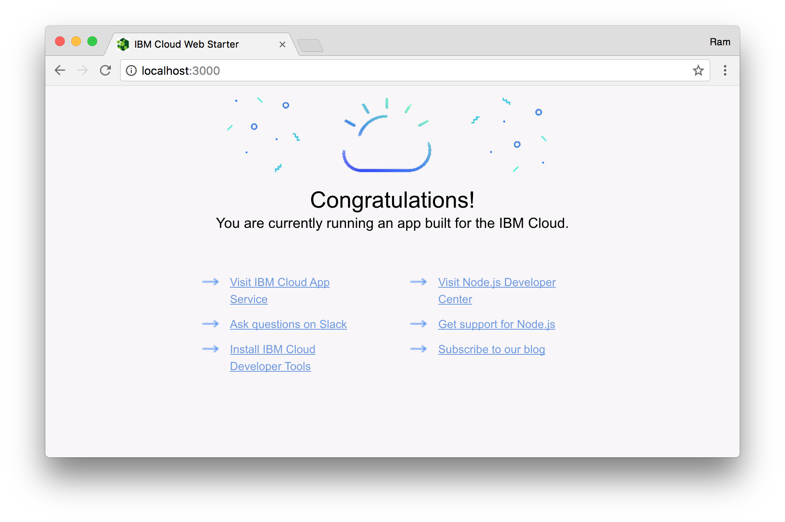

## Deploy application to cluster
{: #deploy}

The IBM Cloud has a Container Registry that is private to you. Let's push the Docker image there, and then create a Kubernetes deployment pointing to that image.

1. Find your **namespace** by listing all the namespace in the registry.
   ```
   bx cr namespaces
   ```
   {: pre}
   If you have a namespace, make note of the name for use later. If you don't have one, create it.
   ```
   bx cr namespace-add <name>
   ```
   {: pre}
2. Find the **Container Registry** information by running.
   ```
   bx cr info
   ```
   {: pre}
3. Deploy to your Kubernetes cluster:
   ```
   bx dev deploy -t container
   ```
   {: pre}
4. When prompted, enter your **cluster name**.
5. Next, enter your **image name**. Use the following format: `<registry_url>/<namespace>/<projectname>`
6. Wait a few minutes for your application to be deployed.
7. Visit the URL displayed to access the application by `http://worker-public-ip:portnumber/`. If you do not see a port number, run `kubectl get services` and look for the 5 digit port number next to your application service.
  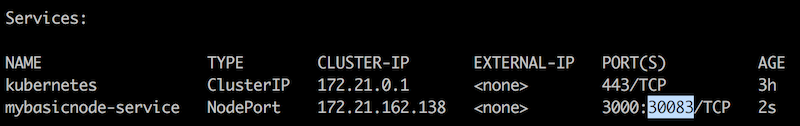
  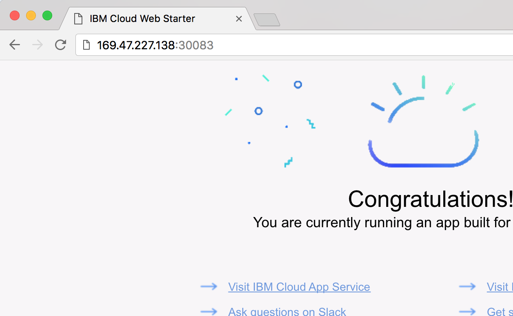

To set up Ingress and use your own custom domain see the [Use your own custom domain](/docs/tutorials/scalable-webapp-kubernetes.html#custom_domain) section of the [Deploy a scalable web application on Kubernetes](/docs/tutorials/scalable-webapp-kubernetes.html) tutorial.


## View log data in Kibana
{: #step8}

The application generates some log data every time you visit its URL. Because of our logging configuration, this data should be forwarded to Log Analysis service and available via Kibana.

1. Open a web browser and launch Kibana using the URL in the table below.
  <table>
  <caption>Table 1. URLs to launch Kibana per region</caption>
  <tr>
  <th>Region</th>
  <th>URL</th>
  </tr>
  <tr>
  <td>Germany</td>
  <td>[https://logging.eu-fra.bluemix.net](https://logging.eu-fra.bluemix.net) </td>
  </tr>
  <tr>
  <td>United Kingdom</td>
  <td>[https://logmet.eu-gb.bluemix.net](https://logmet.eu-gb.bluemix.net)</td>
  </tr>
  <tr>
  <td>US South</td>
  <td>[https://logging.ng.bluemix.net](https://logging.ng.bluemix.net) </td>
  </tr>
  </table>
2. Click on your username in the upper right corner to select the correct **account**, **org** and **space**.

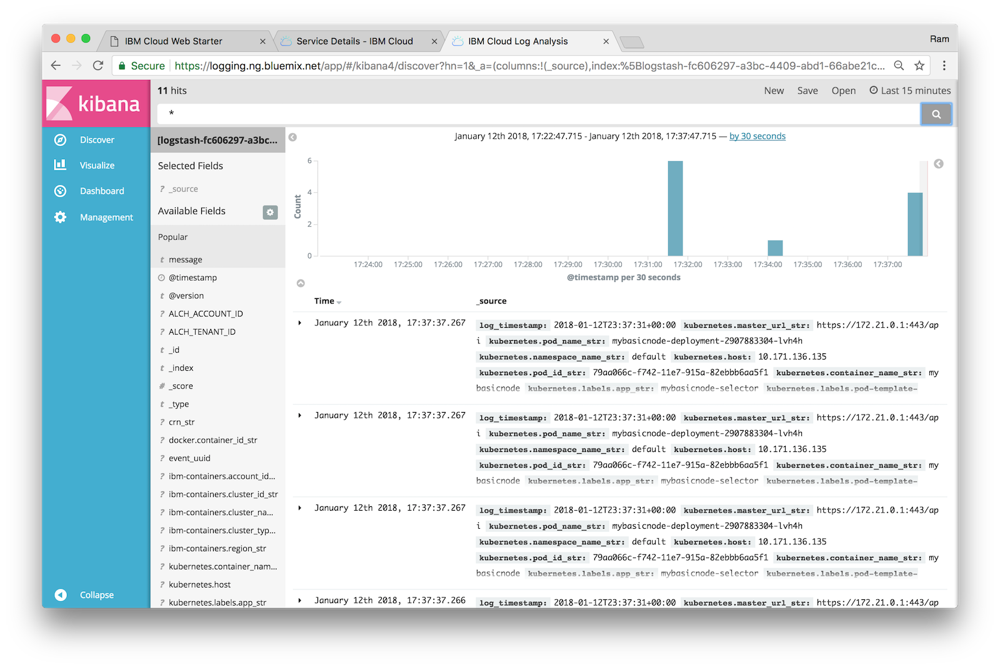
For more information about other search fields that are relevant to Kubernetes clusters, see [Searching logs](/docs/services/CloudLogAnalysis/containers/containers_kubernetes.html#log_search).

### Filter data by Kubernetes cluster name in Kibana
{: #step8}

1. In the filtering menu on the left, you can filter down to only see message from the container you are interested in by expanding `kubernetes.container_name_str` and clicking on the container name.
2. Click on the **add** button next to **message** to only see the log messages.
   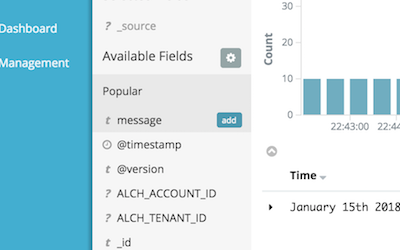
3. Adjust the displayed interval by navigating to the upper right and clicking on **Last 15 minutes**. Adjust the value to **Last 24 hours**.
4. Next to the configuration of the interval is the auto-refresh setting. By default it is switched off, but you can change it.  
5. Below the configuration is the search field. Here you can [enter and define search queries](https://console.bluemix.net/docs/services/CloudLogAnalysis/kibana/define_search.html#define_search). To filter for all logs reported as app errors and containing one of the defined log levels, enter the following:   
```
message:(WARN|INFO|ERROR|FATAL)
```
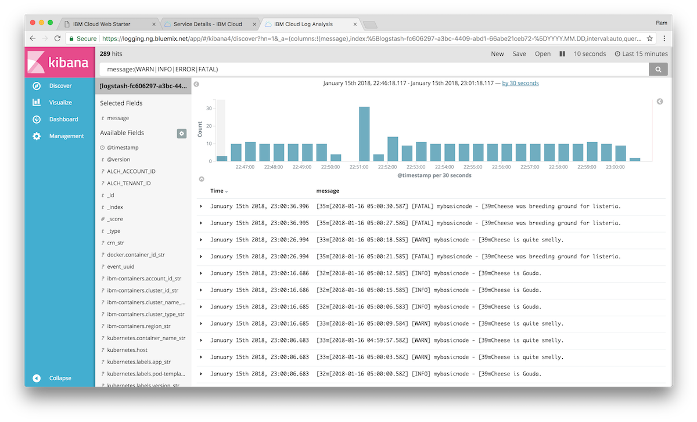   
6. Store the search criteria for future use by clicking **Save** in the configuration bar. Use **mylogs** as name.

For more information, see [Filtering logs in Kibana](/docs/services/CloudLogAnalysis/kibana/filter_logs.html#filter_logs).
## Visualize Logs
Now that you have a query defined, in this section you will use it as foundation for a chart, a visualization of that data. You will first create visualizations and then use them to compose a dashboard.

### Pie Chart as Donut

1. Click on **Visualize** in the left navigation bar.
2. In the list of offered visualizations Locate **Pie chart** and click on it.
3. Select the query **mylogs** that you saved earlier.
4. On the next screen, under **Select buckets type**, select **Split Slices**, then for **Aggregation** choose **Filters**. Add 4 filters having the values of **INFO**, **WARN**, **ERROR**, and **FATAL** as shown here:   
  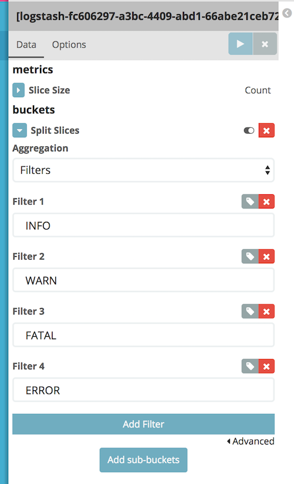   
5. Click on **Options** (right to **Data**) and activate **Donut** as view option. Finally, click on the **play** icon to apply all changes to the chart. Now you should see a **Donut Pie Chart** similar to this one:   
  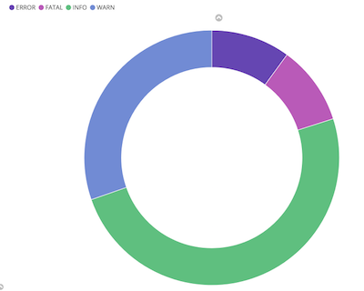   
6. Adjust the displayed interval by navigating to the upper right and clicking on **Last 15 minutes**. Adjust the value to **Last 24 hours**.
7. Save the visualization as **DonutLogs**.

### Metric

Next, create another visualization for **Metric**.
1. Click on **New** and pick **Metric** from the list of offered visualizations and click on the link beginning with **[logstash-]**.
2. On the next screen, expand **Metric** to be able to enter a custom label. Add **Log Entries within 24 hours** and click on the **play** icon to update the shown metric.   
     
3. Save the visualization as **LogCount24**.

#### Dashboard
Once you have added visualizations, they can be used to compose a dashboard. A dashboard is used to display all important metrics and to help indicate the health of your apps and services.
1. Click on **Dashboard** in the left navigation panel, then on **Add** to start placing existing visualizations onto the empty dashboard.
2. Add the log count on the left and the donut chart on the right. Change the size of each component and to move them as desired.
3. Click on the arrow in the lower left corner of a component to view changes to a table layout and additional information about the underlying request, response and execution statistics are offered.
     
4. Save the dashboard for future use.

## Monitor cluster health using Grafana
Metrics from the Kubernetes cluster are automatically forwarded to the Monitoring service and are made available to you with Grafana. Grafana is an open source software for time series analytics.

1. Using the IBM Cloud [Dashboard](https://console.bluemix.net/dashboard/apps) find and select your **Monitoring** instance.
2. Click **Launch** to open up Grafana.
3. In the top right corner, click on your username and choose **Domain**: **account** and select your **Account**.
4. Click on **Home** and select the **ClusterMonitoringDashboard_workers** dashboard that has been pre-defined.
5. Enter the region value (`bx cs regions` to see all regions) where your cluster was created next to **Region** and then enter your cluster name next to **Cluster**.
   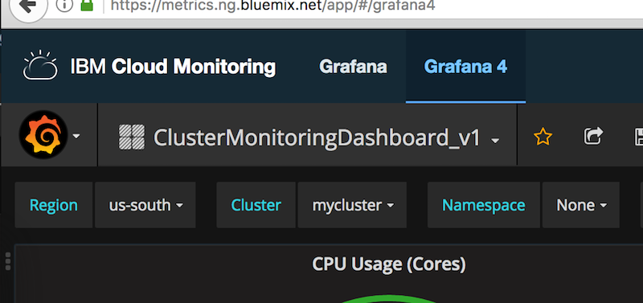
6. In a different window, visit your application URL and refresh the page several times to generate some load.
7. Refresh your Grafana dashboard to see the updated metrics.
   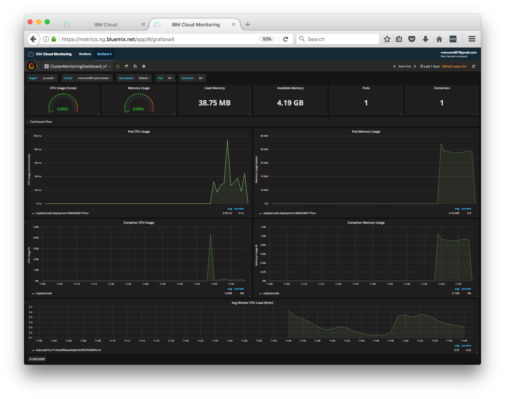

## Expand the Tutorial
Do you want to learn more? Here are some ideas of what you can do next:
* Deploy another application to the cluster or use an [app deployed in a Cloud Foundry environment](application-log-analysis.html). The Log Analysis dashboard (Kibana) will show the combined logs of all apps.
* Filter by a single app.
* Add a saved search and metric only for specific error level.
* Build a dashboard for all your apps.


## Related Content
* [Documentation for IBM Cloud Log Analysis](https://console.bluemix.net/docs/services/CloudLogAnalysis/index.html)
* [IBM Cloud Log Collection API](https://console.bluemix.net/apidocs/948-ibm-cloud-log-collection-api?&language=node#introduction)
* Kibana User Guide: [Discovering Your Data](https://www.elastic.co/guide/en/kibana/5.1/tutorial-discovering.html)
* Kibana User Guide: [Visualizing Your Data](https://www.elastic.co/guide/en/kibana/5.1/tutorial-visualizing.html)
* Kibana User Guide: [Putting it all Together with Dashboards](https://www.elastic.co/guide/en/kibana/5.1/tutorial-dashboard.html)
