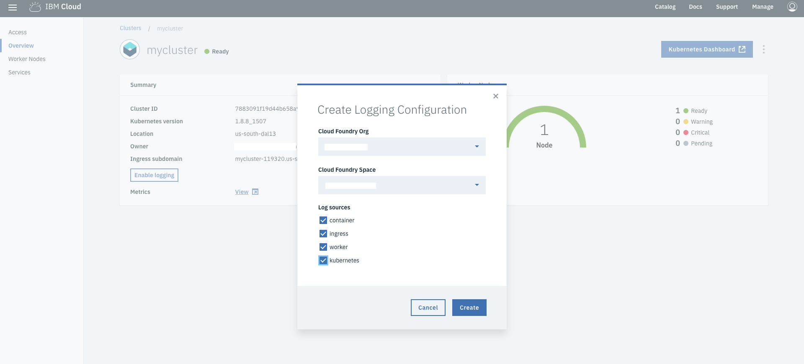
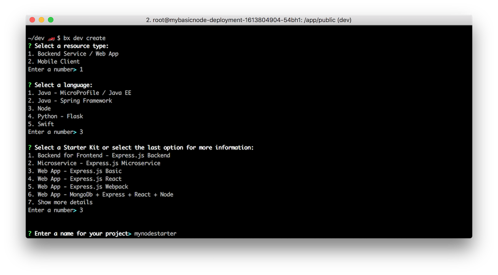

---
copyright:
  years: 2017, 2019
lastupdated: "2019-03-07"
---

{:shortdesc: .shortdesc}
{:new_window: target="_blank"}
{:codeblock: .codeblock}
{:screen: .screen}
{:tip: .tip}
{:pre: .pre}


# Analyze logs and monitor the health of Kubernetes applications
{: #kubernetes-log-analysis-kibana}

This tutorial walks you through creating a Kubernetes cluster and configuring the Log Analysis and the Monitoring service. Then, you will deploy an application to the cluster, use Kibana to view and analyze logs, and use Grafana to view health and metrics.

For developers looking to kickstart their projects, the {{site.data.keyword.dev_cli_notm}} CLI enables rapid application development and deployment by generating template applications that you can run immediately or customize as the starter for your solutions. In addition to generating starter application code, Docker container image, and CloudFoundry assets, the code generators used by the dev CLI and web console generate files to aid deployment into Kubernetes environments. The templates generate Helm charts that describe the application’s initial Kubernetes deployment configuration and are easily extended to create multi-image or complex deployments as needed.

Additionally, setting up logging and monitoring in {{site.data.keyword.containershort_notm}} will help you in troubleshooting issues and improve the health and performance of your Kubernetes clusters and apps.

{:shortdesc}

## Objectives

{: #objectives}

* Create a Kubernetes cluster.
* Provision the Log Analysis service.
* Create logging configurations in the cluster.
* Deploy application.
* View, search and analyze logs in Kibana.
* View metrics in Grafana.

## Services used

{: #services}

This tutorial uses the following {{site.data.keyword.Bluemix_notm}} services:

- [{{site.data.keyword.registrylong_notm}}](https://{DomainName}/containers-kubernetes/launchRegistryView)
- [{{site.data.keyword.containershort_notm}}](https://{DomainName}/containers-kubernetes/catalog/cluster)
- [{{site.data.keyword.loganalysislong_notm}}](https://{DomainName}/catalog/services/log-analysis)
- [{{site.data.keyword.monitoringshort_notm}}](https://{DomainName}/catalog/services/monitoring)

**Attention:** This tutorial might incur costs. Use the [Pricing Calculator](https://{DomainName}/pricing/) to generate a cost estimate based on your projected usage.

## Architecture

{: #architecture}


1. Use scaffold application, build and run locally inside a Docker container image.
2. Push the local Docker container image to a private Git repository in the cloud.
3. Push container image to a Kubernetes cluster.
4. Create logging and monitoring configuration.
5. View log analysis and monitoring dashboard in the browser.

## Prerequisites

{: #prereq}

* [Install {{site.data.keyword.dev_cli_notm}}](https://{DomainName}/docs/cli?topic=cloud-cli-ibmcloud-cli#ibmcloud-cli) - Script to install docker, kubectl, helm, ibmcloud cli and required plug-ins.
* [Set up the {{site.data.keyword.registrylong_notm}} CLI and your registry namespace](https://{DomainName}/docs/services/Registry?topic=registry-registry_setup_cli_namespace#registry_setup_cli_namespace).
* [Understand the basics of Kubernetes](https://kubernetes.io/docs/tutorials/kubernetes-basics/)

## Create a Kubernetes cluster
{: #create_cluster}

1. Create **Containers in Kubernetes Clusters** from the [{{site.data.keyword.Bluemix}} catalog](https://{DomainName}/containers-kubernetes/catalog/cluster/create) and choose the **Standard** cluster.

   Log forwarding is *not* enabled for the **Free** cluster.
   {:tip}

   
2. For convenience, use the name `mycluster` to be consistent with this tutorial.
3. The smallest **Machine type** with 2 **CPUs** and 4 **GB RAM** is sufficient for this tutorial. Select 1 **Worker node** and leave all other options set to defaults. Click **Create Cluster**.
4. Check the status of your **Cluster** and **Worker Node** and wait for them to be **ready**.

**NOTE:** Do not proceed until your workers are ready.

### Configure kubectl

In this step, you'll configure kubectl to point to your newly created cluster going forward. [kubectl](https://kubernetes.io/docs/user-guide/kubectl-overview/) is a command line tool that you use to interact with a Kubernetes cluster.

1. Update your **ibmcloud** plugins by running `ibmcloud plugin update`.
2. Use `ibmcloud login` to log in interactively. Provide the account under which the cluster is created. You can reconfirm the details by running `ibmcloud target` command.
3. When the cluster is ready, retrieve the cluster configuration:
   ```bash
   ibmcloud cs cluster-config <cluster-name>
   ```
   {: pre}
4. Copy and paste the **export** command to set the KUBECONFIG environment variable as directed. To verify whether the KUBECONFIG environment variable is set properly or not, run the following command:
  `echo $KUBECONFIG`
5. Check that the `kubectl` command is correctly configured
   ```bash
   kubectl cluster-info
   ```
   {: pre}

## Configure your cluster to forward logs to the {{site.data.keyword.loganalysisshort}} service
{: #forwardlogs}

When an application is deployed to a container in a **standard** cluster, logs are collected automatically by the {{site.data.keyword.containershort}}. To forward these logs to the {{site.data.keyword.loganalysisshort}} service, you must enable in your cluster that define:

  - Where logs are to be forwarded. You can forward logs to the account domain or to a space domain.
  - What logs are forwarded to the {{site.data.keyword.loganalysisshort}} service for analysis.

1. To **enable logging**, navigate to [clusters](https://{DomainName}/containers-kubernetes/clusters) and select the appropriate **location** to see the cluster you created above - `mycluster`. Select the cluster.
2. Under **Summary**, click **Enable logging.**
3. On **Create Logging Configuration** window, select the appropriate Cloud Foundry **Org** and **Space.**

 To enable logging at the account level, you must use CLI. Refer **Enabling log forwarding** section of [logging and monitoring](https://{DomainName}/docs/containers?topic=containers-health#logging)
 {:tip}

4. Enable all the **Log sources** and click **Create**.

   

If you specified a space when you created the cluster then both the account owner and {{site.data.keyword.containershort}} key owner need `Manager`, `Developer`, or `Auditor` permissions in that space, refer **before you begin** section of [logging and monitoring](https://{DomainName}/docs/containers?topic=containers-health#logging)
{:tip}

## Create a starter application
{: #create_application}
The `ibmcloud dev` tooling greatly cuts down on development time by generating application starters with all the necessary boilerplate, build and configuration code so that you can start coding business logic faster.

1. Start the `ibmcloud dev` wizard.
   ```
   ibmcloud dev create
   ```
   {: pre}

2. Select `Backend Service / Web App` > `Node `> `Web App - Basic Web` to create a Node.js starter application.
3. Enter a **name** (`mynodestarter`) and a unique **hostname** (`username-mynodestarter`) for your project.
  

4. Choose **No DevOps** and Select **n** to skip adding services.

  Once complete, this generates a starter application complete with the code and all the necessary configuration files for local development and deployment to cloud on Cloud Foundry or Kubernetes. 
  
  <!-- For an overview of the files generated, see [Project Contents Documentation](https://{DomainName}/docs/cloudnative/node_project_contents.html). -->

  

### Build the application

You can build and run the application as you normally would using `mvn` for java local development or `npm` for node development.  You can also build a docker image and run the application in a container to ensure consistent execution locally and on the cloud. Use the following steps to build your docker image.

1. Ensure your local Docker engine is started.
   ```
   docker ps
   ```
   {: pre}
2. Change to the generated project directory.
   ```
   cd <project name>
   ```
   {: pre}
3. Edit the file `server/server.js` and add the following code to the bottom of the file. This will output various random types of log message every second.

   ```
   setInterval(() => {
     var randomInt = Math.floor(Math.random() * 10);
     if (randomInt < 5)
       logger.info('Cheese is Gouda.');
     else if (randomInt >= 5 && randomInt < 8)
       logger.warn('Cheese is quite smelly.');
     else if (randomInt == 8)
       logger.fatal('Cheese was breeding ground for listeria.');
     else
       logger.error('Cheese is too ripe!');
   }, 1000)
   ```
4. Build the application.
   ```
   ibmcloud dev build
   ```
   {: pre}

   This might take a few minutes to run as all the application dependencies are downloaded and a Docker image, which contains your application and all the required environment, is built.

### Run the application locally

1. Run the container.
   ```
   ibmcloud dev run
   ```
   {: pre}

   This uses your local Docker engine to run the docker image that you built in the previous step.
2. After your container starts, go to http://localhost:3000/
  

## Deploy application to cluster using a helm chart
{: #deploy}

In this section, you first push the Docker image to the IBM Cloud private container registry, and then create a Kubernetes deployment pointing to that image.

1. Find your **namespace** by listing all the namespace in the registry.
   ```sh
   ibmcloud cr namespaces
   ```
   {: pre}
   If you have a namespace, make note of the name for use later. If you don't have one, create it.
   ```sh
   ibmcloud cr namespace-add <Name>
   ```
   {: pre}
2. Set MYNAMESPACE and MYPROJECT environment variables to your namespace and project name respectively

    ```sh
    export MYNAMESPACE=<NAMESPACE>
    ```
    {: pre}
    ```sh
    export MYPROJECT=<PROJECTNAME>
    ```
    {: pre}
3. Identify your **Container Registry** (e.g. us.icr.io) by running `ibmcloud cr info`
4. Set MYREGISTRY env var to your registry.
   ```sh
   export MYREGISTRY=<REGISTRY>
   ```
   {: pre}
5. Build and tag (`-t`)the docker image

   ```sh
   docker build . -t ${MYREGISTRY}/${MYNAMESPACE}/${MYPROJECT}:v1.0.0
   ```
   {: pre}
6. Push the docker image to your container registry on IBM Cloud
   ```sh
   docker push ${MYREGISTRY}/${MYNAMESPACE}/${MYPROJECT}:v1.0.0
   ```
   {: pre}
7. On an IDE, navigate to **values.yaml** under `chart\YOUR PROJECT NAME` and update the **image repository** value pointing to your image on IBM Cloud container registry. **Save** the file.

   For image repository details, run `echo ${MYREGISTRY}/${MYNAMESPACE}/${MYPROJECT}`

8. [Helm](https://helm.sh/) helps you manage Kubernetes applications through Helm Charts, which helps define, install, and upgrade even the most complex Kubernetes application. Initialize Helm by navigating to `chart\YOUR PROJECT NAME` and running the below command in your cluster

   ```bash
   helm init
   ```
   {: pre}
   To upgrade helm, run this command `helm init --upgrade`
   {:tip}

9. To install a Helm chart, run the below command
  ```sh
  helm install . --name ${MYPROJECT}
  ```
  {: pre}
10. You should see `==> v1/Service`. Remember the Nodeport which is a 5-digit number(e.g., 31569) under `PORT(S)` next to your application. This is your portnumber.
11. For the public IP of worker node, run the below command
   ```sh
   ibmcloud cs workers <CLUSTER NAME>
   ```
   {: pre}
12. Access the application `http://worker-ip-address:portnumber`
  

To set up Ingress and use your own custom domain see the [Use your own custom domain](#custom_domain) section of the [Deploy a scalable web application on Kubernetes](https://{DomainName}/docs/tutorials?topic=solution-tutorials-scalable-webapp-kubernetes#scalable-webapp-kubernetes) tutorial.


## View log data in Kibana
{: #view_in_kibana}

The application generates some log data every time you visit its URL. Because of our logging configuration, this data should be forwarded to {{site.data.keyword.loganalysisshort}} service and available via Kibana.

1. To view **log data**, navigate to [clusters](https://{DomainName}/containers-kubernetes/clusters) and select the appropriate **location** to see the cluster you created above - `mycluster`. Select the cluster.
2. Next to **Logs**, click **View**. This should launch Kibana in a new tab.
3. Click on your username in the upper right corner to select the correct **account**, **org** and **space**.


For more information about other search fields that are relevant to Kubernetes clusters, see [Searching logs](https://{DomainName}/docs/services/CloudLogAnalysis/containers?topic=cloudloganalysis-containers_kubernetes#log_search).

### Filter data by Kubernetes cluster name in Kibana
{: #filter_in_kibana}

1. In the filtering menu on the left, you can filter down to only see message from the container you are interested in by expanding `kubernetes.container_name_str` and clicking on the container name.

2. Click on the **add** button next to **message** to only see the log messages.
   

3. Adjust the displayed interval by navigating to the upper right and clicking on **Last 15 minutes**. Adjust the value to **Last 24 hours**.

4. Next to the configuration of the interval is the auto-refresh setting. By default it is switched off, but you can change it.

5. Below the configuration is the search field. Here you can [enter and define search queries](https://{DomainName}/docs/services/CloudLogAnalysis/kibana?topic=cloudloganalysis-define_search#define_search). To filter for all logs reported as app errors and containing one of the defined log levels, enter the following:

   ```sh
   message:(WARN|INFO|ERROR|FATAL)
   ```

6. Store the search criteria for future use by clicking **Save** in the configuration bar. Use **mylogs** as name.

For more information, see [Filtering logs in Kibana](https://{DomainName}/docs/services/CloudLogAnalysis/kibana?topic=cloudloganalysis-filter_logs#filter_logs).
## Visualize Logs

{: #visualizelogs}

Now that you have a query defined, in this section you will use it as foundation for a chart, a visualization of that data. You will first create visualizations and then use them to compose a dashboard.

### Pie Chart as Donut

1. Click on **Visualize** in the left navigation bar.
2. In the list of offered visualizations Locate **Pie chart** and click on it.
3. Select the query **mylogs** that you saved earlier.
4. On the next screen, under **Select buckets type**, select **Split Slices**, then for **Aggregation** choose **Filters**. Add 4 filters having the values of **INFO**, **WARN**, **ERROR**, and **FATAL** as shown here:
  
5. Click on **Options** (right to **Data**) and activate **Donut** as view option. Finally, click on the **play** icon to apply all changes to the chart. Now you should see a **Donut Pie Chart** similar to this one:
  
6. Adjust the displayed interval by navigating to the upper right and clicking on **Last 15 minutes**. Adjust the value to **Last 24 hours**.
7. Save the visualization as **DonutLogs**.

### Metric

Next, create another visualization for **Metric**.
1. Click on **New** and pick **Metric** from the list of offered visualizations and click on the link beginning with **[logstash-]**.
2. On the next screen, expand **Metric** to be able to enter a custom label. Add **Log Entries within 24 hours** and click on the **play** icon to update the shown metric.
  
3. Save the visualization as **LogCount24**.

#### Dashboard
Once you have added visualizations, they can be used to compose a dashboard. A dashboard is used to display all important metrics and to help indicate the health of your apps and services.
1. Click on **Dashboard** in the left navigation panel, then on **Add** to start placing existing visualizations onto the empty dashboard.
2. Add the log count on the left and the donut chart on the right. Change the size of each component and to move them as desired.
3. Click on the arrow in the lower left corner of a component to view changes to a table layout and additional information about the underlying request, response and execution statistics are offered.
  
4. Save the dashboard for future use.

## Monitor cluster health using Grafana
Metrics for standard clusters are located in the {{site.data.keyword.Bluemix_notm}} account that was logged in to when the Kubernetes cluster was created. If you specified an {{site.data.keyword.Bluemix_notm}} space when you created the cluster, then metrics are located in that space. Container metrics are collected automatically for all containers that are deployed in a cluster. These metrics are sent and are made available through Grafana.

1. To view **metrics**, navigate to [clusters](https://{DomainName}/containers-kubernetes/clusters) and select the appropriate **location** to see the cluster you created above - `mycluster`. Select the cluster.
2. Next to **Metrics**, click **View**. This should launch Grafana in a new tab.
3. In the top right corner, click on your username and choose **Domain**: **account** and select your **Account**.
4. Click on **Home** and select the **ClusterMonitoringDashboard_V1** dashboard that has been pre-defined.
5. Enter the region value (`ibmcloud cs regions` to see all regions) where your cluster was created next to **Region** and then enter your cluster name next to **Cluster**.
   
6. In a different window, visit your application URL and refresh the page several times to generate some load.
7. Refresh your Grafana dashboard to see the updated metrics.
   

## Remove resources

{: #removeresources}

In this step, you will clean up the resources to remove what you created above.

- Delete the {{site.data.keyword.loganalysislong_notm}} service.
- Delete the {{site.data.keyword.monitoringshort_notm}} service.
- Delete the cluster.
- Delete the registry container image.

## Expand the Tutorial

{: #expandTutorial}

Do you want to learn more? Here are some ideas of what you can do next:
* Deploy another application to the cluster or use an [app deployed in a Cloud Foundry environment](https://{DomainName}/docs/tutorials?topic=solution-tutorials-application-log-analysis#deploy-a-cloud-foundry-app). The Log Analysis dashboard (Kibana) will show the combined logs of all apps.
* Filter by a single app.
* Add a saved search and metric only for specific error level.
* Build a dashboard for all your apps.

## Related Content

{: #related}

* [Logging and Monitoring](https://{DomainName}/docs/containers?topic=containers-health#view_metrics).
* [Documentation for IBM Cloud Log Analysis](https://{DomainName}/docs/services/CloudLogAnalysis?topic=cloudloganalysis-getting-started-with-cla#getting-started-with-cla).
* [IBM Cloud Log Collection API](https://{DomainName}/apidocs/948-ibm-cloud-log-collection-api?&language=node#introduction).
* Kibana User Guide: [Discovering Your Data](https://www.elastic.co/guide/en/kibana/5.1/tutorial-discovering.html).
* Kibana User Guide: [Visualizing Your Data](https://www.elastic.co/guide/en/kibana/5.1/tutorial-visualizing.html).
* Kibana User Guide: [Putting it all Together with Dashboards](https://www.elastic.co/guide/en/kibana/5.1/tutorial-dashboard.html).
