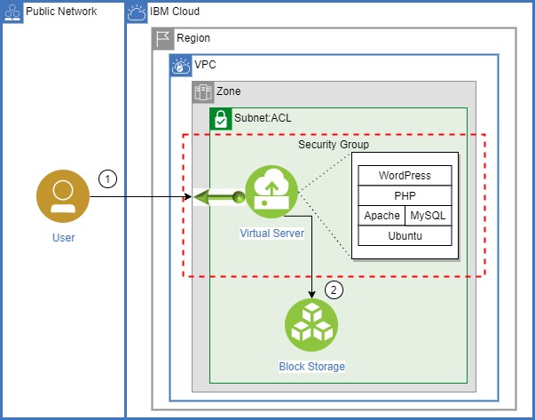
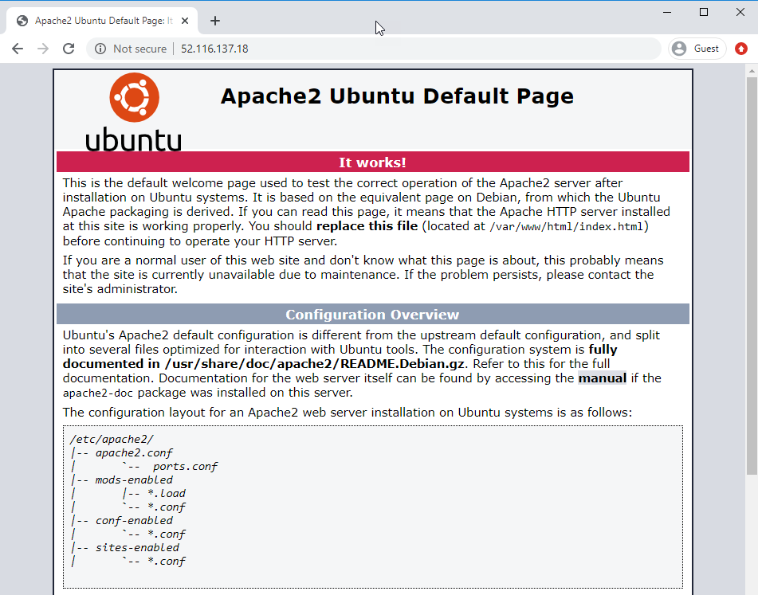
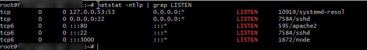
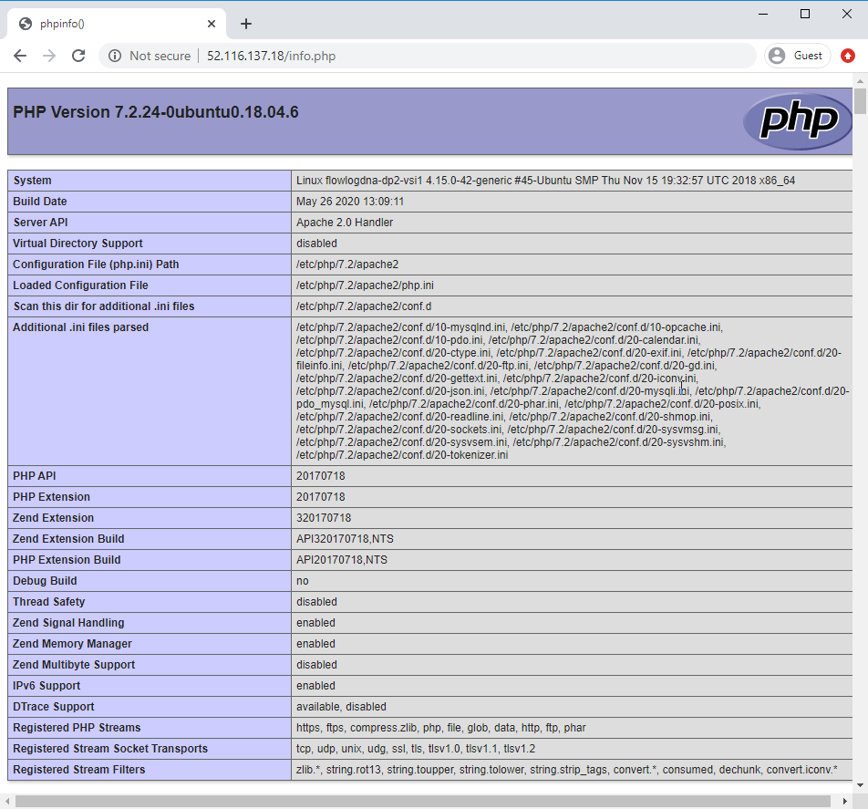
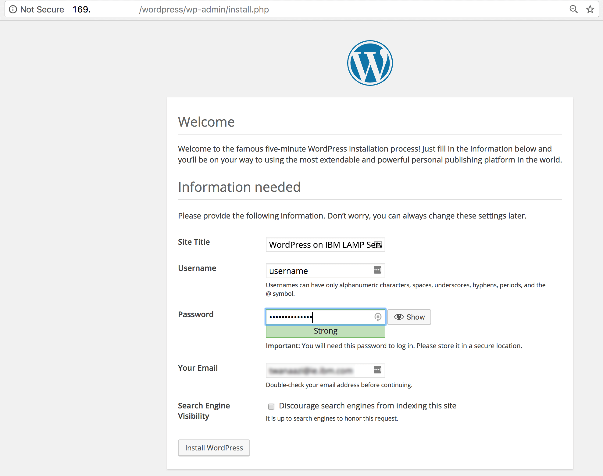

{:shortdesc: .shortdesc}
{:new_window: target="_blank"}
{:codeblock: .codeblock}
{:screen: .screen}
{:tip: .tip}
{:pre: .pre}

# PHP web application on a LAMP Stack in VPC
{: #lamp-stack-on-vpc}

This tutorial walks you through the creation of an Ubuntu **L**inux virtual server with **A**pache web server, **M**ySQL database and **P**HP scripting on {{site.data.keyword.Bluemix_notm}} [Virtual Private Cloud (VPC) Infrastructure](https://www.ibm.com/cloud/learn/vpc). This combination of software - more commonly called a LAMP stack - is very popular and often used to deliver websites and web applications. Using {{site.data.keyword.vpc_short}} you will quickly deploy your LAMP stack and if desired add logging and monitoring. To experience the LAMP server in action, you will also install and configure the free and open source [WordPress](https://wordpress.org/) content management system.

## Objectives

* Provision a virtual server instance (VSI) in a VPC
* Install the latest Apache, MySQL and PHP version
* Host a website or blog by installing and configuring WordPress
* Configure logging and monitoring to detect outages and monitor for slow performance (optional)

## Services used

This tutorial uses the following runtimes and services:

* [{{site.data.keyword.vpc_short}}](https://{DomainName}/vpc-ext)
* [{{site.data.keyword.vsi_is_short}}](https://{DomainName}/vpc-ext/provision/vs)

This tutorial may incur costs. Use the [Pricing Calculator](https://{DomainName}/estimator/review) to generate a cost estimate based on your projected usage.

## Architecture



1. End user accesses the LAMP server running on a VPC using a web browser.

## Before you begin

{: #prereqs}
This tutorial requires:
* An {{site.data.keyword.cloud_notm}} [billable account](https://{DomainName}/docs/account?topic=account-accounts),
* [{{site.data.keyword.cloud-shell_notm}}](https://{DomainName}/shell),
* The following tools are also required, however they come pre-installed in {{site.data.keyword.cloud-shell_notm}}:
   * {{site.data.keyword.cloud_notm}} CLI,
      * {{site.data.keyword.vpc_short}} plugin (`vpc-infrastructure`),
   * `terraform` to use Infrastructure as Code to provision resources,
   * `jq` to query JSON files,
   * `git` to clone source code repository,

   <!--##istutorial#-->
   If you prefer to walk through this tutorial using your local machine, make sure to install the tools listed above. You will find instructions to download and install these tools for your operating environment in the [Getting started with tutorials](/docs/tutorials?topic=solution-tutorials-getting-started) guide.
   {:tip}
   <!--#/istutorial#-->

## Create services

In this section, you will provision a VPC, Subnet, Security Group and a Virtual Server Instance (VSI) using the [{{site.data.keyword.cloud-shell_notm}}](https://{DomainName}/shell) and the {{site.data.keyword.cloud_notm}} CLI. VSIs often address peaks in demand after which they can be [suspended or powered down](https://{DomainName}/docs/vpc?topic=vpc-suspend-billing#billing-details) so that the cloud environment perfectly fits your infrastructure needs.
   
   If you prefer to use a Terraform template to generate these resources, you can use the template that is available here: https://github.com/IBM-Cloud/vpc-tutorials/vpc-lamp and follow the instructions in the README.md.
   {:tip}

1. From the [{{site.data.keyword.Bluemix_notm}} Console](https://{DomainName}), launch the [{{site.data.keyword.cloud-shell_notm}}](https://{DomainName}/shell).
1. You are automatically logged into one of the IBM Cloud regions, you can switch to a different region if desired by running the following command:
   ```sh
   ibmcloud target -r <region-name> -g <resource-group>
   ```
   {:pre}
1. For this tutorial we will use the latest VPC generation 2.  Set the target generation for VPC
   ```sh
   ibmcloud is target --gen 2
   ```
   {:pre}
1. In VPC an SSH key is used for administrator access to a VSI instead of a password. Create an SSH Key by running the following command and accepting the defaults when prompted. For more information on SSH keys, see the docs [SSH Keys](https://{DomainName}/docs/vpc?topic=vpc-ssh-keys). 
   ```sh
   ssh-keygen -t rsa -b 4096
   ```
   {:pre}

  The above command generates two files inside of the `~/.ssh` directory: `id_rsa` and `id_rsa.pub`.  Your {{site.data.keyword.cloud-shell_short}} session is [short lived](https://{DomainName}/docs/cloud-shell?topic=cloud-shell-shell-ui#multi-shell), any files you create inside of {{site.data.keyword.cloud-shell_notm}} should be saved in a safe location for future re-use. There is a download and upload file option in {{site.data.keyword.cloud-shell_short}} on the upper right section of the screen.
  {:tip}

   If you have an existing SSH key that you would like to re-use, you can upload it to your {{site.data.keyword.cloud-shell_short}} session instead.
  {:tip}
1. Add the SSH key to your account.
   ```sh
   SSHKEY_ID=$(ibmcloud is key-create sshkey-lamp-tutorial @$HOME/.ssh/id_rsa.pub --json --resource-group-name default | jq -r '.id')
   ```
   {:pre}
1. Create a VPC. For more information, see the docs for creating a VPC in the [console](https://{DomainName}/docs/vpc?topic=vpc-creating-a-vpc-using-the-ibm-cloud-console) or [CLI](https://{DomainName}/docs/vpc?topic=vpc-creating-a-vpc-using-cli#create-a-vpc-cli).
   ```sh
   VPC_ID=$(ibmcloud is vpc-create vpc-lamp-tutorial --json --resource-group-name default | jq -r '.id')
   ```
   {:pre}
1. Create the subnet for your VPC. 
   ```sh
   SUBNET_ID=$(ibmcloud is subnet-create subnet-lamp-1 $VPC_ID --zone us-south-1 --ipv4-address-count 256 --resource-group-name default | jq -r '.id')
   ```
   {:pre}
1. Create the security for your VPC. 
   ```sh
   SG_ID=$(ibmcloud is security-group-create sg-lamp-1 $VPC_ID --resource-group-name default --json | jq -r '.id')
   ```
   {:pre}
1. Add a rule to limit inbound to port 22
   ```sh
   ibmcloud is security-group-rule-add $SG_ID inbound tcp --port-min 22 --port-max 22 --json
   ```
   {:pre}
1. Add a rule to limit inbound to port 80
   ```sh
   ibmcloud is security-group-rule-add $SG_ID inbound tcp --port-min 80 --port-max 80 --json
   ```
   {:pre}

   You can also restrict access to the HTTP port to a subset of addresses, use --remote <IP address or CIDR> in the above command to limit who can access this server, i.e. `ibmcloud is security-group-rule-add $SG_ID inbound tcp --remote 97.134.171.20 --port-min 80 --port-max 80 --json`
   {:tip}
1. Add a rule to allow outbound to all
   ```sh
   ibmcloud is security-group-rule-add $SG_ID outbound all --json
   ```
   {:pre}
1. IBM Cloud periodically updates the Ubuntu image with the latest software, obtain the image ID for latest Ubuntu 18.x by running the following command.  
   ```sh
   IMAGE_ID=$(ibmcloud is images --json | jq -r '.[] | select (.name==ibm-ubuntu-18-04-1-minimal-amd64-2) | .id')
   ```
   {:pre}

1.  Create virtual server instance
   ```sh
   NIC_ID=$(ibmcloud is instance-create vsi-lamp-1 $VPC_ID us-south-1 cx2-2x4 $SUBNET_ID --image-id $IMAGE_ID --key-ids $SSHKEY_ID --security-group-ids $SG_ID --json | jq -r '.primary_network_interface.id')
   ```
   {:pre}
1. Reserve a Floating IP
   ```sh
   VSI_ADDRESS=$(ibmcloud is floating-ip-reserve fip-lamp-1 --nic-id $NIC_ID --resource-group-name default --json | jq -r '.address')
   ```
   {:pre}
1. Connect to the server with SSH.
   ```sh
   ssh root@$VSI_ADDRESS
   ```
   {: pre}

  You can also find the server's floating IP address from the web console: https://{DomainName}/vpc-ext/compute/vs or https://{DomainName}/vpc-ext/network/floatingIPs
  {:tip}

## Install Apache, MySQL, and PHP

In this section, you'll run commands to update Ubuntu package sources and install Apache, MySQL and PHP with latest version. 

1. Disable interactive prompts
```sh
export DEBIAN_FRONTEND=noninteractive
```

1. It's advised to update the LAMP stack with the latest security patches and bug fixes periodically. Note the caret (^) at the end of the command.
```sh
apt update
apt install apache2 -y
apt install mysql-server -y
apt install php libapache2-mod-php php-mysql php-common php-cli -y
```
{: pre}

## Verify the installation and configuration

In this section, you'll verify that Apache, MySQL and PHP are up to date and running on the Ubuntu image. You'll also implement the recommended security settings for MySQL.

1. Verify Ubuntu by opening the Floating IP address in the browser. You should see the Ubuntu welcome page.
   
2. Verify port 80 is available for web traffic by running the following command.
   ```sh
   netstat -ntlp | grep LISTEN
   ```
   {: pre}
   
3. Review the Apache, MySQL and PHP versions installed by using the following commands.
   ```sh
   apache2 -v
   ```
   {: pre}
   ```sh
   mysql -V
   ```
   {: pre}
   ```sh
   php -v
   ```
   {: pre}
4. Run the following script to secure the MySQL database.
  ```sh
  mysql_secure_installation
  ```
  {: pre}
5. Additionally you can quickly create a PHP info page with the following command.
   ```sh
   echo "<?php phpinfo(); ?>" > /var/www/html/info.php
   ```
   {: pre}
6. View the PHP info page you created: open a browser and go to `http://{FloatingIPAddress}/info.php`. Substitute the floating IP address of your VSI. It will look similar to the following image.



## Install and configure WordPress

Experience your LAMP stack by installing an application. The following steps install the open source WordPress platform, which is often used to create websites and blogs. For more information and settings for production installation, see the [WordPress documentation](https://codex.wordpress.org/Main_Page).

1. Run the following command to install WordPress.
   ```sh
   apt install wordpress -y
   ```
   {: pre}
2. Configure WordPress to use MySQL and PHP. Run the following command to open a text editor and create the file `/etc/wordpress/config-localhost.php`.
   ```sh
   sensible-editor /etc/wordpress/config-localhost.php
   ```
   {: pre}
3. Copy the following lines to the file substituting *yourPassword* with your MySQL database password and leaving the other values unchanged. Save and exit the file using `Ctrl+X`.
   ```php
   <?php
   define('DB_NAME', 'wordpress');
   define('DB_USER', 'wordpress');
   define('DB_PASSWORD', 'yourPassword');
   define('DB_HOST', 'localhost');
   define('WP_CONTENT_DIR', '/usr/share/wordpress/wp-content');
   ?>
   ```
   {: pre}
4. In a working directory, create a text file `wordpress.sql` to configure the WordPress database.
   ```sh
   sensible-editor wordpress.sql
   ```
   {: pre}
5. Add the following commands substituting your database password for *yourPassword* and leaving the other values unchanged. Then save the file.
   ```sql
   CREATE DATABASE wordpress;
   GRANT SELECT,INSERT,UPDATE,DELETE,CREATE,DROP,ALTER ON wordpress.*
   TO wordpress@localhost
   IDENTIFIED BY 'yourPassword';
   FLUSH PRIVILEGES;
   ```
   {: pre}
6. Run the following command to create the database.
   ```sh
   cat wordpress.sql | mysql --defaults-extra-file=/etc/mysql/debian.cnf
   ```
   {: pre}
7. After the command completes, delete the file `wordpress.sql`. Move the WordPress installation to the web server document root.
   ```sh
   ln -s /usr/share/wordpress /var/www/html/wordpress
   mv /etc/wordpress/config-localhost.php /etc/wordpress/config-default.php
   ```
   {: pre}
8. Complete the WordPress setup and publish on the platform. Open a browser and go to `http://{FloatingIPAddress}/wordpress`. Substitute the floating IP address of your instance. It should look similar to the following image.
   

## Configure domain

To use an existing domain name with your LAMP server, update the A record to point to the VSI's floating IP address.

## Server monitoring and log management

To ensure server availability and the best user experience, monitoring should be enabled on every production server. In this section, you'll explore the options that are available to monitor your VSI and capture logs in a central location for analysis.

### Server monitoring

You can monitor CPU, volume, memory, and network usage of your VSI instances after you set up an instance of the {{site.data.keyword.monitoringlong_notm}} service. If you would like to configure the monitoring service follow the steps outlined in the [Monitoring a Linux host](https://{DomainName}/docs/Monitoring-with-Sysdig?topic=Monitoring-with-Sysdig-ubuntu) documentation. 

### Server logging

You can use IBM Log Analysis with LogDNA to manage system and application logs in the IBM Cloud.

IBM Log Analysis with LogDNA offers administrators, DevOps teams, and developers advanced features to filter, search, and tail log data, define alerts, and design custom views to monitor application and system logs

If you would like to configure the logging service follow the steps outlined in the [Managing Ubuntu logs with IBM Log Analysis with LogDNA](https://{DomainName}/docs/Log-Analysis-with-LogDNA?topic=Log-Analysis-with-LogDNA-ubuntu)


## Configure a Data Volume (Optional)
{: #configure_data_volume}
The VSI was created with a provider managed encrypted **Boot** volume of 100 GB, however if you delete that VSI any data you want to safeguard will need to get moved before you delete the VSI. An alternative is to create a **Data** volume which can be persisted even if the VSI is deleted.  If that is your desired outcome, follow the steps outlined below to create a data volume and attach it to your VSI.

   In VPC you also have a choice of using a customer managed encryption key. For storing your own encryption keys, you can use one of two services:
   - a FIPS 140-2 Level 3 service [{{site.data.keyword.keymanagementservicelong_notm}}](https://www.ibm.com/cloud/key-protect).  See the [Provisioning the {{site.data.keyword.keymanagementservicelong_notm}} service](https://{DomainName}/docs/key-protect?topic=key-protect-provision) topic in the documentation.
   - a FIPS 140-2 Level 4 service [{{site.data.keyword.Bluemix_notm}} {{site.data.keyword.hscrypto}}](https://www.ibm.com/cloud/hyper-protect-services), see the [Getting started with {{site.data.keyword.Bluemix_notm}} {{site.data.keyword.hscrypto}}](https://{DomainName}/docs/hs-crypto?topic=hs-crypto-get-started) topic in the documentation.
   {:tip}

1. Create a data volume configuration file.
   ```sh
   VOLUME_ID=$(ibmcloud is volume-create volume-lamp-1 10iops-tier us-south-1 --capacity 100 --resource-group-name default --json | jq -r '.id')
   ```
   {:pre}
1. Capture the ID of the VSI you created earlier by listing all instances 
   ```sh
   ibmcloud is instances
   ```
   {:pre}   
1. Attach the data volume to your existing VSI, by replacing the <VSI ID> in the command below with the ID for your VSI.
   ```sh
   ibmcloud is instance-volume-attachment-add attachment-data-1 <VSI ID> $VOLUME_ID --auto-delete false --json
   ```
   {:pre}
1. Connect to the server with SSH.
   ```sh
   ssh root@$VSI_ADDRESS
   ```
   {: pre}
1. Configure the newly created data volume on the VSI.  

   ```sh
   new_bsv=$(echo $(parted -l 2>&1) | awk 'NR==1{print $2}' | sed 's/:$//')
   parted $new_bsv mklabel gpt
   parted -a opt $new_bsv mkpart primary ext4 0% 100%
   new_part=${new_bsv}1
   mkfs.ext4 -L lamp-data ${new_part}
   mkdir /data
   mount ${new_part} /data
   echo "${new_part} /data ext4 defaults,relatime 0 0" | tee -a /etc/fstab
   mount -a
   ```
   {: pre}   


### Configure Apache to use the new /data file system

1. Stop the Apache service
   ```sh
   service apache2 stop
   ```
   {: pre}
1. Move the Apache directory from /var to /data
   ```sh
   mv /var/www /data/
   ```
   {: pre}
1. Create a link to the new location 
   ```sh
   ln -s /data/www /var/www
   ```
   {: pre}   
1. Start the Apache service
   ```sh
   service apache2 start
   ```
   {: pre}   

### Configure MySQL to use the new /data file system

1. Stop the MySQL service
   ```sh
   service mysql stop
   ```
   {: pre}
1. Move the Apache directory from /var to /data
   ```sh
   mkdir /data/lib
   mv /var/lib/mysql /data/lib/
   ```
   {: pre}
1. Create a link to the new location 
   ```sh
   ln -s /data/lib/mysql /var/lib/mysql
   ```
   {: pre}
1. Start the MySQL service
   ```sh
   service mysql start
   ```
   {: pre}   

## Remove resources
{: #remove-resources}

1. In the VPC [console](https://{DomainName}/vpc-ext), click on **Floating IPs**, then on the IP address for your VSIs, then in the action menu select **Release**. Confirm that you want to release the IP address.
2. Next, switch to **Virtual server instances**, **Stop** and **Delete** your instances.
3. Once the VSIs are gone, switch to **Subnets**. Delete your subnets.
4. After the subnets have been deleted, switch to **VPC** tab and delete your VPC.

When using the console, you may need to refresh your browser to see updated status information after deleting a resource.
{:tip}

## Related content

* [Deploy a LAMP stack using Terraform](https://{DomainName}/docs/tutorials?topic=solution-tutorials-infrastructure-as-code-terraform#infrastructure-as-code-terraform)
