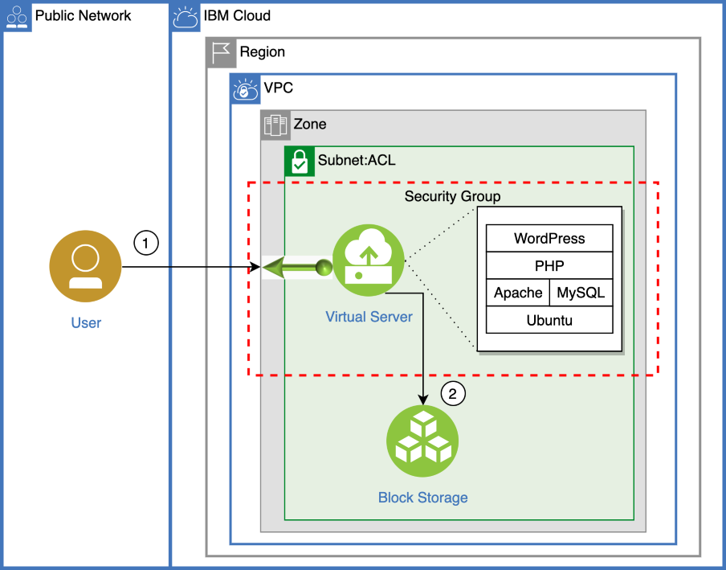
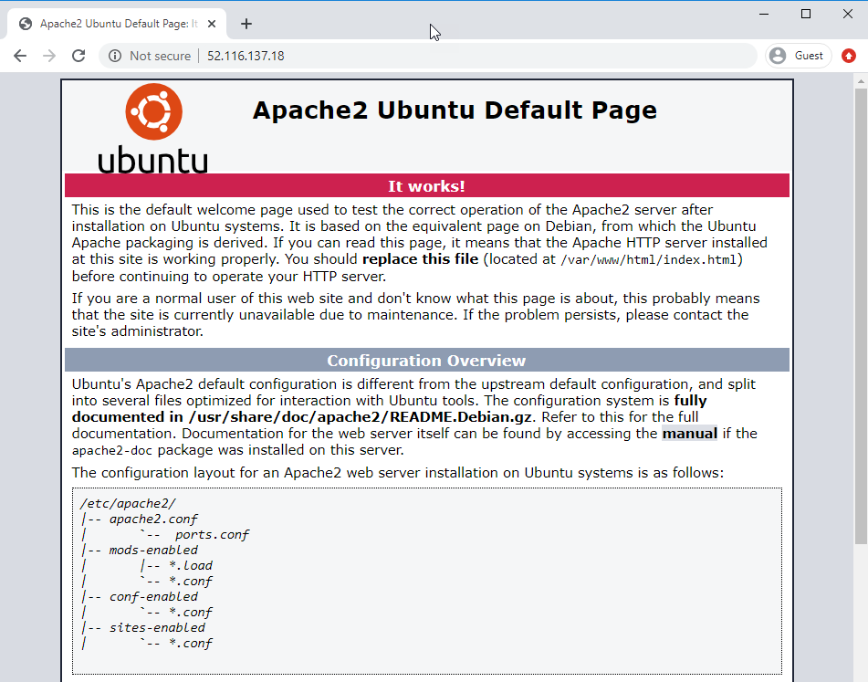
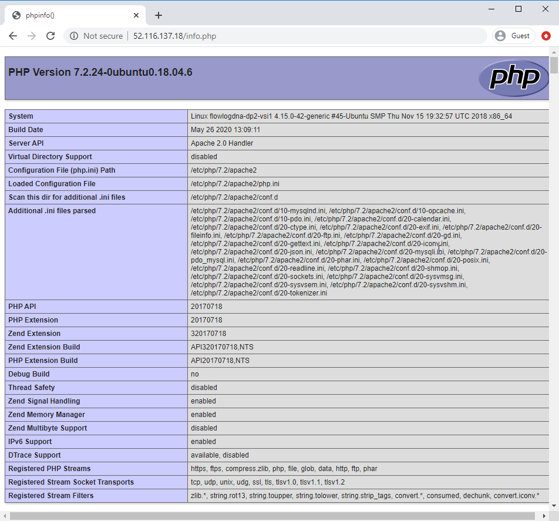

{:step: data-tutorial-type='step'}
{:shortdesc: .shortdesc}
{:new_window: target="_blank"}
{:codeblock: .codeblock}
{:screen: .screen}
{:tip: .tip}
{:pre: .pre}

# PHP web application on a LAMP Stack in VPC
{: #lamp-stack-on-vpc}
{: toc-content-type="tutorial"}
{: toc-services="vpc"}
{: toc-completion-time="2h"}

<!--##istutorial#-->
This tutorial may incur costs. Use the [Cost Estimator](https://{DomainName}/estimator/review) to generate a cost estimate based on your projected usage.
{: tip}

<!--#/istutorial#-->

This tutorial walks you through the creation of an Ubuntu **L**inux virtual server with **A**pache web server, **M**ySQL database and **P**HP scripting on {{site.data.keyword.Bluemix_notm}} [Virtual Private Cloud (VPC) Infrastructure](https://www.ibm.com/cloud/learn/vpc). This combination of software - more commonly called a LAMP stack - is often used to deliver websites and web applications. Using {{site.data.keyword.vpc_short}} you will quickly deploy your LAMP stack and if desired add logging and monitoring. To experience the LAMP server in action, you will also install and configure the free and open source [WordPress](https://wordpress.org/) content management system.
{: shortdesc}

## Objectives
{: #lamp-stack-on-vpc-0}

* Provision a virtual server instance (VSI) in a VPC.
* Install the latest Apache, MySQL and PHP software.
* Host a website or blog by installing and configuring WordPress.
* Configure logging and monitoring to detect outages and monitor for slow performance (optional).
* Resize the VSI (optional).

{: class="center"}
{: style="text-align: center;"}


1. End user accesses the LAMP server running on a VPC using a web browser.
2. The VSI is configured to use data from an encrypted Block Storage volume (optional).

## Before you begin
{: #lamp-stack-on-vpc-1}
{: #prereqs}

This tutorial requires:
* An {{site.data.keyword.cloud_notm}} [billable account](https://{DomainName}/docs/account?topic=account-accounts),
* {{site.data.keyword.cloud_notm}} CLI,
   * {{site.data.keyword.vpc_short}} plugin (`vpc-infrastructure`),
* `terraform` to use Infrastructure as Code to provision resources,
* `jq` to query JSON files,
* `git` to clone source code repository,

<!--##istutorial#-->
You will find instructions to download and install these tools for your operating environment in the [Getting started with solution tutorials](/docs/solution-tutorials?topic=solution-tutorials-tutorials) guide. To avoid the installation of these tools you can use the [{{site.data.keyword.cloud-shell_short}}](https://{DomainName}/shell) from the {{site.data.keyword.cloud_notm}} console.
{: tip}

<!--#/istutorial#-->

## Create services
{: #lamp-stack-on-vpc-2}
{: step}

In this section, you will provision a VPC, Subnet, Security Group and a Virtual Server Instance (VSI) using the [{{site.data.keyword.cloud-shell_notm}}](https://{DomainName}/shell) and the {{site.data.keyword.cloud_notm}} CLI. VSIs often address peaks in demand after which they can be [suspended or powered down](https://{DomainName}/docs/vpc?topic=vpc-suspend-billing#billing-details) so that the cloud environment perfectly fits your infrastructure needs.
   
If you prefer to use a Terraform template to generate these resources, you can use the template that is available here: https://github.com/IBM-Cloud/vpc-tutorials/tree/master/vpc-lamp and follow the instructions in the README.md. This template can also be used in [{{site.data.keyword.bpshort}}](https://{DomainName}/schematics/overview).
{: tip}

1. From the [{{site.data.keyword.Bluemix_notm}} Console](https://{DomainName}), launch the [{{site.data.keyword.cloud-shell_notm}}](https://{DomainName}/shell).
1. You are automatically logged into one of the IBM Cloud regions, you can switch to a different region if desired by running the following command:
   ```sh
   ibmcloud target -r <region-name> -g <resource-group>
   ```
   {: pre}

### Create SSH Key(s)
{: #lamp-stack-on-vpc-3}

1. In VPC an SSH key is used for administrator access to a VSI instead of a password. Create an SSH Key by running the following command and accept the defaults when prompted. For more information on SSH keys, see the docs [SSH Keys](https://{DomainName}/docs/vpc?topic=vpc-ssh-keys). 
   ```sh
   ssh-keygen -t rsa -b 4096
   ```
   {: pre}

   The above command generates two files inside of the `~/.ssh` directory: `id_rsa` and `id_rsa.pub`.  Your {{site.data.keyword.cloud-shell_short}} session is [short lived](https://{DomainName}/docs/cloud-shell?topic=cloud-shell-shell-ui#multi-shell), any files you create inside of {{site.data.keyword.cloud-shell_notm}} should be saved in a safe location for future re-use. There is a download and upload file option in {{site.data.keyword.cloud-shell_short}} on the upper right section of the screen.
   {: tip}

   If you have an existing SSH key that you would like to re-use, you can upload it to your {{site.data.keyword.cloud-shell_short}} session instead.
   {: tip}
   
1. Add the SSH key to your account.
   ```sh
   SSHKEY_ID=$(ibmcloud is key-create sshkey-lamp-tutorial @$HOME/.ssh/id_rsa.pub --json | jq -r '.id')
   ```
   {: pre}

### Create VPC, Subnet(s) and Security Group(s)
{: #lamp-stack-on-vpc-4}

1. Create a VPC. For more information, see the docs for creating a VPC in the [console](https://{DomainName}/docs/vpc?topic=vpc-creating-a-vpc-using-the-ibm-cloud-console) or [CLI](https://{DomainName}/docs/vpc?topic=vpc-creating-a-vpc-using-cli#create-a-vpc-cli).
   ```sh
   VPC_ID=$(ibmcloud is vpc-create vpc-lamp-tutorial --json | jq -r '.id')
   ```
   {: pre}

1. Create the subnet for your VPC. 
   ```sh
   SUBNET_ID=$(ibmcloud is subnet-create subnet-lamp-1 $VPC_ID --zone $(ibmcloud target --output json | jq -r '.region.name')-1 --ipv4-address-count 256 --json | jq -r '.id')
   ```
   {: pre}

1. Create the security group for your VPC. 
   ```sh
   SG_ID=$(ibmcloud is security-group-create sg-lamp-1 $VPC_ID --json | jq -r '.id')
   ```
   {: pre}

1. Add a rule to limit inbound to SSH port 22.
   ```sh
   ibmcloud is security-group-rule-add $SG_ID inbound tcp --port-min 22 --port-max 22 --json
   ```
   {: pre}

   You can restrict access to the SSH port to a subset of addresses, use --remote &lt;IP address or CIDR&gt; in the above command to limit who can access this server, i.e. `ibmcloud is security-group-rule-add $SG_ID inbound tcp --remote YOUR_IP_ADDRESS --port-min 22 --port-max 22 --json`
   {: tip}

1. Add a rule to limit inbound to HTTP port 80.
   ```sh
   ibmcloud is security-group-rule-add $SG_ID inbound tcp --port-min 80 --port-max 80 --json
   ```
   {: pre}

   You can also restrict access to the HTTP port to a subset of addresses, use --remote &lt;IP address or CIDR&gt; in the above command to limit who can access this server, i.e. `ibmcloud is security-group-rule-add $SG_ID inbound tcp --remote YOUR_IP_ADDRESS --port-min 80 --port-max 80 --json`
   {: tip}

1. Add a rule to allow outbound to all, this is required to install software, it can be disabled or removed later on.
   ```sh
   ibmcloud is security-group-rule-add $SG_ID outbound all --json
   ```
   {: pre}

### Create Virtual Server Instance
{: #lamp-stack-on-vpc-5}

1. IBM Cloud periodically updates the Ubuntu image with the latest software, obtain the image ID for latest Ubuntu 20.x by running the following command.  
   ```sh
   IMAGE_ID=$(ibmcloud is images --json | jq -r '.[] | select (.name=="ibm-ubuntu-22-04-1-minimal-amd64-3") | .id')
   ```
   {: pre}

1.  Create virtual server instance
   ```sh
   NIC_ID=$(ibmcloud is instance-create vsi-lamp-1 $VPC_ID $(ibmcloud target --output json | jq -r '.region.name')-1 cx2-2x4 $SUBNET_ID --image-id $IMAGE_ID --key-ids $SSHKEY_ID --security-group-ids $SG_ID --json | jq -r '.primary_network_interface.id')
   ```
   {: pre}

1. Reserve a Floating IP
   ```sh
   FLOATING_IP=$(ibmcloud is floating-ip-reserve fip-lamp-1 --nic-id $NIC_ID --json | jq -r '.address')
   ```
   {: pre}

1. Connect to the server with SSH, note that it may take a minute for the newly created server to be accessible via SSH.
   ```sh
   ssh root@$FLOATING_IP
   ```
   {: pre}

   You will need to know the Floating IP for accessing the virtual server via your browser. Since it was captured in a shell variable earlier, you can run the following command to obtain the Floating IP address `echo $FLOATING_IP` or by running `ibmcloud is floating-ips --json` and searching for the name used to create the Floating IP `fip-lamp-1` in the result. You can also find the server's floating IP address from the web console: https://{DomainName}/vpc-ext/compute/vs.
   {: tip}

## Install Apache, MySQL, and PHP
{: #lamp-stack-on-vpc-6}
{: step}

In this section, you'll run commands to update Ubuntu package sources and install Apache, MySQL and PHP with latest version. 

When the server is spun up for the first time, it is possible that it is already running system updates and blocks you from running the commands below, you can check the status of system updates by running `ps aux | grep -i apt`, and either wait for the automated system updates task to complete or kill the task.
{: tip}

1. Disable interactive mode during updates 
   ```sh
   export DEBIAN_FRONTEND=noninteractive
   ```
   {: pre}

1. Update packages 
   ```sh
   apt update
   ```
   {: pre}

1. Install the Apache 
   ```sh
   apt install apache2 -y
   ```
   {: pre}      

1. Install the MySQL 
   ```sh
   apt install mysql-server -y
   ```
   {: pre}

1. Install the PHP 
   ```sh
   apt install php libapache2-mod-php php-mysql php-common php-cli -y
   ```
   {: pre}
  
## Verify the installation and configuration
{: #lamp-stack-on-vpc-7}
{: step}

In this section, you'll verify that Apache, MySQL and PHP are up to date and running on the Ubuntu image. You'll also implement the recommended security settings for MySQL.

1. Verify Ubuntu by opening the Floating IP address in the browser. You should see the Ubuntu welcome page.
   
1. Review the Apache, MySQL and PHP versions installed by using the following commands.
   ```sh
   apache2 -v
   ```
   {: pre}

   ```sh
   mysql -V
   ```
   {: pre}

   ```sh
   php -v
   ```
   {: pre}

1. Open a `mysql` prompt.
   ```sh
   mysql
   ```
   {: pre}

1. Run the following commands substituting your password for *yourPassword*.
   ```sh
   ALTER USER 'root'@'localhost' IDENTIFIED WITH mysql_native_password BY 'yourPassword';
   ```
   {: pre}

1. Exit the `mysql` prompt.
   ```sh
   exit
   ```
   {: pre}

1. Run the following script to secure the MySQL database.
   ```sh
   mysql_secure_installation
   ```
   {: pre}

1. Additionally you can quickly create a PHP info page with the following command.
   ```sh
   echo "<?php phpinfo(); ?>" > /var/www/html/info.php
   ```
   {: pre}

1. View the PHP info page you created: open a browser and go to `http://{FloatingIPAddress}/info.php`. Substitute the floating IP address of your VSI. It will look similar to the following image.

{: class="center"}
{: style="text-align: center;"}

## Install and configure WordPress
{: #lamp-stack-on-vpc-8}
{: step}

Experience your LAMP stack by installing an application. The following steps install the open source WordPress platform, which is often used to create websites and blogs. For more information and settings for production installation, see the [WordPress documentation](https://codex.wordpress.org/Main_Page).

1. Run the following command to install WordPress.
   ```sh
   apt install wordpress -y
   ```
   {: pre}

2. Configure WordPress to use MySQL and PHP. Run the following command to open a text editor and create the file `/etc/wordpress/config-localhost.php`.
   ```sh
   sensible-editor /etc/wordpress/config-localhost.php
   ```
   {: pre}

3. Copy the following lines to the file substituting *yourPassword* with your MySQL database password and leaving the other values unchanged. Save and exit the file.
   ```php
   <?php
   define('DB_NAME', 'wordpress');
   define('DB_USER', 'wordpress');
   define('DB_PASSWORD', 'yourPassword');
   define('DB_HOST', 'localhost');
   define('WP_CONTENT_DIR', '/usr/share/wordpress/wp-content');
   ?>
   ```
   {: pre}

4. Open a `mysql` prompt and supply your password.
   ```sh
   mysql -u root -p
   ```
   {: pre}

5. Run the following commands substituting your database password for *yourPassword* and leaving the other values unchanged.
   ```sql
   CREATE DATABASE wordpress;
   CREATE USER 'wordpress'@'localhost' IDENTIFIED BY 'yourPassword';
   GRANT SELECT,INSERT,UPDATE,DELETE,CREATE,DROP,ALTER ON wordpress.* TO 'wordpress'@'localhost';
   FLUSH PRIVILEGES;
   ```
   {: pre}

6. Exit the `mysql` prompt.
   ```sh
   exit
   ```
   {: pre}

7. Move the WordPress installation to the web server document root.
   ```sh
   ln -s /usr/share/wordpress /var/www/html/wordpress
   mv /etc/wordpress/config-localhost.php /etc/wordpress/config-default.php
   ```
   {: pre}

8. Complete the WordPress setup and publish on the platform. Open a browser and go to `http://{FloatingIPAddress}/wordpress/wp-admin`. Substitute the floating IP address of your instance. It should look similar to the following image.
   

## Configure domain
{: #lamp-stack-on-vpc-9}
{: step}

To use an existing domain name with your LAMP server, update the A record to point to the VSI's floating IP address.

## Server monitoring and log management
{: #lamp-stack-on-vpc-monitoring_log}
{: step}

To ensure server availability and the best user experience, monitoring should be enabled on every production server. Several options are available to monitor your VSI and capture logs in a central location for analysis.

### Server monitoring
{: #lamp-stack-on-vpc-11}

You can monitor CPU, volume, memory, and network usage of your VSI instances after you set up an instance of the {{site.data.keyword.mon_full_notm}} service. If you would like to configure the monitoring service follow the steps outlined in the [Monitoring a Linux host](https://{DomainName}/docs/monitoring?topic=monitoring-ubuntu) documentation. 

### Server logging
{: #lamp-stack-on-vpc-12}

You can use {{site.data.keyword.la_full_notm}} to manage system and application logs in the IBM Cloud.

{{site.data.keyword.la_full_notm}} offers administrators, DevOps teams, and developers advanced features to filter, search, and tail log data, define alerts, and design custom views to monitor application and system logs

If you would like to configure the logging service follow the steps outlined in the [Managing Ubuntu logs with {{site.data.keyword.la_full_notm}}](https://{DomainName}/docs/log-analysis?topic=log-analysis-ubuntu)


## Configure a Bring-Your-Own-Key (BYOK) Encrypted Data Volume (Optional)
{: #lamp-stack-on-vpc-configure_data_volume}
{: step}

The VSI was created with a provider managed encrypted **Boot** volume of 100 GB, however if you delete that VSI any data you want to safeguard will need to get moved before you delete the VSI. An alternative is to create a **Data** volume which can be persisted even if the VSI is deleted and attached to a new VSI.  You can also encrypt the volume with your own key. If that is your desired outcome, follow the steps outlined below to create a data volume and attach it to your VSI.

1. Create a data volume configuration file.
   ```sh
   VOLUME_ID=$(ibmcloud is volume-create volume-lamp-1 10iops-tier $(ibmcloud target --output json | jq -r '.region.name')-1 --capacity 100 --json | jq -r '.id')
   ```
   {: pre}

   In VPC you also have a choice of using a customer managed encryption key. For storing your own encryption keys, you can use one of two available services: (1) A FIPS 140-2 Level 3 service [{{site.data.keyword.keymanagementservicelong_notm}}](https://www.ibm.com/cloud/key-protect).  See the [Provisioning the {{site.data.keyword.keymanagementservicelong_notm}} service](https://{DomainName}/docs/key-protect?topic=key-protect-provision) topic in the documentation. (2) A FIPS 140-2 Level 4 service [{{site.data.keyword.Bluemix_notm}} {{site.data.keyword.hscrypto}}](https://www.ibm.com/cloud/hyper-protect-services), see the [Getting started with {{site.data.keyword.Bluemix_notm}} {{site.data.keyword.hscrypto}}](https://{DomainName}/docs/hs-crypto?topic=hs-crypto-get-started) topic in the documentation. While creating the volume you can specify the `--encryption-key` parameter with the CRN to the encryption key you want to use.
   {: tip}
   
1. Capture the ID of the VSI created earlier by listing all instances and filtering based on the instance name:
   ```sh
   VSI_ID=$(ibmcloud is instances --json | jq -r '.[] | select(.name == "vsi-lamp-1") | .id')
   ```
   {: pre}   

1. Attach the data volume to your existing VSI.
   ```sh
   ibmcloud is instance-volume-attachment-add attachment-data-1 $VSI_ID $VOLUME_ID --auto-delete false --json
   ```
   {: pre}

1. Connect to the server with SSH.
   ```sh
   ssh root@$FLOATING_IP
   ```
   {: pre}

1. Configure the newly created data volume on the VSI, run each line below one at a time.  

   ```sh
   new_bsv=$(echo $(parted -l 2>&1) | awk 'NR==1{print $2}' | sed 's/:$//')
   parted $new_bsv mklabel gpt
   parted -a opt $new_bsv mkpart primary ext4 0% 100%
   new_part=${new_bsv}1
   mkfs.ext4 -L lamp-data ${new_part}
   mkdir /data
   mount ${new_part} /data
   echo "${new_part} /data ext4 defaults,relatime 0 0" | tee -a /etc/fstab
   mount -a
   ```
   {: pre}   

### Configure Apache to use the new /data file system
{: #lamp-stack-on-vpc-14}

1. Stop the Apache service
   ```sh
   service apache2 stop
   ```
   {: pre}

1. Move the Apache directory from /var to /data
   ```sh
   mv /var/www /data/
   ```
   {: pre}

1. Create a link to the new location 
   ```sh
   ln -s /data/www /var/www
   ```
   {: pre}   

1. Start the Apache service
   ```sh
   service apache2 start
   ```
   {: pre}   

### Configure MySQL to use the new /data file system
{: #lamp-stack-on-vpc-15}

1. Stop the MySQL service
   ```sh
   service mysql stop
   ```
   {: pre}

1. Move the MySQL directory from /var to /data
   ```sh
   mkdir /data/lib
   mv /var/lib/mysql /data/lib/
   ```
   {: pre}

1. Create a link to the new location 
   ```sh
   ln -s /data/lib/mysql /var/lib/mysql
   ```
   {: pre}

1. Add an alias of the new location to [AppArmor](https://wiki.ubuntu.com/AppArmor), otherwise AppArmor will block the access. 
   ```sh
   echo "alias /var/lib/mysql/ -> /data/lib/mysql/," >> /etc/apparmor.d/tunables/alias
   ```
   {: pre}

1. Restart the AppArmor service
   ```sh
   systemctl restart apparmor
   ```
   {: pre}   

1. Start the MySQL service
   ```sh
   service mysql start
   ```
   {: pre}

1.  Open a browser and go to `http://{FloatingIPAddress}/wordpress`. Substitute the floating IP address of your instance. You should be able to access your WordPress page just as you had it before you added the new Data volume.

## Resize VSI (Optional)
{: #lamp-stack-on-vpc-resizing}
{: step}

The VSI was created using one of the smallest profiles available in VPC, i.e. 2 vCPU and 4GiB RAM.  It is possible based on your usage requirements to increase - or decrease - the amount of vCPU and RAM available, see [Resizing a virtual server instance](https://{DomainName}/docs/vpc?topic=vpc-resizing-an-instance). 

1. Capture the ID of the VSI created earlier by listing all instances and filtering based on the instance name:
   ```sh
   VSI_ID=$(ibmcloud is instances --json | jq -r '.[] | select(.name == "vsi-lamp-1") | .id')
   ```
   {: pre}  

1. Stop the instance.
   ```sh
   ibmcloud is instance-stop $VSI_ID
   ```
   {: pre}

1. Resize the instance.
   ```sh
   ibmcloud is instance-update $VSI_ID --profile cx2-4x8
   ```
   {: pre}

   You can get a list of alternative profiles by issuing the following command `ibmcloud is instance-profiles`, note however the restrictions on resizing based on current/target profiles in the [Resizing a virtual server instance](https://{DomainName}/docs/vpc?topic=vpc-resizing-an-instance) topic.
   {: tip}
   
1. Start the instance.
   ```sh
   ibmcloud is instance-start $VSI_ID
   ```
   {: pre}

1.  You may need to wait a couple of minutes as the VSI is placed on an appropriate host and started. Open a browser and go to `http://{FloatingIPAddress}/wordpress`. Substitute the floating IP address of your instance. You should be able to access your WordPress page just as you had it before the resizing.

## Remove resources
{: #lamp-stack-on-vpc-remove-resources}
{: step}

1. In the VPC [console](https://{DomainName}/vpc-ext), click on **Floating IPs**, then on the IP address for your VSIs, then in the action menu select **Release**. Confirm that you want to release the IP address.
2. Next, switch to **Virtual server instances**, **Delete** your instance.
3. Once the VSIs are gone, switch to **Subnets**. Delete your subnet.
4. After the subnets have been deleted, switch to **VPC** tab and delete your VPC.
5. If you created the optional Data Volume and no longer need it, switch to **Block storage volumes** tab and delete the volume.

When using the console, you may need to refresh your browser to see updated status information after deleting a resource.
{: tip}
