---
copyright:
  years: 2017, 2018
lastupdated: "2018-04-20"

---

{:shortdesc: .shortdesc}
{:new_window: target="_blank"}
{:codeblock: .codeblock}
{:screen: .screen}
{:tip: .tip}
{:pre: .pre}

# PHP web application on a LAMP Stack

This tutorial walks you through the creation of an Ubuntu **L**inux virtual server with **A**pache web server, **M**ySQL database and **P**HP scripting. This combination of software - more commonly called a LAMP stack - is very popular and often used to deliver websites and web applications. Using {{site.data.keyword.BluVirtServers}} you will quickly deploy your LAMP stack with built-in monitoring and vulnerability scanning. To see the LAMP server in action, you will install and configure the free and open source [WordPress](https://wordpress.org/) content management system.

## Objectives

* Provision a LAMP server in minutes
* Apply the latest Apache, MySQL and PHP version
* Host a website or blog by installing and configuring WordPress
* Utilize monitoring to detect outages and slow performance
* Assess vulnerabilities and protect from unwanted traffic

## Services used

This tutorial uses the following runtimes and services:

* [{{site.data.keyword.BluVirtServers_short}}](https://console.bluemix.net/catalog/infrastructure/virtual-server-group)

This tutorial may incur costs. Use the [Pricing Calculator](https://console.bluemix.net/pricing/) to generate a cost estimate based on your projected usage.

## Architecture


1. End user accesses the LAMP server and applications using a web browser

## Before you begin

{: #prereqs}

1. Contact your infrastructure administrator to get the following permissions.
  * Network permission required to complete the **Public and Private Network Uplink**

## Create services

In this section, you will provision a public virtual server with a fixed configuration. {{site.data.keyword.BluVirtServers_short}} can be deployed in a matter of minutes from virtual server images in specific geographic regions. Virtual servers often address peaks in demand after which they can be suspended or powered down so that the cloud environment perfectly fits your infrastructure needs.

1. In your browser, access the [{{site.data.keyword.BluVirtServers_short}}](https://console.bluemix.net/catalog/infrastructure/virtual-server-group) catalog page.
2. Select **Public Virtual Server** and click **Create**.
3. Under **Image**, select **LAMP** latest version under **Ubuntu**. Even though this comes pre-installed with Apache, MySQL and PHP, you'll re-install PHP and MySQL with the latest version.
4. Under **Network Interface** select the **Public and Private Network Uplink** option.
5. Review the other configuration options and click **Provision** to create your virtual server.
  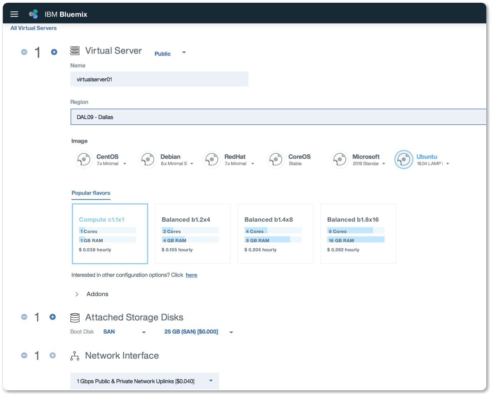
6. After the server is created, you'll see the server login credentials. Using your username, password and public IP address, connect to the server with SSH.
   ```sh
   sudo ssh root@<Public-IP-Address>
   ```
   {: pre}

  You can find the server's public IP address and password in the dashboard.
  {:tip}

  

## Re-install Apache, MySQL, and PHP

It's advised to update the LAMP stack with the latest security patches and bug fixes periodically. In this section, you'll run commands to update Ubuntu package sources and re-install Apache, MySQL and PHP with latest version. Note the caret (^) at the end of the command.

```sh
sudo apt update && sudo apt install lamp-server^
```
{: pre}

## Verify the installation and configuration

In this section, you'll verify that Apache, MySQL and PHP are up to date and running on the Ubuntu image. You'll also implement the recommended security settings for MySQL.

1. Verify Ubuntu by opening the public IP address in the browser. You should see the Ubuntu welcome page.
   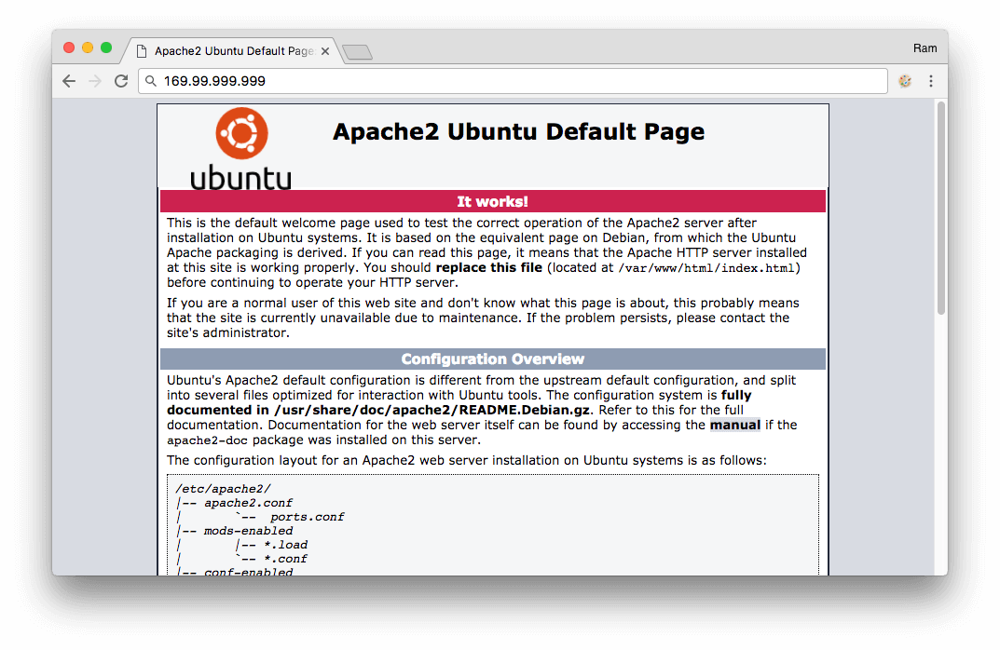
2. Verify port 80 is available for web traffic by running the following command.
   ```sh
   sudo netstat -ntlp | grep LISTEN
   ```
   {: pre}
   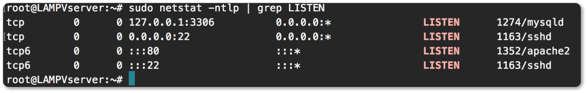
3. Review the Apache, MySQL and PHP versions installed by using the following commands.
  ```sh
  apache2 -v
  ```
  {: pre}
  ```sh
  mysql -V
  ```
  {: pre}
  ```sh
   php -v
  ```
   {: pre}
4. Run the following script to secure the MySQL database.
  ```sh
  mysql_secure_installation
  ```
  {: pre}
5. Enter the MySQL root password and configure the security settings for your environment. When you're done, exit the mysql prompt by typing `\q`.
  ```sh
  mysql -u root -p
  ```
  {: pre}

  The MySQL default user name and password is root and root.
  {:tip}
6. Additionally you can quickly create a PHP info page with the following command.
   ```sh
   sudo sh -c 'echo "<?php phpinfo(); ?>" > /var/www/html/info.php'
   ```
   {: pre}
7. View the PHP info page you created: open a browser and go to `http://{YourPublicIPAddress}/info.php`. Substitute the public IP address of your virtual server. It will look similar to the following image.

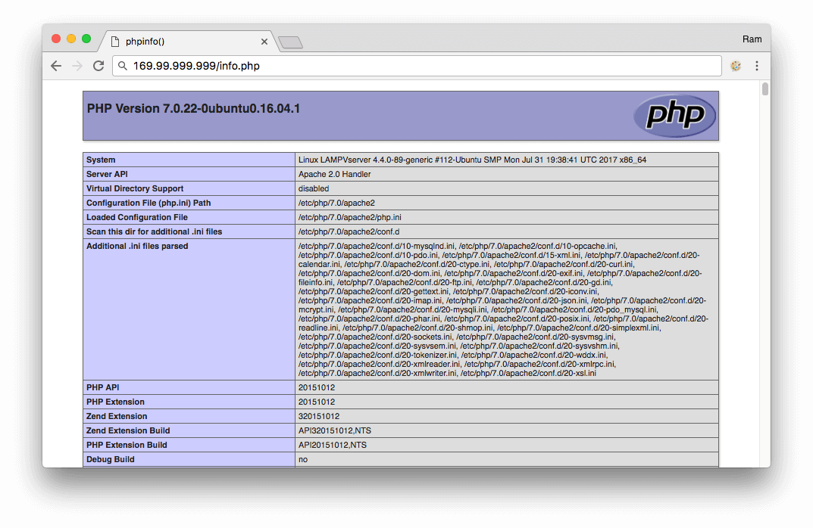

### Install and configure WordPress

Experience your LAMP stack by installing an application. The following steps install the open source WordPress platform, which is often used to create websites and blogs. For more information and settings for production installation, see the [WordPress documentation](https://codex.wordpress.org/Main_Page).

1. Run the following command to install WordPress.
   ```sh
   sudo apt install wordpress
   ```
   {: pre}
2. Configure WordPress to use MySQL and PHP. Run the following command to open a text editor and create the file `/etc/wordpress/config-localhost.php`.
   ```sh
   sudo sensible-editor /etc/wordpress/config-localhost.php
   ```
   {: pre}
3. Copy the following lines to the file substituting *yourPassword* with your MySQL database password and leaving the other values unchanged. Save and exit the file using `Ctrl+X`.
   ```php
   <?php
   define('DB_NAME', 'wordpress');
   define('DB_USER', 'wordpress');
   define('DB_PASSWORD', 'yourPassword');
   define('DB_HOST', 'localhost');
   define('WP_CONTENT_DIR', '/usr/share/wordpress/wp-content');
   ?>
   ```
   {: pre}
4. In a working directory, create a text file `wordpress.sql` to configure the WordPress database.
   ```sh
   sudo sensible-editor wordpress.sql
   ```
   {: pre}
5. Add the following commands substituting your database password for *yourPassword* and leaving the other values unchanged. Then save the file.
   ```sql
   CREATE DATABASE wordpress;
   GRANT SELECT,INSERT,UPDATE,DELETE,CREATE,DROP,ALTER ON wordpress.*
   TO wordpress@localhost
   IDENTIFIED BY 'yourPassword';
   FLUSH PRIVILEGES;
   ```
   {: pre}
6. Run the following command to create the database.
   ```sh
   cat wordpress.sql | sudo mysql --defaults-extra-file=/etc/mysql/debian.cnf
   ```
   {: pre}
7. After the command completes, delete the file `wordpress.sql`. Move the WordPress installation to the web server document root.
   ```sh
   sudo ln -s /usr/share/wordpress /var/www/html/wordpress
   sudo mv /etc/wordpress/config-localhost.php /etc/wordpress/config-default.php
   ```
   {: pre}
8. Complete the WordPress setup and publish on the platform. Open a browser and go to `http://{yourVMPublicIPAddress}/wordpress`. Substitute the public IP address of your VM. It should look similar to the following image.
   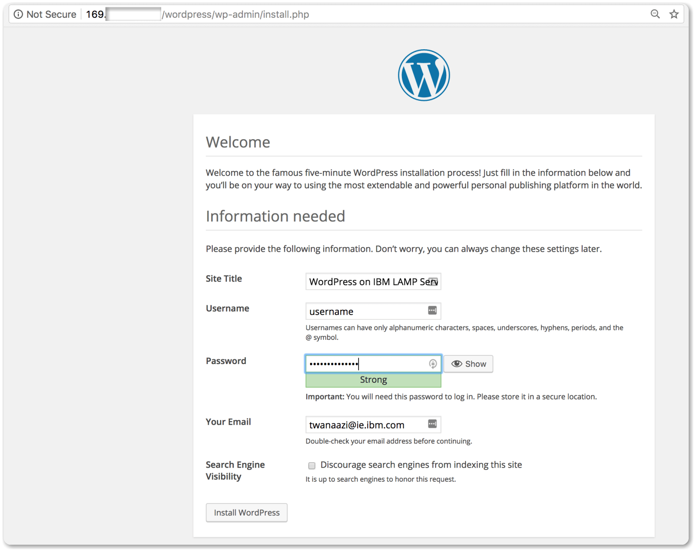

## Configure domain

To use an existing domain name with your LAMP server, update the A record to point to the virtual server's public IP address.
You can view the server's public IP address from the dashboard.

## Server monitoring and usage

To ensure server availability and the best user experience, monitoring should be enabled on every production server. In this section, you'll explore the options that are available to monitor your virtual server and understand the usage of the server at any given time.

### Server monitoring

Two basic monitoring types are available: SERVICE PING and SLOW PING.

* **SERVICE PING** checks that server response time is equal to 1 second or less
* **SLOW PING** checks that server response time is equal to 5 seconds or less

Since SERVICE PING is added by default, add SLOW PING monitoring with the following steps.

1. From the dashboard, select your server from the list of devices and then click the **Monitoring** tab.
  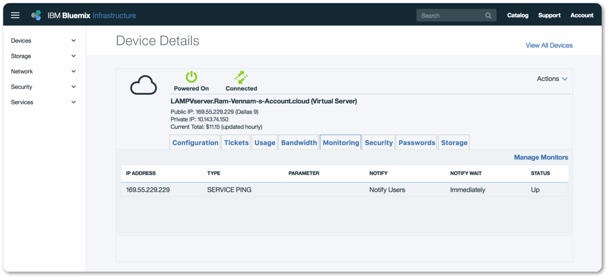
2. Click **Manage Monitors**.
3. Add the **SLOW PING** monitoring option and click **Add Monitor**. Select your public IP address for the IP address.
  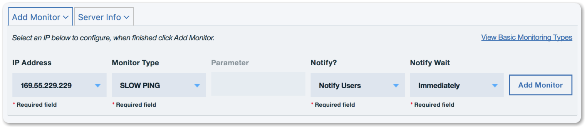

  **Note**: Duplicate monitors with the same configurations are not allowed. Only one monitor per configuration can be created.

If a response is not received in the allotted time frame, an alert is sent to the email address on the {{site.data.keyword.Bluemix_notm}} account.
  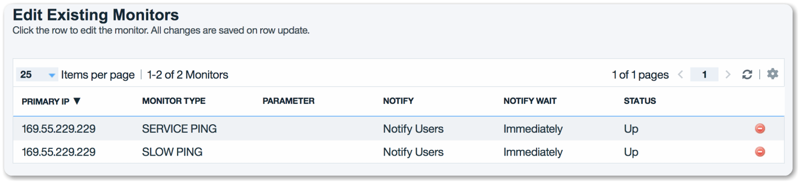

### Server usage

Select the **Usage** tab to understand the current server's memory and CPU usage.
  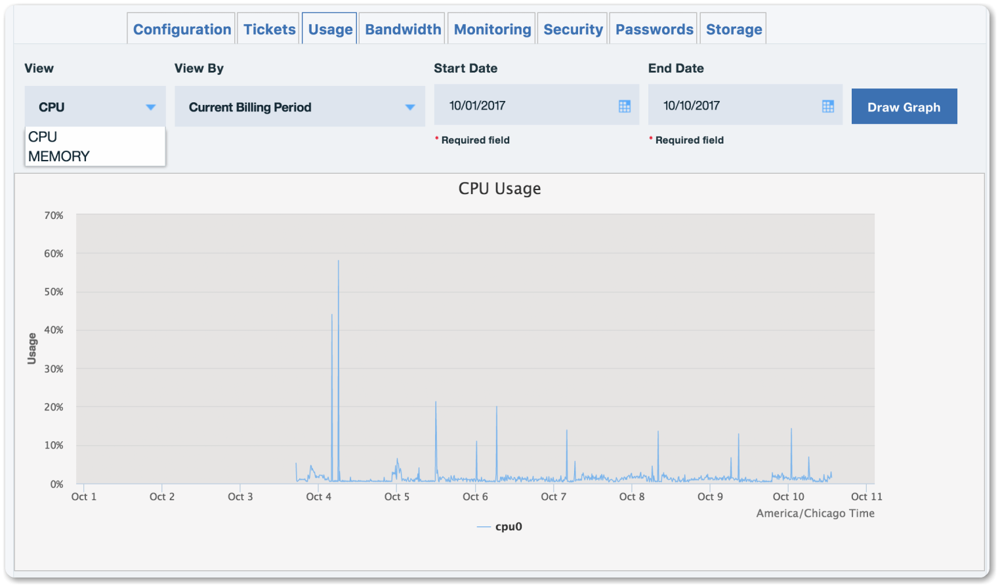

## Server security

{{site.data.keyword.BluVirtServers}} provide several security options such as vulnerability scanning and add-on firewalls.

### Vulnerability scanner

The vulnerability scanner scans the server for any vulnerabilities related to the server. To run a vulnerability scan on the server follow the steps below.

1. From the dashboard, select your server and then click the **Security** tab.
2. Click **Scan** to start the scan.
3. After the scan completes, click **Scan Complete** to view the scan report.
  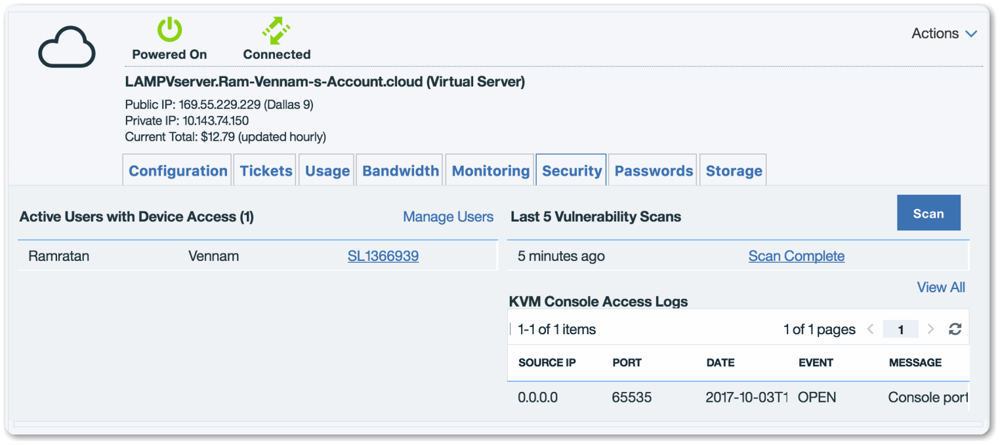
4. Review any reported vulnerabilities.
  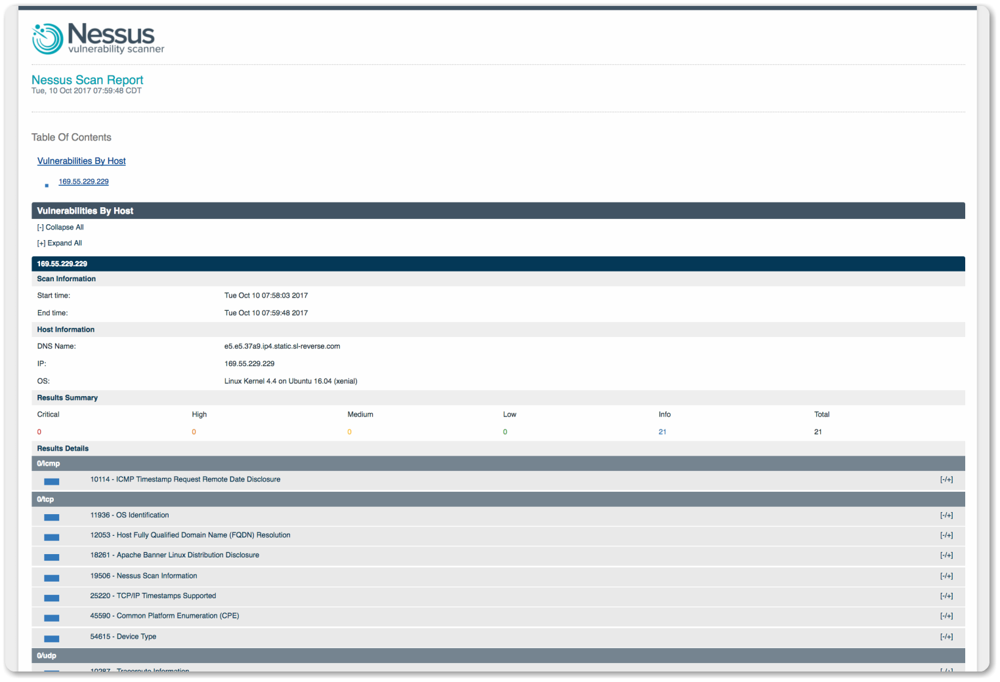

### Firewalls

Another way to secure the server is by adding a firewall. Firewalls provide an essential security layer: preventing unwanted traffic from hitting your servers, reducing the likelihood of an attack and allowing your server resources to be dedicated for their intended use. Firewall options are provisioned on demand without service interruptions.

Firewalls are available as an add-on feature for all servers on the Infrastructure public network. As part of the ordering process, you can select device-specific hardware or a software firewall to provide protection. Alternatively, you can deploy dedicated firewall appliances to the environment and deploy the virtual server to a protected VLAN. For more information, see [Firewalls](http://knowledgelayer.softlayer.com/topic/firewall).

## Remove resources

To remove your virtual server, complete the following steps.

1. Log in to the [{{site.data.keyword.slportal}}](https://control.softlayer.com/).
2. From the **Devices** menu, select **Device List**.
3. Click **Actions** for the virtual server you want to remove and select **Cancel**.

## Related content

* [Deploy a LAMP stack using Terraform](infrastructure-as-code-terraform.html)
