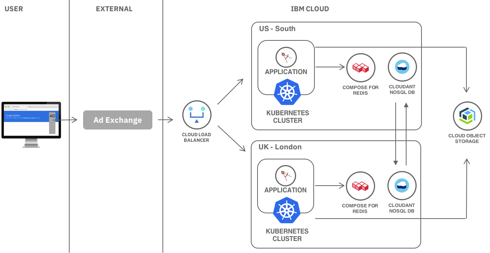

---
copyright:
  years: 2017
lastupdated: "2018-02-14"

---

{:java: #java .ph data-hd-programlang='java'}
{:swift: #swift .ph data-hd-programlang='swift'}
{:ios: #ios data-hd-operatingsystem="ios"}
{:android: #android data-hd-operatingsystem="android"}
{:shortdesc: .shortdesc}
{:new_window: target="_blank"}
{:codeblock: .codeblock}
{:screen: .screen}
{:tip: .tip}
{:pre: .pre}

# Low latency Real-Time Bidding environment
{:shortdesc}
This tutorial covers the type of environment you would need to set up in order to achieve the 100ms response time requirements of auction in  Real-Time Bidding process. This involves multi-region kubernetes clusters with replicated databases, caching and object storage.

When a user visits a website and advertisements are displayed, a lot goes on under the covers to determine what ad to display.
1. User visits a website.
2. The website sends a request with user data to an ad exchange.  
3. Ad exchange starts an auction with multiple advertisers.
4. Advertisers bid on ad impressions within 100ms.
5. Ad exchange picks a winner and provides the ad information to the website.
6. Website displays the ad.

In order for the advertisers to determine the ad they want to show and the bidding price, they have to analyze user data against their existing database and respond with the ad along with a price they are willing to pay. All of this has to happen within 100ms. To achieve this speed, the architecture has to be optimized to reduce networking latency as much as possible.

## Objectives
{: #objectives}

* Create clusters in multiple regions
* Add global load Balancer
* Add low latency caching - Redis
* Add data store - Cloudant NoSQL DB
* Add Object storage

## Create Kubernetes clusters
{: #first_objective}

The first step of creating the environment is the compute which will run your bidding application. Use IBM Cloud Container Service with Kubernetes to deploy highly available apps using the power and flexibility of clusters. Developers provide containerized applications and Kubernetes on IBM Cloud will handle deployment, scaling, and management aspects. Multiple instances of your application can run in a single cluster. We'll create multiple clusters to load balancer based on proximity of the request.

In this section, we'll create two Kubernetes clusters, one in `US South` and another in `United Kingdom`.

1. Create a Resource Group called "RTB" by visiting **Manage > Account > Resource Groups**. A resource group is a way for you to organize your account resources in customizable groupings, so that you can quickly assign users access to more than one resource at a time.
2. In the Dashboard, select the US-South region.
3. Click on **Create resource**. In the **Containers** category, click **Kubernetes cluster**.
4. Enter a **Cluster Name**. The default cluster type is free.
5. Click **Create Cluster**. The details for the cluster open, but the worker node in the cluster takes a few minutes to provision. You can see the status of the worker node in the **Worker nodes** tab. When the status reaches `Ready`, your worker node is ready to be used.
6. In the Dashboard, select the United Kingdom region.
7. Repeat the steps to create another cluster.

You now have two independent clusters across 2 regions.

## Add application caching
{: #second_objective}

Next step is to add a caching layer to your stack. Each application instance needs to save and read temporary data to improve performance, reduce trips to a database and ultimately reduce response times. This data needs to be shared across multiple instances of the application across the same data center. Redis is an open-source, blazingly fast, key/value low maintenance store. IBM Compose for Redis makes Redis even better by managing it for you. Features include auto-scaling deployments, high availability, and automated no-stop backups.

We'll create a managed Redis services close to each of the Kubernetes clusters. Because speed is a priority with caching, the proximity of the caching server to your application server is important to keep the network latency as low as possible.

1. Compose for Redis instances are grouped using Cloud Foundry org and spaces. Start by creating a space called "RTB-space" by visiting **Manage > Account > Cloud Foundry Orgs > View Details** next to your org.
2. From the dashboard, click on **Create resource**. In the **Data & Analytics** category, select **Compose for Redis**.
3. Select `US South` region, and your new `RTB-space` space.
4. Create. 
5. Repeat the steps to create another Redis instance in the `United Kingdom` region.

## Add Cloudant NoSQL DB
{: #second_objective}

When a bidding request comes in, user demographic location, website, history and other such information is provided. It is up to your application to use this information along with your own data such as inventory, pricing, and any saved user profiles to make bidding decisions and calculate your bidding price. Cloudant NoSQL DB can be used to persist this data in a fully-managed database-as-a-service with a wide variety of indexing options and replication capabilities. Create an instance of Cloudant near each of your Kubernetes cluster and then set up replication to keep the data in sync. 

1. From the dashboard, click on **Create resource**. In the **Data & Analytics** category, select **Cloudant NoSQL DB**.
2. Select `US South` region, and your `RTB-space` space.
3. Create. 
4. Repeat the steps to create another **Cloudant NoSQL DB**. instance in the `United Kingdom` region.
5. Follow the [Replication](https://console.bluemix.net/docs/services/Cloudant/api/replication.html) guide to set up replication between the two instances. 

## Create an Object Storage
{: #create_cos}

IBM® Cloud Object Storage is encrypted and dispersed across multiple geographic locations, and accessed over HTTP using a REST API. Cloud Object Storage provides flexible, cost-effective, and scalable cloud storage for unstructured data. Object Storage combined with a [Content Delivery Network](https://console.bluemix.net/catalog/infrastructure/cdn-powered-by-akamai) allows you to store and serve ad payloads (images). 

1. From the dashboard, click on **Create resource** and select **Object Storage** from the Storage section.
2. Click **Create** and **Create**.
3. Click **Create Bucket**.
4. Set the bucket name to `mybucket` and click **Create**. Avoid dots (.) in the bucket name.

### Configure Content Delivery Network
The Content Delivery Network service distributes content where it is needed. The first time content is requested, it’s pulled from the host server (Object Storage) to the network and stays there for other users to access it. This allows the end-users receive the ad content with less delay.

1. From the dashboard, click on **Create resource** and select **Content Delivery Network** from the Network section. 
2. Create a Content Delivery Network instance.
3. Select **Akamai** as the CDN Provider and click **Start Provision**.
4. Set the **hostname** for the CDN to your custom domain. Although you set a custom domain, you can still access the CDN contents through the IBM provided CNAME. So if you don't plan to use custom domain, you can set an arbitrary name.
5. Set the **Custom CNAME** prefix. Do not use dots "." in the name.
6. Leave the path empty.
7. Select **Object Storage** as Origin.
8. Set the endpoint to your bucket API endpoint, such as *s3-api.us-geo.objectstorage.softlayer.net*.
9. Set the bucket name to *your-bucket-name*.
10. Enable both HTTP (80) and HTTPS (443) ports.
11. Click **Create**.

## Conclusion
Real-time bidding has data and performance requirements which make it unique to traditional web applications. RTB architecture on IBM Cloud allows you to leverage the broad range of cloud services and capabilities to build a scalable, low latency environment that can be used to run ad campaigns around the world. 

## Related information

* [Relevant links](https://blah)
