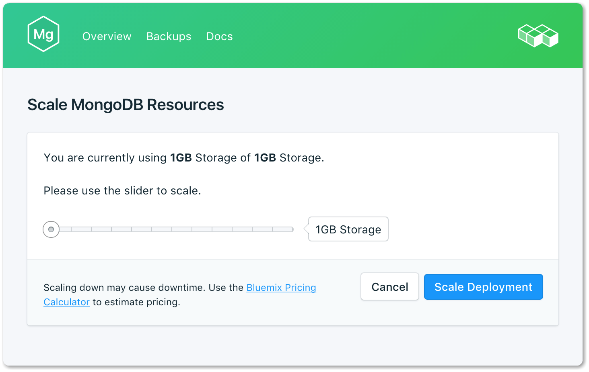
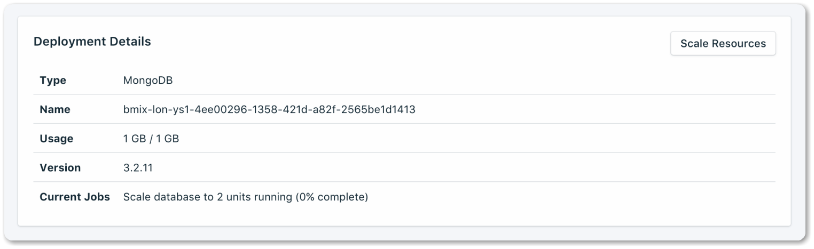
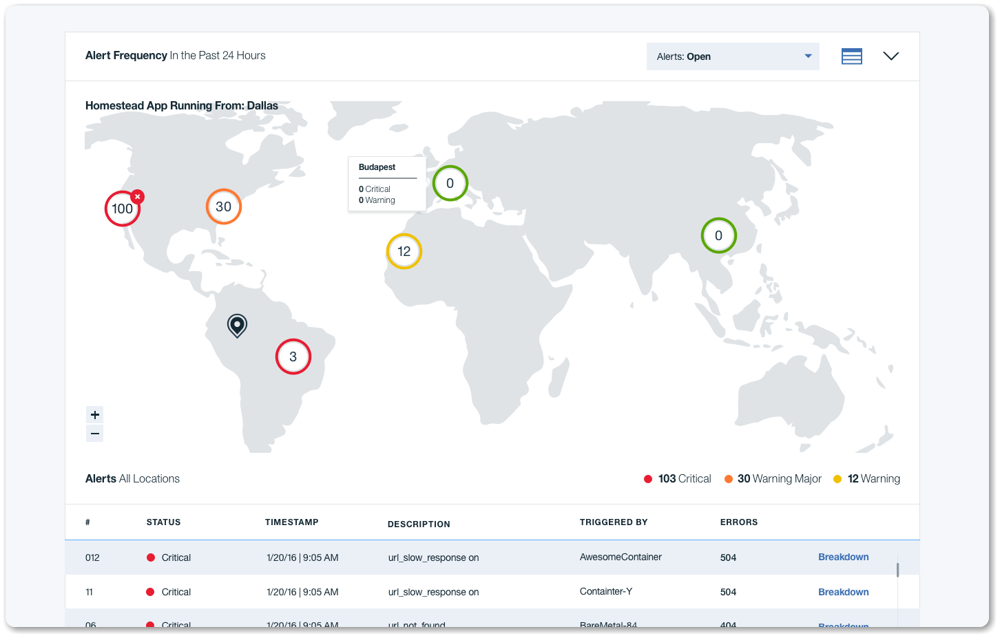

---
copyright:
  years: 2017, 2018
lastupdated: "2018-06-08"

---

{:shortdesc: .shortdesc}
{:new_window: target="_blank"}
{:codeblock: .codeblock}
{:screen: .screen}
{:tip: .tip}
{:pre: .pre}


# Modern web application using MEAN stack

This tutorial walks you through the creation of a web application using the popular MEAN stack. It is composed of a **M**ongo DB, **E**xpress web framework, **A**ngular front end framework and a Node.js runtime. You will learn how to run a MEAN starter locally, create and use a managed database-as-a-service (DBasS), deploy the app to {{site.data.keyword.cloud_notm}} and monitor the application.  

## Objectives

{: #objectives}

- Create and run a starter Node.js app locally.
- Create a managed database-as-a-service (DBasS).
- Deploy the Node.js app to the cloud.
- Scale MongoDB resources.
- Learn how to monitor application performance.

## Services used

{: #products}

This tutorial uses the following {{site.data.keyword.Bluemix_notm}} services:

- [{{site.data.keyword.composeForMongoDB}}](https://console.bluemix.net/catalog/services/compose-for-mongodb)
- [{{site.data.keyword.runtime_nodejs_notm}}](https://console.bluemix.net/catalog/starters/sdk-for-nodejs)

**Attention:** This tutorial might incur costs. Use the [Pricing Calculator](https://console.bluemix.net/pricing/) to generate a cost estimate based on your projected usage.

## Architecture

{:#architecture}

<p style="text-align: center;">

</p>

1. User access the application using a web browser.
2. The Node.js app goes to the {{site.data.keyword.composeForMongoDB}} database to fetch data.

## Before you begin

{: #prereqs}

1. [Install Git](https://git-scm.com/)
2. [Install Bluemix Command Line Tool](https://console.bluemix.net/docs/cli/reference/bluemix_cli/get_started.html#getting-started)


And to develop and run the application locally:
1. [Install Node.js and NPM](https://nodejs.org/)
2. [Install and run MongoDB Community Edition](https://docs.mongodb.com/manual/administration/install-community/)

## Run MEAN app locally

{: #runapplocally}

In this section, you will run a local MongoDB database, clone a MEAN sample code, and run the application locally to use the local MongoDB database.

{: shortdesc}

1. Follow the instructions [here](https://docs.mongodb.com/manual/administration/install-community/) to install and run MongoDB database locally. Once installation completed, use the command below to confirm that **mongod** server is running. using the  Confirm your database is running with the following command.
  ```sh
  mongo
  ```
  {: codeblock}

2. Clone the MEAN starter code.

  ```sh
  git clone https://github.com/IBM-Cloud/nodejs-MEAN-stack
  cd nodejs-MEAN-stack
  ```
  {: codeblock}

3. Install the required packages.

  ```sh
  npm install
  ```
  {: codeblock}

4. Copy .env.example file to .env. Edit the information needed, at a minimum add your own SESSION_SECRET.

5. Run node server.js to start your app
  ```sh
  node server.js
  ```
  {: codeblock}

6. Access your application, create a new user and log in

## Create instance of MongoDB database in the cloud

{: #createdatabase}

In this section, you will create a {{site.data.keyword.composeForMongoDB}} database in the cloud. {{site.data.keyword.composeForMongoDB}} is database-as-a-service that usually easier to configure and provides built-in backups and scaling. You can find many different types of databases in the  [IBM cloud catalog](https://console.bluemix.net/catalog/?category=data).  To create {{site.data.keyword.composeForMongoDB}} follow the steps below.

{: shortdesc}

1. Login to your {{site.data.keyword.cloud_notm}} account via the command line and target your {{site.data.keyword.cloud_notm}} account. 

  ```sh
  ibmcloud login
  ibmcloud target --cf
  ```
  {: codeblock}

  You can find more CLI commands [here.](https://console.bluemix.net/docs/cli/reference/bluemix_cli/get_started.html#getting-started)

2. Create an instance of {{site.data.keyword.composeForMongoDB}}. This can also be done using the [console UI](https://console.bluemix.net/catalog/services/compose-for-mongodb). The service name must be named **mean-starter-mongodb** as the application is configured to look for this service by this name.

  ```sh
  ibmcloud cf create-service compose-for-mongodb Standard mean-starter-mongodb
  ```
  {: codeblock}

## Deploy app to the cloud

{: #deployapp}

In this section, you will deploy the node.js app to the {{site.data.keyword.cloud_notm}} that used the managed MongoDB database. The source code contains a [**manifest.yml**](https://github.com/IBM-Cloud/nodejs-MEAN-stack/blob/master/manifest.yml) file that been configured to use the "mongodb" service created earlier. The application uses VCAP_SERVICES environment variable to access the Compose MongoDB database credentials. This can be viewed in the [server.js file](https://github.com/IBM-Cloud/nodejs-MEAN-stack/blob/master/server.js). 

{: shortdesc}

1. Push code to the cloud.

   ```sh
   ibmcloud cf push
   ```

   {: codeblock}

2. Once the code been pushed, you should be able to view the app in your browser. A random host name been generated that can look like: `https://mean-random-name.mybluemix.net`. You can get your application URL from the console dashboard or command line.


## Scaling MongoDB database resources
{: #scaledatabase}

If your service needs additional storage, or you want to reduce the amount of storage allocated to your service, you can do this by scaling resources.

{: shortdesc}

1. Using the console **dashboard**, go to **connections** section and click on the **MongoDB instance** database.
2. In the **deployment details** panel, click on the  **scale resources** option.
  
3. Adjust the **slider** to raise or lower the storage allocated to your {{site.data.keyword.composeForMongoDB}} database service.
4. Click **Scale Deployment** to trigger the rescaling and return to the dashboard overview. A 'Scaling initiated' message will appear at the top of the page to let you know the rescaling is in progress.
  


## Monitor application performance
{: #monitorapplication}

To check the health of your application, you can use the built-in Availability Monitoring service. The Availability Monitoring service is automatically attached to your applications in the cloud. The availability Monitoring service runs synthetic tests from locations around the world, around the clock to proactively detect and fix performance issues before they impact your visitors. Follow the steps below to get to the monitoring dashboard.

{: shortdesc}

1. Using the console dashboard, under your application, select the **Monitoring** tab.
2. Click **View All Tests** to view the tests.
   


## Related Content

{: #related}

- Set up source control and [continuous delivery](multi-region-webapp.html#devops).
- Secure web application across [multiple regions](multi-region-webapp.html).
- Create, secure and manage [REST APIs](create-manage-secure-apis.html).
