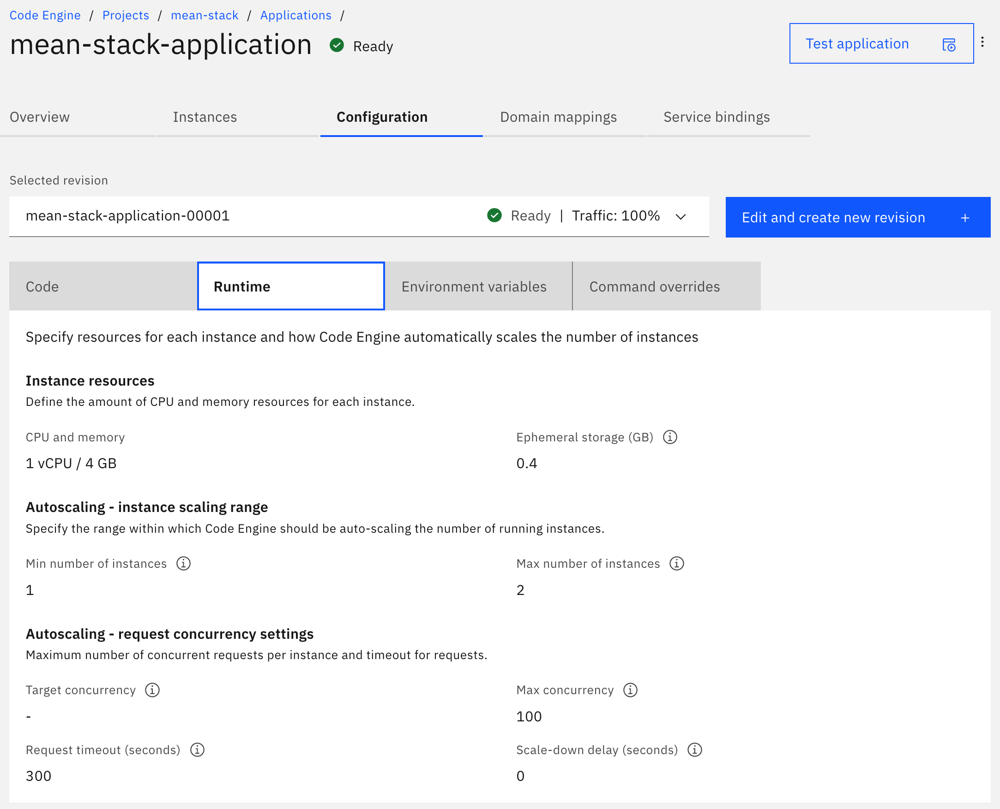
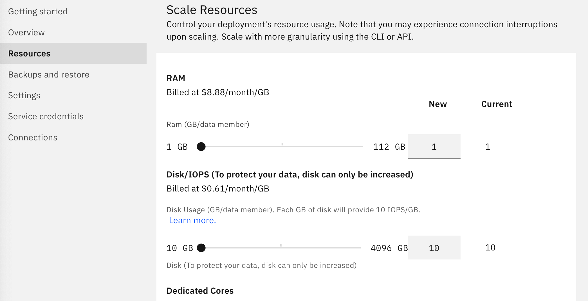

{{site.data.keyword.attribute-definition-list}}


# Modern web application using MEAN stack
{: #mean-stack}
{: toc-content-type="tutorial"}
{: toc-services="codeengine, databases-for-mongodb"}
{: toc-completion-time="1h"}

<!--##istutorial#-->
This tutorial may incur costs. Use the [Cost Estimator](/estimator/review) to generate a cost estimate based on your projected usage.
{: tip}

<!--#/istutorial#-->

This tutorial walks you through the creation of a web application using the popular MEAN stack. It is composed of a **M**ongoDB, **E**xpress web framework, **A**ngular front end framework and a **N**ode.js runtime. You will learn how to run a MEAN sample app locally, create and use a managed database-as-a-service (DBasS), deploy the app to {{site.data.keyword.cloud_notm}} and scale both the runtime and database resources.
{: shortdesc}

## Objectives
{: #mean-stack-0}

- Create and run a sample Node.js app locally.
- Create a managed {{site.data.keyword.databases-for-mongodb}} instance.
- Deploy the Node.js app to the cloud using {{site.data.keyword.codeengineshort}}.
- Scale runtime CPU and memory resources.
- Scale database memory and disk resources.

{: caption="Figure 1. Architecture diagram of the tutorial" caption-side="bottom"}
{: style="text-align: center;"}

1. The user accesses the application using a web browser.
2. The Node.js app running in {{site.data.keyword.codeengineshort}} accesses the {{site.data.keyword.databases-for-mongodb}} database to fetch data.

<!--##istutorial#-->
## Before you begin
{: #mean-stack-prereqs}

This tutorial requires:
* {{site.data.keyword.cloud_notm}} CLI - This CLI tool will enable you to interact with {{site.data.keyword.cloud_notm}}.
   * code-engine/ce plugin (`code-engine/ce`) v 1.29.1 or higher - Plugins extend the capabilities of the {{site.data.keyword.cloud_notm}} CLI with commands specific to a service. The {{site.data.keyword.codeengineshort}} plugin will give you access to {{site.data.keyword.codeengineshort}} commands on {{site.data.keyword.cloud_notm}}.
   * **Optional** {{site.data.keyword.registryshort_notm}} plugin (`container-registry`)
* `git` to clone source code repository.
* **Optional**, if you want to test running the app locally you will need to [install Node.js](https://nodejs.org/){: external}.

You will find instructions to download and install these tools for your operating environment in the [Getting started with tutorials](/docs/solution-tutorials?topic=solution-tutorials-tutorials) guide.

To avoid the installation of these tools you can use the [{{site.data.keyword.cloud-shell_short}}](/shell) from the {{site.data.keyword.cloud_notm}} console.
{: tip}

This tutorial demonstrates the use of the command line to create the database, {{site.data.keyword.codeenginefull}} project and application. There are instructions in the companion [GitHub repository](https://github.com/IBM-Cloud/nodejs-MEAN-stack) to provision with terraform locally on your workstation or even simpler provision with {{site.data.keyword.bpshort}} in just a few clicks.

<!--#/istutorial#-->

## Create an instance of MongoDB database in the cloud
{: #mean-stack-2}
{: step}

In this section, you will create a {{site.data.keyword.databases-for-mongodb}} instance in the cloud. {{site.data.keyword.databases-for-mongodb}} is a database-as-a-service that is easy to configure and provides built-in backups and scaling. You can find many different types of databases in the [{{site.data.keyword.Bluemix_notm}} catalog](/catalog?category=databases#services). To create a {{site.data.keyword.databases-for-mongodb}} instance follow the steps below.

1. If you are not logged in, use `ibmcloud login` or `ibmcloud login --sso` to log in interactively. Target your preferred {{site.data.keyword.cloud_notm}} region and resource group. In the example below we will use the `ca-tor (Toronto)` region and the `default` resource group.

   ```sh
   ibmcloud target -r ca-tor -g default
   ```
   {: codeblock}

   You can find more CLI commands in the [General IBM Cloud CLI (ibmcloud) commands](/docs/cli?topic=cli-ibmcloud_cli) topic in the documentation.

2. Create an instance of {{site.data.keyword.databases-for-mongodb}} via the [command line](/docs/databases-for-mongodb?topic=databases-for-mongodb-provisioning&interface=cli) or use the [console UI](/docs/databases-for-mongodb?topic=databases-for-mongodb-provisioning&interface=ui). The service name must be named **mean-sample-mongodb** as the application used in this tutorial is configured to look for the service by this name. For `<region>`, you can choose a region that is closer to you, however we will use `ca-tor` in this tutorial.

   ```sh
   ibmcloud resource service-instance-create mean-sample-mongodb databases-for-mongodb standard ca-tor
   ```
   {: codeblock}

3. Wait for the instance to be ready. You can check the provisioning status with the following command:
   
   ```sh
   ibmcloud resource service-instance mean-sample-mongodb
   ```
   {: codeblock}

4. Once you have verified the service status changed to "create succeeded", you may proceed to create a service key.
  
   ```sh
   ibmcloud resource service-key-create mean-sample-mongodb-key --instance-name mean-sample-mongodb
   ```
   {: codeblock} 

## Run the MEAN app locally
{: #mean-stack-runapplocally}
{: step}

In this section, you will clone a MEAN sample code and run the application locally to test the connection to the MongoDB database running on {{site.data.keyword.cloud_notm}}.
{: shortdesc}

1. Clone the MEAN sample code.
  
   ```sh
   git clone https://github.com/IBM-Cloud/nodejs-MEAN-stack
   cd nodejs-MEAN-stack
   ```
   {: codeblock}

1. Copy .env.example file to .env.
  
   ```sh
   cp .env.example .env
   ```
   {: codeblock}

1. In the .env file, add your own SESSION_SECRET. For MONGODB_URL and CERTIFICATE_BASE64, run the below command:
  
   ```sh
   ibmcloud resource service-key mean-sample-mongodb-key --output json
   ```
   {: codeblock}

   You can find the value required for **MONGODB_URL** under `credentials -> connection -> mongodb -> composed` and the value for **CERTIFICATE_BASE64** under `credentials -> connection -> mongodb -> certificate -> certificate_base64` in the returned JSON output. Make sure the values added to the `.env` do not include any quotation or space.

1. Optional - Install the required packages.
  
   ```sh
   npm install
   ```
   {: codeblock}
   
1. Optional - Run the application locally. Access the app using the URL provided in the output, create a new user and log in.
  
   ```sh
   node server.js
   ```
   {: codeblock}

## Deploy app to the cloud
{: #mean-stack-4}
{: step}

{{site.data.keyword.codeenginefull}} is a fully managed, serverless platform that runs your containerized workloads, including web apps, microservices, event-driven functions, or batch jobs. In this section, you will create a {{site.data.keyword.codeengineshort}} project and deploy the containerized Node.js app to the project. In the previous section, the source code reads the `.env` that you have locally to obtain the URL and credentials to the MongoDB service. You will create a secret in the project to contain these same keys/values that will be read by the app when it is run.

We've already built a container image for the application and pushed it to the public {{site.data.keyword.registryfull_notm}}. You will use this pre-built container image to deploy the application.
{: shortdesc}

1. Create a project in {{site.data.keyword.codeenginefull_notm}}.
   
   ```sh
   ibmcloud code-engine project create --name mean-stack
   ```
   {: codeblock}

2. Create a secret in the project that contains the keys/values from the `.env` file you used earlier to run the application locally, this secret will be consumed by the application running in the cloud. For more about secrets, see [Setting up and using secrets and configmaps](/docs/codeengine?topic=codeengine-configmap-secret).
   
   ```sh
   ibmcloud code-engine secret create --name mean-stack-secrets --from-env-file .env
   ```
   {: codeblock}

3. Create the application based on the public container image that is based on the same source code downloaded from the `https://github.com/IBM-Cloud/nodejs-MEAN-stack` repository. If you are interested in the steps used to create this image, you can review [create-container-image.md](https://github.com/IBM-Cloud/nodejs-MEAN-stack/blob/master/create-container-image.md){: external}.
   
   ```sh
   ibmcloud code-engine application create --name mean-stack-application --image icr.io/solution-tutorials/tutorial-mean-stack --env-from-secret mean-stack-secrets
   ```
   {: codeblock}

4. Once the code has been pushed, you should be able to view the app in your browser. A host name has been generated that can looks like: `https://mean-stack.<CE_SUBDOMAIN>.ca-tor.codeengine.appdomain.cloud/`. The `CE_SUBDOMAIN` is a variable that is [injected into your project and its value](/docs/codeengine?topic=codeengine-inside-env-vars#inside-env-vars-app){: external} determined during the creation of your project. You can get your application URL from the console dashboard or command line. Once you access the application, it should look like this:

   {: caption="Live App" caption-side="bottom"}

## Scaling the compute resources in {{site.data.keyword.codeengineshort}}
{: #mean-stack-scalecompute}
{: step}

{{site.data.keyword.codeengineshort}} monitors the number of requests in the system and [scales the application](/docs/codeengine?topic=codeengine-app-scale) instances up and down in order to meet the load of incoming requests, including any HTTP connections to your application. If your service needs additional compute resources, or you want to reduce the amount of compute resource allocated you can make these changes in your specific application page.
{: shortdesc}

1. Navigate to the Code Engine [Projects page](/codeengine/projects).
2. Click on the **mean-stack** project created earlier.
2. Under **Summary**, click on **Applications**. 
3. Click on the **mean-stack-application** created earlier. 
4. Click on **Configuration** and then **Runtime** to view the current configuration.

   {: caption="Scale Resources" caption-side="bottom"}
5. Click on **Edit and create new revision** to adjust not only the **CPU and memory**, the **Minimum/Maximum number of instances** as well as the **Concurrency**. 
6. Click on **Save and create** to trigger the changes. It will indicate that the application is `Deploying` and `Ready` when complete.


## Scaling the database resources in {{site.data.keyword.databases-for-mongodb}}
{: #mean-stack-scaledatabase}
{: step}

If your service needs additional storage, or you want to reduce the amount of storage allocated to your service, you can do this by scaling resources.
{: shortdesc}

1. Access the {{site.data.keyword.databases-for-mongodb}} service instance from the [Resource List](/resources) Under **Databases**.
2. Click on the **Resources** panel.
   {: caption="Scale Resources" caption-side="bottom"}
3. Adjust the **slider** to raise or lower the storage allocated to your {{site.data.keyword.databases-for-mongodb}} database service.
4. Click **Scale Deployment** to trigger the rescaling and return to the dashboard overview. It will indicate that the rescaling is in progress.
5. Alternatively configure autoscaling rules to automatically increase the database resources as its usage is increasing.

## Remove resources
{: #mean-stack-6}
{: removeresources}
{: step}

To remove resource, follow these steps:
1. With the command below, delete the project to delete all it's components (applications, jobs and so on).
   ```sh
   ibmcloud code-engine project delete --name mean-stack
   ```
   {: pre}

2. Delete the {{site.data.keyword.databases-for-mongodb}} service key.
   ```sh
   ibmcloud resource service-key-delete mean-sample-mongodb-key
   ```
   {: pre}

3. Delete the {{site.data.keyword.databases-for-mongodb}} service.
   ```sh
   ibmcloud resource service-instance-delete mean-sample-mongodb
   ```
   {: pre}

Depending on the resource it might not be deleted immediately, but retained (by default for 7 days). You can reclaim the resource by deleting it permanently or restore it within the retention period. See this document on how to [use resource reclamation](/docs/account?topic=account-resource-reclamation).
{: tip}

## Related Content
{: #mean-stack-7}

- [Text analysis with Code Engine](/docs/solution-tutorials?topic=solution-tutorials-text-analysis-code-engine)
