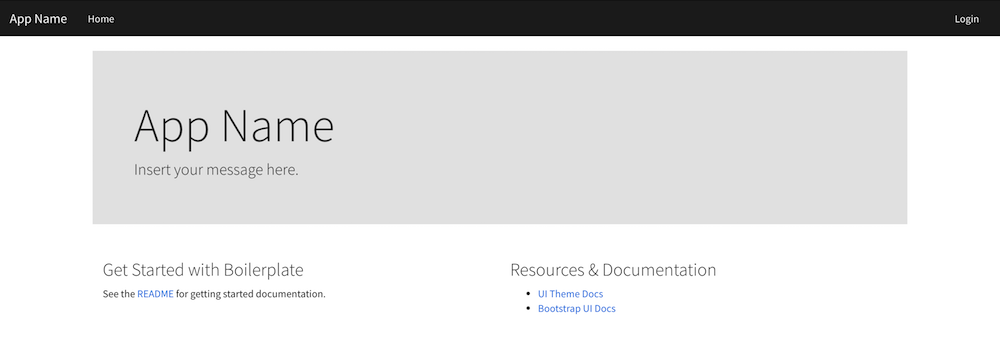

---

copyright:
  years: 2017
lastupdated: "2017-10-23"

---

{:shortdesc: .shortdesc}
{:new_window: target="_blank"}
{:codeblock: .codeblock}
{:screen: .screen}
{:tip: .tip}
{:pre: .pre}


# Modern Web Application using MEAN stack

This solution walks you through the creation of a web application using the popular MEAN stack. It is composed of a **M**ongo DB, **E**xpress web framework, **A**ngular front end framework and a Node.js runtime.

## Objectives

- Create and run a starter Node.js app locally
- Create a MongoDB database on the IBM cloud
- Deploy the Node.js app to the cloud
- Scale MongoDB Resources
- Monitor application performance


## Before you begin

{: #prereqs}

1. [Install Git](https://git-scm.com/)
2. [Install Node.js and NPM](https://nodejs.org/)
3. [Install and run MongoDB Community Edition](https://docs.mongodb.com/manual/administration/install-community/)
4. [Install Cloud Foundry Command Line Tool](https://github.com/cloudfoundry/cli)

## Apps and Services
- SDK for Node.js Cloud Foundry App
- Compose for MongoDB database


## Create and run a starter Node.js app locally
**Configure local MongoDB**  
Open the terminal window and `cd` to the `bin` directory of your MongoDB installation. You can use this terminal window to run all the commands in this tutorial.

Run `mongo` in the terminal to connect to your local MongoDB server.
```sh
   mongo
```

If your connection is successful, then your MongoDB database is already running. If not, make sure that your local MongoDB database is started by following the steps at Install MongoDB Community Edition. Often, MongoDB is installed, but you still need to start it by running mongod. When you're done testing your MongoDB database, type Ctrl+C in the terminal. This guide uses a sample MEAN stack ([MongoDB](https://www.mongodb.org/), [Express](http://expressjs.com/), [AngularJS](https://angularjs.org/) and [Node.js](https://nodejs.org/)) application.  

**Getting Started**  
1. In the terminal window, cd to a working directory. Run the following command to clone the sample repository.
  ```sh
     git clone https://github.com/IBM-Bluemix/nodejs-MEAN-stack
  ```
  This sample repository contains a copy of the [MEAN.js repository](https://github.com/IBM-Bluemix/nodejs-MEAN-stack).
2. Run the following commands to install the required packages.
  ```sh
     cd nodejs-MEAN-stack
     npm install
  ```
3. Rename .env.example file to .env. Edit the contents as needed, at a minimum adding your own SESSION_SECRET.
4. Run node server.js to start your app
  ```
     node server.js
  ```

## Create a MongoDB database on the IBM cloud

In this step we will create a Compose for MongoDB database on the cloud.  
1. Set your Cloud Foundry CLI tool's API endpoint to the IBM cloud  
  ```sh
     bx api https://api.ng.bluemix.net
  ```
2. Login to the IBM cloud via the command line and target your IBM Cloud ORG and SPACE
  ```sh
     bx login
     bx target -o ORG -s SPACE
  ```
  **Note:** ORG is usually your email address and SPACE is the space you created on the cloud. Learn more on ORG and SPACE [here](https://console.bluemix.net/docs/cli/reference/bluemix_cli/bx_cli.html#bluemix_account_spaces).
3. Create the instance of Compose for MongoDB
  ```sh
     bx cf create-service compose-for-mongodb Standard mongodb2
  ```

## Deploy the Node.js app to the cloud

There are many ways in which we can deploy the app to the cloud, the simplest is to push the code by using the following command:

```sh
   bx cf push
```

By running this command, the local code will be pushed to the IBM Cloud  
Note we created an database instance earlier with the name **mongodb**.  Cloud Foundry (on the IBM cloud) will look for the manifest.yml file, then it will find and bind the mongodb database to our application.

Once the code been pushed, you should be able to view the app in your cloud dashboard. After deployment, a random host name is generated and will look something like: **https://mean-random-name.mybluemix.net**




## Scaling MongoDB Resources
{: #database}

If your service needs additional storage, or you want to reduce the amount of storage allocated to your service, you can do this by scaling resources.
1. In the application dashboard, go to **Connections** -> **Click on the MongoDB instance**
2. In the Deployment Details panel, click Scale Resources. The Scale Resources page opens.
  
3. Adjust the slider to raise or lower the storage allocated to the Compose for MongoDB service. Move the slider to the left to reduce the amount of storage, or move it to the right to increase the storage.
4. Click Scale Deployment to trigger the rescaling and return to the dashboard overview. A 'Scaling initiated' message appears at the top of the page to let you know the rescaling is in progress and the Deployment Details pane also shows the scaling in progress.
  When the scaling is complete the Deployment Details pane updates to show the current usage and the new value for the available storage.


## Monitor application performance
{: #monitor}

Lets check the health of your multi-region application,

1. Application **Overview** -> **View toolchain**
2. Click **Add a Tool**
3. Choose **Availability Monitoring** -> **Create Integration**
4. Select **Availability Monitoring** and click on the name of your app.
5. Click **View All Tests**
   

Availability Monitoring constantly runs synthetic tests from locations around the world to proactively detect and fix performance issues before they impact users.


## Summary

In this tutorial, you deployed a MEAN stack application using Compose for MongoDB to the IBM Cloud. We also covered how to scale the database and monitor the application performance.

You learned how to:

- Create and run a basic Node.js app locally
- Create a Compose for MongoDB database on the IBM Cloud
- Deploy the Node.js app to the IBM Cloud
- Scale MongoDB Resources
- Monitor application performance


## Next steps

Advance to the next tutorial to learn how to:

- [Set up source control and continuous delivery](https://dev-console.stage1.bluemix.net/docs/solutions/multi-region-webapp.html)
