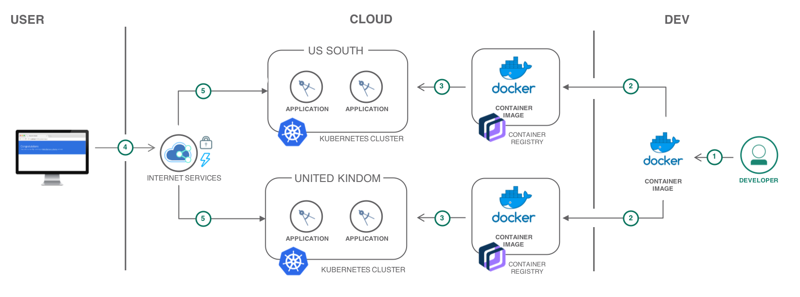
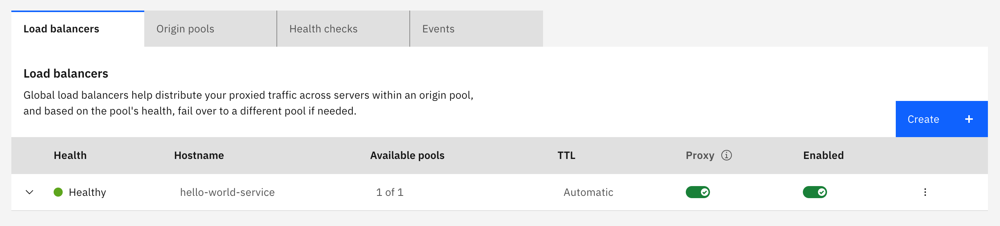
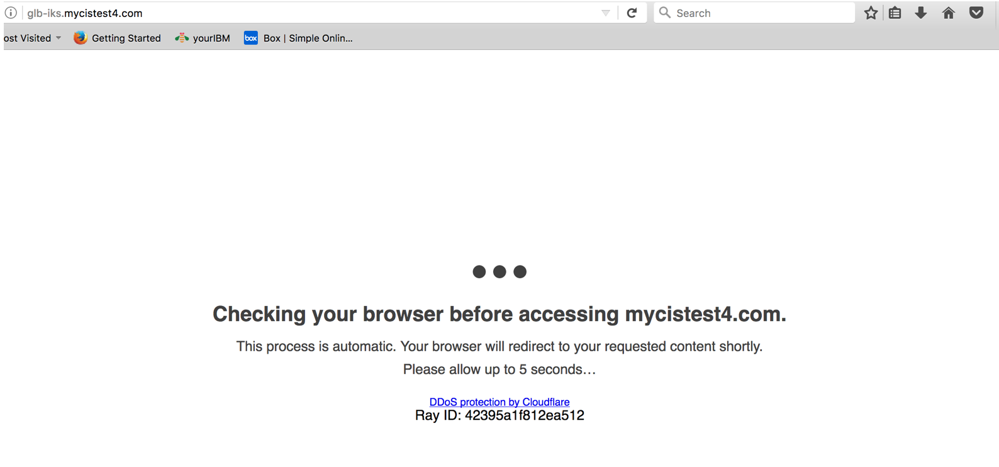
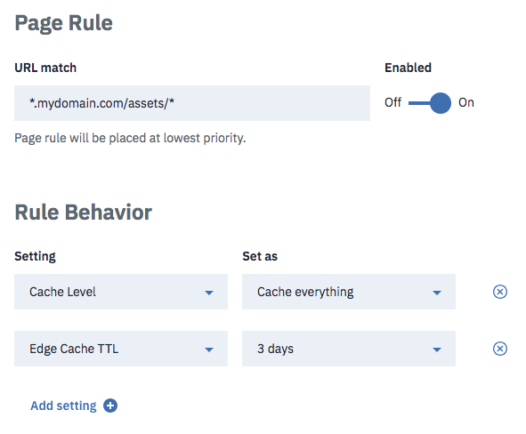

{:step: data-tutorial-type='step'}
{:java: #java .ph data-hd-programlang='java'}
{:swift: #swift .ph data-hd-programlang='swift'}
{:ios: #ios data-hd-operatingsystem="ios"}
{:android: #android data-hd-operatingsystem="android"}
{:shortdesc: .shortdesc}
{:new_window: target="_blank"}
{:codeblock: .codeblock}
{:screen: .screen}
{:tip: .tip}
{:pre: .pre}

# Resilient and secure multi-region Kubernetes clusters with {{site.data.keyword.cis_full_notm}}
{: #multi-region-k8s-cis}
{: toc-content-type="tutorial"}
{: toc-services="containers, Registry, cis"}
{: toc-completion-time="2h"}

<!--##istutorial#-->
This tutorial may incur costs. Use the [Cost Estimator](https://{DomainName}/estimator/review) to generate a cost estimate based on your projected usage.
{: tip}

<!--#/istutorial#-->

Users are less likely to experience downtime when an application is designed with resiliency in mind. When implementing a solution with {{site.data.keyword.containershort_notm}}, you benefit from built-in capabilities, like load balancing and isolation, increased resiliency against potential failures with hosts, networks, or apps. By creating multiple clusters and if an outage occurs with one cluster, users can still access an app that is also deployed in another cluster. With multiple clusters in different locations, users can also access the closest cluster and reduce network latency. For additional resiliency, you have the option to also select the multi-zone clusters, meaning your nodes are deployed across multiple zones within a location.

This tutorial highlights how {{site.data.keyword.cis_short}}, a uniform platform to configure and manage the Domain Name System (DNS), Global Load Balancing (GLB), Web Application Firewall (WAF), and protection against Distributed Denial of Service (DDoS) for internet applications, can be integrated with Kubernetes clusters to support this scenario and to deliver a secure and resilient solution across multiple locations.
{: shortdesc}

## Objectives
{: #multi-region-k8s-cis-objectives}

* Deploy an application on multiple Kubernetes clusters in different locations.
* Distribute traffic across multiple clusters with a Global Load Balancer.
* Route users to the closest cluster.
* Protect your application from security threats.
* Increase application performance with caching.


{: class="center"}
{: style="text-align: center;"}


1. The developer builds a Docker image for the application.
2. The image is pushed to a {{site.data.keyword.registryshort_notm}}.
3. The application is deployed to Kubernetes clusters in Dallas and London.
4. End-users access the application.
5. {{site.data.keyword.cis_full_notm}} is configured to intercept requests to the application and to distribute the load across the clusters. In addition, DDoS Protection and Web Application Firewall are enabled to protect the application from common threats. Optionally assets like images, CSS files are cached.

## Before you begin
{: #multi-region-k8s-cis-prereqs}

This tutorial requires:
* {{site.data.keyword.cloud_notm}} CLI,
   * {{site.data.keyword.containerfull_notm}} plugin (`kubernetes-service`),
* `kubectl` to interact with Kubernetes clusters,

<!--##istutorial#-->
You will find instructions to download and install these tools for your operating environment in the [Getting started with solution tutorials](/docs/solution-tutorials?topic=solution-tutorials-tutorials) guide.
<!--#/istutorial#-->

In addition, make sure you:
- own a custom domain so you can configure the DNS for this domain to point to {{site.data.keyword.cis_full_notm}} name servers.
- and [understand the basics of Kubernetes](https://kubernetes.io/docs/tutorials/kubernetes-basics/).

## Deploy an application to one location
{: #multi-region-k8s-cis-2}
{: step}

This tutorial deploys a Kubernetes application to clusters in multiple locations. You will start with one location, Dallas, and then repeat these steps for London.

### Create a Kubernetes cluster
{: #multi-region-k8s-cis-3}

A minimal cluster with one (1) zone, one (1) worker node and the smallest available size (**Flavor**) is sufficient for this tutorial.


When creating the Kubernetes cluster below:
1. Set **Cluster name** to **my-us-cluster**.
1. Locate in **North America** and **Dallas**

Create the Kubernetes cluster:
- For Kubernetes on VPC infrastructure, you are required to create a VPC and subnet(s) before creating the Kubernetes cluster. You may follow the instructions provided under the [Creating a standard VPC cluster in the console](https://{DomainName}/docs/containers?topic=containers-cluster-create-vpc-gen2&interface=ui).
- For Kubernetes on Classic infrastructure follow the [Creating a standard classic cluster](https://{DomainName}/docs/containers?topic=containers-cluster-create-classic&interface=ui) instructions.
{: #create_cluster}

While the cluster is getting ready, you are going to prepare the application.

### Deploy the application to the Kubernetes cluster
{: #multi-region-k8s-cis-deploy_application}

The cluster should be ready. You can check its status in the [{{site.data.keyword.containershort_notm}}](https://{DomainName}/kubernetes/clusters) console.

1. Gain access to your cluster as described on the Access tab of your cluster. Something like:
   ```bash
   MYCLUSTER=my-us-cluster
   ibmcloud ks cluster config --cluster $MYCLUSTER
   ```
   {: pre}

1. Create the deployment using a pre-built image of the application. The application source code can be found in this [GitHub repository](https://github.com/IBM-Cloud/kubernetes-node-app/){: new_windows}.
   ```bash
   kubectl create deploy hello-world-deployment --image=icr.io/solution-tutorials/tutorial-scalable-webapp-kubernetes
   ```
   {: pre}

   Example output: `deployment "hello-world-deployment" created`.
1. Make the application accessible within the cluster by creating a service:
   ```bash
   kubectl expose deployment/hello-world-deployment --type=ClusterIP --port=80 --name=hello-world-service --target-port=3000
   ```
   {: pre}

   It returns message like `service "hello-world-service" exposed`.  To see the services:

   ```bash
   kubectl get services
   ```
   {: pre}

1. Run the application in the cluster with two replicas:
   ```bash
   kubectl scale deployment hello-world-deployment --replicas=2
   ```
   {: pre}

1. You can check the status of the deployment with the following command:
   ```bash
   kubectl get pods
   ```
   {: pre}

### Get the Ingress Subdomain assigned to the cluster
{: #multi-region-k8s-cis-CSALB_IP_subdomain}

When a Kubernetes cluster is created, it gets assigned an Ingress subdomain (eg. *my-us-cluster.us-south.containers.appdomain.cloud*) and a public Application Load Balancer IP address.

1. Retrieve the Ingress subdomain of the cluster:
   ```bash
   ibmcloud ks cluster get --cluster $MYCLUSTER
   ```
   {: pre}
   
   Look for the `Ingress Subdomain` value.
1. Make note of this information for a later step.

This tutorial uses the Ingress Subdomain to configure the Global Load Balancer. You could also replace the Ingress Subdomain with the public Application Load Balancer, ALB of the cluster. An `<IngressSubdomain>` looks something like `my-us-cluster-e7f2ca73139645ddf61a8702003a483a-0000.us-south.containers.appdomain.cloud`

### Configure the Ingress for your DNS subdomain
{: #multi-region-k8s-cis-ingress}

It will be required to have your own DNS domain name and a global load balancer subdomain will be created below: `<glb_name>.<your_domain_name>`.  Something like hello-world-service.example.com `<glb_name> = hello-world-service` and `<your_domain_name> = example.com`

1. Create the file glb-ingress.yaml and replace the placeholders with their respective values:
   ```bash
   apiVersion: networking.k8s.io/v1
   kind: Ingress
   metadata:
    name: <glb-name>
    annotations:
      kubernetes.io/ingress.class: "public-iks-k8s-nginx"
   spec:
    rules:
    - host: <glb-name>.<your_domain_name>
      http:
        paths:
        - path: /
          pathType: Prefix
          backend:
            service:
              name: hello-world-service
              port:
                number: 80
   ```
   {: pre}

1. Add the ingress instance:
   ```bash
   kubectl apply -f glb-ingress.yaml
   ```
   {: pre}

   It can take a few minutes before ingress becomes available as indicated by a value in the ADDRESS column in the command:
   ```bash
   kubectl get ingress
   ```
   {: pre}

1. Now test by configuring the curl **Host** http header with your DNS subdomain name to override the default of `<IngressSubdomain>`:
   ```bash
   curl --header 'Host: <glb_name>.<your_domain_name>' <IngressSubdomain>/hostname
   ```
   {: pre}

   The curl command would look something like this: `curl --header 'Host: hello-world-service.ibmom.com' my-us-cluster-e7f2ca73139645ddf61a8702003a483a-0000.us-south.containers.appdomain.cloud/hostname`

## And then to another location
{: #multi-region-k8s-cis-0}
{: step}

Repeat the steps from above for the London location with the following replacements:
* In [Create a Kubernetes cluster](#multi-region-k8s-cis-3) replace:
   * the cluster name **my-us-cluster** with **my-uk-cluster**;
   * the location from **North America** and **Dallas** with **Europe** and **London**.
* In the [Deploy the application to the Kubernetes cluster](#multi-region-k8s-cis-deploy_application) replace:
   * Replace the MYCLUSTER= **my-us-cluster** with **my-uk-cluster**
* [Configure the Ingress for the DNS subdomain](#multi-region-k8s-cis-ingress)

## Configure multi-location load-balancing
{: #multi-region-k8s-cis-4}
{: step}

Your application is now running in two clusters but it is missing one component for the users to access either clusters transparently from a single entry point.

In this section, you will configure {{site.data.keyword.cis_full_notm}} ({{site.data.keyword.cis_short_notm}}) to distribute the load between the two clusters. {{site.data.keyword.cis_short_notm}} is a one stop-shop service providing _Global Load Balancer (GLB)_, _Caching_, _Web Application Firewall (WAF)_ and _Page rule_ to secure your applications while ensuring the reliability and performance for your Cloud applications.

To configure a global load balancer, you will need:
* to point a custom domain to {{site.data.keyword.cis_short_notm}} name servers,
* to retrieve the Ingress Subdomain of the Kubernetes clusters,
* to configure health checks to validate the availability of your application,
* and to define origin pools pointing to the clusters.

### Register a custom domain with {{site.data.keyword.cis_full_notm}}
{: #multi-region-k8s-cis-create_cis_instance}

The first step is to create an instance of {{site.data.keyword.cis_short_notm}} and to point your custom domain to {{site.data.keyword.cis_short_notm}} name servers.

1. If you do not own a domain, you can buy one from a registrar.
2. Navigate to [{{site.data.keyword.cis_full_notm}}](https://{DomainName}/catalog/services/internet-services) in the {{site.data.keyword.Bluemix_notm}} catalog.
3. Set the service name, and click **Create** to create an instance of the service.
4. When the service instance is provisioned, click on **Add domain**.
5. Enter your domain name and click **Next**.
6. Setup your DNS records is an optional step and can be skipped for this tutorial. click on **Next**
7. When the name servers are assigned, configure your registrar or domain name provider to use the name servers listed.
8. After you've configured your registrar or the DNS provider, it may require up to 24 hours for the changes to take effect.

   When the domain's status on the Overview page changes from *Pending* to *Active*, you can use the `dig <your_domain_name> ns` command to verify that the new name servers have taken effect.
   {: tip}

### Configure Health Check for the Global Load Balancer
{: #multi-region-k8s-cis-12}

Health Checks monitor responses to HTTP/HTTPS requests from origin pools on a set interval. They are used with origin pools to determine if the pools are still running properly.

1. In the {{site.data.keyword.cis_full_notm}} dashboard, use the left navigation menu to select **Reliability** > **Global Load Balancers**.
1. Select the **Health checks** tab and click **Create**.
   1. Set **Name** to **hello-world-service**
   1. Set **Monitor Type** to **HTTP**.
   1. Set **Port** to **80**.
   1. Set **Path** to **/**.
   1. In the **Configure request headers (optional)** add Header name: `Host` and Value: `<glb_name>.<your_domain_name>`
   1. Click **Create**.

   When building your own applications, you could define a dedicated health endpoint such as */heathz* where you would report the application state.
   {: tip}

### Define Origin Pools
{: #multi-region-k8s-cis-13}

A pool is a group of origin servers that traffic is intelligently routed to when attached to a GLB. With clusters in the United Kingdom and United States, you can define location-based pools and configure {{site.data.keyword.cis_short_notm}} to redirect users to the closest clusters based on the geographical location of the user requests.

#### One pool for the cluster in Dallas
{: #multi-region-k8s-cis-14}

1. Select the **Origin pools** tab and click **Create**.
1. Set **Name** to **US**
1. Set **Origin Name** to **us-cluster**
1. Set **Origin Address** to the kubernetes service `<IngressSubdomain>` printed by `ibmcloud ks cluster get --cluster $MYCLUSTER` for the US cluster
1. Set **Health check** to the one created in the previous section
1. Set **Health Check Region** to **Western North America**
1. Click **Save**

#### One pool for the cluster in London
{: #multi-region-k8s-cis-15}

1. Select the **Origin pools** tab and click **Create**.
1. Set **Name** to **UK**
1. Set **Origin Name** to **uk-cluster**
1. Set **Origin Address** to the kubernetes service `<IngressSubdomain>` printed by `ibmcloud ks cluster get --cluster $MYCLUSTER` for the UK cluster
1. Set **Health check** to the one created in the previous section
1. Set **Health Check Region** to **Western Europe**
1. Click **Save**

#### And one pool with both clusters
{: #multi-region-k8s-cis-16}

1. Select the **Origin pools** tab and click **Create**.
1. Set **Name** to **All**
1. Add two origins:
   1. one with **Origin Name** set to **us-cluster** and the **Origin Address** set to ``<IngressSubdomain>`` in Dallas
   1. one with **Origin Name** set to **uk-cluster** and the **Origin Address** set to ``<IngressSubdomain>`` in London
1. Set **Health Check Region** to **Eastern North America**
1. Set **Health check** to the one created in the previous section
1. Click **Save**

### Create the Global Load Balancer
{: #multi-region-k8s-cis-17}

With the origin pools defined, you can complete the configuration of the load balancer.

1. Select the **Load balancers** tab and click **Create**.
1. Enter a name, `<glb_name>`, under **Name** for the Global Load Balancer. This name will also be part of your universal application URL (`http://<glb_name>.<your_domain_name>`), regardless of the location.
1. Under **Geo routes**, click **Add route**
   1. Select **Default** from the **Region** drop down
   1. Select the pool **All**
   1. Click Add

   Repeat the process to create the following:


   | Region               | Origin Pool |
   | :---------------:    | :---------: |
   |Default               |     All     |
   |Western Europe        |     UK      |
   |Eastern Europe        |     UK      |
   |Northeast Asia        |     UK      |
   |Southeast Asia        |     UK      |
   |Western North America |     US      |
   |Eastern North America |     US      |

   With this configuration, users in Europe and in Asia will be redirected to the cluster in London, users in US to the Dallas cluster. When a request does not match any of the defined route, it will be redirected to the **All origin pool**.

1. Click **Create**

At this stage, you have successfully configured a Global Load Balancer with Kubernetes clusters across multiple locations. You can access the GLB URL `http://<glb_name>.<your_domain_name>/hostname` to view your application. Based on your location, you are redirected to the closest cluster or a cluster from the default pool if {{site.data.keyword.cis_short_notm}} was not able to map your IP address to a specific location.

## Secure the application
{: #multi-region-k8s-cis-secure_via_CIS}
{: step}

### Turn the Web Application Firewall On
{: #multi-region-k8s-cis-20}

The Web Application Firewall(WAF) protects your web application against ISO Layer 7 attacks. Usually, it is combined with grouped rule-sets, these rule-sets aim to protect against vulnerabilities in the application by filtering out malicious traffic.

1. In the {{site.data.keyword.cis_full_notm}} dashboard, navigate to **Security**, then on the **WAF**.
1. Ensure the WAF is **On**.
1. Click **OWASP Rule Set**. From this page, you can review the **OWASP Core Rule Set** and individually enable or disable rules. When a rule is enabled, if an incoming request triggers the rule, the global threat score will be increased. The **Sensitivity** setting will decide whether an **Action** is triggered for the request.
   1. Leave default OWASP rule sets as it is.
   1. Set **Sensitivity** to `Low`.
   1. Set **Action** to `Simulate` to log all the events.
1. Click **CIS Rule Set**. This page shows additional rules based on common technology stacks for hosting websites.

For a secured connection with HTTPS, you can either obtain a certificate from [Let's Encrypt](https://letsencrypt.org/) as described in the following [{{site.data.keyword.cloud}} blog](https://www.ibm.com/cloud/blog/secure-apps-on-ibm-cloud-with-wildcard-certificates) or through [{{site.data.keyword.secrets-manager_full_notm}}](https://{DomainName}/docs/secrets-manager?topic=secrets-manager-certificates#order-certificates).
{: tip}

### Increase performance and protect from Denial of Service attacks
{: #multi-region-k8s-cis-proxy_setting}

A distributed denial of service ([DDoS](https://en.wikipedia.org/wiki/Denial-of-service_attack)) attack is a malicious attempt to disrupt normal traffic of a server, service, or network by overwhelming the target or its surrounding infrastructure with a flood of internet traffic. {{site.data.keyword.cis_short_notm}} is equipped to protect your domain from DDoS.

1. In the {{site.data.keyword.cis_short_notm}} dashboard, select **Reliability** > **Global Load Balancer**.
1. Locate the GLB you created in the **Load Balancers** table.
1. Enable the Security and Performance features in the **Proxy** column:

   

**Your GLB is now protected**. An immediate benefit is that the origin IP addresses of your clusters will be hidden from the clients. If {{site.data.keyword.cis_short_notm}} detects a threat for an upcoming request, the user may see a screen like this one before being redirected to your application:

   

In addition, you can now control what content gets cached by {{site.data.keyword.cis_short_notm}} and how long it stays cached. Go to **Performance** > **Caching** to define the global caching level and the browser expiration. You can customize the global security and caching rules with **Page Rules**. Page Rules enable fine-grained configuration using specific domain paths. As example with Page Rules, you could decide to cache all contents under **/assets** for **3 days**:

   

## Remove resources
{: #multi-region-k8s-cis-6}
{: removeresources}
{: step}

### Remove Kubernetes Cluster resources
{: #multi-region-k8s-cis-23}

1. Remove the Ingress, you can do so by running the following command:
   ```bash
   kubectl delete -f glb-ingress.yaml
   ```
   {: pre}

1. Remove the service, you can do so by running the following command:
   ```bash
   kubectl delete service hello-world-service
   ```
   {: pre}

1. Remove the deployment, you can do so by running the following command:
   ```bash
   kubectl delete deployment hello-world-deployment
   ```
   {: pre}

1. Delete the clusters if you created them specifically for this tutorial.

### Remove {{site.data.keyword.cis_short_notm}} resources
{: #multi-region-k8s-cis-24}

1. Remove the GLB.
1. Remove the origin pools.
1. Remove the health checks.
1. Update the DNS for your custom domain.
1. Delete the {{site.data.keyword.cis_short_notm}} instance if you created it specifically for this tutorial.

## Related content
{: #multi-region-k8s-cis-7}
{: related}

* [{{site.data.keyword.cis_full_notm}}](https://{DomainName}/docs/cis?topic=cis-getting-started)
* [Manage your IBM {{site.data.keyword.cis_short_notm}} for optimal security](https://{DomainName}/docs/cis?topic=cis-manage-your-ibm-cis-for-optimal-security#manage-your-ibm-cis-for-optimal-security)
* [{{site.data.keyword.containershort_notm}}](https://{DomainName}/docs/containers)
* [Deploying single instance apps to Kubernetes clusters](https://{DomainName}/docs/containers?topic=containers-cs_cluster_tutorial)
* [Best practice to secure traffic and internet application via {{site.data.keyword.cis_short_notm}}](https://{DomainName}/docs/cis?topic=cis-manage-your-ibm-cis-for-optimal-security#best-practice-configure-security-level-selectively)
* [Improving App Availability with Multizone Clusters](https://www.ibm.com/cloud/blog/announcements/improving-app-availability-multizone-clusters)
