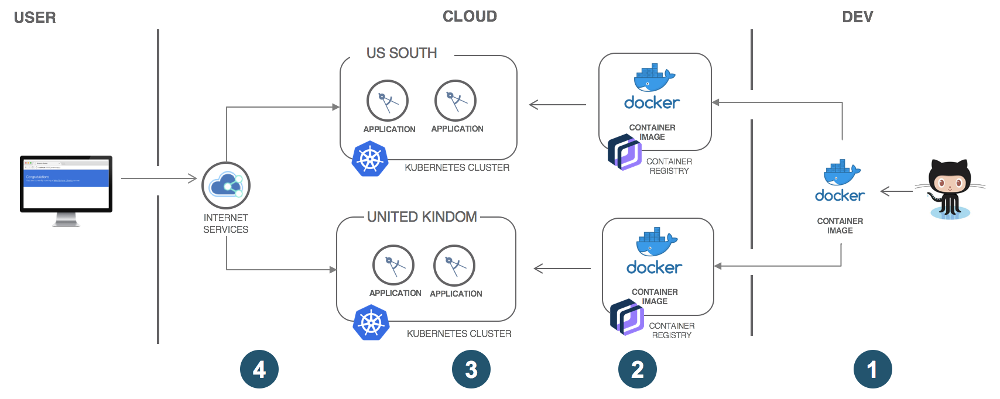
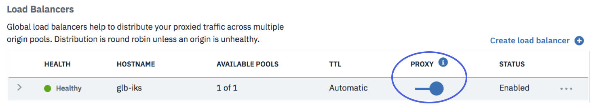

---
copyright:
  years: 2018
lastupdated: "2018-05-29"

---

{:java: #java .ph data-hd-programlang='java'}
{:swift: #swift .ph data-hd-programlang='swift'}
{:ios: #ios data-hd-operatingsystem="ios"}
{:android: #android data-hd-operatingsystem="android"}
{:shortdesc: .shortdesc}
{:new_window: target="_blank"}
{:codeblock: .codeblock}
{:screen: .screen}
{:tip: .tip}
{:pre: .pre}

# Secure and resilient multi-region Kubernetes clusters with Cloud Internet Services
Generally, Kubernetes cluster ensures containerized appliation HA with multiple workers grouped within cluster. When certain worker does not work, the other workers within the same cluster will serve the internet requests which is apprarent to users. Furthermore, to provide HA at zone level by putting workers in multiple zones within the same region and eventually you would want more regions. This is not only for resiliency but also serving the requests closer to the users. 

This tutorial highlights how Cloud Internet Services can be integrated with Kubernetes clusters to deliver a secure and resilient solution across multiple regions.  

* IBM Cloud Internet Services(CIS) is a uniform platform to configure and manage the Domain Name System (DNS), Global Load Balancing (GLB), Web Application Firewall (WAF), and protection against Distributed Denial of Service (DDoS) for internet applications.  

* {{site.data.keyword.containershort}}(IKS) delivers powerful tools by combining Docker and Kubernetes technologies, an intuitive user experience, and built-in security and isolation to automate the deployment, operation, scaling, and monitoring of containerized apps in a cluster of compute hosts.

## Objectives
{: #objectives}

* Use CIS as global load-balancer with multiple cluster deployment
  * use GLB to load balance between clusters
  * use GLB Geo targets to send users to the closest cluster

* Use CIS in front of a kubernetes cluster to implement 
  * content caching with CDN
  * and security with DDoS, WAF

## Services used
{: #services}


This tutorial uses the following runtimes and services:
* IBM Cloud [Internet services](https://console.bluemix.net/catalog/services/internet-services)
* [{{site.data.keyword.registrylong_notm}}](https://console.bluemix.net/containers-kubernetes/launchRegistryView)
* [{{site.data.keyword.containershort_notm}}](https://console.bluemix.net/containers-kubernetes/catalog/cluster)

This tutorial would incur costs. Use the [Pricing Calculator](https://console.bluemix.net/pricing/) to generate a cost estimate based on your projected usage.

## Architecture
{: #architecture}

<p style="text-align: center;">

  
</p>

1. The developer builds the application produces a Docker container image and pushes the image to IBM Container Registry

2. Deploy image from IBM Container Registry to corresponding clusters in {{site.data.keyword.containershort_notm}} 

3. Scale up and expose service for containerized appliation so being able to access

4. CIS GLB intercepts the requests and routes them to the regional clusters。Inside the cluster, the Kubernetes Ingress balances the requests between the worker nodes. 

5. When proxy mode is enabled, CIS GLB is in DDoS protection also caching service.

## Before you begin
{: #prereqs}

* [Install Git](https://git-scm.com/)
* [Install {{site.data.keyword.Bluemix_notm}} CLI](https://console.bluemix.net/docs/cli/reference/bluemix_cli/get_started.html#getting-started)
* [IBM Cloud Developer Tools](https://github.com/IBM-Cloud/ibm-cloud-developer-tools) - Script to install docker, kubectl, helm, bx cli and required plug-ins
* [Set up the {{site.data.keyword.registrylong_notm}} CLI and your registry namespace](https://console.bluemix.net/docs/services/Registry/registry_setup_cli_namespace.html)
* [Understand the basics of Kubernetes](https://kubernetes.io/docs/tutorials/kubernetes-basics/)

## Overal Flow
* Create clusters
* Build images and push to regional registries
* Deploy app to both clusters
* Configure CIS with custom domain
* Configure CIS global balancer
    * Create health check
    * Create origin pools
        * refer to the option to configure geo-pool to route users to closest cluster
    * Deploy custom domain Ingress
* Enable CIS DDOS + WAF

## Create Kubernetes clusters per region
{: #create_clusters}

Create two clusters, one in UK region and one in US region. It simulates the scenario of containerized apps running in different regions with {{site.data.keyword.containerlong}} on IBM Cloud. 

1. Create **Containers in Kubernetes Clusters** from the [{{site.data.keyword.Bluemix}} catalog](https://console.bluemix.net/containers-kubernetes/catalog/cluster/create) and choose the **Standard** cluster.
2. Select **Region**, e.g. `United Kingdom`. For convenience, use the name 　*`my-<region>-cluster`* to be consistent with this tutorial, specify *\<region>* to match with region selected, e.g. *uk* so cluster name looks like *my-uk-cluster*.
3. The smallest **Machine type** with 2 **CPUs** and 4 **GB RAM** is sufficient for this tutorial. Select 2 **Worker nodes** and leave all other options set to defaults. Click **Create Cluster**.
4. Check the status of your **Cluster** and **Worker Node** and wait for them to be **ready**.

**NOTE:** Do not proceed until your workers are ready.

Repeat steps above for the other region you'd like to have cluster by selecting different **region**, e.g. repeat the previous steps to deploy another cluster in US South, select **regionn** `US South`, specify cluster name *my-us-cluster*.

**`CHECKPOINT 1`** - Now Kubernetes cluster across two regions are ready, keep moving with below steps to build, deployment and run containerized applications within the clusters.

## Target IBM Cloud CLI for your cluster and login IBM Cloud Registry correspondingly
{: #prep_steps}

IBM Cloud CLI is working environment for Kuberetes cluster, different context of CLI for different Kuberetes cluster. Ensure to work with the resources within cluster context for specific Kubernetes cluster, such as deployment, services, pod, etc..

**Notes:** Don't switch IBM Cloud CLI context until needed resources configured for your specific Kubernetes cluster. Since there are different clusters across multiple regions, repeat this step for clusters one by one which contain the applications being as the target for distributed requests from load balancer. 

### Login IBM Cloud CLI and set context for kubenetes cluster in your CLI
1. Get the command to set the environment variable and download the Kubernetes configuration files.
    ```bash
    bx cs cluster-config <cluster_name_or_ID>
    ```
    {: pre}
2. Copy and paste the output to set the KUBECONFIG environment variable.
    ```bash
    export KUBECONFIG=/Users/<user_name>/.bluemix/plugins/container-service/clusters/<cluster_name>/kube-config-<location>-<cluster_name>.yml
    ```
    {: pre}
3. Check cluster region and specify it via `bx cs region-set` when needed
### Login IBM Container Registry and Create Namespace correspondingly
1. Login to IBM Container Registry CLI 
    ```bash
    bx cr login
    ```
    {: pre}
2. Check Container Registry Region and ensure it is the same as the one of cluster in previous step via IBM Cloud CLI. If not matching, specify Container Registry region via `bx cr region-set`. Take note for the **region** which will be used for following steps.
3. Container Registry is the repository containing the Docker images for containerized applications in Kubernetes cluster, create custom namespace per your requirement. 
    ```bash
    bx cr namespace-add <your_namespace>
    ```
    {: pre}
    Please be aware that following steps need to run agaist the same namespace. Take note of **namespace** via `br cr namespaces` 

## Build and Deploy application to Kubernetes Clusters across different regions
{: #run_app_in_kubernete_cluster}

Docker image is built and tagged then pushed to certain IBM Container Registry. After that, it is deployed to corresponding Kubernetes cluster in the same region as IBM Container Registry, e.g. `United Kingdom`. For multiple workers, scale the containerized app via `ReplicaSet`. Expose the accessible port by specifying `NodeType` service. Then repeat these steps against different Region such as `US South` with the same image built. So the application will be running in different cluster among multiple regions.

### Build application producing Docker image and deploy it to Kubernete clusters
This step shows how to prepare Docker image for Kubernetes cluster containerized application.   HelloWorld simulates real application. Refer step 1/2 and step6/7/8 of IKS tutorial [Deploying single instance apps to Kubernetes clusters](https://console.bluemix.net/docs/containers/cs_tutorials_apps.html#cs_apps_tutorial_lesson1){:new_windows} to build, tag and push Docker image into IBM Cloud Registry which would be refered during deployment for containerized app.

1. Clone the source code for the [Hello world app](https://github.com/IBM/container-service-getting-started-wt){:new_windows} to your user home directory. The repository contains different versions of a similar app in folders that each start with Lab.
    ```bash
    git clone https://github.com/IBM/container-service-getting-started-wt.git
    ```
   {: pre} 
2. Navigate to the `Lab 1` directory.
    ```bash
    cd 'container-service-getting-started-wt/Lab 1'
    ```
    {: pre}
3. Start Docker.
    * If you are using Docker Community Edition, no action is needed.
    * If you are using Linux, follow the [Docker documentation](https://docs.docker.com/config/daemon/) to find instructions about how to start Docker depending on the Linux distribution that you use.
    * If you are using Docker Toolbox on Windows or OSX, you can use the Docker Quickstart Terminal, which starts Docker for you. Use the Docker Quickstart Terminal for the next few steps to run the Docker commands and then switch back to the CLI where you set the KUBECONFIG session variable.
4. Build and push Docker image
    * Build a Docker image that includes the app files of the `Lab 1` directory. If you need to make a change to the app in the future, repeat these steps to create another version of the image. 
        ```bash
        docker build --tag registry.<region>.bluemix.net/<namespace>/hello-world:1 .
        ```
        {: pre}
        Ensure the period `.` at the end of the command.{:tip} 
    * Push docker image built above to Container Registry. It will be referred by containerized application in pods. Be sure to login CR before push via `bx cr login`.
        ```bash
        docker push registry.<region>.bluemix.net/<namespace>/hello-world:1
        ```
        {:pre}
5. Deployments are used to manage pods, which include containerized instances of an application. The following command deploys the app in single pod. For the purposes of this tutorial, the deployment is named hello-world-deployment, but you can give it any name that you want. If you used the Docker Quickstart terminal to run Docker commands, be sure that you switch back to the CLI that you used to set the KUBECONFIG session variable.
    ```bash
    kubectl run hello-world-deployment --image=registry.<region>.bluemix.net/<namespace>/hello-world:1
    ```
    {: pre}
      Example output: `deployment "hello-world-deployment" created`
### Scale up and expose service for access
1. A `replica` is how Kubernetes accomplishes scaling out a deployment. A replica is a copy of a pod that already contains a running service. By having multiple replicas of a pod, you can ensure your deployment has the available resources to handle increasing load on your application.
    ```bash
    kubectl scale deployment/hello-world-deployment --replicas=2
    ```
     {: pre} 
     It returns message like `deployment.extentions "deployment/hello-world-deployment" scaled`.
     
2. Make the app accessible by exposing the deployment as a NodePort service. 
    ```bash
    kubectl expose deployment/hello-world-deployment --type=NodePort --port=80 --name=hello-world-service --target-port=8080
    ```
    {: pre} 
    It returns message like `service "hello-world-service" exposed`.

Repeat the above steps to deploy the image and the application to the other region like `US South`. 

**Notes:**Remember to switch CLI for target cluster and login correspoding container registry in other region accordingly.

**`CHECKPOINT 2`** - the applications are deployed to different clusters across multiple regions, e.g. `United Kindom` and `US South`. 

## Create Instance of IBM Cloud Internet Services and register the custom domain 
{: #create_cis_instance}

Cloud Internet Services(CIS) is one stop-shop service providing GLB, Caching, WAF/Page rule to secure your applications when ensurig the reliability and performace for your Cloud applicatios. 1st step to create instance per domain and then register the domain.

1. Buy a domain from a registrar such as [http://godaddy.com](http://godaddy.com).
2. Navigate to the [Internet Services](https://console.bluemix.net/catalog/services/internet-services) in the {{site.data.keyword.Bluemix_notm}} catalog. 
2. Enter a service name, and click **Create** to create an instance of the service.
3. When the service instance is provisioned, set your domain name and click **Add domain**.
4. When the name servers are assigned, configure your registrar or domain name provider to use the name servers listed.
5. After you've configured your registrar or the DNS provider, it may require up to 24 hours for the changes to take effect.
  
    When the domain's status on the Overview page changes from *Pending* to *Active*, you can use the `dig <your_domain_name> ns` command to verify that the IBM Cloud name servers have taken effect.
    {:tip}

## Configure CIS GLB for clusters and create Kubenetes Cluster Ingress Resource per region
{: #LB_setting}

For now, your applications have been running within the kubernetes clusters across different regions. To expose its public access of cluster and route access to corresponding application, Ingress resource will be created and configured. Either with Kubernetes cluster's ALB public IP or its Ingress Sub-domain, Global Load Balancer (GLB) in IBM Cloud Internet Services will be created to manage the traffic across multiple regions. The GLB utilizes an origin pool which allows for the traffic to be distributed to multiple origins. This way, it provides high availability and ensures the reliability of the applications cross multiple regions.

### Take notes of Kubernetes Cluster ALB IP, Ingress Sub-domain 
{: #CSALB_IP_subdomain}
1. When Kubernetes cluster gets created, its Application Load Balancer(ALB) public IP, Sub-domain are generated automatically. Take notes of IP and sub-domain for each clusters. Kubernetes cluster name can be got via `bx cs clusters`
    ```bash
    bx cs albs -cluster <cluster-name>
    bx cs cluster-get <cluster-name>
    ```

### Create and Configure Global Load Balancer(GLB) of Cloud Internet Services
{: #add_glb}

As pre-requisites to configure GLB, first to create heath check and origin pools. 

#### Create health check for the GLB.
1. In the Cloud Internet Services application, navigate to **Reliability** > **Global Load Balancer**, and at the bottom of the page, click **Create health check**.
2. Enter "/" as the path to monitor and select a type (HTTP or HTTPS). Typically you can create a dedicated health endpoint. Click **Provision 1 Instance**. 

    The path can be specified per your application and requirement.{:Tips}

#### Define origin pools with needed origin.
1. Click **Create Pool**.
2. Set **name** to `_iks_uk_pool_` for the pool, select the health check that you've just created, and a region that is close to the region of your kubernetes cluster.
3. Set **Origin Name** to `_iks_uk_pool_`. 
4. Set **Origin Address** to `my_uk_cluster.eu-gb.containers.appdomain.cloud` which is UK cluster sub-domain or its ALB IP address.
5. Click **Provision 1 Instance**.
After the 1st pool `_iks_uk_pool_` created, repeat above five steps by set right pool name, **Original Name** and **Original Address** so to create other two pools, naming `_iks_us_pool_`, `iks_all_origins` accordingly.
    The origins in the same pool get the forwarded requests in Round-robin way.{:Tips}

#### With origin pools defined to complete GLB creation and configuration
1. Click **Create Load Balancer**. 
2. Enter a name under **Balancer hostname** for the Global Load Balancer. This name will also be part of your universal application URL (`http://<glb_name>.<your_domain_name>`), regardless of the region. 
3. Click **Add pool** under **Default origin pools** and select the origin pool that you have just created `_iks_all_origins_`.
4. Expand section of **Configure geo routes(optional)**, click **Add route**, select a region and click **Add**, then click **Add pool** to add origin pool for this Region. Region refers to where requests submmited and origin pool includes the application to serve the requests. For this tutorial, 
    * add route for region *Northeast Asia* and regionn *Southeast Asia* with origin pointing to UK cluster `_iks_uk_pool_`. The requests submmited from Asia will be routed to the nearest applications running in region United Kingdom.
    * add route for region *Eastern North America* and regionn *Western North America* with origin pointing to US cluster `_iks_us_pool_`. The requests submmited from North America will be routed to the nearest applications running in region US South.
    * if request submitted not matching any definend region in route, it will be distributed to origins defined in **Default origin pools**.
5. Click **Provision 1 Instance**.

For now, GLB is configured to distribute the requests to corresponding clusters across multiple regions via origin pools. According to geo routes, requests will be routed to the closest region, e.g. for requests submmited in Asia, those will be routed to the closest `United Kingdom` region.

### Create Ingress Resource for Kubernetes clusters per region
* Create Ingress yaml file
    1. input Ingress Resource **name**
    2. specify **host** with GLB url created above
    3. enter app path of the request
        *  **serviceName** - containerized app name, get it via `kubectl get services`
        *  **servicePort** - the port to access your specified path of app, get it via `kubectl get services`
    ```bash
   apiVersion: extensions/v1beta1
   kind: Ingress
    metadata:
      name: ing-uk-hui
    spec:
      rules:
        - host: glb-helloworld.mycistest4.com
          http:
            paths:
            - path: /
              backend:
                serviceName: <application-service-name> 
                servicePort: 80
    ```
* Create Ingress resource for cluster. Ensure IBM Cloud CLI context for your cluster{:tip}
    ```bash
    kubectl create -f <Ingress_resource_filename>.yaml
    ```
    It returns message like `ingress.extention "ingress_name" created`
* List Ingress resource created, newly created ingress would be shown
    ```bash
    kubectl get ingress
    ```
Repeat above steps to create Ingress for other region cluster, e.g. cluster in region `US South`

**`CHECKPOINT 3`** - **Congratulations!** For now, CIS GLB is configured before Kubernetes cluster across multiple-regions (for this example, *`United Kindom`* and *`US South`*). So the requests would be routed to cluster according to location of request and GLB pool setting(geo route and default pools) and then to application per rule defined in Kubernetes cluster ingress resource.

## Secure applications in Kubernetes clusters 
{: #proxy_setting}

Enable proxy mode providing DDoS protection and Caching
Toggle ON proxy besides CIS GLB, it enables DDoS protection and caching for GLB so to applications defined in Kubernetes cluster. Use `dig _<glb_name>.<domain_name>`, original IP address is hid. All of your clients connect to CIS proxies.
   
[Best practice to secure traffic and internet application via CIS](https://console.bluemix.net/docs/infrastructure/cis/managing-for-security.html#manage-your-ibm-cis-for-optimal-security)

**`CHECKPOINT 4`** - DDoS protection and cachinng are enabled for application runnning in cluster. After proxy is enabled and when access submmited via GLB URL plus application path, similar page like below shown which tell all access to your application would be under DDoS protection.    

## Remove resources
{:removeresources}

Remove Kubernetes Cluster resources
* remove ingress
* remove pods
* remove service
* remove worknodes
* remove clusters

Remove CIS resources
* remove GLB
* remove origin pool
* remove health check

## Related content
{:related}_
* IBM Cloud [Internet Services](https://console.bluemix.net/docs/infrastructure/cis/getting-started.html#getting-started-with-ibm-cloud-internet-services-cis-)
* [Manage your IBM CIS for optimal security](https://console.bluemix.net/docs/infrastructure/cis/managing-for-security.html#best-practice-2-configure-your-security-level-selectively)
* [{{site.data.keyword.containershort_notm}}](https://console.bluemix.net/docs/containers/cs_planning.html#cs_planning)
* [{{site.data.keyword.registrylong_notm}} Basic](https://console.bluemix.net/docs/services/Registry/registry_overview.html#registry_planning)
