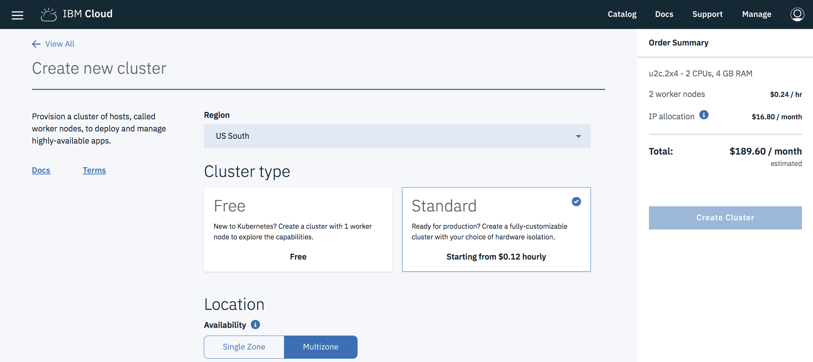

---
copyright:
  years: 2018
lastupdated: "2018-05-29"

---

{:java: #java .ph data-hd-programlang='java'}
{:swift: #swift .ph data-hd-programlang='swift'}
{:ios: #ios data-hd-operatingsystem="ios"}
{:android: #android data-hd-operatingsystem="android"}
{:shortdesc: .shortdesc}
{:new_window: target="_blank"}
{:codeblock: .codeblock}
{:screen: .screen}
{:tip: .tip}
{:pre: .pre}

# Secure and resilient multi-region Kubernetes clusters with Cloud Internet Services
This tutorial highlights how Cloud Internet Services can be integrated with Kubernetes clusters to deliver a secure and resilient solution across multiple regions.  

* IBM Cloud Internet Services(CIS) is a uniform platform to configure and manage the Domain Name System (DNS), Global Load Balancing (GLB), Web Application Firewall (WAF), and protection against Distributed Denial of Service (DDoS) for internet applications.  

* IBM Cloud Kubernetes Service(IKS) delivers powerful tools by combining Docker and Kubernetes technologies, an intuitive user experience, and built-in security and isolation to automate the deployment, operation, scaling, and monitoring of containerized apps in a cluster of compute hosts.

## Objectives
{: #objectives}

* Use CIS in front of a kubernetes cluster
to implement 
  * content caching with CDN
  * and security with WAF

* Use CIS as global load-balancer with multiple cluster deployment
  * use GLB to load balance between clusters
  * use GLB Geo targets to send users to the closest cluster

## Services used
{: #services}


This tutorial uses the following runtimes and services:
* IBM Cloud [Internet services](https://console.bluemix.net/catalog/services/internet-services)
* [{{site.data.keyword.registrylong_notm}}](https://console.bluemix.net/containers-kubernetes/launchRegistryView)
* [{{site.data.keyword.containershort_notm}}](https://console.bluemix.net/containers-kubernetes/catalog/cluster)

This tutorial may incur costs. Use the [Pricing Calculator](https://console.bluemix.net/pricing/) to generate a cost estimate based on your projected usage.

## Architecture
{: #architecture}

<p style="text-align: center;">

  
</p>

First of all, create IKS clusters across multipls regions and instance of CIS service, then -

1. The developer builds the application produces a Docker container image and pushes the image to IBM Container Registry

2. Deployed image from IBM Container Registry to corresponding clusters in {{site.data.keyword.containershort_notm}} 

3. Run application, scale up and expose service for access

4. Create CIS GLB and IKS Ingress so the requests can be distributed to application hosted among different multi-region clusters

## Before you begin
{: #prereqs}

* [Install Git](https://git-scm.com/)
* [Install {{site.data.keyword.Bluemix_notm}} CLI](https://console.bluemix.net/docs/cli/reference/bluemix_cli/get_started.html#getting-started)
* [IBM Cloud Developer Tools](https://github.com/IBM-Cloud/ibm-cloud-developer-tools) - Script to install docker, kubectl, helm, bx cli and required plug-ins
* [Set up the {{site.data.keyword.registrylong_notm}} CLI and your registry namespace](https://console.bluemix.net/docs/services/Registry/registry_setup_cli_namespace.html)
* [Understand the basics of Kubernetes](https://kubernetes.io/docs/tutorials/kubernetes-basics/)

## Create Kubernetes clusters
{: #create_clusters}

### Create Kubernetes clusters in region `United Kingdom`
1. Create **Containers in Kubernetes Clusters** from the [{{site.data.keyword.Bluemix}} catalog](https://console.bluemix.net/containers-kubernetes/catalog/cluster/create) and choose the **Standard** cluster.

   
2. Select region `United Kingdom`. For convenience, use the name `my-uk-cluster` to be consistent with this tutorial.
3. The smallest **Machine type** with 2 **CPUs** and 4 **GB RAM** is sufficient for this tutorial. Select 3 **Worker node** and leave all other options set to defaults. Click **Create Cluster**.
4. Check the status of your **Cluster** and **Worker Node** and wait for them to be **ready**.

### Create Kubernetes clusters in region `US South`
* Repeat step above while region seleted is `US South` and name `my-us-cluster`

**NOTE:** Do not proceed until your workers are ready.

## Create Instance of IBM Cloud Internet Services and register the custom domain 

{: #domain_cis}

1. Buy a domain from a registrar such as [http://godaddy.com](http://godaddy.com).
2. Navigate to the [Internet Services](https://console.bluemix.net/catalog/services/internet-services) in the {{site.data.keyword.Bluemix_notm}} catalog. 
2. Enter a service name, and click **Create** to create an instance of the service.
3. When the service instance is provisioned, set your domain name and click **Add domain**.
4. When the name servers are assigned, configure your registrar or domain name provider to use the name servers listed.
5. After you've configured your registrar or the DNS provider, it may require up to 24 hours for the changes to take effect.
  
    When the domain's status on the Overview page changes from *Pending* to *Active*, you can use the `dig <your_domain_name> ns` command to verify that the IBM Cloud name servers have taken effect.
    {:tip}

**Notes:** repeat below steps for UK region and US region

## Prepare IBM Cloud CLI and IBM Cloud Registry
### Login IBM Cloud CLI and set context for kubenetes cluster in your CLI
1. Get the command to set the environment variable and download the Kubernetes configuration files.
    ```bash
    bx cs cluster-config <cluster_name_or_ID>
    ```
    {: pre}
2. Copy and paste the output to set the KUBECONFIG environment variable.
    ```bash
    export KUBECONFIG=/Users/<user_name>/.bluemix/plugins/container-service/clusters/<cluster_name>/kube-config-<location>-<cluster_name>.yml
    ```
    {: pre}
3. Check Cluster region and specify it via `bx cs region-set` when needed

### Login IBM Container Registry and create namespace(optional)
1. Login to IBM Container Registry CLI 
    ```bash
    bx cr login
    ```
    {: pre}
2. Check Container Registry Region and ensure it is the same as the one for cluster in previous stepand. When needed, specify the region via `bx cr region-set`. Record the **region** which will be used in following steps.

3. Since Container Registry is repository storing Docker images, create custom namespace per your requirement. Please be aware that following operations need to run agaist the same namespace. Record the **namespace**

## Build and deploy application to Kubernetes Clusters

### Build application producing Docker image and deploy it to Kubernete cluster
Refer step 1/2 and step6/7/8 of tutorial [Deploying single instance apps to Kubernetes clusters](https://console.bluemix.net/docs/containers/cs_tutorials_apps.html#cs_apps_tutorial_lesson1) to push Docker image into IBM Cloud Registry.  
1. Clone the source code for the [Hello world app](https://github.com/IBM/container-service-getting-started-wt) to your user home directory. The repository contains different versions of a similar app in folders that each start with Lab.
    ```bash
    git clone https://github.com/IBM/container-service-getting-started-wt.git
   ```
   {: pre}
2. Navigate to the `Lab 1` directory.
    ```bash
    cd 'container-service-getting-started-wt/Lab 1'
    ```
    {: pre}
3. Start Docker.
    * If you are using Docker Community Edition, no action is needed.
    * If you are using Linux, follow the [Docker documentation](https://docs.docker.com/config/daemon/) to find instructions about how to start Docker depending on the Linux distribution that you use.
    * If you are using Docker Toolbox on Windows or OSX, you can use the Docker Quickstart Terminal, which starts Docker for you. Use the Docker Quickstart Terminal for the next few steps to run the Docker commands and then switch back to the CLI where you set the KUBECONFIG session variable.

4. Build a Docker image that includes the app files of the `Lab 1` directory. If you need to make a change to the app in the future, repeat these steps to create another version of the image. 
    ```bash
    docker build --t registry.<region>.bluemix.net/<namespace>/hello-world:1 .
    ```
    {: pre}
    Ensure the period `.` at the end of the command.{:tip} 
5. Deployments are used to manage pods, which include containerized instances of an app. The following command deploys the app in single pod. For the purposes of this tutorial, the deployment is named hello-world-deployment, but you can give it any name that you want. If you used the Docker Quickstart terminal to run Docker commands, be sure that you switch back to the CLI that you used to set the KUBECONFIG session variable.
    ```bash
    kubectl run hello-world-deployment --image=registry.<region>.bluemix.net/<namespace>/hello-world:1
    ```
    {: pre}
      Example output: `deployment "hello-world-deployment" created`

### Scale up and expose service for access
1. A `replica` is how Kubernetes accomplishes scaling out a deployment. A replica is a copy of a pod that already contains a running service. By having multiple replicas of a pod, you can ensure your deployment has the available resources to handle increasing load on your application.
    ```bash
    kubectl scale deployment/hello-world-deployment --replicas=3
    ```
     {: pre}
2. Make the app accessible by exposing the deployment as a NodePort service. 
    ```bash
    kubectl expose deployment/hello-world-deployment --type=NodePort --port=80 --name=hello-world-service --target-port=8080
    ```
    {: pre}

## Create Kubenetes Cluster Ingress and CIS GLB, distribute requests via GLB to access applications located among different clusters across multi-regions

### create ingress

### create GLB

## Solution Specific Section
{: #section_one}

Introductory statement that overviews the section

1. Step 1 Click **This** and enter your name.

    This is a tip.
    {:tip}

2. Keep each step as short as possible.
3. Do not use blank lines between steps except for tips or images.
4. *Avoid* really long lines like this one explaining a concept inside of a step. Do not offer optional steps or FYI inside steps. *Avoid* using "You can do ...". Be prescriptive and tell them exactly what to do succinctly, like a lab.
5. Do not use "I", "We will", "Let's", "We'll", etc.
6. Another step
7. Try to limit to 7 steps.

### Sub section

   ```bash
   some shellscript
   ```
   {: pre}


This paragraph only appears in the iOS documentation
{: ios}

And this paragraph only appears in the Android documentation
{: android}

This paragraph only appears for Java code
{: java}

And this paragraph only appears for Swift code
{: swift}


## Another Solution Specific Section
{: #section_two}

Introductory statement that overviews the section

### Sub section

## Remove resources
{:removeresources}

Steps to take to remove the resources created in this tutorial

## Related content
{:related}

* [Relevant links](https://blah)
