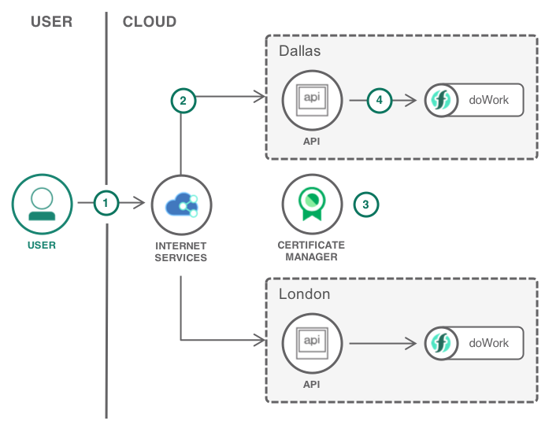
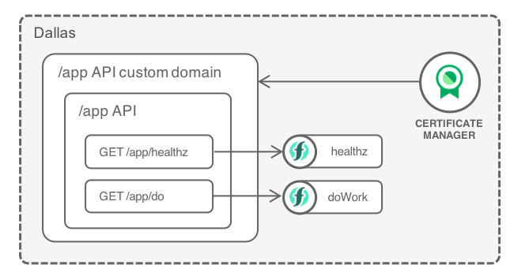
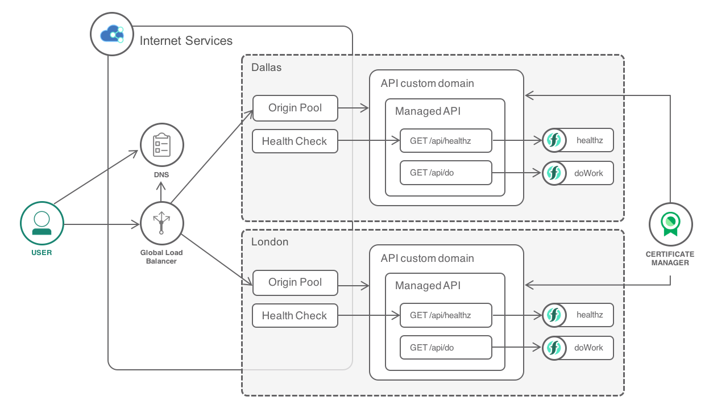

{:step: data-tutorial-type='step'}
{:java: #java .ph data-hd-programlang='java'}
{:swift: #swift .ph data-hd-programlang='swift'}
{:ios: #ios data-hd-operatingsystem="ios"}
{:android: #android data-hd-operatingsystem="android"}
{:shortdesc: .shortdesc}
{:new_window: target="_blank"}
{:codeblock: .codeblock}
{:screen: .screen}
{:tip: .tip}
{:pre: .pre}

# Deploy serverless apps across multiple regions
{: #multi-region-serverless}
{: toc-content-type="tutorial"}
{: toc-services="openwhisk, cis, certificate-manager"}
{: toc-completion-time="2h"}

<!--##istutorial#-->
This tutorial may incur costs. Use the [Cost Estimator](https://{DomainName}/estimator/review) to generate a cost estimate based on your projected usage.
{: tip}

<!--#/istutorial#-->

This tutorial shows how to configure {{site.data.keyword.cis_full_notm}} and {{site.data.keyword.openwhisk_short}} to deploy serverless apps across multiple regions.
{: shortdesc}

Serverless computing platforms give developers a rapid way to build APIs without servers. {{site.data.keyword.openwhisk}} supports automatic generation of REST API for actions, turning actions into HTTP endpoints, and the ability to enable secure API authentication. This capability is helpful not only for exposing APIs to external consumers but also for building microservices applications.

{{site.data.keyword.openwhisk_short}} is available in multiple {{site.data.keyword.cloud_notm}} locations. To increase resiliency and reduce network latency, applications can deploy their back-end in multiple locations. Then, with {{site.data.keyword.cis_full_notm}} ({{site.data.keyword.cis_short_notm}}), developers can expose a single entry point in charge of distributing traffic to the closest healthy back-end.

## Objectives
{: #multi-region-serverless-objectives}

* Deploy {{site.data.keyword.openwhisk_short}} actions.
* Expose actions via {{site.data.keyword.APIM}} with a custom domain.
* Distribute traffic across multiple locations with {{site.data.keyword.cis_full_notm}}.


The tutorial considers a public web application with a back-end implemented with {{site.data.keyword.openwhisk_short}}. To reduce network latency and prevent outage, the application is deployed in multiple locations. Two locations are configured in the tutorial.

{: class="center"}
{: style="text-align: center;"}


1. Users access the application. The request goes through {{site.data.keyword.cis_full_notm}}.
2. {{site.data.keyword.cis_full_notm}} redirect the users to the closest healthy API back-end.
3. {{site.data.keyword.cloudcerts_short}} provides the SSL certificate to the API. The traffic is encrypted end-to-end.
4. The API is implemented with {{site.data.keyword.openwhisk_short}}.

## Before you begin
{: #multi-region-serverless-prereqs}

{{site.data.keyword.cis_full_notm}} requires you to own a custom domain so you can configure the DNS for this domain to point to {{site.data.keyword.cis_full_notm}} name servers. If you do not own a domain, you can buy one from a registrar.

## Configure a custom domain
{: #multi-region-serverless-2}
{: step}

The first step is to create an instance of {{site.data.keyword.cis_full_notm}} ({{site.data.keyword.cis_short_notm}}) and to point your custom domain {{site.data.keyword.cis_short_notm}} name servers.

1. Navigate to the [{{site.data.keyword.cis_full_notm}}](https://{DomainName}/catalog/services/internet-services) in the {{site.data.keyword.Bluemix_notm}} catalog.
2. Set the service name - `mr-serverless-internet-services`, and click **Create** to create an instance of the service. _You can use any pricing plans for this tutorial_.
3. When the service instance is provisioned, click on **Add domain** under **Overview** page.
4. Enter your domain name and click **Next**.
5. Setup your DNS records is an optional step and can be skipped for this tutorial. click on **Next**.
6. When the name servers are assigned under **Delegate domain management**, configure your registrar or domain name provider to use the name servers listed.
7. After you've configured your registrar or the DNS provider, it may require up to 24 hours for the changes to take effect. Click **Next** and once the service is configured, click **Done**.

   When the domain's status on the Overview page changes from *Pending* to *Active*, you can use the `dig <your_domain_name> ns` command to verify that the new name servers have taken effect.
   {: tip}

### Create a {{site.data.keyword.cloudcerts_short}} instance and verify ownership of your domain.
{: #multi-region-serverless-3}

1. Create a [{{site.data.keyword.cloudcerts_short}}](https://{DomainName}/catalog/services/cloudcerts) instance in a supported location by providing a service name - `mr-serverless-cert-manager`, a resource group and leave the endpoints to default.
2. Before a certificate can be issued to you, {{site.data.keyword.cloudcerts_short}} must verify that you control all of the domains that you list in your request. To do so, {{site.data.keyword.cloudcerts_short}} uses DNS validation. Complete the following steps to verify ownership of your domains in Internet Services (CIS),
   1. Click **Manage** on the top bar, click **Access (IAM)**  and then **Authorizations**.
   2. Click **Create** and assign a source and target service. The source service is granted access to the target service based on the roles that you set in the next step.
      - Source service: {{site.data.keyword.cloudcerts_short}} > **Services based on attributes** > Source service instance and then select `mr-serverless-cert-manager` from the dropdown menu.
      - Target Service: Internet Services > **Services based on attributes** > Service instance and then select `mr-serverless-internet-services` from the dropdown menu.
   3. Assign the **Reader** role to allow {{site.data.keyword.cloudcerts_short}} to view the CIS instance and its domains.
   4. Click **Authorize**.

### Order a certificate
{: #multi-region-serverless-4}

1. Navigate to your [Resource list](https://{DomainName}/resources) and under **Services**, click on name of the **{{site.data.keyword.cloudcerts_short}}** service your created.
2. Under **Your certificates**, click on **Order**.
3. Click on **Continue** under {{site.data.keyword.cis_full_notm}}(CIS) tile.
4. Provide a certificate name under **Certificate details**, select **Let's Encrypt** as the certificate authority and you may change the Key algorithm if you wish to.
5. Under **Domains** tab,
   1. Select the {{site.data.keyword.cis_full_notm}} instance you've assigned a service access role for
   2. Select/Add the domain(s) and/or subdomain(s) as you wish to.
   3. Select the certificate Common Name in the Order summary
6. Click **Order**.

For renewing certificates, check the documentation [here](/docs/certificate-manager?topic=certificate-manager-ordering-certificates#renew-certificate)
{: tip}

## Deploy actions in multiple locations
{: #multi-region-serverless-0}
{: step}

In this section, you will create actions, expose them as an API, and map the custom domain to the API with a SSL certificate stored in {{site.data.keyword.cloudcerts_short}}.

{: class="center"}
{: style="text-align: center;"}


The action **doWork** implements one of your API operations. The action **healthz** is going to be used later on the check if your API is healthy. It could as simple as returning *OK* or it could do a more complex check like pinging the databases or other critical services required by your API.

The three following sections will need to be repeated for every location where you want to host the application back-end. For this tutorial, you can pick *Dallas (us-south)* and *London (eu-gb)* as targets.

### Define actions
{: #multi-region-serverless-6}

1. Go to [{{site.data.keyword.openwhisk_short}} / Actions](https://{DomainName}/functions/actions).
2. Switch to the target namespace and location where to deploy the actions.
3. Create an action
   1. Set **Name** to **doWork**.
   2. Set **Enclosing Package** to **default**.
   3. Set **Runtime** to the most recent version of **Node.js**.
   4. Click **Create**.
4. Change the action code to:
   ```js
   function main(params) {
     msg = "Hello, " + params.name + " from " + params.place;
     return { greeting:  msg, host: params.__ow_headers.host };
   }
   ```
   {: codeblock}

5. Click **Save**
6. Click **Actions** on the navigation menu to create another action to be used as health check for our API:
   1. Set **Name** to **healthz**.
   2. Set **Enclosing Package** to **default**.
   3. Set **Runtime** to most recent **Node.js**.
   4. Click **Create**.
7. Change the action code to:
   ```js
   function main(params) {
     return { ok: true };
   }
   ```
   {: codeblock}

8. Click **Save**

### Expose the actions with a managed API
{: #multi-region-serverless-7}

The next step involves creating a managed API to expose your actions.

1. Go to [{{site.data.keyword.openwhisk_short}} / API](https://{DomainName}/functions/apimanagement).
2. Click **Create API** to create a new managed {{site.data.keyword.openwhisk_short}} API:
   1. Set **API name** to **App API**.
   1. Set **Base path** to **/api**.
3. Click **Create operation**  to create an API operation that invokes actions:
   1. Set **Path** to **/do**.
   2. Set **Verb** to **GET**.
   3. Set **Package** to **Default**.
   4. Set **Action** to **doWork**.
   5. Click **Create**.
4. Create another operation:
   1. Set **Path** to **/healthz**.
   2. Set **Verb** to **GET**.
   3. Set **Package** to **default**.
   4. Set **Action** to **healthz**.
   5. Click **Create**.
5. **Save** the API

### Configure the custom domain for the managed API
{: #multi-region-serverless-8}

Creating a managed API gives you a default endpoint like `https://service.us.apiconnect.ibmcloud.com/gws/apigateway/api/1234abcd/app`. In this section, you will configure this endpoint to be able to handle requests coming from your custom subdomain, the domain which will later be configured in {{site.data.keyword.cis_full_notm}}.

1. Go to [APIs / Custom domains](https://{DomainName}/apis/domains).
2. In the **Location** filter, select the target location.
3. Locate the custom domain linked to the organization and space where you created the actions and the managed API. Click **Change Settings** in the action menu.
4. Make note of the **Default domain / alias** value.
5. Check **Assign custom domain**
   1. Set **Domain name** to the domain you will use with the {{site.data.keyword.cis_short_notm}} Global Load Balancer such as *api.mydomain.com*.
   2. Select the {{site.data.keyword.cloudcerts_short}} instance holding the certificate.
   3. Select the certificate for the domain.
6. Go to the dashboard of your instance of **{{site.data.keyword.cis_full_notm}}**, under **Reliability / DNS**, click on **Add** under **DNS records** to create a new **DNS TXT record**:
   1. Set **Name** to your custom subdomain, such as **api**.
   2. Set **Content** to the **Default domain / alias**.
   3. **Add** the record.
7. Save the custom domain settings. {{site.data.keyword.cis_full_notm}} will check for the existence of the DNS TXT record.

   If the TXT record is not found, you may need to wait for it to propagate and retry saving the settings. The DNS TXT record can be removed once the settings have been applied.
   {: tip}

Repeat the previous sections to configure more locations.

## Distribute traffic between locations
{: #multi-region-serverless-9}
{: step}

**At this stage, you have setup actions in multiple locations** but there is no single entry point to reach them. In this section, you will configure a global load balancer (GLB) to distribute traffic between the locations.

{: class="center"}
{: style="text-align: center;"}


### Create a health check
{: #multi-region-serverless-10}

{{site.data.keyword.cis_full_notm}} will be regularly calling this endpoint to check the health of the back-end.

1. Go to the dashboard of your {{site.data.keyword.cis_full_notm}} instance.
1. Under **Reliability / Global load balancers**, create a **health check**:
   1. Set **Monitor type** to **HTTPS**.
   1. Set **Path** to **/api/healthz**.
   1. Click on **Create**.

### Create origin pools
{: #multi-region-serverless-11}

By creating one pool per location, you can later configure geo routes in your global load balancer to redirect users to the closest location. Another option would be to create a single pool with all locations and have the load balancer cycle through the origins in the pool.

For every location:
1. Create an **origin pool**.
1. Set **Name** to **app-&lt;location&gt;** such as _app-Dallas_.
1. Set **Origin Name** to **app-&lt;location&gt;**.
1. Set **Origin Address** to the default domain / alias for the managed API (such as _5d3ffd1eb6.us-south.apiconnect.appdomain.cloud_).
1. Set **Health Check Region** to a region close to the location where {{site.data.keyword.openwhisk_short}} are deployed.
1. Select the Health check created before.
1. Click on **Create**.

### Create a global load balancer(GLB)
{: #multi-region-serverless-12}

1. Click **Create** under **Load balancers**.
2. Set **Name** to **api.mydomain.com**.
3. Click on **Add route** to add the regional origin pools.
4. Once the origin pools are added, click on **Create**.

After a short while, go to `https://api.mydomain.com/api/do?name=John&place=Earth`. This should reply with the function running in the first healthy pool.

### Test fail over
{: #multi-region-serverless-13}

To test the fail over, a pool health check must fail so that the GLB would redirect to the next healthy pool. To simulate a failure, you can modify the health check function to make it fail.

1. Go to [{{site.data.keyword.openwhisk_short}} / Actions](https://{DomainName}/functions/actions).
1. Select the first location configured in the GLB.
1. Edit the `healthz` function and change its implementation to `throw new Error()`.
1. Click **Save**.
1. Wait for the health check to run for this origin pool.
1. Get `https://api.mydomain.com/api/do?name=John&place=Earth` again, it should now redirect to the other healthy origin.
1. Revert the code changes to get back to a healthy origin.

## Remove resources
{: #multi-region-serverless-removeresources}
{: step}

### Remove {{site.data.keyword.cis_short_notm}} resources
{: #multi-region-serverless-15}

1. Remove the GLB.
1. Remove the origin pools.
1. Remove the health checks.
1. Remove the {{site.data.keyword.cis_short_notm}} instance (optional)

### Remove {{site.data.keyword.cloudcerts_short}} resources
{: #multi-region-serverless-16}

1. Remove the certificate from the {{site.data.keyword.cloudcerts_short}} instance
1. Remove the {{site.data.keyword.cloudcerts_short}} instance (optional)

### Remove actions
{: #multi-region-serverless-17}

1. Remove [APIs](https://{DomainName}/functions/apimanagement)
1. Remove [actions](https://{DomainName}/functions/actions)

## Related content
{: #multi-region-serverless-related}

* [{{site.data.keyword.cis_full_notm}}](https://{DomainName}/docs/cis?topic=cis-getting-started)
* [Resilient and secure multi-region Kubernetes clusters with {{site.data.keyword.cis_full_notm}}](https://{DomainName}/docs/solution-tutorials?topic=solution-tutorials-multi-region-k8s-cis#multi-region-k8s-cis)
