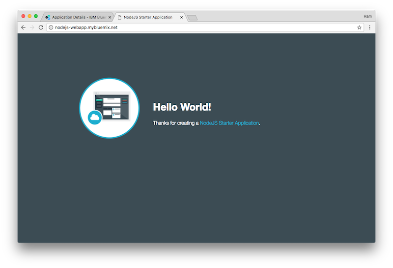
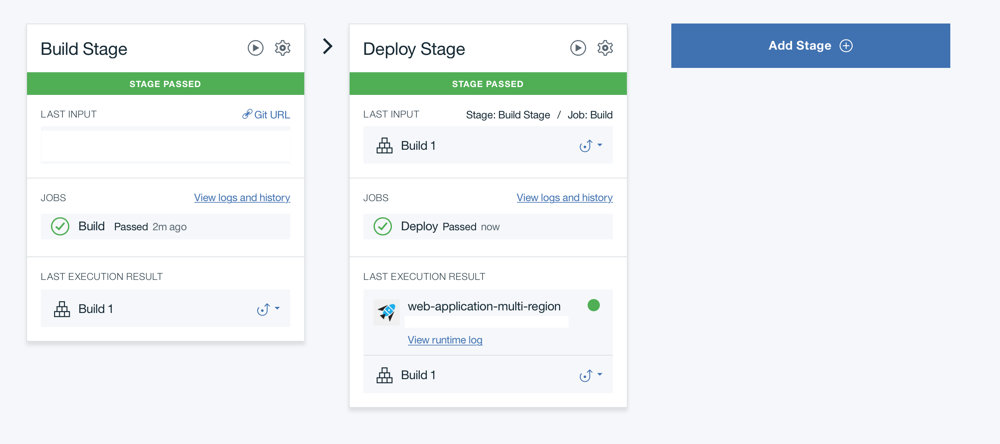
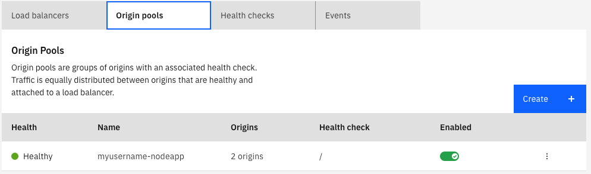
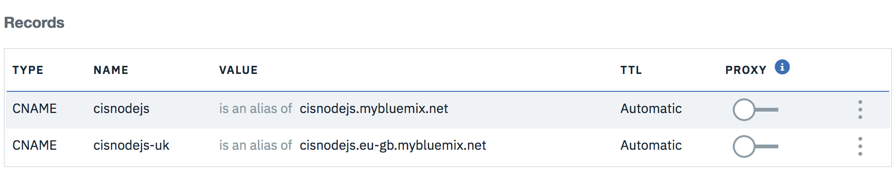

{:step: data-tutorial-type='step'}
{:shortdesc: .shortdesc}
{:new_window: target="_blank"}
{:codeblock: .codeblock}
{:screen: .screen}
{:tip: .tip}
{:pre: .pre}

# Secure web application across multiple regions
{: #multi-region-webapp}
{: toc-content-type="tutorial"}
{: toc-services="cloud-foundry-public, cis, ContinuousDelivery"}
{: toc-completion-time="2h"}

<!--##istutorial#-->
This tutorial may incur costs. Use the [Cost Estimator](https://{DomainName}/estimator/review) to generate a cost estimate based on your projected usage.
{: tip}

<!--#/istutorial#-->

This tutorial walks you through creating, securing, deploying, and load balancing a Cloud Foundry application across multiple regions by using a [{{site.data.keyword.contdelivery_short}}](https://{DomainName}/catalog/services/continuous-delivery) pipeline.
{: shortdesc}

Apps or parts of your apps will have outages - it is a fact. It can be a problem in your code, a planned maintenance impacting the resources used by your app, a hardware failure bringing down a zone, a location, a data center where your app is hosted. Any of these will happen and you have to be prepared. With {{site.data.keyword.Bluemix_notm}}, you can deploy your application to [multiple locations](https://{DomainName}/docs/overview?topic=overview-locations) to increase your application resilience. And with your application now running in multiple locations, you can also redirect user traffic to the nearest location to reduce latency.

## Objectives
{: #multi-region-webapp-0}

* Deploy a Cloud Foundry application to multiple locations with {{site.data.keyword.contdelivery_short}}.
* Map a custom domain to the application.
* Configure global load balancing to your multi-location application.
* Bind an SSL certificate to your application.
* Monitor application performance.

This tutorial involves an active/active scenario where two copies of the application are deployed in two different locations and the two copies are serving customer requests in a round-robin way. The DNS configuration automatically points to the healthy location if one copy fails.

{: class="center"}
{: style="text-align: center;"}


## Before you begin
{: #multi-region-webapp-prereqs}

A custom domain and {{site.data.keyword.cis_full_notm}} are required for load balancing the application across multiple regions. The custom domain is needed so you can configure the DNS for this domain to point to {{site.data.keyword.cis_full_notm}} name servers. If you do not own a domain, you can buy one from a registrar.

## Create a Node.js application
{: #multi-region-webapp-create}
{: step}

Start by creating a **SDK for Node.js** starter application that runs in a Cloud Foundry environment.

1. In the [**Catalog**](https://{DomainName}/catalog/), under the [**Compute**](https://{DomainName}/catalog?category=compute) category, select [**Cloud Foundry**](https://{DomainName}/cloudfoundry/overview), Select [**Public Applications**](https://{DomainName}/catalog/starters/cloud-foundry?runtime=sdk-for-nodejs) and choose the **{{site.data.keyword.runtime_nodejs_notm}}** runtime.
2. Verify **SDK for Node.js** is checked.
3. **Select a region**.  **Dallas**, us-south, is expected for the text below but any region will work if you make the appropriate substitutions.
4. Enter a **unique name** for your application. Notice host name filled identically. for example: myusername-nodeapp.
5. Take note of the IBM **Domain** selected.  The default for  the **Dallas** region is **us-south.cf.appdomain.cloud**.
6. Select a **Organization** and **Space**.  The space will be named after the region: **myaccount-org** (Organization) / **us-south** (Space).  A second space will be needed in a future step.
7. And click **Create**.
8. After the application starts, click the **Visit URL** link on the **Overview** page to see your application in a new tab.

{: class="center"}
{: style="text-align: center;"}

Great start! You have your very own Node.js starter application running in {{site.data.keyword.Bluemix_notm}}

Next, let's push the source code of your application to a repository and deploy your changes automatically.

## Set up source control and {{site.data.keyword.contdelivery_short}}
{: #multi-region-webapp-devops}
{: step}

In this step, you set up a git source control repository to store your code and then create a pipeline, which deploys any code changes automatically.

1. On the left pane of your application you just created, select **Overview** and scroll to find **{{site.data.keyword.contdelivery_short}}**. Click **Enable Continuous Delivery**.
1. Keep the default options in the **Git Repos and Issue Tracking** panel.
1. Click the **Delivery Pipeline** panel and choose **New** to create a API key with full access and click **OK** or follow the instructions to create or use a specific API key.
1. Click **Create**. You should now have a default **toolchain** created.
1. Select the **Git** tile under **Code**. You're then directed to your git repository page.
1. If you haven't set up SSH keys yet, you should see a notification bar at the top with instructions. Follow the steps by opening the **add an SSH key** link in a new tab or if you want to use HTTPS instead of SSH, follow the steps by clicking  **create a personal access token**. Remember to save the key or token for future reference.
1. Select SSH or HTTPS and copy the git URL. Clone the source to your local machine.
   ```bash
   git clone <your_repo_url>
   cd <name_of_your_app>
   ```
   {: pre}

   **Note:** If you're prompted for a user name, provide your git user name. For the password, use an existing **SSH key** or **personal access token** or the one created you created in the previous step.
1. Open the cloned repository in an IDE of your choice and navigate to `public/index.html`. Now, let's update the code. Try changing "Hello World" to something else.
1. Run the application locally by running the commands one after another `npm install`, `npm build`, `npm start` and visit `localhost:<port_number>` in your browser.
   **<port_number>** as displayed on the console.
1. Push the change to your repository with three simple steps: Add, commit, and push.
   ```bash
   git add public/index.html
   git commit -m "my first changes"
   git push origin master
   ```
   {: pre}

1. Go to the toolchain you created earlier and click the **Delivery Pipeline** tile.
1. Confirm that you see the **BUILD** and **DEPLOY** stages.
   
1. Wait for the **DEPLOY** stage to complete.
1. Click the **View console** to open the application under **Last execution result** to visit the application.  In the Cloud Foundry application click on **Visit app URL** to see the app and changes.

Continue making further changes to your application and periodically commit your changes to your git repository. If you don't see your application updating, check the logs of the DEPLOY and BUILD stages of your pipeline.

## Deploy to another location
{: #multi-region-webapp-deploy_another_region}
{: step}

Next, we will deploy the same application to a different {{site.data.keyword.Bluemix_notm}} location. We can use the same toolchain but will add another DEPLOY stage to handle the deployment of the application to another location.

1. Navigate to Application **Overview** and scroll to find **View toolchain**.
2. Select **Delivery Pipeline** from Deliver.
3. Click the **Gear icon** on the **DEPLOY** stage and select **Clone Stage**.
4. Rename stage to "Deploy to UK" and select **JOBS**.
5. Change **IBM Cloud region** to **London - https://api.eu-gb.cf.cloud.ibm.com**. Create a **space** named eu-gb if you don't have one.
6. Click **Save** and run the new stage by clicking the **Play button**.
7. Navigate via **View console** to see the application and **Visit app URL**.  Take note of the live application in the URL in the browser.  Back in the console for the app show the **Details** tab and note the **route** list in the format `<hostname>.<domain>`.


You can edit the routes to have similar domains from the application page by using the **Actions > Edit routes**.  Make note of this information in a table like the following.


Verify your two applications look something like this:

|Host name|Domain|Organization|Space|
|--|--|--|--|
|myusername-nodeapp|us-south.cf.appdomain.cloud|myaccount-org|us-south|
|myusername-nodeapp|eu-gb.mybluemix.net|myaccount-org|eu-gb|

The **Host name** is the initial part of the DNS subdomain shown on the **Details** panel under the **Routes** section.  Verify you can visit each applications in the browser using `<Host name>.<Domain>`: https://myusername-nodeapp.us-south.cf.appdomain.cloud,  https://myusername-nodeapp.eu-gb.mybluemix.net.

The host name will default to the application name but if that does not provide a unique route to the application a more random string will be generated and must be noted in your copy of the table above.
{: tip}

## Register a custom domain with {{site.data.keyword.cis_full_notm}}
{: #multi-region-webapp-domain_cis}
{: step}

[{{site.data.keyword.cis_full_notm}}](https://{DomainName}/docs/cis?topic=cis-getting-started) is a simple set of edge network services for clients looking to secure their internet-facing applications from DDoS attacks, data theft and bot attacks, and for those clients needing to optimize their web applications, or ensure global responsiveness and the ongoing availability of their internet-facing applications.

When deploying a real world application, you will likely want to use your own domain instead of the IBM-provided domain (_mybluemix.net_). In this step, after you have a custom domain, you can use the DNS servers provided by {{site.data.keyword.cis_full_notm}}.

1. Buy a domain from a registrar.
2. Navigate to [{{site.data.keyword.cis_full_notm}}](https://{DomainName}/catalog/services/internet-services) in the {{site.data.keyword.Bluemix_notm}} catalog.
3. Enter a service name, and click **Create** to create an instance of the service.
4. When the service instance is provisioned, set your domain name and click **Add domain**.
5. When the name servers are assigned, configure your registrar or domain name provider to use the name servers listed.
6. After you've configured your registrar or the DNS provider, it may require up to 24 hours for the changes to take effect.
   When the domain's status on the Overview page changes from *Pending* to *Active*, you can use the `dig <your_domain_name> ns` command to verify that the IBM Cloud name servers have taken effect.
   {: tip}

## Add Global Load Balancing to the application
{: #multi-region-webapp-5}
{: step}

{: #add_glb}

In this section, you will use the Global Load Balancer (GLB) in {{site.data.keyword.cis_full_notm}} to manage the traffic across multiple locations. The GLB utilizes a origin pool which allows for the traffic to be distributed to multiple origins based on health checks.

### Create a health check for the GLB.
{: #multi-region-webapp-6}

1. In the {{site.data.keyword.cis_full_notm}} application, navigate to **Reliability** > **Global Load Balancer**.
2. Select **Health checks** and click **Create**.
3. Enter a name, HTTPS, `/` for the path.  In your real application you can create a dedicated health endpoint that evaluates the application health and returns the status. Click **Create**.

### Create an origin pool with two origins.
{: #multi-region-webapp-7}

Values are copied from the table of applications (substitute your values):

|Host name|Domain|Organization|Space|
|--|--|--|--|
|myusername-nodeapp|us-south.cf.appdomain.cloud|myaccount-org|us-south|
|myusername-nodeapp|eu-gb.mybluemix.net|myaccount-org|eu-gb|

1. Select **Origin pools** and click **Create**.
2. Enter a name for the pool: `myusername-nodeapp`.
3. Enter a name for the first origin, **us-south**, and the full subdomain of the application in Dallas: `myusername-nodeapp`.`us-south.cf.appdomain.cloud`.
4. Similarly, add another origin, **eu-gb**,  with the full subdomain of the application in London: `myusername-nodeapp`.`eu-gb.mybluemix.net`.
5. Select a **Health check region** close to the location of one of your applications.
6. Select the **Health check** created earlier.
7. Click **Save**.
   

You may need to wait for the health checks to complete and refresh in the browser to see a Healthy status.
{: tip}

### Create a Global Load Balancer (GLB).
{: #multi-region-webapp-8}

1. Select **Load balancers** and click **Create**.
1. Keep the defaults of **Enable**: **On** and **Proxy**: **Off**.
1. Enter the name for the Global Load Balancer, **myusername-nodeapp**, (`<glb_name>`) this name will be the initial characters in the subdomain to access the application. (http://`<gbl_name>`.`<your_domain_name>`).  From this one URL both the origins will be accessed optimally.
1. Click **Add route**.
1. Select the **Region**: **Default**.
1. Select the origin pool that you just created.
1. Click **Create**.
   

The applications (.i.e origins) can not yet be reached.  The health checks for the origin subdomains, like `myusername-nodeapp`.`us-south.cf.appdomain.cloud`, are healthy. The GLB is resolving `<glb_name>`.`<your_domain_name>` to the IP addresses of one of the Cloud Foundry regions (us-south or eu-gb) in your account based on health. However, when Cloud Foundry receives the request it does not know how to route it to an application.  Cloud Foundry **routes** need to be created to map the subdomain, `<glb_name>`.`<your_domain_name>`, to the application.  Next step will fix this in each region.

## Configure custom domain and routes to your application
{: #multi-region-webapp-9}
{: step}

{: #add_domain}

Values are copied from the table of applications (substitute your values):

|Host name|Domain|Organization|Space|
|--|--|--|--|
|myusername-nodeapp|us-south.cf.appdomain.cloud|myaccount-org|us-south|
|myusername-nodeapp|eu-gb.mybluemix.net|myaccount-org|eu-gb|

In this step, you will map the custom domain name to the secure endpoint for the {{site.data.keyword.Bluemix_notm}} location where your application is running.

1. From the menu bar, click on **Manage** and then **Account**: [Account](https://{DomainName}/account).
1. On the account page, navigate to **Cloud Foundry Orgs**, select your organization: **myaccount-org**.
1. Select the **Domains** panel.
1. Add domain in the region of the first application, us-south. Click **Add a domain**.
   1. Enter the **Domain name**: <your_domain_name> - the custom domain name acquired from the registrar.
   2. Select **US-South** and click **Add**.
1. Return to the {{site.data.keyword.Bluemix_notm}} [Resource List](https://{DomainName}/resources), navigate to **Cloud Foundry Apps** and click on the application in Dallas.
   1. Click **Actions...** > **Edit Routes**.
   1. Notice the existing route, `myusername-nodeapp` . `us-south.cf.appdomain.com` (keep this route for health checks).
   1. Click **Add Route**.
   1. Enter the GLB hostname you configured earlier, `<glb_name>`, in the **Enter host (optional)** field.
   1. Select the custom domain, `<your_domain_name>`, Click **Save**.
1. Similarly, configure the domain and route for the application in London.

HTTPS access will not work correctly.  This will be fixed in the step below:  **Bind SSL certificate to your application**
{: tip}

At this point, you can visit your application with the URL http://`<glb_name>.<your_domain_name>` and the Global Load Balancer automatically distributes traffic for your multi-location applications. You can verify this by stopping your application in Dallas, keeping application in London active, and accessing the application through the Global Load Balancer.

Although this works at this moment, as we have configured continuous delivery in the previous steps, the configuration can be overwritten when another build is triggered. To make these changes persistent, go back to the toolchains and modify the *manifest.yml* file:

1. In the {{site.data.keyword.Bluemix_notm}} [Resource List](https://{DomainName}/resources), navigate to **Cloud Foundry Apps** and click on the application in Dallas, navigate to Application **Overview** and scroll to find **View toolchain**.
2. Select the **Eclipse Orion Web IDE** tile under Code.
3. Select *manifest.yml*.
4. Click **Edit** and add custom routes.
   ```yaml
   applications:
   - path: .
	  name: <your_app>
	  memory: 256M
	  instances: 1
	  routes:
	  - route: myusername-nodeapp.us-south.cf.appdomain.cloud
	  - route: <glb_name>.<your_domain_name>
	  disk_quota: 1024M
   ```
   {: pre}

For the application deployed in London, use a separate manifest to configure the routes:

1. Create a new manifest file named 'eu-gb.manifest.yml`:
   ```yaml
   applications:
   - path: .
	  name: <your_app>
	  memory: 256M
	  instances: 1
	  routes:
	  - route: myusername-nodeapp.eu-gb.mybluemix.net
	  - route: <glb_name>.<your_domain_name>
	  disk_quota: 1024M
   ```
   {: pre}
   
1. In the toolchain, change the deploy script to:
   ```sh
   #!/bin/bash
   cf push "${CF_APP}" -f eu-gb.manifest.yml
   ```


Finally commit the changes to the manifest files and make sure the builds for both locations succeed.

## Alternative: Map the custom domain to the IBM Cloud system domain
{: #multi-region-webapp-10}
{: step}

It is possible that you do not want to utilize a Global Load Balancer in front of your multi-location applications, but need to map the custom domain name to the secure endpoint for the {{site.data.keyword.Bluemix_notm}} location where your application is running.

With the Cloud Intenet Services application, take the following steps to set up `CNAME` records for your application:

1. In the {{site.data.keyword.cis_full_notm}} application, navigate to **Reliability** > **DNS**.
2. Select **CNAME** from the **Type** drop-down list, type an alias for your application in the Name field, and the application URL in the domain name field. Th application `<your_app>.mybluemix.net` in Dallas can be mapped to a CNAME `<your_app>`.
3. Click **Add Record**. Switch the PROXY toggle to ON to enhance security of your application.
4. Similarly, set the `CNAME` record for the London endpoint.
   

When using another default domain than `mybluemix.net` such as `cf.appdomain.cloud` or `cf.cloud.ibm.com`, make sure to use the [respective system domain](https://{DomainName}/docs/cloud-foundry-public?topic=cloud-foundry-public-custom-domains#mapcustomdomain).
{: tip}

If you are using a different DNS provider, the steps for setting up the CNAME record vary depending on your DNS provider.

For your Cloud Foundry applications to be reachable through the custom domain, you will need to add the custom domain to the [list of domains in the Cloud Foundry organization where the applications are deployed](https://{DomainName}/docs/cloud-foundry-public?topic=cloud-foundry-public-custom-domains#mapcustomdomain). Once done you can add the routes to the application manifests.  For the application in us-south:

   ```sh
   applications:
   - path: .
	  name: <your_app>
	  memory: 256M
	  instances: 1
	  routes:
	  - route: myusername-nodeapp.us-south.cf.appdomain.cloud
	  - route: <your_subdomain>.<your_domain_name>
	  disk_quota: 1024M
   ```
   {: pre}

## Bind SSL certificate to your application
{: #multi-region-webapp-ssl}
{: step}

1. Obtain a SSL certificate. You can generate a free one directly at https://letsencrypt.org/ or through [{{site.data.keyword.secrets-manager_full_notm}}](https://{DomainName}/docs/secrets-manager?topic=secrets-manager-certificates#order-certificates).
2. Navigate to Application **Overview** > **Routes** > **Manage Domains**.
3. Click the SSL Certificate upload button and upload the certificate.
4. Access your application with https instead of http.

## Remove resources
{: #multi-region-webapp-13}
{: step}

* Delete the toolchain
* Delete the two Cloud Foundry applications deployed in the two locations
* Delete the GLB, origin pools, and the health check
* Delete the DNS configuration
* Delete the {{site.data.keyword.cis_full_notm}} instance

## Related content
{: #multi-region-webapp-11}

* [Adding a Cloudant Database](https://{DomainName}/docs/Cloudant?topic=Cloudant-creating-an-ibm-cloudant-instance-on-ibm-cloud#creating-an-ibm-cloudant-instance-on-ibm-cloud)
* [Autoscaling for Cloud Foundry applications](https://{DomainName}/docs/cloud-foundry-public?topic=cloud-foundry-public-autoscale_cloud_foundry_apps)
* [{{site.data.keyword.cis_full_notm}}](https://{DomainName}/docs/cis?topic=cis-getting-started)
