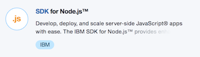
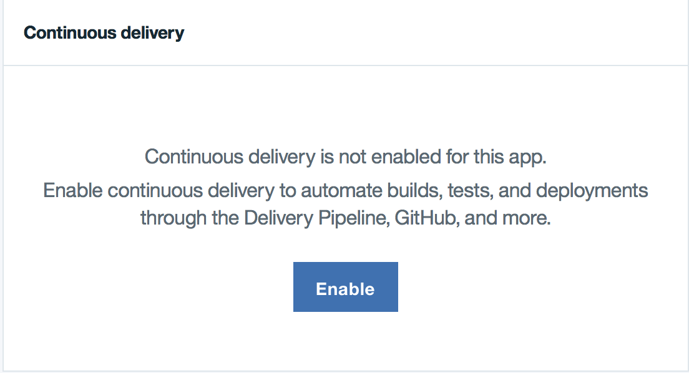
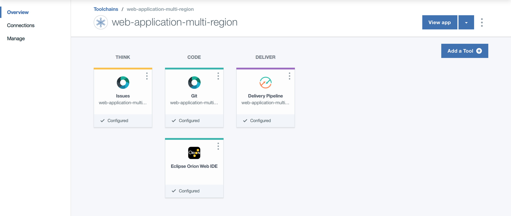
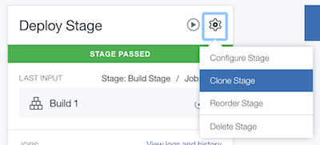
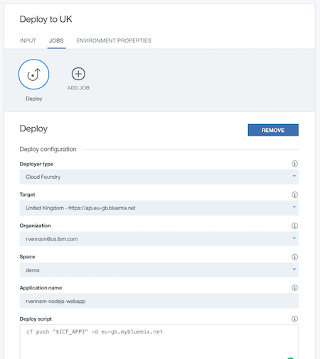
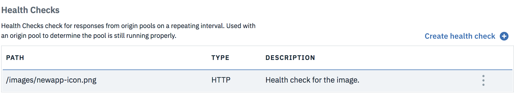
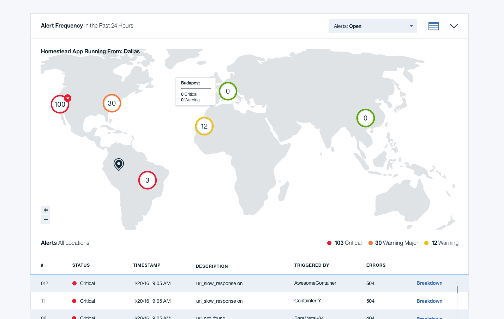

---
copyright:
  years: 2017, 2019
lastupdated: "2019-03-07"
---

{:shortdesc: .shortdesc}
{:new_window: target="_blank"}
{:codeblock: .codeblock}
{:screen: .screen}
{:tip: .tip}
{:pre: .pre}

# Secure web application across multiple regions
{: #multi-region-webapp}

This tutorial walks you through creating, securing, deploying, and load balancing a Cloud Foundry application across multiple regions by using a [{{site.data.keyword.contdelivery_short}}](https://{DomainName}/catalog/services/continuous-delivery) pipeline.

Apps or parts of your apps will have outages - it is a fact. It can be a problem in your code, a planned maintenance impacting the resources used by your app, a hardware failure bringing down a zone, a location, a data center where your app is hosted. Any of these will happen and you have to be prepared. With {{site.data.keyword.Bluemix_notm}}, you can deploy your application to [multiple locations](https://{DomainName}/docs/overview?topic=overview-whatis-platform#ov_intro_reg) to increase your application resilience. And with your application now running in multiple locations, you can also redirect user traffic to the nearest location to reduce latency.

## Objectives

* Deploy a Cloud Foundry application to multiple locations with {{site.data.keyword.contdelivery_short}}.
* Map a custom domain to the application.
* Configure global load balancing to your multi-location application.
* Bind an SSL certificate to your application.
* Monitor application performance.

## Services used

This tutorial uses the following runtimes and services:
* [{{site.data.keyword.runtime_nodejs_notm}}](https://{DomainName}/catalog/starters/sdk-for-nodejs) Cloud Foundry App
* [{{site.data.keyword.contdelivery_short}}](https://{DomainName}/catalog/services/continuous-delivery) for DevOps
* [Internet services](https://{DomainName}/catalog/services/internet-services)

This tutorial may incur costs. Use the [Pricing Calculator](https://{DomainName}/pricing/) to generate a cost estimate based on your projected usage.

## Architecture

This tutorial involves an active/active scenario where two copies of the application are deployed in two different locations and the two copies are serving customer requests in a round-robin way. The DNS configuration automatically points to the healthy location if one copy fails.

<p style="text-align: center;">

   
</p>

## Create a Node.js application
{: #create}

Start by creating a Node.js starter application that runs in a Cloud Foundry environment.

1. Click **[Catalog](https://{DomainName}/catalog/)** in the {{site.data.keyword.Bluemix_notm}} console.
2. Click **Cloud Foundry Apps** under the **Platform** category and select **[{{site.data.keyword.runtime_nodejs_notm}}](https://{DomainName}/catalog/starters/sdk-for-nodejs)** .
     
3. Enter a **unique name** for your application, which will also be your host name, for example: myusername-nodeapp. And click **Create**.
4.  After the application starts, click the **Visit URL** link on the **Overview** page to see your application LIVE on a new tab.


Great start! You have your very own Node.js starter application running in {{site.data.keyword.Bluemix_notm}}.

Next, let's push the source code of your application to a repository and deploy your changes automatically.

## Set up source control and {{site.data.keyword.contdelivery_short}}
{: #devops}

In this step, you set up a git source control repository to store your code and then create a pipeline, which deploys any code changes automatically.

1. On the left pane of your application you just created, select **Overview** and scroll to find **{{site.data.keyword.contdelivery_short}}**. Click **Enable**.

   
2. Keep the default options and click **Create**. You should now have a default **toolchain** created.

   
3. Select the **Git** tile under **Code**. You're then directed to your git repository page.
4. If you haven't set up SSH keys yet, you should see a notification bar at the top with instructions. Follow the steps by opening the **add an SSH key** link in a new tab or if you want to use HTTPS instead of SSH, follow the steps by clicking  **create a personal access token**. Remember to save the key or token for future reference.
5. Select SSH or HTTPS and copy the git URL. Clone the source to your local machine.
   ```bash
   git clone <your_repo_url>
   cd <name_of_your_app>
   ```
   **Note:** If you're prompted for a user name, provide your git user name. For the password, use an existing **SSH key** or **personal access token** or the one created you created in the previous step.
6. Open the cloned repository in an IDE of your choice and navigate to `public/index.html`. Now, let's update the code. Try changing "Hello World" to something else.
7. Run the application locally by running the commands one after another
  `npm install`, `npm build`,  `npm start ` and visit ```localhost:<port_number>```in your browser.
  **<port_number>** as displayed on the console.
8. Push the change to your repository with three simple steps: Add, commit, and push.
   ```bash
   git add public/index.html
   git commit -m "my first changes"
   git push origin master
   ```
9. Go to the toolchain you created earlier and click the **Delivery Pipeline** tile.
10. Confirm that you see n **BUILD** and **DEPLOY** stage.
  
11. Wait for the **DEPLOY** stage to complete.
12. Click the application **url** under Last Execution result to view your changes live.

Continue making further changes to your application and periodically commit your changes to your git repository. If you don't see your application updating, check the logs of the DEPLOY and BUILD stages of your pipeline.

## Deploy to another location
{: #deploy_another_region}

Next, we will deploy the same application to a different {{site.data.keyword.Bluemix_notm}} location. We can use the same toolchain but will add another DEPLOY stage to handle the deployment of the application to another location.

1. Navigate to Application **Overview** and scroll to find **View toolchain**.
2. Select **Delivery Pipeline** from Deliver.
3. Click the **Gear icon** on the **DEPLOY** stage and select **Clone Stage**.
   
4. Rename stage to "Deploy to UK" and select **JOBS**.
5. Change **IBM Cloud region** to **London - https://api.eu-gb.bluemix.net**. Create a **space** if you don't have one.
6. Change **Deploy script** to `cf push "${CF_APP}" -d eu-gb.mybluemix.net`

   
7. Click **Save** and run the new stage by clicking the **Play button**.

## Register a custom domain with IBM Cloud Internet Services

{: #domain_cis}

IBM [Cloud Internet Services](https://{DomainName}/docs/infrastructure/cis?topic=cis-getting-started-with-ibm-cloud-internet-services-cis-#getting-started-with-ibm-cloud-internet-services-cis-) is a uniform platform to configure and manage the Domain Name System (DNS), Global Load Balancing (GLB), Web Application Firewall (WAF), and protection against Distributed Denial of Service (DDoS) for web applications. It provides a fast, highly performant, reliable, and secure internet service for customers running their business on IBM Cloud with three main capabilities to enhance your workflow: security, reliability, and performance.  

When deploying a real world application, you will likely want to use your own domain instead of the IBM-provided mybluemix.net domain. In this step, after you have a custom domain, you can use the DNS servers provided by IBM Cloud Internet Services.

1. Buy a domain from a registrar such as [http://godaddy.com](http://godaddy.com).
2. Navigate to the [Internet Services](https://{DomainName}/catalog/services/internet-services) in the {{site.data.keyword.Bluemix_notm}} catalog.
2. Enter a service name, and click **Create** to create an instance of the service.
3. When the service instance is provisioned, set your domain name and click **Add domain**.
4. When the name servers are assigned, configure your registrar or domain name provider to use the name servers listed.
5. After you've configured your registrar or the DNS provider, it may require up to 24 hours for the changes to take effect.
  When the domain's status on the Overview page changes from *Pending* to *Active*, you can use the `dig <your_domain_name> ns` command to verify that the IBM Cloud name servers have taken effect.
  {:tip}

## Add Global Load Balancing to the application

{: #add_glb}

In this section, you will use the Global Load Balancer (GLB) in IBM Cloud Internet Services to manage the traffic across multiple locations. The GLB utilizes a origin pool which allows for the traffic to be distributed to multiple origins.

### Before creating a GLB, create a health check for the GLB.

1. In the Cloud Internet Services application, navigate to **Reliability** > **Global Load Balancer**, and at the bottom of the page, click **Create health check**.
2. Enter the path that you want to monitor, for example, `/`, and select a type (HTTP or HTTPS). Typically you can create a dedicated health endpoint. Click **Provision 1 Instance**.
   

### After that, create an origin pool with two origins.

1. Click **Create Pool**.
2. Enter a name for the pool, select the health check that you've just created, and a region that is close to the location of your node.js application.
3. Enter a name for the first origin and the host name for the application in Dallas `<your_app>.mybluemix.net`.
4. Similarly, add another origin with the origin address pointing to the application in London `<your_app>.eu-gb.mybluemix.net`.
5. Click **Provision 1 Instance**.
   

### Create a Global Load Balancer (GLB). 

1. Click **Create Load Balancer**.
2. Enter a name for the Global Load Balancer. This name will also be part of your universal application URL (`http://<glb_name>.<your_domain_name>`), regardless of the location.
3. Click **Add pool** and select the origin pool that you have just created.
4. Click **Provision 1 Instance**.
   

At this stage, the GLB is configured but the Cloud Foundry applications are not ready yet to reply to requests from the configured GLB domain name. To complete the configuration, you will update the applications with routes using the custom domain.

## Configure custom domain and routes to your application

{: #add_domain}

In this step, you will map the custom domain name to the secure endpoint for the {{site.data.keyword.Bluemix_notm}} location where your application is running.

1. From the menu bar, click on **Manage** and then **Account**: [Account](https://{DomainName}/account).
2. On the account page, navigate to application **Cloud Foundry Orgs**, and select **Domains** from the Actions column.
3. Click **Add a domain** and enter your custom domain name acquired from the registrar.
4. Select the right location and click **Save**.
5. Similarly, add the custom domain name to London.
6. Return to the {{site.data.keyword.Bluemix_notm}} [Resource List](https://{DomainName}/resources), navigate to **Cloud Foundry Apps** and click on the application in Dallas, click **Route** > **Edit Routes**, and click **Add Route**.
   
7. Enter the GLB hostname you configured earlier in the **Enter host (optional)** field, and select the custom domain that you have just added. Click **Save**.
8. Similarly, configure the domain and routes for the application in London.

At this point, you can visit your application with the URL `<glb_name>.<your_domain_name>` and the Global Load Balancer automatically distributes traffic for your multi-location applications. You can verify this by stopping your application in Dallas, keeping application in London active, and accessing the application through the Global Load Balancer.

Although this works at this moment, as we have configured continuous delivery in the previous steps, the configuration can be overwritten when another build is triggered. To make these changes persistent, go back to the toolchains and modify the *manifest.yml* file:

1. In the {{site.data.keyword.Bluemix_notm}} [Resource List](https://{DomainName}/resources), navigate to **Cloud Foundry Apps** and click on the application in Dallas, navigate to Application **Overview** and scroll to find **View toolchain**.
2. Select the Git tile under Code.
3. Select *manifest.yml*.
4. Click **Edit** and add custom routes. Replace the original domain and host configurations with `Routes` only.

   ```
   applications:
   - path: .
	  name: <your_app>
	  memory: 256M
	  instances: 1
	  routes:
	  - route: <your_app>.mybluemix.net
	  - route: <glb_name>.<your_domain_name>
	  disk_quota: 1024M
   ```
   {: pre}
  
5. Commit the changes and make sure the builds for both locations succeed.  

## Alternative: Map the custom domain to the IBM Cloud system domain

It is possible that you do not want to utilize a Global Load Balancer in front of your multi-location applications, but need to map the custom domain name to the secure endpoint for the {{site.data.keyword.Bluemix_notm}} location where your application is running.

With the Cloud Intenet Services application, take the following steps to set up `CNAME` records for your application:

1. In the Cloud Internet Services application, navigate to **Reliability** > **DNS**.
2. Select **CNAME** from the **Type** drop-down list, type an alias for your application in the Name field, and the application URL in the domain name field. Th application `<your_app>.mybluemix.net` in Dallas can be mapped to a CNAME `<your_app>`.
3. Click **Add Record**. Switch the PROXY toggle to ON to enhance security of your application.
4. Similarly, set the `CNAME` record for the London endpoint.
   

When using another default domain than `mybluemix.net` such as `cf.appdomain.cloud` or `cf.cloud.ibm.com`, make sure to use the [respective system domain](https://{DomainName}/docs/apps?topic=creating-apps-updatingapps#mapcustomdomain).
{:tip}

If you are using a different DNS provider, the steps for setting up the CNAME record vary depending on your DNS provider. For example, if you are using GoDaddy, you follow the [Domains Help](https://www.godaddy.com/help/add-a-cname-record-19236) guidance from GoDaddy.

For your Cloud Foundry applications to be reachable through the custom domain, you will need to add the custom domain to the [list of domains in the Cloud Foundry organization where the applications are deployed](https://{DomainName}/docs/apps?topic=creating-apps-updatingapps#updatingapps). Once done you can add the routes to the application manifests:

   ```
   applications:
   - path: .
	  name: <your_app>
	  memory: 256M
	  instances: 1
	  routes:
	  - route: <your_app>.mybluemix.net
	  - route: <your_app>.<your_domain_name>
	  disk_quota: 1024M
   ```
   {: pre}

## Bind SSL certificate to your application
{: #ssl}

1. Obtain a SSL certificate. For example, you can purchase from https://www.godaddy.com/web-security/ssl-certificate or generate a free one at https://letsencrypt.org/.
2. Navigate to Application **Overview** > **Routes** > **Manage Domains**.
3. Click the SSL Certificate upload button and upload the certificate.
5. Access your application with https instead of http.

## Monitor application performance
{: #monitor}

Lets check the health of your multi-location application.

1. In the application dashboard, select **Monitoring**.
2. Click **View All Tests**
   

Availability Monitoring runs synthetic tests from locations around the world, around the clock to proactively detect and fix performance issues before users are impacted. If you configured a custom route for your application, change the test definition to access your application through its custom domain.

## Remove resources

* Delete the toolchain
* Delete the two Cloud Foundry applications deployed in the two locations
* Delete the GLB, origin pools, and the health check
* Delete the DNS configuration
* Delete the Internet Services instance

## Related content

[Adding a Cloudant Database](https://{DomainName}/docs/services/Cloudant/tutorials?topic=cloudant-creating-an-ibm-cloudant-instance-on-ibm-cloud#creating-an-ibm-cloudant-instance-on-ibm-cloud)

[Auto-Scaling Cloud Foundry applications](https://{DomainName}/docs/services/Auto-Scaling?topic=services/Auto-Scaling-get-started#get-started)

[Cloud Internet Services](https://{DomainName}/docs/infrastructure/cis?topic=cis-getting-started-with-ibm-cloud-internet-services-cis-#getting-started-with-ibm-cloud-internet-services-cis-)
