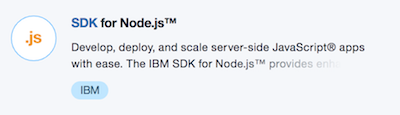

# Deploy a secure web application across multiple regions

In this tutorial, you can accomplish the following:

:white_check_mark: Create a starter Node.js application

:white_check_mark: Set up source control and continuous delivery

:white_check_mark: Deploy to another region

:white_check_mark: Map an existing custom domain to your application

:white_check_mark: Bind an existing SSL certificate to your application

:white_check_mark: Monitor application performance


### Create a Node.js application

Start by creating a Node.js starter applicatoin which runs in a Cloud Foundry environment.

1.  Click on **Catalog** in the top navigation bar.

2.  Select **SDK for Node.js**.

     

3.  Pick a **unique name** for your application. For example: myusername-nodeapp

4.  Wait until the application starts (~2 minutes) and click on the **Visit URL** link on top of the **Overview** page.


Great start! You have your very own node.js starter application running on Bluemix.

### Set up source control and continuous delivery

Next, we'll set up a git source control repository to store your code and then create a pipeline which will deploy any code changes automatically.

1. Go to application **Overview** -> **Enable** under **Continuous delivery**

   

2. Keep the default options and click **Create**. You should now have a default toolchain created.

   

3. Select **Git** tool

4. If you haven't set up ssh keys yet, you should see a notification bar at the top with instructions. Follow these steps.

5. Clone the source to your local machine.

   ```bash
   git clone <your_repo_url>
   cd <name_of_your_app>
   ```

6. Update code. Try chaning "Hello World" to something else in `public/index.html`.

7. Run the application locally `npm build`,  `npm start ` and visit localhost:3000 in your browser

8. Add, Commit and push changes.

   ```bash
   git add .
   git commit -m "my first changes"
   git push origin master
   ```


6. Back in the toolchain, click on the **Delivery Pipeline**.

7. You should see an **BUILD** and **DEPLOY** stage.

   

8. Wait for the **DEPLOY** stage to complete

9. Click the application **url** to view your changes live.

Continue making further changes to your application and periodically commit your changes to your git repository. If you don't see your application changing on Bluemix, check the logs of the DEPLOY and BUILD stages of your pipeline.

### Deploy to another region

Next, we will deploy the same application to a differnet Bluemix region. We can use the same toolchain but add another DEPLOY stage to handle the deployment of the application to another region.

1. Application **Overview** -> **View toolchain**

2. Select **Delivery Pipeline**

3. **Deploy Stage** -> **Configure Pipeline**

4. Click on the **Gear icon** on the **DEPLOY** stage and select **Clone Stage**

   

5. Rename stage to "Deploy to UK" and select **JOBS**

6. Change **Target** to **United Kingdom**

7. Change **Deploy script** to

   ```
   cf push "${CF_APP}" -d eu-gb.mybluemix.net
   ```
   

8. Click **Save**

9. Run the new stage by click the **Play button**

### Configure custom domain to your application

Your cool application deserves a cool URL!

1. Buy a domain from a registrar such as http://godaddy.com

2. **Switch to the US region** by clicking on your account name in the top navigation bar

3. Application **Overview** -> **Routes**  -> **Manage Domains**

   

4. Click on **Add Domain** and enter your domain url.

5. Application **Overview** -> **Edit Routes** -> **Choose your domain**

   ​
### Map the custom domain to the Bluemix system domain

Map the custom domain name to the secure endpoint for the US Bluemix region where your application is running.

    1. Set up a 'CNAME' record for the custom domain name on your DNS server. Steps for setting up the CNAME record vary depending on your DNS provider. For example, if you are using GoDaddy, you follow the [Domains Help ](https://www.godaddy.com/help/add-a-cname-record-19236)guidance from GoDaddy.
    2. Set the CNAME record to the US-South endpoint. `secure.us-south.bluemix.net`
    [Related documentation](https://console.bluemix.net/docs/)

### Load Balancer / Traffic Director

***NO GOOD SOLUTION* **

### Bind an existing SSL certificate to your application

1. Purchase SSL cert https://www.godaddy.com/web-security/ssl-certificate

2. Application **Overview** -> **Routes**  -> **Manage Domains**

3. Click on SSL Certificate upload button.

4. Upload certificate


### Monitor application performance

Lets see how your application is performing from users from all around the world.

1. Application **Overview** -> **View toolchain**
2. Click **Add a Tool**
3. Choose **Availability Monitoring** -> **Create Integration**
4. Select **Availability Monitoring** and click on the name of your app.
5. Click **View All Tests**

>  Setup Ping test case from locations around the world

