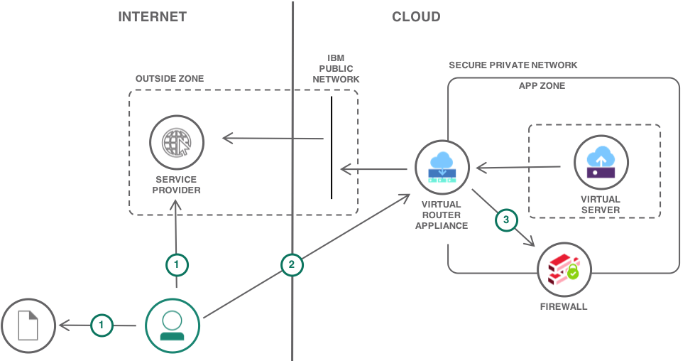

{:step: data-tutorial-type='step'}
{:java: #java .ph data-hd-programlang='java'}
{:swift: #swift .ph data-hd-programlang='swift'}
{:ios: #ios data-hd-operatingsystem="ios"}
{:android: #android data-hd-operatingsystem="android"}
{:shortdesc: .shortdesc}
{:new_window: target="_blank"}
{:codeblock: .codeblock}
{:screen: .screen}
{:tip: .tip}
{:pre: .pre}
{:note: .note}

# Configure NAT for Internet access from a private network
{: #nat-config-private}
{: toc-content-type="tutorial"}
{: toc-services="virtual-router-appliance"}
{: toc-completion-time=""}

This tutorial describes the use of **Classic Infrastructure**.  Most workloads can be implemented using [{{site.data.keyword.vpc_full}}](https://{DomainName}/docs/vpc) resources.  Use {{site.data.keyword.vpc_short}} to create your own private cloud-like computing environment on shared public cloud infrastructure. A VPC gives an enterprise the ability to define and control a virtual network that is logically isolated from all other public cloud tenants, creating a private, secure place on the public cloud.  Specifically, [virtual server instances](https://{DomainName}/docs/vpc?topic=vpc-vsi_best_practices), [security groups](https://{DomainName}/docs/vpc?topic=vpc-using-security-groups), [network ACLs](https://{DomainName}/docs/vpc?topic=vpc-using-acls) and [public gateways](https://{DomainName}/docs/vpc?topic=vpc-about-networking-for-vpc#external-connectivity).
{: note}

<!--##istutorial#-->
This tutorial may incur costs. Use the [Cost Estimator](https://{DomainName}/estimator/review) to generate a cost estimate based on your projected usage.
{: tip}
<!--#/istutorial#-->

In today’s world of web based IT applications and services, few applications exist in isolation. Developers have come to expect access to services on the Internet, whether it is open-source application code and updates or ‘third party’ services providing application functionality via REST APIs. Network Address Translation (NAT) masquerade, is a commonly used approach to securing the access to Internet hosted service from  private networks. In NAT masquerade, private IP addresses are translated to the IP address of the out-bound public interface in a many-to-one relationship, shielding the private IP address from public view.

This tutorial presents the setup of Network Address Translation (NAT) masquerade on a Virtual Router Appliance (VRA) to connect to a secured subnet on the {{site.data.keyword.Bluemix_notm}} private network. It builds on the [Isolating workloads with a secure private network](https://{DomainName}/docs/solution-tutorials?topic=solution-tutorials-secure-network-enclosure#secure-network-enclosure) tutorial, adding a Source NAT (SNAT) configuration, where the source address is obfuscated and firewall rules are used to secure out-bound traffic. More complex NAT configurations can be found in the [supplemental VRA documentation]( https://{DomainName}/docs/virtual-router-appliance?topic=virtual-router-appliance-supplemental-vra-documentation#supplemental-vra-documentation).
{: shortdesc}

## Objectives
{: #nat-config-private-objectives}

-	Setup Source Network Address Translation (SNAT) on a Virtual Router Appliance (VRA)
-	Setup firewall rules for Internet access




1.	Document required Internet services.
2.	Setup NAT.
3.	Create Internet firewall zone and rules.

## Before you begin
{: #nat-config-private-prereqs}

This tutorial enables hosts in the secure private network enclosure created by the [Isolate workloads with a secure private network](https://{DomainName}/docs/solution-tutorials?topic=solution-tutorials-secure-network-enclosure#secure-network-enclosure) tutorial to access public Internet services. That tutorial must be completed first.

## Document Internet services
{: #nat-config-private-Document_outbound}
{: step}

The first step is to identify the services that will be accessed on the public Internet and to document the ports that must be enabled for outbound and corresponding inbound traffic from the Internet. This list of ports will be required for the firewall rules in a later step.

In this example only http and https ports are enabled as these cover a majority of requirements. DNS and NTP services are provided from the {{site.data.keyword.Bluemix_notm}} private network. If these and other services such as SMTP (Port 25) or MySQL (Port 3306) are required, additional firewall rules will be necessary. The two basic port rules are:

-	Port 80 (http)
-	Port 443 (https)

Verify if the third party service supports defining a list of allowed source addresses. If yes, the public IP address of the VRA will be required to configure the third party service to limit access to the service.


## NAT masquerade to Internet
{: #nat-config-private-NAT_Masquerade}
{: step}

Follow the instructions here to configure external Internet access for hosts in the APP zone using NAT masquerade.

1.	SSH into VRA and enter \[edit\] (config) mode.
   ```bash
   SSH vyatta@<VRA Private IP Address>
   configure
   ```
   {: codeblock}

2.	Create the SNAT rules on the VRA, specifying the same `<Subnet Gateway IP>/<CIDR>` as determined for the APP zone subnet/VLAN in the prior VRA provisioning tutorial.
   ```
   set service nat source rule 1000 description 'pass traffic to the Internet'
   set service nat source rule 1000 outbound-interface 'dp0bond1'
   set service nat source rule 1000 source address <Subnet Gateway IP>/<CIDR>
   set service nat source rule 1000 translation address masquerade
   commit
   ```
   {: codeblock}

## Create Firewalls
{: #nat-config-private-Create_firewalls}
{: step}

1.	Create firewall rules for APP-TO-OUTSIDE
   ```
   set security firewall name APP-TO-OUTSIDE default-action drop
   set security firewall name APP-TO-OUTSIDE description 'APP traffic to the Internet'
   set security firewall name APP-TO-OUTSIDE default-log

   set security firewall name APP-TO-OUTSIDE rule 90 protocol tcp
   set security firewall name APP-TO-OUTSIDE rule 90 action accept
   set security firewall name APP-TO-OUTSIDE rule 90 destination port 80

   set security firewall name APP-TO-OUTSIDE rule 100 protocol tcp
   set security firewall name APP-TO-OUTSIDE rule 100 action accept
   set security firewall name APP-TO-OUTSIDE rule 100 destination port 443

   set security firewall name APP-TO-OUTSIDE rule 200 protocol icmp
   set security firewall name APP-TO-OUTSIDE rule 200 icmp type 8
   set security firewall name APP-TO-OUTSIDE rule 200 action accept
   commit
   ```
   {: codeblock}

1.	Create firewall rules OUTSIDE-TO-APP
   ```
   set security firewall name OUTSIDE-TO-APP default-action drop
   set security firewall name OUTSIDE-TO-APP description 'Internet traffic to APP'
   set security firewall name OUTSIDE-TO-APP default-log

   set security firewall name OUTSIDE-TO-APP rule 100 protocol tcp
   set security firewall name OUTSIDE-TO-APP rule 100 action accept
   set security firewall name OUTSIDE-TO-APP rule 100 destination port 443

   set security firewall name OUTSIDE-TO-APP rule 90 protocol tcp
   set security firewall name OUTSIDE-TO-APP rule 90 action accept
   set security firewall name OUTSIDE-TO-APP rule 90 destination port 80

   set security firewall name OUTSIDE-TO-APP rule 200 protocol icmp
   set security firewall name OUTSIDE-TO-APP rule 200 icmp type 8
   set security firewall name OUTSIDE-TO-APP rule 200 action accept
   commit
   ```
   {: codeblock}

## Create Zone and apply rules
{: #nat-config-private-Create_zone}
{: step}

1.	Create zone OUTSIDE to control access to the external Internet.
   ```
   set security zone-policy zone OUTSIDE default-action drop
   set security zone-policy zone OUTSIDE interface dp0bond1
   set security zone-policy zone OUTSIDE description 'External Internet'
   ```
   {: codeblock}

2.	Assign firewalls to control traffic to and from the Internet.
   ```
   set security zone-policy zone APP to OUTSIDE firewall APP-TO-OUTSIDE
   set security zone-policy zone OUTSIDE to APP firewall OUTSIDE-TO-APP
   commit
   ```
   {: codeblock}

3.	Validate the VSI in the APP zone can now access services on the Internet. Login to the local VSI using SSH:
   ```bash
   ssh root@<VSI Private IP>
   ```
   {: codeblock}

   use ping and curl to validate icmp and tcp access to sites on the Internet:
   ```bash
   ping 8.8.8.8
   curl www.google.com
   ```
   {: codeblock}

## Remove resources
{: #nat-config-private-6}
{: removeresources}
{: step}
Steps to take to remove the resources created in this tutorial.

The VRA is on a monthly paid plan. Cancellation does not result in a refund. It is suggested to only cancel if this VRA will not be required again in the next month. If a dual VRA High-Availability cluster is required, this single VRA can be upgraded on the [Gateway Details](https://{DomainName}/classic/network/gatewayappliances) page.
{: tip}

1. Cancel any virtual servers or bare-metal servers
2. Cancel the VRA
3. Cancel any additional VLANs by support ticket.

## Related content
{: #nat-config-private-7}
{: related}

-	[VRA Network Address Translation]( https://{DomainName}/docs/virtual-router-appliance?topic=virtual-router-appliance-about-the-vra#network-address-translation-nat-)
-	[NAT Masquerade]( https://{DomainName}/docs/virtual-router-appliance?topic=virtual-router-appliance-setting-up-nat-rules-on-vyatta-5400#one-to-many-nat-rule-masquerade-)
-	[Supplemental VRA documentation]( https://{DomainName}/docs/virtual-router-appliance?topic=virtual-router-appliance-supplemental-vra-documentation#supplemental-vra-documentation).

