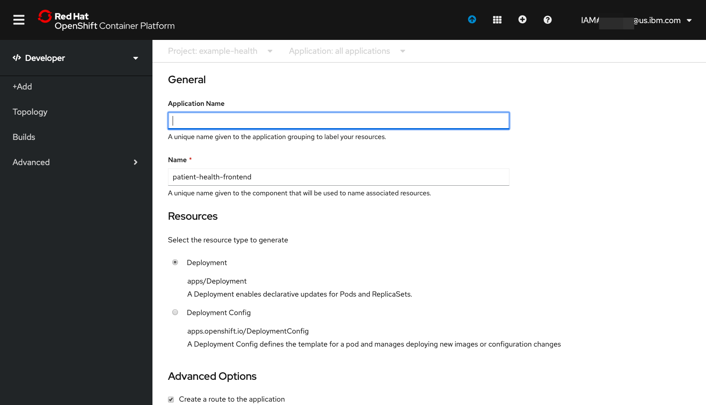
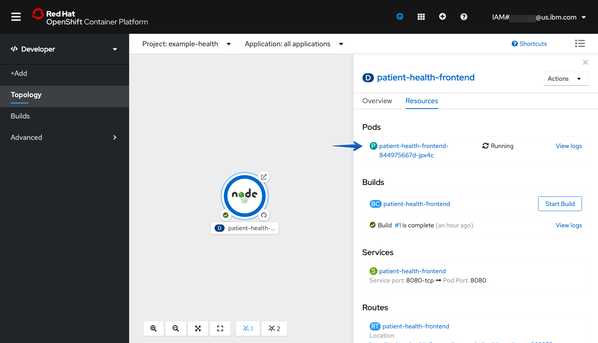
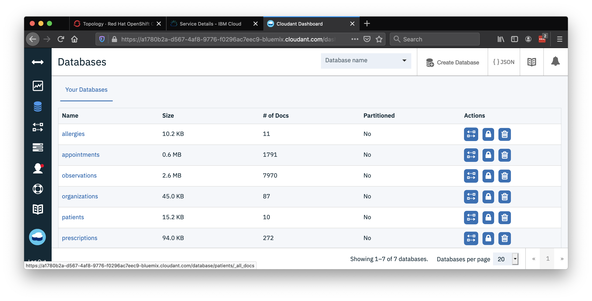
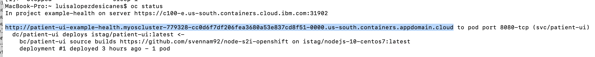
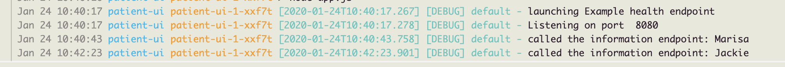
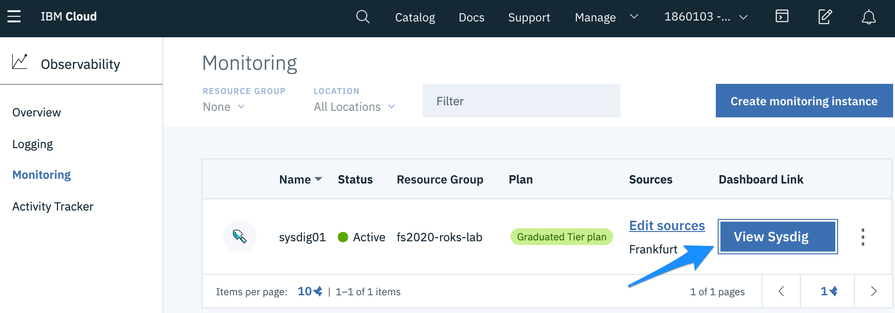
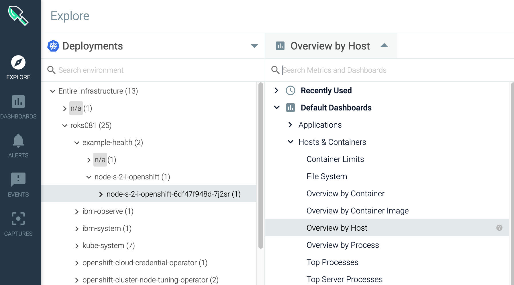

{:shortdesc: .shortdesc}
{:new_window: target="_blank"}
{:codeblock: .codeblock}
{:screen: .screen}
{:tip: .tip}
{:pre: .pre}

# {{site.data.keyword.openshiftshort}} on IBM Cloud
{: #openshift-ibm-cloud}

This tutorial demonstrates the integration of [{{site.data.keyword.openshiftlong_notm}}](https://{DomainName}/kubernetes/catalog/openshiftcluster) in the IBM Cloud.  The {{site.data.keyword.openshiftshort}} fully managed service provides a great experience for Developers to write a software application and for System Administrators to scale and observe the applications in production.

## Objectives
{: #objectives}

* Deploy an {{site.data.keyword.openshiftshort}} cluster
* Deploy a microservice
* scale the microservice
* Use an operator to deploy {{site.data.keyword.cloudant_local_notm}} and bind to a microservice
* Observe the cluster using {{site.data.keyword.la_short}}
* Observe the cluster using {{site.data.keyword.mon_full_notm}}

## Services used
{: #services}

This tutorial uses the following runtimes and services:
* [{{site.data.keyword.openshiftshort}}](https://{DomainName}/kubernetes/clusters?platformType=openshift)
* [{{site.data.keyword.cloudant_local_notm}}](https://{DomainName}/catalog/services/cloudant)
* [{{site.data.keyword.la_short}}](https://{DomainName}/observe/logging/create)
* [{{site.data.keyword.mon_full_notm}}](https://{DomainName}/observe/monitoring/create)

<!--##istutorial#-->
This tutorial will incur costs. Use the [Pricing Calculator](https://{DomainName}/estimator/review) to generate a cost estimate based on your projected usage.
<!--#/istutorial#-->

## Architecture
{: #architecture}

<p style="text-align: center;">

  
</p>

1. A developer initializes an {{site.data.keyword.openshiftshort}} application **Builder** and **Deployment** with the repository URL.
1. The **Builder** clones the source, creates an image, pushes it to OpenShift registry, then starts the app by creating a Kubernetes **Deployment** in {{site.data.keyword.openshiftshort}} cluster.
1. Users access the frontend application.
1. The {{site.data.keyword.cloudant_short_notm}} database instance is provisioned through an IBM Cloud Operator Service.
1. The backend application is connected to the database with an IBM Cloud Operator Binding.
1. {{site.data.keyword.la_short}} is provisioned and agent deployed.
1. {site.data.keyword.monitoringshort_notm}} is provisioned and agent deployed.
1. An Administrator monitors the app with {{site.data.keyword.la_short}} and {{site.data.keyword.monitoringshort_notm}}.

<!--##istutorial#-->
## Create {{site.data.keyword.openshiftshort}} cluster
{: #create_openshift_cluster}

With {{site.data.keyword.openshiftshort}}, you have a fast and secure way to containerize and deploy enterprise workloads in {{site.data.keyword.openshiftshort}} clusters. {{site.data.keyword.openshiftshort}} clusters build on Kubernetes container orchestration that offers consistency and flexibility for your development lifecycle operations.

In this section, you will provision a {{site.data.keyword.openshiftshort}} cluster with two worker nodes.

1. Create an {{site.data.keyword.openshiftshort}} cluster from the [{{site.data.keyword.Bluemix}} catalog](https://{DomainName}/kubernetes/catalog/create?platformType=openshift).
1. Set the **Cluster type and version** to **the latest version of OpenShift**.
1. Under **Location**,
   - Select **Single zone** as **Availability**.
   - Select a **Geography**.
   - Choose a **Worker zone**.
1. Under **Cluster Metadata**,
   - Set **Cluster name** to **mycluster**.
   - Select a **Resource group**.
3. Under **Default worker pool**,
   - Select **4 vCPUs 16GB RAM** as the flavor for Worker nodes.
   - Leave **Encrypt local disk** checked and select **2** Worker nodes for this tutorial.
   - Select **Purchase additional licenses for this worker pool** as your OCP entitlement.
4. Review **Infrastructure permissions checker** to verify the required permissions
5. Click **Create** to provision an {{site.data.keyword.openshiftshort}} cluster.

Take a note of the resource group selected above.  This same resource group will be used for all resources in this lab.
{:note}

### Initialize a Cloud Shell

Start a IBM Cloud Shell and initialize it with the  oc login command.

1. When the cluster is ready, before opening a {{site.data.keyword.openshiftshort}} click the **IBM Cloud Shell** button in the upper right corner to create a shell.
1. In the bash shell try the following:
   List the cluster and note the name of the one you created
   ```sh
   ibmcloud ks clusters
   ```
   {:pre}

   ```
   pquiring@cloudshell:~$ ibmcloud ks clusters
   OK
   Name          ID                     State    
   mycluster     bqo6e3gd0p5ln5o6kbhg   normal
   ```

   Initialize the oc command environment:
   ```sh
   ibmcloud oc cluster config -c mycluster --admin
   ```
   {:pre}

   Verify the oc command is working:
   ```sh
   oc get ns
   ```
   {:pre}

<!--#/istutorial#-->

<!--##isworkshop#-->
<!--
## Configure the access to your cluster
{: #access-cluster}

`ibmcloud` is the command line tool to interact with {{site.data.keyword.cloud_notm}}. It comes with plugins to work with {{site.data.keyword.cloud_notm}} services.

1. Open a command prompt.
1. Run the login command
   ```sh
   ibmcloud login
   ```
   {:pre}
2. When prompted, select the region where your cluster was allocated.
3. Enter your IBMid email and password.
4. Select the account where you have been invited.

### Log in to your cluster

In this step, you'll configure `oc` to point to the cluster assigned to you. The [{{site.data.keyword.openshiftshort}} Container Platform CLI](https://docs.openshift.com/container-platform/4.3/cli_reference/openshift_cli/getting-started-cli.html) exposes commands for managing your applications, as well as lower level tools to interact with each component of your system. The CLI is available using the `oc` command.

1. Navigate to your cluster from the [cluster list](https://{DomainName}/kubernetes/clusters?platformType=openshift) and click on the **Access** tab under the cluster name.
1. Under **After your cluster provisions, gain access** section, click on **oauth token request page** link and follow instructions to log into your cluster on a terminal.
1. Once logged-in using the `oc login` command, run the below command to see all the namespaces in your cluster
   ```sh
   oc get ns
   ```
   {:pre}
-->
<!--#/isworkshop#-->
--------------------------------------------------------------------------------
## Deploying an application

In this section, you'll deploy a simple Node.js Express application, "patient-health-frontend", a simple UI for a patient health records system. We'll use this example to demonstrate key {{site.data.keyword.openshiftshort}} features throughout this workshop. You can find the sample application GitHub repository here: https://github.com/IBM-Cloud/patient-health-frontend


### Create Project

A project is a collection of resources managed by a devops team.  An administrator will create the project and the developers can create applications that can be built and deployed.

1. Navigate to the {{site.data.keyword.openshiftshort}} web console 

    

1. In the **Administrator** perspective select the **Home** > **Projects** view on the left to display all the projects.
1. Create a new project by selecting **Create Project**. In the pop up **Name** the project "example-health", leave **Display Name** blank, click **Create**.
1. The new project's **Project Details** page is displayed.  Observe that your context in **Administrator** > **Home** > **Projects** on the left and **Projects** > **Project Details** > **example-health** on the top.  Nice.

### Build and Deploy Application

1. Switch from the **Administrator** to the **Developer** view. Make sure your project is selected.  Your context should be **Developer** > **Topology** on the left and **Project: example-health** on the top.

    

1. Let's build and deploy the application by selecting **From Git**.

1. Enter the repository `https://github.com/IBM-Cloud/patient-health-frontend` in the Git Repo URL field.

    * Click on some white space outside the box
    * Note the `Validated` indication
    * Note that the builder image automatically detected the language Node.js.
    * **Builder Image Version** leave at the default
    * **Application Name** delete all of the characters (this will default to the **Name**
    * **Name** patient-health-frontend
    * Leave defaults for other selections

1. Cick **Create** at the bottom of the window to build and deploy the application.

    

    Your application is being deployed.

### View Application

1. You should see the app you just deployed.  Notice that you are in the **Topology** view of the example-health project in the **Developer** perspective.  All applications in the project are displayed.

1. Click the center the **node** application to bring up the details view of the `Deployment` (note the **D** next to **patient-health-frontend**).  You should see your Pods, Builds, Services and Routes.

    

    * **Pods**: Your Node.js application containers
    * **Builds**: The auto-generated build that created a Docker image from your Node.js source code, deployed it to the {{site.data.keyword.openshiftshort}} container registry, and kicked off your deployment config.
    * **Services**: Tells {{site.data.keyword.openshiftshort}} how to access your Pods by grouping them together as a service and defining the port to listen to
    * **Routes**: Exposes your services to the outside world using the LoadBalancer provided by the IBM Cloud network

1. Click on **View Logs** next to your completed Build. This shows you the process that {{site.data.keyword.openshiftshort}} took to install the dependencies for your Node.js application and build/push a Docker image.


    The last entry should looks like this:
    ```
    Successfully pushed image-registry.openshift-image-registry.svc:5000/example-health/patient-health-frontend@sha256:f9385e010144f36353a74d16b6af10a028c12d005ab4fc0b1437137f6bd9e20a
    Push successful
    ```

1. Click back to the **Topology** and select your app again. Click on the url under **Routes** to open your application with the URL.

    

    You can enter any strings for username and password, for instance `test:test` because the app is running in demo mode.

Congrats! You've deployed a `Node.js` app to {{site.data.keyword.openshiftshort}} Container Platform.

To recap:

* Deployed the "Example Health" Node.js application directly from GitHub into your cluster 
  * Configured the "Source to Image" builder provided by {{site.data.keyword.openshiftshort}}
* Deployed an end-to-end development pipeline 
  * New commits that happen in GitHub can be pushed to your cluster with a simple \(re\)build
* Looked at your app in the {{site.data.keyword.openshiftshort}} console.

## Logging and monitoring

In this section, we'll explore the out-of-the-box logging and monitoring capabilities that are offered in {{site.data.keyword.openshiftshort}}.

### Simulate Load on the Application

There are times during this tutorial when it is required to generate some load.

1. First, make sure you're connected to the project where you deployed your app.
    ```sh
    oc project example-health
    ```
    {:pre}

1. Retrieve the public route to access your Example Health application:

    ```
    oc get routes
    ```
    {:pre}

    Output looks similar to this (_remember not to copy this exact host_):
    ```
    NAME         HOST/PORT                                                                                                 PATH      SERVICES     PORT       TERMINATION   WILDCARD
    patient-health-frontend   patient-health-frontend-example-health.roks07-872b77d77f69503584da5a379a38af9c-0000.eu-de.containers.appdomain.cloud             patient-health-frontend   8080-tcp                 None
    ```

1. Run the following script which will endlessly spam our app with requests:

    With Linux/MacOS:

    ```bash
    while sleep 1; do curl -s http://<host>/info; done
    ```
    {:pre}
    
    With Windows:
    
    ```bash
    while($true){curl http://<host>/info}
    ```
    {:pre}

We're hitting the `/info` endpoint which will trigger some logs from our app. For example:

[`http://patient-health-frontend-health-example.myopenshift-xxx.us-east.containers.appdomain.cloud/info`](http://patient-health-frontend-health-example.myopenshift-341665-66631af3eb2bd8030c5bb56d415b8851-0001.us-east.containers.appdomain.cloud/jee.html)

### {{site.data.keyword.openshiftshort}} Logging

Since we only created one pod, seeing our logs will be straight forward.

1. Ensure that you're in the **Topology** view of the **Developer** perspective.

2. Navigate to your Pod by selecting your app, then clicking the name of the Pod under **Pods**.

    
   
3. Click on **View Logs** next to your Pods to see streaming logs from your running application. If you're still generating traffic, you should see log messages for every request being made.

    

### {{site.data.keyword.openshiftshort}} Terminal

One of the great things about Kubernetes is the ability to quickly debug your application pods with SSH terminals. This is great for development, but generally is not recommended in production environments. {{site.data.keyword.openshiftshort}} makes it even easier by allowing you to launch a terminal directly in the dashboard.

1. Switch from the **Logs** tab to the **Terminal** tab

3. Run the following Shell commands:

| Command | Description | 
| :--- | :--- |
| ls | List the project files. |
| ps aux | List the running processes. |
| cat /etc/redhat-release | Show the underlying OS. |
| curl localhost:8080/info | output from the node app.js process |

### {{site.data.keyword.openshiftshort}} Monitoring

When deploying new apps, making configuration changes, or simply inspecting the state of your cluster, the Project-scope Dashboard gives Developer Clear Insights.

1. Access the **Dashboard** now in the **Developer** perspective by going to the **Advanced > Project Details** tab on the left side menu.

    

2. You can also dive in a bit deeper - the **Events** view (beneath the **Project Details** on the left) is useful for identifying the timeline of events and finding potential error messages. When tracking the state of a new rollout, managing existing assets, or even something simple like exposing a route, the Events view is critical in identifying the timeline of activity. This becomes even more useful when considering that multiple operators may be working against a single cluster.

You'll want to refer to this view throughout the lab. Almost all actions we take in in {{site.data.keyword.openshiftshort}} will result in an event being fired in this view. As it is updated real-time, it's a great way to track changes to state.

## Metrics and dashboards

In this section, we'll explore the third-party monitoring and metrics dashboards that are installed for free with {{site.data.keyword.openshiftshort}}!

### Grafana

Red Hat {{site.data.keyword.openshiftshort}} on IBM Cloud comes with [Grafana](https://grafana.com/) preinstalled.

1. Get started by switching from the **Developer** perspective to the **Administrator** perspective:

2. Navigate to **Monitoring > Dashboards** in the left-hand bar. You'll be asked to login with {{site.data.keyword.openshiftshort}} and then click through some permissions.

    <p  style="width: 50%;">

    
    </p>


3. You should then see your Grafana dashboard. Hit **Home** on the top left, and choose **Kubernetes / Compute Resources / Namespace (Pods)**.

4. For the **Namespace** field, choose `example-health` which is the name of the project your app resides in.

5. You should be able to see the CPU and Memory usage for your application. In production environments, this is helpful for identifying the average amount of CPU or Memory your application uses, especially as it can fluctuate through the day. We'll use this information in the next section to set up auto-scaling for our pods.

    <p  style="width: 50%;">

    
    </p>

5. There is a lot more we could investigate with Grafana, but we are going to closely examine {{site.data.keyword.la_short}} in more detail later.  {{site.data.keyword.la_short}} provides log analysis for {{site.data.keyword.openshiftshort}} and the other IBM Cloud Services in a single managed service.

### Prometheus

Navigating back to the {{site.data.keyword.openshiftshort}} console, you can also launch:

* [**Prometheus**](https://prometheus.io/) - a monitoring system with an efficient time series database
* [**Alertmanager**](https://prometheus.io/docs/alerting/alertmanager/) - an extension of Prometheus focused on managing alerts


{{site.data.keyword.openshiftshort}} provides a web interface to Prometheus, which enables you to run Prometheus Query Language \(PromQL\) queries and examine the metrics visualized on a plot. This functionality provides an extensive overview of the cluster state and enables you to troubleshoot problems. Take a look around, and try the **Insert Example Query**.

1. The Metrics page is accessible in the **Administrator** perspective by clicking **Monitoring → Metrics**.

2. Navigate through the **Prometheus UI**. You'll be asked to login with {{site.data.keyword.openshiftshort}} and then click through some permissions.

3. In the top box a query expression can be entered.  Paste in the following to get a look at our frontend:
 
    ```
    sum(container_cpu_usage_seconds_total{container="patient-health-frontend"})
    ```

4. Clilck on the **Graph** tab.  I turned the traffic generator script on for a while and then stopped it.  Note that the times are GMT:
    <p  style="width: 50%;">

    
    </p>

5. There is a lot more we could investigate with Prometheus, but we are going to closely examine {{site.data.keyword.mon_short}} in more detail later.  {{site.data.keyword.mon_short}} montiors {{site.data.keyword.openshiftshort}} and the other IBM Cloud Services in a single managed service.

## Scaling the application

In this section, we'll leverage the metrics we've observed in the previous step to automatically scale our UI application in response to load.

### Enable Resource Limits

Before we can setup autoscaling for our pods, we first need to set resource limits on the pods running in our cluster. Limits allows you to choose the minimum and maximum CPU and memory usage for a pod.

Verify your script to simulate load is running, Grafana showed you that your application was consuming anywhere between ".002" to ".02" cores. This translates to 2-20 "millicores". That seems like a good range for our CPU request, but to be safe, let's bump the higher-end up to 30 millicores. In addition, Grafana showed that the app consumes about `25`-`35` MB of RAM. Set the following resource limits for your deployment now.

1. Switch to the **Administrator** perspective and then navigate to **Workloads > Deployments** in the left-hand bar. Choose the `patient-health-frontend` Deployment, then choose **Actions > Edit Deployment**.

    

2. In the YAML editor, go to line 44. In the section **template > spec > containers**, add the following resource limits into the empty resources. Replace the `resources {}`, and ensure the spacing is correct -- YAML uses strict indentation.


  ```yaml
             resources:
               limits:
                 cpu: 30m
                 memory: 100Mi
               requests:
                 cpu: 3m
                 memory: 40Mi
  ```
  {:pre}

Here is a snippet after you have made the changes:
  ```yaml
             ports:
                 - containerPort: 8080
                 protocol: TCP
             resources:
                 limits:
                 cpu: 30m
                 memory: 100Mi
                 requests:
                 cpu: 3m
                 memory: 40Mi
             terminationMessagePath: /dev/termination-log
  ```

3. **Save** and **Reload** to see the new version.

4. Verify that the replication controller has been changed by navigating to **Events**

    

### Enable Autoscaler

Now that we have resource limits, let's enable autoscaler.

By default, the autoscaler allows you to scale based on CPU or Memory. The UI allows you to do CPU only \(for now\). Pods are balanced between the minimum and maximum number of pods that you specify. With the autoscaler, pods are automatically created or deleted to ensure that the average CPU usage of the pods is below the CPU request target as defined. In general, you probably want to start scaling up when you get near `50`-`90`% of the CPU usage of a pod. In our case, let's make it `1`% to test the autoscaler since we are generating minimal load.

1. Navigate to **Administrator** perspective **Workloads > Horizontal Pod Autoscalers**, then hit **Create Horizontal Pod Autoscaler**.

    

    If you edit in the changes make sure that the spec > scaleTargetRef > name matches the name of the deployment: `patient-health-frontend`.  You can just copy/paste in the entire section below:

    ```yaml
    apiVersion: autoscaling/v2beta1
    kind: HorizontalPodAutoscaler
    metadata:
      name: patient-hpa
      namespace: example-health
    spec:
      scaleTargetRef:
        apiVersion: apps/v1
        kind: Deployment
        name: patient-health-frontend
      minReplicas: 1
      maxReplicas: 10
      metrics:
        - type: Resource
          resource:
            name: cpu
            targetAverageUtilization: 1
    ```
    {:pre}

2. Hit **Create**.

### Test Autoscaler

If you're not running the script to simulate load, the number of pods should stay at 1.

1. Check by opening the **Overview** page of the deployment.  Click **Workloads** > **Deployments** and click **patient-health-frontend** and make sure the **Overview** panel is selected.

2. Start simulating load by hitting the page several times, or running the script. You'll see that it starts to scale up:

    <p  style="width: 50%;">

   
    </p>

That's it! You now have a highly available and automatically scaled front-end Node.js application. {{site.data.keyword.openshiftshort}} is automatically scaling your application pods since the CPU usage of the pods greatly exceeded `1`% of the resource limit, `30` millicores.

### Autoscaling from the command line

You can also can delete and create resources like autoscalars with the command line.

Start by verifying the context is your project and get the autoscalar that was created earlier:
```
oc project example-health
```
{:pre}
```
oc get hpa
```
{:pre}

Delete the autoscalar made earlier.
```
oc delete hpa/patient-hpa
```
{:pre}

Create a new autoscaler with a max of 9 pods:
```
oc autoscale deployment/patient-health-frontend --name patient-hpa --min 1 --max 9 --cpu-percent=1
```
{:pre}

Revisit the **Workloads > Deployments** overview page for patient-health-frontnd deployment and watch it work.


## Cloudant DB with IBM Cloud Operator

Currently, the Example Health `patient-health-frontend` app is using a dummy in-memory patient. In this exercise, you'll create a Cloudant service in IBM Cloud and populate it with patient data. Cloudant is a NoSQL database-as-a-service, based on CouchDB.

### Enable the IBM Cloud Operator

Let's understand exactly how Operators work. In the first exercise, you used a builder to deploy a simple application using a DeploymentConfig and Pods -- these are "default resources" that come with {{site.data.keyword.openshiftshort}}. A custom resource definition allows you to create resources that do not come preinstalled with {{site.data.keyword.openshiftshort}} such an IBM Cloud service. Operators manage the lifecycle of resources and create Custom Resourcde Descriptors, CRDs, allowing you to manage custom resources the native "Kubernetes" way.

1. In the **Administrator** perspective, and click **Operators > OperatorHub**.

2. Find the **IBM Cloud Operator**, and hit **Install**

   

3. Keep the default options and hit **Subscribe**:

   

4. You may need to wait a few seconds and refresh for the operator to show up as `Installed`:

   

### Create a Cloudant Service and Bind using the CRDs
An API key with the appropriate permissions to create a {{site.data.keyword.cloudant_short_notm}} database.  The API key is going to be stored in a kubernetes Secret resource.  This will need to be created using the shell.  There are great instructions in the **Requirements** section of the installed operator.  Below is my experience in the shell:

1. List the resource groups

   ```sh
   ibmcloud resource groups
   ```
   {:pre}

1. Skip the command `ibmcloud target --cf -g default` it is using `--cf` that is for cloud foundry and is not required for {{site.data.keyword.cloudant_short_notm}}. Use the same resource group that is associated with your cluster.  For me it was `default`, you can double check:
   ```sh
   ibmcloud ks clusters
   ```
   {:pre}

   ```sh
   ibmcloud target -g default
   ```
   {:pre}

7. Verify that it looks something like this.  CF API endpoint, Org and Space can be empty.

    ```sh
    ibmcloud target
    API endpoint:      https://{DomainName}   
    Region:            us-south   
    User:              YOU@us.ibm.com   
    Account:           YOURs Account (32cdeadbeefdeadbeef1234132412343) <-> 1234567   
    Resource group:    default   
    CF API endpoint:   
    Org:
    Space:
    ```

9. Use the helper script provided by IBM to create the following resources:
    - ibm cloud API key that represents you and your permissions to use the IBM cloud
    - kubernetes Secret named `secret-ibm-cloud-operator` in the `default` namespace.  This secret has data keys `api-key` and `region`.  The operator will use this data to create the cloudant service instance.
    - kubernetes ConfigMap resource with the name `config-ibm-cloud-operator` in the `default` namespace to hold the region and resource group
    
    Copy curl command from the Requirements section not from the text below:

    ```sh
    curl ... | bash
    ```

1. Verify that the kubernetes ConfigMap has been created:
    ```sh
    kubectl describe configmap  config-ibm-cloud-operator  -n default
    ```
    {:pre}

    You can verify the resourcegroupid value by passing your resource group name in the following command, my name is `default`
    ```sh
    ibmcloud resource group default
    ```
    {:pre}

1. Verify that the kubernetes secret has been created:
    ```sh
    kubectl describe secret secret-ibm-cloud-operator -n default
    ```
    {:pre}

    generates

    ```sh
    Name:         secret-ibm-cloud-operator
    Namespace:    default
    Labels:       app.kubernetes.io/name=ibmcloud-operator
                seed.ibm.com/ibmcloud-token=apikey
    Annotations:  
    Type:         Opaque

    Data
    ====
    api-key:  44 bytes
    region:   8 bytes
    ```

    Describe avoids showing the contents of a secret by default. This is to protect the secret from being exposed accidentally to an onlooker, or from being stored in a terminal log.  You can use the `secret/secret-ibm-cloud-operator -n default -o yaml` to see the values and decode the fields by piping into `base64 --decode`

9. In the instructions \<SERVICE_CLASS\> is `cloudantnosqldb` and \<PLAN\> is `lite`

    ```sh
    ibmcloud catalog service cloudantnosqldb | grep plan
    ```
    {:pre}

    Like this:
    ```
    $ ibmcloud catalog service cloudantnosqldb | grep plan
            dedicated-hardware                          plan         cloudant-dedicated-hardware
            extension-for-apache-couchdb                plan         cloudant-extension-couchdb
            lite                                        plan         cloudant-lite
            standard                                    plan         cloudant-standard
    ```

9. Back in the GUI, click the **Create Instance** in the **Service** box on the **Installed Operators** page to bring up the yaml editor.  Make the suggested substitutions:
    ```yaml
    apiVersion: ibmcloud.ibm.com/v1alpha1
    kind: Service
    metadata:
      name: cloudant-service
      namespace: example-health
    spec:
      serviceClass: cloudantnosqldb
      plan: standard
    ```
    {:pre}

    Then click **Create** to create a {{site.data.keyword.cloudant_short_notm}} database instance.

    Your context should be **Operators** > **Installed Operators**  > **IBM Cloud Operator** in the **Administrative** perspective with Project: example-health in the **Service** panel.

    Click on the **Service** just created and over time the **State** field will change from **provisioning** to **Online** meaning it is good to go.

5. Create a Binding resource associated with the Service resource you just created.  Navigate back to  **Operators** > **Installed Operators**  > **IBM Cloud Operator** and notice in the top next to the **Service** tab there is a **Binding** tab.  Open the **Binding** tab and click **Create Binding** .  Create a cloudant-binding associated with the serviceName `cloudant-service`, the name provided in the **Service**
    ```yaml
    apiVersion: ibmcloud.ibm.com/v1alpha1
    kind: Binding
    metadata:
      name: cloudant-binding
      namespace: example-health
    spec:
      serviceName: cloudant-service
    ```
    {:pre}

6. Verify the binding was created.   Click on your binding, and look for **Message: Online**. By navigating to the **Resources** tab, you can see that the **cloudant-binding** secret is created. Click that to see your credentials for accessing your Cloudant DB, stored securely in a secret:

   

### Deploy the Node.js Patient Backend Database App

Now you'll create the Node.js app that will populate your Cloudant DB with patient data. It will also serve data to the front-end application deployed earlier.

1. Make sure you're your context is the project **example-health**:

    ```sh
    oc project example-health
    ```
    {:pre}

1. The following new-app commmand will make a build configuration and Deployment Configuration.  The following demonstrates the CLI invocation of the add application (remember using the GUI console for the frontend):
    ```sh
    oc new-app --name=patient-health-backend centos/nodejs-10-centos7~https://github.com/IBM-Cloud/patient-health-backend
    ```
    {:pre}

3. Back in the console in the **Topology** view of the **Developer** perspective open the **backend** app to notice that the **Pod** is failing to start.  Click on the **Pod** logs to see:
    ```
    > node app.js

    /opt/app-root/src/app.js:23
            throw("Cannot find Cloudant credentials, set CLOUDANT_URL.")
            ^
    Cannot find Cloudant credentials, set CLOUDANT_URL.
    ```

4. Let's fix this by setting the environment variable to the **cloudant-binding** secret we created in the earlier operator section. Navigate to the deployment config for the `patient-health-backend` app by clicking the app, and then selecting the name next to **DC**:

   

5. Go to the **Environment** tab, click **Add from Config Map or Secret** and create a new environment variable named **CLOUDANT_URL**. Choose the **cloudant-binding** secret, then choose **url** for the Key. Hit the **Save** button.

   

6. Go back to the **Topology** tab, and click the **patient-health-backend**.  Check out the **Pods** section, which should should indicate **Running** shortly.  Click on the **Pod** **logs** and notice the databases created.

### Configure Patient Health Frontend App to use Patient Health Backend App

The `patient-health-frontend` application has a configuration option for the backend database. To start using the backend app with the connected cloudant database you configured above, follow the steps below to configure it.

1. Access your **patient-health-frontend** application again and click **Settings**.

   To find your routes, you can use the {{site.data.keyword.openshiftshort}} console or type `oc get routes`.

   

2. Input the route `http://patient-health-backend:8080/` and hit the **node** {{site.data.keyword.openshiftshort}} icon.

   You won't need to expose this application with the `oc expose` command. This is because your frontend `patient-health-frontend` application can talk to the backend `patient-health-backend` without the network request leaving the cluster. Kubernetes keeps an internal DNS record of the services which resolve to the IPs of the running application.

   

Your application is now backed by the mock patient data in the Cloudant DB! You can log-in using any user-id/password in the Cloudant DB, for example "**opall:opall**".

1. In a real-world application, these passwords should **not** be stored as plain-text. To review the patients (and alternate logins) in the Cloudant DB, navigate to your services in IBM Cloud [Resource List](https://{DomainName}/resources). Click **cloudant-service**.

   

2. Launch the Cloudant dashboard and click the `patients` db.

   

3. Click through the different patients you can log-in as.

   

## Configure {{site.data.keyword.la_short}} agent for {{site.data.keyword.openshiftshort}}  cluster

The {{site.data.keyword.la_short}} agent is responsible for collecting and forwarding logs to your IBM Log Analysis with LogDNA instance. After you provision an instance of IBM Log Analysis with LogDNA, you must configure a LogDNA agent for each log source that you want to monitor.

To configure your Kubernetes cluster to send logs to your IBM Log Analysis with LogDNA instance, you must install a *LogDNA-agent* pod on each node of your cluster. The LogDNA agent reads log files from the pod where it is installed, and forwards the log data to your LogDNA instance.

<!--##isworkshop#-->
<!--
 If you've been invited to a lab account where an instance of {{site.data.keyword.la_short}} has already been provisioned and configured, skip the create and deploy steps and go to the step Verify the agent at the bottom. Find your {{site.data.keyword.la_short}} instance by looking at the cluster name in the tags attached to the instance. 
-->
<!--#/isworkshop#-->

### Create a {{site.data.keyword.la_short}} service instance

1. Click this link for [IBM Cloud Logging with LogDNA](https://{DomainName}/observe/logging/create) or open the ibmcloud console, click the hamburger menu  in upper left, and choose **Observability** > **Logging**:
   1. Click **Create instance**
   1. Select the region where your cluster is created (.e.g Dallas)
   1. Select the **Graduated Tier** name?? plan
   1. Set the **Service name** to **YOUR_IBM_ID-logdna**.
   1. Use the resource group associated with your cluster.
   1. Click **Create**.

### Deploy the {{site.data.keyword.la_short}} agent in the cluster

1. On your instance, click **Edit log sources**.

1. Before running the curl command in the next step, make sure you're still logged in to the cluster.

1. Select the **{{site.data.keyword.openshiftshort}}** tab and run the 5 steps listed:

    

    The {{site.data.keyword.la_short}} agent collects logs with the extension `*.log` and extensionsless files that are stored in the `/var/log` directory of your pod. By default, logs are collected from all namespaces, including `kube-system`, and automatically forwarded to the IBM Log Analysis with {{site.data.keyword.la_short}} service.

### Verify that the {{site.data.keyword.la_short}} agent is deployed successfully

To verify that the {{site.data.keyword.la_short}} agent is deployed successfully, run the following command:

1. Target the project where the {{site.data.keyword.la_short}} agent is deployed.

    ```
    oc project ibm-observe
    ```

2. Verify that the `{{site.data.keyword.la_short}}-agent` pods on each node are in a **Running** status.

    ```
    oc get pods -n ibm-observe
    ```


The deployment is successful when you see one or more {{site.data.keyword.la_short}} pods.
* **The number of {{site.data.keyword.la_short}} pods equals the number of worker nodes in your cluster.**
* All pods must be in a `Running` state.
* *Stdout* and *stderr* are automatically collected and forwarded from all containers. Log data includes application logs and worker logs.
* By default, the {{site.data.keyword.la_short}} agent pod that runs on a worker collects logs from all namespaces on that node.

After the agent is configured, you should start seeing logs from this cluster in the {{site.data.keyword.la_short}} web UI. If after a period of time you cannot see logs, check the agent logs.

To check the logs that are generated by a {{site.data.keyword.la_short}} agent, run the following command:

```
oc logs logdna-agent-<ID>
```

Where *ID* is the ID for a {{site.data.keyword.la_short}} agent pod. 

For example, 

```
oc logs logdna-agent-xxxkz
```

## Analyze your logs with {{site.data.keyword.la_short}}

IBM Log Analysis with {{site.data.keyword.la_short}} is a co-branded service that you can include as part of your IBM Cloud architecture to add log management capabilities. IBM Log Analysis with {{site.data.keyword.la_short}} is operated by {{site.data.keyword.la_short}} in partnership with IBM. [Learn more](https://{DomainName}/docs/Log-Analysis-with-LogDNA?topic=LogDNA-getting-started).

You can use IBM Log Analysis with {{site.data.keyword.la_short}} to manage system and application logs in IBM Cloud.

This section of the tutorial goes deep into the IBM logging service.  You can stop this section at any time and successfully begin the next section.
{:note}

### Launch the {{site.data.keyword.la_short}} webUI

You launch the web UI within the context of an IBM Log Analysis with {{site.data.keyword.la_short}} instance, from the IBM Cloud UI. 

1. Select your instance.

1. Click **View LogDNA**.

   

The Web UI opens.

### Create a custom view

In {{site.data.keyword.la_short}}, you can configure custom views to monitor a subset of data. You can also attach an alert to a view to be notified of the presence or absence of log lines.

When you launch the {{site.data.keyword.la_short}} web UI, log entries are displayed with a predefined format. You can modify in the **User Preferences** section how the information in each log line is displayed. You can also filter logs and modify search settings, then bookmark the result as a _view_. You can attach and detach one or more alerts to a view. You can define a custom format for how your lines are shown in the view. You can expand a log line and see the data parsed.

### View events with the default format

1. In the {{site.data.keyword.la_short}} web UI, click the **Views** icon .
2. Select **Everything** to see all the events.


### Customize your default view

In the **USER PREFERENCES** section, you can modify the order of the data fields that are displayed per line.

1. Select the **Configuration** icon .
2. Select **USER PREFERENCES**. A new window opens.
3. Select **Log Format**.
4. Modify the _Line Format_ section to match your requirements. Drag boxes around. Click **Done**.

    For example, add **%app** after the timestamp.

    


### Create a custom view to monitor logs

You can select the events that are displayed through a view by applying a search query in the search bar, selecting values in the search area, or a combination of both. You can save that view for reuse later.

1. In the {{site.data.keyword.la_short}} web UI, filter out the logs for the sample app that you have delpoyed in the cluster in previous steps.

   From the {{site.data.keyword.openshiftshort}} console, go to the developer view. Select the project where you have deployed the sample app, and get the pod name. For example: `patient-health-frontend-8658f89574-rgjw8` 

   

2. Click in the search bar at the bottom and enter the following query: `host:{podName}` where {podName} is the name of your pod. For example: `host:patient-health-frontend-8658f89574-rgjw8`

   

   Click enter.

3. Filter out log lines to display only lines that are tagged as debug lines. 

   Add in the search bar the following query: `level:debug` and click enter. The view will show lines that meet the filter and search criteria. For example: `host:patient-health-frontend-8658f89574-rgjw8 level:debug` 

   

4. Save the custom view.

   Click **Unsaved view**. Select **Save view**.

   

   Enter the name of the view. Use the following format: `<Enter your user name> patientUI`. For example, `marisa patientui`

   Enter a category. Use the following format: `<Enter your user name>`. For example, `marisa` Then click **Add new category**.

   Click **Save view**.

A new category appears on the left navigation panel.


#### Generate application log data

Generate logs:

1. Run `oc project example-health`.
2. Get the application URL.

    

3. Launch the application from a browser. Enter in the browser the application URL. Then, log in and log out with different names to see login entries for each user.

    

### Analyze a log line

At any time, you can view each log line in context.

Complete the following steps:

1. Click the **Views** icon .
2. Select **Everything** or a view.
3. Identify a line in the log that you want to explore.
4. Expand the log line.

   Information about line identifiers, tags, and labels is displayed.

5. Click **View in Context** to see the log line in context of other log lines from that host, app, or both. This is a very useful feature when you want to troubleshoot a problem.

   

   A new pop up window opens.

   

   Choose one of the following options:

   **By Everything** to see the log line in the context of all log records \(everything\) that are available in the {{site.data.keyword.la_short}} instance.

   **By source** to see the log line in the context of the log lines for the same source.

   **By App** to see the log line in the context of the log lines of the app.

   **By Source and App** to see the log line in the combined context of the app and source.

   Then click **Continue in New Viewer** to get the view in a different page. You might need to scroll down to get this option.

   > **Tip: Open a view per type of context to troubleshoot problems.**

6. Click **Copy to clipboard** to copy the message field to the clipboard. 

    For example, the log record in the UI looks like:

    

    When you copy the record, you get:

    ```
    [2020-01-16T13:22:25.951] [DEBUG] default - called the information endpoint for Marisa
    ```

    Notice that when you copy the log record you get less information than what it is displayed in the view. To get a line with all the fields, you must export data from a custom view. 

When you are finished, close the line.

### View a subset of the events by applying a timeframe

In a view, you can search events that are displayed through a view for a specific timeframe.

You can apply a timestamp by specifying an absolute time, a relative time, or a time range.

Complete the following steps to jump to a specific time: 

1. Launch the {{site.data.keyword.la_short}} web UI. 

2. Click the **Views** icon . 

3. Select your custom view. 

4. Enter a time query. Choose any of the following options:

    Enter an absolute time to jump to a point in time in your events such as `January 27 10:00am`.

    

    Enter a relative time such as `5 days ago`. 

    

    You can also enter a time range such as `yesterday 10am to yesterday 11am`, `last fri 4:30pm to 11/12 1 AM`, `last wed 4:30pm to 23/05 1 AM`, or `May 20 10am to May 22 10am`. Make sure to include `to` to separate the initial timestamp from the end timestamp.

    Click **ENTER**.

You might get the error message: `Your request is taking longer than expected, try refreshing your browser in a bit as we try to catch up. Retry.` You might get this error when the timeframe that you have specified does not have any events available to show. Change the time query, and retry.

### Create a dashboard

You can create a dashboard to monitor your app graphically through interactive graphs.

For example, you can use graphs to analyze patterns and trends over a period of time.

Complete the following steps to create a dashboard to monitor logs from the lab's sample app:

1. In the {{site.data.keyword.la_short}} web UI, click the **Boards** icon .
2. Select **NEW BOARD** to create a new dashboard.
3. Click **Add graph**.
4. Select the field **host**, then select the value that matches your pod name.

   

   Click **Add graph**.

   

5. Open a view that displays the logs for the patientui app. Click the graph in a peak of data at the time that you want to see logs, and then click **Show logs**.

   

   A new page opens with the relevant log entries.

6. Add subplots to analyze the data by applying additonal filtering criteria.

   

   Click **Show subplots**.

   Select **Histogram** and **level**.

   

7. Name the dashboard by hitting "Edit".

   Enter `patientui` as the name of the dashboard.

   Enter a category. Use the following format: `<Enter your user name>` For example, `marisa` Then click **Add new category**.

   Click **Save**.

A new category appears on the left navigation panel.

### Create a screen to monitor your app

You can create a screen to monitor your app graphically through metrics \(counters\), operational KPIs \(gauges\), tables, and time-shifted graphs \(graphs that you can use to analyze patterns and trends for comparison analysis\).

Complete the following steps to create a dashboard to monitor logs from the lab's sample app:

1. In the {{site.data.keyword.la_short}} web UI, click the **screens** icon .
2. Select **NEW SCREEN**.
3. Click **Add Widget** and select **Count**.

   Click the widget. You will get the configuration fields for this widget.

   To configure the _Count_ widget to report on the log lines for the application patientui, you must select the field **app**, and set the value to **patientui**.

   You can also add a label, by entering a value for the _label_ field -- for example `App PatientUI`

   The widget should look similar to the following one:

   

4. Add a gauge.

   Click **Add Widget**.

   Select **Gauge**.

   Click the widget. You will get the configuration fields for this widget.

   To configure the _Gauge_ widget to report on the debug log lines for the application patientui, you must select the field **level**, and set the value to **debug**. Then, set the advanced condition `app:patientui`. The duration is set to the default, last 1 day.

   

   Add a label, by entering a value for the _label_ field. Enter `PatientUI - INFO`. Also add the gauge limits `0` for Minimum and `5000` for maximum.

   The widget should look similar to the following one:

   

5. Add a table.

   Click **Add Widget**.

   

   Select **Table**.

   

   Click the widget. You will get the configuration fields for this widget.

   To list the number of records in the last 24 hours for the cluster namespaces, set `Group By` to **namespace**.

   

   Change the default number of rows from 3 to 10.

   The widget should look similar to the following one:

   

6. Save the screen. Select **Save Screen**.

   IMPORTANT: If you do not save the screen, you lose all your widgets.

Find more about IBM Log Analysis with {{site.data.keyword.la_short}} in the [IBM Cloud documentation](https://{DomainName}/docs/services/Log-Analysis-with-LogDNA/index.html#getting-started).
{:note}

## Configure {{site.data.keyword.monitoringshort}}

The IBM Cloud provides a fully managed monitoring service.  Lets create a monitoring instance and then integrate it with your {{site.data.keyword.openshiftshort}} cluster using a script that creates a project and privileged service account for the {{site.data.keyword.monitoringshort_notm}} agent.

<!--##isworkshop#-->
<!--
 If you've been invited to a lab account where an instance of {{site.data.keyword.monitoringshort_notm}} has already been provisioned and configured, skip the create and deploy steps and go to the step verify the agent at the bottom. Find your {{site.data.keyword.monitoringshort_notm}} instance by looking at the cluster name in the tags attached to the instance. 
-->
<!--#/isworkshop#-->

### Create a {{site.data.keyword.monitoringshort_notm}} service instance

1. Click this link for [IBM Cloud Monitoring with Sysdig](https://{DomainName}/observe/monitoring/create) or open the ibmcloud console, click the hamburger menu  in upper left, and choose **Observability** > **Monitoring**:
   1. Click **Create a monitoring instance**
   1. Select the region where your cluster is created (.e.g Dallas)
   1. Select the **Graduated Tier** plan
   1. Set the **Service name** to **YOUR_IBM_ID-sysdig**.
   1. Use the resource group associated with your cluster.
   1. Click **Create**.
1. In the [**Observability** category, under Monitoring](https://{DomainName}/observe/monitoring), locate the service instance you created.

### Deploy the {{site.data.keyword.monitoringshort_notm}} agent in the cluster

1. On your instance, click **Edit sources**.

1. Before running the curl command in the next step, make sure you're still logged in to the cluster.
    ```sh
    oc project
    ```
    {:pre}

    ```sh
    oc project
    curl -sL https://...
    ```


1. Select the **{{site.data.keyword.openshiftshort}}** tab and run the curl command next to **Public Endpoint**

    

    The {{site.data.keyword.monitoringshort_notm}} agent collects metrics such as the worker node CPU usage, worker node memory usage, HTTP traffic to and from your containers, and data about several infrastructure components.

### Verify that the {{site.data.keyword.monitoringshort_notm}} agent is deployed successfully

Verify that the `sydig-agent` pods on each node have a **Running** status.

Run the following command:

```text
oc get pods -n ibm-observe
```

Example output:

```text
    NAME                 READY     STATUS    RESTARTS   AGE
    sysdig-agent-qrbcq   1/1       Running   0          1m
    sysdig-agent-rhrgz   1/1       Running   0          1m
```


## Monitor your Cluster with SysDig

IBM Cloud Monitoring with {{site.data.keyword.monitoringshort_notm}} is a co-branded cloud-native, and container- intelligence management system that you can include as part of your IBM Cloud architecture. Use it to gain operational visibility into the performance and health of your applications, services, and platforms. It offers administrators, DevOps teams, and developers full stack telemetry with advanced features to monitor and troubleshoot performance issues, define alerts, and design custom dashboards. IBM Cloud Monitoring with {{site.data.keyword.monitoringshort_notm}} is operated by Sysdig in partnership with IBM. [Learn more](https://{DomainName}/docs/Monitoring-with-Sysdig?topic=Sysdig-getting-started).

In the next steps, you will learn how to use dashboards and metrics to monitor the health of your application.

### View SysDig pre-defined views and dashboards

Use views and dashboards to monitor your infrastructure, applications, and services. You can use pre-defined dashboards. You can also create custom dashboards through the Web UI or programmatically. You can backup and restore dashboards by using Python scripts.

The following table lists the different types of pre-defined dashboards:

| Type | Description | 
| :--- | :--- |
| Applications | Dashboards that you can use to monitor your applications and infrastructure components. |
| Host and containers | Dashboards that you can use to monitor resource utilization and system activity on your hosts and in your containers. |
| Network | Dashboards that you can use to monitor your network connections and activity. | 
| Service | Dashboards that you can use to monitor the performance of your services, even if those services are deployed in orchestrated containers. | 
| Topology | Dashboards that you can use to monitor the logical dependencies of your application tiers and overlay metrics. | 


### Complete the {{site.data.keyword.monitoringshort_notm}} installation wizard

1. Launch the {{site.data.keyword.monitoringshort_notm}} web UI.

    

2. In the {{site.data.keyword.monitoringshort_notm}} Welcome wizard, click **Next**
   

3. Select **Kubernetes | GKE | OpenShift** as the installation method.
   

4. You should see a message `You have X agents connected`. Click **GO TO NEXT STEP**. 
   

5. Setup is complete. Click **LET'S GET STARTED**
   

6. Select **Next**
   

7. Finally **Complete Onboarding**

   


### View the {{site.data.keyword.monitoringshort_notm}} dashboard

1. Navigate the {{site.data.keyword.monitoringshort_notm}} console to get metrics on your Kubernetes cluster, nodes, deployments, pods, containers.

2. Under the **Explore** section,select **Containerized Apps** to view raw metrics for all workloads running on the cluster.

   

3. Under **Explore**, select **Nodes**, search `patient-health-frontend`. Look for the partientui pod entry.

   

4. Under **Dashboard**, select **Default Dashboards** &gt; **Applications**. Then select **HTTP** to get a global view of the cluster HTTP load.

5. Under Dashboard, select **Default Dashboards** &gt; **Hosts & Containers**. Then select **Overview by Host** to understand how nodes are currently performing.


### Explore the normal traffic flow of the application

You can use the **Connection Table** dashboard to monitor how data flows between your application components.

1. From the **Explore** tab, select **Deployments**.
2. Select your cluster (e.g. roks081). Then, select the namespace where you deployed your sample app.
3. Select the _patientui_ pod entry.
4. Select **Default Dashboards**.

   

5. Check out the two dashboards under **Hosts & Containers**:
   * **Overview by Host**
   * **Overview by Container**.

### Explore the cluster and the node capacity

1. From the **Explore** tab, select **Deployments**.
2. Select your cluster (e.g. roks081). Then, select the namespace where you deployed your sample app.
3. Select the _patientui_ pod entry.
4. Select **Default Dashboards**.
5. Select **Kubernetes > Kuberentes Cluster and Node Capacity**. 

   

   Check the **Total CPU Capacity**. This is the CPU capacity that has been reserved for the node including system daemons.

   Check the **Total Allocatable CPU**. This is the CPU which is available for pods excluding system daemons.

   Check the **Total Pod CPU limit**. It should be less than the allocatable CPU of the node or cluster.

   Check the **Total Pod CPU Requested**. It is the amount of CPU that will be guaranteed for pods on the node or cluster.

   Check the **Total Pod CPU Usage**. It is the total amount of CPU that is used by all Pods on the node or cluster.

### Explore the Network

1. From the **DASHBOARDS** tab, select **Default Dashboards**. Then, select **Network > Overview**.

   The following dashboard is displayed. It shows information about all resources that are monitored thorugh the instance.

   

2. Change the scope of the dashboard to display information about your {{site.data.keyword.openshiftshort}} cluster. Select **Edit scope** on the right side and change it:

    

    The dashboard now shows information about the ibm-observe namespace.

    

Find more about IBM Cloud Monitoring with {{site.data.keyword.monitoringshort_notm}} in the [IBM Cloud documentation](https://{DomainName}/docs/services/Monitoring-with-Sysdig/index.html#getting-started).

## Remove resources
{:#cleanup}

<!--##isworkshop#-->
<!--
* Delete all application resource objects:
   ```sh
   oc delete all --selector app=$MYPROJECT
   ```
   {:pre}
* Delete the project:
   ```sh
   oc delete project $MYPROJECT
   ```
   {:pre}
-->
<!--#/isworkshop#-->
<!--##istutorial#-->
In the [Resource List](https://{DomainName}/resources) locate and delete the resources you created:
* Delete the {{site.data.keyword.openshiftshort}} cluster
* IBM Log Analysis with {{site.data.keyword.la_short}} instance
* IBM Monitoring with Sysdig instance
* Cloudant service 
<!--#/istutorial#-->

## Related content

* [{{site.data.keyword.openshiftlong_notm}}](https://{DomainName}/docs/openshift?topic=openshift-why_openshift)
* [{{site.data.keyword.cloudant_short_notm}}](https://{DomainName}/catalog/services/cloudant)
- [Analyze logs and monitor application health with LogDNA and Sysdig](https://{DomainName}/docs/tutorials?topic=solution-tutorials-application-log-analysis#application-log-analysis).
* [Horizontal Pod Autoscaling](https://docs.openshift.com/container-platform/4.3/nodes/pods/nodes-pods-autoscaling.html)