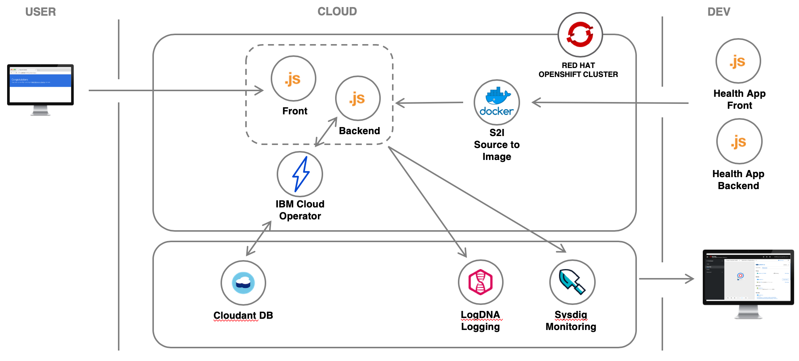

{:shortdesc: .shortdesc}
{:new_window: target="_blank"}
{:codeblock: .codeblock}
{:screen: .screen}
{:tip: .tip}
{:pre: .pre}

# {{site.data.keyword.openshiftshort}} on IBM Cloud - Bring it all together
{: #openshift-ibm-cloud}

This tutorial demonstrates the integration of [{{site.data.keyword.openshiftlong_notm}}](https://{DomainName}/kubernetes/catalog/openshiftcluster) with the IBM Cloud.  This managed services provides a great experience for both Developers and System Administrators to develop, deploy, and run containerized applications.

You will familiarize yourself with {{site.data.keyword.openshiftshort}}, deploy a micro-service Node.js application to OpenShift, scale the application, connect to a Cloudant DBaaS TODO, check logs with LogDNA TODO and monitor with Sysdig TODO.

{{site.data.keyword.openshiftshort}}


## Objectives
{: #objectives}

* Deploy an application to the {{site.data.keyword.openshiftlong_notm}} cluster.
* TODO

## Services used
{: #services}

This tutorial uses the following runtimes and services:
* [{{site.data.keyword.openshiftlong_notm}}](https://{DomainName}/kubernetes/clusters?platformType=openshift)
* [Cloudant TODO](https://cloud.ibm.com/catalog/services/cloudant)
* [IBM Log Analysis with LogDNA TODO](https://cloud.ibm.com/observe/logging/create)
* [IBM Cloud Monitoring with Sysdig TODO](https://cloud.ibm.com/observe/monitoring/create)


<!--##istutorial#-->
This tutorial will incur costs. Use the [Pricing Calculator](https://{DomainName}/estimator/review) to generate a cost estimate based on your projected usage.
<!--#/istutorial#-->

## Architecture
{: #architecture}

<p style="text-align: center;">

  
</p>

1. A developer deploy a Node.js micro service application from the OpenShift Console.
1. Building the application produces a Docker container image.
1. The image is pushed to a project in OpenShift cluster.
1. The application is deployed to a OpenShift cluster.
1. Users access the application.
1. A developer connects the application to a Cloudant database with IBM Cloud Operator.
1. An Ops monitors the app with LogDNA and Sysdig.


<!--##istutorial#-->
## Create an {{site.data.keyword.openshiftshort}} cluster
{: #create_openshift_cluster}

With {{site.data.keyword.openshiftlong_notm}}, you have a fast and secure way to containerize and deploy enterprise workloads in {{site.data.keyword.openshiftshort}} clusters. {{site.data.keyword.openshiftshort}} clusters build on Kubernetes container orchestration that offers consistency and flexibility for your development lifecycle operations.

In this section, you will provision a {{site.data.keyword.openshiftlong_notm}} cluster with two worker nodes.

1. Create an {{site.data.keyword.openshiftshort}} cluster from the [{{site.data.keyword.Bluemix}} catalog](https://{DomainName}/kubernetes/catalog/create?platformType=openshift).
1. Set the **Cluster type and version** to **the latest version of OpenShift**.
1. Under **Location**,
   - Select **Single zone** as **Availability**.
   - Select a **Geography**.
   - Choose a **Worker zone**.
1. Under **Cluster Metadata**,
   - Set **Cluster name** to **myopenshiftcluster**.
   - Select a **Resource group**.
3. Under **Default worker pool**,
   - Select **4 vCPUs 16GB RAM** as the flavor for Worker nodes.
   - Leave **Encrypt local disk** checked and select **2** Worker nodes for this tutorial.
   - Select **Purchase additional licenses for this worker pool** as your OCP entitlement.
4. Review **Infrastructure permissions checker** to verify the required permissions
5. Click **Create** to provision an {{site.data.keyword.openshiftshort}} cluster.

### Configure CLI

In this step, you'll configure `oc` to point to your newly created cluster. The [{{site.data.keyword.openshiftshort}} Container Platform CLI](https://docs.openshift.com/container-platform/4.3/cli_reference/openshift_cli/getting-started-cli.html) exposes commands for managing your applications, as well as lower level tools to interact with each component of your system. The CLI is available using the `oc` command.

1. When the cluster is ready, click on the **Access** tab under the cluster name.
1. Under **After your cluster provisions, gain access** section, click on **oauth token request page** link and follow instructions to log into your cluster on a terminal.
1. Once logged-in using the `oc login` command, run the below command to see all the namespaces in your cluster
   ```sh
   oc get ns
   ```
   {:pre}
<!--#/istutorial#-->

<!--##isworkshop#-->
<!--
## Configure the access to your cluster
{: #access-cluster}

`ibmcloud` is the command line tool to interact with {{site.data.keyword.cloud_notm}}. It comes with plugins to work with {{site.data.keyword.cloud_notm}} services.

1. Open a command prompt.
1. Run the login command
   ```sh
   ibmcloud login
   ```
   {:pre}
2. When prompted, select the region where your cluster was allocated.
3. Enter your IBMid email and password.
4. Select the account where you have been invited.

### Log in to your cluster

In this step, you'll configure `oc` to point to the cluster assigned to you. The [{{site.data.keyword.openshiftshort}} Container Platform CLI](https://docs.openshift.com/container-platform/4.3/cli_reference/openshift_cli/getting-started-cli.html) exposes commands for managing your applications, as well as lower level tools to interact with each component of your system. The CLI is available using the `oc` command.

1. Navigate to your cluster from the [cluster list](https://{DomainName}/kubernetes/clusters?platformType=openshift) and click on the **Access** tab under the cluster name.
1. Under **After your cluster provisions, gain access** section, click on **oauth token request page** link and follow instructions to log into your cluster on a terminal.
1. Once logged-in using the `oc login` command, run the below command to see all the namespaces in your cluster
   ```sh
   oc get ns
   ```
   {:pre}
-->
<!--#/isworkshop#-->

## Start

start things up


## Remove resources
{:#cleanup}

* Delete all application resource objects:
   ```sh
   oc delete all --selector app=$MYPROJECT
   ```
   {:pre}
* Delete the project:
   ```sh
   oc delete project $MYPROJECT
   ```
   {:pre}
<!--##istutorial#-->
* Delete the cluster you created.
* TODO cloudant, sysdig, logdna
<!--#/istutorial#-->

## Related content

* [{{site.data.keyword.openshiftlong_notm}}](https://{DomainName}/docs/openshift?topic=openshift-why_openshift)
* TODO
