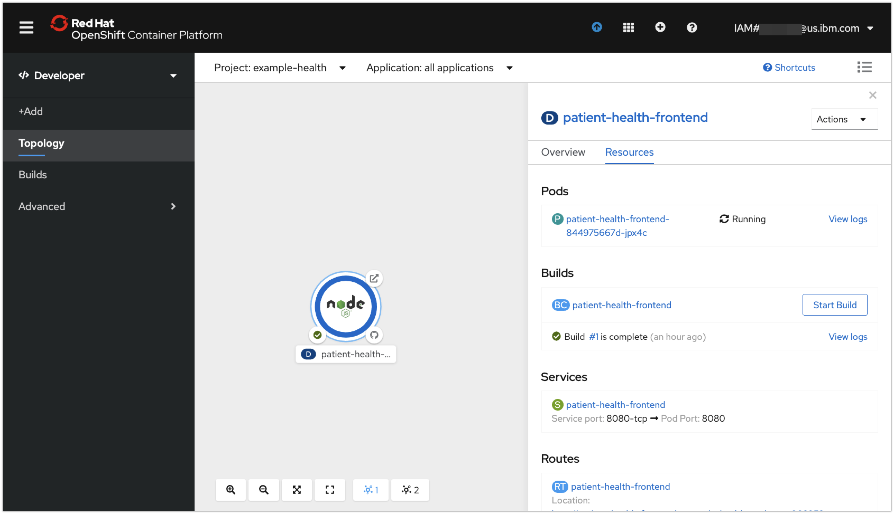
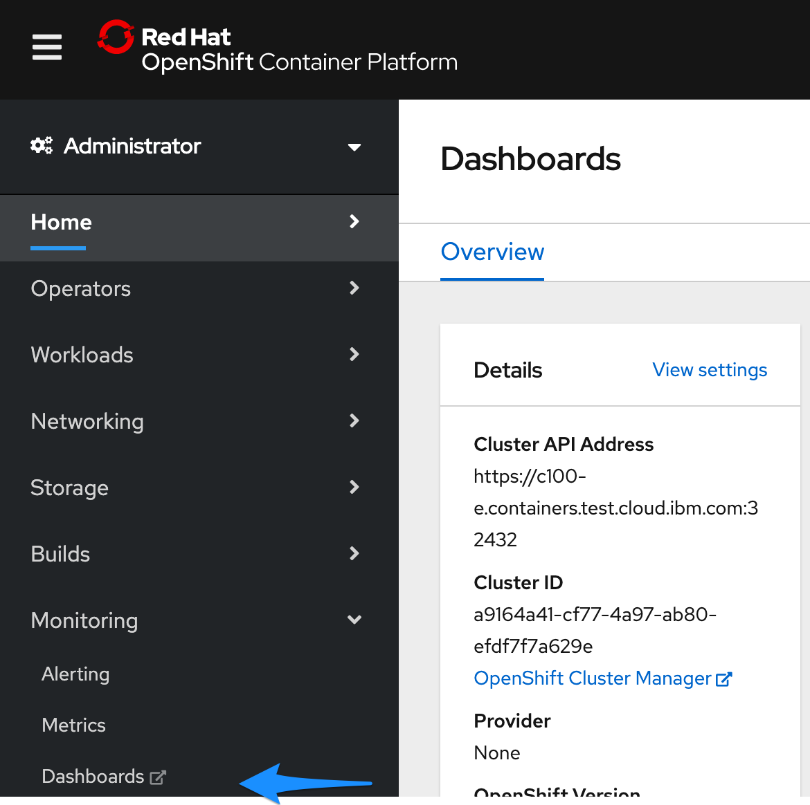
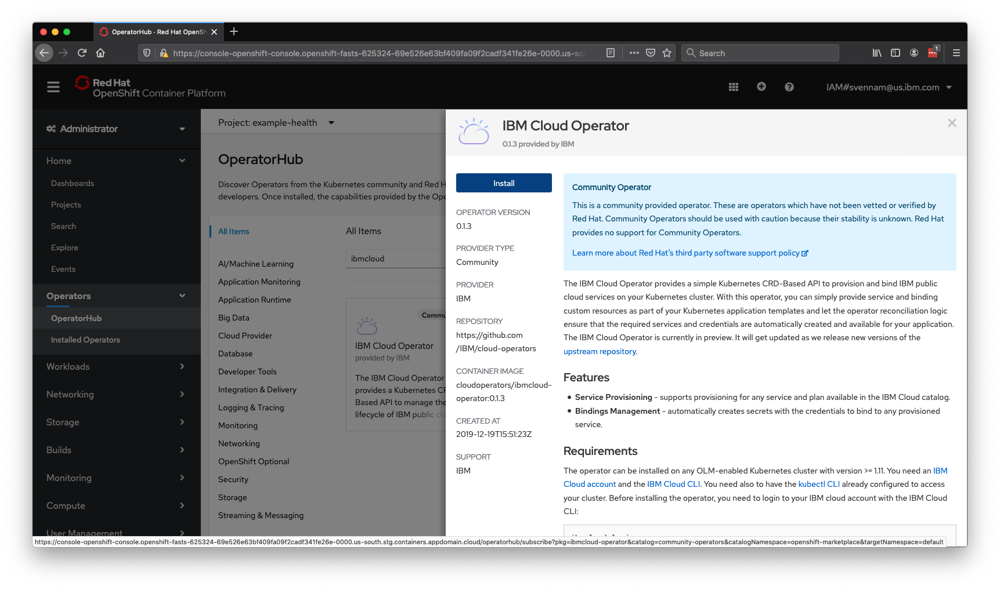
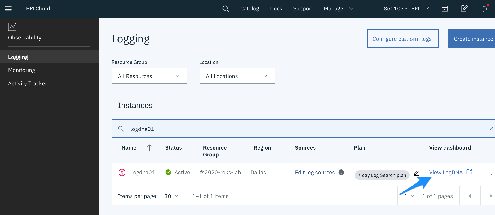
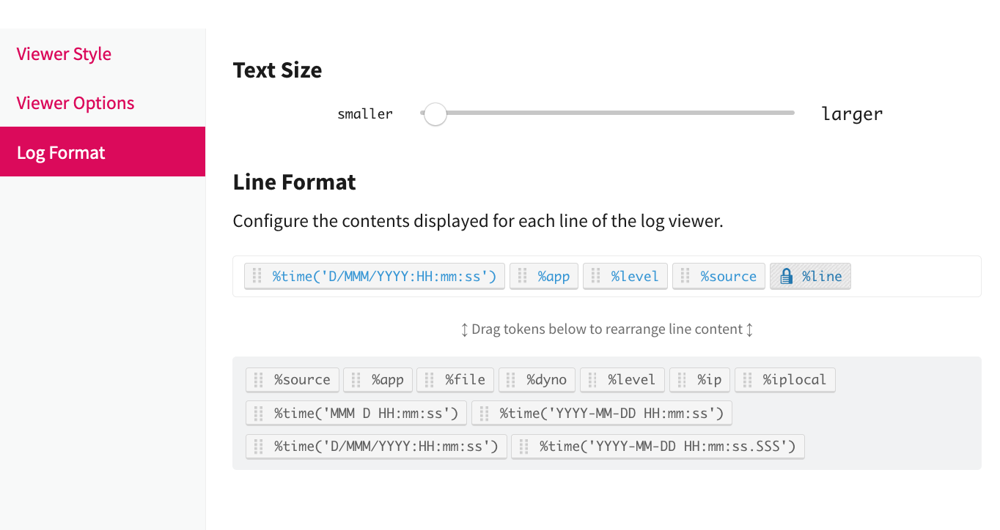

{:java: #java .ph data-hd-programlang='java'}
{:swift: #swift .ph data-hd-programlang='swift'}
{:ios: #ios data-hd-operatingsystem="ios"}
{:android: #android data-hd-operatingsystem="android"}
{:shortdesc: .shortdesc}
{:new_window: target="_blank"}
{:codeblock: .codeblock}
{:screen: .screen}
{:tip: .tip}
{:pre: .pre}
{:important: .important}
{:note: .note}

# {{site.data.keyword.openshiftshort}} on IBM Cloud
{: #openshift-ibm-cloud}

This tutorial demonstrates the integration of [{{site.data.keyword.openshiftlong_notm}}](https://{DomainName}/kubernetes/catalog/openshiftcluster) in the IBM Cloud.  The {{site.data.keyword.openshiftshort}} fully managed service provides a great experience for Developers to write a software application and for System Administrators to scale and observe the applications in production.

## Objectives
{: #objectives}

* Deploy an {{site.data.keyword.openshiftshort}} cluster
* Deploy a microservice
* Scale the microservice
* Use an operator to deploy {{site.data.keyword.cloudant_short_notm}} and bind to a microservice
* Observe the cluster using {{site.data.keyword.la_short}}
* Observe the cluster using {{site.data.keyword.mon_full_notm}}

## Services used
{: #services}

This tutorial uses the following runtimes and services:
* [{{site.data.keyword.openshiftshort}}](https://{DomainName}/kubernetes/clusters?platformType=openshift)
* [{{site.data.keyword.cloudant_short_notm}}](https://{DomainName}/catalog/services/cloudant)
* [{{site.data.keyword.la_short}}](https://{DomainName}/observe/logging/create)
* [{{site.data.keyword.mon_full_notm}}](https://{DomainName}/observe/monitoring/create)

<!--##istutorial#-->
This tutorial will incur costs. Use the [Pricing Calculator](https://{DomainName}/estimator/review) to generate a cost estimate based on your projected usage.
<!--#/istutorial#-->

## Architecture
{: #architecture}

<p style="text-align: center;">

  
</p>

1. A developer initializes an {{site.data.keyword.openshiftshort}} application with a repository URL resulting in a **Builder**, **Deployment**, and **Service**
1. The **Builder** clones the source, creates an image, pushes it to OpenShift registry for **Deployment** provisioning.
1. Users access the frontend application.
1. The {{site.data.keyword.cloudant_short_notm}} database instance is provisioned through an IBM Cloud Operator Service.
1. The backend application is connected to the database with an IBM Cloud Operator Binding.
1. {{site.data.keyword.la_short}} is provisioned and agent deployed.
1. {{site.data.keyword.monitoringshort_notm}} is provisioned and agent deployed.
1. An Administrator monitors the app with {{site.data.keyword.la_short}} and {{site.data.keyword.monitoringshort_notm}}.

<!--##istutorial#-->
## Create {{site.data.keyword.openshiftshort}} cluster
{: #create_openshift_cluster}

With {{site.data.keyword.openshiftshort}}, you have a fast and secure way to containerize and deploy enterprise workloads in {{site.data.keyword.openshiftshort}} clusters. {{site.data.keyword.openshiftshort}} clusters build on Kubernetes container orchestration that offers consistency and flexibility for your development lifecycle operations.

In this section, you will provision a {{site.data.keyword.openshiftshort}} cluster with two worker nodes.

1. Create an {{site.data.keyword.openshiftshort}} cluster from the [{{site.data.keyword.Bluemix}} catalog](https://{DomainName}/kubernetes/catalog/create?platformType=openshift).
2. Set the **Orchestration service** to **the Latest,Default version of OpenShift**.
3. Select **Purchase additional licenses for this worker pool** as your OCP entitlement.
4. Under **Location**,
   - Select a **Resource group**
   - Select a **Geography**
   - Select **Single zone** as **Availability**
   - Choose a **Worker zone**
5. Under **Worker pools**,
   - Select **4 vCPUs 16GB Memory** as the flavor
   - Select **2** Worker nodes per data center for this tutorial and Leave **Encrypt local disk** On.
6. Review **Infrastructure permissions checker** to verify the required permissions
7. Under **Resource details**,Set **Cluster name** to **myopenshiftcluster**.
8. Click **Create** to provision an {{site.data.keyword.openshiftshort}} cluster.

Take a note of the resource group selected above.  This same resource group will be used for all resources in this lab.
{:note}

<!--#/istutorial#-->

<!--##isworkshop#-->
<!--
## Configure the access to your cluster
{: #access-cluster}

1. Log in to the {{site.data.keyword.cloud_notm}} console.
1. Select the account where you have been invited.
1. Find the cluster assigned to you in the [cluster list](https://{DomainName}/kubernetes/clusters?platformType=openshift).
-->
<!--#/isworkshop#-->

### Initialize a Cloud Shell

In this step, you'll use the {{site.data.keyword.Bluemix_notm}} shell and configure `oc` to point to the cluster assigned to you. The [{{site.data.keyword.openshiftshort}} Container Platform CLI](https://docs.openshift.com/container-platform/4.3/cli_reference/openshift_cli/getting-started-cli.html) exposes commands for managing your applications, as well as lower level tools to interact with each component of your system. The CLI is available using the `oc` command.

1. When the cluster is ready, before clicking on the **OpenShift web console** button, click the **IBM Cloud Shell** button in the upper right corner to create a shell.
1. Initialize the `oc` command environment:
   ```sh
   ibmcloud oc cluster config -c mycluster --admin
   ```
   {:pre}
1. Verify the `oc` command is working:
   ```sh
   oc get ns
   ```
   {:pre}

## Deploying an application

In this section, you'll deploy a Node.js Express application named `patient-health-frontend`, a user interface for a patient health records system to demonstrate {{site.data.keyword.openshiftshort}} features. You can find the sample application GitHub repository here: https://github.com/IBM-Cloud/patient-health-frontend

### Create Project

A project is a collection of resources managed by a devops team.  An administrator will create the project and the developers can create applications that can be built and deployed.

1. Navigate to the {{site.data.keyword.openshiftshort}} web console by clicking the **OpenShift web console** button in the selected **Cluster**
1. In the **Administrator** perspective select the **Home** > **Projects** view on the left to display all the projects.
1. Create a new project by selecting **Create Project**. In the pop up **Name** the project "example-health", leave **Display Name** blank, click **Create**.
1. The new project's **Project Details** page is displayed.  Observe that your context is **Administrator** > **Home** > **Projects** on the left and **Projects** > **Project Details** > **example-health** on the top.

### Build and Deploy Application

1. Switch from the **Administrator** to the **Developer** view. Make sure your project is selected.  Your context should be **Developer** > **Topology** on the left and **Project: example-health** on the top.
   
1. Let's build and deploy the application by selecting **From Git**.
1. Enter the repository `https://github.com/IBM-Cloud/patient-health-frontend` in the Git Repo URL field.
   * Hit the tab key
   * Note the `Validated` indication
   * Note that the builder image automatically detected the language Node.js.
   * **Builder Image Version** leave at the default
   * **Application Name** delete all of the characters (this will default to the **Name**)
   * **Name** patient-health-frontend
   * Leave defaults for other selections
1. Click **Create** at the bottom of the window to build and deploy the application.

### View Application

1. You should see the app you just deployed.  Notice that you are in the **Topology** view of the example-health project in the **Developer** perspective.  All applications in the project are displayed.
1. Select the **node** **patient-health-frontend** to bring up the details view of the `Deployment`.  Note the **D** next to **patient-health-frontend**.  The Pods, Builds, Services and Routes are visible.
   

   * **Pods**: Your Node.js application containers
   * **Builds**: The auto-generated build that created a Docker image from your Node.js source code, deployed it to the {{site.data.keyword.openshiftshort}} container registry, and kicked off your deployment config.
   * **Services**: Tells {{site.data.keyword.openshiftshort}} how to access your Pods by grouping them together as a service and defining the port to listen to
   * **Routes**: Exposes your services to the outside world using the LoadBalancer provided by the IBM Cloud network
1. Click on **View Logs** next to your completed Build. This shows you the process that {{site.data.keyword.openshiftshort}} took to install the dependencies for your Node.js application and build/push a Docker image.  The last entry should looks like this:
   ```
   Successfully pushed image-registry.openshift-image-registry.svc:5000/example-health/patient-health-frontend@sha256:f9385e010144f36353a74d16b6af10a028c12d005ab4fc0b1437137f6bd9e20a
   Push successful
   ```
1. Click back to the **Topology** and select your app again.
1. Click on the url under **Routes** to open your application with the URL. Enter any strings for username and password, for instance `test:test` because the app is running in demo mode.

The `Node.js` app has been deployed to {{site.data.keyword.openshiftshort}} Container Platform. To recap:
   * The "Example Health" Node.js application was deployed directly from GitHub into your cluster.
   * The application was exaimined in the {{site.data.keyword.openshiftshort}} console.
   * A **Build Configuration** was created - a new commit can be both built and deployed by clicking the **Actions** > **Start Build** in the **Build Configuration**.

## Logging and monitoring

In this section, you will explore the out-of-the-box logging and monitoring capabilities that are offered in {{site.data.keyword.openshiftshort}}.

### Simulate Load on the Application

Create a script to simulate load.

1. Make sure you're connected to the project where you deployed your app.
   ```sh
   oc project example-health
   ```
   {:pre}
1. Retrieve the public route to access your application:
   ```
   oc get routes
   ```
   {:pre}
   Output looks similar to this, note your value for Host:
   ```
   NAME         HOST/PORT                                                                                                 PATH      SERVICES     PORT       TERMINATION   WILDCARD
   patient-health-frontend   patient-health-frontend-example-health.roks07-872b77d77f69503584da5a379a38af9c-0000.eu-de.containers.appdomain.cloud             patient-health-frontend   8080-tcp                 None
   ```
1. Define a variable with the host:
   ```sh
   HOST=$(oc get routes -o json | jq -r '.items[0].spec.host')
   ```
   {:pre}
1. Verify access to the application. It outputs patient information:
   ```sh
   curl -s http://$HOST/info
   ```
   {:pre}
   Output should look like:
   ```
   $ curl http://$HOST/info
   {"personal":{"name":"Ralph DAlmeida","age":38,"gender":"male","street":"34 Main Street","city":"Toronto","zipcode":"M5H 1T1"},"medications":["Metoprolol","ACE inhibitors","Vitamin D"],"appointments":["2018-01-15 1:00 - Dentist","2018-02-14 4:00 - Internal Medicine","2018-09-30 8:00 - Pediatry"]}
   ```
1. Run the following script which will endlessly send requests to the application:

   With Linux/MacOS:
   ```bash
   while sleep 1; do curl --max-time 2 -s http://$HOST/info; done
   ```
   {:pre}
   With Windows: 
   ```bash
   while($true){curl --max-time 2 http://<host>/info}
   ```
   {:pre}

### {{site.data.keyword.openshiftshort}} Logging

Since there is only one pod, seeing the application logs will be straight forward.

1. Ensure that you're in the **Topology** view of the **Developer** perspective.
2. Navigate to your Pod by selecting your app, then clicking the name of the Pod under **Pods**.
3. Click on **View Logs** next to your Pods to see streaming logs from your running application. If you're still generating traffic, you should see log messages for every request being made.

   

### {{site.data.keyword.openshiftshort}} Terminal

One of the great things about Kubernetes is the ability to quickly debug your application pods with SSH terminals. This is great for development, but generally is not recommended in production environments. {{site.data.keyword.openshiftshort}} makes it even easier by allowing you to launch a terminal directly in the dashboard.

1. Switch from the **Logs** tab to the **Terminal** tab
1. Run the following Shell commands:

| Command | Description | 
| :--- | :--- |
| `ls` | List the project files. |
| `ps aux` | List the running processes. |
| `cat /etc/redhat-release` | Show the underlying OS. |
| `curl localhost:8080/info` | output from the node app.js process |

### {{site.data.keyword.openshiftshort}} Monitoring

When deploying new apps, making configuration changes, or simply inspecting the state of your cluster, the Project-scope Dashboard gives Developer clear insights.

1. Access the **Dashboard** in the **Developer** perspective by going to the **Advanced > Project Details** tab on the left side menu.
    
2. You can also dive in a bit deeper - the **Events** view (beneath the **Project Details** on the left) is useful for identifying the timeline of events and finding potential error messages. When tracking the state of a new rollout, managing existing assets, or even something simple like exposing a route, the Events view is critical in identifying the timeline of activity. This becomes even more useful when considering that multiple operators may be working against a single cluster.

Almost all actions in {{site.data.keyword.openshiftshort}} result in an event being fired in this view. As it is updated real-time, it's a great way to track changes to state.

## Metrics and dashboards

In this section explore the third-party monitoring and metrics dashboards included in {{site.data.keyword.openshiftshort}}.

### Grafana

Red Hat {{site.data.keyword.openshiftshort}} on IBM Cloud comes with [Grafana](https://grafana.com/) preinstalled.

1. Get started by switching from the **Developer** perspective to the **Administrator** perspective:
2. Navigate to **Monitoring > Dashboards** in the left-hand bar. You'll be asked to login with {{site.data.keyword.openshiftshort}} and then click through some permissions.
   <p style="height: 50%;">

   
   </p>
3. You should then see your Grafana dashboard. Hit **Home** on the top left, and choose **Kubernetes / Compute Resources / Namespace (Pods)**.
4. For the **Namespace** field, choose `example-health` which is the name of the project your app resides in.
5. Notice the CPU and Memory usage for your application. In production environments, this is helpful for identifying the average amount of CPU or Memory your application uses, especially as it can fluctuate through the day.  Auto-scaling is one way to handle fluctuations and will be demonstrated a little later.
   <p style="width: 50%;">

   
   </p>
5. There is a lot more to investigate with Grafana, but instead the fully managed cloud {{site.data.keyword.la_short}} service will be covered in detail later.  {{site.data.keyword.la_short}} provides log analysis for {{site.data.keyword.openshiftshort}} and the other IBM Cloud Services in a single managed service.

### Prometheus

Navigating back to the {{site.data.keyword.openshiftshort}} console, you can also launch:

* [**Prometheus**](https://prometheus.io/) - a monitoring system with an efficient time series database
* [**Alertmanager**](https://prometheus.io/docs/alerting/alertmanager/) - an extension of Prometheus focused on managing alerts

{{site.data.keyword.openshiftshort}} provides a web interface to Prometheus, which enables you to run Prometheus Query Language \(PromQL\) queries and examine the metrics visualized on a plot. This functionality provides an extensive overview of the cluster state and enables you to troubleshoot problems. Take a look around, and try the **Insert Example Query**.

1. The Metrics page is accessible in the **Administrator** perspective by clicking **Monitoring → Metrics**.
2. Navigate through the **Prometheus UI**. You'll be asked to login with {{site.data.keyword.openshiftshort}} and then click through some permissions.
3. In the top box a query expression can be entered.  Paste in the following to get a look at our frontend:
   ```
   sum(container_cpu_usage_seconds_total{container="patient-health-frontend"})
   ```
4. Click on the **Graph** tab.  I turned the traffic generator script on for a while and then stopped it.  Note that the times are GMT:
   <p style="width: 50%;">

   
   </p>
5. There is a lot more to investigate with Prometheus, but instead the fully managed {{site.data.keyword.mon_short}} service will be covered later.

## Scaling the application

In this section, the metrics observed in the previous section can be used to scale the UI application in response to load.

### Enable Resource Limits

Before autoscaling maximum CPU and memory resource limits must be established.

Verify script to simulate load is running. Grafana earlier showed you that the load was consuming anywhere between ".002" to ".02" cores. This translates to 2-20 "millicores". To be safe, let's bump the higher-end up to 30 millicores. In addition, Grafana showed that the app consumes about `25`-`35` MB of RAM. The following steps will set the resource limits in the deployment

1. Switch to the **Administrator** perspective and then navigate to **Workloads > Deployments** in the left-hand bar. Choose the `patient-health-frontend` Deployment, then choose **Actions > Edit Deployment**.
   
2. In the YAML editor, go to line 44. In the section **template > spec > containers**, add the following resource limits into the empty resources. Replace the `resources {}`, and ensure the spacing is correct -- YAML uses strict indentation.
   ```yaml
             resources:
               limits:
                 cpu: 30m
                 memory: 100Mi
               requests:
                 cpu: 3m
                 memory: 40Mi
   ```
   {:codeblock}
   Here is a snippet after you have made the changes:
   ```yaml
             ports:
                 - containerPort: 8080
                 protocol: TCP
             resources:
                 limits:
                 cpu: 30m
                 memory: 100Mi
                 requests:
                 cpu: 3m
                 memory: 40Mi
             terminationMessagePath: /dev/termination-log
   ```
   {:codeblock}
3. **Save** and **Reload** to see the new version.
4. Verify that the replication controller has been changed by navigating to **Events**
   

### Enable Autoscaler

Now autoscaler can be enabled.

By default, the autoscaler allows you to scale based on CPU or Memory. The UI allows you to do CPU only \(for now\). Pods are balanced between the minimum and maximum number of pods that you specify. With the autoscaler, pods are automatically created or deleted to ensure that the average CPU usage of the pods is below the CPU request target as defined. In general, you probably want to start scaling up when you get near `50`-`90`% of the CPU usage of a pod. In our case, `1`% can be used with the load being provided.

1. Navigate to **Administrator** perspective **Workloads > Horizontal Pod Autoscalers**, then hit **Create Horizontal Pod Autoscaler**.

   

   If you edit in the changes make sure that the spec > scaleTargetRef > name matches the name of the deployment: `patient-health-frontend`.  You can just copy/paste in the entire section below:

   ```yaml
   apiVersion: autoscaling/v2beta1
   kind: HorizontalPodAutoscaler
   metadata:
     name: patient-hpa
     namespace: example-health
   spec:
     scaleTargetRef:
       apiVersion: apps/v1
       kind: Deployment
       name: patient-health-frontend
     minReplicas: 1
     maxReplicas: 10
     metrics:
       - type: Resource
         resource:
           name: cpu
           targetAverageUtilization: 1
   ```
   {:pre}
2. Hit **Create**.

### Test Autoscaler

If you're not running the script to simulate load, the number of pods should stay at 1.

1. Check by opening the **Overview** page of the deployment.  Click **Workloads** > **Deployments** and click **patient-health-frontend** and make sure the **Overview** panel is selected.
2. Start simulating load (see previous section to simulate load on the application)
   <p style="width: 50%;">

   
   </p>

That's it! You now have a highly available and automatically scaled front-end Node.js application. {{site.data.keyword.openshiftshort}} is automatically scaling your application pods since the CPU usage of the pods greatly exceeded `1`% of the resource limit, `30` millicores.

### Autoscaling from the command line

You can also can delete and create resources like autoscalars with the command line.

1. Start by verifying the context is your project:
   ```
   oc project example-health
   ```
   {:pre}
1. Get the autoscaler that was created earlier:
   ```
   oc get hpa
   ```
   {:pre}
1. Delete the autoscaler made earlier:
   ```
   oc delete hpa/patient-hpa
   ```
   {:pre}
1. Create a new autoscaler with a max of 9 pods:
   ```
   oc autoscale deployment/patient-health-frontend --name patient-hpa --min 1 --max 9 --cpu-percent=1
   ```
   {:pre}
1. Revisit the **Workloads > Deployments** overview page for `patient-health-frontend` deployment and watch it work.

## Cloudant DB with IBM Cloud Operator and Binding

Currently, the Example Health `patient-health-frontend` app is using a dummy in-memory patient. In this exercise, you'll create a Cloudant service in IBM Cloud and populate it with patient data. Cloudant is a NoSQL database-as-a-service, based on CouchDB.

### Enable the IBM Cloud Operator

Let's understand exactly how Operators work. In the first exercise, you used a builder to deploy a simple application using a DeploymentConfig and Pods -- these are "default resources" that come with {{site.data.keyword.openshiftshort}}. A custom resource definition allows you to create resources that do not come preinstalled with {{site.data.keyword.openshiftshort}} such an IBM Cloud service. Operators manage the lifecycle of resources and create Custom Resourcde Descriptors, CRDs, allowing you to manage custom resources the native "Kubernetes" way.

1. In the **Administrator** perspective, and click **Operators > OperatorHub**.
2. Find the **IBM Cloud Operator**, and hit **Install**
   
3. Keep the default options and hit **Subscribe**:
   
4. You may need to wait a few seconds and refresh for the operator to show up as `Installed`:
   

### Create a Cloudant Service and Bind using the CRDs

An API key with the appropriate permissions to create a {{site.data.keyword.cloudant_short_notm}} database is required in this section. The API key is going to be stored in a Kubernetes Secret resource. This will need to be created using the shell. There are instructions in the **Requirements** section of the installed operator.  Steps:

1. Skip the `login` command and the `ibmcloud target --cf -g Default`.  The `--cf` is for Cloud Foundry and is not required for {{site.data.keyword.cloudant_short_notm}}. Use the same resource group that is associated with your cluster.
   ```sh
   ibmcloud target -g Default
   ```
   {:pre}
7. Verify that it looks something like this.  CF API endpoint, Org and Space can be empty, Resource group matches your cluster:
   ```sh
   API endpoint:      https://{DomainName}   
   Region:            us-south   
   User:              YOU@us.ibm.com   
   Account:           YOURs Account (32cdeadbeefdeadbeef1234132412343) <-> 1234567   
   Resource group:    Default   
   CF API endpoint:   
   Org:
   Space:
   ```
9. Use the helper script provided by IBM to create the following resources:
   - ibm cloud API key that represents you and your permissions to use the IBM cloud
   - kubernetes Secret named `secret-ibm-cloud-operator` in the `default` namespace.  This secret has data keys `api-key` and `region`.  The operator will use this data to create the cloudant service instance.
   - kubernetes ConfigMap resource with the name `config-ibm-cloud-operator` in the `default` namespace to hold the region and resource group
    
   Use the supplied curl command: 

   ```sh
   curl -sL https://raw.githubusercontent.com/IBM/cloud-operators/master/hack/config-operator.sh | bash 
   ```
   {:pre}

9. Back in the GUI, click the **Create Instance** in the **Service** box on the **Installed Operators** page to bring up the yaml editor. 
9. Make the suggested substitutions where the serviceClass is **cloudantnosqldb** and the plan can be **lite** or **standard** (only one lite plan is allowed per account):
   ```yaml
   apiVersion: ibmcloud.ibm.com/v1alpha1
   kind: Service
   metadata:
     name: cloudant-service
     namespace: example-health
   spec:
     serviceClass: cloudantnosqldb
     plan: standard
   ```
   {:codeblock}
1. Click **Create** to create a {{site.data.keyword.cloudant_short_notm}} database instance.
   Your context should be **Operators** > **Installed Operators**  > **IBM Cloud Operator** in the **Administrative** perspective with Project: example-health in the **Service** panel.
1. Click on the service just created, **cloudant-service** and over time the **State** field will change from **provisioning** to **Online** meaning it is good to go.
5. Create a Binding resource and a Secret resource for the cloudant Service resource just created.  Navigate back to  **Operators** > **Installed Operators**  > **IBM Cloud Operator** > **Overview** tab and notice in the top next to the **Service** tab there is a **Binding** tab.  Open the **Binding** tab and click **Create Binding** .  Create a cloudant-binding associated with the serviceName `cloudant-service`, (this is the the name provided for the **Service** created earlier)
   ```yaml
   apiVersion: ibmcloud.ibm.com/v1alpha1
   kind: Binding
   metadata:
     name: cloudant-binding
     namespace: example-health
   spec:
     serviceName: cloudant-service
   ```
   {:codeblock}
6. Optionally dig a little deeper to understand the relationship between the {{site.data.keyword.openshiftshort}} resources: **Service**, service **Binding**, binding **Secret** and the {{site.data.keyword.cloud_notm}} resources: **Service**, service **Instance** and the instance's **Service credentials**. Using the console shell:

   ```
   ibmcloud resource service-instances --service-name cloudantnosqldb
   ```
   {:pre}

   ```
   ibmcloud resource service-instance cloudant-service
   ```
   {:pre}

   ```
   ibmcloud resource service-keys --instance-name cloudant-service --output json
   ```
   {:pre}


   Output looks something like this:
   ```
   youyou@cloudshell:~$ ibmcloud resource service-instances --service-name cloudantnosqldb
   Retrieving instances with type service_instance in all resource groups in all locations under ..
   OK
   Name                           Location   State    Type
   cloudant-service               us-south   active   service_instance
   youyou@cloudshell:~$ ibmcloud resource service-instance cloudant-service
   Retrieving service instance cloudant-service in all resource groups under ...
   OK
                            
   Name:                  cloudant-service   
   ID:                    crn:v1:bluemix:public:cloudantnosqldb:us-south:a/0123456789507a53135fe6793c37cc74:SECRET
   GUID:                  SECRET
   Location:              us-south   
   Service Name:          cloudantnosqldb   
   Service Plan Name:     standard   
   Resource Group Name:   default   
   State:                 active   
   Type:                  service_instance   
   Sub Type:                 
   Created at:            2020-05-06T22:39:25Z   
   Created by:            youyou@us.ibm.com   
   Updated at:            2020-05-06T22:40:03Z   
   Last Operation:                           
                       Status       create succeeded
                       Message      Provisioning is complete
                       Updated At   2020-05-06 22:40:03.04469305 +0000 UTC
   youyou@cloudshell:~$ ibmcloud resource service-keys --instance-name cloudant-service --output json
   [
       {
           "guid": "01234560-902d-4078-9a7f-20446a639aeb",
           "id": "crn:v1:bluemix:public:cloudantnosqldb:us-south:a/0123456789507a53135fe6793c37cc74:SECRET",
           "url": "/v2/resource_keys/01234560-902d-4078-9a7f-20446a639aeb",
           "created_at": "2020-05-06T23:03:43.484872077Z",
           "updated_at": "2020-05-06T23:03:43.484872077Z",
           "deleted_at": null,
           "name": "cloudant-binding",
           "account_id": "0123456789507a53135fe6793c37cc74",
           "resource_group_id": "01234567836d49029966ab5be7fe50b5",
           "source_crn": "crn:v1:bluemix:public:cloudantnosqldb:us-south:a/0123456789507a53135fe6793c37cc74:SECRET",
           "state": "active",
           "credentials": {
               "apikey": "SECRET",
               "host": "SECRET",
               "iam_apikey_description": "Auto-generated for key SECRET",
               "iam_apikey_name": "cloudant-binding",
               "iam_role_crn": "SECRET",
               "iam_serviceid_crn": "SECRET",
               "password": "SECRET",
               "port": 443,
               "url": "https://01234SECRET",
               "username": "01234567-SECRET"
           },
           "iam_compatible": true,
           "resource_instance_url": "/v2/resource_instances/SECRET",
           "crn": "crn:v1:bluemix:public:cloudantnosqldb:us-south:a/0123456789507a53135fe6793c37cc74:SECRET"
       }
   ]
   ```

### Deploy the Node.js Patient Backend Database App

Now you'll create the Node.js app that will populate your Cloudant DB with patient data. It will also serve data to the front-end application deployed earlier.

1. Make sure you're your context is the project **example-health**:
   ```sh
   oc project example-health
   ```
   {:pre}
1. The following new-app commmand will make a build configuration and Deployment Configuration.  The following demonstrates the CLI invocation of the add application (remember using the GUI console for the frontend):
   ```sh
   oc new-app --name=patient-health-backend centos/nodejs-10-centos7~https://github.com/IBM-Cloud/patient-health-backend
   ```
   {:pre}
3. Back in the console in the **Topology** view of the **Developer** perspective open the **backend** app to notice that the **Pod** is failing to start.  Click on the **Pod** logs to see:
   ```
   > node app.js

   /opt/app-root/src/app.js:23
            throw("Cannot find Cloudant credentials, set CLOUDANT_URL.")
            ^
   Cannot find Cloudant credentials, set CLOUDANT_URL.
   ```
4. Let's fix this by setting the environment variable of the **DeploymentConfig** to the **cloudant-binding** secret created earlier in the operator binding section. Navigate to the deployment config for the `patient-health-backend` app by clicking the app, and then selecting the name next to **DC**:
   
5. Go to the **Environment** tab, click **Add from Config Map or Secret** and create a new environment variable named **CLOUDANT_URL**. Choose the **cloudant-binding** secret, then choose **url** for the Key. Hit the **Save** button.
   
6. Go back to the **Topology** tab, and click the **patient-health-backend**.  Check out the **Pods** section, which should should indicate **Running** shortly.  Click on the **Pod** **logs** and notice the databases created.

### Configure Patient Health Frontend App to use Patient Health Backend App

The `patient-health-frontend` application has an environment variable for the backend microservice url.

1. Set the **API_URL** environment variable to **default** in the frontend **Deployment**. Navigate to the deployment for the `patient-health-frontend` app by clicking the frontend app in the **Topology** view, and then selecting the name next to **D**:

2. Go to the **Environment** tab, and in the **Single value(env)** section add a name `API_URL` and value `default`.  Click **Save** then **Reload**.  This will result in a connection to `http://patient-health-backend:8080/` which you can verify by looking at the pod logs.  You can verify this is the correct port by scanning for the `Pod Template Containers Port` output of this command:

   ```
   oc describe deployment/patient-health-frontend
   ```
   {:pre}

Your application is now backed by the mock patient data in the Cloudant DB! You can log-in using any user-id/password in the Cloudant DB, for example "**opall:opall**".

1. In a real-world application, these passwords should **not** be stored as plain-text. To review the patients (and alternate logins) in the Cloudant DB, navigate to your services in IBM Cloud [Resource List](https://{DomainName}/resources). Click **cloudant-service**.
   
2. Launch the Cloudant dashboard and click the `patients` db.
3. Click through the different patients you can log-in as.

## Configure {{site.data.keyword.la_short}} agent for {{site.data.keyword.openshiftshort}}  cluster

The {{site.data.keyword.la_short}} agent is responsible for collecting and forwarding logs to your IBM Log Analysis with LogDNA instance. After you provision an instance of IBM Log Analysis with LogDNA, you must configure a LogDNA agent for each log source that you want to monitor.

To configure your Kubernetes cluster to send logs to your IBM Log Analysis with LogDNA instance, you must install a *LogDNA-agent* pod on each node of your cluster. The LogDNA agent reads log files from the pod where it is installed, and forwards the log data to your LogDNA instance.

<!--##isworkshop#-->
<!--
 If you've been invited to a lab account where an instance of {{site.data.keyword.la_short}} has already been provisioned and configured, skip the create and deploy steps and go to the step Verify the agent at the bottom. Find your {{site.data.keyword.la_short}} instance by looking at the cluster name in the tags attached to the instance. 
-->
<!--#/isworkshop#-->

### Create a {{site.data.keyword.la_short}} service instance

1. Navigate to [Observability](https://{DomainName}/observe/) page and under **Logging**, click **Create instance**.
1. Provide a unique **Service name** such as `<your-initials>-logging`.
1. Choose a region/location and select a resource group.
1. Select **7 day Log Search** as your plan and click **Create**.

### Deploy the {{site.data.keyword.la_short}} agent in the cluster

1. On the {{site.data.keyword.la_short}} instance just created, click **Edit log sources**.
1. Before running the `curl` command in the next step, make sure you're still logged in to the cluster.
1. Select the **{{site.data.keyword.openshiftshort}}** tab and run the 5 steps listed:
   

   The {{site.data.keyword.la_short}} agent collects logs with the extension `*.log` and extensionsless files that are stored in the `/var/log` directory of your pod. By default, logs are collected from all namespaces, including `kube-system`, and automatically forwarded to the IBM Log Analysis with {{site.data.keyword.la_short}} service.

### Verify that the {{site.data.keyword.la_short}} agent is deployed successfully

To verify that the {{site.data.keyword.la_short}} agent is deployed successfully, run the following command:

1. Target the project where the {{site.data.keyword.la_short}} agent is deployed.
   ```
   oc project ibm-observe
   ```
   {:pre}
2. Verify that the `{{site.data.keyword.la_short}}-agent` pods on each node are in a **Running** status.
   ```
   oc get pods -n ibm-observe
   ```
   {:pre}
   The deployment is successful when you see one or more {{site.data.keyword.la_short}} pods:
   ```
   someone@cloudshell:~$ oc get pods -n ibm-observe
   NAME                 READY     STATUS    RESTARTS   AGE
   logdna-agent-mdgdz   1/1       Running   0          86s
   logdna-agent-qlqwc   1/1       Running   0          86s
   ```
  
**The number of {{site.data.keyword.la_short}} pods equals the number of worker nodes in your cluster.**
   * All pods must be in a `Running` state.
   * *Stdout* and *stderr* are automatically collected and forwarded from all containers. Log data includes application logs and worker logs.
   * By default, the {{site.data.keyword.la_short}} agent pod that runs on a worker collects logs from all namespaces on that node.

After the agent is configured logs from this cluster will be visible in the {{site.data.keyword.la_short}} web UI covered in the next section. If after a period of time you cannot see logs, check the agent logs.

To check the logs that are generated by a {{site.data.keyword.la_short}} agent, run the following command:
   ```sh
   oc logs logdna-agent-<ID>
   ```
   {:pre}
   Where *ID* is the ID for a {{site.data.keyword.la_short}} agent pod. 

For example, 
   ```sh
   oc logs logdna-agent-mdgdz
   ```

## Analyze your logs with {{site.data.keyword.la_short}}

IBM Log Analysis with {{site.data.keyword.la_short}} is a co-branded service that you can include as part of your IBM Cloud architecture to add log management capabilities. IBM Log Analysis with {{site.data.keyword.la_short}} is operated by {{site.data.keyword.la_short}} in partnership with IBM. [Learn more](https://{DomainName}/docs/Log-Analysis-with-LogDNA?topic=LogDNA-getting-started).

You can use IBM Log Analysis with {{site.data.keyword.la_short}} to manage system and application logs in IBM Cloud.

This section of the tutorial goes deep into the IBM logging service.  You can stop this section at any time and successfully begin the next section.
{:note}

### Launch the {{site.data.keyword.la_short}} webUI

Launch the web UI within the context of an IBM Log Analysis with {{site.data.keyword.la_short}} instance, from the IBM Cloud UI. 

1. Select the {{site.data.keyword.la_short}}  instance.
1. Click **View LogDNA**.
   

The Web UI opens.

### Create a custom view

In {{site.data.keyword.la_short}}, you can configure custom views to monitor a subset of data. You can also attach an alert to a view to be notified of the presence or absence of log lines.

When you launch the {{site.data.keyword.la_short}} web UI, log entries are displayed with a predefined format. You can modify in the **User Preferences** section how the information in each log line is displayed. You can also filter logs and modify search settings, then bookmark the result as a _view_. You can attach and detach one or more alerts to a view. You can define a custom format for how your lines are shown in the view. You can expand a log line and see the data parsed.

### View events with the default format

Generate load on the application with the `curl` loop used earlier.

1. In the {{site.data.keyword.la_short}} web UI, click the **Views** icon .
2. Select **Everything** to see all the events.  It can take a few minutes for the load on the application to be visible.
   

### Customize your default view

In the **USER PREFERENCES** section, you can modify the order of the data fields that are displayed per line.

1. Select the **Configuration** icon .
2. Select **USER PREFERENCES**. A new window opens.
3. Select **Log Format**.
4. Modify the _Line Format_ section to match your requirements. Drag boxes around. Click **Done**.
   For example, add **%app** after the timestamp.
   

### Create a custom view to monitor logs

You can select the events that are displayed through a view by applying a search query in the search bar, selecting values in the search area, or a combination of both. You can save that view for reuse later.

1. In the {{site.data.keyword.la_short}} web UI, filter out the logs for the sample app that you have deployed in the cluster in previous steps.
2. Click in the search bar at the bottom and enter the following query: `app:patient-health-frontend`
3. Filter out log lines to display only lines that are tagged as debug lines. 
   Add in the search bar the following query: `level:debug` and click enter. The view will show lines that meet the filter and search criteria.

   
4. Click **Unsaved view**. Select **Save view**.
   
   1. Enter the name of the view. Use the following format: `<Enter your user name> patientUI`. For example, `yourname patientui`
   1. Enter a category. Use the following format: `<Enter your user name>`. For example, `yourname` Then click **Add new category**.
   1. Click **Save view**.
1. A new category appears on the left navigation panel.

#### Generate application log data

Generate logs by opening the application and logging in with different names (see previous section for simulate load on the application for instructions):

### Analyze a log line

At any time, you can view each log line in context.

Complete the following steps:

1. Click the **Views** icon .
2. Select **Everything** or a view.
3. Identify a line in the log that you want to explore.
4. Expand the log line to display information about line identifiers, tags, and labels.
5. Click **View in Context** to see the log line in context of other log lines from that host, app, or both. This is a very useful feature when you want to troubleshoot a problem.
   
1. A new pop up window opens. In the window, choose one of the following options:
   **By Everything** to see the log line in the context of all log records \(everything\) that are available in the {{site.data.keyword.la_short}} instance.
   **By source** to see the log line in the context of the log lines for the same source.
   **By App** to see the log line in the context of the log lines of the app.
   **By Source and App** to see the log line in the combined context of the app and source.
   Then click **Continue in New Viewer** to get the view in a different page. You might need to scroll down to get this option.

   > **Tip: Open a view per type of context to troubleshoot problems.**

   
6. Click **Copy to clipboard** to copy the message field to the clipboard. Notice that when you copy the log record you get less information than what it is displayed in the view. To get a line with all the fields, you must export data from a custom view. 
1. When you are finished, close the line.

### View a subset of the events by applying a timeframe

In a view, you can search events that are displayed through a view for a specific timeframe.

You can apply a timestamp by specifying an absolute time, a relative time, or a time range.

Complete the following steps to jump to a specific time: 

1. Launch the {{site.data.keyword.la_short}} web UI. 
2. Click the **Views** icon . 
3. Select your custom view. 
4. Enter a time query. Choose any of the following options:
   - Enter a relative time such as `1 hour ago`. Type **ENTER**.
   
   - Enter an absolute time to jump to a point in time in your events such as `January 27 10:00am`.
   - You can also enter a time range such as `yesterday 10am to yesterday 11am`, `last fri 4:30pm to 11/12 1 AM`, `last wed 4:30pm to 23/05 1 AM`, or `May 20 10am to May 22 10am`. Make sure to include `to` to separate the initial timestamp from the end timestamp.

You might get the error message: `Your request is taking longer than expected`, try refreshing your browser after a few minutes of delay to allow logs to flow into the service.  Also insure that the the timeframe selected is likely to have events available for display. It may be required to change the time query, and retry.

### Create a dashboard

You can create a dashboard to monitor your app graphically through interactive graphs. For example, you can use graphs to analyze patterns and trends over a period of time.

Index fields are created on a regular schedule.   Currently it is done at 00:01 UTC (midnight). The following steps that require fields will not be possible until this process completes.
{:note}

Complete the following steps to create a dashboard to monitor logs from the lab's sample app:

1. In the {{site.data.keyword.la_short}} web UI, click the **Boards** icon .
2. Select **NEW BOARD** to create a new dashboard.
3. Click **Add Graph**.
4. Select the Field **All lines**
4. Select the Filter **app:patient-health-frontend**

   

   Click **Add Graph**.

   

5. Note the view that displays the count of logs lines for the frontend app. Click the graph in a peak of data at the time that you want to see logs, and then click **Show logs**.

   A new page opens with the relevant log entries.  Click the browser's back button when done with the log lines to return to the graph.

6. Add subplots to analyze the data by applying additonal filtering criteria.

   

   Click **Show subplots**.

   Select **Histogram** and **level**.

   

7. Name the dashboard by hitting the pencil **Edit Board** button next to the *New Board N* name".

   - Enter `patientui` as the name of the dashboard.
   - Enter a category. For example, `yourname` Then click **Add this as a new board category**.
   - Click **Save**.

A new category appears on the left navigation panel.

### Create a screen to monitor your app

You can create a screen to monitor your app graphically through metrics \(counters\), operational KPIs \(gauges\), tables, and time-shifted graphs \(graphs that you can use to analyze patterns and trends for comparison analysis\).

Complete the following steps to create a dashboard to monitor logs from the lab's sample app:

1. In the {{site.data.keyword.la_short}} web UI, click the **screens** icon .
2. Select **NEW SCREEN**.
3. Add a count of the patient health frontend log lines for the last two weeks:
   - Click **Add Widget** at the top and select **Count**.
   - Click the newly created widget to reveal the configuration fields for the widget on the right.
   - In the **Data** section
     - Select the field **app**, and set the value to **patient-health-frontend**.
     - Keep Operation at the default **Counts**
     - In the **Duration** drop down select `Last 2 Weeks`
   - In the **Appearance** section
     - In the **Label** text box type `patient-health-frontend`

   The widget should look similar to the following one:

   
4. Add a gauge that records the debug lines for the patient-health-frontend for the last day
   - Click **Add Widget** at the top and select **Gauge**.
   - Click the newly created widget to reveal the configuration fields for the widget on the right.
   - In the **Data** section
     - Select the field **app**, and set the value to **patient-health-frontend**.
     - Click **Advanced Filtering** and in the text box type `level:debug`
     - Keep the **Duration** set to the default `Last 1 day`
   - In the **Appearance** section
     - In the **Label** text box type `patient-health-frontend`
5. Add a table of logs by namespace.
   - Click **Add Widget** at the top and select **Table**.
   - Click the newly created widget to reveal the configuration fields for the widget on the right.
   - In the **Data** section
     - Select the field **Group By** and choose `namespace` from the drop down.
   - In the **Data Format** section
     - Select the field **Number of Rows** and choose `10` from the drop down.
5. Drag the table to improve the presentation.  Verify the screen resembles the following:
    
6. Save the screen. Select **Save Screen**.
   IMPORTANT: If you do not save the screen, you lose all your widgets.

Find more about IBM Log Analysis with {{site.data.keyword.la_short}} in the [IBM Cloud documentation](https://{DomainName}/docs/services/Log-Analysis-with-LogDNA/index.html#getting-started).
{:note}

## Configure {{site.data.keyword.monitoringshort}}

The IBM Cloud provides a fully managed monitoring service.  Lets create a monitoring instance and then integrate it with your {{site.data.keyword.openshiftshort}} cluster using a script that creates a project and privileged service account for the {{site.data.keyword.monitoringshort_notm}} agent.

<!--##isworkshop#-->
<!--
 If you've been invited to a lab account where an instance of {{site.data.keyword.monitoringshort_notm}} has already been provisioned and configured, skip the create and deploy steps and go to the step verify the agent at the bottom. Find your {{site.data.keyword.monitoringshort_notm}} instance by looking at the cluster name in the tags attached to the instance. 
-->
<!--#/isworkshop#-->

### Create a {{site.data.keyword.monitoringshort_notm}} service instance

1. Click this link for [IBM Cloud Monitoring with Sysdig](https://{DomainName}/observe/monitoring/create) or open the ibmcloud console, click the hamburger menu  in upper left, and choose **Observability** > **Monitoring**:
   1. Click **Create a monitoring instance**
   1. Select the region where your cluster is created (.e.g Dallas)
   1. Select the **Graduated Tier** plan
   1. Use the resource group associated with your cluster.
   1. Click **Create**.
1. In the [**Observability** category, under Monitoring](https://{DomainName}/observe/monitoring), locate the service instance you created.

### Deploy the {{site.data.keyword.monitoringshort_notm}} agent in the cluster

1. On the {{site.data.keyword.monitoringshort_notm}} instance click **Edit sources**.
1. Before running the `curl` command in the next step, make sure you're still logged in to the cluster.
   ```sh
   oc project
   ```
   {:pre}
1. Select the **{{site.data.keyword.openshiftshort}}** tab and run the curl command next to **Public Endpoint**
   
   The {{site.data.keyword.monitoringshort_notm}} agent collects metrics such as the worker node CPU usage, worker node memory usage, HTTP traffic to and from your containers, and data about several infrastructure components.

### Verify that the {{site.data.keyword.monitoringshort_notm}} agent is deployed successfully

Verify that the `sysdig-agent` pods on each node have a **Running** status.

Run the following command:
   ```sh
   oc get pods -n ibm-observe
   ```
   {:pre}

Example output:
   ```
   NAME                 READY     STATUS    RESTARTS   AGE
   sysdig-agent-qrbcq   1/1       Running   0          1m
   sysdig-agent-rhrgz   1/1       Running   0          1m
   ```

## Monitor your Cluster with SysDig

IBM Cloud Monitoring with {{site.data.keyword.monitoringshort_notm}} is a co-branded cloud-native, and container- intelligence management system that you can include as part of your IBM Cloud architecture. Use it to gain operational visibility into the performance and health of your applications, services, and platforms. It offers administrators, DevOps teams, and developers full stack telemetry with advanced features to monitor and troubleshoot performance issues, define alerts, and design custom dashboards. IBM Cloud Monitoring with {{site.data.keyword.monitoringshort_notm}} is operated by Sysdig in partnership with IBM. [Learn more](https://{DomainName}/docs/Monitoring-with-Sysdig?topic=Sysdig-getting-started).

In the next steps, you will learn how to use dashboards and metrics to monitor the health of your application.

### View SysDig pre-defined views and dashboards

Use views and dashboards to monitor your infrastructure, applications, and services. You can use pre-defined dashboards. You can also create custom dashboards through the Web UI or programmatically. You can backup and restore dashboards by using Python scripts.

The following table lists the different types of pre-defined dashboards:

| Type | Description | 
| :--- | :--- |
| Applications | Dashboards that you can use to monitor your applications and infrastructure components. |
| Host and containers | Dashboards that you can use to monitor resource utilization and system activity on your hosts and in your containers. |
| Network | Dashboards that you can use to monitor your network connections and activity. | 
| Service | Dashboards that you can use to monitor the performance of your services, even if those services are deployed in orchestrated containers. | 
| Topology | Dashboards that you can use to monitor the logical dependencies of your application tiers and overlay metrics. | 


### Complete the {{site.data.keyword.monitoringshort_notm}} installation wizard

1. After the curl command click **View Sysdig** or back on the **Observability** > **Monitoring** page click **View Sysdig** to launch the {{site.data.keyword.monitoringshort_notm}} web UI.
2. In the {{site.data.keyword.monitoringshort_notm}} Welcome wizard, click **Next**
   
3. Select **Kubernetes | GKE | OpenShift** as the installation method.
   
4. You should see a message `You have X agents connected`. This may take a few minuts. Wait if necessary.  Click **GO TO NEXT STEP**. 
   
5. Setup is complete. Click **LET'S GET STARTED**
   
6. Select **Next**
   
7. Finally **Complete Onboarding**
   

### View the {{site.data.keyword.monitoringshort_notm}} dashboard

Initial data is NOT available on newly created **Observability** > **Monitoring** instances.
- After a few minutes raw data will be displayed
- After about an hour indexing will provides the detail required to proceed with this tutorial

Navigate the {{site.data.keyword.monitoringshort_notm}} console to get metrics on your Kubernetes cluster, nodes, deployments, pods, containers.

1. Under the **EXPLORE** section,select **Containerized Apps** to view raw metrics for all workloads running on the cluster.

   If the drop down is not fully populated and indicates some inapplicable items double check that you have chosen **EXPLORE** on the upper left and clicked on the **Hosts & Containers** drop down.  If so you will need to wait until the indexing step mentioned above is complete before continuing
   {:note}

   
3. Under **EXPLORE**, select **Nodes**, search `patient-health-frontend`. Look for the patient-health-frontend pod entry.
   
4. Under **DASHBOARD**, select **Default Dashboards** > **Applications**. Then select **HTTP** to get a global view of the cluster HTTP load.
5. Select **DASHBOARD** > **Default Dashboards** > **Hosts & Containers** > **Overview by Host** to understand how nodes are currently performing.
1. From the **EXPLORE** tab, select **Deployments**.
2. Search for `example-health` namespace
3. Select the `patient-health-frontend` to select all pods for the frontend.
   

### Explore the cluster and the node capacity

4. Select **DASHBOARD** > **Default Dashboards** > **Hosts & Containers** check out the two dashboards:
   * **Overview by Host**
   * **Overview by Container**.
5. Select **DASHBOARD** > **Default Dashboards** > **Kubernetes > Kubernetes Cluster and Node Capacity**. 
   - Check the **Total CPU Capacity**. This is the CPU capacity that has been reserved for the node including system daemons.
   - Check the **Total Allocatable CPU**. This is the CPU which is available for pods excluding system daemons.
   - Check the **Total Pod CPU limit**. It should be less than the allocatable CPU of the node or cluster.
   - Check the **Total Pod CPU Requested**. It is the amount of CPU that will be guaranteed for pods on the node or cluster.
   - Check the **Total Pod CPU Usage**. It is the total amount of CPU that is used by all Pods on the node or cluster.

### Explore the Network

1. Select **DASHBOARD** > **Default Dashboards** > **Network > Overview**.

   The following dashboard is displayed. It shows information about all resources that are monitored through the instance.

   

2. Make this dashboard your own and then scope it to a specific namespace.  
   - In the Hamburger menu in the upper right choose **Copy Dashboard** and name it `Yourname Network Dashboard`
   - Click Copy and Open
   - In Yourname Network Overview in the upper right choose **Edit Scope**
   - Change Everywhere to `kubernetes.namespace.name`
   - Change in to `is`
   - Change Value to `ibm-observe`
   
   - Click Save

    The dashboard now shows information about the ibm-observe namespace.

    

Find more about IBM Cloud Monitoring with {{site.data.keyword.monitoringshort_notm}} in the [IBM Cloud documentation](https://{DomainName}/docs/services/Monitoring-with-Sysdig/index.html#getting-started).

## Remove resources
{:#cleanup}

<!--##isworkshop#-->
<!--
* Delete all application resource objects:
   ```sh
   oc delete all --selector app=$MYPROJECT
   ```
   {:pre}
* Delete the project:
   ```sh
   oc delete project $MYPROJECT
   ```
   {:pre}
-->
<!--#/isworkshop#-->
<!--##istutorial#-->
In the [Resource List](https://{DomainName}/resources) locate and delete the resources you wish to remove:
* Delete the {{site.data.keyword.openshiftshort}} cluster
* If not possible to delete cluster then delete the {{site.data.keyword.openshiftshort}} resources:
  - oc delete all --all --namespace example-health
  - oc delete project/example-health
* Delete {{site.data.keyword.la_short}} instance
* Delete {{site.data.keyword.mon_full_notm}}
* Delete {{site.data.keyword.cloudant_short_notm}} and bind to a microservice
* Cloudant service 
<!--#/istutorial#-->

## Related content

* [{{site.data.keyword.openshiftlong_notm}}](https://{DomainName}/docs/openshift?topic=openshift-why_openshift)
* [{{site.data.keyword.cloudant_short_notm}}](https://{DomainName}/catalog/services/cloudant)
- [Analyze logs and monitor application health with LogDNA and Sysdig](https://{DomainName}/docs/tutorials?topic=solution-tutorials-application-log-analysis#application-log-analysis).
* [Horizontal Pod Autoscaling](https://docs.openshift.com/container-platform/4.3/nodes/pods/nodes-pods-autoscaling.html)
