{:step: data-tutorial-type='step'}
{:java: #java .ph data-hd-programlang='java'}
{:swift: #swift .ph data-hd-programlang='swift'}
{:ios: #ios data-hd-operatingsystem="ios"}
{:android: #android data-hd-operatingsystem="android"}
{:shortdesc: .shortdesc}
{:new_window: target="_blank"}
{:codeblock: .codeblock}
{:screen: .screen}
{:tip: .tip}
{:pre: .pre}
{:important: .important}
{:note: .note}

# Deploy microservices with {{site.data.keyword.openshiftshort}}
{: #openshift-microservices}
{: toc-content-type="tutorial"}
{: toc-services="openshift, log-analysis, monitoring, containers, Cloudant"}
{: toc-completion-time="3h"}

<!--##istutorial#-->
This tutorial may incur costs. Use the [Cost Estimator](https://{DomainName}/estimator/review) to generate a cost estimate based on your projected usage.
{: tip}

<!--#/istutorial#-->

This tutorial demonstrates how to deploy applications to [{{site.data.keyword.openshiftlong_notm}}](https://{DomainName}/kubernetes/catalog/about?platformType=openshift). The {{site.data.keyword.openshiftshort}} fully managed service provides a great experience for Developers to deploy software applications and for System Administrators to scale and observe the applications in production.
{: shortdesc}

## Objectives
{: #openshift-microservices-objectives}

<!--##istutorial#-->
* Deploy an {{site.data.keyword.openshiftshort}} cluster
<!--#/istutorial#-->
* Deploy a microservice
* Scale the microservice
* Use an operator to deploy {{site.data.keyword.cloudant_short_notm}} and bind to a microservice
* Observe the cluster using {{site.data.keyword.la_short}}
* Observe the cluster using {{site.data.keyword.mon_full_notm}}


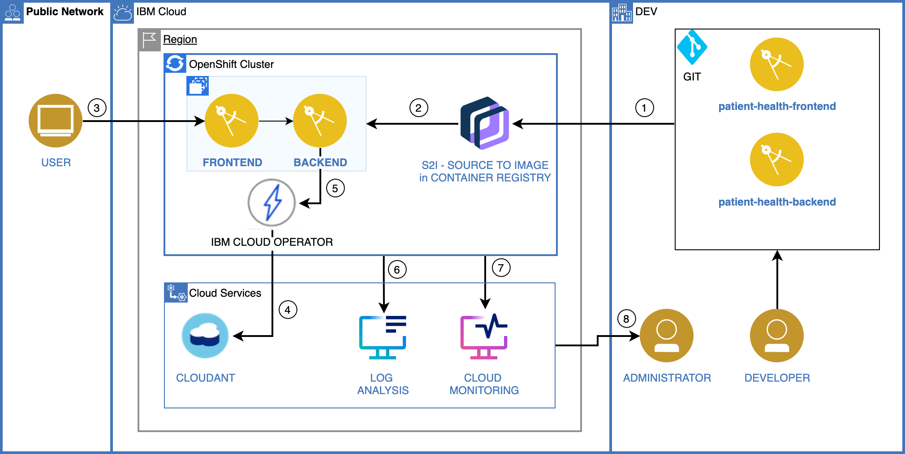{: class="center"}
{: style="text-align: center;"}


1. A developer initializes an {{site.data.keyword.openshiftshort}} application with a repository URL resulting in a **Builder**, **DeploymentConfig**, and **Service**.
1. The **Builder** clones the source, creates an image, pushes it to {{site.data.keyword.openshiftshort}} registry for **DeploymentConfig** provisioning.
1. Users access the frontend application.
1. The {{site.data.keyword.cloudant_short_notm}} database instance is provisioned through an IBM Cloud Operator Service.
1. The backend application is connected to the database with an IBM Cloud Operator Binding.
1. {{site.data.keyword.la_short}} is provisioned and agent deployed.
1. {{site.data.keyword.mon_short}} is provisioned and agent deployed.
1. An Administrator monitors the app with {{site.data.keyword.la_short}} and {{site.data.keyword.mon_short}}.

There are [scripts](https://github.com/IBM-Cloud/patient-health-frontend/tree/master/scripts) that will perform some of the steps below.  It is described in the [README.md](https://github.com/IBM-Cloud/patient-health-frontend). If you run into trouble and want to start over just execute the `destroy.sh` script and sequentially go through the scripts that correspond to the steps to recover.

<!--##istutorial#-->
## Before you begin
{: #openshift-microservices-prereqs}

This tutorial requires:
* {{site.data.keyword.cloud_notm}} CLI,
   * {{site.data.keyword.containerfull_notm}} plugin (`kubernetes-service`),
* `oc` to interact with OpenShift.

You will find instructions to download and install these tools for your operating environment in the [Getting started with tutorials](https://{DomainName}/docs/solution-tutorials?topic=solution-tutorials-tutorials) guide.

To avoid the installation of these tools, you can use the [{{site.data.keyword.cloud-shell_short}}](https://{DomainName}/shell) from the {{site.data.keyword.cloud_notm}} console.
{: note}

<!--#/istutorial#-->

<!--##istutorial#-->
<!--This section is identical in all openshift tutorials, copy/paste any changes-->
## Create an {{site.data.keyword.openshiftshort}} cluster
{: #openshift-microservices-create_openshift_cluster}
{: step}

With {{site.data.keyword.openshiftlong_notm}}, you have a fast and secure way to containerize and deploy enterprise workloads in {{site.data.keyword.openshiftshort}} clusters. {{site.data.keyword.openshiftshort}} clusters build on Kubernetes container orchestration that offers consistency and flexibility for your development lifecycle operations.

In this section, you will provision a {{site.data.keyword.openshiftlong_notm}} cluster in one (1) zone with two (2) worker nodes:

1. Create an {{site.data.keyword.openshiftshort}} cluster from the [{{site.data.keyword.Bluemix}} catalog](https://{DomainName}/kubernetes/catalog/create?platformType=openshift).
2. Set the **Orchestration service** to **4.8.x version of {{site.data.keyword.openshiftshort}}**.
3. Select your OCP entitlement.
4. Under **Infrastructure** choose Classic or VPC
   - For {{site.data.keyword.openshiftshort}} on VPC infrastructure, you are required to have a VPC and one subnet prior to creating the {{site.data.keyword.openshiftshort}} cluster.  Create or inspect a desired VPC keeping in mind the following (see instructions provided under the [Creating a standard VPC cluster](https://{DomainName}/docs/openshift?topic=openshift-clusters#clusters_vpcg2)):
      - One subnet that can be used for this tutorial, take note of the subnet's zone and name
      - Public gateway is attached to the subnet
   - Select an existing **Cloud Object Storage** service or create one if required
5. Under **Location**
   - For {{site.data.keyword.openshiftshort}} on VPC infrastructure
      - Select a **Resource group**
      - Uncheck the inapplicable zones
      - In the desired zone verify the desired subnet name and if not present click the edit pencil to select the desired subnet name
   - For {{site.data.keyword.openshiftshort}} on Classic infrastructure follow the [Creating a standard classic cluster](https://{DomainName}/docs/openshift?topic=openshift-clusters#clusters_standard) instructions.
      - Select a **Resource group**
      - Select a **Geography**
      - Select **Single zone** as **Availability**
      - Choose a **Datacenter**
6. Under **Worker pool**,
   - Select **4 vCPUs 16GB Memory** as the flavor
   - Select **2** Worker nodes per data center for this tutorial (classic only: Leave **Encrypt local disk**)
7. Under **Resource details**,Set **Cluster name** to **&lt;your-initials&gt;-myopenshiftcluster** by replacing `<your-initials>` with your own initials.
8. Click **Create** to provision an {{site.data.keyword.openshiftshort}} cluster.
Take a note of the resource group selected above.  This same resource group will be used for all resources in this lab.
{: note}


<!--#/istutorial#-->

<!--##isworkshop#-->
<!--
## Configure the access to your cluster
{: #openshift-microservices-access-cluster}
{: step}

1. Log in to the {{site.data.keyword.cloud_notm}} console.
1. Select the account where you have been invited by clicking on the account name in the top bar (next to `Manage`).
1. Find the cluster assigned to you in the [cluster list](https://{DomainName}/kubernetes/clusters?platformType=openshift).
-->
<!--#/isworkshop#-->

### Initialize a Cloud Shell
{: #openshift-microservices-3}

The [{{site.data.keyword.openshiftshort}} Container Platform CLI](https://docs.openshift.com/container-platform/4.8/cli_reference/openshift_cli/getting-started-cli.html) exposes commands for managing your applications, as well as lower level tools to interact with each component of your system. The CLI is available using the `oc` command.

To avoid installing the command line tools, the recommended approach is to use the {{site.data.keyword.cloud-shell_notm}}. 

{{site.data.keyword.Bluemix_notm}} Shell is a cloud-based shell workspace that you can access through your browser. It's preconfigured with the full {{site.data.keyword.Bluemix_notm}} CLI and many plug-ins and tools that you can use to manage apps, resources, and infrastructure.

In this step, you'll use the {{site.data.keyword.Bluemix_notm}} shell and configure `oc` to point to the cluster assigned to you.

1. When the cluster is ready, click the button (next to your account) in the upper right corner to launch a [Cloud shell](https://{DomainName}/shell). **_Make sure you don't close this window/tab_**.

   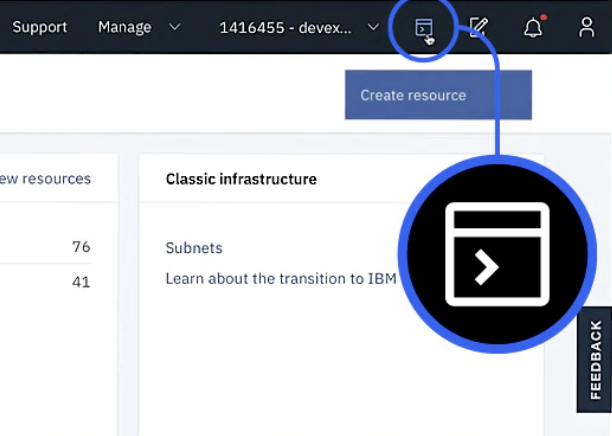
1. Check the version of the OpenShift CLI:
   ```sh
   oc version
   ```
   {: pre}
   
   > The version needs to be at minimum 4.8.x, otherwise install the latest version by following [these instructions](https://{DomainName}/docs/solution-tutorials?topic=solution-tutorials-tutorials#getting-started-common_shell).

1. Validate your cluster is shown when listing all clusters:
   ```sh
   ibmcloud oc clusters
   ```
   {: pre}   

1. Initialize the `oc` command environment by replacing the placeholder &lt;your-cluster-name&gt;:
   ```sh
   ibmcloud oc cluster config -c <your-cluster-name> --admin
   ```
   {: pre}

1. Verify the `oc` command is working:
   ```sh
   oc get projects
   ```
   {: pre}


## Deploying an application
{: #openshift-microservices-deploy}
{: step}

In this section, you'll deploy a Node.js Express application named `patient-health-frontend`, a user interface for a patient health records system to demonstrate {{site.data.keyword.openshiftshort}} features. You can find the sample application GitHub repository here: https://github.com/IBM-Cloud/patient-health-frontend

### Create Project
{: #openshift-microservices-5}

A project is a collection of resources managed by a DevOps team.  An administrator will create the project and the developers can create applications that can be built and deployed.

1. Navigate to the {{site.data.keyword.openshiftshort}} web console by clicking the **{{site.data.keyword.openshiftshort}} web console** button in the selected **Cluster**.
1. On the left navigation pane, under the **Administrator** perspective, select **Home** > **Projects** view to display all the projects.
1. Create a new project by clicking **Create Project**. In the pop up **Name** the project `example-health`, leave **Display Name** and **Description** blank, click **Create**.
1. The new project's **Project Details** page is displayed.  Observe that your context is **Administrator** > **Home** > **Projects** on the left and **Projects** > **Project details** > **example-health** on the top.

### Build and Deploy Application
{: #openshift-microservices-6}

1. Switch from the **Administrator** to the **Developer** perspective. Your context should be **Developer** > **+Add** on the left and **Project: example-health** on the top.
   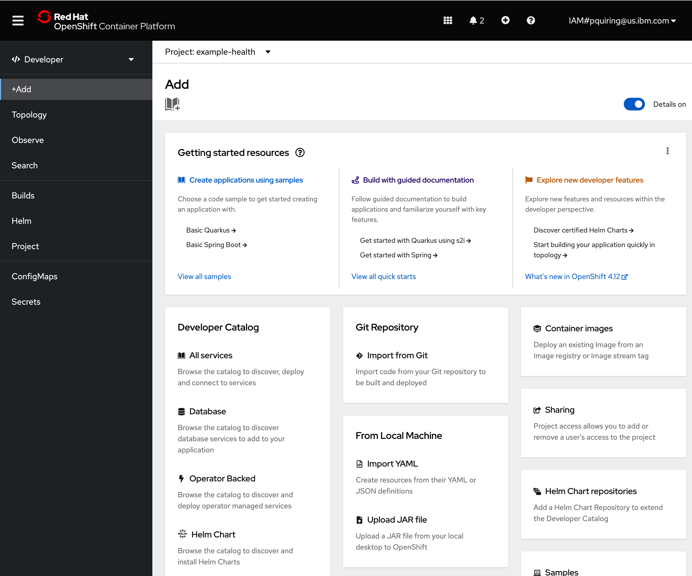
2. Let's build and deploy the application by selecting **From Git**.
3. Enter the repository `https://github.com/IBM-Cloud/patient-health-frontend.git` in the Git Repo URL field.
   * Note the `Validated` indication.
   * Note that the builder image automatically detected the language Node.js. If not detected, select `Node.js` from the provided list.
   * **Builder Image Version** leave at the default.
   * **Application Name** delete all of the characters and leave it empty (this will default to the **Name**)
   * **Name :** patient-health-frontend.
   * Select **Deployment Config**.
   * Leave defaults for other selections.
4. Click **Create** at the bottom of the window to build and deploy the application.

### View Application
{: #openshift-microservices-7}

1. You should see the app you just deployed.  Notice that you are in the **Topology** view of the example-health project in the **Developer** perspective.  All applications in the project are displayed.
1. Select the **node** **patient-health-frontend** to bring up the details view of the `DeploymentConfig`.  Note the **DC** next to **patient-health-frontend**.  The Pods, Builds, Services and Routes are visible.
   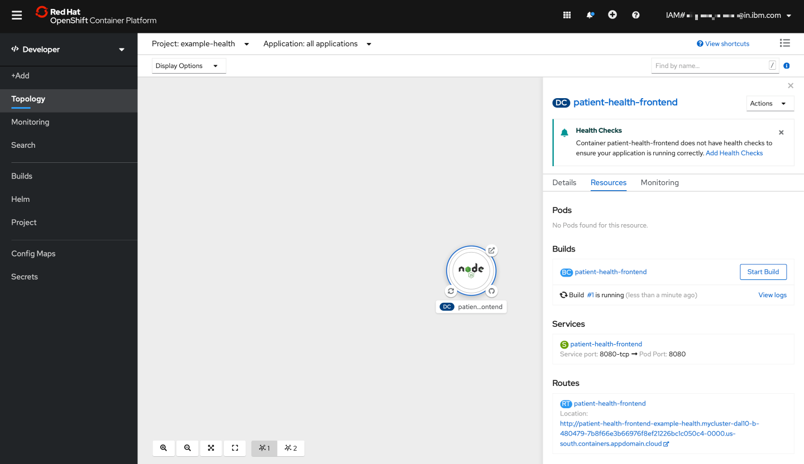

   * **Pods**: Your Node.js application containers
   * **Builds**: The auto-generated build that created a Docker image from your Node.js source code, deployed it to the {{site.data.keyword.openshiftshort}} container registry, and kicked off your deployment config
   * **Services**: Tells {{site.data.keyword.openshiftshort}} how to access your Pods by grouping them together as a service and defining the port to listen to
   * **Routes**: Exposes your services to the outside world using the LoadBalancer provided by the IBM Cloud network
1. Click on **View Logs** next to your completed Build. This shows you the process that {{site.data.keyword.openshiftshort}} took to install the dependencies for your Node.js application and build/push a Docker image.  The last entry should looks like this:
   ```sh
   Successfully pushed image-registry.openshift-image-registry.svc:5000/example-health/patient-health-frontend@sha256:f9385e010144f36353a74d16b6af10a028c12d005ab4fc0b1437137f6bd9e20a
   Push successful
   ```
   {: screen}

1. Click back to the **Topology** and select your app again.
1. Click on the URL under **Routes** to visit your application. Enter any string for username and password, for instance `test:test` because the app is running in demonstration mode.

The `Node.js` app has been deployed to {{site.data.keyword.openshiftshort}} Container Platform. To recap:
* The "Example Health" Node.js application was deployed directly from GitHub into your cluster.
* The application was examined in the {{site.data.keyword.openshiftshort}} console.
* A **Build Configuration** was created - a new commit can be both built and deployed by clicking **Start Build** in the Builds section of the application details.

## Logging and monitoring
{: #openshift-microservices-logging-monitoring}
{: step}

In this section, you will explore the out-of-the-box logging and monitoring capabilities that are offered in {{site.data.keyword.openshiftshort}}.

### Simulate Load on the Application
{: #openshift-microservices-9}

Create a script to simulate load.

1. Make sure you're connected to the project where you deployed your app.
   ```sh
   oc project example-health
   ```
   {: pre}

1. Retrieve the public route to access your application:
   ```sh
   oc get routes
   ```
   {: pre}

   Output looks similar to this, note your value for Host:
   ```sh
   NAME         HOST/PORT                                                                                                 PATH      SERVICES     PORT       TERMINATION   WILDCARD
   patient-health-frontend   patient-health-frontend-example-health.roks07-872b77d77f69503584da5a379a38af9c-0000.eu-de.containers.appdomain.cloud             patient-health-frontend   8080-tcp                 None
   ```
   {: screen}

1. Define a variable with the host:
   ```sh
   HOST=$(oc get routes -o json | jq -r '.items[0].spec.host')
   ```
   {: pre}

1. Verify access to the application. It outputs patient information:
   ```sh
   curl -s http://$HOST/info
   ```
   {: pre}

   Output should look like:
   ```sh
   $ curl http://$HOST/info
   {"personal":{"name":"Ralph DAlmeida","age":38,"gender":"male","street":"34 Main Street","city":"Toronto","zipcode":"M5H 1T1"},"medications":["Metoprolol","ACE inhibitors","Vitamin D"],"appointments":["2018-01-15 1:00 - Dentist","2018-02-14 4:00 - Internal Medicine","2018-09-30 8:00 - Pediatry"]}
   ```
   {: screen}

1. Run the following script which will endlessly send requests to the application and generates traffic:
   ```bash
   while sleep 0.2; do curl --max-time 2 -s http://$HOST/info >/dev/null; done
   ```
   {: pre}

   To stop the script, hit `CTRL + c` on your keyboard
   {: tip}

### {{site.data.keyword.openshiftshort}} Logging
{: #openshift-microservices-10}

Since there is only one pod, viewing the application logs will be straight forward.

1. Ensure that you're in the **Topology** view of the **Developer** perspective.
2. Navigate to your Pod by selecting your app.
3. Click on **View Logs** next to the name of the Pod under **Pods** to see streaming logs from your running application. If you're still generating traffic, you should see log messages for every request being made.

   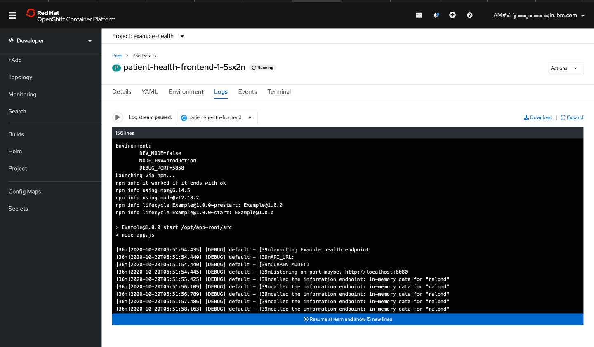

### {{site.data.keyword.openshiftshort}} Terminal
{: #openshift-microservices-11}

One of the great things about Kubernetes is the ability to quickly debug your application pods with SSH terminals. This is great for development, but generally is not recommended in production environments. {{site.data.keyword.openshiftshort}} makes it even easier by allowing you to launch a terminal directly in the dashboard.

1. Switch from the **Logs** tab to the **Terminal** tab.
1. Run the following Shell commands:

| Command | Description |
| :--- | :--- |
| `ls` | List the project files. |
| `ps aux` | List the running processes. |
| `cat /etc/redhat-release` | Show the underlying OS. |
| `curl localhost:8080/info` | output from the node app.js process |

### {{site.data.keyword.openshiftshort}} Monitoring
{: #openshift-microservices-12}

When deploying new apps, making configuration changes, or simply inspecting the state of your cluster, the project-scope dashboard gives a Developer clear insights.

1. Access the dashboard in the **Developer** perspective by clicking **Project** on the left side menu.
2. You can also dive in a bit deeper by clicking the **View events** under the **Activity** tile. **Events** are useful for identifying the timeline of events and finding potential error messages. When tracking the state of a new rollout, managing existing assets, or even something simple like exposing a route, the Events view is critical in identifying the timeline of activity. This becomes even more useful when considering that multiple operators may be working against a single cluster.

Almost all actions in {{site.data.keyword.openshiftshort}} result in an event being fired in this view. As it is updated real-time, it's a great way to track changes to state.

## Metrics and dashboards
{: #openshift-microservices-metrics}
{: step}

In this section explore the third-party monitoring and metrics dashboards included in {{site.data.keyword.openshiftshort}}.

### Grafana
{: #openshift-microservices-14}

Red Hat {{site.data.keyword.openshiftshort}} on IBM Cloud comes with [Grafana](https://grafana.com/) preinstalled.

1. Get started by switching from the **Developer** perspective to the **Administrator** perspective:
2. Navigate to **Monitoring > Dashboards** in the left-hand bar. You can either view the dashboard inline or access the Grafana web UI following the instructions in this [OpenShift tutorial](/docs/solution-tutorials?topic=solution-tutorials-scalable-webapp-openshift#scalable-webapp-openshift-monitor_application)
   - If inline, select **Kubernetes / Compute Resources / Namespace (Pods)** from the dropdown and Namespace to **example-health**
   - If you have clicked **Grafana UI** link, You'll be asked to login with {{site.data.keyword.openshiftshort}} and then click through some permissions.You should then see your Grafana dashboard. Hit **Home** on the top left, click on **Default** and choose **Kubernetes / Compute Resources / Namespace (Pods)**. For the **Namespace** field, choose `example-health` which is the name of the project your app resides in.
3. Notice the CPU and Memory usage for your application. In production environments, this is helpful for identifying the average amount of CPU or Memory your application uses, especially as it can fluctuate through the day.  Auto-scaling is one way to handle fluctuations and will be demonstrated a little later.
   
   

### Prometheus
{: #openshift-microservices-15}

Navigating back to the {{site.data.keyword.openshiftshort}} console, you can also launch:

* [**Prometheus**](https://prometheus.io/) - a monitoring system with an efficient time series database
* [**Alertmanager**](https://prometheus.io/docs/alerting/alertmanager/) - an extension of Prometheus focused on managing alerts

{{site.data.keyword.openshiftshort}} provides a web interface to Prometheus, which enables you to run Prometheus Query Language \(PromQL\) queries and examine the metrics visualized on a plot. This functionality provides an extensive overview of the cluster state and enables you to troubleshoot problems. Take a look around, and try the **Insert Example Query**.

1. The Metrics page is accessible in the **Administrator** perspective by clicking **Monitoring → Metrics**.
2. You can either view the metrics inline or access the Prometheus UI by clicking on the **Platform Prometheus UI** link next to `Metrics` in the top.
3. If you are using the inline metrics view, in the `Expression` box, enter the below query and click **Run queries**. You should see the value and the graph associated with the query.

   ```sh
   sum(container_cpu_usage_seconds_total{container="patient-health-frontend"})
   ```
   {: codeblock}

4. Navigate through the **Prometheus UI** by clicking the link. You'll be asked to login with {{site.data.keyword.openshiftshort}} and then click through some permissions.
5. In the top box a query expression can be entered. Paste the above query to look into your frontend.
6. Click on the **Graph** tab.  Run the traffic generator script on for a while and then stop it.  Note that the times are GMT:
   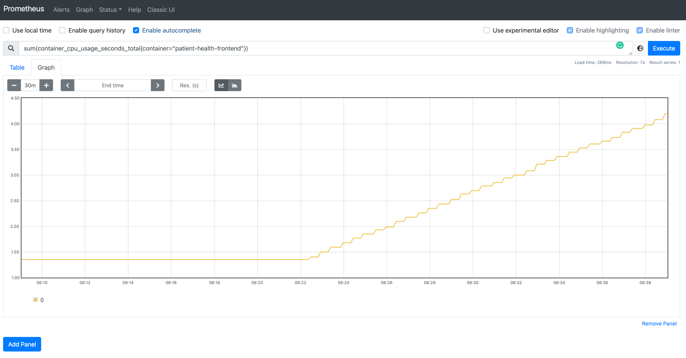

7. There is a lot more to investigate with Prometheus, but instead the fully managed {{site.data.keyword.mon_short}} service will be covered later.

## Scaling the application
{: #openshift-microservices-scaling}
{: step}

In this section, the metrics observed in the previous section can be used to scale the UI application in response to load.

### Enable Resource Limits
{: #openshift-microservices-17}

Before autoscaling maximum CPU and memory resource limits must be established.

Grafana earlier showed you that the load was consuming anywhere between ".002" to ".02" cores. This translates to 2-20 "millicores". To be safe, let's bump the higher-end up to 30 millicores. In addition, Grafana showed that the app consumes about `25`-`35` MB of RAM. The following steps will set the resource limits in the deploymentConfig

1. Make sure the script to generate traffic is running. 
1. Switch to the **Administrator** perspective and then navigate to **Workloads > DeploymentConfigs** in the left-hand bar. Choose the `patient-health-frontend` Deployment Configs, then choose **Actions menu (three vertical dots) > Edit DeploymentConfig**.
   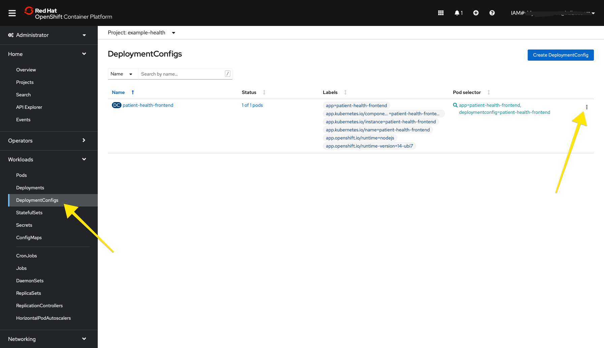
1. Under the **YAML view**, find the section **spec > template > spec > containers**, add the following resource limits into the empty resources. Replace the `resources {}`, and ensure the spacing is correct -- YAML uses strict indentation.

   ```yaml
             resources:
               limits:
                 cpu: 30m
                 memory: 100Mi
               requests:
                 cpu: 3m
                 memory: 40Mi
   ```
   {: codeblock}

   Here is a snippet after you have made the changes:
   ```yaml
          ports:
            - containerPort: 8080
              protocol: TCP
          resources:
            limits:
              cpu: 30m
              memory: 100Mi
            requests:
              cpu: 3m
              memory: 40Mi
          terminationMessagePath: /dev/termination-log
   ```
1. **Save** and **Reload** to see the new version.
1. Verify that the replication controller has been changed by navigating to **Events** tab:
   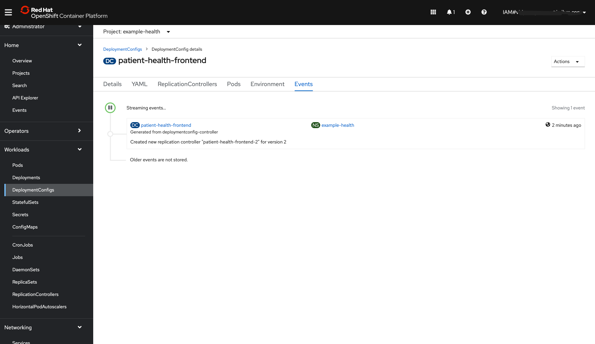

### Enable Autoscaler
{: #openshift-microservices-18}

Now that resource limits are configured, the pod autoscaler can be enabled.

By default, the autoscaler allows you to scale based on CPU or Memory. Pods are balanced between the minimum and maximum number of pods that you specify. With the autoscaler, pods are automatically created or deleted to ensure that the average CPU usage of the pods is below the CPU request target as defined. In general, you probably want to start scaling up when you get near `50`-`90`% of the CPU usage of a pod. In our case, `1`% can be used with the load being provided.

1. Navigate to **Administrator** perspective **Workloads > HorizontalPodAutoscalers**, then click **Create HorizontalPodAutoscaler**.

   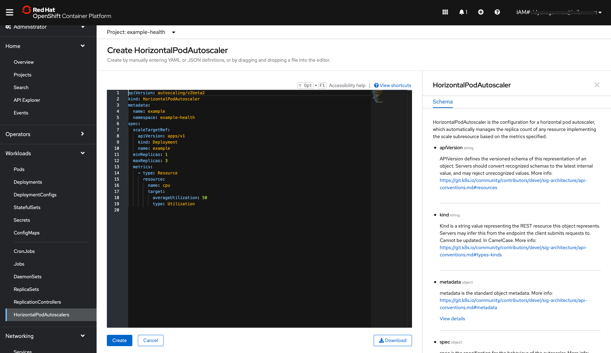

   Replace the contents of the editor with this yaml:

   ```yaml
   apiVersion: autoscaling/v2beta2
   kind: HorizontalPodAutoscaler
   metadata:
     name: patient-hpa
     namespace: example-health
   spec:
     scaleTargetRef:
       apiVersion: apps.openshift.io/v1
       kind: DeploymentConfig
       name: patient-health-frontend
     minReplicas: 1
     maxReplicas: 10
     metrics:
       - type: Resource
         resource:
           name: cpu
           target:
             averageUtilization: 1
             type: Utilization
   ```
   {: codeblock}

2. Click **Create**.

### Test Autoscaler
{: #openshift-microservices-19}

If you're not running the script to simulate load, the number of pods should stay at 1.

1. Check by opening the **Overview** page of the deployment config.  Click **Workloads** > **DeploymentConfigs** and click **patient-health-frontend** and make sure the **Details** panel is selected.
2. Start simulating load (see previous section to simulate load on the application).
   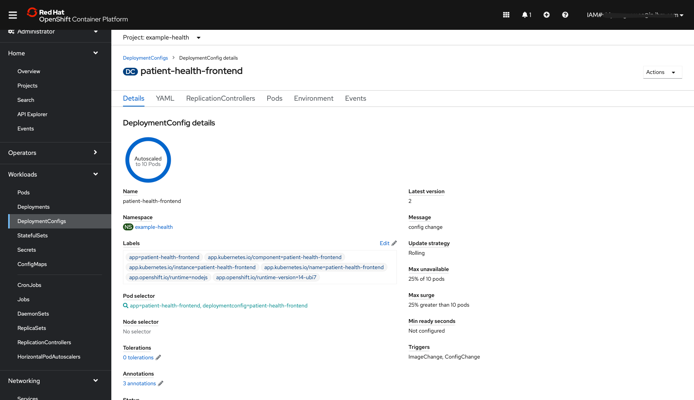
   
   It can take a few minutes for the autoscaler to make adjustments.
   {: note}

That's it! You now have a highly available and automatically scaled front-end Node.js application. {{site.data.keyword.openshiftshort}} is automatically scaling your application pods since the CPU usage of the pods greatly exceeded `1`% of the resource limit, `30` millicores.

### Autoscaling from the command line
{: #openshift-microservices-20}

You can also can delete and create resources like autoscalars with the command line.

1. Start by verifying the context is your project:
   ```sh
   oc project example-health
   ```
   {: pre}

1. Get the autoscaler that was created earlier:
   ```sh
   oc get hpa
   ```
   {: pre}

1. Delete the autoscaler made earlier:
   ```sh
   oc delete hpa/patient-hpa
   ```
   {: pre}

1. Create a new autoscaler with a max of 9 pods:
   ```sh
   oc autoscale deploymentconfig/patient-health-frontend --name patient-hpa --min 1 --max 9 --cpu-percent=1
   ```
   {: pre}

1. Revisit the **Workloads > DeploymentConfigs** Details page for `patient-health-frontend` deployment and watch it work.

## Using the IBM Cloud Operator to create a Cloudant DB
{: #openshift-microservices-operator}
{: step}

Currently, the Example Health `patient-health-frontend` app is using a dummy in-memory patient. In this exercise, you'll create a Cloudant service in IBM Cloud and populate it with patient data. Cloudant is a NoSQL database-as-a-service, based on CouchDB.

### Enable the IBM Cloud Operator
{: #openshift-microservices-22}

Let's understand exactly how Operators work. In the first exercise, you used a builder to deploy a simple application using a DeploymentConfig and Pods -- these are "default resources" that come with {{site.data.keyword.openshiftshort}}. A custom resource definition allows you to create resources that do not come preinstalled with {{site.data.keyword.openshiftshort}} such an IBM Cloud service. Operators manage the lifecycle of resources and create Custom Resource Descriptors, CRDs, allowing you to manage custom resources the native "Kubernetes" way.

1. In the **Administrator** perspective, and click **Operators > OperatorHub**.
2. Find the **IBM Cloud Operator**, and click **Install**.
3. Keep the default options and click **Install**.
4. You may need to wait a few seconds and refresh for the operator to show the status as `Succeeded`.

### Create a Cloudant Service and Bind using the CRDs
{: #openshift-microservices-23}

Click on the **IBM Cloud Operator** to open it.  Scroll down to the **Prerequisites** section.

An API key with the appropriate permissions to create a {{site.data.keyword.cloudant_short_notm}} database is required in this section. The API key is going to be stored in a Kubernetes Secret resource. This will need to be created using the shell. There are instructions in the **Prerequisites** section of the installed operator.  Steps:

1. Skip the `login` command and the `ibmcloud target --cf`.  The `--cf` is for Cloud Foundry and is not required for {{site.data.keyword.cloudant_short_notm}}. Use the same resource group and region that is associated with your cluster.
   ```sh
   ibmcloud target -g <resource_group> -r <region>
   ```
   {: pre}

   To see the the resource groups in your account, run `ibmcloud resource groups` command
   {: tip}

2. Verify that it looks something like this.  CF API endpoint, Org and Space can be empty, Resource group matches your cluster:
   ```sh
   API endpoint:      https://{DomainName}
   Region:            us-south
   User:              YOU@us.ibm.com
   Account:           YOURs Account (32cdeadbeefdeadbeef1234132412343) <-> 1234567
   Resource group:    YOUR resource group
   CF API endpoint:
   Org:
   Space:
   ```
3. Use the helper script provided by IBM to create the following resources:
   - {{site.data.keyword.Bluemix_notm}} API key that represents you and your permissions to use {{site.data.keyword.Bluemix_notm}}
   - Kubernetes Secret named `secret-ibm-cloud-operator` in the `default` namespace.  This secret has the keys `api-key` and `region`.  The operator will use this data to create the cloudant service instance.
   - Kubernetes ConfigMap resource with the name `config-ibm-cloud-operator` in the `default` namespace to hold the region and resource group

   Use the supplied curl command:

   ```sh
   curl -sL https://raw.githubusercontent.com/IBM/cloud-operators/master/hack/configure-operator.sh | bash
   ```
   {: pre}

4. Back in the {{site.data.keyword.openshiftshort}} web console, click the **Create Service** under the **Service** tab on the **Installed Operators** of the **IBM Cloud Operator** page and select **YAML view** to bring up the yaml editor.
5. Make the suggested substitutions where the serviceClass is **cloudantnosqldb** and the plan can be **lite** or **standard** (only one lite plan is allowed per account). Replace `<your-initials>`:
   ```yaml
   apiVersion: ibmcloud.ibm.com/v1
   kind: Service
   metadata:
     annotations:
      ibmcloud.ibm.com/self-healing: enabled
     name: <your-initials>-cloudant-service
     namespace: example-health
   spec:
     serviceClass: cloudantnosqldb
     plan: standard
   ```
   {: codeblock}

6. Click **Create** to create a {{site.data.keyword.cloudant_short_notm}} database instance.
   Your context should be **Operators** > **Installed Operators**  > **IBM Cloud Operator** in the **Administrator** perspective with Project: example-health in the **Service** panel.
7. Click on the service just created, **&lt;your-initials&gt;-cloudant-service** and over time the **state** field will change from **provisioning** to **Online** meaning it is good to go.
8. Create a Binding resource and a Secret resource for the cloudant Service resource just created.  Navigate back to  **Operators** > **Installed Operators**  > **IBM Cloud Operator** > **Binding** tab.  Open the **Binding** tab, click **Create Binding** and select **YAML View**.  Create a cloudant-binding associated with the serviceName `<your-initials>-cloudant-service`, (this is the the name provided for the **Service** created earlier).
   ```yaml
   apiVersion: ibmcloud.ibm.com/v1
   kind: Binding
   metadata:
     name: cloudant-binding
     namespace: example-health
   spec:
     serviceName: <your-initials>-cloudant-service
   ```
   {: codeblock}

9. Optionally dig a little deeper to understand the relationship between the {{site.data.keyword.openshiftshort}} resources: **Service**, service **Binding**, binding **Secret** and the {{site.data.keyword.cloud_notm}} resources: **Service**, service **Instance** and the instance's **Service credentials**. Using the cloud shell:

   ```sh
   ibmcloud resource service-instances --service-name cloudantnosqldb
   ```
   {: pre}

   ```sh
   YOURINITIALS=<your-initials>
   ```
   {: pre}

   ```sh
   ibmcloud resource service-instance $YOURINITIALS-cloudant-service
   ```
   {: pre}

   ```sh
   ibmcloud resource service-keys --instance-name $YOURINITIALS-cloudant-service --output json
   ```
   {: pre}

   Output looks something like this:
   ```sh
   youyou@cloudshell:~$ ibmcloud resource service-instances --service-name cloudantnosqldb
   Retrieving instances with type service_instance in all resource groups in all locations under ..
   OK
   Name                           Location   State    Type
   <your-initials>-cloudant-service               us-south   active   service_instance
   youyou@cloudshell:~$ ibmcloud resource service-instance <your-initials>-cloudant-service
   Retrieving service instance <your-initials>-cloudant-service in all resource groups under ...
   OK

   Name:                  <your-initials>-cloudant-service
   ID:                    crn:v1:bluemix:public:cloudantnosqldb:us-south:a/0123456789507a53135fe6793c37cc74:SECRET
   GUID:                  SECRET
   Location:              us-south
   Service Name:          cloudantnosqldb
   Service Plan Name:     standard
   Resource Group Name:   Default
   State:                 active
   Type:                  service_instance
   Sub Type:
   Created at:            2020-05-06T22:39:25Z
   Created by:            youyou@us.ibm.com
   Updated at:            2020-05-06T22:40:03Z
   Last Operation:
                       Status       create succeeded
                       Message      Provisioning is complete
                       Updated At   2020-05-06 22:40:03.04469305 +0000 UTC

   youyou@cloudshell:~$ ibmcloud resource service-keys --instance-name $YOURINITIALS-cloudant-service --output json
   [
       {
           "guid": "01234560-902d-4078-9a7f-20446a639aeb",
           "id": "crn:v1:bluemix:public:cloudantnosqldb:us-south:a/0123456789507a53135fe6793c37cc74:SECRET",
           "url": "/v2/resource_keys/01234560-902d-4078-9a7f-20446a639aeb",
           "created_at": "2020-05-06T23:03:43.484872077Z",
           "updated_at": "2020-05-06T23:03:43.484872077Z",
           "deleted_at": null,
           "name": "cloudant-binding",
           "account_id": "0123456789507a53135fe6793c37cc74",
           "resource_group_id": "01234567836d49029966ab5be7fe50b5",
           "source_crn": "crn:v1:bluemix:public:cloudantnosqldb:us-south:a/0123456789507a53135fe6793c37cc74:SECRET",
           "state": "active",
           "credentials": {
               "apikey": "SECRET",
               "host": "SECRET",
               "iam_apikey_description": "Auto-generated for key SECRET",
               "iam_apikey_name": "cloudant-binding",
               "iam_role_crn": "SECRET",
               "iam_serviceid_crn": "SECRET",
               "password": "SECRET",
               "port": 443,
               "url": "https://01234SECRET",
               "username": "01234567-SECRET"
           },
           "iam_compatible": true,
           "resource_instance_url": "/v2/resource_instances/SECRET",
           "crn": "crn:v1:bluemix:public:cloudantnosqldb:us-south:a/0123456789507a53135fe6793c37cc74:SECRET"
       }
   ]
   ```
   {: screen}

### Deploy the Node.js Patient Backend Database App
{: #openshift-microservices-24}

Now you'll create the Node.js app that will populate your Cloudant DB with patient data. It will also serve data to the front-end application deployed earlier.

1. Make sure you're your context is the project **example-health**:
   ```sh
   oc project example-health
   ```
   {: pre}

1. The following new-app commmand will make a build configuration and Deployment Configuration.  The following demonstrates the CLI invocation of the add application (remember using the GUI console for the frontend):
   ```sh
   oc new-app --name=patient-health-backend --as-deployment-config centos/nodejs-10-centos7~https://github.com/IBM-Cloud/patient-health-backend
   ```
   {: pre}

1. Back in the console, and in the **Topology** view of the **Developer** perspective, open the **patient-health-backend** app and wait for the build to complete. Notice that the **Pod** is failing to start.  Click on the **Pod** logs to see:
   ```sh
   > node app.js

   /opt/app-root/src/app.js:23
            throw("Cannot find Cloudant credentials, set CLOUDANT_URL.")
            ^
   Cannot find Cloudant credentials, set CLOUDANT_URL.
   ```
1. Let's fix this by setting the environment variable of the **DeploymentConfig** to the **cloudant-binding** secret created earlier in the operator binding section. Navigate to the deployment config for the `patient-health-backend` app by clicking the app, and then selecting the name next to **DC**:
   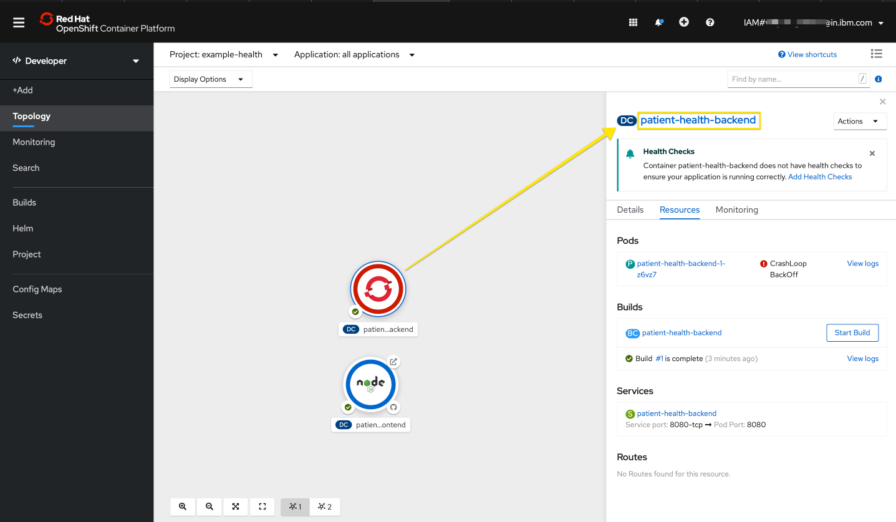
1. Go to the **Environment** tab, click **Add from ConfigMap or Secret** and create a new environment variable named **CLOUDANT_URL**. Choose the **cloudant-binding** secret, then choose **url** for the Key. Click **Save**.
   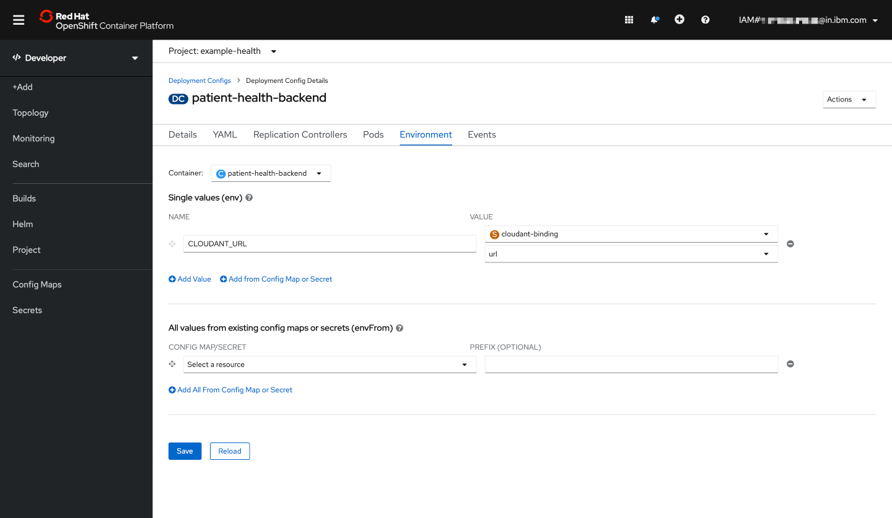
1. Go back to the **Topology** tab, and click the **patient-health-backend**.  Check out the **Pods** section, which should indicate **Running** shortly.  Click on **View logs** next to the running pod and notice the databases created.

### Configure Patient Health Frontend App to use Patient Health Backend App
{: #openshift-microservices-25}

The `patient-health-frontend` application has an environment variable for the backend microservice url.

1. Set the **API_URL** environment variable to **default** in the frontend **DeploymentConfig**. Navigate to the deployment config for the `patient-health-frontend` app by clicking the frontend app in the **Topology** view, and then selecting the name next to **DC**:

2. Go to the **Environment** tab, and in the **Single values (env)** section add a name `API_URL` and value `default`.  Click **Save** then **Reload**.  This will result in a connection to `http://patient-health-backend:8080/` which you can verify by looking at the pod logs.  You can verify this is the correct port by scanning for the `Pod Template / Containers / Port` output of this command:

   ```sh
   oc describe dc/patient-health-backend
   ```
   {: pre}

Your application is now backed by the mock patient data in the Cloudant DB! You can now log-in using any user-id/password in the Cloudant DB, use "**opall:opall**".

1. In a real-world application, these passwords should **not** be stored as plain-text. To review the patients (and alternate logins) in the Cloudant DB, navigate to your `services` in IBM Cloud [Resource List](https://{DomainName}/resources). Click **&lt;your-initials&gt;-cloudant-service**.
2. Launch the Cloudant dashboard by clicking on **Launch Dashboard** button and then click the `patients` db.
3. Click through the different patients you can log-in as.

## Connect both {{site.data.keyword.la_short}} and {{site.data.keyword.mon_short}} to the {{site.data.keyword.openshiftshort}}  cluster
{: #openshift-microservices-connect-logging-metrics}
{: step}

It can take a few minutes for logging and metric data to flow through the analysis systems so it is best to connect both at this time for later use.

<!--##isworkshop#-->
<!--
 If you've been invited to a lab account where an instance of {{site.data.keyword.mon_short}} or {{site.data.keyword.la_short}} has already been connected, skip the connect steps. Find your {{site.data.keyword.mon_short}} instance by looking at the cluster name in the tags attached to the instance. 

-->
<!--#/isworkshop#-->


1. Navigate to [{{site.data.keyword.openshiftshort}} clusters](https://{DomainName}/kubernetes/clusters?platformType=openshift)
2. Click on your cluster and verify the **Overview** tab on the left is selected
3. Click the Logging **Connect** button.  Use an existing {{site.data.keyword.la_short}} instance or create a new instance as shown below:
   1. Click **Create an instance**.
   2. Select same location as to where your cluster is created.
   3. Select **7 day Log Search** as your plan.
   4. Enter a unique **Service name** such as `<your-initials>-logging`.
   5. Use the resource group associated with your cluster and click **Create**.
4. Back on the cluster **Overview** tab, click the Monitoring **Connect** button. Use an existing {{site.data.keyword.mon_short}} instance or create a new instance as shown below:
   1. Click **Create an instance**.
   2. Select the same location as to where your cluster is created.
   3. Select **Graduated Tier** as your plan.
   4. Enter a unique **Service name** such as `<your-initials>-monitoring`.
   5. Use the resource group associated with your cluster.
   6. Leave IBM platform metrics to Disable and click **Create**.

## Analyze your logs with {{site.data.keyword.la_short}}
{: #openshift-microservices-use-logdna}
{: step}

{{site.data.keyword.la_full_notm}} is a cloud native service that you can include as part of your IBM Cloud architecture to add log management capabilities. You can use {{site.data.keyword.la_short}} to manage system and application logs in IBM Cloud. [Learn more](https://{DomainName}/docs/log-analysis?topic=log-analysis-getting-started).

This section of the tutorial goes deep into the IBM logging service.  You can stop this section at any time and successfully begin the next section.
{: note}

### Verify that the {{site.data.keyword.la_short}} agent is deployed successfully
{: #openshift-microservices-28}

Verify that the `{{site.data.keyword.la_short}}-agent` pods on each node are in a **Running** status.
```sh
oc get pods -n ibm-observe
```
{: pre}

The deployment is successful when you see one or more {{site.data.keyword.la_short}} pods:
```sh
someone@cloudshell:~$ oc get pods -n ibm-observe
NAME                 READY     STATUS    RESTARTS   AGE
logdna-agent-mdgdz   1/1       Running   0          86s
logdna-agent-qlqwc   1/1       Running   0          86s
```
{: screen}

**The number of {{site.data.keyword.la_short}} pods equals the number of worker nodes in your cluster.**

* All pods must be in a `Running` state
* *stdout* and *stderr* are automatically collected and forwarded from all containers. Log data includes application logs and worker logs.
* By default, the {{site.data.keyword.la_short}} agent pod that runs on a worker collects logs from all namespaces on that node.

After the agent is configured logs from this cluster will be visible in the {{site.data.keyword.la_short}} web UI covered in the next section. If after a period of time you cannot see logs, check the agent logs.

To check the logs that are generated by a {{site.data.keyword.la_short}} agent, run the following command:
   ```sh
   oc logs logdna-agent-<ID> -n ibm-observe
   ```
   {: pre}

   Where *ID* is the ID for a {{site.data.keyword.la_short}} agent pod.

For example,
   ```sh
   oc logs logdna-agent-mdgdz -n ibm-observe
   ```

### Launch the {{site.data.keyword.la_short}} webUI
{: #openshift-microservices-29}

Launch the web UI within the context of a {{site.data.keyword.la_short}} instance, from the IBM Cloud UI.

1. Navigate to [{{site.data.keyword.openshiftshort}} clusters](https://{DomainName}/kubernetes/clusters?platformType=openshift)
2. Click on your cluster and verify the **Overview** tab on the left is selected
3. Next to **Logging**, click the **Launch** button.

The {{site.data.keyword.la_short}} UI should open in a new tab.

### Create a custom view
{: #openshift-microservices-30}

In {{site.data.keyword.la_short}}, you can configure custom views to monitor a subset of data. You can also attach an alert to a view to be notified of the presence or absence of log lines.

In the {{site.data.keyword.la_short}} web UI notice the log entries are displayed with a predefined format. You can modify in the **User Preferences** section how the information in each log line is displayed. You can also filter logs and modify search settings, then bookmark the result as a _view_. You can attach and detach one or more alerts to a view. You can define a custom format for how your lines are shown in the view. You can expand a log line and see the data parsed.

### Simulate Load on the Application
{: #openshift-microservices-46}

With the application now connected to a database for its data, to simulate load we will generate requests to the database using a patient id that we added to the database `ef5335dd-db17-491e-8150-20ce24712b06`.

1. Make sure you're connected to the project where you deployed your app.
   ```sh
   oc project example-health
   ```
   {: pre}

1. Define a variable with the host:
   ```sh
   HOST=$(oc get routes -o json | jq -r '.items[0].spec.host')
   ```
   {: pre}

1. Verify access to the application. It outputs patient information:
   ```sh
   curl -s http://$HOST/info?id=ef5335dd-db17-491e-8150-20ce24712b06
   ```
   {: pre}

   Output should look like:
   ```sh
   $ curl http://$HOST/info?id=ef5335dd-db17-491e-8150-20ce24712b06
   {"personal":{"name":"Opal Larkin","age":22,"street":"805 Bosco Vale","city":"Lincoln","zipcode":"68336"},"medications":["Cefaclor ","Amoxicillin ","Ibuprofen ","Trinessa ","Mirena ","Naproxen sodium "],"appointments":["2009-01-29 10:46 - GENERAL PRACTICE","1999-07-01 10:46 - GENERAL PRACTICE","2001-12-27 10:46 - GENERAL PRACTICE","2005-01-06 10:46 - GENERAL PRACTICE","2004-01-01 10:46 - GENERAL PRACTICE","1999-09-30 10:46 - GENERAL PRACTICE","2018-10-29 10:46 - GENERAL PRACTICE","2012-02-16 10:46 - GENERAL PRACTICE","2015-11-23 10:46 - GENERAL PRACTICE","2000-03-30 10:46 - GENERAL PRACTICE","1999-04-29 10:46 - GENERAL PRACTICE","2015-01-07 10:46 - GENERAL PRACTICE","1999-02-25 10:46 - GENERAL PRACTICE","2010-07-23 10:46 - GENERAL PRACTICE","2008-01-24 10:46 - GENERAL PRACTICE","2004-05-24 10:46 - GENERAL PRACTICE","1999-01-21 10:46 - GENERAL PRACTICE","2015-03-05 10:46 - GENERAL PRACTICE","2002-06-27 10:46 - GENERAL PRACTICE","2000-06-29 10:46 - GENERAL PRACTICE","2005-01-06 10:46 - GENERAL PRACTICE","2015-01-10 10:46 - GENERAL PRACTICE","2000-12-28 10:46 - GENERAL PRACTICE","2016-06-02 10:46 - GENERAL PRACTICE","2016-03-10 10:46 - GENERAL PRACTICE","2013-09-08 10:46 - GENERAL PRACTICE","2011-02-10 10:46 - GENERAL PRACTICE","2013-02-21 10:46 - GENERAL PRACTICE","2003-04-30 10:46 - GENERAL PRACTICE","2004-07-23 10:46 - GENERAL PRACTICE","2006-01-12 10:46 - GENERAL PRACTICE","2002-12-26 10:46 - GENERAL PRACTICE","1999-12-30 10:46 - GENERAL PRACTICE","2017-01-04 10:46 - GENERAL PRACTICE","2018-03-22 10:46 - GENERAL PRACTICE","2010-02-04 10:46 - GENERAL PRACTICE","2009-11-29 10:46 - GENERAL PRACTICE","2013-02-26 10:46 - GENERAL PRACTICE","2003-02-04 10:46 - GENERAL PRACTICE","2003-03-01 10:46 - GENERAL PRACTICE","2000-04-15 10:46 - GENERAL PRACTICE","2001-06-28 10:46 - GENERAL PRACTICE","2007-01-18 10:46 - GENERAL PRACTICE","2018-08-30 10:46 - GENERAL PRACTICE","2017-03-16 10:46 - GENERAL PRACTICE","2014-02-27 10:46 - GENERAL PRACTICE","2000-09-27 10:46 - GENERAL PRACTICE"]}
   ```
   {: screen}

1. Run the following script which will endlessly send requests to the application and generates traffic:
   ```bash
   while sleep 0.2; do curl --max-time 2 -s http://$HOST/info?id=ef5335dd-db17-491e-8150-20ce24712b06 >/dev/null; done
   ```
   {: pre}

   To stop the script, hit `CTRL + c` on your keyboard
   {: tip}

### View events with the default format
{: #openshift-microservices-31}

1. In the {{site.data.keyword.la_short}} web UI, click the **Views** icon .
2. Select **Everything** to see all the events.  It can take a few minutes for the load on the application to be visible.
   

### Customize your default view
{: #openshift-microservices-32}

In the **USER PREFERENCES** section, you can modify the order of the data fields that are displayed per line.

1. Select the **Configuration** icon .
2. Select **USER PREFERENCES**. A new window opens.
3. Select **Log Format**.
4. Modify the _Line Format_ section to match your requirements. Drag boxes around. Click **Done**.
   For example, add **%app** after the timestamp.
   

### Create a custom view to monitor logs
{: #openshift-microservices-33}

You can select the events that are displayed through a view by applying a search query in the search bar, selecting values in the search area, or a combination of both. You can save that view for reuse later. 

1. In the {{site.data.keyword.la_short}} web UI, filter out the logs for the sample app that you have deployed in the cluster in previous steps. Click in the search bar at the bottom and enter the following query: `app:patient-health-frontend`.
2. Filter out log lines to display only lines that are tagged as debug lines.
   Add in the search bar the following query: `level:debug` and hit enter. The view will show lines that meet the filter and search criteria.

   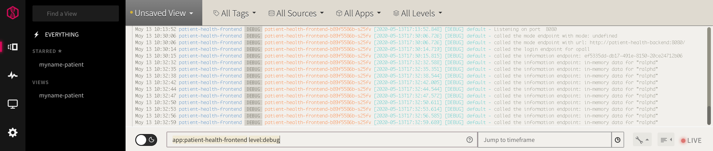
3. Click **Unsaved view**. Select **Save as new view**.
   
   1. Enter the name of the view. Use the following format: `<Enter your user name> patientUI`. For example, `yourname patientui`.
   1. Enter a category. Use the following format: `<Enter your user name>`. For example, `yourname` Then click **Add this as a new view category**.
   1. Click **Save view**.
4. A new view appears on the left navigation panel.

#### Generate application log data
{: #openshift-microservices-34}

Generate logs by opening the application and logging in with different names (see previous section for simulate load on the application for instructions).

### Analyze a log line
{: #openshift-microservices-35}

At any time, you can view each log line in context.

Complete the following steps:

1. Click the **Views** icon .
1. Select **Everything** or a view.
1. Identify a line in the log that you want to explore.
1. Expand the log line to display information about line identifiers, tags, and labels.
1. Click **View in Context** to see the log line in context of other log lines from that host, app, or both. This is a very useful feature when you want to troubleshoot a problem.
   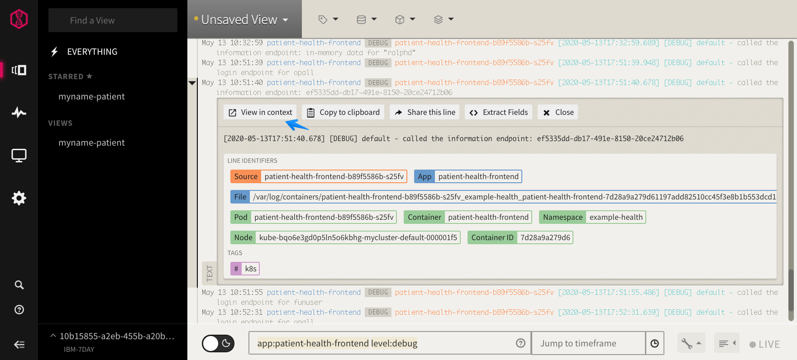
1. A new pop up window opens. In the window, choose one of the following options:
   - **By Everything** to see the log line in the context of all log records \(everything\) that are available in the {{site.data.keyword.la_short}} instance
   - **By source** to see the log line in the context of the log lines for the same source
   - **By App** to see the log line in the context of the log lines of the app
   - **By Source and App** to see the log line in the combined context of the app and source

   Then click **Continue in New Viewer** to get the view in a different page. You might need to scroll down to get this option.

   > **Tip: Open a view per type of context to troubleshoot problems.**

   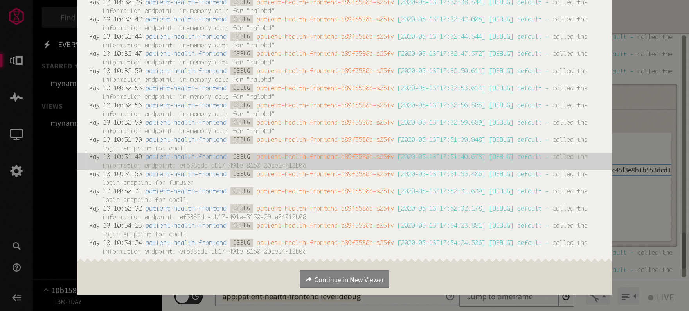
1. Expand the selected log and click **Copy to clipboard** to copy the message field to the clipboard. Notice that when you copy the log record you get less information than what it is displayed in the view. To get a line with all the fields, you must export data from a custom view.
1. When you are finished, close the line.

### View a subset of the events by applying a timeframe
{: #openshift-microservices-36}

In a view, you can search events that are displayed through a view for a specific timeframe.

You can apply a timestamp by specifying an absolute time, a relative time, or a time range.

Complete the following steps to jump to a specific time:

1. Launch the {{site.data.keyword.la_short}} web UI.
2. Click the **Views** icon .
3. Select your custom view.
4. Enter a time query. Choose any of the following options:
   - Enter a relative time such as `1 hour ago`. Type **ENTER**
   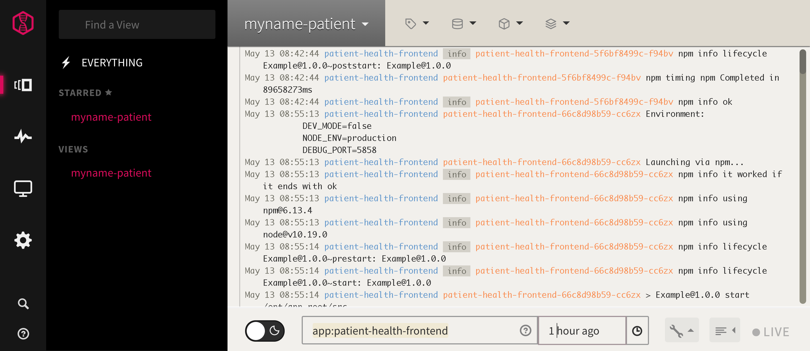
   - Enter an absolute time to jump to a point in time in your events such as `January 27 10:00am`
   - You can also enter a time range such as `yesterday 10am to yesterday 11am`, `last fri 4:30pm to 11/12 1 AM`, `last wed 4:30pm to 23/05 1 AM`, or `May 20 10am to May 22 10am`. Make sure to include `to` to separate the initial timestamp from the end timestamp

You might get the error message: `Your request is taking longer than expected`, try refreshing your browser after a few minutes of delay to allow logs to flow into the service.  Also, ensure that the the timeframe selected is likely to have events available for display. It may be required to change the time query, and retry.

### Create a dashboard
{: #openshift-microservices-37}

You can create a dashboard to monitor your app graphically through interactive graphs. For example, you can use graphs to analyze patterns and trends over a period of time.

Index fields are created on a regular schedule.   Currently it is done at 00:01 UTC (midnight). The following steps that require fields will not be possible until this process completes.
{: note}

Complete the following steps to create a dashboard to monitor logs from the lab's sample app:

1. In the {{site.data.keyword.la_short}} web UI, click the **Boards** icon .
1. Select **NEW BOARD** to create a new dashboard.
1. Click **Add Graph**.
1. Select the Field **All lines** under Graph a field.
1. Select the Filter **app:patient-health-frontend**.

   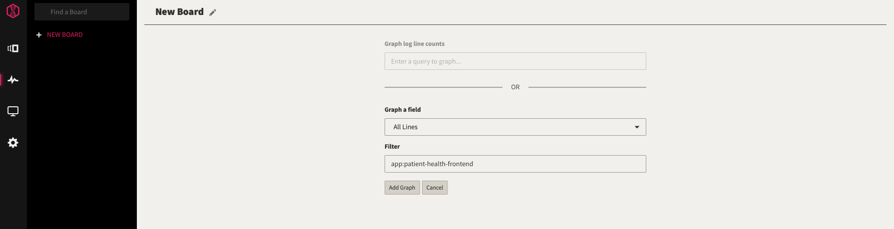

1. Click **Add Graph**.

   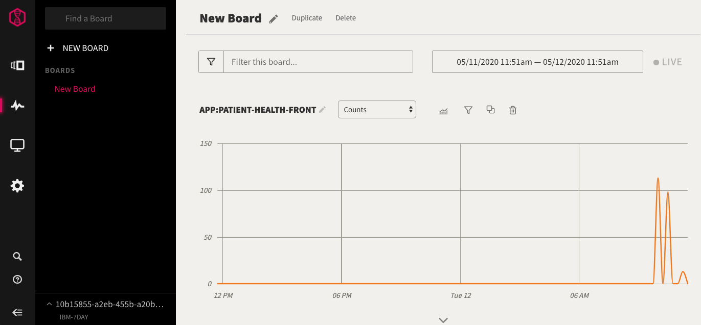

1. Note the view that displays the count of logs lines for the frontend app. Click the graph in a peak of data at the time that you want to see logs, and then click **Show logs**.

   A new page opens with the relevant log entries.  Click the browser's back button when done with the log lines to return to the graph.

1. Add subplots to analyze the data by applying additonal filtering criteria.

   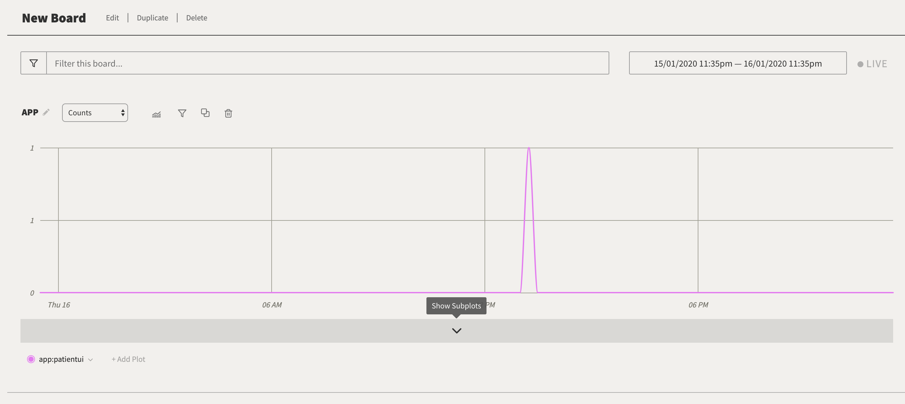

   1. Click **Show subplots**.
   2. Select **Histogram** and **level**.Click **Add Breakdown**.

   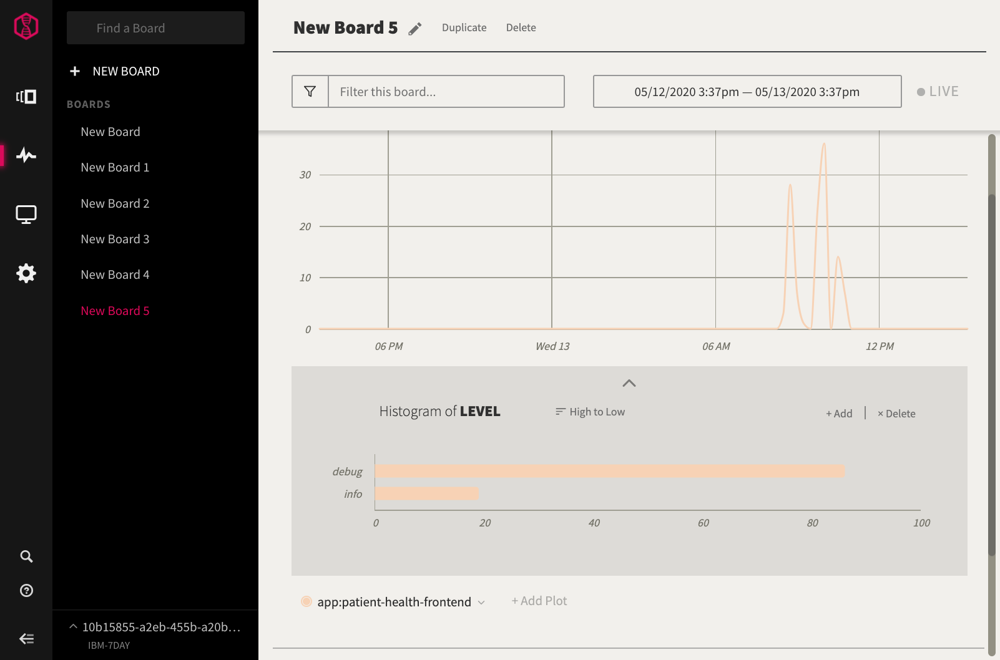

1. Name the dashboard by hitting the pencil **Edit Board** button next to the *New Board N* name".

   - Enter `patientui` as the name of the dashboard
   - Enter a category, for example, `yourname` then click **Add this as a new board category**
   - Click **Save**

A new category appears on the left navigation panel.

### Create a screen to monitor your app
{: #openshift-microservices-38}

You can create a screen to monitor your app graphically through metrics \(counters\), operational KPIs \(gauges\), tables, and time-shifted graphs \(graphs that you can use to analyze patterns and trends for comparison analysis\).

Complete the following steps to create a dashboard to monitor logs from the lab's sample app:

1. In the {{site.data.keyword.la_short}} web UI, click the **screens** icon .
2. Select **NEW SCREEN**.
3. Add a count of the patient health frontend log lines for the last two weeks:
   - Click **Add Widget** at the top and select **Count**
   - Click the newly created widget to reveal the configuration fields for the widget on the right
   - In the **Data** section
     - Select the field **app**, and set the value to **patient-health-frontend**
     - Keep Operation at the default **Counts**
     - In the **Duration** drop down select `Last 2 Weeks`
   - In the **Appearance** section
     - In the **Label** text box type `patient-health-frontend`

   The widget should look similar to the following one:

   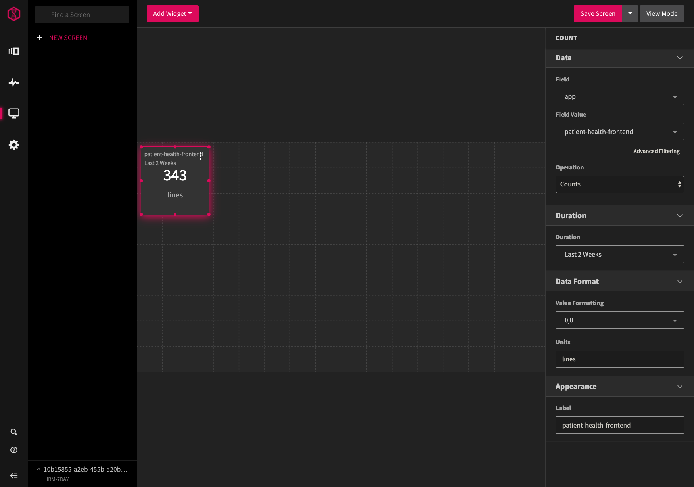
4. Add a gauge that records the debug lines for the patient-health-frontend for the last day.
   - Click **Add Widget** at the top and select **Gauge**
   - Click the newly created widget to reveal the configuration fields for the widget on the right
   - In the **Data** section
     - Select the field **app**, and set the value to **patient-health-frontend**
     - Click **Advanced Filtering** and in the text box type `level:debug`
     - Keep the **Duration** set to the default `Last 1 day`
   - In the **Appearance** section
     - In the **Label** text box type `patient-health-frontend`
5. Add a table of logs by namespace.
   - Click **Add Widget** at the top and select **Table**
   - Click the newly created widget to reveal the configuration fields for the widget on the right
   - In the **Data** section
     - Select the field **Group By** and choose `namespace` from the drop down
   - In the **Data Format** section
     - Select the field **Number of Rows** and choose `10` from the drop down
6. Drag the table to improve the presentation.  Verify the screen resembles the following:
    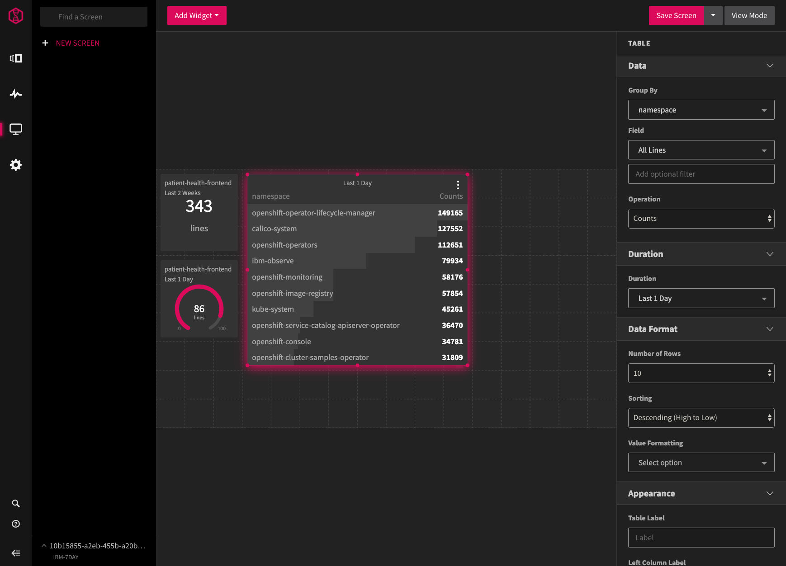
7. Save the screen. Select **Save Screen**.

   If you do not save the screen, you lose all your widgets.
   {: important}

Find more about {{site.data.keyword.la_short}} in the [IBM Cloud documentation](https://{DomainName}/docs/log-analysis/index.html#getting-started).
{: note}

## Configure {{site.data.keyword.mon_short}}
{: #openshift-microservices-configure-sysdig}
{: step}

The IBM Cloud provides a fully managed monitoring service.  Lets create a monitoring instance and then integrate it with your {{site.data.keyword.openshiftshort}} cluster using a script that creates a project and privileged service account for the {{site.data.keyword.mon_short}} agent.


### Verify that the {{site.data.keyword.mon_short}} agent is deployed successfully
{: #openshift-microservices-40}

Verify that the `sysdig-agent` pods on each node have a **Running** status.

Run the following command:
```sh
oc get pods -n ibm-observe
```
{: pre}

Example output:
```sh
NAME                 READY     STATUS    RESTARTS   AGE
sysdig-agent-qrbcq   1/1       Running   0          1m
sysdig-agent-rhrgz   1/1       Running   0          1m
```
{: screen}

## Monitor your Cluster
{: #openshift-microservices-use-sysdig}
{: step}

{{site.data.keyword.mon_full_notm}} is a cloud-native, and container- intelligence management system that you can include as part of your IBM Cloud architecture. Use it to gain operational visibility into the performance and health of your applications, services, and platforms. It offers administrators, DevOps teams, and developers full stack telemetry with advanced features to monitor and troubleshoot performance issues, define alerts, and design custom dashboards. [Learn more](https://{DomainName}/docs/monitoring?topic=monitoring-getting-started).

In the next steps, you will learn how to use dashboards and metrics to monitor the health of your application.

### View pre-defined monitoring views and dashboards
{: #openshift-microservices-42}

Use views and dashboards to monitor your infrastructure, applications, and services. You can use pre-defined dashboards. You can also create custom dashboards through the Web UI or programmatically. You can backup and restore dashboards by using Python scripts.

The following table lists the different types of pre-defined dashboards:

| Type | Description |
| :--- | :--- |
| Applications | Dashboards that you can use to monitor your applications and infrastructure components. |
| Host and containers | Dashboards that you can use to monitor resource utilization and system activity on your hosts and in your containers. |
| Network | Dashboards that you can use to monitor your network connections and activity. |
| Service | Dashboards that you can use to monitor the performance of your services, even if those services are deployed in orchestrated containers. |
| Topology | Dashboards that you can use to monitor the logical dependencies of your application tiers and overlay metrics. |

### View the {{site.data.keyword.mon_short}} dashboard
{: #openshift-microservices-43}

1. Navigate to [{{site.data.keyword.openshiftshort}} clusters](https://{DomainName}/kubernetes/clusters?platformType=openshift) and notice the {{site.data.keyword.openshiftshort}} clusters
2. Click on your cluster and verify the **Overview** tab on the left is selected
3. Next to **Monitoring**, click the **Launch** button.

Initial data may NOT be available on newly created **Monitoring** instances.
- After a few minutes, raw data will be displayed
- After about an hour, indexing will provides the detail required to proceed with this tutorial

1. Under the **Explore** section, select **Hosts & Containers** to view raw metrics for all workloads running on the cluster.

   If the drop down is not fully populated and indicates some inapplicable items double check that you have chosen **Explore** on the upper left and clicked on the **Hosts & Containers** drop down.  If so you will need to wait until the indexing step mentioned above is complete before continuing
   {: note}

   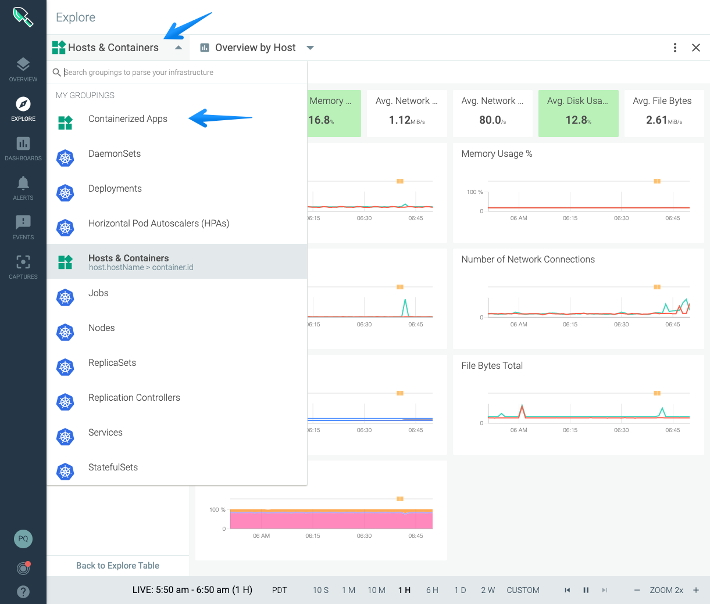
1. Under **Explore**, select **Nodes**, search `patient-health-frontend` in the **Search environment**. Look for the patient-health-frontend pod entry by navigating through the cluster and Node IPs. You may have to select **Overview by Host** (under Troubleshooting Views > Hosts & Containers) from the Top dropdown
   
1. Under **Dashboards** on the left pane, expand **Applications** in **Dashboard Templates**. Then select **HTTP** to get a global view of the cluster HTTP load.
1. From the **Explore** tab, select **Replication Controllers**.
1. Search for `example-health` namespace.
1. Select the `patient-health-frontend` to select all pods for the frontend.
   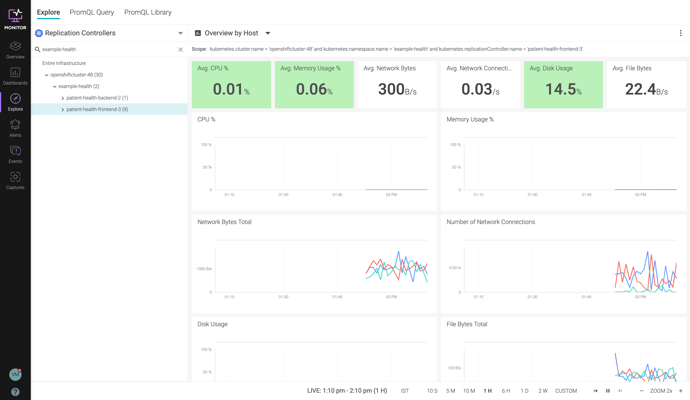

### Explore the cluster and the node capacity
{: #openshift-microservices-44}

1. Select **Dashboards**, check out the two dashboard templates:
   * **Containers > Container Resource Usage**
   * **Host Infrastructure > Host Resource Usage**

2. Select the **Kubernetes > Cluster and Node Capacity** template:
   - Check the **CPU Capacity**. This is the CPU capacity that has been reserved for the node including system daemons.
   - Check the **Allocatable CPU**. This is the CPU which is available for pods excluding system daemons.
   - Check the **CPU Limits (for all pods)**. It should be less than the allocatable CPU of the node or cluster.
   - Check the **CPU Requests (for all pods)**. It is the amount of CPU that will be guaranteed for pods on the node or cluster.
   - Check the **CPU Core Used (by all pods)**. It is the total amount of CPU that is used by all Pods on the node or cluster.

### Explore the Network
{: #openshift-microservices-45}

1. Select **Dashboards** and the template **Host Infrastructure > Network Traffic & Bandwidth**.

   The following dashboard is displayed. It shows information about all resources that are monitored through the instance.

   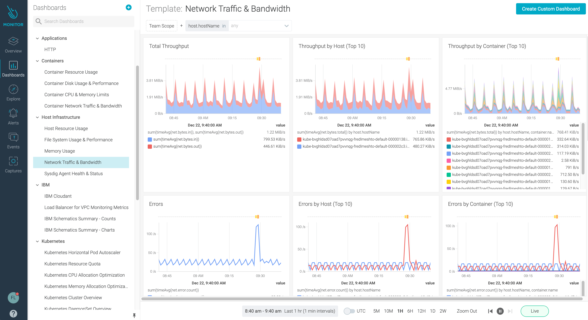

2. Create a customized dashboard and then scope it to a specific namespace.
   - In the action menu in the upper right click **Create Custom Dashboard** and name it `Yourname Network Traffic & Bandwidth`
   - Click **Create and Open**.
   - Edit the dashboard scope.
   - Set the filter to `kubernetes.namespace.name`, `is`, `ibm-observe`.
   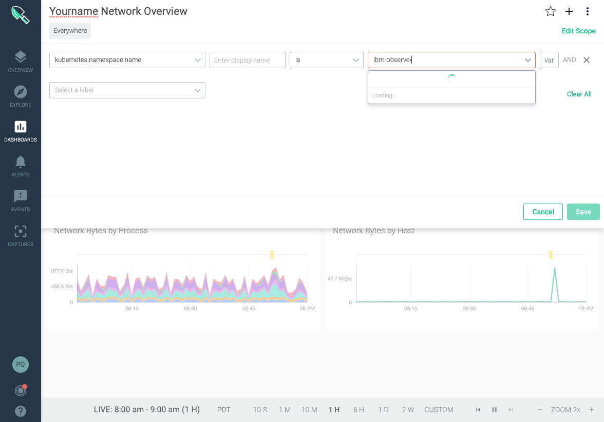
   - Click **Save**.

    The dashboard now shows information about the ibm-observe namespace.

    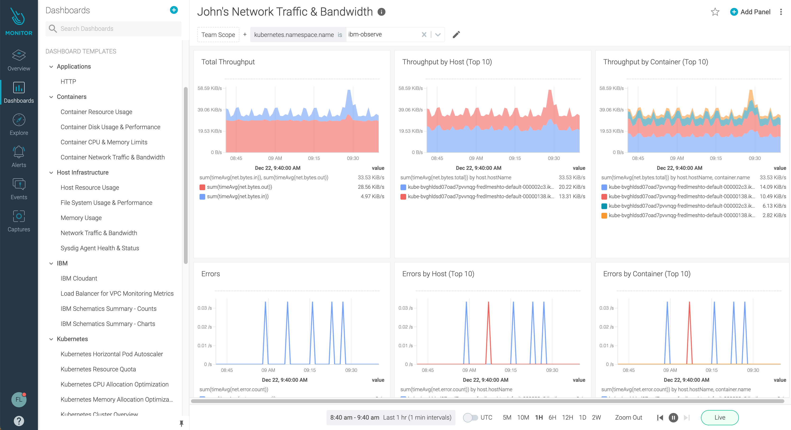

Find more about {{site.data.keyword.mon_full_notm}} in the [IBM Cloud documentation](https://{DomainName}/docs/monitoring?topic=monitoring-getting-started).

## Remove resources
{: #openshift-microservices-cleanup}
{: step}

<!--##isworkshop#-->
<!--
* Delete all application resource objects:
   ```sh
   oc delete all --selector app=$MYPROJECT
   ```
   {: pre}

* Delete the project:
   ```sh
   oc delete project $MYPROJECT
   ```
   {: pre}

-->
<!--#/isworkshop#-->
<!--##istutorial#-->
In the [Resource List](https://{DomainName}/resources) locate and delete the resources you wish to remove:
* Delete the {{site.data.keyword.openshiftshort}} cluster
* To delete the {{site.data.keyword.openshiftshort}} resources without deleting the cluster, run the below commands:
   ```sh
   oc delete all --all --namespace example-health
   oc delete project/example-health
   ```
   {: pre}
   
* Delete {{site.data.keyword.la_short}} instance
* Delete {{site.data.keyword.mon_full_notm}}
* Delete {{site.data.keyword.cloudant_short_notm}} and bind to a microservice
* {{site.data.keyword.cloudant_short_notm}} service

Depending on the resource it might not be deleted immediately, but retained (by default for 7 days). You can reclaim the resource by deleting it permanently or restore it within the retention period. See this document on how to [use resource reclamation](https://{DomainName}/docs/account?topic=account-resource-reclamation).
{: tip}

<!--#/istutorial#-->

## Related content
{: #openshift-microservices-13}

* [{{site.data.keyword.openshiftlong_notm}}](https://{DomainName}/docs/openshift)
* [{{site.data.keyword.cloudant_short_notm}}](https://{DomainName}/catalog/services/cloudant)
- [Analyze logs and monitor application health](https://{DomainName}/docs/solution-tutorials?topic=solution-tutorials-application-log-analysis#application-log-analysis)
* [Horizontal Pod Autoscaling](https://docs.openshift.com/container-platform/4.8/nodes/pods/nodes-pods-autoscaling.html)
