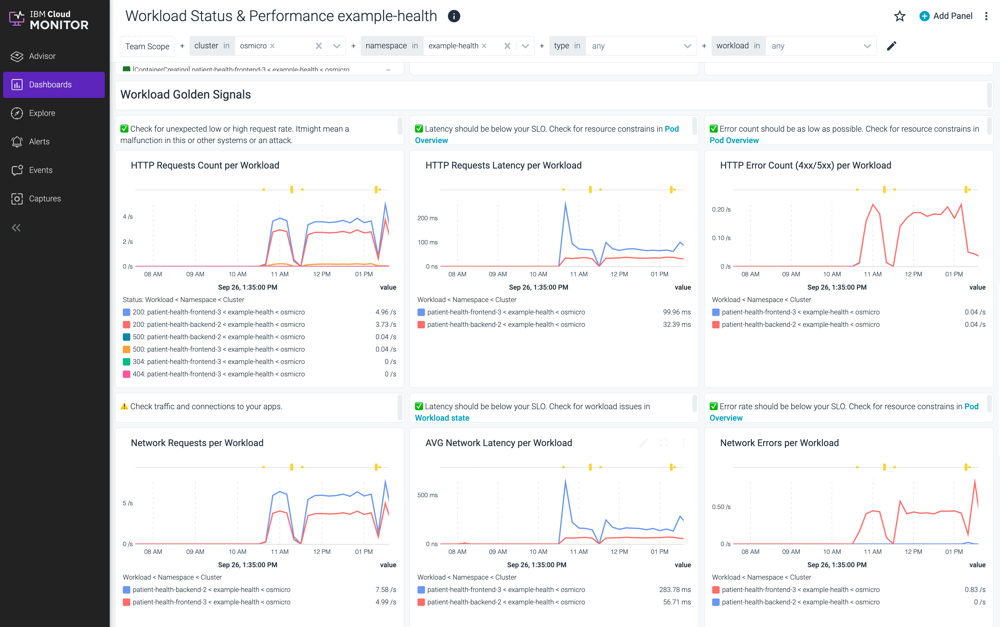

{{site.data.keyword.attribute-definition-list}}


# Deploy microservices with {{site.data.keyword.openshiftshort}}
{: #openshift-microservices}
{: toc-content-type="tutorial"}
{: toc-services="openshift, cloud-logs, monitoring, containers, Cloudant"}
{: toc-completion-time="3h"}
{: toc-use-case="ApplicationModernization, Containers"}

This tutorial may incur costs. Use the [Cost Estimator](/estimator) to generate a cost estimate based on your projected usage.
{: tip}


This tutorial demonstrates how to deploy applications to [{{site.data.keyword.openshiftlong_notm}}](/containers/cluster-management/catalog/about?platformType=openshift). {{site.data.keyword.openshiftshort}} provides a great experience for developers to deploy software applications and for System Administrators to scale and observe the applications in production.
{: shortdesc}

## Objectives
{: #openshift-microservices-objectives}

* Deploy a {{site.data.keyword.openshiftshort}} cluster
* Deploy a microservice
* Scale the microservice
* Use an operator to deploy {{site.data.keyword.cloudant_short_notm}} and bind to a microservice
* Observe the cluster using {{site.data.keyword.logs_full_notm}}
* Observe the cluster using {{site.data.keyword.mon_full_notm}}


{: caption="Architecture diagram of the tutorial" caption-side="bottom"}
{: style="text-align: center;"}


1. A developer initializes a {{site.data.keyword.redhat_openshift_notm}} application with a repository URL resulting in a **Builder**, **DeploymentConfig**, and **Service**.
1. The **Builder** clones the source, creates an image, pushes it to {{site.data.keyword.redhat_openshift_notm}} registry for **DeploymentConfig** provisioning.
1. Users access the frontend application.
1. The {{site.data.keyword.cloudant_short_notm}} database instance is provisioned through an IBM Cloud Operator Service.
1. The backend application is connected to the database with an IBM Cloud Operator Binding.
1. {{site.data.keyword.logs_full_notm}} is provisioned and agent deployed.
1. {{site.data.keyword.mon_short}} is provisioned and agent deployed.
1. An Administrator monitors the app with {{site.data.keyword.logs_full_notm}} and {{site.data.keyword.mon_short}}.

There are [scripts](https://github.com/IBM-Cloud/patient-health-frontend/tree/master/scripts){: external} that will perform some of the steps below.  It is described in the [README.md](https://github.com/IBM-Cloud/patient-health-frontend){: external}. If you run into trouble and want to start over just execute the `destroy.sh` script and sequentially go through the scripts that correspond to the steps to recover.

## Before you begin
{: #openshift-microservices-prereqs}

This tutorial requires:
* {{site.data.keyword.cloud_notm}} CLI,
   * {{site.data.keyword.containerfull_notm}} plugin (`kubernetes-service`),
* `oc` to interact with OpenShift.

You will find instructions to download and install these tools for your operating environment in the [Getting started with tutorials](/docs/solution-tutorials?topic=solution-tutorials-tutorials) guide.

To avoid the installation of these tools, you can use the [{{site.data.keyword.cloud-shell_short}}](/shell) from the {{site.data.keyword.cloud_notm}} console. Use `oc version` to ensure the version of the {{site.data.keyword.openshiftshort}} CLI matches your cluster version (`4.12.x`). If they do not match, install the matching version by following [these instructions](/docs/solution-tutorials?topic=solution-tutorials-tutorials#getting-started-cloud-shell).
{: note}


## Create a {{site.data.keyword.openshiftshort}} cluster
{: #openshift-microservices-create_openshift_cluster}
{: step}

With {{site.data.keyword.openshiftlong_notm}}, you have a fast and secure way to containerize and deploy enterprise workloads in clusters. {{site.data.keyword.redhat_openshift_notm}} clusters build on Kubernetes container orchestration that offers consistency and flexibility for your development lifecycle operations.

In this section, you will provision a {{site.data.keyword.openshiftlong_notm}} cluster in one (1) zone with two (2) worker nodes:

1. Create a {{site.data.keyword.openshiftshort}} cluster from the [{{site.data.keyword.Bluemix}} catalog](/containers/cluster-management/catalog/create?platformType=openshift).
2. Set the **Orchestration service** to **4.12.x version of {{site.data.keyword.openshiftshort}}**.
3. Select your OCP entitlement.
4. Under **Infrastructure** choose Classic or VPC
   - For {{site.data.keyword.redhat_openshift_notm}} on VPC infrastructure, you are required to have a VPC and one subnet prior to creating the {{site.data.keyword.openshiftshort}} cluster.  Create or inspect a desired VPC keeping in mind the following (see instructions provided under the [Creating a standard VPC cluster](/docs/openshift?topic=openshift-cluster-create-vpc-gen2&interface=ui)):
      - One subnet that can be used for this tutorial, take note of the subnet's zone and name
      - Public gateway is attached to the subnet
   - Select an existing **Cloud Object Storage** service or create one if required
5. Under **Location**
   - For {{site.data.keyword.redhat_openshift_notm}} on VPC infrastructure
      - Select a **Resource group**
      - Uncheck the inapplicable zones
      - In the desired zone verify the desired subnet name and if not present click the edit pencil to select the desired subnet name
   - For {{site.data.keyword.redhat_openshift_notm}} on Classic infrastructure follow the [Creating a standard classic cluster](/docs/openshift?topic=openshift-cluster-create-classic&interface=ui) instructions.
      - Select a **Resource group**
      - Select a **Geography**
      - Select **Single zone** as **Availability**
      - Choose a **Datacenter**
6. Under **Worker pool**,
   - Select **4 vCPUs 16GB Memory** as the flavor
   - Select **2** Worker nodes per data center for this tutorial (classic only: Leave **Encrypt local disk**)
6. Under **Integrations**, enable and configure **Logging** and **Monitoring**.
7. Under **Resource details**,Set **Cluster name** to **&lt;your-initials&gt;-myopenshiftcluster** by replacing `<your-initials>` with your own initials.
8. Click **Create** to provision a {{site.data.keyword.openshiftshort}} cluster.

Take a note of the resource group selected above.  This same resource group will be used for all resources in this lab.
{: note}


### Initialize a Cloud Shell
{: #openshift-microservices-3}

The [{{site.data.keyword.redhat_openshift_notm}} Container Platform CLI](https://docs.openshift.com/container-platform/4.12/cli_reference/openshift_cli/getting-started-cli.html){: external} exposes commands for managing your applications, as well as lower level tools to interact with each component of your system. The CLI is available using the `oc` command.

To avoid installing the command line tools, the recommended approach is to use the {{site.data.keyword.cloud-shell_notm}}. 

{{site.data.keyword.Bluemix_notm}} Shell is a cloud-based shell workspace that you can access through your browser. It's preconfigured with the full {{site.data.keyword.Bluemix_notm}} CLI and many plug-ins and tools that you can use to manage apps, resources, and infrastructure.

In this step, you'll use the {{site.data.keyword.Bluemix_notm}} shell and configure `oc` to point to the cluster assigned to you.

1. When the cluster is ready, click the button (next to your account) in the upper right corner to launch a [Cloud shell](/shell). **_Make sure you don't close this window/tab_**.
1. Check the version of the OpenShift CLI:
   ```sh
   oc version
   ```
   {: pre}
   
   > The version needs to be at minimum 4.12.x, otherwise install the latest version by following [these instructions](/docs/solution-tutorials?topic=solution-tutorials-tutorials#getting-started-cloud-shell_oc).

1. Validate your cluster is shown when listing all clusters:
   ```sh
   ibmcloud oc clusters
   ```
   {: pre}   

1. Initialize the `oc` command environment by replacing the placeholder &lt;your-cluster-name&gt;:
   ```sh
   ibmcloud oc cluster config -c <your-cluster-name> --admin
   ```
   {: pre}

1. Verify the `oc` command is working:
   ```sh
   oc get projects
   ```
   {: pre}


## Deploying an application
{: #openshift-microservices-deploy}
{: step}

In this section, you'll deploy a Node.js Express application named `patient-health-frontend`, a user interface for a patient health records system to demonstrate {{site.data.keyword.redhat_openshift_notm}} features. You can find the sample application GitHub repository here: https://github.com/IBM-Cloud/patient-health-frontend

### Create Project
{: #openshift-microservices-5}

A project is a collection of resources managed by a DevOps team.  An administrator will create the project and the developers can create applications that can be built and deployed.

1. Navigate to the {{site.data.keyword.redhat_openshift_notm}} web console by clicking the **OpenShift web console** button in the selected **Cluster**.
1. On the left navigation pane, under the **Administrator** perspective, select **Home** > **Projects** view to display all the projects.
1. Create a new project by clicking **Create Project**. In the pop up **Name** the project `example-health`, leave **Display Name** and **Description** blank, click **Create**.
1. The new project's **Project Details** page is displayed.  Observe that your context is **Administrator** > **Home** > **Projects** on the left and **Projects** > **Project details** > **example-health** on the top.

### Build and Deploy Application
{: #openshift-microservices-6}

1. Switch from the **Administrator** to the **Developer** perspective. Your context should be **Developer** > **+Add** on the left and **Project: example-health** on the top.
   {: caption="Project View" caption-side="bottom"}
2. Let's build and deploy the application by selecting **Import from Git**.
3. Enter the repository `https://github.com/IBM-Cloud/patient-health-frontend.git` in the Git Repo URL field.
   * Note the green check `Builder image detected` and the Node.js 16 (UBI 8).
   * Note that the builder image automatically detected the language Node.js. If not detected, select `Node.js` from the provided list.
   * **Builder Image Version** leave at the default.
   * **Application Name** delete all of the characters and leave it empty (this will default to the **Name**)
   * **Name :** patient-health-frontend.
   * Click the **Resource type** link and choose **DeploymentConfig**.
   * Leave defaults for other selections.
4. Click **Create** at the bottom of the window to build and deploy the application.

### View Application
{: #openshift-microservices-7}

1. You should see the app you just deployed.  Notice that you are in the **Topology** view of the example-health project in the **Developer** perspective.  All applications in the project are displayed.
1. Select the **node** **patient-health-frontend** to bring up the details view of the `DeploymentConfig`.  Note the **DC** next to **patient-health-frontend**.  The Pods, Builds, Services and Routes are visible.
   {: caption="App Details" caption-side="bottom"}

   * **Pods**: Your Node.js application containers
   * **Builds**: The auto-generated build that created a Docker image from your Node.js source code, deployed it to the {{site.data.keyword.redhat_openshift_notm}} container registry, and kicked off your deployment config
   * **Services**: Tells {{site.data.keyword.redhat_openshift_notm}} how to access your Pods by grouping them together as a service and defining the port to listen to
   * **Routes**: Exposes your services to the outside world using the LoadBalancer provided by the IBM Cloud network
1. Click on **View Logs** next to your completed Build. This shows you the process that {{site.data.keyword.redhat_openshift_notm}} took to install the dependencies for your Node.js application and build/push a Docker image.  The last entry should looks like this:
   ```sh
   Successfully pushed image-registry.openshift-image-registry.svc:5000/example-health/patient-health-frontend@sha256:f9385e010144f36353a74d16b6af10a028c12d005ab4fc0b1437137f6bd9e20a
   Push successful
   ```
   {: screen}

1. Click back to the **Topology** and select your app again.
1. Click on the URL under **Routes** to visit your application. Enter any string for username and password, for instance `test:test` because the app is running in demonstration mode.

The `Node.js` app has been deployed to {{site.data.keyword.redhat_openshift_notm}} Container Platform. To recap:
* The "Example Health" Node.js application was deployed directly from GitHub into your cluster.
* The application was examined in the {{site.data.keyword.openshiftshort}} console.
* A **Build Configuration** was created - a new commit can be both built and deployed by clicking **Start Build** in the Builds section of the application details.

## Logging and monitoring
{: #openshift-microservices-logging-monitoring}
{: step}

In this section, you will explore the out-of-the-box logging and monitoring capabilities that are offered in {{site.data.keyword.openshiftshort}}.

### Simulate Load on the Application
{: #openshift-microservices-9}

Create a script to simulate load.

1. Make sure you're connected to the project where you deployed your app.
   ```sh
   oc project example-health
   ```
   {: pre}

1. Retrieve the public route to access your application:
   ```sh
   oc get routes
   ```
   {: pre}

   Output looks similar to this, note your value for Host:
   ```sh
   NAME         HOST/PORT                                                                                                 PATH      SERVICES     PORT       TERMINATION   WILDCARD
   patient-health-frontend   patient-health-frontend-example-health.roks07-872b77d77f69503584da5a379a38af9c-0000.eu-de.containers.appdomain.cloud             patient-health-frontend   8080-tcp                 None
   ```
   {: screen}

1. Define a variable with the host:
   ```sh
   HOST=$(oc get routes -o json | jq -r '.items[0].spec.host')
   ```
   {: pre}

1. Verify access to the application. It outputs patient information:
   ```sh
   curl -s -L http://$HOST/info
   ```
   {: pre}

   Output should look like:
   ```sh
   $ curl -s -L http://$HOST/info
   {"personal":{"name":"Ralph DAlmeida","age":38,"gender":"male","street":"34 Main Street","city":"Toronto","zipcode":"M5H 1T1"},"medications":["Metoprolol","ACE inhibitors","Vitamin D"],"appointments":["2018-01-15 1:00 - Dentist","2018-02-14 4:00 - Internal Medicine","2018-09-30 8:00 - Pediatry"]}
   ```
   {: screen}

1. Run the following script which will endlessly send requests to the application and generates traffic:
   ```bash
   while sleep 0.2; do curl --max-time 2 -s -L http://$HOST/info >/dev/null; echo -n "."
   done
   ```
   {: pre}

   To stop the script, hit `CTRL + c` on your keyboard
   {: tip}

### {{site.data.keyword.openshiftshort}} Logging
{: #openshift-microservices-10}

Since there is only one pod, viewing the application logs will be straight forward.

1. Ensure that you're in the **Topology** view of the **Developer** perspective.
2. Navigate to your Pod by selecting your app.
3. Click on **View Logs** next to the name of the Pod under **Pods** to see streaming logs from your running application. If you're still generating traffic, you should see log messages for every request being made.

   {: caption="Pod Logs" caption-side="bottom"}

### {{site.data.keyword.openshiftshort}} Terminal
{: #openshift-microservices-11}

One of the great things about Kubernetes is the ability to quickly debug your application pods with SSH terminals. This is great for development, but generally is not recommended in production environments. {{site.data.keyword.redhat_openshift_notm}} makes it even easier by allowing you to launch a terminal directly in the dashboard.

1. Switch from the **Logs** tab to the **Terminal** tab.
1. Run the following Shell commands:

| Command | Description |
| :--- | :--- |
| `ls` | List the project files. |
| `ps aux` | List the running processes. |
| `cat /etc/redhat-release` | Show the underlying OS. |
| `curl localhost:8080/info` | output from the node app.js process |
{: caption="Examples of Shell commands to run" caption-side="bottom"}

### {{site.data.keyword.openshiftshort}} Monitoring
{: #openshift-microservices-12}

When deploying new apps, making configuration changes, or simply inspecting the state of your cluster, the project-scope dashboard gives a Developer clear insights.

1. Access the dashboard in the **Developer** perspective by clicking **Observe** on the left side menu.
2. You can also dive in a bit deeper by clicking the **Events** tab. **Events** are useful for identifying the timeline of events and finding potential error messages. When tracking the state of a new rollout, managing existing assets, or even something simple like exposing a route, the Events view is critical in identifying the timeline of activity. This becomes even more useful when considering that multiple operators may be working against a single cluster.

Almost all actions in {{site.data.keyword.redhat_openshift_notm}} result in an event being fired in this view. As it is updated real-time, it's a great way to track changes to state.

## Metrics and dashboards
{: #openshift-microservices-metrics}
{: step}

In this section explore the monitoring and metrics dashboards included in {{site.data.keyword.redhat_openshift_notm}}.

### Dashboards
{: #openshift-microservices-14}

{{site.data.keyword.redhat_openshift_notm}} comes with predefined dashboards to monitor your projects.

1. Get started by switching from the **Developer** perspective to the **Administrator** perspective:
2. Navigate to **Observe > Dashboards** in the left-hand bar.
1. Select **Kubernetes / Compute Resources / Namespace (Pods)** from the dropdown and Namespace to **example-health**.
3. Notice the CPU and Memory usage for your application. In production environments, this is helpful for identifying the average amount of CPU or Memory your application uses, especially as it can fluctuate through the day.  Auto-scaling is one way to handle fluctuations and will be demonstrated a little later.

### Metrics
{: #openshift-microservices-15}

{{site.data.keyword.redhat_openshift_notm}} provides a web interface to run queries and examine the metrics visualized on a plot. This functionality provides an extensive overview of the cluster state and enables you to troubleshoot problems.

1. Navigate to **Observe > Metrics**.
2. Enter the following expression and click **Run queries**. You should see the value and the graph associated with the query.

   ```sh
   sum(container_cpu_usage_seconds_total{container="patient-health-frontend"})
   ```
   {: codeblock}

   {: caption="Metrics Graph" caption-side="bottom"}

## Scaling the application
{: #openshift-microservices-scaling}
{: step}

In this section, the metrics observed in the previous section can be used to scale the UI application in response to load.

### Enable Resource Limits
{: #openshift-microservices-17}

Before autoscaling maximum CPU and memory resource limits must be established.

The dashboards earlier showed you that the load was consuming anywhere between ".002" to ".02" cores. This translates to 2-20 "millicores". To be safe, let's bump the higher-end up to 30 millicores. In addition, the data showed that the app consumes about `25`-`65` MB of RAM. The following steps will set the resource limits in the deploymentConfig

1. Make sure the script to generate traffic is running. 
1. Switch to the **Administrator** perspective.
1. Navigate to **Workloads > DeploymentConfigs**.
1. Select the **example-health** project.
1. From the **Actions** menu (the three vertical dots) of `patient-health-frontend`, choose **Edit DeploymentConfig**.
   {: caption="Deployments" caption-side="bottom"}
1. Under the **YAML view**, find the section **spec > template > spec > containers**, add the following resource limits into the empty resources. Replace the `resources {}`, and ensure the spacing is correct -- YAML uses strict indentation.

   ```yaml
             resources:
               limits:
                 cpu: 30m
                 memory: 100Mi
               requests:
                 cpu: 3m
                 memory: 40Mi
   ```
   {: codeblock}

   Here is a snippet after you have made the changes:
   ```yaml
          ports:
            - containerPort: 8080
              protocol: TCP
          resources:
            limits:
              cpu: 30m
              memory: 100Mi
            requests:
              cpu: 3m
              memory: 40Mi
          terminationMessagePath: /dev/termination-log
   ```
1. **Save** to apply the changes.
1. Verify that the replication controller has been changed by navigating to **Events** tab:
   {: caption="Resource Limits" caption-side="bottom"}

### Enable Autoscaler
{: #openshift-microservices-18}

Now that resource limits are configured, the pod autoscaler can be enabled.

By default, the autoscaler allows you to scale based on CPU or Memory. Pods are balanced between the minimum and maximum number of pods that you specify. With the autoscaler, pods are automatically created or deleted to ensure that the average CPU usage of the pods is below the CPU request target as defined. In general, you probably want to start scaling up when you get near `50`-`90`% of the CPU usage of a pod. In our case, `1`% can be used with the load being provided.

1. Navigate to **Administrator** perspective **Workloads > HorizontalPodAutoscalers**, then click **Create HorizontalPodAutoscaler**.

   {: caption="HPA" caption-side="bottom"}

   Replace the contents of the editor with this yaml:

   ```yaml
   apiVersion: autoscaling/v2
   kind: HorizontalPodAutoscaler
   metadata:
     name: patient-hpa
     namespace: example-health
   spec:
     scaleTargetRef:
       apiVersion: apps.openshift.io/v1
       kind: DeploymentConfig
       name: patient-health-frontend
     minReplicas: 1
     maxReplicas: 10
     metrics:
       - type: Resource
         resource:
           name: cpu
           target:
             averageUtilization: 1
             type: Utilization
   ```
   {: codeblock}

2. Click **Create**.

### Test Autoscaler
{: #openshift-microservices-19}

If you're not running the script to simulate load, the number of pods should stay at 1.

1. Check by opening the **Overview** page of the deployment config.  Click **Workloads** > **DeploymentConfigs** and click **patient-health-frontend** and make sure the **Details** panel is selected.
2. Start simulating load (see previous section to simulate load on the application).
   {: caption="Scaled to 4/10 pods" caption-side="bottom"}
   
   It can take a few minutes for the autoscaler to make adjustments.
   {: note}

That's it! You now have a highly available and automatically scaled front-end Node.js application. {{site.data.keyword.redhat_openshift_notm}} is automatically scaling your application pods since the CPU usage of the pods greatly exceeded `1`% of the resource limit, `30` millicores.

### Autoscaling from the command line
{: #openshift-microservices-20}

You can also can delete and create resources like autoscalars with the command line.

1. Start by verifying the context is your project:
   ```sh
   oc project example-health
   ```
   {: pre}

1. Get the autoscaler that was created earlier:
   ```sh
   oc get hpa
   ```
   {: pre}

1. Delete the autoscaler made earlier:
   ```sh
   oc delete hpa/patient-hpa
   ```
   {: pre}

1. Create a new autoscaler with a max of 9 pods:
   ```sh
   oc autoscale deploymentconfig/patient-health-frontend --name patient-hpa --min 1 --max 9 --cpu-percent=1
   ```
   {: pre}

1. Revisit the **Workloads > DeploymentConfigs** Details page for `patient-health-frontend` deployment and watch it work.

## Using the IBM Cloud Operator to create a Cloudant DB
{: #openshift-microservices-operator}
{: step}

Currently, the Example Health `patient-health-frontend` app is using a dummy in-memory patient. In this exercise, you'll create a Cloudant service in IBM Cloud and populate it with patient data. Cloudant is a NoSQL database-as-a-service, based on CouchDB.

### Enable the IBM Cloud Operator
{: #openshift-microservices-22}

Let's understand exactly how Operators work. In the first exercise, you used a builder to deploy a simple application using a **DeploymentConfig** a default resource type that come with {{site.data.keyword.redhat_openshift_notm}}. A custom resource definition allows you to create resource types that do not come preinstalled with {{site.data.keyword.openshiftshort}} such an IBM Cloud service. Operators manage the lifecycle of resources and create Custom Resource Descriptors, CRDs, allowing you to manage custom resources the native "Kubernetes" way.

1. In the **Administrator** perspective, and click **Operators > OperatorHub**.
2. Find the **IBM Cloud Operator**, and click **Install**.
3. Keep the default options and click **Install**.
4. After a few seconds `installed operator - ready for use` should be displayed.

### Create a Cloudant Service and Bind using the CRDs
{: #openshift-microservices-23}

Click to open it.  Scroll down to the **Prerequisites** section.

An API key with the appropriate permissions to create a {{site.data.keyword.cloudant_short_notm}} database is required in this section. The API key is going to be stored in a Kubernetes Secret resource. This will need to be created using the shell. There are instructions in the **Prerequisites** section of the installed operator.  Steps:

1. Use the same resource group and region that is associated with your cluster.
   ```sh
   ibmcloud target -g <resource_group> -r <region>
   ```
   {: pre}

   To see the the resource groups in your account, run `ibmcloud resource groups` command
   {: tip}

2. Verify that the resource group and region matches your cluster.  The following command should return your cluster.
   ```sh
   ibmcloud oc cluster ls
   ```
   {: pre}

Output looks something like this:
   ```sh
   $ ibmcloud oc cluster ls
   OK
   Name      ID                     State    Created        Workers   Location   Version                  Resource Group Name   Provider
   osmicro   ck68svdd0vvcfs6ad9ag   normal   18 hours ago   2         Dallas     4.12.26_1562_openshift   default               vpc-gen2
   ```
   {: screen}

3. Use the helper script provided by IBM to create the following resources:
   - {{site.data.keyword.Bluemix_notm}} API key that represents you and your permissions to use {{site.data.keyword.Bluemix_notm}}
   - Kubernetes Secret named `secret-ibm-cloud-operator` in the `default` namespace.  This secret has the keys `api-key` and `region`.  The operator will use this data to create the cloudant service instance.
   - Kubernetes ConfigMap resource with the name `config-ibm-cloud-operator` in the `default` namespace to hold the region and resource group

   Use the supplied curl command:

   ```sh
   curl -sL https://raw.githubusercontent.com/IBM/cloud-operators/master/hack/configure-operator.sh | bash
   ```
   {: pre}

4. Back in the {{site.data.keyword.redhat_openshift_notm}} web console, click the **Create service** under the **Service** tab on the **Installed Operators** of the **IBM Cloud Operator** page and select **YAML view** to bring up the yaml editor.
5. Make the suggested substitutions where the serviceClass is **cloudantnosqldb** and the plan can be **lite** or **standard** (only one lite plan is allowed per account). Replace `<your-initials>`:
   ```yaml
   apiVersion: ibmcloud.ibm.com/v1
   kind: Service
   metadata:
     annotations:
      ibmcloud.ibm.com/self-healing: enabled
     name: <your-initials>-cloudant-service
     namespace: example-health
   spec:
     serviceClass: cloudantnosqldb
     plan: standard
   ```
   {: codeblock}

6. Click **Create** to create a {{site.data.keyword.cloudant_short_notm}} database instance.
   Your context should be **Operators** > **Installed Operators**  > **IBM Cloud Operator** in the **Administrator** perspective with Project: example-health in the **Service** panel.
7. Click on the service just created, **&lt;your-initials&gt;-cloudant-service** and over time the **state** field will change from **provisioning** to **Online** meaning it is good to go.
8. Create a Binding resource and a Secret resource for the cloudant Service resource just created.  Navigate back to  **Operators** > **Installed Operators**  > **IBM Cloud Operator** > **Binding** tab.  Open the **Binding** tab, click **Create Binding** and select **YAML View**.  Create a cloudant-binding associated with the serviceName `<your-initials>-cloudant-service`, (this is the the name provided for the **Service** created earlier).
   ```yaml
   apiVersion: ibmcloud.ibm.com/v1
   kind: Binding
   metadata:
     name: cloudant-binding
     namespace: example-health
   spec:
     serviceName: <your-initials>-cloudant-service
   ```
   {: codeblock}

9. Optionally dig a little deeper to understand the relationship between the {{site.data.keyword.redhat_openshift_notm}} resources: **Service**, service **Binding**, binding **Secret** and the {{site.data.keyword.cloud_notm}} resources: **Service**, service **Instance** and the instance's **Service credentials**. Using the cloud shell:

   ```sh
   ibmcloud resource service-instances --service-name cloudantnosqldb
   ```
   {: pre}

   ```sh
   YOURINITIALS=<your-initials>
   ```
   {: pre}

   ```sh
   ibmcloud resource service-instance $YOURINITIALS-cloudant-service
   ```
   {: pre}

   ```sh
   ibmcloud resource service-keys --instance-name $YOURINITIALS-cloudant-service --output json
   ```
   {: pre}

   Output looks something like this:
   ```sh
   youyou@cloudshell:~$ ibmcloud resource service-instances --service-name cloudantnosqldb
   Retrieving instances with type service_instance in all resource groups in all locations under ..
   OK
   Name                           Location   State    Type
   <your-initials>-cloudant-service               us-south   active   service_instance
   youyou@cloudshell:~$ ibmcloud resource service-instance <your-initials>-cloudant-service
   Retrieving service instance <your-initials>-cloudant-service in all resource groups under ...
   OK

   Name:                  <your-initials>-cloudant-service
   ID:                    crn:v1:bluemix:public:cloudantnosqldb:us-south:a/0123456789507a53135fe6793c37cc74:SECRET
   GUID:                  SECRET
   Location:              us-south
   Service Name:          cloudantnosqldb
   Service Plan Name:     standard
   Resource Group Name:   Default
   State:                 active
   Type:                  service_instance
   Sub Type:
   Created at:            2020-05-06T22:39:25Z
   Created by:            youyou@us.ibm.com
   Updated at:            2020-05-06T22:40:03Z
   Last Operation:
                       Status       create succeeded
                       Message      Provisioning is complete
                       Updated At   2020-05-06 22:40:03.04469305 +0000 UTC

   youyou@cloudshell:~$ ibmcloud resource service-keys --instance-name $YOURINITIALS-cloudant-service --output json
   [
       {
           "guid": "01234560-902d-4078-9a7f-20446a639aeb",
           "id": "crn:v1:bluemix:public:cloudantnosqldb:us-south:a/0123456789507a53135fe6793c37cc74:SECRET",
           "url": "/v2/resource_keys/01234560-902d-4078-9a7f-20446a639aeb",
           "created_at": "2020-05-06T23:03:43.484872077Z",
           "updated_at": "2020-05-06T23:03:43.484872077Z",
           "deleted_at": null,
           "name": "cloudant-binding",
           "account_id": "0123456789507a53135fe6793c37cc74",
           "resource_group_id": "01234567836d49029966ab5be7fe50b5",
           "source_crn": "crn:v1:bluemix:public:cloudantnosqldb:us-south:a/0123456789507a53135fe6793c37cc74:SECRET",
           "state": "active",
           "credentials": {
               "apikey": "SECRET",
               "host": "SECRET",
               "iam_apikey_description": "Auto-generated for key SECRET",
               "iam_apikey_name": "cloudant-binding",
               "iam_role_crn": "SECRET",
               "iam_serviceid_crn": "SECRET",
               "password": "SECRET",
               "port": 443,
               "url": "https://01234SECRET",
               "username": "01234567-SECRET"
           },
           "iam_compatible": true,
           "resource_instance_url": "/v2/resource_instances/SECRET",
           "crn": "crn:v1:bluemix:public:cloudantnosqldb:us-south:a/0123456789507a53135fe6793c37cc74:SECRET"
       }
   ]
   ```
   {: screen}

### Deploy the Node.js Patient Backend Database App
{: #openshift-microservices-24}

Now you'll create the Node.js app that will populate your Cloudant DB with patient data. It will also serve data to the front-end application deployed earlier.

1. Make sure you're your context is the project **example-health**:
   ```sh
   oc project example-health
   ```
   {: pre}

1. The following new-app commmand will make a build configuration and Deployment Configuration.  The following demonstrates the CLI invocation of the add application (remember using the GUI console for the frontend):
   ```sh
   oc new-app --name=patient-health-backend --as-deployment-config registry.access.redhat.com/ubi9/nodejs-20-minimal:latest~https://github.com/IBM-Cloud/patient-health-backend
   ```
   {: pre}

1. Back in the console, and in the **Topology** view of the **Developer** perspective, open the **patient-health-backend** app and wait for the build to complete. Notice that the **Pod** is failing to start.  Click on the **Pod** logs to see:
   ```sh
   > node app.js

   /opt/app-root/src/app.js:23
            throw("Cannot find Cloudant credentials, set CLOUDANT_URL.")
            ^
   Cannot find Cloudant credentials, set CLOUDANT_URL.
   ```
1. Let's fix this by setting the environment variable of the **DeploymentConfig** to the **cloudant-binding** secret created earlier in the operator binding section. Navigate to the deployment config for the `patient-health-backend` app by clicking the app, and then selecting the name next to **DC**:
   {: caption="Deployment Config" caption-side="bottom"}
1. Go to the **Environment** tab, click **Add from ConfigMap or Secret** and create a new environment variable named **CLOUDANT_URL**. Choose the **cloudant-binding** secret, then choose **url** for the Key. Click **Save**.
   {: caption="Environment from Secret" caption-side="bottom"}
1. Go back to the **Topology** tab, and click the **patient-health-backend**.  Check out the **Pods** section, which should indicate **Running** shortly.  Click on **View logs** next to the running pod and notice the databases created.

### Configure Patient Health Frontend App to use Patient Health Backend App
{: #openshift-microservices-25}

The `patient-health-frontend` application has an environment variable for the backend microservice url.

1. Set the **API_URL** environment variable to **default** in the frontend **DeploymentConfig**. Navigate to the deployment config for the `patient-health-frontend` app by clicking the frontend app in the **Topology** view, and then selecting the name next to **DC**:

2. Go to the **Environment** tab, and in the **Single values (env)** section add a name `API_URL` and value `default`.  Click **Save** then **Reload**.  This will result in a connection to `http://patient-health-backend:8080/` which you can verify by looking at the pod logs.  You can verify this is the correct port by scanning for the `Pod Template / Containers / Port` output of this command:

   ```sh
   oc describe dc/patient-health-backend
   ```
   {: pre}

Your application is now backed by the mock patient data in the Cloudant DB! You can now log-in using any user-id/password in the Cloudant DB, use "**opall:opall**".

1. In a real-world application, these passwords should **not** be stored as plain-text. To review the patients (and alternate logins) in the Cloudant DB, navigate to your `services` in IBM Cloud [Resource List](/resources). Click **&lt;your-initials&gt;-cloudant-service**.
2. Launch the Cloudant dashboard by clicking on **Launch Dashboard** button and then click the `patients` db.
3. Click through the different patients you can log in as.

## Forward {{site.data.keyword.openshiftshort}} logs and monitoring to IBM services
{: #openshift-microservices-connect-logging-metrics}
{: step}

Cluster logs can be forwarded to the {{site.data.keyword.Bluemix}} log service and integrated into a complete logging analysis and storage environment for the cloud - see [Logging for clusters](/docs/openshift?topic=openshift-health). Cluster metrics can be integrated with the cloud monitoring system - [Monitoring cluster health](/docs/openshift?topic=openshift-health-monitor)

It can take a few minutes for logging and metric data to flow through the analysis systems, so it is best to connect both at this time for later use.

## Monitor your Cluster
{: #openshift-microservices-use-sysdig}
{: step}

{{site.data.keyword.mon_full_notm}} is a cloud-native, and container- intelligence management system that you can include as part of your IBM Cloud architecture. Use it to gain operational visibility into the performance and health of your applications, services, and platforms. It offers administrators, DevOps teams, and developers full stack telemetry with advanced features to monitor and troubleshoot performance issues, define alerts, and design custom dashboards. [Learn more](/docs/monitoring?topic=monitoring-getting-started).

In the next steps, you will learn how to use dashboards and metrics to monitor the health of your application.

### View pre-defined monitoring views and dashboards
{: #openshift-microservices-42}

Use views and dashboards to monitor your infrastructure, applications, and services. You can use pre-defined dashboards. You can also create custom dashboards through the Web UI or programmatically. You can backup and restore dashboards by using Python scripts.

The following table lists the different types of pre-defined dashboards:

| Type | Description |
| :--- | :--- |
| Workload Status and Performance | Dashboards that you can use to monitor your pods. |
| Node Status and Performance | Dashboards that you can use to monitor resource utilization and system activity on your hosts and in your containers. |
| Network | Dashboards that you can use to monitor your network connections and activity. |
{: caption="Subset of existing pre-defined dashboards" caption-side="bottom"}

### View the {{site.data.keyword.mon_short}} dashboard
{: #openshift-microservices-43}

1. Navigate to [{{site.data.keyword.openshiftshort}} clusters](/kubernetes/clusters?platformType=openshift) and notice the {{site.data.keyword.redhat_openshift_notm}} clusters
2. Click on your cluster and verify the **Overview** tab on the left is selected
3. In the **Integrations** section next to **Monitoring**, click the **Launch** button.

Initial data may NOT be available on newly created **Monitoring** instances.
- After a few minutes, raw data will be displayed
- After about an hour, indexing will provides the detail required to proceed with this tutorial

1. Under the **Dashboards** section, select **Kubernetes > Pod Status & Performance** to view raw metrics for all workloads running on the cluster.
1. Set the **namespace** filter to **example-health** to focus on the pods of your application.
1. Under **Dashboards** on the left pane, expand **Applications** in **Dashboard Templates**. Then select **HTTP** to get a global view of the cluster HTTP load.

### Explore the cluster and the node capacity
{: #openshift-microservices-44}

1. Select **Dashboards**, check out the two dashboard templates:
   * **Containers > Container Resource Usage**
   * **Host Infrastructure > Host Resource Usage**

2. Select **Kubernetes** > **Pod Rightsizing & Workload Capacity Optimization** template. This dashboard helps you to optimize your infrastructure and better control cluster spend by ensure pods are sized correctly. Understand if you can free up resources by reducing memory and/or CPU requests.

### Explore the Application
{: #openshift-microservices-45}

1. Select **Dashboards** and the template **Kubernetes > Workload Status & Performance**.

   A detailed dashboard showing all the pods in the cluster.

2. Create a customized dashboard and then scope it to a specific namespace.
   - In the upper right click **Copy to my Dashboards** and name it `Workload Status & Performanceapp example-health`
   - Click **Create and Open** to create your own dashboard.
   - Edit the dashboard scope.
   - Set the filter for `kube_namespace_name`, `is`, `example-health`.
   - Click **Save**.

    The dashboard now shows information focused on the example-health namespace.
    
    Scroll down to the TimeCharts for HTTP Requests, Latency, Error, ... to understand the performance of the application.

    {: caption="Custom Network Traffic and Bandwidth" caption-side="bottom"}

Find more about {{site.data.keyword.mon_full_notm}} in the [IBM Cloud documentation](/docs/monitoring?topic=monitoring-getting-started).

## Remove resources
{: #openshift-microservices-cleanup}
{: step}

In the [Resource List](/resources) locate and delete the resources you wish to remove:
* Delete the {{site.data.keyword.openshiftshort}} cluster
* To delete the {{site.data.keyword.redhat_openshift_notm}} resources without deleting the cluster, run the below commands:
   ```sh
   oc delete all --all --namespace example-health
   oc delete project/example-health
   ```
   {: pre}
   
* Delete {{site.data.keyword.logs_full_notm}} instance
* Delete {{site.data.keyword.mon_full_notm}}
* Delete {{site.data.keyword.cloudant_short_notm}} and bind to a microservice
* {{site.data.keyword.cloudant_short_notm}} service

Depending on the resource it might not be deleted immediately, but retained (by default for 7 days). You can reclaim the resource by deleting it permanently or restore it within the retention period. See this document on how to [use resource reclamation](/docs/account?topic=account-resource-reclamation).
{: tip}


## Related content
{: #openshift-microservices-13}

- [{{site.data.keyword.openshiftlong_notm}}](/docs/openshift)
- [{{site.data.keyword.cloudant_short_notm}}](/catalog/services/cloudant)
- [Horizontal Pod Autoscaling](https://docs.openshift.com/container-platform/4.12/nodes/pods/nodes-pods-autoscaling.html){: external}
