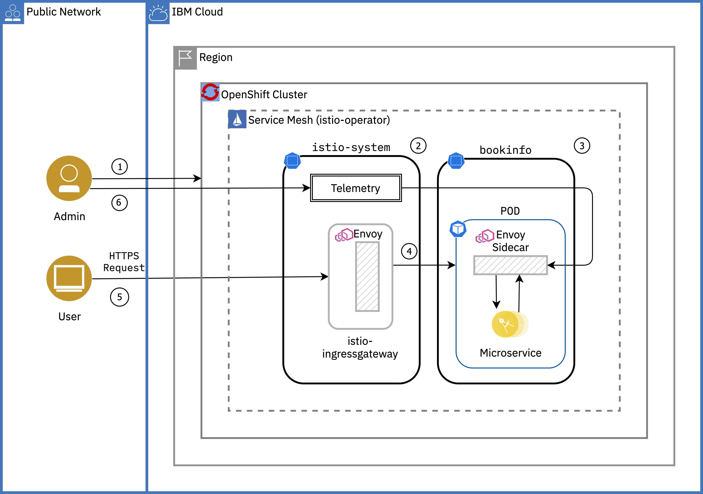
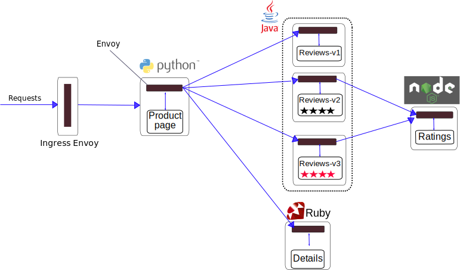

{:step: data-tutorial-type='step'}
{:shortdesc: .shortdesc}
{:new_window: target="_blank"}
{:codeblock: .codeblock}
{:screen: .screen}
{:tip: .tip}
{:pre: .pre}
{:important: .important}
{:note: .note}

# Service Mesh on {{site.data.keyword.openshiftshort}}
{: #openshift-service-mesh}
{: toc-content-type="tutorial"}
{: toc-services="openshift, containers"}
{: toc-completion-time="2h"}

<!--##istutorial#-->
This tutorial may incur costs. Use the [Cost Estimator](https://{DomainName}/estimator/review) to generate a cost estimate based on your projected usage.
{: tip}

<!--#/istutorial#-->

This tutorial walks you through how to install {{site.data.keyword.redhat_openshift_notm}} Service Mesh alongside microservices for a sample app called BookInfo in a [{{site.data.keyword.openshiftlong_notm}}](https://{DomainName}/kubernetes/catalog/about?platformType=openshift) cluster. You will also learn how to configure an Istio ingress-gateway to expose a service outside of the service mesh, perform traffic management to set up important tasks like A/B testing and canary deployments, secure your microservice communication and use of metrics, logging and tracing to observe services.
{: shortdesc}

Based on the open source Istio project, {{site.data.keyword.redhat_openshift_notm}} Service Mesh adds a transparent layer on existing distributed applications. {{site.data.keyword.redhat_openshift_notm}} Service Mesh provides a platform for behavioral insight and operational control over your networked microservices in a service mesh. With {{site.data.keyword.redhat_openshift_notm}}, you can connect, secure, and monitor microservices in your {{site.data.keyword.openshiftlong_notm}} cluster.

[Istio](https://www.ibm.com/cloud/info/istio) is an open platform to connect, secure, control and observe microservices, also known as a service mesh, on cloud platforms such as Kubernetes in {{site.data.keyword.openshiftshort}}.

## Objectives
{: #openshift-service-mesh-objectives}

- Install {{site.data.keyword.redhat_openshift_notm}} Service Mesh in your cluster
- Deploy the BookInfo sample app
- Use metrics, logging and tracing to observe services
- Set up the Istio Ingress Gateway
- Perform simple traffic management, such as A/B tests and canary deployments
- Secure your mesh using mTLS

{: caption="Figure 1. Architecture diagram of the tutorial" caption-side="bottom"}
{: style="text-align: center;"}

1. The admin provisions a {{site.data.keyword.openshiftlong_notm}} cluster and installs the Service Mesh Operator along with other Telemetry Operators.
2. Admin creates an `istio-system` namespace(project) and creates `ServiceMeshControlPlane`.
3. Admin creates a `bookinfo` namespace with automatic sidecar injection enabled and deploys the BookInfo app (with four separate microservices) in to the Service Mesh.
4. Admin exposes the app for external traffic with the Istio Ingress Gateway.
5. The user securely(HTTPS) accesses the application via browser.
6. The admin monitors the health and performance of the microservices using the metrics, traces, logs.

<!--##istutorial#-->
## Before you begin
{: #openshift-service-mesh-prereqs}

This tutorial requires:
* {{site.data.keyword.cloud_notm}} CLI,
   * {{site.data.keyword.containerfull_notm}} plugin (`kubernetes-service`),
* `oc` to interact with OpenShift.

You will find instructions to download and install these tools for your operating environment in the [Getting started with tutorials](https://{DomainName}/docs/solution-tutorials?topic=solution-tutorials-tutorials) guide.

To avoid the installation of these tools, you can use the [{{site.data.keyword.cloud-shell_short}}](https://{DomainName}/shell) from the {{site.data.keyword.cloud_notm}} console. Use `oc version` to ensure the version of the {{site.data.keyword.openshiftshort}} CLI matches your cluster version (`4.12.x`). If they do not match, install the matching version by following [these instructions](https://{DomainName}/docs/solution-tutorials?topic=solution-tutorials-tutorials#getting-started-cloud-shell).
{: note}

<!--#/istutorial#-->

<!--##istutorial#-->
<!--This section is identical in all openshift tutorials, copy/paste any changes-->
## Create a {{site.data.keyword.openshiftshort}} cluster
{: #openshift-service-mesh-create_openshift_cluster}
{: step}

With {{site.data.keyword.openshiftlong_notm}}, you have a fast and secure way to containerize and deploy enterprise workloads in clusters. {{site.data.keyword.openshiftshort}} clusters build on Kubernetes container orchestration that offers consistency and flexibility for your development lifecycle operations.

In this section, you will provision a {{site.data.keyword.openshiftlong_notm}} cluster in one (1) zone with two (2) worker nodes:

1. Log into your {{site.data.keyword.cloud_notm}} account and create a {{site.data.keyword.openshiftshort}} cluster from the [{{site.data.keyword.openshiftshort}} cluster create page](https://{DomainName}/kubernetes/catalog/create?platformType=openshift).
2. Set the **Orchestration service** to **4.12.x version of {{site.data.keyword.openshiftshort}}**.
3. Select your OCP entitlement.
4. Under **Infrastructure** choose Classic or VPC
   - For {{site.data.keyword.openshiftshort}} on VPC infrastructure, you are required to create a VPC and one subnet prior to creating the Kubernetes cluster.  Create or inspect a desired VPC keeping in mind the following (see instructions provided under the [Creating a standard VPC cluster](https://{DomainName}/docs/openshift?topic=openshift-clusters#clusters_vpcg2)):
      - One subnet that can be used for this tutorial, take note of the subnet's zone and name
      - Public gateway is attached to the subnet
   - Select the desired VPC
   - Select an existing **Cloud Object Storage** service or create one if required and then select
5. Under **Location**
   - For {{site.data.keyword.openshiftshort}} on VPC infrastructure
      - Select a **Resource group**
      - Uncheck the inapplicable zones
      - In the desired zone verify the desired subnet name and if not present click the edit pencil to select the desired subnet name
   - For {{site.data.keyword.openshiftshort}} on Classic infrastructure follow the [Creating a standard classic cluster](https://{DomainName}/docs/openshift?topic=openshift-clusters#clusters_standard) instructions.
      - Select a **Resource group**
      - Select a **Geography**
      - Select **Single zone** as **Availability**
      - Choose a **Datacenter**
6. Under **Worker pool**,
   - Select **4 vCPUs 16GB Memory** as the flavor
   - Select **2** Worker nodes per data center for this tutorial (classic only: Leave **Encrypt local disk**)
7. Under **Resource details**,Set **Cluster name** to **&lt;your-initials&gt;-myopenshiftcluster** by replacing `<your-initials>` with your own initials.
8. Click **Create** to provision a {{site.data.keyword.openshiftshort}} cluster.

Take a note of the resource group selected above.  This same resource group will be used for all resources in this lab.
{: note}

<!--#/istutorial#-->

<!--##isworkshop#-->
<!--
## Configure the access to your cluster
{: #openshift-service-mesh-access-cluster}
{: step}

1. Log in to the {{site.data.keyword.cloud_notm}} console.
2. Select the account where you have been invited by clicking on the account name in the top bar.
3. Find the cluster assigned to you in the [cluster list](https://{DomainName}/kubernetes/clusters?platformType=openshift).
-->
<!--#/isworkshop#-->

### Access the cluster using the {{site.data.keyword.cloud-shell_notm}}
{: #openshift-service-mesh-3}

The [{{site.data.keyword.openshiftshort}} Container Platform CLI](https://docs.openshift.com/container-platform/4.12/cli_reference/openshift_cli/getting-started-cli.html) exposes commands for managing your applications, as well as lower level tools to interact with each component of your system. The CLI is available using the `oc` command.

To avoid installing the command line tools, the recommended approach is to use the {{site.data.keyword.cloud-shell_notm}}. 

{{site.data.keyword.Bluemix_notm}} Shell is a cloud-based shell workspace that you can access through your browser. It's preconfigured with the full {{site.data.keyword.Bluemix_notm}} CLI and many plug-ins and tools that you can use to manage apps, resources, and infrastructure.

In this step, you'll use the {{site.data.keyword.Bluemix_notm}} shell and configure `oc` to point to the cluster assigned to you.

1. When the cluster is ready, on the cluster overview page click on **OpenShift web console** to open the console. **_Make sure you don't close this window/tab_**
2. On the web console, click the drop-down under your name in the right corner of your screen and select **Copy Login Command** and then click the **Display Token** link.
3. Copy the text under **Log in with this token**.
4. In a new browser tab/window, open the [{{site.data.keyword.cloud-shell_notm}}](https://{DomainName}/shell) to start a new session. Once the session starts, you should be automatically logged-in to the {{site.data.keyword.Bluemix_notm}} CLI. **_Make sure you don't close this window/tab_**.
5. Check the version of the OpenShift CLI:
   ```sh
   oc version
   ```
   {: pre}

6. The version needs to be at minimum 4.12.x, otherwise install the latest version by following [these instructions](https://{DomainName}/docs/solution-tutorials?topic=solution-tutorials-tutorials#getting-started-cloud-shell).
7. Paste the login command you copied from the web console and hit Enter. Once logged-in using the `oc login` command, run the below command to see all the namespaces in your cluster
   ```sh
   oc get ns
   ```
   {: pre}

## Install Service Mesh - Istio
{: #openshift-service-mesh-install_istio}
{: step}

In this section, you will install Service Mesh - Istio on the cluster. Installing the Service Mesh involves installing the Elasticsearch, Jaeger, Kiali and Service Mesh Operators, creating and managing a `ServiceMeshControlPlane` resource to deploy the control plane, and creating a `ServiceMeshMemberRoll` resource to specify the namespaces associated with the Service Mesh.

**Elasticsearch** - Based on the open source Elasticsearch project that enables you to configure and manage an Elasticsearch cluster for tracing and logging with Jaeger.

**Jaeger** - Based on the open source Jaeger project, lets you perform tracing to monitor and troubleshoot transactions in complex distributed systems.

**Kiali** - Based on the open source Kiali project, provides observability for your service mesh. By using Kiali you can view configurations, monitor traffic, and view and analyze traces in a single console.

**{{site.data.keyword.redhat_openshift_notm}} Service Mesh** - Based on the open source Istio project, lets you connect, secure, control, and observe the microservices that make up your applications.

### Install the Operators
{: #openshift-service-mesh-5}

1. On the left pane of **{{site.data.keyword.redhat_openshift_notm}} web console**, select **Administrator** in the drop down.
2. Select **Operators** and then **OperatorHub**.
3. Search for **OpenShift Elasticsearch Operator**, click on the tile, click on **Install**, leave the default selection and click on **Install**.
4. **Repeat** the above steps 2 and 3 for installing Operators,
   1. **Red Hat OpenShift distributed tracing platform**
   2. **Kiali Operator** (provided by Red Hat) 
   3. **Red Hat OpenShift Service Mesh** .

This installs the Operators in the default `openshift-operators` project and makes the Operators available to all projects in the cluster.
{: tip}

### Deploying the {{site.data.keyword.redhat_openshift_notm}} Service Mesh control plane
{: #openshift-service-mesh-6}

The {{site.data.keyword.redhat_openshift_notm}} Service Mesh operator uses a `ServiceMeshControlPlane` resource to determine how to install Istio and what components you want. Let's create that resource now.

1.  Create a new project by going to **Home** on the left pane of the web console, click **Projects** and then **Create Project**.
2.  Enter `istio-system` in the **Name** and click **Create**.
3.  Navigate to **Operators** and click **Installed Operators**.
4.  Select `istio-system` from the Project menu on the top bar.
5.  Click on **{{site.data.keyword.redhat_openshift_notm}} Service Mesh**. If you don't see it, wait a couple of minutes and refresh.
6.  On the Details tab, under **Istio Service Mesh Control Plane** tile, click **Create Instance** or **Create ServiceMeshControlPlane**.
7.  Then, click **Create**. _The Operator creates Pods, services, and Service Mesh control plane components based on your configuration parameters._
8. To make sure that the Service Mesh Control Plane is installed properly, click on **basic** under `Name` in the list. On the subsequent page, you should see **Components** ready. Moreover, when you scroll to the **Conditions** section of the page, you should see the reason `ComponentsReady` and a message `All component deployments are Available`.

### Create a ServiceMeshMemberRoll
{: #openshift-service-mesh-7}

ServiceMeshMemberRoll resource is used to to specify the namespaces associated with the Service Mesh.

1. Navigate to **Operators** → **Installed Operators** again.
2. Click on **{{site.data.keyword.redhat_openshift_notm}} Service Mesh**.
3. On the Details tab, under **Istio Service Mesh Member Roll** tile, click **Create Instance** or **Create ServiceMeshMemberRoll** and then select **YAML View**
4. Change `your-project` to `bookinfo` and delete the last line(`- another-of-your-projects`).  After the edits, the YAML should look something like this:
   ```yaml
   apiVersion: maistra.io/v1
   kind: ServiceMeshMemberRoll
   metadata:
     name: default
     namespace: istio-system
   spec:
     members:
       - bookinfo
   ```
   {: codeblock}

5. Then, click **Create**.

You successfully installed Istio into your cluster.

## Deploy the BookInfo application on Service Mesh
{: #openshift-service-mesh-deploy_bookinfo_app}
{: step}

The [BookInfo application](https://istio.io/docs/examples/bookinfo/) displays information about a book, similar to a single catalog entry of an online book store. Displayed on the page is a description of the book, book details (ISBN, number of pages, and so on), and a few book reviews.

The Bookinfo application is broken into four separate microservices:

* **productpage**. The productpage microservice calls the details and reviews microservices to populate the page.
* **details**. The details microservice contains book information.
* **reviews**. The reviews microservice contains book reviews. It also calls the ratings microservice.
* **ratings**. The ratings microservice contains book ranking information that accompanies a book review.

There are 3 versions of the reviews microservice:

* Version v1 doesn’t call the ratings service.
* Version v2 calls the ratings service, and displays each rating as 1 to 5 black stars.
* Version v3 calls the ratings service, and displays each rating as 1 to 5 red stars.

The end-to-end architecture of the application is shown below.

{: caption="Architecture using Istio" caption-side="bottom"}
{: style="text-align: center;"}

{{site.data.keyword.redhat_openshift_notm}} Service Mesh relies on the Envoy sidecars within the application’s pod to provide Service Mesh capabilities to the application. You can enable automatic sidecar injection or manage it manually. Automatic injection using the annotation is the recommended way.

1. From your **{{site.data.keyword.cloud-shell_short}}**, create a project called "bookinfo" with `oc new-project` command
   ```sh
   oc new-project bookinfo
   ```
   {: pre}

   In {{site.data.keyword.redhat_openshift_notm}}, a project is a Kubernetes namespace with additional annotations.
   {: tip}

2. Deploy the Bookinfo application in the `bookinfo` project by applying the bookinfo.yaml file on to the {{site.data.keyword.redhat_openshift_notm}} cluster. This deploys both the v1 and v2 versions of the app,
   ```sh
   oc apply -f https://raw.githubusercontent.com/Maistra/istio/maistra-2.2/samples/bookinfo/platform/kube/bookinfo.yaml
   ```
   {: pre}

   The `bookinfo.yaml` file is annotated `sidecar.istio.io/inject: "true"` to enable automatic injection of the Istio sidecar for {{site.data.keyword.redhat_openshift_notm}} Service Mesh. So, these pods will also include an Envoy sidecar as they are started in the cluster.

   An installation of {{site.data.keyword.redhat_openshift_notm}} Service Mesh differs from upstream Istio community installations in multiple ways. Refer [this link](https://docs.openshift.com/container-platform/4.12/service_mesh/v2x/ossm-vs-community.html) comparing Service Mesh and Istio. By default, Istio injects the sidecar if you have labeled the project `istio-injection=enabled`. {{site.data.keyword.redhat_openshift_notm}} Service Mesh handles this differently and requires you to opt in to having the sidecar automatically injected to a deployment, so you are not required to label the project. This avoids injecting a sidecar if it is not wanted (for example, in build or deploy pods).
   {: tip}

3. Verify that the pods are up and running.

   ```sh
   oc get pods
   ```
   {: pre}

   **Sample output:**

   ```sh
   NAME                              READY     STATUS    RESTARTS   AGE
   details-v1-789c5f58f4-9twtw       2/2       Running   0          4m12s
   productpage-v1-856c8cc5d8-xcx2q   2/2       Running   0          4m11s
   ratings-v1-5786768978-tr8z9       2/2       Running   0          4m12s
   reviews-v1-5874566865-mxfgm       2/2       Running   0          4m12s
   reviews-v2-86865fc7d9-mf6t4       2/2       Running   0          4m12s
   reviews-v3-8d4cbbbbf-rfjcz        2/2       Running   0          4m12s
   ```

   Note that each bookinfo pods has 2 containers in it. One is the bookinfo container, and the other is the Envoy proxy sidecar.
   {: tip}

Your bookinfo app is running, but you can't access it as the service is not yet configured to receive external traffic. In the next section, you will expose the `productpage` service to allow incoming traffic.

## Expose the app with the Istio Ingress Gateway and Route
{: #openshift-service-mesh-ingress_gateway_route}
{: step}

The components deployed on the service mesh by default are not exposed outside the cluster. External access to individual services so far has been provided by creating an external load balancer or node port on each service.

An Ingress Gateway resource can be created to allow external requests through the Istio Ingress Gateway to the backing services.

1. Configure the bookinfo default route with the Istio Ingress Gateway.
   ```sh
   oc create -f https://raw.githubusercontent.com/Maistra/istio/maistra-2.2/samples/bookinfo/networking/bookinfo-gateway.yaml
   ```
   {: pre}

2. Get the **ROUTE** of the Istio Ingress Gateway.
   ```sh
   oc get routes -n istio-system istio-ingressgateway
   ```
   {: pre}

3. Save the HOST address that you retrieved in the previous step, as it will be used to access the BookInfo app in later parts of the tutorial. Create an environment variable called `$INGRESS_HOST` with your HOST address.
   ```sh
   export INGRESS_HOST=<HOST>
   ```
   {: pre}

   Visit the application by going to `http://$INGRESS_HOST/productpage` in a new tab. If you keep hitting Refresh, you should see different versions of the page in random order (v1 - no stars, v2 - black stars, v3 - red stars). **_Keep that browser tab open for later_**.

## Observe service telemetry: metrics and tracing
{: #openshift-service-mesh-istio_telemetry}
{: step}

Istio's tracing and metrics features are designed to provide broad and granular insight into the health of all services. Istio's role as a service mesh makes it the ideal data source for observability information, particularly in a microservices environment. As requests pass through multiple services, identifying performance bottlenecks becomes increasingly difficult using traditional debugging techniques. Distributed tracing provides a holistic view of requests transiting through multiple services, allowing for immediate identification of latency issues. With Istio, distributed tracing comes by default. This will expose latency, retry, and failure information for each hop in a request.

### Visualize Metrics with Grafana
{: #openshift-service-mesh-11}

Grafana allows you to query, visualize, alert on and understand your metrics no matter where they are stored.

1. In the **{{site.data.keyword.openshiftshort}} web console**,
   1. On the left pane, under **Networking**, click on **Routes**
   2. Select Project: **istio-system** from the top bar
   3. Click the URL(Location) next to **grafana**
   4. Log into {{site.data.keyword.openshiftshort}} and allow the requested permissions to see the Grafana dashboard.
2. Click the **Dashboard** menu in the left navigation panel, select the **Manage** tab, then **istio** and **Istio Service Dashboard**.
3. Select `productpage.bookinfo.svc.cluster.local` in the **Service** drop down.
4. Go to your {{site.data.keyword.cloud-shell_notm}} tab/window and generate a small load to the app by sending traffic to the Ingress host location you set in the last section.

   ```sh
   for i in {1..20}; do sleep 0.5; curl -I $INGRESS_HOST/productpage; done
   ```
   {: pre}

This Grafana dashboard provides metrics for each workload. Explore the other dashboards provided as well.

### Observe your Service mesh with Kiali
{: #openshift-service-mesh-12}

Kiali is an open-source project that installs as an add-on on top of Istio to visualize your service mesh. Kiali provides deeper insight into how your microservices interact with one another, and provides features such as circuit breakers and request rates for your services.

1. From the **{{site.data.keyword.openshiftshort}} web console**,
   1. On the left pane, Under **Networking** and then click **Routes**
   2. select **istio-system** as your project from the top bar
   3. Click the URL(Location) next to **kiali** and if prompted, click **Login with OpenShift**
2. Click the **Graph** on the left pane and select the `bookinfo` and `istio-system` namespaces from the top bar to see the a visual **Versioned app graph** of the various services in your Istio mesh.
3. To see the request rates, click **Display** and choose **Traffic Rate**.
4. In a different tab/window, visit the BookInfo application URL and refresh the page multiple times to generate some load, or run the load script in the previous section to generate load.
5. Now, check the Kiali Graph to see the requests per second.

Kiali has a number of views to help you visualize your services. Click through the various tabs to explore the service graph, and the various views for workloads, applications and services.

## Perform traffic management
{: #openshift-service-mesh-traffic_management}
{: step}

Istio’s traffic routing rules let you easily control the flow of traffic and API calls between services. Istio simplifies configuration of service-level properties like circuit breakers, timeouts, and retries, and makes it easy to set up important tasks like A/B testing, canary rollouts, and staged rollouts with percentage-based traffic splits. It also provides out-of-box failure recovery features that help make your application more robust against failures of dependent services or the network.

Istio’s traffic management model relies on the Envoy proxies (sidecars) that are deployed along with your services. All traffic that your services send and receive (data plane traffic) is proxied through Envoy, making it easy to direct and control traffic around your mesh without making any changes to your services.

Pilot translates high-level rules into low-level configurations and distributes this config to Envoy instances. Pilot uses three types of configuration resources to manage traffic within its service mesh: [Virtual Services](https://istio.io/latest/docs/reference/config/networking/virtual-service/), [Destination Rules](https://istio.io/latest/docs/reference/config/networking/destination-rule/), and [Service Entries](https://istio.io/latest/docs/reference/config/networking/service-entry/).

### A/B testing with Istio
{: #openshift-service-mesh-14}

A/B testing is a method of performing identical tests against two separate service versions in order to determine which performs better. To prevent Istio from performing the default routing behavior between the original and modernized service, define the following rules:

1. Run the following command to create default destination rules for the Bookinfo services,

   ```sh
   oc create -f https://raw.githubusercontent.com/Maistra/istio/maistra-2.2/samples/bookinfo/networking/destination-rule-all.yaml
   ```
   {: pre}

   A [DestinationRule](https://istio.io/latest/docs/reference/config/networking/virtual-service/#Destination) defines policies that apply to traffic intended for a service after routing has occurred. These rules specify configuration for load balancing, connection pool size from the sidecar, and outlier detection settings to detect and evict unhealthy hosts from the load balancing pool. Any destination `host` and `subset` referenced in a `VirtualService` rule must be defined in a corresponding `DestinationRule`.
   {: tip}

2. A VirtualService defines a set of traffic routing rules to apply when a host is addressed. Each routing rule defines matching criteria for traffic of a specific protocol. If the traffic is matched, then it is sent to a named destination service (or subset/version of it) defined in the registry. Run the below command to send all reviews traffic to v1:

   ```sh
   oc create -f https://raw.githubusercontent.com/Maistra/istio/maistra-2.2/samples/bookinfo/networking/virtual-service-all-v1.yaml
   ```
   {: pre}

   The `VirtualService` defines a rule that captures all HTTP traffic coming in to reviews service, and routes 100% of the traffic to pods of the service with label "version: v1". A subset or version of a route destination is identified with a reference to a named service subset which must be declared in a corresponding `DestinationRule`.
   {: tip}

3. View the bookinfo application in your browser tab. You should only get the v1 of the BookInfo application, i.e., no stars for ratings.

4. To enable the Istio service mesh for A/B testing against the new service version, modify the original `VirtualService` rule to send only Firefox traffic to v2. You may change the `user-agent` to any other installed browser on your machine:

   ```sh
   cat <<EOF | oc replace -f -
   apiVersion: networking.istio.io/v1alpha3
   kind: VirtualService
   metadata:
     name: reviews
   spec:
     hosts:
     - reviews
     http:
     - match:
       - headers:
           user-agent:
             regex: '.*Firefox.*'
       route:
       - destination:
           host: reviews
           subset: v2
     - route:
       - destination:
           host: reviews
           subset: v3
   EOF
   ```
   {: pre}

   In Istio `VirtualService` rules, there can be only one rule for each service and therefore when defining multiple [HTTPRoute](https://istio.io/latest/docs/reference/config/networking/virtual-service/#HTTPRoute) blocks, the order in which they are defined in the yaml matters. Hence, the original `VirtualService` rule is modified rather than creating a new rule. With the modified rule, incoming requests originating from `Firefox` browsers will go to the v2 version(Black stars) of bookinfo. All other requests fall-through to the next block, which routes all traffic to the v3(Red Stars) version of bookinfo.
   {: tip}

### Canary deployment
{: #openshift-service-mesh-15}

In Canary Deployments, newer versions of services are incrementally rolled out to users to minimize the risk and impact of any bugs introduced by the newer version. To begin incrementally routing traffic to the newer version of the bookinfo service, modify the original `VirtualService` rule:

1. Run the below command to send 80% of traffic to v1,

   ```sh
   oc replace -f https://raw.githubusercontent.com/Maistra/istio/maistra-2.2/samples/bookinfo/networking/virtual-service-reviews-80-20.yaml
   ```
   {: pre}

   In the modified rule, the routed traffic is split between two different subsets of the reviews microservice. In this manner, traffic to the modernized version 2 of reviews is controlled on a percentage basis to limit the impact of any unforeseen bugs. This rule can be modified over time until eventually all traffic is directed to the newer version of the service.
   {: tip}

2. View the bookinfo application again in your browser tab. Ensure that you are using a hard refresh (command + Shift + R on Mac or Ctrl + F5 on windows) to remove any browser caching. You should notice that the bookinfo application should swap between V1 or V2 at about the weight you specified.
3. To route all traffic to reviews v3,
   ```sh
   oc replace -f https://raw.githubusercontent.com/Maistra/istio/maistra-2.2/samples/bookinfo/networking/virtual-service-reviews-v3.yaml
   ```
   {: pre}

## Secure your services
{: #openshift-service-mesh-secure_services}
{: step}

Istio can secure the communication between microservices without requiring application code changes. Security is provided by authenticating and encrypting communication paths within the cluster. This is becoming a common security and compliance requirement. Delegating communication security to Istio (as opposed to implementing TLS in each microservice), ensures that your application will be deployed with consistent and manageable security policies.

1. To configure mTLS, you need to modify your previous destination rules to use `ISTIO_MUTUAL`.
   ```sh
   oc replace -f https://raw.githubusercontent.com/Maistra/istio/maistra-2.2/samples/bookinfo/networking/destination-rule-all-mtls.yaml
   ```
   {: pre}

2. Send more traffic to your application. Everything should still continue to work as expected.
3. Launch **Kiali** again and go to **Graph**.
4. Select `bookinfo` from the top **Namespace** bar.
5. Under Display, select **Security**. You should see **lock** icon on all the arrows(traffic).
6. To confirm your traffic is secure, click on the arrow from `productpage` to `v1` and you should see `mTLS Enabled` with lock icon on the right pane.

## Enable SSL for traffic coming in to your cluster (HTTPS)
{: #openshift-service-mesh-enable_https}
{: step}

In this section, you will create a secure Route to the Ingress Gateway with **Edge** termination using the default certificate provided by {{site.data.keyword.openshiftshort}}. With an edge route, the Ingress Controller terminates TLS encryption before forwarding traffic to the istio-ingressgateway Pod.

1. Launch the {{site.data.keyword.openshiftshort}} console
2. Under **Networking** and then **Routes**,
3. Choose the **istio-system** project from the top bar and then click **Create Route**
   1. Name: `istio-ingressgateway-secure`
   2. Service: `istio-ingressgateway`
   3. Target Port `80->8080(TCP)`
   4. Check `Secure Route`
   5. TLS Termination: `Edge`
   6. Insecure Traffic: `None`
4. Click **Create**.
5. Visit the new HTTPS URL under **Location** section of **istio-ingressgateway-secure** route. Remember to add `/productpage` at the end of the URL!

## Remove resources
{: #openshift-service-mesh-cleanup}
{: step}

You can either gradually remove individual resources or skip those steps and directly delete the entire cluster.

### Delete the application project
{: #openshift-service-mesh-19}

- To delete the bookinfo project, run the below command
   ```sh
   oc delete project bookinfo
   ```
   {: pre}

### Removing the ServiceMeshControlPlane from the CLI
{: #openshift-service-mesh-20}

1. Run this command to retrieve the name of the installed ServiceMeshControlPlane,
   ```sh
   oc get servicemeshcontrolplanes -n istio-system
   ```
   {: pre}
   
2. Replace `<NAME_OF_CUSTOM_RESOURCE>` with the name from the previous command, and run this command to remove the custom resource,
   ```sh
   oc delete servicemeshcontrolplanes -n istio-system <NAME_OF_CUSTOM_RESOURCE>
   ```
   {: pre}

   The `ServiceMeshMemberRoll` resource is automatically deleted when you delete the `ServiceMeshControlPlane` resource it is associated with.
   {: tip}

### Remove the Operators
{: #openshift-service-mesh-21}

1. Navigate to the **Operators** → **Installed Operators** page of the web console.
2. On the right-hand side of the Operator Details page, select **Uninstall Operator** from the Actions drop-down menu of **{{site.data.keyword.redhat_openshift_notm}} Service Mesh** Operator.
3. Click **Uninstall** on the prompt.
4. Repeat steps 2 and 3 for each of the operator in the list.

<!--##istutorial#-->
### Delete the cluster
{: #openshift-service-mesh-22}

Delete the cluster to delete everything in one-go. This action is irreversible.

1. Navigate to [OpenShift clusters](https://{DomainName}/kubernetes/clusters?platformType=openshift) page.
2. Click on the action menu next to `<your-initials>-myopenshiftcluster` and select **Delete**.
3. Select **Delete the persistent storage used by the cluster** and enter the name of the cluster to confirm.
4. Click on **Delete**<!-- markdownlint-disable-line -->
<!--#/istutorial#-->

## Related content
{: #openshift-service-mesh-0}

- [Understanding {{site.data.keyword.redhat_openshift_notm}} Service Mesh](https://docs.openshift.com/container-platform/4.12/service_mesh/v2x/ossm-architecture.html)
- [{{site.data.keyword.openshiftlong_notm}}](/docs/openshift)
- [Comparing Service Mesh and Istio](https://docs.openshift.com/container-platform/4.12/service_mesh/v2x/ossm-architecture.html)- [Exposing apps with routes](/docs/openshift?topic=openshift-openshift_routes)
- [Istio Observability](https://istio.io/docs/concepts/observability/)
