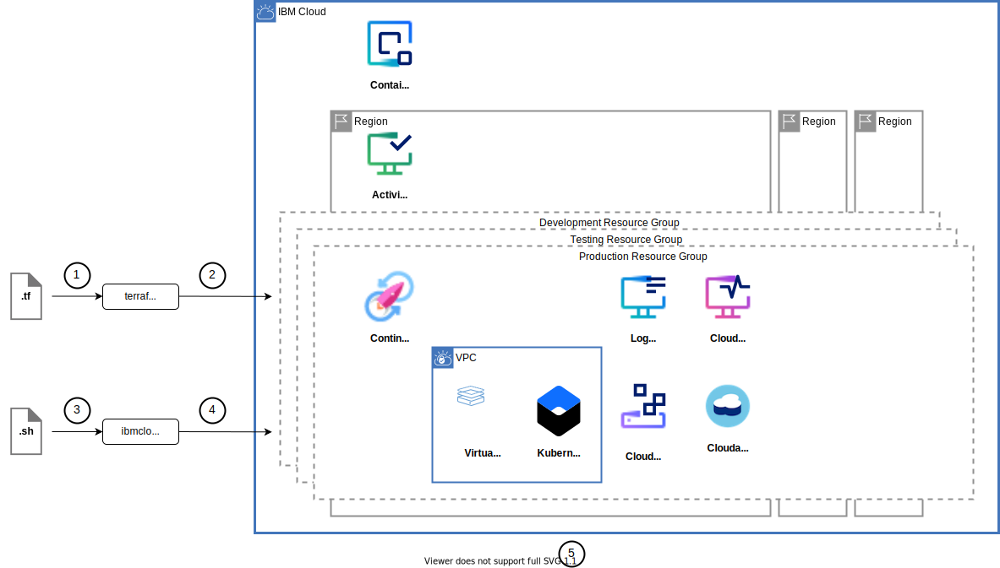
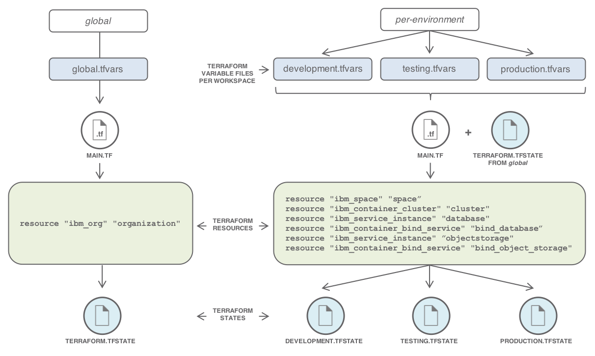

{:step: data-tutorial-type='step'}
{:java: #java .ph data-hd-programlang='java'}
{:swift: #swift .ph data-hd-programlang='swift'}
{:ios: #ios data-hd-operatingsystem="ios"}
{:android: #android data-hd-operatingsystem="android"}
{:shortdesc: .shortdesc}
{:new_window: target="_blank"}
{:codeblock: .codeblock}
{:screen: .screen}
{:tip: .tip}
{:pre: .pre}

# Plan, create and update deployment environments
{: #plan-create-update-deployments}
{: toc-content-type="tutorial"}
{: toc-services="containers, virtual-servers, cloud-object-storage, Cloudant, terraform, activity-tracker, monitoring"}
{: toc-completion-time="2h"}

<!--##istutorial#-->
This tutorial may incur costs. Use the [Cost Estimator](https://{DomainName}/estimator/review) to generate a cost estimate based on your projected usage.
{: tip}

<!--#/istutorial#-->

Multiple deployment environments are common when building a solution. They reflect the lifecycle of a project from development to production. This tutorial introduces tools like the {{site.data.keyword.cloud_notm}} CLI and [Terraform](https://www.terraform.io/) to automate the creation and maintenance of these deployment environments.
{: shortdesc}

Developers do not like to write the same thing twice. The [DRY](https://en.wikipedia.org/wiki/Don%27t_repeat_yourself) principle is one example of this. Similarly they don't like having to go through tons of clicks in a user interface to setup an environment. Consequently shell scripts have been long used by system administrators and developers to automate repetitive, error-prone and uninteresting tasks.

Infrastructure as a Service (IaaS), Platform as a Service (PaaS), Container as a Service (CaaS), Functions as a Service (FaaS) have given developers a high level of abstraction and it became easier to acquire resources like bare metal servers, managed databases, virtual machines, Kubernetes clusters, etc. But once you have provisioned these resources, you need to connect them together, to configure user access, to update the configuration over time, etc. Being able to automate all these steps and to repeat the installation, configuration under different environments is a must-have these days.

Multiple environments are pretty common in a project to support the different phases of the development cycle with slight differences between the environments like capacity, networking, credentials, log verbosity. In [this other tutorial, we've introduced best practices to organize users, teams and applications](https://{DomainName}/docs/solution-tutorials?topic=solution-tutorials-users-teams-applications#users-teams-applications) and a sample scenario. The sample scenario considers three environments, *Development*, *Testing* and *Production*. How to automate the creation of these environments? What tools could be used?

## Objectives
{: #plan-create-update-deployments-objectives}

* Define a set of environments to deploy
* Write scripts using the {{site.data.keyword.cloud_notm}} CLI and Terraform to automate the deployment of these environments
* Deploy these environments in your account


{: caption="Architecture diagram" caption-side="bottom" class="center" }


1. A set of Terraform files are created to describe the target infrastructure as code.
2. An operator uses `terraform apply` to provision the environments.
3. Shell scripts are written to complete the configuration of the environments.
4. The operator runs the scripts against the environments.
5. The environments are fully configured, ready to be used.

## Overview of the available tools
{: #plan-create-update-deployments-tools}
{: step}

All of the operations will be done in a `bash` shell and making use of `terraform` and `ibmcloud` commands. You will find instructions to download and install these tools for your operating environment in the [Getting started with tutorials](/docs/solution-tutorials?topic=solution-tutorials-tutorials) guide.

To avoid the installation of these tools you can use the [{{site.data.keyword.cloud-shell_short}}](https://{DomainName}/shell) from the {{site.data.keyword.cloud_notm}} console.

With `ibmcloud` and its plugins, you can automate the creation and configuration of your cloud resources. {{site.data.keyword.virtualmachinesshort}}, Kubernetes clusters, {{site.data.keyword.openwhisk_short}}, {{site.data.keyword.codeengineshort}}, and services, you can provision all of them from the command line.

Terraform enables you to safely and predictably create, change, and improve infrastructure. It is an open source tool that codifies APIs into declarative configuration files that can be shared amongst team members, treated as code, edited, reviewed, and versioned. It is infrastructure as code. You write down what your infrastructure should look like and Terraform will create, update, remove cloud resources as needed.

To support a multi-cloud approach, Terraform works with providers. A provider is responsible for understanding API interactions and exposing resources. {{site.data.keyword.cloud_notm}} has [its provider for Terraform](https://registry.terraform.io/providers/IBM-Cloud/ibm/latest/docs), enabling users of {{site.data.keyword.cloud_notm}} to manage resources with Terraform. Although Terraform is categorized as infrastructure as code, it is not limited to Infrastructure-As-A-Service resources. The {{site.data.keyword.cloud_notm}} Provider for Terraform supports IaaS (bare metal, virtual machine, network services, etc.), CaaS ({{site.data.keyword.containershort_notm}} and Kubernetes clusters), PaaS services, and serverless ({{site.data.keyword.openwhisk_short}} and {{site.data.keyword.codeengineshort}}) resources.

## Write scripts to automate the deployment
{: #plan-create-update-deployments-scripts}
{: step}

As you start describing your infrastructure-as-code, it is critical to treat files you create as regular code. Thus, store them in a source control management system. Over time this will bring benefits such as using the source control review workflow to validate changes and continuous integration to automatically deploy infrastructure changes.

[This Git repository](https://github.com/IBM-Cloud/multiple-environments-as-code) has all the configuration files needed to set up the environments defined earlier. You can clone the repository to follow the next sections detailing the content of the files.

   ```sh
   git clone https://github.com/IBM-Cloud/multiple-environments-as-code
   ```
   {: codeblock}

The repository is structured as follow:

| Directory | Description |
| ----------------- | ----------- |
| [terraform](https://github.com/IBM-Cloud/multiple-environments-as-code/tree/master/terraform) | Home for the Terraform files |
| [terraform/global](https://github.com/IBM-Cloud/multiple-environments-as-code/tree/master/terraform/global) | Terraform files to provision resources common to the three environments |
| [terraform/per-environment](https://github.com/IBM-Cloud/multiple-environments-as-code/tree/master/terraform/per-environment) | Terraform files specific to a given environment |
| [terraform/roles](https://github.com/IBM-Cloud/multiple-environments-as-code/tree/master/terraform/roles) | Terraform files to configure user policies |
{: caption="List of folders in the repository and their description" caption-side="bottom"}

### Heavy lifting with Terraform
{: #plan-create-update-deployments-3}

The *Development*, *Testing* and *Production* environments pretty much look the same. 

{: caption="One environment deployed into a resource group" caption-side="bottom" class="center" }


They all share the same type of resources, but differ by the allocated capacity and the access rights. For this tutorial, only a VSI will be deployed in each environment, no cluster will be deployed. The Terraform files reflect this with a ***global*** configuration to provision common resources and a ***per-environment*** configuration, using Terraform workspaces, to provision the environment-specific resources:


{: caption="Using Terraform workspaces" caption-side="bottom"}
{: style="text-align: center;"}

### Global Configuration
{: #plan-create-update-deployments-4}

Under the [terraform/global](https://github.com/IBM-Cloud/multiple-environments-as-code/tree/master/terraform/global) directory, you find the Terraform scripts to provision common resources. It could be an instance of {{site.data.keyword.atracker_full_notm}} (this tutorial won't create such instance). To illustrate what could be done, the file [main.tf](https://github.com/IBM-Cloud/multiple-environments-as-code/blob/master/terraform/global/main.tf) contains the readout of the account ID:

```sh
data "ibm_iam_account_settings" "iam_account_settings" {
}
```
{: codeblock}

To fully deploy the environments, you will use a mix of Terraform and the {{site.data.keyword.cloud_notm}} CLI. Shell scripts written with the CLI may need to reference the account ID or region. The *global* directory also includes [outputs.tf](https://github.com/IBM-Cloud/multiple-environments-as-code/blob/master/terraform/global/outputs.tf) which will produce a file containing this information as keys/values suitable to be reused in scripting:

```sh
# generate a property file suitable for shell scripts with useful variables relating to the environment
resource "local_file" "output" {
content = <<EOF
     ACCOUNT_ID=${data.ibm_iam_account_settings.iam_account_settings.account_id}
     REGION=${var.region}
EOF
filename = "../outputs/global.env"
}
```
{: codeblock}

### Individual Environments
{: #plan-create-update-deployments-5}

There are different approaches to manage multiple environments with Terraform. You could duplicate the Terraform files under separate directories, one directory per environment. With [Terraform modules](https://www.terraform.io/docs/modules/index.html), you could put together common configurations as a group and reuse modules across environments - reducing the code duplication. Separate directories mean you can modify the *development* environment to validate changes and then propagate the changes to other environments. It is common in this case to also have the Terraform *modules* in their own source code repository, so that you can reference a specific version of a module in your environment files.

Given the environments are rather simple and similar, you are going to use another Terraform concept called [workspaces](https://www.terraform.io/docs/state/workspaces.html#when-to-use-multiple-workspaces). Workspaces allow you to use the same terraform files (.tf) with different environments. In the example, *development*, *testing* and *production* are workspaces. They will use the same Terraform definitions but with different configuration variables (different names, different capacities).

Each environment requires:
* a dedicated resource group
* a vpc and subnet
* a virtual server with floating IP address
* a database
* a file storage

To access information from the global configuration, you can utilize [Terraform remote state](https://www.terraform.io/docs/state/remote.html). It allows the reference of an existing Terraform state in read-only mode. This is a very useful construct to split your Terraform configuration in smaller pieces, leaving the responsibility of individual parts to different teams. [backend.tf](https://github.com/IBM-Cloud/multiple-environments-as-code/blob/master/terraform/per-environment/backend.tf) contains the definition of the *global* remote state used to find the organization created earlier:

```sh
data "terraform_remote_state" "global" {
   backend = "local"

   config {
      path = "${path.module}/../global/terraform.tfstate"
   }
}
```
{: codeblock}


Setting up a deployment environment begins with creating a resource group. Its name is taken from an environment variable:

```sh
# a resource group
resource "ibm_resource_group" "group" {
   name     = "${var.environment_name}"
}
```
{: codeblock}

The VPC is created in that resource group. The VPC is named after the deployment environment.

```sh
resource "ibm_is_vpc" "vpc1" {
   name              = var.environment_name
   resource_group    = ibm_resource_group.group.id
}
```
{: codeblock}


After the VPC and its network, the VSI is created. Most of the properties will be initialized from configuration variables. You can adjust the zone, the machine profile and image type, etc.

```sh
resource "ibm_is_instance" "vsi1" {
   name           = "${var.environment_name}-vsi1"
   vpc            = ibm_is_vpc.vpc1.id
   zone           = "${var.region}-1"
   profile        = "cx2-2x4"
   image          = data.ibm_is_image.vsi_image.id
   keys           = [ibm_is_ssh_key.generated_key.id]
   resource_group = ibm_resource_group.group.id
  
   primary_network_interface {
      subnet = ibm_is_subnet.subnet11.id
   }
}
```
{: codeblock}

The SSH key to access the VSI is generated, too. The private key part of this SSH key is written to the output directory and can be used later on to connect to the VSI.

IAM-enabled services like {{site.data.keyword.cos_full_notm}} and {{site.data.keyword.cloudant_short_notm}} are also created as resources within the group:

```sh
# a database
resource "ibm_resource_instance" "database" {
   name              = "database"
   service           = "cloudantnosqldb"
   plan              = "${var.cloudantnosqldb_plan}"
   location          = "${var.cloudantnosqldb_location}"
   resource_group_id = "${ibm_resource_group.group.id}"
}

# a cloud object storage
resource "ibm_resource_instance" "objectstorage" {
   name              = "objectstorage"
   service           = "cloud-object-storage"
   plan              = "${var.cloudobjectstorage_plan}"
   location          = "${var.cloudobjectstorage_location}"
   resource_group_id = "${ibm_resource_group.group.id}"
}
```
{: codeblock}

## Deploy this environment in your account
{: #plan-create-update-deployments-0}
{: step}

### Create a local working environment
{: #plan-create-update-deployments-create}
{: step}

All of the operations will be done in a `bash` shell and making use of `terraform` and `ibmcloud` command. You will find instructions to download and install these tools for your operating environment in the [Getting started with tutorials](/docs/solution-tutorials?topic=solution-tutorials-tutorials) guide.

To avoid the installation of these tools you can use the [{{site.data.keyword.cloud-shell_short}}](https://{DomainName}/shell) from the {{site.data.keyword.cloud_notm}} console.
{: tip}

### Get the code
{: #plan-create-update-deployments-9}

If you have not done it yet, clone the tutorial repository:

```sh
git clone https://github.com/IBM-Cloud/multiple-environments-as-code
```
{: codeblock}

### Set Platform API key
{: #plan-create-update-deployments-10}

1. If you don't already have one, obtain a [Platform API key](https://{DomainName}/iam/apikeys) and save the API key for future reference.

1. Copy [terraform/credentials.tfvars.tmpl](https://github.com/IBM-Cloud/multiple-environments-as-code/blob/master/terraform/credentials.tfvars.tmpl) to *terraform/credentials.tfvars* by running the below command:
   ```sh
   cp terraform/credentials.tfvars.tmpl terraform/credentials.tfvars
   ```
   {: codeblock}

1. Edit `terraform/credentials.tfvars` and set the value for `ibmcloud_api_key` to the Platform API key you obtained.

### Create the global resources
{: #plan-create-update-deployments-11}

1. Change to the `terraform/global` directory

1. Initialize Terraform from the `terraform/global` folder
   ```sh
   terraform init
   ```
   {: codeblock}

1. Look at the Terraform plan
   ```sh
   terraform plan -var-file=../credentials.tfvars
   ```
   {: codeblock}

1. Apply the changes
   ```sh
   terraform apply -var-file=../credentials.tfvars
   ```
   {: codeblock}

Once Terraform completes, it will have created:
* a `global.env` file under the `outputs` directory in your checkout. This file has some environment variables you could reference in other scripts,
* the `terraform.tfstate` file.


This tutorial uses the `local` backend provider for Terraform state. It is handy when discovering Terraform or working alone on a project, but when working in a team, or on larger infrastructure, Terraform also supports saving the state to a remote location. Given the Terraform state is critical to Terraform operations, it is recommended to use a remote, highly available, resilient storage for the Terraform state  Refer to [Terraform Backend Types](https://www.terraform.io/docs/backends/types/index.html) for a list of available options. Some backends even support versioning and locking of Terraform states.
{: tip}

### Create per-environment resources
{: #plan-create-update-deployments-14}

This section will focus on the `development` environment. The steps will be the same for the other environments, only the values you pick for the variables will differ.

1. Change to the `terraform/per-environment` folder of the checkout
1. Copy the template `tfvars` file. There is one per environment:
   ```sh
   cp development.tfvars.tmpl development.tfvars
   cp testing.tfvars.tmpl testing.tfvars
   cp production.tfvars.tmpl production.tfvars
   ```
   {: codeblock}

1. Edit `development.tfvars`
   1. Set **environment_name** to the name of the deployment you want to create. Some of the resources will use it as name prefix.
   1. Set **network_zones** to the zone where you want to create the VPC subnet and VSI. Find the available zones with:
      ```sh
      ibmcloud is zones
      ```
      {: codeblock}

   1. See the comments in the tfvars file for help initializing the rest of the values

1. Initialize Terraform
   ```sh
   terraform init
   ```
   {: codeblock}

1. Create a new Terraform workspace for the *development* environment
   ```sh
   terraform workspace new development
   ```
   {: codeblock}

   Later to switch between environments use
   ```sh
   terraform workspace select development
   ```
   {: codeblock}

1. Look at the Terraform plan
   ```sh
   terraform plan -var-file=../credentials.tfvars -var-file=development.tfvars
   ```
   {: codeblock}

   It should report (with **NN** being the number of resources to be added):
   ```sh
   Plan: NN to add, 0 to change, 0 to destroy.
   ```
   {: screen}

1. Apply the changes
   ```sh
   terraform apply -var-file=../credentials.tfvars -var-file=development.tfvars
   ```
   {: codeblock}

Once Terraform completes, it will have created:
* a resource group,
* a vpc and a subnet,
* a public / private key pair for ssh access,
* a VSI with a floating IP address,
* a rule for the default security group to allow ssh access,
* a database,
* a Cloud Object Storage instance,
* a logging instance,
* a monitoring instance,
* a `development.env` file under the `outputs` directory in your checkout. This file has environment variables you could reference in other scripts.
* a file `development_generated_private_key.pem` under the `outputs` directory, holding the private key.
* the environment specific `terraform.tfstate` under `terraform.tfstate.d/development`.

Test your deployment by connection to the provisioned VSI. Use the generated key as identity file. You find the IP address in the file `development.env`.
   ```sh
   ssh -i ../outputs/development_generated_private_key.pem root@IP_ADDRESS
   ```
   {: codeblock}


You can repeat the steps for `testing` and `production`.

### To reuse an existing resource group
{: #plan-create-update-deployments-15}

Instead of creating a new resource group, you can import an existing resource group into Terraform

1. Retrieve the resource group ID
   ```sh
   ibmcloud resource group <resource_group_name> --id
   ```
   {: codeblock}

1. Change to the `terraform/per-environment` folder of the checkout
1. Copy the template `tfvars` file. There is one per environment:
   ```sh
   cp development.tfvars.tmpl development.tfvars
   cp testing.tfvars.tmpl testing.tfvars
   cp production.tfvars.tmpl production.tfvars
   ```
   {: codeblock}

1. Initialize Terraform
   ```sh
   terraform init
   ```
   {: codeblock}

1. Create a new Terraform workspace for the *development* environment
   ```sh
   terraform workspace new development
   ```
   {: codeblock}

   Later to switch between environments use
   ```sh
   terraform workspace select development
   ```
   {: codeblock}

1. After initializing Terraform, import the resource group into the Terraform state
    ```sh
    terraform import -var-file=../credentials.tfvars -var-file=development.tfvars ibm_resource_group.group <id>
    ```
    {: codeblock}

1. Tune `development.tfvars` to match the existing resource group name and structure
1. Apply the changes
   ```sh
   terraform apply -var-file=../credentials.tfvars -var-file=development.tfvars
   ```
   {: codeblock}

You can repeat the steps for `testing` and `production`.

### Assign user policies
{: #plan-create-update-deployments-16}

For user policies on resources like the deployed services or a possible Kubernetes clusters, you will be using the [roles](https://github.com/IBM-Cloud/multiple-environments-as-code/tree/master/terraform/roles) folder in the cloned repo.

For the *Development* environment as discussed in [this tutorial](https://{DomainName}/docs/solution-tutorials?topic=solution-tutorials-users-teams-applications#users-teams-applications), the policies to define are:

|           | IAM Access policies |
| --------- | ----------- |
| Developer | - Resource Group: *Viewer* \n - Platform Access Roles in the Resource Group: *Viewer* \n - Logging & Monitoring service role: *Administrator* |
| Tester    | - No configuration needed. Tester accesses the deployed application, not the development environments |
| Operator  | - Resource Group: *Viewer* \n - Platform Access Roles in the Resource Group: *Operator*, *Viewer* \n - Logging & Monitoring service role: *Writer* |
| Pipeline Service ID | - Resource Group: *Viewer* \n - Platform Access Roles in the Resource Group: *Editor*, *Viewer* |
{: caption="IAM policies for the Development environment" caption-side="bottom"}

Given a team may be composed of several developers, testers, you can leverage the [access group concept](https://{DomainName}/docs/account?topic=account-groups#groups) to simplify the configuration of user policies. Access groups can be created by the account owner so that the same access can be assigned to all entities within the group with a single policy.

For the *Developer* role in the *Development* environment, this translates to:

```sh
resource "ibm_iam_access_group" "developer_role" {
   name        = var.access_group_name_developer_role
   description = var.access_group_description
}

resource "ibm_iam_access_group_policy" "resourcepolicy_developer" {
   access_group_id = ibm_iam_access_group.developer_role.id
   roles           = ["Viewer"]

   resources {
     resource_type = "resource-group"
     resource      = data.terraform_remote_state.per_environment_dev.outputs.resource_group_id
   }
}

resource "ibm_iam_access_group_policy" "developer_platform_accesspolicy" {
   access_group_id = ibm_iam_access_group.developer_role.id
   roles           = ["Viewer"]

   resources {
     resource_group_id = data.terraform_remote_state.per_environment_dev.outputs.resource_group_id
   }
}

resource "ibm_iam_access_group_policy" "developer_logging_policy" {
   access_group_id = ibm_iam_access_group.developer_role.id
   roles           = ["Administrator"]

   resources {
     service              = "logdna"
     resource_instance_id = data.terraform_remote_state.per_environment_dev.outputs.logdna_instance_id
   }
}

resource "ibm_iam_access_group_policy" "developer_monitoring_policy" {
   access_group_id = ibm_iam_access_group.developer_role.id
   roles           = ["Writer"]

   resources {
     service              = "sysdig-monitor"
     resource_instance_id = data.terraform_remote_state.per_environment_dev.outputs.sysdig_instance_id
   }
}

resource "ibm_iam_access_group_members" "developers" {
   access_group_id = ibm_iam_access_group.developer_role.id
   ibm_ids         = var.iam_access_members_developers
}

```
{: codeblock}


The [roles/development/main.tf](https://github.com/IBM-Cloud/multiple-environments-as-code/blob/master/terraform/roles/development/main.tf) file of the checkout has examples of these resources for the defined *Developer*, *Operator* , *tester*, and *Service ID* roles. To set the policies as defined in a previous section for the users with the *Developer, Operator, Tester and Function user* roles in the *development* environment,

1. Change to the `terraform/roles/development` directory
2. Copy the template `tfvars` file. There is one per environment (you can find the `production` and `testing` templates under their respective folders in `roles` directory)

   ```sh
   cp development.tfvars.tmpl development.tfvars
   ```
   {: codeblock}

3. Edit `development.tfvars`

   - Set **iam_access_members_developers** to the list of developers to whom you would like to grant the access.
   - Set **iam_access_members_operators** to the list of operators and so on.
4. Initialize Terraform
   ```sh
   terraform init
   ```
   {: codeblock}

5. Look at the Terraform plan
   ```sh
   terraform plan -var-file=../../credentials.tfvars -var-file=development.tfvars
   ```
   {: codeblock}

   It should report:
   ```sh
   Plan: 15 to add, 0 to change, 0 to destroy.
   ```
   {: screen}

6. Apply the changes
   ```sh
   terraform apply -var-file=../../credentials.tfvars -var-file=development.tfvars
   ```
   {: codeblock}

You can repeat the steps for `testing` and `production`.

## Remove resources
{: #plan-create-update-deployments-17}
{: step}

1. Change to the `terraform/roles/development` directory
1. Destroy the access groups and access policies
   ```sh
   terraform destroy -var-file=../../credentials.tfvars -var-file=development.tfvars
   ```
   {: codeblock}

1. Change to the `terraform/per-environment` folder of the checkout
1. Activate the `development` workspace
   ```sh
   terraform workspace select development
   ```
   {: codeblock}
   
1. Destroy the resource group, spaces, services, clusters
   ```sh
   terraform destroy -var-file=../credentials.tfvars -var-file=development.tfvars
   ```
   {: codeblock}

    `terraform destroy` only removes the terraform state information related to a resource group as a resource group cannot be deleted by a user.
    {: tip}
    
1. Repeat the steps for the `testing` and `production` workspaces
1. If you created it, destroy the organization.  Change to the `terraform/global` directory.
   ```sh
   terraform destroy -var-file=../credentials.tfvars
   ```
   {: codeblock}

Depending on the resource it might not be deleted immediately, but retained (by default for 7 days). You can reclaim the resource by deleting it permanently or restore it within the retention period. See this document on how to [use resource reclamation](https://{DomainName}/docs/account?topic=account-resource-reclamation).
{: tip}

## Related content
{: #plan-create-update-deployments-18}

* [Tutorial with Terraform: PHP web application on a LAMP Stack in VPC](https://{DomainName}/docs/solution-tutorials?topic=solution-tutorials-lamp-stack-on-vpc)
* [Getting started with Terraform on {{site.data.keyword.cloud_notm}}](https://{DomainName}/docs/ibm-cloud-provider-for-terraform?topic=ibm-cloud-provider-for-terraform-getting-started)
* [Examples using {{site.data.keyword.cloud_notm}} Provider for Terraform](https://github.com/IBM-Cloud/terraform-provider-ibm/tree/master/examples)
