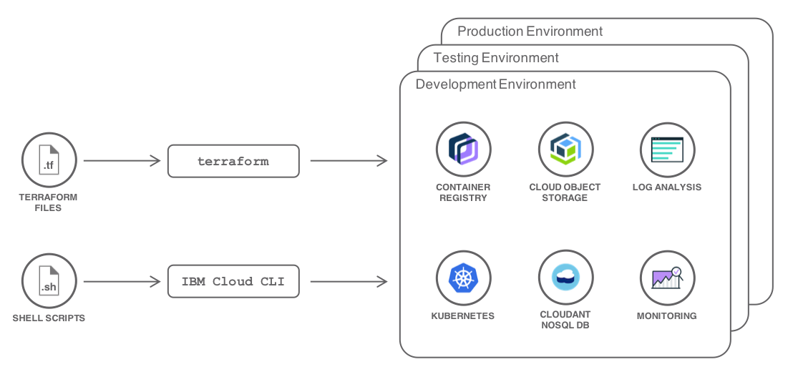
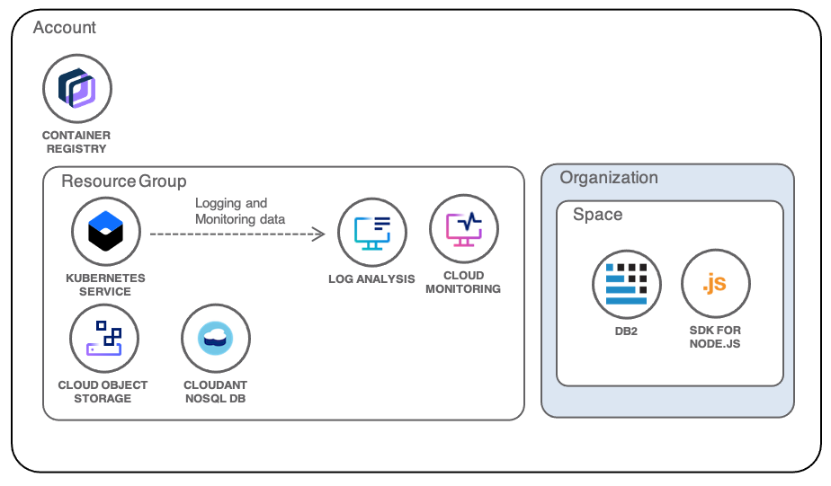

{:step: data-tutorial-type='step'}
{:java: #java .ph data-hd-programlang='java'}
{:swift: #swift .ph data-hd-programlang='swift'}
{:ios: #ios data-hd-operatingsystem="ios"}
{:android: #android data-hd-operatingsystem="android"}
{:shortdesc: .shortdesc}
{:new_window: target="_blank"}
{:codeblock: .codeblock}
{:screen: .screen}
{:tip: .tip}
{:pre: .pre}

# Plan, create and update deployment environments
{: #plan-create-update-deployments}
{: toc-content-type="tutorial"}
{: toc-services="containers, cloud-foundry-public, virtual-servers, cloud-object-storage, Cloudant, terraform, Activity-Tracker-with-LogDNA, Monitoring-with-Sysdig"}
{: toc-completion-time="2h"}

<!--##istutorial#-->
This tutorial may incur costs. Use the [Cost Estimator](https://{DomainName}/estimator/review) to generate a cost estimate based on your projected usage.
{: tip}

<!--#/istutorial#-->

Multiple deployment environments are common when building a solution. They reflect the lifecycle of a project from development to production. This tutorial introduces tools like the {{site.data.keyword.Bluemix_notm}} CLI and [Terraform](https://www.terraform.io/) to automate the creation and maintenance of these deployment environments.
{: shortdesc}

Developers do not like to write the same thing twice. The [DRY](https://en.wikipedia.org/wiki/Don%27t_repeat_yourself) principle is one example of this. Similarly they don't like having to go through tons of clicks in a user interface to setup an environment. Consequently shell scripts have been long used by system administrators and developers to automate repetitive, error-prone and uninteresting tasks.

Infrastructure as a Service (IaaS), Platform as a Service (PaaS), Container as a Service (CaaS), Functions as a Service (FaaS) have given developers a high level of abstraction and it became easier to acquire resources like bare metal servers, managed databases, virtual machines, Kubernetes clusters, etc. But once you have provisioned these resources, you need to connect them together, to configure user access, to update the configuration over time, etc. Being able to automate all these steps and to repeat the installation, configuration under different environments is a must-have these days.

Multiple environments are pretty common in a project to support the different phases of the development cycle with slight differences between the environments like capacity, networking, credentials, log verbosity. In [this other tutorial](https://{DomainName}/docs/solution-tutorials?topic=solution-tutorials-users-teams-applications#users-teams-applications), we've introduced best practices to organize users, teams and applications and a sample scenario. The sample scenario considers three environments, *Development*, *Testing* and *Production*. How to automate the creation of these environments? What tools could be used?

## Objectives
{: #plan-create-update-deployments-objectives}

* Define a set of environments to deploy
* Write scripts using the {{site.data.keyword.Bluemix_notm}} CLI and [Terraform](https://www.terraform.io/) to automate the deployment of these environments
* Deploy these environments in your account


{: class="center"}
{: style="text-align: center;"}


1. A set of Terraform files are created to describe the target infrastructure as code.
2. An operator uses `terraform apply` to provision the environments.
3. Shell scripts are written to complete the configuration of the environments.
4. The operator runs the scripts against the environments
5. The environments are fully configured, ready to be used.

## Overview of the available tools
{: #plan-create-update-deployments-tools}
{: step}

All of the operations will be done in a `bash` shell and making use of `terraform` and `ibmcloud` command. You will find instructions to download and install these tools for your operating environment in the [Getting started with tutorials](/docs/solution-tutorials?topic=solution-tutorials-tutorials) guide.

To avoid the installation of these tools you can use the [{{site.data.keyword.cloud-shell_short}}](https://{DomainName}/shell) from the {{site.data.keyword.cloud_notm}} console.

With `ibmcloud` and its plugins, you can automate the creation and configuration of your cloud resources. {{site.data.keyword.virtualmachinesshort}}, Kubernetes clusters, {{site.data.keyword.openwhisk_short}}, Cloud Foundry apps and services, you can provision all of them from the command line.

Terraform enables you to safely and predictably create, change, and improve infrastructure. It is an open source tool that codifies APIs into declarative configuration files that can be shared amongst team members, treated as code, edited, reviewed, and versioned.  It is infrastructure as code. You write down what your infrastructure should look like and Terraform will create, update, remove cloud resources as needed.

To support a multi-cloud approach, Terraform works with providers. A provider is responsible for understanding API interactions and exposing resources. {{site.data.keyword.Bluemix_notm}} has [its provider for Terraform](https://github.com/IBM-Cloud/terraform-provider-ibm) enabling users of {{site.data.keyword.Bluemix_notm}} to manage resources with Terraform. Although Terraform is categorized as infrastructure as code, it is not limited to Infrastructure-As-A-Service resources. The {{site.data.keyword.Bluemix_notm}} Provider for Terraform supports IaaS (bare metal, virtual machine, network services, etc.), CaaS ({{site.data.keyword.containershort_notm}} and Kubernetes clusters), PaaS (Cloud Foundry and services) and FaaS ({{site.data.keyword.openwhisk_short}}) resources.

## Write scripts to automate the deployment
{: #plan-create-update-deployments-scripts}
{: step}

As you start describing your infrastructure-as-code, it is critical to treat files you create as regular code, thus storing them in a source control management system. Overtime this will bring good properties such as using the source control review workflow to validate changes and continuous integration to automatically deploy infrastructure changes.

[This Git repository](https://github.com/IBM-Cloud/multiple-environments-as-code) has all the configuration files needed to setup the environments defined earlier. You can clone the repository to follow the next sections detailing the content of the files.

   ```sh
   git clone https://github.com/IBM-Cloud/multiple-environments-as-code
   ```
   {: codeblock}

The repository is structured as follow:

| Directory | Description |
| ----------------- | ----------- |
| [terraform](https://github.com/IBM-Cloud/multiple-environments-as-code/tree/master/terraform) | Home for the Terraform files |
| [terraform/global](https://github.com/IBM-Cloud/multiple-environments-as-code/tree/master/terraform/global) | Terraform files to provision resources common to the three environments |
| [terraform/per-environment](https://github.com/IBM-Cloud/multiple-environments-as-code/tree/master/terraform/per-environment) | Terraform files specific to a given environment |
| [terraform/roles](https://github.com/IBM-Cloud/multiple-environments-as-code/tree/master/terraform/roles) | Terraform files to configure user policies |

### Heavy lifting with Terraform
{: #plan-create-update-deployments-3}

The *Development*, *Testing* and *Production* environments pretty much look the same.



They share a common organization and environment-specific resources. They will differ by the allocated capacity and the access rights. The terraform files reflect this with a ***global*** configuration to provision the Cloud Foundry organization and a ***per-environment*** configuration, using Terraform workspaces, to provision the environment-specific resources:

{: class="center"}
{: style="text-align: center;"}

### Global Configuration
{: #plan-create-update-deployments-4}

All environments share a common Cloud Foundry organization and each environment has its own space.

Under the [terraform/global](https://github.com/IBM-Cloud/multiple-environments-as-code/tree/master/terraform/global) directory, you find the Terraform scripts to provision this organization. [main.tf](https://github.com/IBM-Cloud/multiple-environments-as-code/blob/master/terraform/global/main.tf) contains the definition for the organization:

   ```sh
   # create a new organization for the project
   resource "ibm_org" "organization" {
     name             = "${var.org_name}"
     managers         = "${var.org_managers}"
     users            = "${var.org_users}"
     auditors         = "${var.org_auditors}"
     billing_managers = "${var.org_billing_managers}"
   }
   ```

In this resource, all properties are configured through variables. In the next sections, you will learn how to set these variables.

To fully deploy the environments, you will use a mix of Terraform and the {{site.data.keyword.Bluemix_notm}} CLI. Shell scripts written with the CLI may need to reference this organization or the account by name or ID. The *global* directory also includes [outputs.tf](https://github.com/IBM-Cloud/multiple-environments-as-code/blob/master/terraform/global/outputs.tf) which will produce a file containing this information as keys/values suitable to be reused in scripting:

   ```sh
   # generate a property file suitable for shell scripts with useful variables relating to the environment
   resource "local_file" "output" {
     content = <<EOF
ACCOUNT_GUID=${data.ibm_account.account.id}
ORG_GUID=${ibm_org.organization.id}
ORG_NAME=${var.org_name}
EOF

     filename = "../outputs/global.env"
   }
   ```

### Individual Environments
{: #plan-create-update-deployments-5}

There are different approaches to manage multiple environments with Terraform. You could duplicate the Terraform files under separate directories, one directory per environment. With [Terraform modules](https://www.terraform.io/docs/modules/index.html) you could put together common configuration as a group and reuse modules across environments - reducing the code duplication. Separate directories mean you can modify the *development* environment to validate changes and then propagate the changes to other environments. It is common in this case to also have the Terraform *modules* in their own source code repository so that you can reference a specific version of a module in your environment files.

Given the environments are rather simple and similar, you are going to use another Terraform concept called [workspaces](https://www.terraform.io/docs/state/workspaces.html#when-to-use-multiple-workspaces). Workspaces allow you to use the same terraform files (.tf) with different environments. In the example, *development*, *testing* and *production* are workspaces. They will use the same Terraform definitions but with different configuration variables (different names, different capacities).

Each environment requires:
* a dedicated Cloud Foundry space
* a dedicated resource group
* a vpc and subnet
* a Kubernetes cluster
* a database
* a file storage

The Cloud Foundry space is linked to the organization created in the previous step. The environment Terraform files need to reference this organization. This is where [Terraform remote state](https://www.terraform.io/docs/state/remote.html) will help. It allows the reference of an existing Terraform state in read-only mode. This is a very useful construct to split your Terraform configuration in smaller pieces leaving the responsibility of individual pieces to different teams. [backend.tf](https://github.com/IBM-Cloud/multiple-environments-as-code/blob/master/terraform/per-environment/backend.tf) contains the definition of the *global* remote state used to find the organization created earlier:

   ```sh
   data "terraform_remote_state" "global" {
      backend = "local"

      config {
        path = "${path.module}/../global/terraform.tfstate"
      }
   }
   ```

Once you can reference the organization, it is straightforward to create a space within this organization. [main.tf](https://github.com/IBM-Cloud/multiple-environments-as-code/blob/master/terraform/per-environment/main.tf) contains the definition of the resources for the environment.

   ```sh
   # a Cloud Foundry space per environment
   resource "ibm_space" "space" {
     name       = "${var.environment_name}"
     org        = "${data.terraform_remote_state.global.org_name}"
     managers   = "${var.space_managers}"
     auditors   = "${var.space_auditors}"
     developers = "${var.space_developers}"
   }
   ```

Notice how the organization name is referenced from the *global* remote state. The other properties are taken from configuration variables.

Next comes the resource group.

   ```sh
   # a resource group
   resource "ibm_resource_group" "group" {
    name     = "${var.environment_name}"
    quota_id = "${data.ibm_resource_quota.quota.id}"
}

   data "ibm_resource_quota" "quota" {
	name = "${var.resource_quota}"
}
   ```

The Kubernetes cluster is created in this resource group. The {{site.data.keyword.Bluemix_notm}} provider has a Terraform resource to represent a cluster:

   ```sh
# a cluster
resource "ibm_container_vpc_cluster" "cluster" {
  name              = "${var.environment_name}-cluster"
  vpc_id            = ibm_is_vpc.vpc1.id
  kube_version      = "1.19"
  flavor            = var.cluster_machine_type
  worker_count      = var.worker_num
  resource_group_id = ibm_resource_group.group.id

  zones {
    subnet_id = ibm_is_subnet.subnet11.id
    name      = var.cluster_datacenter
  }
}
   ```

Again most of the properties will be initialized from configuration variables. You can adjust the datacenter, the number of workers, the type of workers.

IAM-enabled services like {{site.data.keyword.cos_full_notm}} and {{site.data.keyword.cloudant_short_notm}} are also created as resources within the group:

   ```sh
# a database
resource "ibm_resource_instance" "database" {
    name              = "database"
    service           = "cloudantnosqldb"
    plan              = "${var.cloudantnosqldb_plan}"
    location          = "${var.cloudantnosqldb_location}"
    resource_group_id = "${ibm_resource_group.group.id}"
}
# a cloud object storage
resource "ibm_resource_instance" "objectstorage" {
    name              = "objectstorage"
    service           = "cloud-object-storage"
    plan              = "${var.cloudobjectstorage_plan}"
    location          = "${var.cloudobjectstorage_location}"
    resource_group_id = "${ibm_resource_group.group.id}"
}
   ```

Kubernetes bindings (secrets) can be added to retrieve the service credentials from your applications:

   ```sh
   # bind the cloudant service to the cluster
   resource "ibm_container_bind_service" "bind_database" {
      cluster_name_id             = "${ibm_container_cluster.cluster.id}"
  	  service_instance_name       = "${ibm_resource_instance.database.name}"
      namespace_id                = "default"
      account_guid                = "${data.terraform_remote_state.global.account_guid}"
      org_guid                    = "${data.terraform_remote_state.global.org_guid}"
      space_guid                  = "${ibm_space.space.id}"
      resource_group_id           = "${ibm_resource_group.group.id}"
}

   # bind the cloud object storage service to the cluster
   resource "ibm_container_bind_service" "bind_objectstorage" {
  	cluster_name_id             = "${ibm_container_cluster.cluster.id}"
  	space_guid                  = "${ibm_space.space.id}"
  	service_instance_id         = "${ibm_resource_instance.objectstorage.name}"
  	namespace_id                = "default"
  	account_guid                = "${data.terraform_remote_state.global.account_guid}"
  	org_guid                    = "${data.terraform_remote_state.global.org_guid}"
  	space_guid                  = "${ibm_space.space.id}"
  	resource_group_id           = "${ibm_resource_group.group.id}"
}
   ```

## Deploy this environment in your account
{: #plan-create-update-deployments-0}
{: step}

## Create a local working environment
{: #plan-create-update-deployments-create}
{: step}

All of the operations will be done in a `bash` shell and making use of `terraform` and `ibmcloud` command. You will find instructions to download and install these tools for your operating environment in the [Getting started with tutorials](/docs/solution-tutorials?topic=solution-tutorials-tutorials) guide.

To avoid the installation of these tools you can use the [{{site.data.keyword.cloud-shell_short}}](https://{DomainName}/shell) from the {{site.data.keyword.cloud_notm}} console.
{: tip}

### Get the code
{: #plan-create-update-deployments-9}

If you have not done it yet, clone the tutorial repository:

   ```sh
   git clone https://github.com/IBM-Cloud/multiple-environments-as-code
   ```
   {: codeblock}

### Set Platform API key
{: #plan-create-update-deployments-10}

1. If you don't already have one, obtain a [Platform API key](https://{DomainName}/iam/apikeys) and save the API key for future reference.

   > If in later steps you plan on creating a new Cloud Foundry organization to host the deployment environments, make sure you are the owner of the account.
1. Copy [terraform/credentials.tfvars.tmpl](https://github.com/IBM-Cloud/multiple-environments-as-code/blob/master/terraform/credentials.tfvars.tmpl) to *terraform/credentials.tfvars* by running the below command
   ```sh
   cp terraform/credentials.tfvars.tmpl terraform/credentials.tfvars
   ```
   {: codeblock}

1. Edit `terraform/credentials.tfvars` and set the value for `ibmcloud_api_key` to the Platform API key you obtained.

### Create or reuse a Cloud Foundry organization
{: #plan-create-update-deployments-11}

You can choose either to create a new organization or to reuse (import) an existing one. To create the parent organization of the three deployment environments, **you need to be the account owner**.

#### To create a new organization
{: #plan-create-update-deployments-12}

1. Change to the `terraform/global` directory
1. Copy [global.tfvars.tmpl](https://github.com/IBM-Cloud/multiple-environments-as-code/blob/master/terraform/global/global.tfvars.tmpl) to `global.tfvars`
   ```sh
   cp global.tfvars.tmpl global.tfvars
   ```
   {: codeblock}

1. Edit `global.tfvars`
   1. Set **org_name** to the organization name to create
   1. Set **org_managers** to a list of user IDs you want to grant the *Manager* role in the org - the user creating the org is automatically a manager and should not be added to the list
   1. Set **org_users** to a list of all users you want to invite into the org - users need to be added there if you want to configure their access in further steps

   ```sh
   org_name = "a-new-organization"
   org_managers = [ "user1@domain.com", "another-user@anotherdomain.com" ]
   org_users = [ "user1@domain.com", "another-user@anotherdomain.com", "more-user@domain.com" ]
   ```
   {: codeblock}

1. Initialize Terraform from the `terraform/global` folder
   ```sh
   terraform init
   ```
   {: codeblock}

1. Look at the Terraform plan
   ```sh
   terraform plan -var-file=../credentials.tfvars -var-file=global.tfvars
   ```
   {: codeblock}

1. Apply the changes
   ```sh
   terraform apply -var-file=../credentials.tfvars -var-file=global.tfvars
   ```
   {: codeblock}

Once Terraform completes, it will have created:
* a new Cloud Foundry organization
* a `global.env` file under the `outputs` directory in your checkout. This file has environment variables you could reference in other scripts
* the `terraform.tfstate` file

> This tutorial uses the `local` backend provider for Terraform state. Handy when discovering Terraform or working alone on a project, but when working in a team, or on larger infrastructure, Terraform also supports saving the state to a remote location. Given the Terraform state is critical to Terraform operations, it is recommended to use a remote, highly available, resilient storage for the Terraform state  Refer to [Terraform Backend Types](https://www.terraform.io/docs/backends/types/index.html) for a list of available options. Some backends even support versioning and locking of Terraform states.

#### To reuse an organization you are managing
{: #plan-create-update-deployments-13}

If you are not the account owner but you manage an organization in the account, you can also import an existing organization into Terraform. Make sure to be in the region where the Cloud Foundry org exists.

1. Retrieve the organization GUID
   ```sh
   ibmcloud iam org <org_name> --guid
   ```
   {: codeblock}

1. Change to the `terraform/global` directory
1. Copy [global.tfvars.tmpl](https://github.com/IBM-Cloud/multiple-environments-as-code/blob/master/terraform/global/global.tfvars.tmpl) to `global.tfvars`
   ```sh
   cp global.tfvars.tmpl global.tfvars
   ```
   {: codeblock}

1. Initialize Terraform
   ```sh
   terraform init
   ```
   {: codeblock}

1. After initializing Terraform, import the organization into the Terraform state
   ```sh
   terraform import -var-file=../credentials.tfvars -var-file=global.tfvars ibm_org.organization <guid>
   ```
   {: codeblock}

1. Tune `global.tfvars` to match the existing organization name and structure. To keep the existing org managers and users, make sure to list them. Verify possible changes before applying them in the next step.
1. Apply the changes
   ```sh
   terraform apply -var-file=../credentials.tfvars -var-file=global.tfvars
   ```
   {: codeblock}

### Create per-environment space, cluster and services
{: #plan-create-update-deployments-14}

This section will focus on the `development` environment. The steps will be the same for the other environments, only the values you pick for the variables will differ.

1. Change to the `terraform/per-environment` folder of the checkout
1. Copy the template `tfvars` file. There is one per environment:
   ```sh
   cp development.tfvars.tmpl development.tfvars
   cp testing.tfvars.tmpl testing.tfvars
   cp production.tfvars.tmpl production.tfvars
   ```
   {: codeblock}

1. Edit `development.tfvars`
   1. Set **environment_name** to the name of the Cloud Foundry space you want to create
   1. Set **space_developers** to the list of developers for this space. **Make sure to add your name to the list so that Terraform can provision services on your behalf.**
   1. Set **cluster_datacenter** to the zone where you want to create the cluster. Find the available zones with:
      ```sh
      ibmcloud ks locations --provider vpc-gen2
      ```
      {: codeblock}

   1. Set the **cluster_machine_type**. Find the available flavors and characteristics for the zone with:
      ```sh
      ibmcloud ks flavors --zone <zone>
      ```
      {: codeblock}

   1. See the comments in the tfvars file for help initializing the rest of the values

1. Initialize Terraform
   ```sh
   terraform init
   ```
   {: codeblock}

1. Create a new Terraform workspace for the *development* environment
   ```sh
   terraform workspace new development
   ```
   {: codeblock}

   Later to switch between environments use
   ```sh
   terraform workspace select development
   ```
   {: codeblock}

1. Look at the Terraform plan
   ```sh
   terraform plan -var-file=../credentials.tfvars -var-file=development.tfvars
   ```
   {: codeblock}

   It should report (with **NN** being the number of resources to be added):
   ```sh
   Plan: NN to add, 0 to change, 0 to destroy.
   ```
   {: screen}

1. Apply the changes
   ```sh
   terraform apply -var-file=../credentials.tfvars -var-file=development.tfvars
   ```
   {: codeblock}

Once Terraform completes, it will have created:
* a resource group
* a Cloud Foundry space
* a vpc and a subnet
* a Kubernetes cluster with a worker pool
* a database
* a Kubernetes secret with the database credentials
* a Cloud Object Storage instance
* a Kubernetes secret with the Cloud Object Storage credentials
* a logging instance
* a monitoring instance
* a `development.env` file under the `outputs` directory in your checkout. This file has environment variables you could reference in other scripts
* the environment specific `terraform.tfstate` under `terraform.tfstate.d/development`.

You can repeat the steps for `testing` and `production`.

### To reuse an existing resource group
{: #plan-create-update-deployments-15}

Instead of creating a new resource group, you can import an existing resource group into Terraform

1. Retrieve the resource group ID
   ```sh
   ibmcloud resource group <resource_group_name> --id
   ```
   {: codeblock}

1. Change to the `terraform/per-environment` folder of the checkout
1. Copy the template `tfvars` file. There is one per environment:
   ```sh
   cp development.tfvars.tmpl development.tfvars
   cp testing.tfvars.tmpl testing.tfvars
   cp production.tfvars.tmpl production.tfvars
   ```
   {: codeblock}

1. Initialize Terraform
   ```sh
   terraform init
   ```
   {: codeblock}

1. Create a new Terraform workspace for the *development* environment
   ```sh
   terraform workspace new development
   ```
   {: codeblock}

   Later to switch between environments use
   ```sh
   terraform workspace select development
   ```
   {: codeblock}

1. After initializing Terraform, import the resource group into the Terraform state
    ```sh
    terraform import -var-file=../credentials.tfvars -var-file=development.tfvars ibm_resource_group.group <id>
    ```
    {: codeblock}

1. Tune `development.tfvars` to match the existing resource group name and structure
1. Apply the changes
   ```sh
   terraform apply -var-file=../credentials.tfvars -var-file=development.tfvars
   ```
   {: codeblock}

You can repeat the steps for `testing` and `production`.

### Assign user policies
{: #plan-create-update-deployments-16}

In the previous steps, roles in Cloud Foundry organization and spaces could be configured with the Terraform provider. For user policies on other resources like the Kubernetes clusters, you will be using the [roles](https://github.com/IBM-Cloud/multiple-environments-as-code/tree/master/terraform/roles) folder in the cloned repo.

For the *Development* environment as defined in [this tutorial](https://{DomainName}/docs/solution-tutorials?topic=solution-tutorials-users-teams-applications#users-teams-applications), the policies to define are:

|           | IAM Access policies |
| --------- | ----------- |
| Developer | - Resource Group: *Viewer* \n - Platform Access Roles in the Resource Group: *Viewer* \n - Logging & Monitoring service role: *Administrator* |
| Tester    | - No configuration needed. Tester accesses the deployed application, not the development environments |
| Operator  | - Resource Group: *Viewer* \n - Platform Access Roles in the Resource Group: *Operator*, *Viewer* \n - Logging & Monitoring service role: *Writer* |
| Pipeline Service ID | - Resource Group: *Viewer* \n - Platform Access Roles in the Resource Group: *Editor*, *Viewer* |

Given a team may be composed of several developers, testers, you can leverage the [access group concept](https://{DomainName}/docs/account?topic=account-groups#groups) to simplify the configuration of user policies. Access groups can be created by the account owner so that the same access can be assigned to all entities within the group with a single policy.

For the *Developer* role in the *Development* environment, this translates to:

   ```sh
resource "ibm_iam_access_group" "developer_role" {
  name        = var.access_group_name_developer_role
  description = var.access_group_description
}

resource "ibm_iam_access_group_policy" "resourcepolicy_developer" {
  access_group_id = ibm_iam_access_group.developer_role.id
  roles           = ["Viewer"]

  resources {
    resource_type = "resource-group"
    resource      = data.terraform_remote_state.per_environment_dev.outputs.resource_group_id
  }
}

resource "ibm_iam_access_group_policy" "developer_platform_accesspolicy" {
  access_group_id = ibm_iam_access_group.developer_role.id
  roles           = ["Viewer"]

  resources {
    resource_group_id = data.terraform_remote_state.per_environment_dev.outputs.resource_group_id
  }
}

resource "ibm_iam_access_group_policy" "developer_logging_policy" {
  access_group_id = ibm_iam_access_group.developer_role.id
  roles           = ["Administrator"]

  resources {
    service              = "logdna"
    resource_instance_id = data.terraform_remote_state.per_environment_dev.outputs.logdna_instance_id
  }
}

resource "ibm_iam_access_group_policy" "developer_monitoring_policy" {
  access_group_id = ibm_iam_access_group.developer_role.id
  roles           = ["Writer"]

  resources {
    service              = "sysdig-monitor"
    resource_instance_id = data.terraform_remote_state.per_environment_dev.outputs.sysdig_instance_id
  }
}

resource "ibm_iam_access_group_members" "developers" {
  access_group_id = ibm_iam_access_group.developer_role.id
  ibm_ids         = var.iam_access_members_developers
}

   ```

The [roles/development/main.tf](https://github.com/IBM-Cloud/multiple-environments-as-code/blob/master/terraform/roles/development/main.tf) file of the checkout has examples of these resources for the defined *Developer*, *Operator* , *tester*, and *Service ID* roles. To set the policies as defined in a previous section for the users with the *Developer, Operator, Tester and Function user* roles in the *development* environment,

1. Change to the `terraform/roles/development` directory
2. Copy the template `tfvars` file. There is one per environment (you can find the `production` and `testing` templates under their respective folders in `roles` directory)

   ```sh
   cp development.tfvars.tmpl development.tfvars
   ```
   {: codeblock}

3. Edit `development.tfvars`

   - Set **iam_access_members_developers** to the list of developers to whom you would like to grant the access.
   - Set **iam_access_members_operators** to the list of operators and so on.
4. Initialize Terraform
   ```sh
   terraform init
   ```
   {: codeblock}

5. Look at the Terraform plan
   ```sh
   terraform plan -var-file=../../credentials.tfvars -var-file=development.tfvars
   ```
   {: codeblock}

   It should report:
   ```sh
   Plan: 15 to add, 0 to change, 0 to destroy.
   ```
   {: screen}

6. Apply the changes
   ```sh
   terraform apply -var-file=../../credentials.tfvars -var-file=development.tfvars
   ```
   {: codeblock}

You can repeat the steps for `testing` and `production`.

## Remove resources
{: #plan-create-update-deployments-17}
{: step}

1. Change to the `terraform/roles/development` directory
1. Destroy the access groups and access policies
   ```sh
   terraform destroy -var-file=../../credentials.tfvars -var-file=development.tfvars
   ```
   {: codeblock}

1. Change to the `terraform/per-environment` folder of the checkout
1. Activate the `development` workspace
   ```sh
   terraform workspace select development
   ```
   {: codeblock}
   
1. Destroy the resource group, spaces, services, clusters
   ```sh
   terraform destroy -var-file=../credentials.tfvars -var-file=development.tfvars
   ```
   {: codeblock}

    `terraform destroy` only removes the terraform state information related to a resource group as a resource group cannot be deleted by a user.
    {: tip}
    
1. Repeat the steps for the `testing` and `production` workspaces
1. If you created it, destroy the organization.  Change to the `terraform/global` directory.
   ```sh
   terraform destroy -var-file=../credentials.tfvars -var-file=global.tfvars
   ```
   {: codeblock}

Depending on the resource it might not be deleted immediately, but retained (by default for 7 days). You can reclaim the resource by deleting it permanently or restore it within the retention period. See this document on how to [use resource reclamation](https://{DomainName}/docs/account?topic=account-resource-reclamation).
{: tip}

## Related content
{: #plan-create-update-deployments-18}

* [Terraform tutorial](https://{DomainName}/docs/solution-tutorials?topic=solution-tutorials-lamp-stack-on-vpc)
* [Terraform provider](https://{DomainName}/docs/terraform?topic=terraform-tf-provider)
* [Examples using {{site.data.keyword.Bluemix_notm}} Provider for Terraform](https://github.com/IBM-Cloud/terraform-provider-ibm/tree/master/examples)
