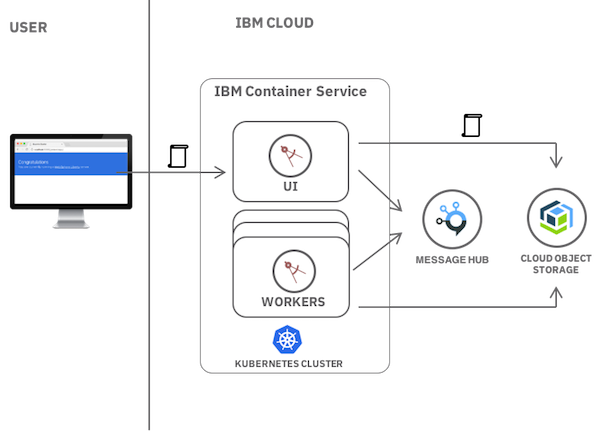
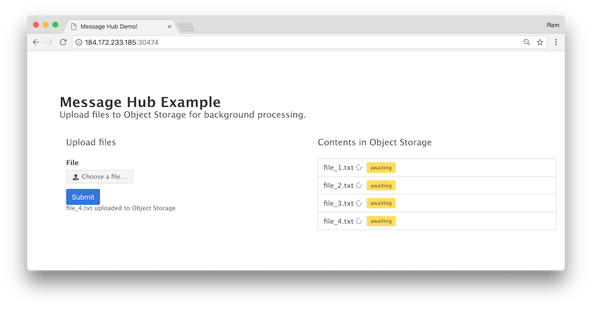
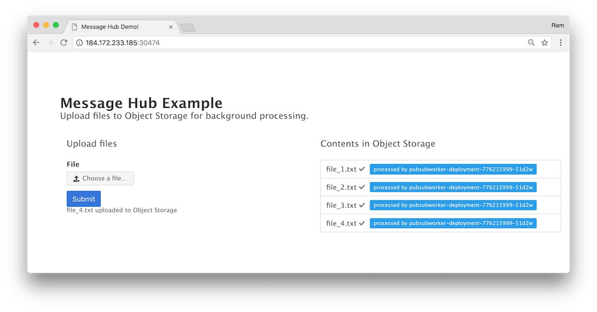

{:step: data-tutorial-type='step'}
{:java: #java .ph data-hd-programlang='java'}
{:swift: #swift .ph data-hd-programlang='swift'}
{:ios: #ios data-hd-operatingsystem="ios"}
{:android: #android data-hd-operatingsystem="android"}
{:shortdesc: .shortdesc}
{:new_window: target="_blank"}
{:codeblock: .codeblock}
{:screen: .screen}
{:tip: .tip}
{:pre: .pre}

# Asynchronous data processing using object storage and pub/sub messaging
{: #pub-sub-object-storage}
{: toc-content-type="tutorial"}
{: toc-services="containers, EventStreams, cloud-object-storage, Registry"}
{: toc-completion-time="2h"}

<!--##istutorial#-->
This tutorial may incur costs. Use the [Cost Estimator](https://{DomainName}/estimator/review) to generate a cost estimate based on your projected usage.
{: tip}

<!--#/istutorial#-->

In this tutorial, you will learn how to use an Apache Kafka based messaging service to orchestrate long running workloads to applications running in a Kubernetes cluster. This pattern is used to decouple your application allowing greater control over scaling and performance. {{site.data.keyword.messagehub}} can be used to queue up the work to be done without impacting the producer applications, making it an ideal system for long-running tasks.
{: shortdesc}

You will simulate this pattern using a file processing example. First you will create a UI application which will be used to upload files to {{site.data.keyword.objectstorageshort}} and generate messages indicating work to be done. Next, you will create a separate worker application which will asynchronously process the user uploaded files when it receives messages.

## Objectives
{: #pub-sub-object-storage-objectives}

* Implement a producer-consumer pattern with {{site.data.keyword.messagehub}}
* Bind services to a Kubernetes cluster


In this tutorial, the UI application is written in Node.js and the worker application is written in Java highlighting the flexibility of this pattern. Even though both applications are running in the same Kubernetes cluster in this tutorial, either one could have also been implemented as a Cloud Foundry application or serverless function.

{: class="center"}
{: style="text-align: center;"}


1. The user uploads file using the UI application
2. File is saved in {{site.data.keyword.cos_full_notm}}
3. Message is sent to {{site.data.keyword.messagehub}} topic indicating the new file is awaiting processing.
4. When ready, workers listen for messages and begin processing the new file.

## Before you begin
{: #pub-sub-object-storage-prereqs}

This tutorial requires:
* {{site.data.keyword.cloud_notm}} CLI,
   * {{site.data.keyword.containerfull_notm}} plugin (`kubernetes-service`),
   * {{site.data.keyword.registryshort_notm}} plugin (`container-registry`),
   * `dev` plugin,
* a Docker engine,
* `kubectl` to interact with Kubernetes clusters,
* `git` to clone source code repository,
* `jq` to query JSON files.

<!--##istutorial#-->
You will find instructions to download and install these tools for your operating environment in the [Getting started with tutorials](https://{DomainName}/docs/solution-tutorials?topic=solution-tutorials-tutorials) guide.
<!--#/istutorial#-->

## Create a Kubernetes cluster
{: #pub-sub-object-storage-create_kube_cluster}
{: step}

1. Create a Kubernetes cluster from the [Catalog](https://{DomainName}/kubernetes/catalog/cluster/create).
   1. Name it `mycluster` for ease of following this tutorial. This tutorial can be accomplished with a **Free** cluster. _Select **Free** from the Pricing plan dropdown_.
   2. Select a resource group and click **Create**
2. Check the state of your **Cluster** and **Worker Nodes** and wait for them to be **Normal**.

### Configure kubectl
{: #pub-sub-object-storage-3}

In this step, you'll configure kubectl to point to your newly created cluster going forward. [kubectl](https://kubernetes.io/docs/user-guide/kubectl-overview/) is a command line tool that you use to interact with a Kubernetes cluster.

1. Use `ibmcloud login` to log in interactively. Select the region where the cluster was created. *Skip this step if you are using {{site.data.keyword.cloud-shell_short}}*
2. When the cluster is ready, retrieve the cluster configuration:
   ```sh
   ibmcloud ks cluster config --cluster mycluster
   ```
   {: pre}

   Make sure you are targeting the resource group where the cluster was created before running this command. You can view and set the current resource group with `ibmcloud target`.
   {: tip}

3. Check that the `kubectl` command is correctly configured
   ```sh
   kubectl cluster-info
   ```
   {: pre}

## Create a {{site.data.keyword.messagehub}} instance
{: #pub-sub-object-storage-0}
{: step}
 {: #create_messagehub}

{{site.data.keyword.messagehub}} is a fast, scalable, fully managed messaging service, based on Apache Kafka, an open-source, high-throughput messaging system which provides a low-latency platform for handling real-time data feeds.

1. From the Catalog, create a [**{{site.data.keyword.messagehub}}**](https://{DomainName}/catalog/services/event-streams) service
   1. Select a region
   2. Select the **Standard** pricing plan
   3. Set the **Service name** to `myeventstreams`
   4. Select a resource group and Click **Create**
2. Under **Manage**,
   1. Provide **work-topic** as the Topic name. Click **Next**
   2. Select **1** partition, click **Next** and choose **a day** of Message retention.
   3. Click **Create topic**
   4. Repeat the above steps by clicking **create topic** to create a topic named **result-topic**, with 1 partition and message retention of a day.
3. Provide the service credentials to your cluster by binding the service instance to the `default` Kubernetes namespace.
   ```sh
   ibmcloud ks cluster service bind --cluster mycluster --namespace default --service myeventstreams --role Manager
   ```
   {: pre}

The `cluster service bind` command creates a cluster secret that holds the credentials of your service instance in JSON format. Use `kubectl get secrets` to see the generated secret with the name `binding-myeventstreams`. See [Integrating Services](https://{DomainName}/docs/containers?topic=containers-service-binding) for more info.
{: tip}

## Create an {{site.data.keyword.objectstorageshort}} service
{: #pub-sub-object-storage-create_cos}
{: step}

{{site.data.keyword.cos_full_notm}} is encrypted and dispersed across multiple geographic locations, and accessed over HTTP using a REST API. {{site.data.keyword.cos_full_notm}} provides flexible, cost-effective, and scalable cloud storage for unstructured data. You will use this to store the files uploaded by the UI.

1. From the Catalog, create a [**{{site.data.keyword.cos_short}}**](https://{DomainName}/catalog/services/cloud-object-storage) service,
   1. Select a region
   2. Select the Lite pricing plane
   3. Name the service `myobjectstorage`
   4. Select a resource group and click **Create**
2. Under Buckets, Click **Create bucket**.
3. Create a **custom bucket** by setting the bucket name to a unique name such as `username-mybucket`. _When you create buckets or add objects, be sure to avoid the use of Personally Identifiable Information (PII).**Note:** PII is information that can identify any user (natural person) by name, location, or any other means._
4. Select **Cross Region** Resiliency, change the selected **location** if you wish to, **Smart-Tier** storage class, and click **Create bucket**.
5. Click on **Endpoints**, copy and save the **public** endpoint next to `<region>-geo`. _Resiliency and location should be automatically selected._
6. Create an {{site.data.keyword.cos_short}} service key `cos-for-pub-sub` to be used with Kubernetes secret in the next step
   ```sh
   ibmcloud resource service-key-create cos-for-pub-sub  Writer --instance-name myobjectstorage
   ```
   {: pre}

7. Provide the service credentials to your cluster by creating a secret `binding-myobjectstorage` in the `default` Kubernetes namespace.
   ```sh
   kubectl create secret generic binding-myobjectstorage --from-literal="binding=$(ibmcloud resource service-key cos-for-pub-sub --output JSON | jq --raw-output '.[].credentials')" --namespace default
   ```
   {: pre}

## Deploy the UI application to the cluster
{: #pub-sub-object-storage-5}
{: step}

The UI application is a simple Node.js Express web application which allows the user to upload files. It stores the files in the Object Storage instance created above and then sends a message to {{site.data.keyword.messagehub}} topic `work-topic` that a new file is ready to be processed.

1. Clone the sample application repository locally and change directory to the `pubsub-ui` folder.
   ```sh
   git clone https://github.com/IBM-Cloud/pub-sub-storage-processing
   cd pub-sub-storage-processing/pubsub-ui
   ```
   {: pre}

2. Open `config.js`, update `COSBucketName` with your bucket name and `EndPointURL` with the endpoint you saved earlier.
3. Build and deploy the application. The deploy command generates a docker image, pushes it to your {{site.data.keyword.registryshort_notm}} and then creates a Kubernetes deployment. Follow the interactive instructions while deploying the app.
   ```sh
   ibmcloud dev build
   ibmcloud dev deploy -t container
   ```
   {: pre}

4. Visit the application with the URL mentioned in the output of the command above and upload the files from the `sample-files` folder. The uploaded files will be stored in Object Storage and the status will be "awaiting" until they are processed by the worker application. Leave this browser window open.

   

## Deploy the worker application to the cluster
{: #pub-sub-object-storage-6}
{: step}

The worker application is a Java application which listens to the {{site.data.keyword.messagehub}} Kafka `work-topic` topic for messages. On a new message, the worker will retrieve the name of the file from the message and then get the file contents from Object Storage. It will then simulate processing of the file and send another message to the `result-topic` topic upon completion. The UI application will listen this topic and update the status.

1. Change dir to the `pubsub-worker` directory
   ```sh
   cd ../pubsub-worker
   ```
   {: pre}

2. Open `resources/cos.properties`, update `bucket.name` property with your bucket name, endpoint URL and the geo you selected for the endpoint.
3. Build and deploy the worker application.
   ```sh
   ibmcloud dev build
   ibmcloud dev deploy -t container
   ```
   {: pre}

4. After deployment completes, check the browser window with your web application again. Note that the status next to each file is now changed to "processed".


In this tutorial, you learned how you can use Kafka based {{site.data.keyword.messagehub}} to implement a producer-consumer pattern. This allows the web application to be fast and offload the heavy processing to other applications. When work needs to be done, the producer (web application) creates messages and the work is load balanced between one or more workers who subscribe to the messages. You used a Java application running on Kubernetes to handle the processing, but these applications can also be [{{site.data.keyword.openwhisk_short}}](https://{DomainName}/docs/openwhisk?topic=openwhisk-use_cases). Applications running on Kubernetes are ideal for long running and intensive workloads, where as {{site.data.keyword.openwhisk_short}} would be a better fit for short lived processes.

## Remove resources
{: #pub-sub-object-storage-7}
{: removeresources}
{: step}

1. Navigate to [Resource List](https://{DomainName}/resources/) and
2. Delete Kubernetes cluster `mycluster`
3. Delete {{site.data.keyword.cos_full_notm}} `myobjectstorage`
4. Delete {{site.data.keyword.messagehub}} `myeventstreams`
5. Go to the [{{site.data.keyword.registryshort_notm}}](https://{DomainName}/kubernetes/registry/main/private) and delete the `pubsub*` repositories.

Depending on the resource it might not be deleted immediately, but retained (by default for 7 days). You can reclaim the resource by deleting it permanently or restore it within the retention period. See this document on how to [use resource reclamation](https://{DomainName}/docs/account?topic=account-resource-reclamation).
{: tip}

## Related content
{: #pub-sub-object-storage-8}
{: related}

* [{{site.data.keyword.cos_full_notm}}](https://{DomainName}/docs/cloud-object-storage?topic=cloud-object-storage-about-cloud-object-storage)
* [{{site.data.keyword.messagehub_full}}](https://{DomainName}/docs/EventStreams?topic=EventStreams-getting_started)
* [Manage Access to Object Storage](https://{DomainName}/docs/cloud-object-storage-infrastructure?topic=cloud-object-storage-infrastructure-managing-access#managing-access)
* [{{site.data.keyword.messagehub}} data processing with {{site.data.keyword.openwhisk_short}}](https://github.com/IBM/openwhisk-data-processing-message-hub)
