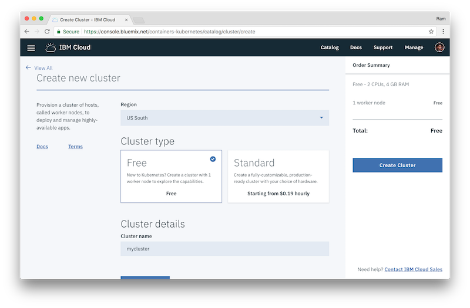
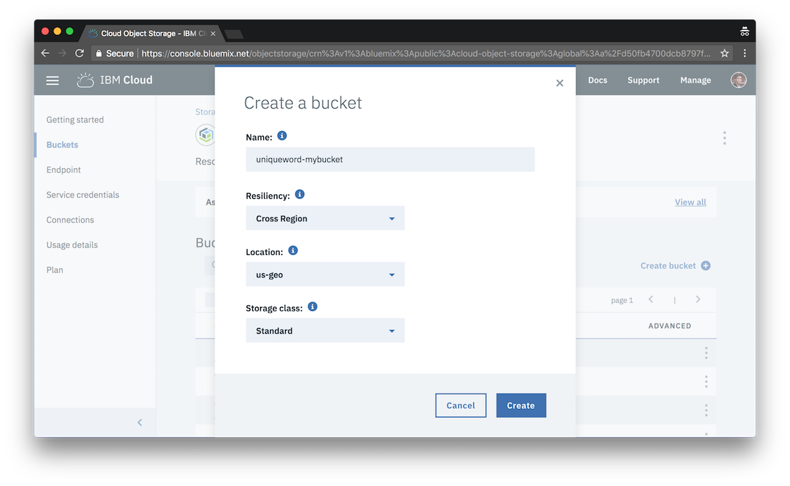

---
copyright:
  years: 2018
lastupdated: "2018-05-24"

---

{:java: #java .ph data-hd-programlang='java'}
{:swift: #swift .ph data-hd-programlang='swift'}
{:ios: #ios data-hd-operatingsystem="ios"}
{:android: #android data-hd-operatingsystem="android"}
{:shortdesc: .shortdesc}
{:new_window: target="_blank"}
{:codeblock: .codeblock}
{:screen: .screen}
{:tip: .tip}
{:pre: .pre}

# Asynchronous data processing using object storage and pub/sub messaging
In this tutorial, you will learn how to use an Apache Kafka based messaging service to orchestrate long running workloads to applications running in a Kubernetes cluster. You will simulate this using a file processing example. First create a UI application which will be used to upload files to object storage and generate messages indicating work to be done. Next, you will create a separate worker application which will asynchronously process the user uploaded files when it receives messages.

{:shortdesc}

This pattern is used to decouple your application allowing greater control over scaling and performance. Message Hub can be used to queue up the work to be done without impacting the producer applications, making it an ideal system for long-running tasks. In this example, the UI application is written in Node.js and the worker application is written in Java highliting the flexibily of this pattern. Even though both applications are running in the same Kubernetes cluster in this example, either piece could have also been implemented as a Cloud Foundry application or serverless function.

## Products

{: #products}

* {{site.data.keyword.cos_full_notm}}
* {{site.data.keyword.messagehub}}
* {{site.data.keyword.containershort_notm}}

<p style="text-align: center;">

</p>

1. The user uploads file using the UI application
2. File is saved in {{site.data.keyword.cos_full_notm}}
3. Message is sent to MessageHub topic indicating the new file is awaiting processing.
4. When ready, workers listen for messages and begin processing the new file.

## Before you begin
{: #prereqs}

* [IBM Cloud Developer Tools](https://console.bluemix.net/docs/cli/idt/setting_up_idt.html#add-cli) - Tool to install IBM Cloud CLI, Kubernetes, Helm, and Docker.


## Create a Kubernetes cluster
{: #create_kube_cluster}

1. Create a Kubernetes cluster from the [Catalog](https://console.bluemix.net/containers-kubernetes/launch). Name it `mycluster` for ease of following this tutorial. This tutorial can be accomplished with a **Free** cluster.
   
2. Check the status of your **Cluster** and **Worker Nodes** and wait for them to be **ready**.

### Configure kubectl

In this step, you'll configure kubectl to point to your newly created cluster going forward. [kubectl](https://kubernetes.io/docs/user-guide/kubectl-overview/) is a command line tool that you use to interact with a Kubernetes cluster.

1. Use `bx login` to log in interactively. Provide the organization (org), region and space under which the cluster is created. You can reconfirm the details by running `bx target` command.
2. When the cluster is ready, retrieve the cluster configuration:
   ```bash
   bx cs cluster-config <cluster-name>
   ```
   {: pre}
3. Copy and paste the **export** command to set the KUBECONFIG environment variable as directed. To verify whether the KUBECONFIG environment variable is set properly or not, run the following command:
  `echo $KUBECONFIG`
4. Check that the `kubectl` command is correctly configured
   ```bash
   kubectl cluster-info
   ```
  {: pre}
   


 ## Create a MessageHub instance
 {: #create_messagehub}

{{site.data.keyword.messagehub}} is a fast, scalable, fully managed messaging service, based on Apache Kafka, an open-source, high-throughput messaging system which provides a low-latency platform for handling real-time data feeds.

 1. From the Dashboard, click on [**Create resource**](https://console.bluemix.net/catalog/) and select [**{{site.data.keyword.messagehub}}**](https://console.bluemix.net/catalog/services/message-hub) from the Application Services section.
 2. Name the service `mymessagehub` and click **Create**.
 3. Provide the service credentials to your cluster by binding the service instance to the `default` Kubernetes namespace.
 ```
 bx cs cluster-service-bind mycluster default mymessagehub
 ```

The cluster-service-bind command creates a cluster secret that holds the credentials of your service instance in JSON format. Use `kubectl get secrets ` to see the generated secret with the name `binding-mymessagehub`. See [Integrating Services](https://console.bluemix.net/docs/containers/cs_integrations.html#integrations) for more info

{:tip}

## Create an Object Storage instance

{: #create_cos}

{{site.data.keyword.cos_full_notm}} is encrypted and dispersed across multiple geographic locations, and accessed over HTTP using a REST API. {{site.data.keyword.cos_full_notm}} provides flexible, cost-effective, and scalable cloud storage for unstructured data. We will use this to store the files uploaded by the UI.

1. From the Dashboard, click on [**Create resource**](https://console.bluemix.net/catalog/) and select [**{{site.data.keyword.cos_short}}**](https://console.bluemix.net/catalog/services/cloud-object-storage) from the Storage section.
2. Name the service `myobjectstorage` click **Create**.
3. Click **Create Bucket**.
4. Set the bucket name to a unique name such as `username-mybucket`.
5. Select **Cross Region** Resiliency and **us-geo** Location and click **Create**
6. Provide the service credentials to your cluster by binding the service instance to the `default` Kubernetes namespace.
 ```sh
 bx resource service-alias-create myobjectstorage --instance-name myobjectstorage
 bx cs cluster-service-bind mycluster default myobjectstorage
 ```


## Deploy the UI application to the cluster

The UI application is a simple Node.js Express web application which allows the user to upload files. It stores the files in the Object Storage instance created above and then sends a message to MessageHub topic "work-topic" that a new file is ready to be processed.

1. Clone the sample application repository locally and change directory to the `pubsub-ui` folder.
```sh
  git clone https://github.com/IBM-Cloud/pub-sub-storage-processing
  cd pub-sub-storage-processing/pubsub-ui
```
2. Open `config.js` and update COSBucketName with your bucket name.
3. Build and deploy the application. The deploy command generates a docker images, pushes it to your {{site.data.keyword.registryshort_notm}} and then creates a Kubernetes deployment.
```sh
  bx dev build
  bx dev deploy -t container
```
4. Visit the application and upload the files from the `sample-files` folder. The uploaded files will be stored in Object Storage and the status will be "awaiting" until they are processed by the worker application. Leave this browser window open.

   

## Deploy the worker application to the cluster

The worker application is a Java application which listens to the {{site.data.keyword.messagehub}} Kafka "work-topic" topic for messages. On a new message, the worker will retreive the name of the file from the message and then get the file contents from Object Storage. It will then simulate processing of the file and send another message to the "result-work" topic upon completion. The UI application will listen this topic and update the status.

1. Change dir to the `pubsub-worker` directory
```sh
  cd ../pubsub-worker
```
2. Open `resources/cos.properties` and update `bucket.name`,  property with your bucket name.
2. Build and deploy the worker application.
```
  bx dev build
  bx dev deploy -t container
```
3. After deployment completes, check the browser window with your web application again. Note that the status next to each file is now changed to "processed".


In this tutorial we showed how you can use Kafka based MessageHub to implement a producer-consumer pattern. This allows the web application to be fast and offload the heavy processing to other applications. When work needs to be done, the producer (web application) creates messages and the work is load balanced between one or more workers who subscribe to the messages. In this example, we used a Java application running on Kubernetes to handle the processing, but these applications can also be [Cloud Functions](https://console.bluemix.net/docs/openwhisk/openwhisk_use_cases.html#data-processing). Applications running on Kubernetes are ideal for long running and intensive workloads, where as Cloud Functions would be a better fit for short lived processes.

## Clean up Resources

Navigate to [Dashboard](https://console.bluemix.net/dashboard/) and
1. delete Kubernetes cluster `mycluster`
2. delete {{site.data.keyword.cos_full_notm}} `myobjectstorage`
3. delete {{site.data.keyword.messagehub}} `mymessagehub`
4. select **Containers** from the left menu, **Private Repositories** and then delete `pubsub-xxx` repositories.


## Related information

* [IBM Object Storage](https://ibm-public-cos.github.io/crs-docs/index.html)
* [{{site.data.keyword.messagehub_full}}](https://console.bluemix.net/docs/services/MessageHub/index.html#messagehub)
* [Manage Access to Object Storage](https://ibm-public-cos.github.io/crs-docs/manage-access)
* [{{site.data.keyword.messagehub}} data processing with IBM Cloud Functions](https://github.com/IBM/openwhisk-data-processing-message-hub)
