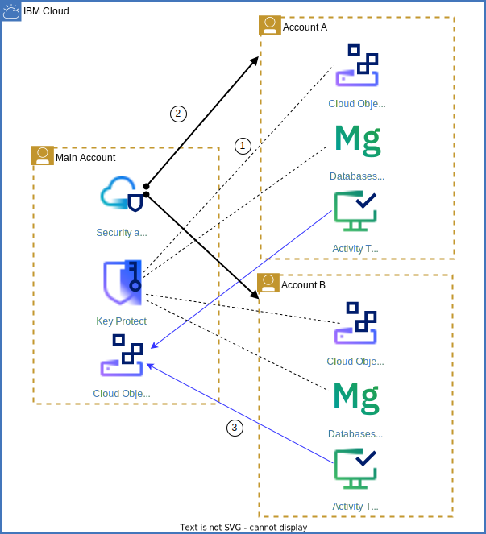
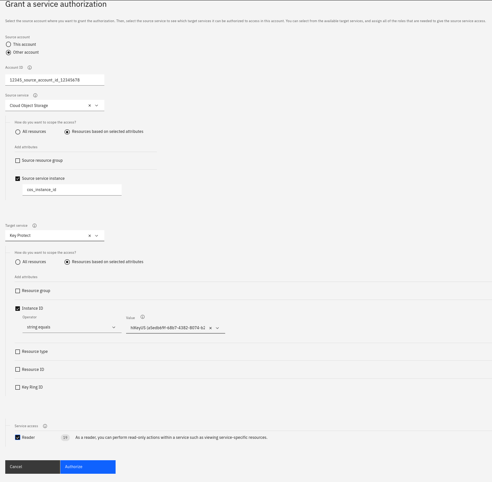

{{site.data.keyword.attribute-definition-list}}

# Resource sharing across accounts
{: #resource-sharing}
{: toc-content-type="tutorial"}
{: toc-services="vpc, log-analysis, activity-tracker, secrets-manager, appid, key-protect, cloud-object-storage"}
{: toc-completion-time="2h"}

<!--##istutorial#-->
This tutorial may incur costs. Use the [Cost Estimator](https://{DomainName}/estimator/review) to generate a cost estimate based on your projected usage.
{: tip}

<!--#/istutorial#-->

This tutorial walks you through different options on how to share cloud-based resources across accounts.
{: shortdesc}

An uncountable number of services is offered on the internet. You probably own accounts at many service providers. To use these services, you typically access them with a combination of user identity (ID) and password or by providing some form of API key or access token, often combined with additional levels (factors) of authentication. When building native cloud applications with a microservices-based architecture, the individual services can use the same techniques to access each other for collaboration. Often, however, automatic service binding with an even tighter integration is the desired form, usually combining authentication and authorization into a single, automated setup. Typically, the service binding requires the microservices to be in the same cloud account. That grouping is logically and simplifies development and operation. But sometimes, organizational, and especially security- and compliance-related requirements could mean to separate out some services and maintain them in central accounts. Thus, applications have to share resources across accounts. Sharing can be between accounts in an [IBM Cloud Enterprise environment](https://{DomainName}/docs/account?topic=account-what-is-enterprise) or without a formal enterprise organization.

This tutorial walks you through typical use cases and benefits of sharing cloud resources across accounts. Then, it helps you learn how to implement those common sharing scenarios, either manually or fully automated with Terraform.

## Objectives
{: #resource-sharing-objectives}

* Understand the benefits of sharing resources across accounts
* Learn about different techniques to share resources across accounts


## Resource sharing overview
{: #resource-sharing-overview}

When resources are shared, possibly multiple applications access and use the same resource or parts of it. This might be for various reasons including that applications and compute environments have to live in the same corporate network, or that security logs are collected in a central storage service. It requires that services in a microservice architecture can be configured to access and use external services, that the shared service authorizes access, and that the network between the services is configured to support such collaboration, but not more.

Some typical use cases of resource sharing are:
- Central management of security-related infrastructure. Monitor security from a dedicated account, aggregate security logs in a single place.
- Coordination of network addresses and subnets. Accounts and their applications and compute environments need to fit into the corporate network. This requires sharing of address ranges and domain names.
- Central management of resources for disaster recovery, including backup services like [{{site.data.keyword.backup_notm}}](https://{DomainName}/docs/Backup?topic=Backup-getting-started). Applications and their services may be designed for high availability, but additional centrally organized resources might be available to fall back to in the worst case. This includes holding multiple resource copies available world wide, e.g., stored in [replicated {{site.data.keyword.cos_short}} buckets](https://{DomainName}/docs/cloud-object-storage?topic=cloud-object-storage-replication-overview).
- Control costs by sharing more expensive services where possible. Not every development project including tests needs to have all services deployed as dedicated instances. Often, it is enough to share service instances - within accounts or across. Even for production environments, service instances might be shared depending on their cost / value factor and technical feasability. This can be organized by restricting available services in an account by utilizing [private catalogs and restricting the public catalog](https://{DomainName}/docs/account?topic=account-filter-account), then centrally providing instances of restricted services.
- Central management of resources on a corporate level or for a business unit. This could be assets needed for branding or centrally managed templates, base images (virtual machines, containers), and more. Again, private catalogs and the [{{site.data.keyword.registryshort_notm}}](https://{DomainName}/docs/Registry?topic=Registry-registry_access).
- Make scarce resources available to more users. Sometimes, a resource type is only available in limited quantity. By sharing, more applications can benefit from it. This may require rate limiting.


## Sharing of security resources
{: #resource-sharing-security}

Often, security is managed on a corporate level with company-wide rules in place. Therefore, enforcement is managed centrally, too. This is still true with workloads moving to cloud environments. Resource sharing is at the foundation of centrally managing security as well as assessing and enforcing compliance. 

{: class="center"}
{: style="text-align: center;"}


The above diagram shows the scenarios which are discussed in the following:
1. Dotted lines: Instances of {{site.data.keyword.cos_short}} and {{site.data.keyword.databases-for-mongodb}} in **Account A** and **Account B** utilize encryption keys managed in the **Main Account** in {{site.data.keyword.keymanagementserviceshort}}.
2. Black lines: {{site.data.keyword.compliance_short}} in the **Main Account** governs resources in all three accounts (see black lines above).
3. Blue lines: Instances of {{site.data.keyword.at_short}} in **Account A** and **Account B** direct security logs with {{site.data.keyword.atracker_short}} to {{site.data.keyword.cos_short}} buckets in the **Main Account** (see blue lines above).

### Encryption key management
{: #resource-sharing-security-kms}

In almost all environments, data is stored encrypted. By default, encryption is system-managed which means the encryption key is provided and maintained by the cloud provider. To increase security, customers can use their own keys by utilizing a key management service (KMS). In {{site.data.keyword.cloud_notm}}, the KMS can be either located in the same or in another account as the service using an encryption key. This allows to centrally manage encryption keys for all corporate accounts. That way, it is possible to monitor usage and invalidate encryption keys when needed.

[{{site.data.keyword.keymanagementserviceshort}}](https://{DomainName}/docs/key-protect) and [{{site.data.keyword.hscrypto}}](https://{DomainName}/docs/hs-crypto?topic=hs-crypto-get-started) support this deployment pattern. Access to them can be configured to allow central key management and thereby resource sharing across {{site.data.keyword.cloud_notm}} accounts.

### {{site.data.keyword.compliance_short}}
{: #resource-sharing-security-scc}

The [{{site.data.keyword.compliance_short}}](https://{DomainName}/security-compliance/overview) features Posture Management and Configuration Governance functionality. It helps to monitor deployed environments for security and assess them against compliance goals. Moreover, it can provide configuration defaults or even enforce settings of newly deployed resources. While the latter only applies to the current account, you can [utilize {{site.data.keyword.compliance_short}} to monitor and assess multiple accounts](https://{DomainName}/docs/security-compliance?topic=security-compliance-scanning-multiple-accounts-from-a-single-account) from a central instance. With custom collectors in place, the current security posture of multiple cloud accounts can be assessed and necessary actions taken.


### {{site.data.keyword.at_short}}
{: #resource-sharing-security-at}

All {{site.data.keyword.cloud_notm}} services produce events for security-related actions. They are logged into {{site.data.keyword.at_short}} instances. By utilzing {{site.data.keyword.atracker_short}} Event Routing, the security records can be centralized to one or few instances with either event search (logdna) or {{site.data.keyword.cos_short}} as storage options. By aggregating all records in one location, security events can be easily correlated and thereby increasing insights into incidents or even allowing an earlier detection.


## Sharing of network resources
{: #resource-sharing-network}

Designing and developing cloud native apps in an enterprise context often involves coordinating regarding network resources like address ranges and subnets, domain names, and routing of traffic. The different accounts and their applications and compute environments need to fit into the corporate network and its structure. This requires sharing of network resources.


{: class="center"}
{: style="text-align: center;"}

1. The {{site.data.keyword.tg_short}} service is used to interconnect VPC environments and classic infrastructure across the three accounts.
2. Each account has a {{site.data.keyword.dns_short}} instance to manage private domain names. The instances are connected to share DNS zones.

### {{site.data.keyword.dns_short}}
{: #resource-sharing-network-dns}

You can use {{site.data.keyword.dns_short}} to resolve private addresses (domain names) from resources deployed in {{site.data.keyword.cloud_notm}}. The domain names cannot be resolved from the public internet. A DNS zone is a collection of domain names and consists of DNS resource records. [DNS zones and their records can be used by other accounts](https://{DomainName}/docs/dns-svcs?topic=dns-svcs-cross-account-about), thus establishing linked zones.

### {{site.data.keyword.tg_short}}
{: #resource-sharing-network-transit-gateway}

The {{site.data.keyword.tg_short}} service allows to establish connectivity between {{site.data.keyword.cloud_notm}} environments, including classic infrastructure and Virtual Private Clouds (VPC). You can even [connect environments hosted in different accounts](https://{DomainName}/docs/transit-gateway?topic=transit-gateway-adding-cross-account-connections&interface=ui). Data flowing through {{site.data.keyword.tg_short}} stays within the {{site.data.keyword.cloud_notm}} private network and is not exposed to the public internet.


## Implementing resource sharing
{: #resource-sharing-implementation}

As stated in the introduction, it is common practice to access services outside the own (cloud) account. Depending on the level of integration, there are different ways of how to authorize service access and implement authentication. In the following, we are going to discuss the available options.


### Authentication with passwords or API keys
{: #resource-sharing-implementation-apikey}

Many internet services allow to generate multiple sets of credentials. Usually, they either consist of a combination of user identity (ID) and password or just a single API key. Often, it is possible to specific the set of privileges for the credentials, e.g., to allow read-only access or scope what can be accessed, modified, or even created and deleted. The credentials are then imported or configured for a depending (micro-) service or application to access that service. Even though access is possible, set up requires some (manual) work and overall they are only loosely coupled or integrated.

Within {{site.data.keyword.cloud_notm}}, some compute services including [{{site.data.keyword.codeengineshort}}](https://{DomainName}/docs/codeengine?topic=codeengine-service-binding) and [{{site.data.keyword.containershort}}](https://{DomainName}/docs/containers?topic=containers-service-binding) allow the automatic creation and configuration of credentials, the so-called *service binding*.


### Service to service authorization
{: #resource-sharing-implementation-s2sauth}

A tighter integrated approach for one service accessing another one is to [establish service to service authorizations (s2s authorization)](https://{DomainName}/docs/account?topic=account-serviceauth). You create an {{site.data.keyword.cloud_notm}} Identity and Access Management (IAM) policy that authorizes a source service to access a target service. Because the authentication is accomplished by identifying the source service requesting access, no credentials in the form of passwords or API keys are needed. Both authentication and authorization are handled automatically because of the created IAM policy.

#### Cross-account authorizations
{: #resource-sharing-implementation-s2sauth-cross-account}

IAM supports to establish a service to service authorizations between a source service in another {{site.data.keyword.cloud_notm}} account and a target in the current one. Therefore, it allows to easily share resources across accounts by creating an IAM authorization policy. Such policies can be created in many ways, including [in the browser console](https://{DomainName}/iam/authorizations/grant) as shown below, utilizing the CLI or by Terraform code. 

In the following examples, a specific {{site.data.keyword.cos_short}} instance in the source account is granted the **Reader** role for that identified {{site.data.keyword.keymanagementserviceshort}} instance in the current account. 

{: class="center"}
{: style="text-align: center;"}


The following shows the Terraform code to create a [resource with the same IAM authorization policy](https://registry.terraform.io/providers/IBM-Cloud/ibm/latest/docs/resources/iam_authorization_policy):


```hcl
resource "ibm_iam_authorization_policy" "cross_account_policy" {
  source_service_account = data.ibm_iam_account_settings.account_a_settings.account_id
  source_service_name = "cloud-object-storage"
  source_resource_instance_id = data.ibm_resource_instance.cos_resource_instance.guid
  
  target_service_name = "kms"
  target_resource_instance_id = data.ibm_resource_instance.kms_resource_instance.guid

  roles               = ["Reader"]
  description         = "read access on Key Protect in Main Account for Account A"
}
```
{: code}


The same authorization policy can be created using the [{{site.data.keyword.cloud_notm}} CLI with the **iam service-policy-create** command](https://{DomainName}/docs/cli?topic=cli-ibmcloud_commands_iam#ibmcloud_iam_service_policy_create):

```sh
ibmcloud iam authorization-policy-create cloud-object-storage kms Reader --source-service-account source_account_id --source-service-instance-id cos_instance_id --target-service-instance-id kms_instance_id
```
{: code}

The console, the Terraform provider and the CLI all use the [IAM policy management API](https://{DomainName}/apidocs/iam-policy-management#create-policy) to create the policy.

As a next step, with the authorization policy in place, an encrypted storage bucket using a {{site.data.keyword.keymanagementserviceshort}} root key could then be created. The following shows the Terraform code utilizing [**resource ibm_cos_bucket**](https://registry.terraform.io/providers/IBM-Cloud/ibm/latest/docs/resources/cos_bucket#example-usage-2). The attribute **key_protect** holds the CRN of the root key.

```hcl
resource "ibm_cos_bucket" "cos_bucket" {
  bucket_name          = "cos-bucket"
  resource_instance_id = data.ibm_resource_instance.cos_resource_instance.id
  region_location      = var.region
  key_protect          = data.ibm_kms_key.central_kms_root_key.id
  storage_class        = "smart"
}
```
{: code}

#### Typical service to service authorizations
{: #resource-sharing-implementation-s2sauth-services}

A dependency on a key management service (KMS) like [{{site.data.keyword.keymanagementserviceshort}}](https://{DomainName}/docs/key-protect?topic=key-protect-getting-started-tutorial) and [{{site.data.keyword.hscrypto}}](https://{DomainName}/docs/hs-crypto?topic=hs-crypto-get-started) is typical for cloud-based solution. A KMS instance holds the root keys for customer-managed encryption. Most services support customer-controlled encryption keys. Instead of **cos** ({{site.data.keyword.cos_short}}), many other can use a KMS instance shared across accounts.

Other typical (target) services for service to service authorization and candidates for resource sharing are:
- [{{site.data.keyword.cos_short}}](https://{DomainName}/docs/cloud-object-storage?topic=cloud-object-storage-getting-started-cloud-object-storage): Several services require or are able to store data and log files in a storage bucket. This includes archival of access logs and monitoring data. Other services like {{site.data.keyword.sqlquery_short}} need to access buckets to perform data analysis. And yet another category of services need access to subscribe to change notifications to trigger the execution of actions.
- [{{site.data.keyword.en_short}}](https://{DomainName}/docs/event-notifications?topic=event-notifications-getting-started): To push out information about events to subscribers, service instances need to access an {{site.data.keyword.en_short}} instance.
- [{{site.data.keyword.secrets-manager_short}}](https://{DomainName}/docs/secrets-manager?topic=secrets-manager-getting-started) stores and provides to other services IAM API keys, SSL/TLS certificates, and other secrets. Hence, the dependent (source) services need to access {{site.data.keyword.secrets-manager_short}}.
- [{{site.data.keyword.cis_short}}](https://{DomainName}/docs/cis?topic=cis-getting-started): It manages domain names and other network data and, therefore, can be used for, e.g., certificate validation.

Note that the above list is not complete.


## Summary
{: #resource-sharing-summary}

Accessing resources in different accounts, even sharing resources is common practice. There are several use case where users benefit from resource sharing. We have discussed them in the overview. A combination of user identity and password or an API key to access a resource often serves as authentication. Access can be scoped to a set of privileges, e.g., only allowing read access or some other restricted actions. Sometimes, these type of credentials can be created and managed by the accessing resource like an application or compute environment ("service binding"). An even tighter integration which does not require credentials is the concept of {{site.data.keyword.cloud_notm}} service to service authorization. The accessing resource (source) and the accessed resource (target) are identified by their properties (authentication) and an access role is assigned (authorization). Such a relationship can be even established across account boundaries. This allows for a simple to configure, but yet secure cross-account resource sharing.


## Related resources
{: #resource-sharing-related_resources}

- List IBM Cloud documentation links


**examples and additional text**
- Cloudant data replication across accounts: https://{DomainName}/docs/Cloudant?topic=Cloudant-replication-guide#how-to-run-replication-across-different-ibm-cloudant-accounts
- SCC is able to scan multiple accounts: https://{DomainName}/docs/security-compliance?topic=security-compliance-scanning-multiple-accounts-from-a-single-account
- Activity Tracker, consolidate events in another account's COS, see https://{DomainName}/docs/activity-tracker?topic=activity-tracker-getting-started-routing-2
- Transit Gateway: connect across accounts https://{DomainName}/docs/transit-gateway?topic=transit-gateway-about#use-case-5
- Direct Link: https://{DomainName}/docs/vpc-journey?topic=vpc-journey-vpc-directlink#vpc-directlink-patterns
- DNS service cross-account access https://{DomainName}/docs/dns-svcs?topic=dns-svcs-cross-account-about
- IBM Cloud Databases allow backup / restore across accounts via API: https://{DomainName}/docs/cloud-databases?topic=cloud-databases-dashboard-backups
- IBM Cloud API keys for a user have a scope that may be across multiple accounts, the same as the user has: https://{DomainName}/docs/account?topic=account-manapikey#ibm-cloud-api-keys
- Container Registry, manage container images centrally, use service IDs to access them


- service to service authorizations (API, Terraform, CLI)
- discuss Terraform for multi-account setup
- service ID (account, including their API keys) vs. user (multiple accounts, including their API keys)
- Trusted Profiles as possible solution?


mention CLI env variable for holding "home", it could be used with two terminal windows - one for each account involved