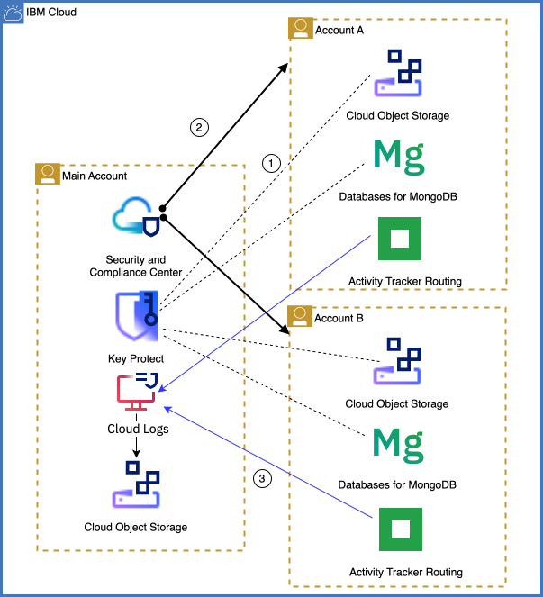
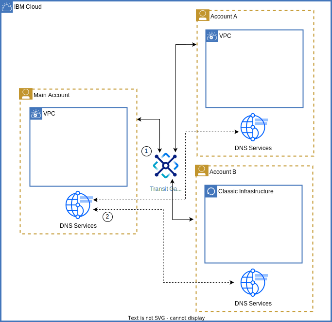
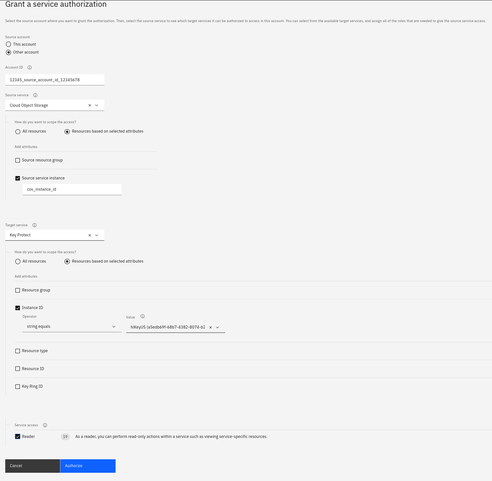

{{site.data.keyword.attribute-definition-list}}

# Resource sharing across accounts
{: #resource-sharing}
{: toc-content-type="tutorial"}
{: toc-services="vpc, log-analysis, activity-tracker, secrets-manager, appid, key-protect, hs-crypto, cloud-object-storage"}
{: toc-completion-time="1h"}

<!--##istutorial#-->
This tutorial may incur costs. Use the [Cost Estimator](/estimator/review) to generate a cost estimate based on your projected usage.
{: tip}

<!--#/istutorial#-->

This tutorial walks you through different options on how to share cloud-based resources across accounts.
{: shortdesc}

An uncountable number of services are offered on the internet. You probably own accounts at many service providers. To use these services, you typically access them with a combination of user identity (ID) and password or by providing some form of API key or access token, often combined with additional levels (factors) of authentication. When building cloud native applications with a microservices-based architecture, the individual components can use the same techniques to access each other for collaboration. Ideally, the setup can be automated, and the access scoped to a required minimum for increased security.

With a focus on cloud services, it might be called a **connector**, **service binding**, or **service-to-service authorization**. Such automated service binding provides tighter integration and usually combines authentication and authorization into a single, automated setup. Typically, the service binding requires the services to be in the same cloud account. That grouping is logical and simplifies development and operation. But sometimes, organizational, and especially security- and compliance-related requirements could mean separating some services and maintaining them in central accounts. Thus, applications have to share resources across accounts. Sharing can be between accounts in an [IBM Cloud Enterprise environment](/docs/account?topic=account-what-is-enterprise) or without a formal enterprise organization.

This tutorial walks you through typical use cases and benefits of sharing cloud resources across accounts. You will learn how to implement those common sharing scenarios, either manually or fully automated with Terraform.

## Objectives
{: #resource-sharing-objectives}

* Understand the benefits of sharing resources across accounts
* Learn about different techniques to share resources across accounts


## Resource sharing overview
{: #resource-sharing-overview}

It is not unusual to find multiple applications access and use the same resource or parts of it. One example is when applications and compute environments have to live on the same corporate network. Another scenario is that security logs are collected in central storage. In a microservice architecture, it requires us to configure services to access and use external resources. In turn, the shared resources must authorize access, and the network between them is configured to support such collaboration, but not more.

Some typical use cases of resource sharing are:
- **Central management of security-related infrastructure**. Monitor security from a dedicated account, and aggregate security logs in a single place. Manage all encryption keys in central key management systems (KMS).
- **Coordination of network addresses and subnets**. Applications and compute environments need to fit into the same network and require sharing of address ranges and domain names.
- **Central management of resources for disaster recovery**, including backup services like [{{site.data.keyword.backup_notm}}](/docs/Backup?topic=Backup-getting-started). Applications and their services may be designed for high availability, but additional centrally organized resources might be available to fall back to in the worst case. This includes holding multiple resource copies available worldwide, e.g., stored in [replicated {{site.data.keyword.cos_short}} buckets](/docs/cloud-object-storage?topic=cloud-object-storage-replication-overview).
- **Control costs by sharing more expensive services** where possible. Not every development project needs to have all services deployed as dedicated instances. Often, it is enough to share service instances - within accounts or across. Even for production environments, service instances might be shared depending on their cost/value factor and technical feasibility. This can be organized by restricting available services in an account by utilizing [private catalogs and restricting the public catalog](/docs/account?topic=account-filter-account), then centrally providing instances of restricted services.
- **Central management of resources on a corporate level or for a business unit**. This could be assets needed for branding or centrally managed templates, base images (virtual machines, containers), and more. Again, private catalogs and the [{{site.data.keyword.registryshort_notm}}](/docs/Registry?topic=Registry-registry_access) are typical services.
- **Make scarce resources available to more users**. Sometimes, a resource type is only available in limited quantity. By sharing, more applications can benefit from it. This may require rate limiting.


## Sharing of security resources
{: #resource-sharing-security}

Often, security is managed on a corporate level with company-wide rules in place. Therefore, enforcement is managed centrally, too. This is still true with workloads moving to cloud environments. Resource sharing is at the foundation of centrally managing security as well as assessing and enforcing compliance. 

{: caption="Sharing of security-related resources" caption-side="bottom"}


The above diagram shows the following scenarios:
1. Instances of {{site.data.keyword.cos_short}} and {{site.data.keyword.databases-for-mongodb}} in **Account A** and **Account B** utilize encryption keys managed in the **Main Account** in {{site.data.keyword.keymanagementserviceshort}}.
2. {{site.data.keyword.compliance_short}} in the **Main Account** governs resources in all three accounts (see black lines above).
3. Instances of {{site.data.keyword.at_short}} in **Account A** and **Account B** direct security logs with {{site.data.keyword.atracker_short}} to {{site.data.keyword.cos_short}} buckets in the **Main Account** (see blue lines above).

Sharing can be between accounts in an [IBM Cloud Enterprise environment](/docs/account?topic=account-what-is-enterprise) or without a formal enterprise organization.

### Encryption key management
{: #resource-sharing-security-kms}

In almost all environments, data is stored encrypted. By default, encryption is provider-managed which means the encryption key is provided and maintained by the cloud provider. To increase security, customers can use their own keys by utilizing a key management service (KMS). In {{site.data.keyword.cloud_notm}}, the KMS can be either located in the same or in another account as the service using an encryption key. This allows to centrally manage encryption keys for all corporate accounts. That way, it is possible to monitor usage and invalidate encryption keys when needed.

[{{site.data.keyword.keymanagementserviceshort}}](/docs/key-protect) and [{{site.data.keyword.hscrypto}}](/docs/hs-crypto?topic=hs-crypto-get-started) support this deployment pattern. You can configure access to an entire instance or, for enhanced security, to individual [key rings - a collection of keys](/docs/key-protect?topic=key-protect-grouping-keys). [{{site.data.keyword.hscrypto}} with {{site.data.keyword.uko_full_notm}}](/docs/hs-crypto?topic=hs-crypto-uko-overview&interface=ui) even enables you to orchestrate encryption keys across key stores at different cloud providers.

### {{site.data.keyword.compliance_short}}
{: #resource-sharing-security-scc}

The [{{site.data.keyword.compliance_short}}](/security-compliance/overview) features Posture Management and Configuration Governance functionality. It helps to monitor deployed environments for security and assess them against compliance goals. Moreover, it can provide configuration defaults or even enforce settings of newly deployed resources. While the latter only applies to the current account, you can [utilize {{site.data.keyword.compliance_short}} to monitor and assess multiple accounts](/docs/security-compliance?topic=security-compliance-scanning-multiple-accounts-from-a-single-account) from a central instance. With custom collectors in place, the current security posture of multiple cloud accounts can be assessed and necessary actions taken.


### {{site.data.keyword.at_short}}
{: #resource-sharing-security-at}

All {{site.data.keyword.cloud_notm}} services produce events for security-related actions. They are logged into {{site.data.keyword.at_short}} instances. By utilizing {{site.data.keyword.atracker_short}}, the security records can be centralized to one or few instances with either event search (`logdna`) or {{site.data.keyword.cos_short}} as storage options. By aggregating all records in one location, security events can be easily correlated and thereby increasing insights into incidents or even allowing an early detection.

### {{site.data.keyword.la_short}}
{: #resource-sharing-security-la}

{{site.data.keyword.la_full}} allows managing operating system logs, application logs, and platform logs and provides search and filtering capabilities. Logs can be streamed from one {{site.data.keyword.la_short}} instance to either [{{site.data.keyword.messagehub}}](/docs/log-analysis?topic=log-analysis-streaming-configure) or [to another {{site.data.keyword.la_short}} instance](/docs/log-analysis?topic=log-analysis-streaming-configure-l2l). Thus, by streaming to a central instance, logs can be consolidated for analysis in greater context, thereby improving (security) insights.


## Sharing of network resources
{: #resource-sharing-network}

Designing and developing cloud native apps in an enterprise context often involves coordinating regarding network resources like address ranges and subnets, domain names, and routing of traffic. The different accounts and their applications and compute environments need to fit into the network and its structure. This requires sharing of network resources.


{: caption="Sharing of network resources" caption-side="bottom"}

1. The {{site.data.keyword.tg_short}} service is used to interconnect VPC environments and classic infrastructure across the three accounts.
2. Each account has a {{site.data.keyword.dns_short}} instance to manage private domain names. The instances are connected to share DNS zones.

### {{site.data.keyword.dns_short}}
{: #resource-sharing-network-dns}

You can use {{site.data.keyword.dns_short}} to resolve private addresses (domain names) from resources deployed in {{site.data.keyword.cloud_notm}}. The domain names cannot be resolved from the public internet. A DNS zone is a collection of domain names and consists of DNS resource records. [DNS zones and their records can be used by other accounts](/docs/dns-svcs?topic=dns-svcs-cross-account-about), thus establishing linked zones.

### {{site.data.keyword.tg_short}}
{: #resource-sharing-network-transit-gateway}

The {{site.data.keyword.tg_short}} service allows to establish connectivity between {{site.data.keyword.cloud_notm}} environments, including classic infrastructure and Virtual Private Clouds (VPC). You can even [connect environments hosted in different accounts](/docs/transit-gateway?topic=transit-gateway-adding-cross-account-connections&interface=ui). Data flowing through {{site.data.keyword.tg_short}} stays within the {{site.data.keyword.cloud_notm}} private network and is not exposed to the public internet.


## Implementing resource sharing
{: #resource-sharing-implementation}

As stated in the introduction, it is common practice to access services outside the one (cloud) account. Depending on the level of integration, there are different ways to authorize service access and implement authentication. Those available options are discussed below.


### Authentication with passwords or API keys
{: #resource-sharing-implementation-apikey}

Many resources allow to generate multiple sets of credentials. Usually, they either consist of a combination of user identity (ID) and password or just a single API key. Often, it is possible to specify the set of privileges for the credentials, e.g., to allow read-only access or scope what can be accessed, modified, or even created and deleted. The credentials are then imported or configured for a dependent service or application to access that resource. Even though access is possible, set up requires some (manual) work and overall they are only loosely coupled or integrated.

Within {{site.data.keyword.cloud_notm}}, some compute services including [{{site.data.keyword.codeengineshort}}](/docs/codeengine?topic=codeengine-service-binding) and [{{site.data.keyword.containershort}}](/docs/containers?topic=containers-service-binding) allow the automatic creation and configuration of credentials, the so-called *service binding*.


### Service-to-service authorization
{: #resource-sharing-implementation-s2sauth}

A tighter integrated approach for one service accessing another one is to [establish service-to-service authorizations (s2s authorization)](/docs/account?topic=account-serviceauth). You create an {{site.data.keyword.cloud_notm}} Identity and Access Management (IAM) policy that authorizes a source service to access a target service. Because the authentication is accomplished by identifying the source service requesting access, no credentials in the form of passwords or API keys are needed. Both authentication and authorization are handled automatically because of the created IAM policy.

#### Cross-account authorizations
{: #resource-sharing-implementation-s2sauth-cross-account}

IAM supports establishing service-to-service authorizations between a source service in another {{site.data.keyword.cloud_notm}} account and a target in the current one. Therefore, it allows sharing resources across accounts by creating an IAM authorization policy. Such policies can be created in many ways, including [in the browser console](/iam/authorizations/grant) as shown below, utilizing the CLI or by executing Terraform code. 

In the following examples, a specific {{site.data.keyword.cos_short}} instance in the source account is granted the **Reader** role for that identified {{site.data.keyword.keymanagementserviceshort}} instance in the current account. 

{: caption="Grant a service-to-service authorization" caption-side="bottom"}


The following shows the Terraform code to create a [resource with the same IAM authorization policy](https://registry.terraform.io/providers/IBM-Cloud/ibm/latest/docs/resources/iam_authorization_policy):


```hcl
resource "ibm_iam_authorization_policy" "cross_account_policy" {
  source_service_account      = data.ibm_iam_account_settings.account_a_settings.account_id
  source_service_name         = "cloud-object-storage"
  source_resource_instance_id = data.ibm_resource_instance.cos_resource_instance.guid
  
  target_service_name         = "kms"
  target_resource_instance_id = data.ibm_resource_instance.kms_resource_instance.guid

  roles                       = ["Reader"]
  description                 = "read access on Key Protect in Main Account for Account A"
}
```
{: codeblock}


The same authorization policy can be created using the [{{site.data.keyword.cloud_notm}} CLI with the **iam service-policy-create** command](/docs/cli?topic=cli-ibmcloud_commands_iam#ibmcloud_iam_service_policy_create):

```sh
ibmcloud iam authorization-policy-create cloud-object-storage kms Reader --source-service-account source_account_id --source-service-instance-id cos_instance_id --target-service-instance-id kms_instance_id
```
{: codeblock}

The console, the Terraform provider and the CLI all use the [IAM policy management API](/apidocs/iam-policy-management#create-policy) to create the policy.

As a next step, with the authorization policy in place, an encrypted storage bucket using a {{site.data.keyword.keymanagementserviceshort}} root key could then be created. The following shows the Terraform code utilizing the resource[**ibm_cos_bucket**](https://registry.terraform.io/providers/IBM-Cloud/ibm/latest/docs/resources/cos_bucket#example-usage-2). The attribute **key_protect** holds the CRN of the root key.

```hcl
resource "ibm_cos_bucket" "cos_bucket" {
  bucket_name          = "cos-bucket"
  resource_instance_id = data.ibm_resource_instance.cos_resource_instance.id
  region_location      = var.region
  key_protect          = data.ibm_kms_key.central_kms_root_key.id
  storage_class        = "smart"
}
```
{: codeblock}

You can find more examples in the GitHub repository [cross-account-resource-sharing](https://github.com/IBM-Cloud/cross-account-resource-sharing).
{: tip}


#### Typical service-to-service authorizations
{: #resource-sharing-implementation-s2sauth-services}

A dependency on a key management service (KMS) like [{{site.data.keyword.keymanagementserviceshort}}](/docs/key-protect?topic=key-protect-getting-started-tutorial) and [{{site.data.keyword.hscrypto}}](/docs/hs-crypto?topic=hs-crypto-get-started) is typical for cloud-based solutions. A KMS instance holds the root keys for customer-managed encryption. Most services support customer-controlled encryption keys. Instead of **cloud-object-storage** ({{site.data.keyword.cos_short}}) in the example above, many other services can use a KMS instance shared across accounts.

Other typical (target) services for service-to-service authorization and candidates for resource sharing include:
- [{{site.data.keyword.cos_short}}](/docs/cloud-object-storage?topic=cloud-object-storage-getting-started-cloud-object-storage): Several services require or are able to store data and log files in a storage bucket. This includes the archival of access logs and monitoring data. Other services like {{site.data.keyword.sqlquery_short}} need to access buckets to perform data analysis. And yet another category of services need access to subscribe to change notifications to trigger the execution of actions.
- [{{site.data.keyword.en_short}}](/docs/event-notifications?topic=event-notifications-getting-started): To push out information about events to subscribers, service instances need to access an {{site.data.keyword.en_short}} instance.
- [{{site.data.keyword.secrets-manager_short}}](/docs/secrets-manager?topic=secrets-manager-getting-started): This service stores and provides to other services IAM API keys, SSL/TLS certificates, and other secrets. Hence, the dependent (source) services need to access {{site.data.keyword.secrets-manager_short}}.
- [{{site.data.keyword.cis_short}}](/docs/cis?topic=cis-getting-started): It manages domain names and other network data and, therefore, can be used for, e.g., certificate validation.

Note that the above list is not complete.


## Summary
{: #resource-sharing-summary}

Accessing resources in different accounts, even sharing resources is common practice. There are several use cases where users benefit from resource sharing. They were discussed in the overview. A combination of user identity and password or an API key to access a resource often serves as authentication. Access can be scoped to a set of privileges, e.g., only allowing read access or some other restricted actions. Sometimes, these type of credentials can be created and managed by the accessing resource like an application or compute environment ("service binding"). An even tighter integration which does not require credentials is the concept of {{site.data.keyword.cloud_notm}} service-to-service authorization. The accessing resource (source) and the accessed resource (target) are identified by their properties (authentication) and an access role is assigned (authorization). Such a relationship can be even established across account boundaries. This allows for a simple to configure, but yet secure cross-account resource sharing.

| Service | Capability |
| ------- | ---------- |
| **Security and Observability** | |
| {{site.data.keyword.compliance_short}} | [Scan multiple accounts from a single {{site.data.keyword.compliance_short}}](/docs/security-compliance?topic=security-compliance-scanning-multiple-accounts-from-a-single-account) |
| {{site.data.keyword.at_short}} | [Route your {{site.data.keyword.at_short}} events to another account](/docs/activity-tracker?topic=activity-tracker-getting-started-routing-2)|
| {{site.data.keyword.la_short}} | Stream logs from one {{site.data.keyword.la_short}} instance to either [{{site.data.keyword.messagehub}}](/docs/log-analysis?topic=log-analysis-streaming-configure) or [to another {{site.data.keyword.la_short}} instance](/docs/log-analysis?topic=log-analysis-streaming-configure-l2l)|
| {{site.data.keyword.keymanagementserviceshort}} | Use [service-to-service authorizations](/docs/account?topic=account-serviceauth&interface=ui) to share encryption keys. [Organize the keys in key rings](/docs/key-protect?topic=key-protect-grouping-keys) for simpler management and enhanced security.|
| {{site.data.keyword.hscrypto}} | Use [service-to-service authorizations](/docs/account?topic=account-serviceauth&interface=ui) to share encryption keys. [Organize the keys in key rings](/docs/hs-crypto?topic=hs-crypto-managing-key-rings) for simpler management and enhanced security.|
| {{site.data.keyword.hscrypto}} with {{site.data.keyword.uko_full_notm}}| [Connect your {{site.data.keyword.hscrypto}} instance to keystores in {{site.data.keyword.cloud_notm}} and third-party clouds](/docs/hs-crypto?topic=hs-crypto-uko-overview&interface=ui).|
| {{site.data.keyword.secrets-manager_short}} | [Integrations for {{site.data.keyword.secrets-manager_short}}](/docs/secrets-manager?topic=secrets-manager-integrations)|
| **Network** | |
| {{site.data.keyword.tg_short}} | [Connect across accounts with {{site.data.keyword.tg_short}}](/docs/transit-gateway?topic=transit-gateway-about#use-case-5)|
| {{site.data.keyword.dns_short}} | [Sharing DNS zones across accounts in {{site.data.keyword.dns_short}}](/docs/dns-svcs?topic=dns-svcs-cross-account-about)|
| **Account settings** | |
| Catalog|Restricting available services in an account by utilizing [private catalogs and restricting the public catalog](/docs/account?topic=account-filter-account)|
| **Databases** | |
| {{site.data.keyword.cloudant_short_notm}} | [Data replication across accounts](/docs/Cloudant?topic=Cloudant-replication-guide#how-to-run-replication-across-different-ibm-cloudant-accounts)|
| {{site.data.keyword.databases-for}} | [Restore backups across accounts](/docs/cloud-databases?topic=cloud-databases-dashboard-backups)|
{: caption="Summary of sharing and reuse capabilities across services" caption-side="bottom"}

You can find code examples on how to set up resource sharing for some of these service in the GitHub repository [cross-account-resource-sharing](https://github.com/IBM-Cloud/cross-account-resource-sharing).
{: tip}

## Related resources
{: #resource-sharing-related_resources}

The following document provides details on some cross-account scenarios:
- [{{site.data.keyword.cloud_notm}} API keys for a user may have a scope across multiple accounts](/docs/account?topic=account-manapikey#ibm-cloud-api-keys)


Blog posts related to sharing resource across multiple accounts:
- [Terraform multi-account setup for {{site.data.keyword.cloud_notm}}](https://blog.4loeser.net/2022/09/terraform-setup-multi-account-ibm-cloud.html)
- [Tips and Tricks for Using the IBM Cloud CLI](https://www.ibm.com/cloud/blog/tips-and-tricks-for-using-the-ibm-cloud-cli){: external} discusses [**IBMCLOUD_HOME**](/docs/cli?topic=cli-ibmcloud_env_var#IBMCLOUD_PATH_TO_DIR) which can be used to work with multiple accounts from the CLI.

