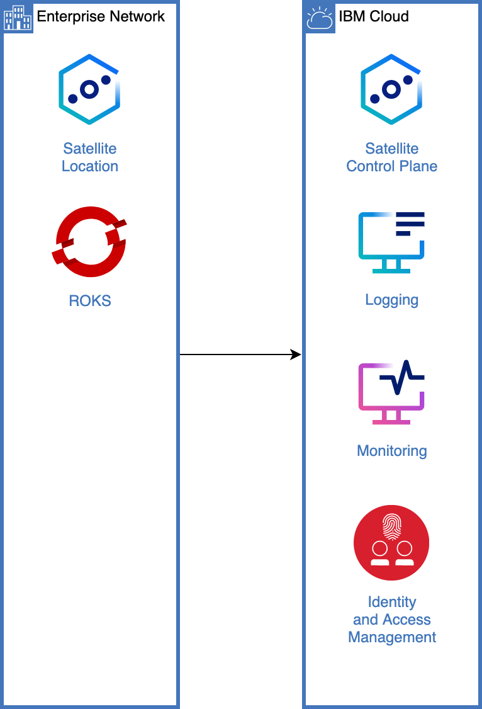
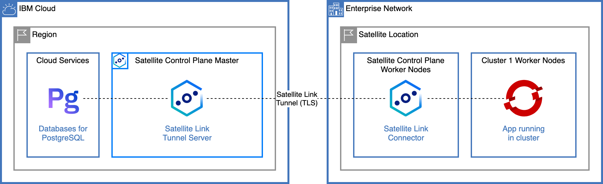

{:step: data-tutorial-type='step'}
{:java: #java .ph data-hd-programlang='java'}
{:swift: #swift .ph data-hd-programlang='swift'}
{:ios: #ios data-hd-operatingsystem="ios"}
{:android: #android data-hd-operatingsystem="android"}
{:shortdesc: .shortdesc}
{:new_window: target="_blank"}
{:codeblock: .codeblock}
{:screen: .screen}
{:pre: .pre}
{:deprecated: .deprecated}
{:important: .important}
{:note: .note}
{:tip: .tip}
{:preview: .preview}
{:beta: .beta}

# Introduction to {{site.data.keyword.satelliteshort}} locations, clusters, link and config
{: #satellite-tour}
{: toc-content-type="tutorial"}
{: toc-services="satellite"}
{: toc-completion-time="2h"}

<!--##istutorial#-->
This tutorial may incur costs. Use the [Cost Estimator](https://{DomainName}/estimator/review) to generate a cost estimate based on your projected usage.
{: tip}

<!--#/istutorial#-->

This tutorial guides you through the architecture and components of a {{site.data.keyword.satellitelong_notm}} location.
{: shortdesc}

With {{site.data.keyword.satellitelong_notm}}, you use your own compute infrastructure that is in your on-premises data center, other cloud providers, or edge networks to create a {{site.data.keyword.satelliteshort}} location. Then, you use the capabilities of {{site.data.keyword.satelliteshort}} to run {{site.data.keyword.cloud_notm}} services on your infrastructure, and consistently deploy, manage, and control your app workloads through a single pane of glass.

Your {{site.data.keyword.satelliteshort}} location includes tools like {{site.data.keyword.satelliteshort}} Link and {{site.data.keyword.satelliteshort}} Config to provide additional capabilities for securing and auditing network connections in your location and consistently deploying, managing, and controlling your apps and policies across clusters in the location.

## Objectives
{: #satellite-tour-objectives}

* Review the underlying infrastructure of an existing {{site.data.keyword.satelliteshort}} location.
* Expose {{site.data.keyword.Bluemix_notm}} services to the location with {{site.data.keyword.satelliteshort}} Link.
* Deploy an application to a {{site.data.keyword.openshiftlong_notm}} cluster running in the location.
* Use {{site.data.keyword.satelliteshort}} configurations to specify what Kubernetes resources you want to deploy to a group of {{site.data.keyword.openshiftlong_notm}} clusters.

{: class="center"}
{: style="text-align: center;"}

The {{site.data.keyword.satelliteshort}} architecture is comprised of:
* The Control Plane Master, running in {{site.data.keyword.cloud_notm}},
* Cloud services to support the {{site.data.keyword.satelliteshort}} location operations like {{site.data.keyword.loganalysisshort_notm}}, {{site.data.keyword.monitoringshort_notm}}, {{site.data.keyword.cos_short}},
* {{site.data.keyword.satelliteshort}} Link to securely connect the {{site.data.keyword.satelliteshort}} location back to {{site.data.keyword.cloud_notm}},
* Host infrastructure assigned to the {{site.data.keyword.satelliteshort}} control plane, and to clusters and services running in the {{site.data.keyword.satelliteshort}} location.

{: class="center"}
{: style="text-align: center;"}

The application you will deploy will be running in one cluster in the location. It will access a {{site.data.keyword.nlushort}} service running in {{site.data.keyword.Bluemix_notm}} through {{site.data.keyword.satelliteshort}} Link.

<!--##istutorial#-->
## Before you begin
{: #satellite-tour-prereqs}

This tutorial requires:
* An {{site.data.keyword.cloud_notm}} [billable account](https://{DomainName}/docs/account?topic=account-accounts),
* {{site.data.keyword.cloud_notm}} CLI,
   * {{site.data.keyword.containerfull_notm}} plugin (`container-service`),
* `oc` to interact with {{site.data.keyword.openshiftshort}}

You will find instructions to download and install these tools for your operating environment in the [Getting started with tutorials](https://{DomainName}/docs/solution-tutorials?topic=solution-tutorials-tutorials) guide.

Note: To avoid the installation of these tools you can use the [{{site.data.keyword.cloud-shell_short}}](https://{DomainName}/shell) from the {{site.data.keyword.cloud_notm}} console.
{: tip}

<!--#/istutorial#-->

<!--##isworkshop#-->
<!--
## Start a new {{site.data.keyword.cloud-shell_notm}}
{: #satellite-tour-shell}
{: step}
1. From the {{site.data.keyword.cloud_notm}} console in your browser, select the account where you have been invited.
1. Click the button in the upper right corner to create a new [{{site.data.keyword.cloud-shell_short}}](https://{DomainName}/shell).

-->
<!--#/isworkshop#-->

## Understand the architecture of the {{site.data.keyword.satelliteshort}} location
{: #satellite-tour-architecture}
{: step}

In this section, you will walk through the components that make up a {{site.data.keyword.satelliteshort}} location. A {{site.data.keyword.satelliteshort}} location is the location (on-premises, edge, or other cloud provider's infrastructure) to which {{site.data.keyword.Bluemix_notm}} services will be extended.

### Using {{site.data.keyword.cloud_notm}} console
{: #satellite-tour-architecture-ui}

1. Navigate to [the list of locations](https://{DomainName}/satellite/locations). It lists the location you have been provided access to.
2. Select the location. The location is managed from one {{site.data.keyword.cloud_notm}} region, such as Washington DC or London.
3. Under **Hosts**, you find all hosts that have been attached to the {{site.data.keyword.satelliteshort}} location:
   * a set of hosts has been assigned to the location **Control plane**.
   * other hosts are assigned to {{site.data.keyword.satelliteshort}}-enabled services like **{{site.data.keyword.openshiftshort}} clusters**.
   * remaining hosts are unassigned until they are manually or [automatically](https://{DomainName}/docs/satellite?topic=satellite-hosts#host-autoassign-ov) assigned to {{site.data.keyword.satelliteshort}}-enabled services.

### Using {{site.data.keyword.cloud_notm}} CLI
{: #satellite-tour-architecture-cli}

`ibmcloud sat` is the CLI plugin for {{site.data.keyword.satelliteshort}}. It provides commands to work with all {{site.data.keyword.satelliteshort}} components.

1. From the CLI (in [{{site.data.keyword.cloud-shell_short}}](https://{DomainName}/shell) as example), view available commands:
   ```sh
   ibmcloud sat
   ```
   {: pre}

1. List all locations:
   ```sh
   ibmcloud sat location ls
   ```
   {: pre}

1. To view the details of a location, use:
   ```sh
   ibmcloud sat location get --location <name-or-id>
   ```
   {: pre}

1. Retrieve all hosts attached to a location with:
   ```sh
   ibmcloud sat host ls --location <name-or-id>
   ```
   {: pre}

   It also reports whether hosts are part of the control plane (`infrastructure`), or a part of a cluster, or unassigned.
1. To list all {{site.data.keyword.satelliteshort}} clusters, use:
   ```sh
   ibmcloud sat cluster ls
   ```
   {: pre}

## Create a new project in the {{site.data.keyword.satelliteshort}} cluster
{: #satellite-tour-project}
{: step}

In the following section, you will deploy an application to a {{site.data.keyword.satelliteshort}} cluster and configure this application to access through {{site.data.keyword.satelliteshort}} Link a service running in {{site.data.keyword.cloud_notm}}.

1. Go to [the list of {{site.data.keyword.satelliteshort}} clusters](https://{DomainName}/satellite/clusters).
1. Select a cluster from your location.
1. Use the button **Manage cluster** to access the overview page of the {{site.data.keyword.openshiftshort}} cluster.

   You can also find the cluster directly from [the list of {{site.data.keyword.openshiftshort}} clusters](https://{DomainName}/kubernetes/clusters?platformType=openshift).
   {: tip}

1. To log in the cluster, click the **OpenShift web console** button.
1. In the web console, click the drop-down under your name in the right corner of your screen and select **Copy Login Command**.
1. In the window that opens, click **Display token**.
1. Copy and paste the **Log in with this token** command in your shell window.
1. Create a new {{site.data.keyword.openshiftshort}} project:
   ```sh
   oc new-project <your-initials>-tour
   ```
   {: pre}

## Use {{site.data.keyword.satelliteshort}} link to expose {{site.data.keyword.cloud_notm}} services
{: #satellite-tour-link}
{: step}

With {{site.data.keyword.satelliteshort}} Link endpoints, you can allow any client that runs in your {{site.data.keyword.satelliteshort}} location to connect to a service, server, or app that runs outside of the location, or allow a client that is connected to the {{site.data.keyword.cloud_notm}} private network to connect to a service, server, or app that runs in your location.

1. Create an instance of [{{site.data.keyword.nlushort}}](https://{DomainName}/catalog/services/natural-language-understanding)
   1. Select a region and select **Standard** plan.
   2. Set **Service name** to `<your-initials>-satellite-nlu` and select a resource group.
   3. Select **Private Network** under Service Endpoints.
   4. Check the license agreement and click on **Create**.
1. Under **Service credentials**, click on **New credential**
   1. Set the name to `nlu-for-satellite` and select **Writer** as the role.
   1. Click `Advanced Options` and set the **Inline configuration parameters** to the following:
      ```json
      {
        "service-endpoints": "private"
      }
      ```
      {: pre}

   2. Click **Add**.
1. In the **Service credentials**, locate the credentials you created for use with {{site.data.keyword.satelliteshort}}.
1. Make note of the values for the following keys:
   * `apikey`
   * `url`

Looking at the value for `url`, notice that this instance is using a private endpoint so it can only be accessed within {{site.data.keyword.Bluemix_notm}} private network. {{site.data.keyword.satelliteshort}} Link will be used to expose the service to your location.

1. Go to [the list of locations](https://{DomainName}/satellite/locations) and select your {{site.data.keyword.satelliteshort}} location.
1. Under **Link endpoints**, click **Create an endpoint** to start the creation wizard.
1. In the **Destination resource** step:
   * Select **Cloud** as destination.
   * Click **Next**.
1. In the **Resource details** step:
   * Set **Endpoint name** to something unique such as `<your-initials>-nlu`.
   * Set **Destination FQDN or IP** to the fully qualified domain name of the {{site.data.keyword.nlushort}} service, you can find this value in the `url`. For example, if the {{site.data.keyword.nlushort}} service is provisioned in `us-east` region, the FQDN with private endpoint will be `api.private.us-east.natural-language-understanding.watson.cloud.ibm.com`.
   * Set **Destination port** to **443** (HTTPS port).
   * Click **Next**.
1. In the **Protocol** step:
   * Set the **Source protocol** as **HTTPS**
   * Set **Server name indication** to the FQDN value above. 
   * Click **Next**.
1. Click **Create endpoint**.
1. Select the created endpoint.
1. After few seconds, the endpoint will be ready and the **Endpoint address** (`host:port`) filled. You may need to refresh the page for the endpoint address to become visible.

With these steps you enabled, over a secured link, the connectivity between {{site.data.keyword.nlufull}} service instance and the applications running in the {{site.data.keyword.satelliteshort}} location.

## Deploy a test application to a {{site.data.keyword.satelliteshort}} cluster
{: #satellite-tour-deploy}
{: step}

1. From the command line, create a new application in the {{site.data.keyword.openshiftshort}} project:
   ```sh
   oc new-app python~https://github.com/IBM/satellite-link-example.git --name link-example
   ```
   {: pre}

1. Wait for the first build of the application to complete by monitoring the logs:
   ```sh
   oc logs -f bc/link-example
   ```
   {: pre}

1. When the build is complete, create a secure route to access the application:
   ```sh
   oc create route edge link-example-https --service=link-example --port=8080
   ```
   {: pre}

1. Retrieve the created route:
   ```sh
   oc get route link-example-https --output json | jq -r '"https://" + .spec.host'
   ```
   {: pre}
   
1. Open the route URL to access the application.

The application allows you to connect to {{site.data.keyword.nlushort}} service and analyze text. Click on **Switch to Natural Language Understanding**. The form prompts you for the service credentials. These credentials will be sent to the application running in the cluster and the connection will be made to the {{site.data.keyword.nlushort}} service over {{site.data.keyword.satelliteshort}} link.

1. Use the {{site.data.keyword.satelliteshort}} link endpoint address to set the value for `url`.
1. Fill `API key` from the {{site.data.keyword.nlushort}} service credentials in the previous section.
1. Click on **Connect** to check the connection to the service.
1. Once successfully connected, a default text is provided for the text analysis. Click on **Analyze** to see the JSON response from the {{site.data.keyword.nlushort}} service. Try out some other text for analysis.

This simple application demonstrated how you can make any service running in {{site.data.keyword.Bluemix_notm}} available to your {{site.data.keyword.satelliteshort}} location over a secured connection provided by {{site.data.keyword.satelliteshort}} Link.

## Review the logging and monitoring dashboards for the location
{: #satellite-tour-observe-location}
{: step}

A {{site.data.keyword.satelliteshort}} location and the {{site.data.keyword.cloud_notm}} services that run in the location can be set up to send logs to {{site.data.keyword.loganalysislong_notm}} and metrics to {{site.data.keyword.monitoringlong_notm}}.

Under [Logging](https://{DomainName}/observe/logging):
1. Locate the {{site.data.keyword.loganalysislong_notm}} service instance marked as **Platform logs** for the region from which the {{site.data.keyword.satelliteshort}} location is managed.
1. Click the **Open dashboard** link to access the {{site.data.keyword.satelliteshort}} location logs.
1. Click on **Sources** in the top bar, select `satellite` under Hosts and click **Apply** to view only logs from {{site.data.keyword.satelliteshort}}. To check logs of a specific {{site.data.keyword.satelliteshort}} location, you can filter by setting the `Apps` to the {{site.data.keyword.satelliteshort}} location CRN.
1. In the search box in the bottom of the view, enter `"conn_type: cloud"` and hit enter or return on your keyboard. You should see logs specific to the `Cloud` destination link endpoint including the NLU link endpoint. _Launch the application and analyze text a couple of times to see more logs._

   By default, three types of logs are automatically generated for your {{site.data.keyword.satelliteshort}} location: R00XX-level error messages, the status of whether resource deployment to the location is enabled, and the status of {{site.data.keyword.satelliteshort}} Link. Refer to [Logging for {{site.data.keyword.satelliteshort}}](https://{DomainName}/docs/satellite?topic=satellite-health) for details on how to analyze logs.
   {: tip}

The same applies to [Monitoring](https://{DomainName}/observe/monitoring):
1. Locate the {{site.data.keyword.monitoringlong_notm}} service instance marked as **Platform metrics** for the region from which the {{site.data.keyword.satelliteshort}} location is managed.
1. Click the **Open dashboard** link to access the {{site.data.keyword.satelliteshort}} location metrics.
1. Under the **Dashboards**, select **Satellite Link - Overview** to get a global overview of {{site.data.keyword.satelliteshort}} link metrics like the number of tunnels or the location and endpoint traffic.
1. Select the `<your-initials>-nlu` link endpoint from the **ibm_satellite_link_endpoint_name** dropdown and scroll to check the Endpoint Connection Count, Endpoint Traffic To Cloud [Bytes/s] and other metrics. Launch the application and analyze text a couple of times to generate more load on the endpoint or use the following script to call the application over and over:

   ```sh
   NLU_ENDPOINT_URL=<host:port>
   NLU_API_KEY=<api key>
   APP_URL=<route URL to access the application>

   curl -X POST \
     -F "host=$NLU_ENDPOINT_URL" \
     -F "password=$NLU_API_KEY" \
     $APP_URL/login-nlu

   while sleep 1; do curl -X POST --max-time 2 -s -F 'nlu=IBM is an American multinational technology company headquartered in Armonk, New York, United States, with operations in over 170 countries.' $APP_URL/nlu ; done
   ```
   {: pre}

1. Change the time horizon to view past data.

   Refer to [Monitoring for {{site.data.keyword.satelliteshort}}](https://{DomainName}/docs/satellite?topic=satellite-monitor#available-metrics) for an overview of the available metrics. {{site.data.keyword.openshiftshort}} clusters can also be configured to send their [logs](https://{DomainName}/docs/satellite?topic=satellite-health#setup-clusters) and [metrics](https://{DomainName}/docs/satellite?topic=satellite-monitor#setup-clusters) to {{site.data.keyword.cloud_notm}}.
   {: tip}

## Configure a group of clusters with {{site.data.keyword.satelliteshort}} config
{: #satellite-tour-config}
{: step}

With [{{site.data.keyword.satelliteshort}} configurations](https://{DomainName}/docs/satellite?topic=satellite-cluster-config), you can consistently deploy Kubernetes resources across {{site.data.keyword.openshiftlong_notm}} clusters. You can define cluster groups and subscriptions to map the groups to a specific version of a set of Kubernetes resources.

### Create a cluster group
{: #satellite-tour-cluster-group}

1. Go to the [Cluster groups](https://{DomainName}/satellite/groups) tab.
1. Create a new cluster group by clicking on **Create cluster group**. Provide a unique name such as `<your-initials>-cluster-group`.
1. Select the created cluster group.
1. Under **Clusters** tab, click **Add clusters**, check the cluster you previously deployed your app to and then click on **Add**.

You have now defined a set of clusters to consistently deploy Kubernetes resources to.

### Create a configuration and a first version
{: #satellite-tour-configuration}

A Satellite configuration lets you upload or create Kubernetes resource YAML file versions that you want to deploy to a group of {{site.data.keyword.openshiftlong_notm}} clusters. 

The next step is to create a {{site.data.keyword.satelliteshort}} configuration.

1. Navigate to [{{site.data.keyword.satelliteshort}} Configurations](https://{DomainName}/satellite/configuration).
1. Create a new configuration by clicking on **Create configuration**:
   * Set **Configuration name** to a unique name such as `<your-initials>-config`.
   * For **Satellite Config data location** use the same value as your {{site.data.keyword.satelliteshort}} location and click on **Create**.
1. Select the configuration.
1. Under **Versions**, click on **Add version**.
   * Set **Version name** to **V1**.
   * Set the YAML content to the following, making sure the `namespace` matches the name of the {{site.data.keyword.openshiftshort}} project you created earlier:
     ```yaml
     apiVersion: v1
     kind: ConfigMap
     metadata:
       name: example
       namespace: <your-initials>-tour
     data:
       example.property.1: hello
       example.property.2: world
     ```
     {: pre}

   * Click on **Add**.

### Subscribe clusters to the version
{: #satellite-tour-version}

The version that you upload is not applied to your cluster until you add a subscription to your configuration.

Finally, you will map the version to a set of clusters.

1. Go back to the **Overview** page for the configuration.
1. Click on **Create subscription**.
   * Set **Subscription name** to a unique name such as `<your-initials>-latest`.
   * Set **Version** to **V1**.
   * Select the cluster group previously created.
1. Click on **Create**.

{{site.data.keyword.satelliteshort}} will now deploy the resources described in the YAML to the clusters.

### Check the deployed resources
{: #satellite-tour-deployed}

1. After a short while, from the shell, list the config maps in your project. Repeat until you see the `example` config map in the list:
   ```sh
   oc get configmaps
   ```
1. The config map was automatically deployed to this cluster by {{site.data.keyword.satelliteshort}} Config. Retrieve its values and check the **Data** section:
   ```sh
   oc describe configmap example
   ```
   {: pre}

You can also use the {{site.data.keyword.openshiftshort}} console to view the config map:
1. On the left pane, click on **Administrator** and switch to the **Developer** view.
1. Select **Config Maps**.
1. Make sure your project is selected in the top bar.
1. Locate the config map named **example**.

To deploy an update to the resources, you can create a new version.

1. From the [Configurations](https://{DomainName}/satellite/configuration) page, select the configuration you created.
1. Create a new version by duplicating **V1**,
   * Set **Version name** to **V2**.
   * Change `example.property.2` to `you` in the YAML.
1. Click on **Add**.
1. Back to the **Overview** page for the configuration, edit the existing subscription and change its **Version** to **V2**.
1. In the {{site.data.keyword.openshiftshort}} console or from the shell, watch for updates to the existing Config Map. From the shell, run the below command and look under the **Data** section for the changes
   ```sh
   oc describe configmap example
   ```
   {: pre}

In this example, we deployed a simple ConfigMap but you could be deploying a full solution stack using {{site.data.keyword.satelliteshort}} Config and manage your fleet of clusters centrally.

## Remove resources
{: #satellite-tour-removeresources}
{: step}

* In the {{site.data.keyword.openshiftshort}} console, delete the project or use `oc delete project <your-initials>-tour`.
* Select the [{{site.data.keyword.satelliteshort}} configuration](https://{DomainName}/satellite/configuration) your created.
* Delete the subscription.
* Delete the {{site.data.keyword.satelliteshort}} configuration.
* Delete the [cluster group](https://{DomainName}/satellite/groups).
* On the {{site.data.keyword.satelliteshort}} location, delete the Link Endpoint exposing the service you provisioned.

