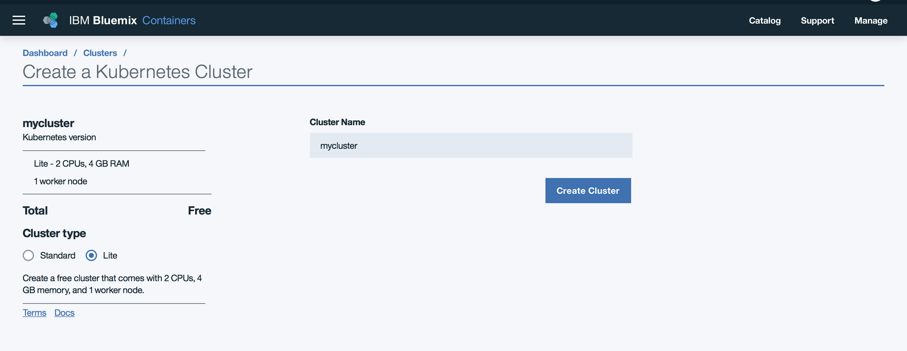
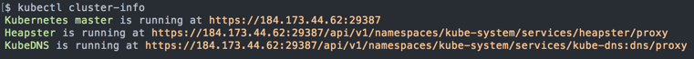
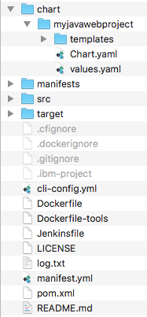
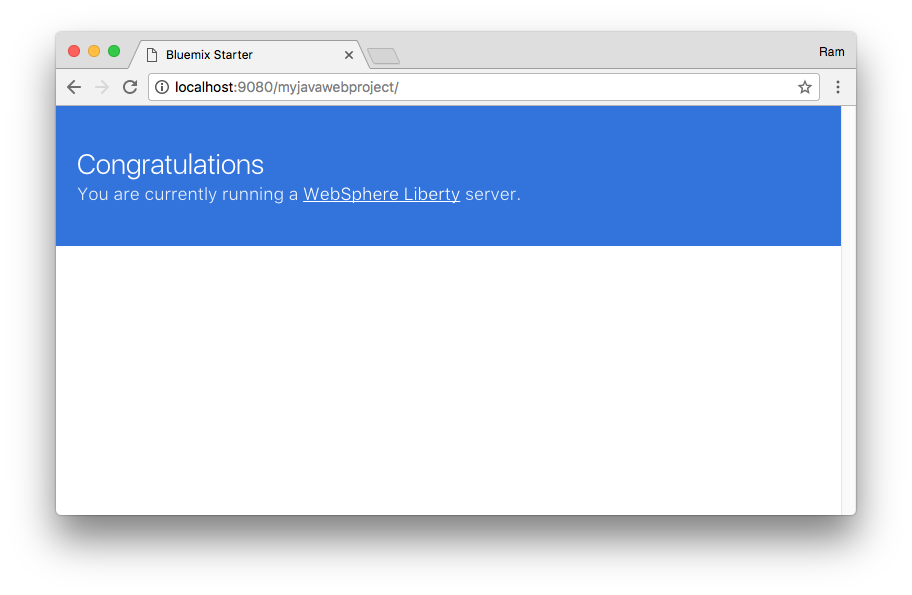
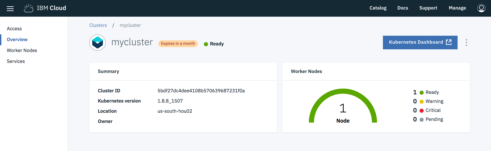
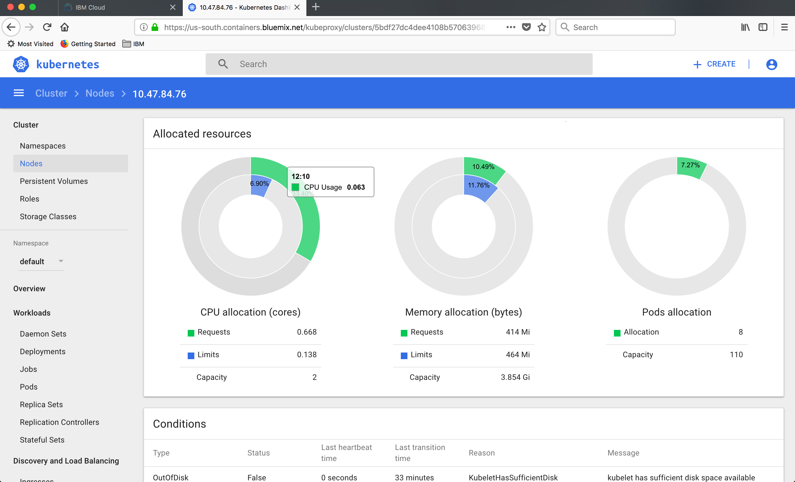

---
copyright:
  years: 2017, 2018
lastupdated: "2018-04-23"

---

{:shortdesc: .shortdesc}
{:new_window: target="_blank"}
{:codeblock: .codeblock}
{:screen: .screen}
{:tip: .tip}
{:pre: .pre}

# Deploy a scalable web application on Kubernetes

This tutorial walks you through how to scaffold a web application, run it locally in a container, and then deploy it to a Kubernetes cluster created with [{{site.data.keyword.containershort_notm}}](https://console.bluemix.net/containers-kubernetes/catalog/cluster). Additionally, you will learn how to bind a custom domain, monitor the health of the environment, and scale the application.
{:shortdesc}

Containers are a standard way to package apps and all their dependencies so that you can seamlessly move the apps between environments. Unlike virtual machines, containers do not bundle the operating system. Only the app code, run time, system tools, libraries, and settings are packaged inside containers. Containers are more lightweight, portable, and efficient than virtual machines.

For developers looking to kickstart their projects, the {{site.data.keyword.dev_cli_notm}} CLI enables rapid application development and deployment by generating template applications that you can run immediately or customize as the starter for your own solutions. In addition to generating starter application code, Docker container image and CloudFoundry assets, the code generators used by the dev CLI and web console generate files to aid deployment into [Kubernetes](https://kubernetes.io/) environments. The templates generate [Helm](https://github.com/kubernetes/helm) charts that describe the application’s initial Kubernetes deployment configuration, and are easily extended to create multi-image or complex deployments as needed.

## Objectives
{: #objectives}

* Scaffold a starter application.
* Deploy the application to the Kubernetes cluster.
* Bind a custom domain.
* Monitor the logs and health of the cluster.
* Scale Kubernetes pods.

## Services used
{: #services}

This tutorial uses the following runtimes and services:
* [{{site.data.keyword.registrylong_notm}}](https://console.bluemix.net/containers-kubernetes/launchRegistryView)
* [{{site.data.keyword.containershort_notm}}](https://console.bluemix.net/containers-kubernetes/catalog/cluster)

This tutorial may incur costs. Use the [Pricing Calculator](https://console.bluemix.net/pricing/) to generate a cost estimate based on your projected usage.

## Architecture
{: #architecture}

<p style="text-align: center;">

  
</p>

1. A developer generates a starter application with {{site.data.keyword.dev_cli_notm}}.
1. Building the application produces a Docker container image.
1. The image is pushed to a namespace in {{site.data.keyword.containershort_notm}}.
1. The application is deployed to a Kubernetes cluster.
1. Users access the application.

## Before you begin
{: #prereqs}

* [Set up the {{site.data.keyword.registrylong_notm}} CLI and your registry namespace](https://console.bluemix.net/docs/services/Registry/registry_setup_cli_namespace.html)
* [Install {{site.data.keyword.dev_cli_notm}}](https://console.bluemix.net/docs/cli/idt/setting_up_idt.html#add-cli) - Script to install docker, kubectl, helm, bx cli and required plug-ins
* [Understand the basics of Kubernetes](https://kubernetes.io/docs/tutorials/kubernetes-basics/)

## Create a Kubernetes cluster
{: #create_kube_cluster}

{{site.data.keyword.containershort_notm}} delivers powerful tools by combining Docker and Kubernetes technologies, an intuitive user experience, and built-in security and isolation to automate the deployment, operation, scaling, and monitoring of containerized apps in a cluster of compute hosts.

The major portion of this tutorial can be accomplished with a **Free** cluster. Two optional sections relating to Kubernetes Ingress and custom domain require a **Paid** cluster of type **Standard**.

1. Create a Kubernetes cluster from the [{{site.data.keyword.Bluemix}} catalog](https://console.bluemix.net/containers-kubernetes/launch). 

   For ease of use, check the configuration details like the number of CPUs, memory and the number of worker nodes you get with Lite and Standard plans.
   {:tip}

   
2. Select the **Cluster type** and click **Create Cluster** to provision a Kubernetes cluster.
3.  Check the status of your **Cluster** and **Worker Nodes** and wait for them to be **ready**.

### Configure kubectl and helm

In this step, you'll configure kubectl to point to your newly created cluster going forward. [kubectl](https://kubernetes.io/docs/user-guide/kubectl-overview/) is a command line tool that you use to interact with a Kubernetes cluster.

1. Use `bx login` to log in interactively. Provide the organization (org), region and space under which the cluster is created. You can reconfirm the details by running `bx target` command.
2. When the cluster is ready, retrieve the cluster configuration:
   ```bash
   bx cs cluster-config <cluster-name>
   ```
   {: pre}
3. Copy and paste the **export** command to set the KUBECONFIG environment variable as directed. To verify whether the KUBECONFIG environment variable is set properly or not, run the following command:
  `echo $KUBECONFIG`
4. Check that the `kubectl` command is correctly configured
   ```bash
   kubectl cluster-info
   ```
   {: pre}
   

5. [Helm](https://helm.sh/) helps you manage Kubernetes applications through Helm Charts, which helps define, install, and upgrade even the most complex Kubernetes application. In the next section, you will use the `bx dev` tooling to create an application. `bx dev` relies on Helm to deploy applications into your cluster. Initialize Helm in your cluster.
   ```bash
   helm init
   ```
   {: pre}
6. Upgrade helm by running:
   ```bash
   helm init --upgrade
   ```
   {: pre}

## Create a starter application
{: #create_application}

The `bx dev` tooling greatly cuts down on development time by generating application starters with all the necessary boilerplate, build and configuration code so that you can start coding business logic faster.

1. Start the `bx dev` wizard.
   ```
   bx dev create
   ```
   {: pre}
1. Select `Backend Service / Web App` > `Java - MicroProfile / JavaEE` > `Web App - Java MicroProfile / Java EE Basic` to create a Java starter. (To create a Node.js starter instead, use `Web App` > `Basic Web` > `Node` )
1. Enter a **name** for your project.
1. Enter unique **hostname** for your project. The host name is used if you deploy your application as a Cloud Foundry app <hostname>.mybluemix.net.
1. Do not add a DevOps toolchain, select **manual deployment**.
1. Do not add additional services.

This generates a starter application complete with the code and all the necessary configuration files for local development and deployment to cloud on Cloud Foundry or Kubernetes. For an overview of the files generated, see [Project Contents Documentation](https://console.bluemix.net/docs/cloudnative/projects/java_project_contents.html#java-project-files).



### Build the application

You can build and run the application as you normally would using `mvn` for java local development or `npm` for node development.  You can also build a docker image and run the application in a container to ensure consistent execution locally and on the cloud. Use the following steps to build your docker image.

1. Ensure your local Docker engine is started.
   ```
   docker ps
   ```
   {: pre}
2. Change to the generated project directory.
   ```
   cd <project name>
   ```
   {: pre}
3. Build the application.
   ```
   bx dev build
   ```
   {: pre}

   This might take a few minutes to run as all the application dependencies are downloaded and a Docker image, which contains your application and all the required environment, is built.

### Run the application locally

1. Run the container.
   ```
   bx dev run
   ```
   {: pre}

   This uses your local Docker engine to run the docker image that you built in the previous step.
2. After your container starts, go to `http://localhost:9080/<nameofproject>`. If you created a Node.js application, use port 3000.
  

## Deploy application to cluster
{: #deploy}

In this section, you first push the Docker image to the IBM Cloud private container registry, and then create a Kubernetes deployment pointing to that image.

1. Find your **namespace** by listing all the namespace in the registry.
   ```
   bx cr namespaces
   ```
   {: pre}
   If you have a namespace, make note of the name for use later. If you don't have one, create it.
   ```
   bx cr namespace-add <name>
   ```
   {: pre}
2. Find the **Container Registry** information by running.
   ```
   bx cr info
   ```
   {: pre}
3. Deploy to your Kubernetes cluster:
   ```
   bx dev deploy -t container
   ```
   {: pre}
4. When prompted, enter your **cluster name**.
5. Next, enter an **image name**.
   Use the following format: `<registry_url>/<namespace>/<projectname>`
   For example: `registry.ng.bluemix.net/mynamespace/myjavawebapp`.
6. Wait a few minutes for your application to be deployed. You will see the message 'Your app is hosted at http://worker-ip-address:portnumber/' when complete.
7. Access the application `http://worker-ip-address:portnumber/nameofproject`.


## Use the IBM-provided domain for your cluster
{: #ibm_domain}

In the previous step, the application was accessed with a not standard port. The service was exposed by way of Kubernetes NodePort feature.

Paid clusters come with an IBM-provided domain. This gives you a better option to expose applications with a proper URL and on standard HTTP/S ports.

Use Ingress to set up the cluster inbound connection to the service.


1. Identify your IBM-provided **Ingress domain**
   ```
   bx cs cluster-get <cluster-name>
   ```
   {: pre}
   to find
   ```
   Ingress subdomain:	mycluster.us-south.containers.mybluemix.net
   Ingress secret:		mycluster
   ```
   {: screen}
2. Create an Ingress file `ingress-ibmdomain.yml` pointing to your domain with support for HTTP and HTTPS. Use the following file as a template, replacing all the values wrapped in <> with the appropriate values from the above output.
   ```
   apiVersion: extensions/v1beta1
   kind: Ingress
   metadata:
     name: ingress-for-ibmdomain-http-and-https
   spec:
     tls:
     - hosts:
       -  <ingress-sub-domain>
       secretName: <ingress-secret>
     rules:
     - host: <ingress-sub-domain>
       http:
         paths:
         - path: /
           backend:
             serviceName: <service-name>
             servicePort: 9080
   ```
3. Deploy the Ingress
   ```
   kubectl apply -f ingress-ibmdomain.yml
   ```
   {: pre}
4. Access your application at `https://<ingress-sub-domain>/<nameofproject>`

## Use your own custom domain
{: #custom_domain}

To use your custom domain, you need to update your DNS records with either a CNAME record pointing to your IBM-provided domain or an A record pointing to the portable public IP address of the IBM-provided Ingress. Given a paid cluster comes with fixed IP addresses, an A record is a good option.

See [Using the Ingress controller with a custom domain](https://console.bluemix.net/docs/containers/cs_apps.html#custom_domain_cert) for more inforamation.

### with HTTP

1. Create an Ingress file `ingress-customdomain-http.yml` pointing to your domain:
   ```
   apiVersion: extensions/v1beta1
   kind: Ingress
   metadata:
     name: ingress-for-customdomain-http
   spec:
     rules:
     - host: <my-custom-domain.com>
       http:
         paths:
         - path: /
           backend:
             serviceName: <service-name>
             servicePort: 9080
   ```
2. Deploy the Ingress
   ```
   kubectl apply -f ingress-customdomain-http.yml
   ```
   {: pre}
3. Access your application at `http://<customdomain>/<nameofproject>`

### with HTTPS

If you were to try to access your application with HTTPS at this time `https://<customdomain>/<nameofproject>`, you will likely get a security warning from your web browser telling you the connection is not private. You would also get a 404 as the Ingress just configured would not know how to direct HTTPS traffic.

1. Obtain a trusted SSL certificate for your domain. You'll need the certificate and the key:
  https://console.bluemix.net/docs/containers/cs_apps.html#custom_domain_cert
   You can use [Let's Encrypt](https://letsencrypt.org/) to generate trusted certificate.
2. Save the cert and the key in base64 ascii format files.
3. Create a TLS secret to store the cert and the key:
   ```
   kubectl create secret tls my-custom-domain-secret-name --cert=<custom-domain.cert> --key=<custom-domain.key>
   ```
   {: pre}
4. Create an Ingress file `ingress-customdomain-https.yml` pointing to your domain:
   ```
   apiVersion: extensions/v1beta1
   kind: Ingress
   metadata:
     name: ingress-customdomain-https
   spec:
     tls:
     - hosts:
       - <my-custom-domain.com>
       secretName: <my-custom-domain-secret-name>
     rules:
     - host: <my-custom-domain.com>
       http:
         paths:
         - path: /
           backend:
             serviceName: <service-name>
             servicePort: 9080
   ```
5. Deploy the Ingress:
   ```
   kubectl apply -f ingress-customdomain-https.yml
   ```
   {: pre}
6. Access your application at `https://<customdomain>/<nameofproject>`.

## Monitor application health
{: #monitor_application}

1. To check the health of your application, navigate to [clusters](https://console.bluemix.net/containers-kubernetes/clusters) to see a list of clusters and click on the cluster you created above.
2. Click **Kubernetes Dashboard** to launch the dashboard in a new tab.
   
3. Select **Nodes** on the left pane, click the **Name** of the nodes and see the **Allocation Resources** to see the health of your nodes.
   
4. To review the application logs from the container, select **Pods**, **pod-name** and **Logs**.
5. To **ssh** into the container, identify your pod name from the previous step and run
   ```
   kubectl exec -it <pod-name> -- bash
   ```

## Scale Kubernetes pods
{: #scale_cluster}

As load increases on your application, you can manually increase the number of pod replicas in your deployment. Replicas are managed by a [ReplicaSet](https://kubernetes.io/docs/concepts/workloads/controllers/replicaset/). To scale the application to two replicas, run the following command:

   ```
   kubectl scale deployment <nameofproject>-deployment --replicas=2
   ```
    {: pre}

After a shortwhile, you will see two pods for your application in the Kubernetes dashboard (or with `kubectl get pods`). The Ingress controller in the cluster will handles the load balancing between the two replicas. Horizontal scaling can also be made automatic.

Refer to Kubernetes documentation for manual and automatic scaling:

   * [Scaling a deployment](https://kubernetes.io/docs/concepts/workloads/controllers/deployment/#scaling-a-deployment)
   * [Horizontal Pod Autoscaling](https://kubernetes.io/docs/tasks/run-application/horizontal-pod-autoscale-walkthrough/)

## Remove resources

* Delete the cluster or only delete the Kubernetes artifacts created for the application if you plan to reuse the cluster.

## Related content

* [IBM Container Service](https://console.bluemix.net/docs/containers/cs_planning.html#cs_planning)
* [IBM Cloud App Service](https://console.bluemix.net/docs/cloudnative/index.html#web-mobile)
